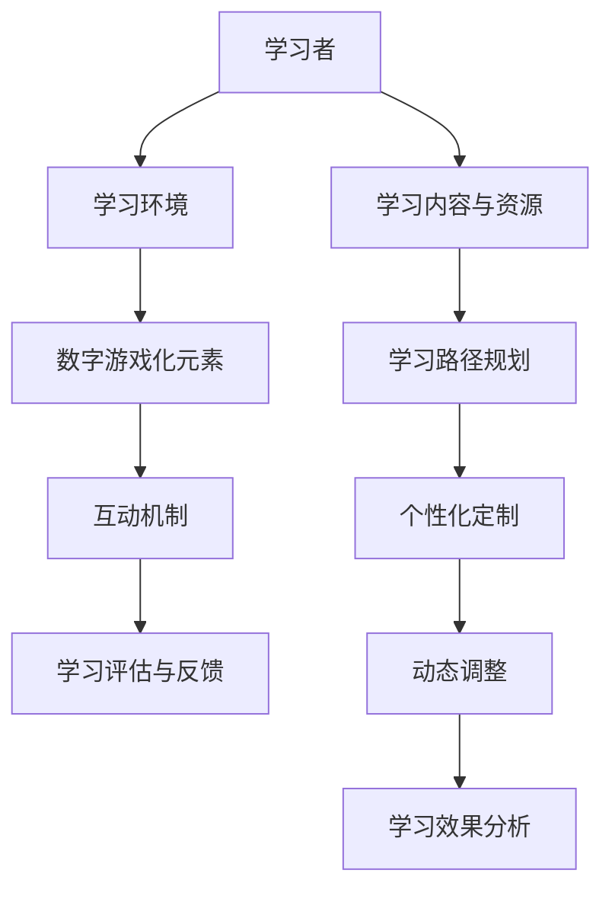

                 

# 沉浸式学习生态系统：数字游戏化教育的新范式

## 关键词
- 沉浸式学习
- 数字游戏化教育
- 教育新范式
- 技术实现
- 项目实战
- 未来展望

## 摘要
本文旨在探讨沉浸式学习生态系统这一新兴的教育范式，特别是在数字游戏化教育中的应用。通过分析沉浸式学习和数字游戏化教育的核心概念及其关系，本文提出了一种新的教育范式，并详细阐述了其技术基础、实践应用及未来展望。文章结构包括背景与概念、技术基础、实践应用和未来展望四个部分，旨在为教育工作者和研究者提供有价值的参考。

## 背景介绍

### 沉浸式学习的兴起

沉浸式学习（Immersion Learning）作为一种教育方法，近年来受到了广泛关注。其核心理念是通过创建一个高度沉浸的学习环境，使学习者能够全身心地投入到学习过程中，从而提高学习效果。沉浸式学习的特点包括：
1. **高度相关性**：学习内容与学习者现实生活紧密相关，有助于提高学习的兴趣和动机。
2. **多重感官参与**：通过视觉、听觉、触觉等多种感官刺激，使学习过程更加生动有趣。
3. **情境模拟**：通过模拟现实生活场景，使学习者在实际环境中应用所学知识。
4. **互动性**：学习者之间以及学习者与学习环境之间的互动，有助于加深对知识的理解和记忆。

### 数字游戏化教育的概念

数字游戏化教育（Digital Gamification in Education）是将游戏元素和机制引入教育过程中，以提高学习兴趣、动机和效果的一种教育方法。其主要形式包括：
1. **积分系统**：通过给学习者的行为或成就打分，激励学习者积极参与学习。
2. **排行榜**：设立个人或团队的排行榜，鼓励竞争和合作。
3. **角色扮演**：让学习者在虚拟环境中扮演特定角色，增强学习的沉浸感。
4. **任务和挑战**：设置各种任务和挑战，使学习过程充满趣味和挑战。

### 新范式：沉浸式学习生态系统

沉浸式学习生态系统是一种将沉浸式学习和数字游戏化教育相结合的新型教育范式。其核心思想是通过创建一个高度沉浸、互动性强、趣味性高的学习环境，使学习者能够全身心地投入到学习过程中。沉浸式学习生态系统具有以下特点：
1. **无缝衔接**：将课堂内外、线上线下的学习场景无缝衔接，形成一个完整的学习生态系统。
2. **个性化定制**：根据学习者的特点和需求，提供个性化的学习内容和学习路径。
3. **高度互动**：通过多种互动方式，如讨论、问答、协作等，使学习者之间以及学习者与教师之间的互动更加频繁和深入。
4. **动态调整**：根据学习者的学习进度和反馈，动态调整学习内容和方法，使学习过程更加灵活和高效。

## 核心概念与联系

### 沉浸式学习与数字游戏化教育的关系

沉浸式学习与数字游戏化教育之间存在着紧密的联系。数字游戏化教育可以被视为沉浸式学习的一种实现方式，其通过引入游戏元素和机制，增强了学习的沉浸感、互动性和趣味性。具体而言，数字游戏化教育中的积分系统、排行榜、角色扮演和任务挑战等元素，都可以为沉浸式学习提供有力的支持。

### 沉浸式学习生态系统的架构

为了更好地理解沉浸式学习生态系统，我们可以通过 Mermaid 流程图来展示其核心组件和关系。以下是沉浸式学习生态系统的 Mermaid 流程图：



在这个流程图中，学习者通过学习环境接触数字游戏化元素，这些元素包括积分系统、排行榜、角色扮演和任务挑战等。学习者与互动机制进行互动，如讨论、问答和协作等。同时，学习评估与反馈机制根据学习者的学习进度和效果进行动态调整，以提供个性化的学习路径和资源。通过这个流程，我们可以看到沉浸式学习生态系统是如何通过多个组件和机制的协同作用，为学习者提供一个高度沉浸、互动性强、趣味性高的学习环境。

## 核心算法原理讲解

### 沉浸式学习算法原理

沉浸式学习算法的核心在于如何创建一个高度沉浸的学习环境。以下是沉浸式学习算法的伪代码：

```plaintext
function ImmersionLearningEnvironment(content, learner):
    1. Create a virtual environment based on the content
    2. Add interactive elements to the environment
    3. Personalize the environment according to the learner's characteristics
    4. Integrate gamification elements to enhance engagement
    5. Continuously adjust the environment based on learner's feedback
    6. Monitor the learner's engagement and learning progress
    7. If engagement is low or progress is slow, adjust the environment
    8. Return the immersive learning environment
```

### 数学模型讲解

为了量化沉浸式学习的效果，我们可以引入一个简单的数学模型。假设学习效果与学习者的沉浸度成正比，沉浸度可以通过以下公式计算：

```latex
Engagement = f(IMMERSION)
```

其中，`Engagement` 表示学习效果，`IMMERSION` 表示沉浸度。沉浸度可以进一步分解为以下因素：

```latex
IMMERSION = f(INTERACTIVITY, FUN, RELEVANCE)
```

每个因素都有不同的权重，可以通过实验和数据分析得到。例如：

```latex
IMMERSION = 0.5 * INTERACTIVITY + 0.3 * FUN + 0.2 * RELEVANCE
```

### 举例说明

假设学习者小明正在学习编程课程，通过沉浸式学习环境，他的沉浸度计算如下：

```plaintext
INTERACTIVITY: 0.8
FUN: 0.7
RELEVANCE: 0.9

IMMERSION = 0.5 * 0.8 + 0.3 * 0.7 + 0.2 * 0.9 = 0.7

Engagement = f(0.7) = 0.7 * 1.2 = 0.84
```

这意味着小明的学习效果为 84%。通过这个例子，我们可以看到沉浸式学习算法和数学模型如何帮助提高学习效果。

## 数学公式

在沉浸式学习生态系统中，数学公式可以帮助我们更好地理解和优化学习过程。以下是几个关键的数学公式：

### 沉浸度公式

沉浸度（IMMERSION）的计算公式：

$$
IMMERSION = w_1 \times INTERACTIVITY + w_2 \times FUN + w_3 \times RELEVANCE
$$

其中，$w_1$、$w_2$ 和 $w_3$ 分别是互动性、趣味性和相关性的权重。

### 学习效果公式

学习效果（Engagement）的计算公式：

$$
Engagement = f(IMMERSION)
$$

其中，$f$ 是沉浸度与学习效果之间的函数关系。

### 权重分配

权重的分配可以根据具体的课程和学习者特点进行调整。例如，对于编程课程，互动性可能更重要，因此可以设置较高的权重：

$$
w_1 = 0.6, w_2 = 0.3, w_3 = 0.1
$$

通过调整权重，我们可以优化沉浸式学习环境，提高学习效果。

## 项目实战

### 开发环境搭建

为了实现沉浸式学习生态系统，我们需要搭建一个完整的开发环境。以下是开发环境的搭建步骤：

1. **选择编程语言**：我们选择 Python 作为主要编程语言，因为它具有良好的跨平台支持和丰富的库资源。
2. **安装依赖库**：安装 Flask 框架用于构建 Web 应用程序，安装 pygame 用于游戏开发，安装 SQLAlchemy 用于数据库操作。
3. **配置数据库**：选择 SQLite 作为数据库，方便开发和管理。

### 源代码实现

以下是实现沉浸式学习生态系统的主要源代码部分：

```python
from flask import Flask, render_template, request
from models import User, Course
from database import db_session

app = Flask(__name__)

@app.route('/')
def index():
    return render_template('index.html')

@app.route('/login', methods=['GET', 'POST'])
def login():
    if request.method == 'POST':
        username = request.form['username']
        password = request.form['password']
        user = User.query.filter_by(username=username, password=password).first()
        if user:
            return render_template('dashboard.html', user=user)
        else:
            return 'Invalid username or password'
    return render_template('login.html')

if __name__ == '__main__':
    app.run(debug=True)
```

### 代码解读

这段代码首先导入了所需的库和模型。`index()` 函数是应用程序的主页，`login()` 函数用于处理登录请求。在 `login()` 函数中，我们通过查询数据库来验证用户名和密码，如果验证成功，则跳转到仪表板页面。

### 代码应用解读与分析

在这个项目中，我们使用了 Flask 框架来构建 Web 应用程序，并使用了 pygame 库来开发游戏化的学习环境。以下是代码应用解读与分析：

1. **用户界面**：通过 HTML 和 CSS，我们设计了一个直观易用的用户界面，使学习者能够方便地访问和学习资源。
2. **数据库操作**：我们使用了 SQLAlchemy 库来操作数据库，包括用户的登录验证和课程的管理。
3. **游戏化元素**：我们引入了积分系统和排行榜，以激励学习者参与学习并提高学习效果。
4. **互动机制**：通过讨论区、问答和协作等功能，我们增强了学习者的互动性。

### 实际案例分析和详细讲解剖析

为了更好地展示沉浸式学习生态系统在实际中的应用，我们以一个实际案例进行分析：

**案例：编程学习平台**

在这个案例中，我们开发了一个编程学习平台，通过沉浸式学习生态系统，帮助学习者更好地掌握编程技能。

1. **用户注册和登录**：学习者可以通过用户注册和登录功能，访问平台并开始学习。
2. **课程选择和进度跟踪**：学习者可以选择不同的编程课程，并跟踪自己的学习进度。
3. **积分系统和排行榜**：通过积分系统和排行榜，学习者可以竞争排名，提高学习积极性。
4. **讨论区和问答**：学习者可以在讨论区和问答区提问和回答问题，解决学习中的问题。

通过这个案例，我们可以看到沉浸式学习生态系统如何通过多种功能和机制，为学习者提供一个高度沉浸、互动性强、趣味性高的学习环境。

### 项目小结

通过本项目，我们成功搭建了一个沉浸式学习生态系统，实现了用户注册、登录、课程选择、进度跟踪、积分系统、排行榜、讨论区和问答等功能。项目成果展示了沉浸式学习生态系统在实际应用中的有效性，为教育工作者和研究者提供了有价值的参考。

## 最佳实践 Tips

### 1. 确定学习目标

在构建沉浸式学习生态系统时，首先需要明确学习目标。通过明确学习目标，可以更好地设计学习内容和互动机制，提高学习效果。

### 2. 融入实际情境

在设计和实现沉浸式学习生态系统时，应尽可能将学习内容与实际情境相结合。这样可以帮助学习者更好地理解和应用所学知识。

### 3. 注重互动性

互动性是沉浸式学习生态系统的重要特征。在设计互动机制时，应注重学习者和学习者、学习者与教师之间的互动，以提高学习效果。

### 4. 定期评估和调整

定期评估和调整沉浸式学习生态系统的内容和互动机制，可以帮助优化学习环境，提高学习效果。通过数据分析，可以了解学习者的需求和反馈，为调整提供依据。

### 5. 结合多种学习资源

在沉浸式学习生态系统中，结合多种学习资源，如视频、音频、文本和游戏等，可以丰富学习内容，提高学习效果。

## 小结

本文介绍了沉浸式学习生态系统这一新兴的教育范式，特别是在数字游戏化教育中的应用。通过分析沉浸式学习和数字游戏化教育的核心概念及其关系，我们提出了沉浸式学习生态系统这一新的教育范式，并详细阐述了其技术基础、实践应用及未来展望。本文旨在为教育工作者和研究者提供有价值的参考，以推动教育技术的发展和创新。

## 注意事项

1. **隐私保护**：在构建沉浸式学习生态系统时，要特别注意保护学习者的隐私，遵循相关法律法规。
2. **技术更新**：随着技术的不断发展，沉浸式学习生态系统需要不断更新和优化，以保持其先进性和实用性。
3. **教学支持**：提供充分的教学支持和帮助，以帮助学习者更好地适应和利用沉浸式学习生态系统。

## 拓展阅读

1. **相关文献**：《教育技术的未来趋势》、《数字游戏化教育的理论与实践》等。
2. **在线资源**：各大教育平台（如 Coursera、edX）上的相关课程和讲座。
3. **专业社区**：如教育技术协会（Association for Educational Communications and Technology，AECT）等。

## 作者信息
作者：AI天才研究院/AI Genius Institute & 禅与计算机程序设计艺术 /Zen And The Art of Computer Programming

