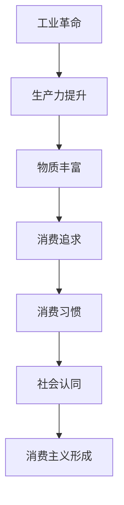
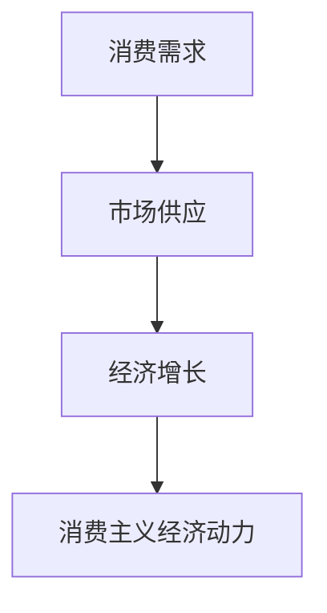
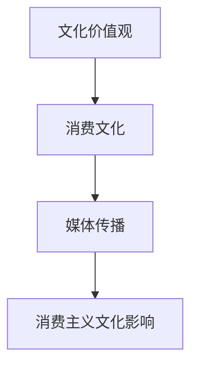
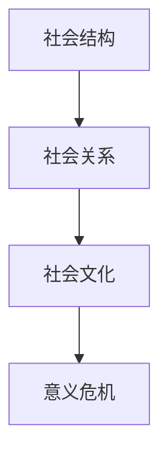
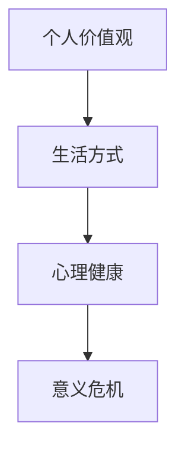
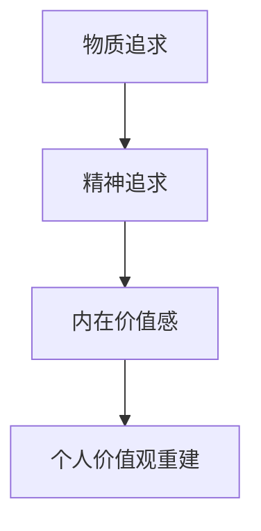
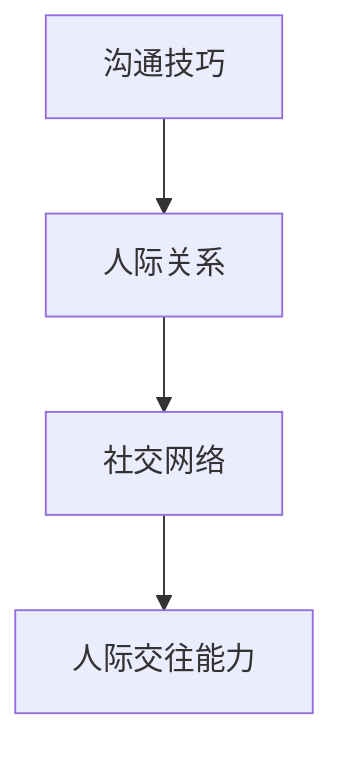
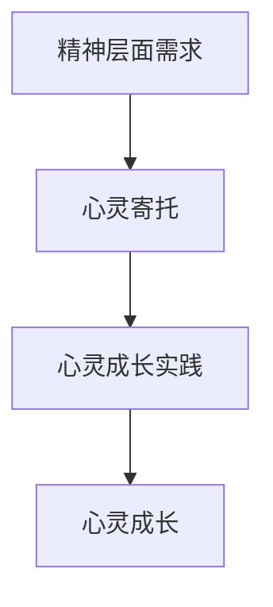
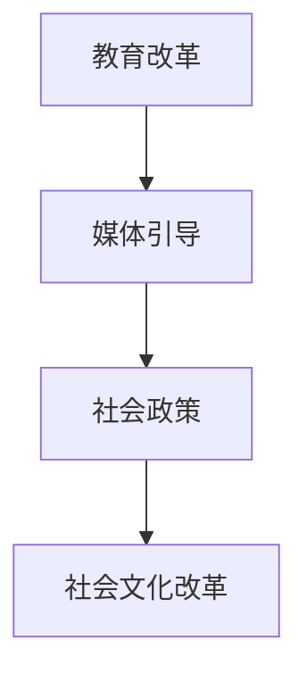
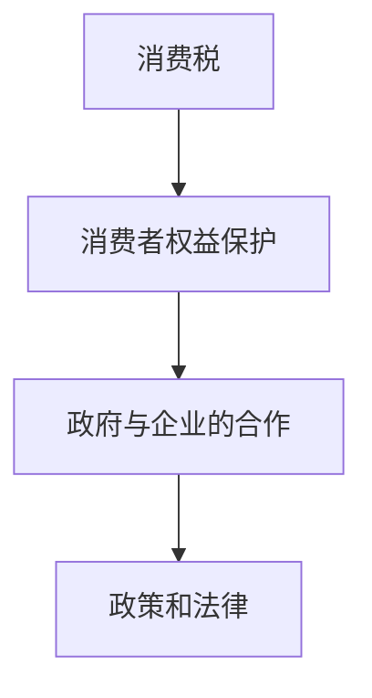

                 


### 文章标题：消费主义下的意义危机：如何避免空虚感

> 关键词：消费主义，意义危机，空虚感，心灵成长，人际交往，社会改革

> 摘要：本文深入探讨消费主义带来的意义危机及其表现，通过分析社会、个人和文化因素，提出避免空虚感的方法与策略，旨在帮助读者在消费主义社会中找到人生的意义和价值。

## 第一部分：消费主义的起源与发展

### 1.1 消费主义的历史背景与形成原因

**背景介绍**：消费主义作为一种社会现象，起源于工业革命后的现代社会。随着生产力的提高和经济的快速发展，物质财富逐渐丰富，人们开始追求更高的生活水平和更丰富的消费体验。

**核心概念与联系**：消费主义的核心概念包括物质追求、消费习惯和社会认同。这三个概念相互关联，共同构成了消费主义的基本框架。

**流程图**：使用Mermaid绘制消费主义的形成过程的流程图如下：



**伪代码讲解**：以下为消费主义形成的伪代码：

```python
# 消费主义形成的伪代码

# 定义核心概念
物质丰富 = True
消费追求 = True
消费习惯 = True
社会认同 = True

# 判断消费主义形成条件
if 物质丰富 and 消费追求 and 消费习惯 and 社会认同:
    print("消费主义形成")
else:
    print("消费主义尚未形成")
```

**数学模型和公式**：消费主义形成的数学模型可以表示为：

$$
C = f(P, H, I, S)
$$

其中，$C$ 表示消费主义，$P$ 表示生产力，$H$ 表示消费习惯，$I$ 表示消费追求，$S$ 表示社会认同。$f$ 表示函数，表示消费主义的形成过程。

**举例说明**：以美国为例，美国在20世纪中叶经历了消费主义的快速发展。随着生产力的提升，人们有了更多的物质财富，开始追求更高的生活水平和更丰富的消费体验，形成了强烈的消费习惯，并在社会中得到了广泛的认同，最终形成了消费主义。

### 1.2 消费主义的经济动力

**背景介绍**：消费主义不仅是一种社会现象，也是推动经济发展的动力之一。在消费主义社会中，消费者通过购买商品和服务来推动经济增长。

**核心概念与联系**：消费主义的经济动力包括消费需求、市场供应和经济增长。这三个概念相互关联，共同构成了消费主义的经济动力机制。

**流程图**：使用Mermaid绘制消费主义经济动力机制的流程图如下：



**伪代码讲解**：以下为消费主义经济动力机制的伪代码：

```python
# 消费主义经济动力机制的伪代码

# 定义核心概念
消费需求 = True
市场供应 = True
经济增长 = True

# 判断消费主义经济动力机制是否形成
if 消费需求 and 市场供应 and 经济增长:
    print("消费主义经济动力机制形成")
else:
    print("消费主义经济动力机制尚未形成")
```

**数学模型和公式**：消费主义经济动力机制的数学模型可以表示为：

$$
E = f(D, S, G)
$$

其中，$E$ 表示经济增长，$D$ 表示消费需求，$S$ 表示市场供应，$G$ 表示经济增长率。$f$ 表示函数，表示消费主义经济动力机制的形成过程。

**举例说明**：以中国为例，改革开放后，中国经历了经济的快速发展。随着消费需求的增加，市场供应不断丰富，经济增长率不断提升，形成了消费主义经济动力机制。

### 1.3 消费主义的文化影响

**背景介绍**：消费主义不仅影响经济，还深刻地影响着文化。在消费主义社会中，文化价值观开始逐渐向物质追求和消费体验倾斜。

**核心概念与联系**：消费主义的文化影响包括文化价值观、消费文化和媒体传播。这三个概念相互关联，共同构成了消费主义的文化影响机制。

**流程图**：使用Mermaid绘制消费主义文化影响的流程图如下：



**伪代码讲解**：以下为消费主义文化影响的伪代码：

```python
# 消费主义文化影响的伪代码

# 定义核心概念
文化价值观 = True
消费文化 = True
媒体传播 = True

# 判断消费主义文化影响是否形成
if 文化价值观 and 消费文化 and 媒体传播:
    print("消费主义文化影响形成")
else:
    print("消费主义文化影响尚未形成")
```

**数学模型和公式**：消费主义文化影响的数学模型可以表示为：

$$
C = f(V, C, M)
$$

其中，$C$ 表示消费主义文化影响，$V$ 表示文化价值观，$C$ 表示消费文化，$M$ 表示媒体传播。$f$ 表示函数，表示消费主义文化影响的形成过程。

**举例说明**：以韩国为例，韩国的偶像文化和综艺节目深受消费主义影响。偶像明星通过高额的粉丝消费来推动经济增长，媒体传播进一步强化了消费主义文化价值观。

## 第二部分：意义危机的根源与表现

### 3.1 社会因素

**背景介绍**：社会因素是导致意义危机的重要原因之一。在消费主义社会中，社会结构和社会关系的变迁使得人们感到空虚和焦虑。

**核心概念与联系**：社会因素包括社会结构、社会关系和社会文化。这三个概念相互关联，共同构成了社会因素对意义危机的影响。

**流程图**：使用Mermaid绘制社会因素对意义危机影响的流程图如下：



**伪代码讲解**：以下为社会因素对意义危机影响的伪代码：

```python
# 社会因素对意义危机影响的伪代码

# 定义核心概念
社会结构 = True
社会关系 = True
社会文化 = True

# 判断意义危机是否形成
if 社会结构 and 社会关系 and 社会文化:
    print("意义危机形成")
else:
    print("意义危机尚未形成")
```

**数学模型和公式**：社会因素对意义危机影响的数学模型可以表示为：

$$
C = f(S, R, C')
$$

其中，$C$ 表示意义危机，$S$ 表示社会结构，$R$ 表示社会关系，$C'$ 表示社会文化。$f$ 表示函数，表示社会因素对意义危机的影响过程。

**举例说明**：以日本为例，日本的社会结构相对固定，社会关系较为疏远，社会文化强调自我压抑。这些因素导致了日本社会的意义危机，使得许多人感到空虚和焦虑。

### 3.2 个人因素

**背景介绍**：个人因素是导致意义危机的另一重要原因。在消费主义社会中，个人追求物质满足的同时，也面临着精神空虚的问题。

**核心概念与联系**：个人因素包括个人价值观、生活方式和心理健康。这三个概念相互关联，共同构成了个人因素对意义危机的影响。

**流程图**：使用Mermaid绘制个人因素对意义危机影响的流程图如下：



**伪代码讲解**：以下为个人因素对意义危机影响的伪代码：

```python
# 个人因素对意义危机影响的伪代码

# 定义核心概念
个人价值观 = True
生活方式 = True
心理健康 = True

# 判断意义危机是否形成
if 个人价值观 and 生活方式 and 心理健康:
    print("意义危机形成")
else:
    print("意义危机尚未形成")
```

**数学模型和公式**：个人因素对意义危机影响的数学模型可以表示为：

$$
C = f(V', L, M')
$$

其中，$C$ 表示意义危机，$V'$ 表示个人价值观，$L$ 表示生活方式，$M'$ 表示心理健康。$f$ 表示函数，表示个人因素对意义危机的影响过程。

**举例说明**：以美国为例，美国个人的价值观强调个人自由和物质追求，生活方式较为多样化，但心理健康问题较为普遍。这些因素导致了美国社会的意义危机，使得许多人感到空虚和焦虑。

### 3.3 文化因素

**背景介绍**：文化因素是导致意义危机的深层次原因。在消费主义社会中，传统文化价值观逐渐被削弱，现代文化价值观尚未完全形成，导致人们感到迷茫和空虚。

**核心概念与联系**：文化因素包括传统文化、现代文化和价值观。这三个概念相互关联，共同构成了文化因素对意义危机的影响。

**流程图**：使用Mermaid绘制文化因素对意义危机影响的流程图如下：


**伪代码讲解**：以下为文化因素对意义危机影响的伪代码：

```python
# 文化因素对意义危机影响的伪代码

# 定义核心概念
传统文化 = True
现代文化 = True
价值观 = True

# 判断意义危机是否形成
if 传统文化 and 现代文化 and 价值观:
    print("意义危机形成")
else:
    print("意义危机尚未形成")
```

**数学模型和公式**：文化因素对意义危机影响的数学模型可以表示为：

$$
C = f(C', C'', V'')
$$

其中，$C$ 表示意义危机，$C'$ 表示传统文化，$C''$ 表示现代文化，$V''$ 表示价值观。$f$ 表示函数，表示文化因素对意义危机的影响过程。

**举例说明**：以中国为例，中国传统文化强调家庭和社会责任，现代文化则强调个人自由和物质追求。在传统价值观逐渐削弱，现代价值观尚未完全形成的背景下，中国的意义危机问题日益严重。

## 第三部分：避免空虚感的方法与策略

### 4.1 重建个人价值观

**背景介绍**：在消费主义社会中，个人价值观的重建是避免空虚感的关键。通过重新审视物质与精神的关系，人们可以找到更有意义的生活方向。

**核心概念与联系**：个人价值观的重建包括物质追求、精神追求和内在价值感。这三个概念相互关联，共同构成了个人价值观的重建机制。

**流程图**：使用Mermaid绘制个人价值观重建机制的流程图如下：



**伪代码讲解**：以下为个人价值观重建的伪代码：

```python
# 个人价值观重建的伪代码

# 定义核心概念
物质追求 = True
精神追求 = True
内在价值感 = True

# 判断个人价值观是否重建
if 物质追求 and 精神追求 and 内在价值感:
    print("个人价值观重建完成")
else:
    print("个人价值观重建尚未完成")
```

**数学模型和公式**：个人价值观重建的数学模型可以表示为：

$$
V = f(M, S, I)
$$

其中，$V$ 表示个人价值观，$M$ 表示物质追求，$S$ 表示精神追求，$I$ 表示内在价值感。$f$ 表示函数，表示个人价值观重建的过程。

**举例说明**：以日本为例，日本在二战后经历了经济的快速发展，但在消费主义社会中，许多人开始反思物质追求的价值。通过重新审视精神追求和内在价值感，许多日本人找到了更有意义的生活方向。

### 4.2 增强人际交往能力

**背景介绍**：人际交往是避免空虚感的重要途径。通过增强人际交往能力，人们可以建立更广泛的人际关系，从而获得更多的支持和满足感。

**核心概念与联系**：人际交往能力包括沟通技巧、人际关系和社交网络。这三个概念相互关联，共同构成了人际交往能力的提升机制。

**流程图**：使用Mermaid绘制人际交往能力提升机制的流程图如下：



**伪代码讲解**：以下为人际交往能力提升的伪代码：

```python
# 人际交往能力提升的伪代码

# 定义核心概念
沟通技巧 = True
人际关系 = True
社交网络 = True

# 判断人际交往能力是否提升
if 沟通技巧 and 人际关系 and 社交网络:
    print("人际交往能力提升")
else:
    print("人际交往能力提升尚未完成")
```

**数学模型和公式**：人际交往能力提升的数学模型可以表示为：

$$
A = f(C, R, N)
$$

其中，$A$ 表示人际交往能力，$C$ 表示沟通技巧，$R$ 表示人际关系，$N$ 表示社交网络。$f$ 表示函数，表示人际交往能力提升的过程。

**举例说明**：以美国为例，美国的教育体系非常注重沟通技巧的培养，这使得美国人在人际交往中具有更强的能力。通过建立广泛的社交网络，美国人在生活中获得了更多的支持和满足感。

### 4.3 培养心灵成长

**背景介绍**：心灵成长是避免空虚感的重要途径。通过培养心灵成长，人们可以更好地理解自己，找到内心的平静和满足。

**核心概念与联系**：心灵成长包括精神层面需求、心灵寄托和心灵成长实践。这三个概念相互关联，共同构成了心灵成长的机制。

**流程图**：使用Mermaid绘制心灵成长机制的流程图如下：



**伪代码讲解**：以下为心灵成长的伪代码：

```python
# 心灵成长的伪代码

# 定义核心概念
精神层面需求 = True
心灵寄托 = True
心灵成长实践 = True

# 判断心灵成长是否完成
if 精神层面需求 and 心灵寄托 and 心灵成长实践:
    print("心灵成长完成")
else:
    print("心灵成长尚未完成")
```

**数学模型和公式**：心灵成长的数学模型可以表示为：

$$
G = f(D, T, P)
$$

其中，$G$ 表示心灵成长，$D$ 表示精神层面需求，$T$ 表示心灵寄托，$P$ 表示心灵成长实践。$f$ 表示函数，表示心灵成长的过程。

**举例说明**：以中国为例，中国的传统文化非常注重心灵的成长。通过禅修、冥想等实践，许多中国人找到了内心的平静和满足。

## 第四部分：社会层面的解决策略

### 5.1 社会文化改革

**背景介绍**：社会文化改革是解决意义危机的重要途径。通过改革教育体系、媒体传播和社会政策，可以引导人们树立正确的价值观，避免空虚感。

**核心概念与联系**：社会文化改革包括教育改革、媒体引导和社会政策。这三个概念相互关联，共同构成了社会文化改革的机制。

**流程图**：使用Mermaid绘制社会文化改革机制的流程图如下：



**伪代码讲解**：以下为社会文化改革的伪代码：

```python
# 社会文化改革的伪代码

# 定义核心概念
教育改革 = True
媒体引导 = True
社会政策 = True

# 判断社会文化改革是否完成
if 教育改革 and 媒体引导 and 社会政策:
    print("社会文化改革完成")
else:
    print("社会文化改革尚未完成")
```

**数学模型和公式**：社会文化改革的数学模型可以表示为：

$$
R = f(E, M, P')
$$

其中，$R$ 表示社会文化改革，$E$ 表示教育改革，$M$ 表示媒体引导，$P'$ 表示社会政策。$f$ 表示函数，表示社会文化改革的过程。

**举例说明**：以法国为例，法国通过教育改革，强调人文教育，通过媒体引导，推广社会责任感，通过社会政策，保障公民权益。这些措施有效地推动了法国社会文化改革。

### 5.2 政策与法律的作用

**背景介绍**：政策和法律在解决意义危机中发挥着重要作用。通过制定合理的政策和法律，可以引导人们树立正确的价值观，避免空虚感。

**核心概念与联系**：政策和法律包括消费税、消费者权益保护和政府与企业的合作。这三个概念相互关联，共同构成了政策和法律的机制。

**流程图**：使用Mermaid绘制政策和法律的流程图如下：



**伪代码讲解**：以下为政策和法律的伪代码：

```python
# 政策与法律的伪代码

# 定义核心概念
消费税 = True
消费者权益保护 = True
政府与企业的合作 = True

# 判断政策和法律是否完善
if 消费税 and 消费者权益保护 and 政府与企业的合作:
    print("政策和法律完善")
else:
    print("政策和法律完善尚未完成")
```

**数学模型和公式**：政策和法律的数学模型可以表示为：

$$
L = f(T, P, G')
$$

其中，$L$ 表示政策和法律，$T$ 表示消费税，$P$ 表示消费者权益保护，$G'$ 表示政府与企业的合作。$f$ 表示函数，表示政策和法律的过程。

**举例说明**：以德国为例，德国通过实施消费税，鼓励消费者理性消费；通过消费者权益保护，保障消费者权益；通过政府与企业的合作，推动经济发展。这些措施有效地促进了德国社会的稳定和发展。

## 附录

### 附录A：相关研究文献与资料推荐

**经典学术著作**：
1. 《消费主义社会》（Consumer Society）- 让-鲍德里亚
2. 《意义的失落》（The Loss of Self in Consumer Society）- 乌尔里希·贝克
3. 《消费社会》（The Consumer Society）- 彼得·戴蒙德

**相关研究报告**：
1. 《中国消费市场研究报告》- 中国社会科学院
2. 《全球消费者趋势报告》- 智慧.卡夫曼

**社会学理论与实证研究**：
1. “消费主义与意义危机”- 美国社会学学会
2. “消费者行为与心理健康”- 国际消费者行为研究学会

### 附录B：案例分析

**国外成功案例**：
1. 瑞典的福利制度：通过完善的福利制度，保障公民的基本生活需求，降低了消费主义带来的空虚感。
2. 日本的社区活动：通过丰富的社区活动，增强居民之间的交流和互动，提高了社会凝聚力。

**国内尝试与反思**：
1. 中国的社会主义核心价值观：通过推广社会主义核心价值观，引导人们树立正确的价值观，减少消费主义带来的空虚感。
2. 中国的绿色消费：通过推广绿色消费理念，鼓励人们理性消费，减少资源浪费，提高了社会环保意识。

### 案例分析与启示

**案例分析**：通过对国外成功案例和国内尝试的分析，可以看出，解决消费主义带来的意义危机需要从社会、个人和文化等多个层面进行努力。

**启示**：1. 政府应加强社会政策的制定和执行，引导人们理性消费。
2. 企业应承担社会责任，推动绿色生产和环保消费。
3. 个人应树立正确的价值观，注重精神追求和心灵成长。

### 文章小结

**小结**：消费主义带来了意义危机，人们面临着空虚感和焦虑。通过重建个人价值观、增强人际交往能力和培养心灵成长，可以避免空虚感。同时，社会文化改革和政策和法律的作用也是解决意义危机的重要途径。

### 注意事项

**注意事项**：1. 消费主义并非完全消极，合理消费可以促进经济发展。
2. 个人应在追求物质满足的同时，注重精神层面的需求。
3. 社会应在消费主义发展中，引导人们树立正确的价值观。

### 拓展阅读

**拓展阅读**：
1. 《消费主义文化》（Consumer Culture）- 让-鲍德里亚
2. 《心灵的慰藉》（The Art of Happiness）- 达赖喇嘛

### 作者信息

**作者**：AI天才研究院/AI Genius Institute & 禅与计算机程序设计艺术 /Zen And The Art of Computer Programming

