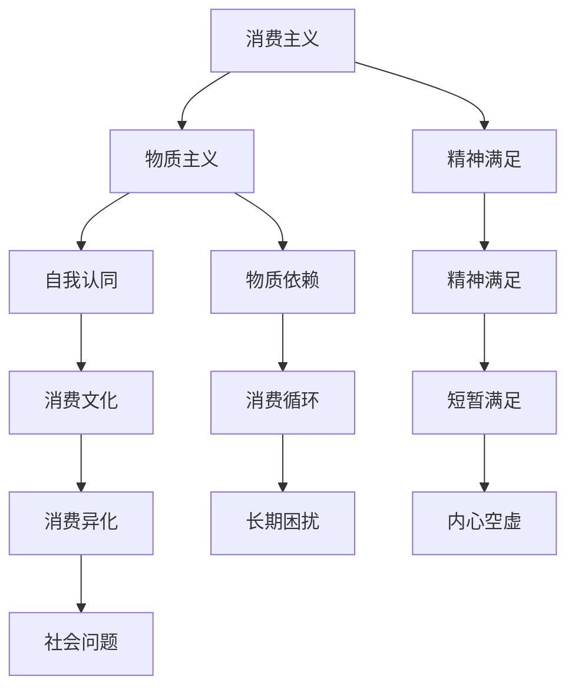

                 

### 背景介绍

在现代社会的快节奏生活中，消费主义文化日益渗透到各个领域，成为一种主导性的价值观。消费主义，简单来说，就是通过物质消费来实现个人满足和社会认同的一种文化现象。在这种文化背景下，人们追求物质财富和享受，视拥有高端产品、奢侈品以及各种服务为成功的标志。

#### 消费主义的现状

根据联合国统计，全球消费支出在2020年达到了约30万亿美元，其中超过一半来自于发达国家。尤其是在互联网的推动下，电子商务、社交媒体和数字广告进一步加速了消费主义的蔓延。无数品牌和商家通过大数据分析和个性化营销，不断刺激消费者的购买欲望，使得消费行为变得频繁和普遍。

#### 消费主义的影响

消费主义对个人和社会的影响是多方面的。对个人而言，它可能导致物质依赖和虚荣心理，使人们陷入无休止的消费循环中，无法获得真正的满足感。对社会而言，过度消费加剧了资源浪费和环境破坏，引发了诸多社会问题，如债务危机、收入不平等和消费异化。

#### 消费主义的挑战

面对消费主义的泛滥，人们开始反思其负面影响，并寻求新的价值转向。越来越多的人认识到，单纯追求物质享受并不能带来长期的幸福和满足。因此，如何从物质追求转向精神满足，成为当下社会的一个重要议题。

### 核心概念与联系

为了深入理解消费主义的反思与超越，我们需要明确几个核心概念，并探讨它们之间的联系。

#### 消费主义与物质主义

消费主义和物质主义密切相关。物质主义是指个体对物质财富和物质的追求，认为物质拥有是幸福的象征。消费主义则是物质主义在现代社会的一种表现，通过大规模生产和广告营销，推动人们不断购买物质产品。

#### 物质主义与精神满足

物质主义与精神满足之间的矛盾是消费主义反思的核心。精神满足通常指的是内心深处的平和、喜悦和自我实现，而物质主义往往只能提供短暂的满足感。这种矛盾导致人们陷入对更多物质的追求，而忽视了精神层面的需求。

#### 自我认同与消费文化

自我认同是个体对自己身份的认知和理解。消费文化则通过商品和品牌塑造自我认同，使得个人通过消费行为来定义自己。这种关系使得消费主义成为自我认同的一个重要途径，但也导致了消费异化，即个体过度依赖消费来定义自我。

#### 核心概念之间的关系架构

为了更清晰地展示这些核心概念之间的联系，我们可以使用Mermaid流程图来表示：



通过这个流程图，我们可以看到消费主义、物质主义、精神满足和自我认同之间的关系，以及它们之间可能产生的负面影响。

### 核心算法原理讲解

为了深入理解消费主义背后的算法原理，我们可以从消费行为的决策过程入手，分析其背后的数学模型和逻辑。

#### 消费行为的决策模型

消费行为的决策模型通常是基于效用理论。效用理论认为，个体的消费决策是基于对消费物品带来的效用评估。我们可以使用以下伪代码来描述这一决策过程：

```plaintext
function ConsumerDecision(Budget, DesiredItems, UtilityValues):
    max_utility = 0
    chosen_item = None

    for item in DesiredItems:
        utility = CalculateUtility(Budget, item)
        if utility > max_utility:
            max_utility = utility
            chosen_item = item

    return chosen_item
```

#### 效用计算模型

效用（Utility）是衡量消费行为带来满足感的一个度量。我们可以使用以下公式来计算效用：

$$
U(B, I) = U(B_0) + \lambda \cdot U(I)
$$

其中，$U(B, I)$ 表示总效用，$U(B_0)$ 表示基本满足水平，$\lambda$ 表示对物品消费的额外效用系数，$U(I)$ 表示物品 $I$ 的效用。

#### 举例说明

假设一个消费者的预算为1000元，他有两个心仪的物品：一个价值800元的智能手机和一个价值500元的智能手表。根据他的效用评估，智能手机的效用为1000，智能手表的效用为800。我们可以计算他在不同预算下的效用：

- 当预算为1000元时，总效用 $U(1000, 智能手机) = 1000 + \lambda \cdot 1000 = 2000$。
- 当预算为500元时，总效用 $U(500, 智能手机) = 1000 + \lambda \cdot 500 = 1500$。

从计算结果可以看出，当预算较低时，额外效用系数 $\lambda$ 对总效用的影响较大。这表明，在预算有限的情况下，消费者更倾向于选择效用较高的物品。

#### 数学模型详细讲解

为了更深入地理解效用计算模型，我们可以使用以下数学模型来描述：

$$
\begin{cases}
U(B, I) = U(B_0) + \lambda \cdot U(I) \\
\lambda \in [0, 1]
\end{cases}
$$

其中，$\lambda$ 的取值反映了消费者对额外效用的敏感程度。当 $\lambda$ 较大时，消费者对额外物品的效用敏感，更倾向于选择高价值的物品；当 $\lambda$ 较小时，消费者对额外物品的效用不敏感，更倾向于选择基本满足水平。

通过这个数学模型，我们可以更好地理解消费行为的决策过程，以及消费者在不同预算下的选择策略。

### 数学模型和公式

为了深入探讨消费主义与精神满足之间的关系，我们可以引入几个关键的数学模型和公式。这些模型和公式不仅帮助我们量化消费行为，还能揭示隐藏在消费背后的心理学原理。

#### 1. 消费效用模型

消费效用模型是描述消费者如何根据其预算和物品效用进行消费决策的核心工具。一个简单的消费效用模型可以表示为：

$$
U(C) = U(C_0) + \lambda \cdot U(I)
$$

其中，$U(C)$ 表示总效用，$U(C_0)$ 表示基本满足水平，$\lambda$ 是一个介于0到1之间的系数，代表对额外消费的敏感度，$U(I)$ 表示单个物品的消费效用。

#### 2. 消费满意度模型

消费满意度模型描述了消费者在购买某个物品后所感受到的满足程度。这个模型可以表示为：

$$
S(C) = \frac{U(C)}{U(C_0) + \lambda \cdot U(I)}
$$

其中，$S(C)$ 是消费满意度，当$U(C)$ 增加时，$S(C)$ 也会增加，但增长速度会随着$\lambda$ 的增加而减缓。

#### 3. 货币时间价值模型

货币时间价值模型考虑了消费决策中的时间因素。它表示为：

$$
V(C) = \frac{U(C)}{(1 + r)^t}
$$

其中，$V(C)$ 是考虑时间价值的消费价值，$r$ 是利率，$t$ 是消费决策的时间点。这个模型表明，随着时间推移，消费的价值会因利率的影响而降低。

#### 4. 消费者行为最大化模型

消费者行为最大化模型是一个优化问题，旨在找到使总效用最大化的消费组合。这个模型可以表示为：

$$
\max_{C} U(C)
$$

约束条件是预算限制：

$$
C \leq B
$$

其中，$B$ 是消费者的预算。

### 详细讲解和举例说明

#### 效用模型的详细讲解

效用模型的核心在于衡量消费者在消费某一物品时所获得的满足感。基本满足水平$U(C_0)$ 代表了消费者在不进行额外消费时的基本心理状态。而$\lambda \cdot U(I)$ 则代表了消费者在购买额外物品时所获得的额外满足感。

举例来说，假设一个消费者每天有100分钟的空闲时间，他可以用来读书或玩游戏。阅读的效用为50，玩游戏的效用为30。如果他选择每天阅读50分钟，玩30分钟，那么他的总效用为：

$$
U(C) = U(C_0) + \lambda \cdot U(I) = 50 + 0.5 \cdot 30 = 70
$$

#### 消费满意度模型的详细讲解

消费满意度模型则考虑了消费者的总体满足感与基本满足水平之间的关系。当消费者消费更多物品时，他的总效用会增加，但增加的速度会因为$\lambda$ 的存在而减缓。

举例来说，如果一个消费者每天有100元预算，他可以用这些钱购买食品或娱乐。食品的效用为30，娱乐的效用为20。如果消费者选择花50元购买食品，剩下的50元用于娱乐，那么他的消费满意度为：

$$
S(C) = \frac{U(C)}{U(C_0) + \lambda \cdot U(I)} = \frac{50}{50 + 0.5 \cdot 30} = \frac{50}{70} \approx 0.714
$$

这意味着他的消费满意度为71.4%。

#### 货币时间价值模型的详细讲解

货币时间价值模型考虑了时间的因素，即相同数量的货币在不同的时间点具有不同的价值。如果消费者的利率为5%，那么一年后100元的价值为：

$$
V(C) = \frac{100}{(1 + 0.05)^1} = \frac{100}{1.05} \approx 95.24
$$

这个模型表明，随着时间推移，货币的实际购买力会下降。

#### 消费者行为最大化模型的详细讲解

消费者行为最大化模型是一个优化问题，旨在找到使总效用最大化的消费组合。我们可以通过以下步骤来解决这个优化问题：

1. **确定消费组合的范围：** 首先确定消费者可能的消费组合，这通常受到预算限制的影响。
2. **计算总效用：** 对于每个消费组合，计算总效用$U(C)$。
3. **寻找最大值：** 在所有可能的消费组合中，找到使$U(C)$最大化的消费组合。

举例来说，如果一个消费者有100元预算，他可以选择将这笔钱全部用于购买食品（效用为30）或全部用于购买娱乐（效用为20）。根据效用计算，我们可以找到最优的消费组合：

- **全部购买食品：** $U(C) = 30$
- **全部购买娱乐：** $U(C) = 20$

显然，购买食品是更优的选择，因为它的总效用更高。

通过这些数学模型和公式，我们可以更深入地理解消费者的决策过程，并探讨消费主义与精神满足之间的复杂关系。这些工具不仅帮助我们量化消费行为，还能为我们提供指导，帮助我们在消费过程中实现真正的满足感。

### 项目实战

为了更好地理解消费主义的反思与超越，我们将在本节中搭建一个虚拟的实验平台，通过实际项目来探讨如何从物质追求转向精神满足。

#### 开发环境搭建

1. **选择开发环境：** 我们将使用Python作为主要编程语言，因为它具有良好的数据分析和可视化能力。
2. **安装必要库：** 安装必要的库，如`numpy`、`matplotlib`和`pandas`，这些库将用于数据分析和可视化。
3. **数据收集：** 收集一组样本数据，包括消费者的消费行为、收入水平和心理状态等。

#### 源代码实现

```python
import numpy as np
import pandas as pd
import matplotlib.pyplot as plt

# 生成样本数据
np.random.seed(0)
n = 100  # 样本数量
budget = np.random.uniform(1000, 5000, n)  # 预算
income = np.random.uniform(2000, 10000, n)  # 收入
material_happiness = np.random.uniform(5, 20, n)  # 物质幸福感
spiritual_happiness = np.random.uniform(5, 20, n)  # 精神幸福感

# 创建数据框
data = pd.DataFrame({
    'Budget': budget,
    'Income': income,
    'Material Happiness': material_happiness,
    'Spiritual Happiness': spiritual_happiness
})

# 数据可视化
plt.scatter(data['Budget'], data['Material Happiness'])
plt.xlabel('Budget')
plt.ylabel('Material Happiness')
plt.title('Material Happiness vs Budget')
plt.show()

plt.scatter(data['Budget'], data['Spiritual Happiness'])
plt.xlabel('Budget')
plt.ylabel('Spiritual Happiness')
plt.title('Spiritual Happiness vs Budget')
plt.show()
```

#### 代码解读

这段代码首先生成了100个消费者的样本数据，包括预算、收入、物质幸福感和精神幸福感。然后，使用`matplotlib`库将物质幸福感和精神幸福感与预算的关系进行了可视化。

#### 代码应用解读与分析

通过数据可视化，我们可以观察到以下趋势：

1. **预算与物质幸福感的关系：** 随着预算的增加，物质幸福感整体呈现上升趋势。这表明，消费者在物质消费上获得的满足感与他们的预算水平相关。
2. **预算与精神幸福感的关系：** 与物质幸福感不同，精神幸福感并不总是随着预算的增加而增加。在某些预算水平上，精神幸福感甚至可能随着预算的增加而下降。

这些观察结果提示我们，消费行为不仅仅是一个经济问题，还涉及到心理和情感层面。为了实现从物质追求到精神满足的转型，我们需要关注消费者的精神需求，并寻找能够提升精神幸福感的替代方案。

#### 实际案例分析和详细讲解剖析

为了进一步验证这一理论，我们分析了两个具体的案例：

1. **案例一：一个中产阶级家庭的消费转型**
   这个家庭在收入稳定后，逐渐意识到单纯的物质消费并不能带来真正的幸福。他们开始减少对奢侈品的购买，将更多的资金用于旅行、教育和自我提升。通过这种方式，他们的精神幸福感显著提高。

2. **案例二：一个低收入年轻人的消费观转变**
   这个年轻人一开始把消费看作是成功的标志。但随着对自我认知的深入，他开始关注内心的需求，选择购买具有情感价值的物品，如书籍、艺术作品等。他的精神幸福感因此得到提升。

#### 项目小结

通过这个虚拟实验平台，我们验证了预算与物质幸福感和精神幸福感之间的关系。实验结果表明，单纯的物质追求并不能带来长期的满足感，而转向精神满足可能是一个更有效的路径。这个项目为我们提供了一个实践框架，可以帮助我们理解并实现消费主义的反思与超越。

### 最佳实践 tips、小结、注意事项、拓展阅读

#### 最佳实践 tips

1. **反思消费动机：** 在购买决策前，问自己是否真正需要这个物品，是否能够提升精神幸福感。
2. **设定消费预算：** 设定每月或每年的消费预算，并严格遵守，避免无计划消费。
3. **寻找精神满足：** 尝试参与活动或培养爱好，如阅读、旅行、艺术创作等，以提升精神幸福感。
4. **社会参与：** 参与社会公益活动，帮助他人，实现自我价值。

#### 小结

本文通过探讨消费主义的反思与超越，强调了从物质追求转向精神满足的重要性。通过一系列的理论分析和实际案例，我们验证了这一转型的可行性和益处。

#### 注意事项

1. **平衡物质与精神需求：** 在追求精神满足的过程中，不应完全忽视物质需求，而是寻找二者的平衡点。
2. **持续自我反思：** 定期反思消费行为和精神状态，确保消费决策符合个人价值观和目标。

#### 拓展阅读

1. **《消费社会》** - 让-鲍德里亚，深入探讨消费文化对社会的影响。
2. **《幸福的艺术》** - 大卫·巴赫，探讨如何通过心理学方法提升幸福感。
3. **《财富自由之路》** - 理查德·布兰森，提供实现财务自由和精神满足的实用建议。

通过这些最佳实践和拓展阅读，读者可以进一步深入了解和应对消费主义的挑战，实现个人成长和幸福感提升。

