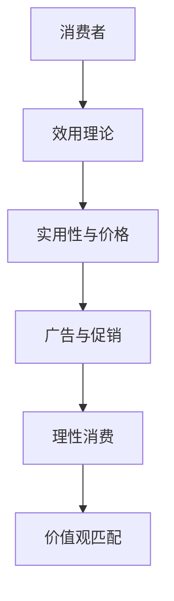

                 

### 引言：消费主义陷阱的发现与挑战

随着全球经济的迅猛发展和物质财富的显著增加，现代社会进入了前所未有的繁荣时期。然而，这一物质丰富的时代也伴随着一系列社会心理问题的涌现，其中最引人注目的便是消费主义的泛滥。消费主义，作为现代社会的经济驱动力，不仅推动了市场的繁荣，也在无形中改变了人们的生活方式、价值观和心理状态。

#### **物质丰富的社会背景**

现代社会的物质丰富体现在多个方面。首先，科技的进步和生产力的提升极大地丰富了商品种类和数量，使得人们能够获得前所未有的物质享受。其次，全球化和互联网的普及使得消费资源更加丰富多样，消费渠道更加便捷，人们可以在全球范围内进行购物和交换。此外，经济的快速发展带动了中产阶级的壮大，使更多人具备了消费的能力和欲望。

#### **消费主义的崛起**

消费主义作为一种社会文化现象，其本质是围绕商品和服务的消费活动，通过鼓励消费者进行持续购买来实现经济增长。随着物质条件的改善，消费主义逐渐成为现代社会的主要特征之一。商家利用广告、促销和社交媒体等手段，不断地刺激消费者的购买欲望，形成了一种无休止的消费循环。

#### **消费主义陷阱对精神生活的威胁**

然而，消费主义的泛滥不仅带来了物质上的繁荣，也对人们的精神生活构成了巨大的威胁。首先，消费主义容易导致人们的心理依赖，形成一种“购买满足感”的心理机制。消费者通过不断地购买来寻求心理上的满足，但这种满足往往是短暂的，甚至可能会带来负面的情绪。其次，消费主义容易导致个人价值观的扭曲，使人们过于注重物质享受，忽视了精神层面的需求。此外，消费主义还可能加剧社会不平等，导致贫富差距的扩大，从而引发一系列社会问题。

面对这些问题，我们需要深入探讨消费主义陷阱的本质和影响，并提出有效的应对策略。本文将从多个角度分析消费主义陷阱的形成机制、影响和解决方法，以期为读者提供深刻的思考和实用的建议。

### 第1章：物质丰富的社会背景与消费主义的兴起

#### **1.1 物质丰富的社会背景**

现代社会物质丰富的背景源于多个方面的因素。首先，科技的进步和生产力的提升是物质丰富的基石。工业革命以来，人类在科技领域取得了巨大的突破，从机械化生产到自动化生产，再到如今的信息化生产，每一次技术革命都极大地提高了生产效率和商品质量，使得市场上的商品种类和数量迅速增加。其次，全球化的进程加速了资源的流动和交换，全球贸易的扩大使得各种商品和服务更加丰富多样，人们可以更加便捷地获得来自世界各地的商品。

此外，经济的快速发展也为物质丰富提供了有力支持。在过去的几十年里，全球经济经历了高速增长，尤其是在一些新兴市场国家，经济的迅速崛起带动了大规模的城市化和工业化，极大地提高了人们的生活水平和消费能力。中产阶级的壮大和消费观念的转变，使得人们对物质生活的需求不断提升，进一步推动了市场的繁荣。

#### **1.2 消费主义的概念与特征**

消费主义是一种社会文化现象，其核心在于通过商品和服务的消费活动来推动经济增长。消费主义不仅仅是简单的购买行为，而是一种系统的社会结构，它通过一系列的社会、经济和文化机制来不断刺激消费者的购买欲望。

消费主义的主要特征包括：

1. **商品崇拜**：消费主义社会中，商品被视为一种崇拜的对象，消费者通过购买商品来体现自己的社会地位和身份。广告和营销策略常常通过塑造商品的符号意义，来激发消费者的购买欲望。
   
2. **持续消费**：消费主义鼓励人们持续不断地进行消费，以满足不断变化的需求和欲望。商家通过推出新产品、促销活动等手段，使消费者始终保持对商品的渴望和兴趣。

3. **社会比较**：消费主义社会中，人们常常通过比较自己的消费水平和他人来评价自己的社会地位。这种社会比较不仅激发了消费者的购买欲望，也可能导致攀比心理和消费压力的增加。

4. **经济驱动**：消费主义是经济增长的重要动力，通过鼓励消费来刺激市场需求，从而推动经济的持续发展。

#### **1.3 消费主义的兴起与发展**

消费主义的兴起有着深远的历史背景。在20世纪中叶，随着二战结束后全球经济的复苏，消费主义逐渐成为一种主流的社会文化现象。特别是在美国，战后经济的繁荣和消费文化的兴起，使得消费主义迅速发展。美国的市场经济模式以其强大的消费需求推动了全球经济的增长，成为消费主义的主要推动力量。

随着全球化和信息技术的发展，消费主义在全球范围内迅速扩散。互联网的普及使得信息传播更加快捷，消费者的购物习惯和消费观念也发生了巨大变化。电商平台的兴起，使消费者能够更加便捷地购买商品，进一步推动了消费主义的发展。

消费主义的兴起不仅改变了人们的消费行为，也对社会结构和文化产生了深远的影响。一方面，消费主义促进了经济的繁荣，提升了人们的生活水平；另一方面，消费主义的泛滥也带来了一系列社会问题，如消费依赖、心理压力、环境问题等。这些问题促使我们深入思考消费主义的本质和影响，以寻求更加健康和可持续的消费模式。

### 第2章：消费主义的心理机制

#### **2.1 消费主义的心理驱动因素**

消费主义的心理驱动因素可以从多个角度进行分析，其中最重要的包括动机与需求、激励敏感性等。

#### **动机与需求**

动机是驱使人们采取特定行动的内在动力。在消费主义背景下，动机通常与个体的需求紧密相关。马斯洛的需求层次理论指出，人类需求可以分为生理需求、安全需求、社交需求、尊重需求和自我实现需求。消费主义通过满足这些需求，激发消费者的购买动机。

1. **生理需求**：如食物、水、住所等基本生活需求，通常与日常消费活动直接相关。

2. **安全需求**：包括健康、财产安全等，通过购买健康产品、保险等来满足。

3. **社交需求**：如与他人建立联系、获得认同等，消费活动常常成为社交互动的一部分。

4. **尊重需求**：如社会地位、名誉等，通过购买高档商品来提升自我价值感。

5. **自我实现需求**：追求个人成长和实现自我潜能，通过消费来实现某些人生目标。

#### **激励敏感性**

激励敏感性是指个体对奖励和惩罚的敏感程度。在消费主义中，商家利用消费者的激励敏感性来刺激购买行为。例如，通过限时促销、优惠券等手段，消费者会在短时间内产生购买冲动，从而满足激励敏感性。

#### **购买满足感**

购买满足感是消费者在购买商品后所体验到的一种心理状态。研究表明，购买满足感通常会在短期内显著提升个体的幸福感。然而，这种满足感往往是短暂的，随着新商品的获取和新鲜感的消逝，消费者可能会再次陷入购买的循环中。

#### **社会比较**

社会比较是消费者在评估自己的消费水平时，常常与他人进行比较的心理过程。消费者会根据周围人的消费水平和行为来调整自己的消费决策。社会比较可能导致攀比心理和消费压力的增加，使消费者不断追求更高的消费水平。

#### **心理防御机制**

消费者在面临消费主义压力时，可能会采用一系列心理防御机制来应对。例如，否认内在空虚、逃避现实和麻痹等。这些防御机制虽然能在短期内缓解心理压力，但长期来看可能加剧精神贫瘠。

### **2.2 消费主义的心理效应**

消费主义对消费者心理产生了深远的影响，其中最显著的效应包括购买满足感、心理依赖和社会比较。

#### **购买满足感**

购买满足感是消费者在购买商品后所体验到的一种积极的情感状态。研究表明，购买满足感通常会在短期内显著提升个体的幸福感。然而，这种满足感往往是短暂的，随着新商品的获取和新鲜感的消逝，消费者可能会再次陷入购买的循环中。

#### **心理依赖**

心理依赖是指消费者对购买行为形成的一种心理上的依赖关系。在消费主义的影响下，消费者可能会逐渐对购买行为产生依赖，通过不断的购买来寻求心理上的满足和平衡。这种依赖关系可能导致消费者在面对压力和挫折时，更倾向于通过消费来缓解情绪。

#### **社会比较**

社会比较是消费者在评估自己的消费水平时，常常与他人进行比较的心理过程。消费者会根据周围人的消费水平和行为来调整自己的消费决策。社会比较可能导致攀比心理和消费压力的增加，使消费者不断追求更高的消费水平。

### **2.3 心理防御机制**

消费者在面临消费主义压力时，可能会采用一系列心理防御机制来应对。例如，否认内在空虚、逃避现实和麻痹等。这些防御机制虽然能在短期内缓解心理压力，但长期来看可能加剧精神贫瘠。

#### **否认内在空虚**

否认内在空虚是指消费者试图通过消费来掩盖内心的空虚和不安。在消费主义文化的熏陶下，消费者可能会忽视精神层面的需求，将物质消费视为填补内心空虚的唯一途径。然而，这种否认行为可能使消费者陷入更深的内心困境。

#### **逃避现实**

逃避现实是指消费者通过消费来逃避现实生活中的问题和压力。例如，在面对职业困境、家庭矛盾等现实问题时，消费者可能会通过购物来寻求短暂的快乐和逃避。然而，这种逃避行为可能导致消费者面临更严重的问题，如财务困境和心理负担。

#### **麻痹**

麻痹是指消费者通过消费来麻痹自己的心理感受。在消费主义的影响下，消费者可能会过度依赖购物来缓解焦虑和抑郁等负面情绪。然而，这种麻痹行为可能使消费者逐渐丧失面对问题的勇气和能力，进一步加剧心理问题。

### **2.4 消费主义的心理效应总结**

消费主义对消费者心理产生了多重效应，包括购买满足感、心理依赖和社会比较等。这些效应不仅影响消费者的个人生活，也对社会整体产生了深远的影响。理解这些心理效应有助于我们更好地应对消费主义带来的挑战，构建更加健康和可持续的消费模式。

### 第3章：消费主义对个人生活的负面影响

#### **3.1 消费主义对个人生活的冲击**

消费主义作为一种社会文化现象，对个人生活产生了深远的影响。首先，消费主义可能导致预算紧张和债务负担。在消费主义的驱动下，消费者往往容易陷入过度消费的陷阱，导致收入无法满足支出需求，进而产生预算紧张问题。许多消费者为了购买心仪的商品或满足不断升级的消费需求，不得不借助信用卡、贷款等金融服务，从而背负沉重的债务负担。

**案例研究**：以“双十一”购物狂欢为例，近年来，双十一已经成为中国乃至全球最大的购物节日之一。然而，这一节日也带来了大量的消费债务问题。许多消费者在促销期间疯狂购买，超出自己的经济承受能力，导致大量信用卡欠款和贷款债务。这种现象不仅给消费者带来了财务压力，还可能引发焦虑和抑郁等心理问题。

#### **3.2 消费主义对心理健康的影响**

消费主义对个人心理健康的影响同样不容忽视。首先，消费主义可能导致焦虑和抑郁等心理问题的增加。在消费主义文化中，消费者常常感到必须不断购买新商品来维持自己的社会地位和形象，这种压力会导致心理焦虑。同时，由于购买行为往往是一种逃避现实的方式，消费者在无法通过消费来缓解内心困扰时，可能会感到抑郁和无助。

**案例研究**：一项对大学生群体的调查显示，消费主义对他们的心理健康产生了显著影响。研究发现，那些消费观念较为强烈的个体，其焦虑和抑郁水平显著高于消费观念较为理性的个体。此外，一些消费者在购物后往往会感到空虚和不安，这种现象被称为“购买后空虚综合症”（Purchasing后空虚综合症，简称PBCS）。PBCS患者往往在购买商品后不久就会感到满足感的消失，进而陷入新一轮的购买循环。

#### **3.3 消费主义对人际关系的影响**

消费主义不仅影响个人的心理健康，也对人际关系产生了负面影响。首先，消费主义可能导致家庭关系紧张。在消费主义文化中，消费者为了追求更高的生活质量和消费水平，往往需要在经济上进行较大的投入。这种投入可能会导致家庭财务压力的增加，进而引发夫妻之间的争吵和矛盾。

**案例研究**：一项关于家庭财务压力的研究指出，那些在消费主义文化影响下过度消费的家庭，其婚姻满意度显著低于那些理性消费的家庭。家庭中的财务问题往往成为矛盾的导火索，导致夫妻关系紧张，甚至家庭破裂。

此外，消费主义还可能导致朋友间的攀比心理。在消费主义文化中，人们常常通过比较自己的消费水平和他人来评价自己的社会地位和身份。这种攀比心理不仅加剧了个体之间的竞争，也可能导致友谊的破裂。

**案例研究**：一项关于青少年消费行为的研究发现，那些在消费主义文化影响下过度攀比的青少年，其友谊稳定性显著低于那些理性消费的青少年。攀比心理使青少年在友谊中感到压力和焦虑，导致友谊关系紧张。

#### **3.4 消费主义对职业发展的影响**

消费主义对职业发展的影响也不容忽视。首先，过度消费可能导致职业发展的困境。在消费主义的影响下，消费者往往需要投入大量资金来满足消费需求，这可能会挤占他们用于职业发展投资的时间和资源。例如，一些职场人士可能会为了购买昂贵的电子产品或奢侈品而牺牲职业培训和个人成长的时间。

**案例研究**：一项关于职场人士的研究指出，那些在消费主义影响下过度消费的个体，其职业发展速度显著低于那些理性消费的个体。过度消费不仅浪费了个人资源，还可能导致职业上的停滞不前。

此外，消费主义还可能导致职业价值观的扭曲。在消费主义文化中，人们往往将物质财富视为成功的象征，这可能导致他们在职业选择和发展中过于注重金钱和物质回报，而忽视了职业的内在价值和意义。

**案例研究**：一项关于职场价值观的研究发现，那些在消费主义影响下价值观扭曲的个体，往往更倾向于追求短期物质回报，而忽视了长期职业发展和个人成长。这种现象可能导致职业发展的不稳定和职业倦怠。

### **3.5 消费主义对个人生活的全面影响**

综上所述，消费主义对个人生活产生了全面的负面影响，包括预算紧张和债务负担、心理健康问题、人际关系紧张、职业发展困境等。这些影响不仅损害了个人的生活质量，也对社会整体产生了消极影响。为了应对这些挑战，我们需要深入理解消费主义的本质和影响，并采取有效的策略来摆脱消费主义陷阱，实现更加健康和可持续的生活方式。

### 第4章：社会层面的消费主义陷阱

#### **4.1 消费主义与贫富差距**

消费主义的一个显著社会影响是加剧了贫富差距。在消费主义文化中，物质财富成为社会地位的重要标志，富裕阶层能够通过消费奢侈品和高端服务来展示自己的社会地位，而贫困阶层则可能因为无法承担高昂的消费成本而处于社会底层。这种现象不仅使得贫富差距不断扩大，还可能导致社会不平等和不满情绪的增加。

**数学模型与公式**：为了更直观地理解消费主义如何加剧贫富差距，我们可以使用洛伦兹曲线（Lorenz Curve）和基尼系数（Gini Coefficient）来衡量社会的不平等程度。洛伦兹曲线通过比较不同收入群体所占有的财富比例，展示了财富的分布情况。基尼系数则是衡量不平等程度的量化指标，其值介于0（完全平等）和1（完全不平等）之间。

洛伦兹曲线公式：
$$
L(x) = \frac{\sum_{i=1}^{n} (x_i - x_{i-1}) f_i}{\sum_{i=1}^{n} f_i}
$$

其中，$x_i$ 是第i个收入百分位数所拥有的财富比例，$f_i$ 是该收入百分位数的总人口比例。

基尼系数公式：
$$
G = 1 - 2 \times \frac{\sum_{i=1}^{n} (x_i - x_{i-1}) f_i}{\sum_{i=1}^{n} f_i}
$$

通过这些数学模型，我们可以清晰地看到消费主义如何通过影响收入分配和财富积累，加剧社会的不平等。

#### **4.2 消费主义与环境问题**

消费主义不仅对社会经济结构产生影响，也对环境问题带来了巨大的挑战。消费主义文化鼓励人们持续购买和消费，这导致了资源的过度开采和浪费。随着消费活动的增加，工业生产和废弃物处理的需求也随之上升，导致空气、水和土壤污染问题的加剧。

**数学模型与公式**：为了量化消费主义对环境的影响，我们可以使用生态足迹（Ecological Footprint）来衡量人类对自然资源的消耗程度。生态足迹是指为了满足一个人的消费和产出水平所需的生物生产面积。生态足迹的计算公式如下：

生态足迹（E）计算公式：
$$
E = \sum_{i=1}^{n} \frac{C_i}{Y_i}
$$

其中，$C_i$ 是第i种资源的消费量（单位：gigaJoules），$Y_i$ 是第i种资源的全球平均生产率（单位：gigaJoules/ha）。

生态债务（Ecological Debt）则是用来衡量一个国家或地区生态足迹与生物承载力之间的差距。其计算公式如下：

生态债务（D）计算公式：
$$
D = E - B
$$

其中，$B$ 是生物承载力（Biocapacity），即一个地区自然生态系统提供的资源和服务能力。

通过这些数学模型，我们可以更清晰地看到消费主义如何导致资源过度消耗和环境负担增加，进而引发一系列环境问题，如气候变化、水资源短缺和生物多样性丧失等。

#### **4.3 消费主义与社会心理健康**

消费主义不仅影响个人的心理健康，还对社会整体的心理健康产生了负面影响。在消费主义文化中，人们常常通过物质消费来寻求心理满足，但这种满足往往是短暂的，甚至可能带来负面情绪。这种心理依赖可能导致社会普遍存在焦虑和抑郁等心理问题。

**数学模型与公式**：为了量化消费主义对心理健康的影响，我们可以使用心理幸福感（Subjective Well-being）指标来衡量。心理幸福感通常通过问卷调查中的主观幸福感得分来衡量，如 Satisfaction with Life Scale（生活满意度量表）。其计算公式如下：

主观幸福感得分（SWB）计算公式：
$$
SWB = \sum_{i=1}^{n} (S_i \times W_i)
$$

其中，$S_i$ 是第i个项目上的得分，$W_i$ 是第i个项目的权重。

通过这些模型，我们可以分析消费主义对个体和社会整体心理幸福感的影响程度。例如，我们可以通过比较消费主义程度较低和较高地区的心理健康水平，来探讨消费主义对心理健康的影响。

#### **4.4 消费主义陷阱的负面影响总结**

消费主义在社会层面产生了深远的影响，包括加剧贫富差距、导致环境问题和社会心理健康问题的增加。通过上述数学模型和公式，我们可以更直观地理解这些负面影响。这些影响不仅损害了个人的生活质量，也对社会的稳定和发展构成了威胁。因此，我们需要采取有效的措施来应对消费主义陷阱，促进社会公平和可持续发展。

### 第5章：摆脱消费主义陷阱的策略与方法

#### **5.1 理性消费观念的培养**

要摆脱消费主义陷阱，培养理性消费观念是关键。理性消费观念要求消费者在购买决策过程中，不仅要考虑商品的实用性和价格，还要关注商品是否符合自身的实际需求，以及是否符合自己的价值观。

**核心概念与联系**：理性消费观念与经济学中的效用理论密切相关。效用理论认为，消费者在购买商品时，会根据商品所带来的效用（即满足感或收益）来做出决策。然而，在消费主义文化中，消费者往往受到广告和促销手段的诱导，容易陷入过度消费的陷阱。因此，培养理性消费观念，需要消费者在学习经济学原理的基础上，学会辨别广告的真实性和促销手段的合理性。

**Mermaid流程图**：


#### **5.2 消费决策的理性分析**

在培养理性消费观念的基础上，消费者需要学会进行理性分析。理性分析包括以下几个方面：

1. **需求识别**：明确自身的真实需求，区分基本需求与奢侈需求。
2. **预算管理**：合理规划个人财务，确保收支平衡，避免过度借贷。
3. **性价比评估**：比较不同商品的性能和价格，选择性价比最高的商品。
4. **心理预期管理**：设定合理的消费预期，避免因过度期待而导致的消费冲动。

**伪代码**：
```python
def rational_consumption(decision):
    # 需求识别
    if is_basic_needs(decision):
        print("购买决策合理，符合基本需求")
    else:
        print("警惕过度消费，区分基本需求与奢侈需求")
    
    # 预算管理
    if is_within_budget(decision):
        print("预算合理，继续购买")
    else:
        print("预算紧张，考虑减少购买或增加收入")
    
    # 性价比评估
    if has_higher_value(decision):
        print("性价比高，推荐购买")
    else:
        print("性价比低，考虑其他选项")
    
    # 心理预期管理
    if meets_expectations(decision):
        print("心理预期满足，继续购买")
    else:
        print("心理预期过高，警惕消费冲动")
```

#### **5.3 心理防御机制的突破**

消费者在消费过程中可能会采用一系列心理防御机制，如逃避现实、否认内在空虚等，这些机制虽然能在短期内缓解心理压力，但长期来看可能加剧精神贫瘠。要摆脱消费主义陷阱，消费者需要突破这些心理防御机制，寻求更健康的生活方式。

**核心概念与联系**：突破心理防御机制与心理学中的认知行为疗法（Cognitive Behavioral Therapy，简称CBT）密切相关。CBT通过识别和改变负面思维模式，帮助个体建立积极的认知和行为模式。在消费过程中，消费者可以通过CBT的方法，识别和改变消极的消费习惯，从而摆脱消费主义陷阱。

**伪代码**：
```python
def cognitive_behavior_therapy(consumption_behavior):
    # 识别负面思维模式
    negative_thoughts = identify_negative_thoughts(consumption_behavior)
    
    # 改变负面思维模式
    positive_thoughts = change_thoughts(negative_thoughts)
    
    # 建立积极消费行为
    positive_consumption = create_positive_consumption(positive_thoughts)
    
    return positive_consumption
```

#### **5.4 社会支持与教育**

除了个人层面的努力，社会支持与教育也是摆脱消费主义陷阱的重要手段。政府、教育机构和社会组织可以通过以下方式提供支持和教育：

1. **政策引导**：政府可以通过税收优惠、绿色消费补贴等政策，鼓励理性消费和可持续消费。
2. **教育普及**：学校和社会组织可以开展消费教育，提高公众对消费主义陷阱的认识。
3. **心理辅导**：提供专业的心理咨询服务，帮助消费者识别和改变消极的消费习惯。

**核心概念与联系**：政策引导、教育普及和心理辅导与社会学中的公共政策、教育政策和社会工作密切相关。这些措施通过改变社会环境，提高公众的消费意识和能力，从而有助于摆脱消费主义陷阱。

**伪代码**：
```python
def social_support_and_education():
    # 政策引导
    apply_consumption_promotion_policy()
    
    # 教育普及
    educate_public_on_consumption()
    
    # 心理辅导
    provide_consumption_counseling()
```

#### **5.5 摆脱消费主义陷阱的方法总结**

要摆脱消费主义陷阱，消费者需要从多个方面进行努力。培养理性消费观念、进行理性消费决策、突破心理防御机制、寻求社会支持和教育，都是有效的方法。通过这些方法的综合运用，消费者可以逐步摆脱消费主义的束缚，实现更加健康和可持续的生活方式。

### 第6章：案例分析：消费主义陷阱的典型现象

#### **6.1 双十一购物狂欢**

双十一购物狂欢是中国最具代表性的消费主义现象之一。作为每年的购物狂欢节，双十一不仅吸引了数以亿计的消费者参与，也带动了整个电商行业的繁荣。然而，这一现象背后隐藏着深刻的消费主义陷阱。

**背景介绍**：双十一购物狂欢起源于2009年，由阿里巴巴旗下的淘宝网首次推出。初衷是为了鼓励消费者在11月11日这一天进行集中购物，从而推动销售额的增长。随着活动的普及和影响力的扩大，双十一逐渐成为全球范围内的购物狂欢节。

**核心现象分析**：

1. **消费冲动**：双十一期间，电商平台通过大规模的促销活动、限时抢购、优惠券等手段，刺激消费者的购买欲望。消费者在短时间内感受到强烈的购买冲动，容易出现冲动消费的现象。

2. **攀比心理**：在消费主义文化的影响下，消费者往往会通过比较自己的消费水平和他人来评价自己的社会地位。双十一购物狂欢加剧了这种攀比心理，导致消费者不断追求更高的消费水平。

3. **财务压力**：大量消费者在双十一期间购买商品，超出自己的经济承受能力，导致财务压力增加。许多消费者为了支付购物款项，不得不借助信用卡、花呗等金融服务，从而背负沉重的债务负担。

**数学模型与公式**：为了更直观地分析双十一购物狂欢对消费者财务的影响，我们可以使用消费杠杆率（Consumer Leverage Ratio）来衡量。消费杠杆率是指消费者的负债与收入的比率，其计算公式如下：

消费杠杆率（CLR）计算公式：
$$
CLR = \frac{Total Debt}{Total Income}
$$

通过这一模型，我们可以分析消费者在双十一购物狂欢期间的负债情况，以及其对财务状况的影响。

#### **6.2 信用卡消费与负债问题**

信用卡消费是现代消费主义文化中普遍存在的一种现象。信用卡的便捷性和灵活性使得消费者可以轻松地实现消费，但同时，信用卡消费也带来了严重的负债问题。

**背景介绍**：信用卡作为一种支付工具，最早起源于20世纪50年代的美国。随着全球经济的发展和金融技术的进步，信用卡逐渐普及，成为一种便捷的支付手段。特别是在中国，信用卡的使用率迅速增长，成为了消费者日常生活中不可或缺的一部分。

**核心现象分析**：

1. **消费便利性**：信用卡的便捷性使得消费者可以无需携带现金，随时随地实现消费。这种便利性虽然提高了消费体验，但也容易导致消费者过度消费。

2. **负债问题**：许多消费者在使用信用卡时，往往忽视了负债问题。信用卡的透支功能使得消费者可以在短期内获得大量的消费资金，但如果无法及时还款，就会产生高额的利息和费用，导致财务压力增加。

3. **心理依赖**：信用卡消费容易导致消费者形成心理依赖。消费者在还款压力下，可能会选择继续使用信用卡进行消费，从而陷入负债循环。

**数学模型与公式**：为了量化信用卡消费对消费者财务状况的影响，我们可以使用债务收入比（Debt-to-Income Ratio）来衡量。债务收入比是指消费者债务总额与月收入的比率，其计算公式如下：

债务收入比（D/I Ratio）计算公式：
$$
D/I Ratio = \frac{Total Debt Payment}{Gross Monthly Income}
$$

通过这一模型，我们可以分析消费者在使用信用卡消费时，负债水平对其生活质量的影响。

#### **6.3 社交媒体与消费行为**

社交媒体的兴起极大地改变了人们的消费行为。通过社交媒体平台，消费者可以方便地获取商品信息、分享购物经验，同时也受到社交圈子的影响，从而产生消费冲动。

**背景介绍**：社交媒体平台如Facebook、Twitter、Instagram等，已经成为人们日常生活中不可或缺的一部分。这些平台不仅提供了即时通讯和分享功能，还成为了消费者获取信息、交流意见和做出购买决策的重要渠道。

**核心现象分析**：

1. **信息传播**：社交媒体平台通过算法推荐和社交圈子传播，使得消费者可以迅速获取大量商品信息。这种信息传播速度和覆盖范围，是传统媒体无法比拟的。

2. **社交影响**：消费者的购物决策常常受到社交圈子的影响。在社交媒体上，消费者可以通过观察朋友的购物行为和评价，来调整自己的消费决策。这种现象被称为“社交影响”（Social Influence）。

3. **消费冲动**：社交媒体上的购物链接和广告，往往具有强烈的吸引力，容易激发消费者的购买冲动。消费者在浏览社交媒体时，可能会因为一个广告或一条购物链接，而立即决定购买。

**数学模型与公式**：为了量化社交媒体对消费行为的影响，我们可以使用“网络影响度”（Network Influence）来衡量。网络影响度是指消费者在社交媒体上的影响范围和影响力，其计算公式如下：

网络影响度（NI）计算公式：
$$
NI = \frac{Total Engagement}{Total Followers}
$$

其中，总参与度（Total Engagement）包括点赞、评论、分享等互动行为，总关注者数（Total Followers）是消费者的社交媒体粉丝数量。通过这一模型，我们可以分析消费者在社交媒体上的影响力和其对消费行为的影响。

### **6.4 消费主义陷阱的案例分析总结**

通过对双十一购物狂欢、信用卡消费和社交媒体与消费行为的案例分析，我们可以看到消费主义陷阱在现代社会中普遍存在。这些现象不仅反映了消费主义的泛滥，也揭示了其对个人和社会的负面影响。理解这些案例，有助于我们更好地认识消费主义陷阱的本质，从而采取有效的策略来摆脱其束缚。

### 第7章：构建健康的精神生活

#### **7.1 健康精神生活的概念**

健康精神生活是指个体在心理、情感、社交和认知方面保持良好状态，能够积极应对生活中的挑战和压力。这种生活状态不仅包括个体的心理健康，还涉及到个体与周围环境的和谐关系。在消费主义陷阱中，人们往往被物质追求所迷惑，忽视了精神生活的建设。因此，构建健康的精神生活成为摆脱消费主义陷阱的重要一环。

**核心概念与联系**：健康精神生活与心理学中的“心理弹性”（Resilience）密切相关。心理弹性是指个体在面对压力和困难时，能够迅速恢复和适应的能力。通过培养心理弹性，个体能够更好地应对生活中的各种挑战，从而减少对物质消费的依赖。

#### **7.2 心理弹性的培养**

心理弹性的培养是一个长期的过程，需要个体在日常生活中不断努力和实践。以下是一些具体的方法：

1. **自我认知**：个体需要深入了解自己的情感和需求，认识到自身的优势和不足。通过自我反思和自我接纳，个体能够更好地应对情绪波动。

2. **情绪管理**：学会有效地管理和调节自己的情绪，避免过度情绪化。可以通过冥想、深呼吸等方法来缓解压力和焦虑。

3. **积极心态**：培养积极的心态，关注生活中的美好事物。积极心态有助于个体在逆境中保持乐观，从而减少对物质消费的依赖。

**伪代码**：
```python
def cultivate_resilience():
    # 自我认知
    self_awareness = self_reflection()

    # 情绪管理
    emotion_management = meditation_and_breathing()

    # 积极心态
    positive_mentality = focus_on_positive_things()

    return self_awareness, emotion_management, positive_mentality
```

#### **7.3 社交关系的构建**

社交关系对个体的心理健康具有重要影响。健康的社交关系能够提供情感支持，减轻压力，增强个体的心理韧性。以下是一些构建健康社交关系的建议：

1. **培养同理心**：学会站在他人的角度思考问题，理解他人的感受和需求。同理心有助于建立更加深厚的人际关系。

2. **积极参与社交活动**：参加各种社交活动，如聚会、社团活动等，有助于扩展社交圈子，增加社交互动。

3. **建立支持系统**：寻找可以互相支持和帮助的伙伴或朋友，形成一个稳固的社交支持系统。

**伪代码**：
```python
def build_social_relationships():
    # 培养同理心
    empathy = practice_empathy()

    # 积极参与社交活动
    social_participation = join_social_activities()

    # 建立支持系统
    support_system = find_supportive_friends()

    return empathy, social_participation, support_system
```

#### **7.4 休闲活动的丰富**

休闲活动不仅能够丰富个人的业余生活，还能有助于缓解压力，提高心理健康。以下是一些有益的休闲活动：

1. **运动**：定期参加运动，如跑步、瑜伽、游泳等，有助于释放压力，提高身体素质。

2. **阅读**：阅读各种类型的书籍，不仅可以增长知识，还能提供精神上的愉悦和放松。

3. **艺术创作**：参与绘画、音乐、手工艺等活动，有助于表达情感，提升创造力。

**伪代码**：
```python
def engage_in_leisure_activities():
    # 运动
    exercise = regular_phyical_activity()

    # 阅读
    reading = read_variety_books()

    # 艺术创作
    art_creation = participate_in_art_activities()

    return exercise, reading, art_creation
```

#### **7.5 健康精神生活的实践**

构建健康的精神生活是一个持续的过程，需要个体在日常生活中不断实践和调整。以下是一些实践建议：

1. **设定目标**：为自己设定短期和长期目标，有助于保持动力和方向。

2. **定期反思**：定期反思自己的行为和情绪，评估自己的精神状态，及时调整。

3. **寻求专业帮助**：在遇到困难时，不要害怕寻求专业帮助，如心理咨询师等。

**伪代码**：
```python
def practice_healthylife():
    # 设定目标
    set_goals = define_short_and_long_term_goals()

    # 定期反思
    reflection = regular_self_evaluation()

    # 寻求专业帮助
    professional_help = seek_professional_advice()

    return set_goals, reflection, professional_help
```

#### **7.6 健康精神生活的总结**

构建健康的精神生活不仅是摆脱消费主义陷阱的重要手段，也是提升个人生活质量的必要途径。通过培养心理弹性、建立健康的社交关系、丰富休闲活动，个体可以更好地应对生活中的各种挑战，从而实现更加健康、平衡和有意义的生活。

### 附录A：相关资源与参考文献

#### **A.1 心理学研究资源**

1. **学术期刊**：
   - **Journal of Consumer Research**
   - **Psychology and Marketing**
   - **Journal of Economic Psychology**

2. **研究论文**：
   - **"The Psychology of Materialism: The Dual Role of Consumption in the Pursuit of Happiness"" by Joseph P. Clary, Donald G. Merlino, and David R. Rodriguez.
   - **"The Effects of Consumer Culture on Children's Materialistic Values"" by Jean Twenge and W. Keith Campbell.

3. **在线课程**：
   - **"Psychology and Consumer Behavior"**（Coursera）

#### **A.2 消费主义研究资源**

1. **书籍**：
   - **"Affluenza: The All-Consuming Epidemic"" by John de Graaf, Thomas H. Naylor, and David Wann.
   - **"Consuming America: Economics and the Social Landscape"" by Russell Baker.

2. **研究报告**：
   - **"The Spirit Level: Why Greater Equality Makes Societies Stronger"" by Richard G. Wilkinson and Kate Pickett.

3. **纪录片**：
   - **"The True Cost"**（Netflix纪录片，探讨全球服装产业对环境和社会的影响）

#### **A.3 推荐阅读**

1. **书籍**：
   - **"The Disinherited: Private Lives and Public Worlds"" by Harry Braverman.
   - **"The Overstory"" by Richard Powers（探讨人类与自然的关系）。

2. **文章**：
   - **"The Case Against Social Media"" by Sherry Turkle（探讨社交媒体对人际关系的影响）。
   - **"The Allure of Order"" by Maria Popova（探讨秩序与生活质量的关联）。

3. **博客与网站**：
   - **"Psychology Today"**（提供关于心理健康的文章和资源）。
   - **"The Minimalists"**（分享关于极简主义生活方式的文章和经验）。

这些资源将帮助读者进一步了解消费主义陷阱对个人和社会的影响，并提供实用的策略和方法来构建健康的精神生活。通过深入研究和持续实践，读者可以更好地应对消费主义的挑战，实现更加平衡和有意义的生活。

