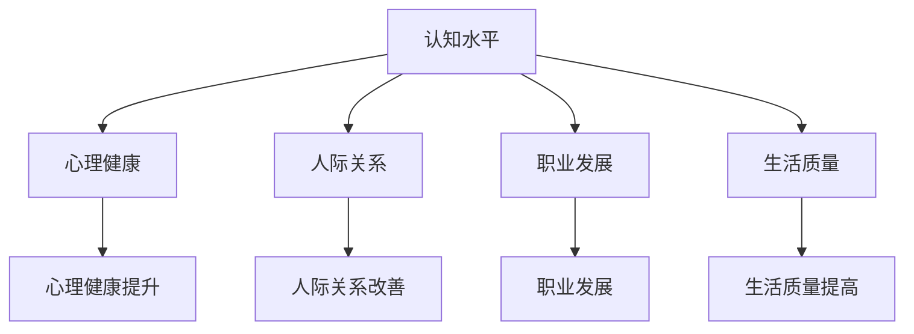
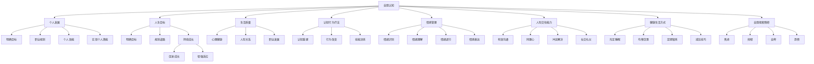

                 

### 文章标题

《深入内心的自我探索：提升自我认知水平》

### 关键词

自我探索、认知水平、内省法、心理学、提升生活质量

### 摘要

本文旨在深入探讨自我探索的重要性以及如何通过自我探索来提升自我认知水平。文章首先介绍了自我认知和认知水平的基本概念，接着从心理学角度分析了自我探索的方法和实践。文章通过内省法、日记写作、冥想等具体技巧，详细讲解了如何进行自我探索。同时，文章还探讨了提升认知水平的方法，如学习心理学知识、培养批判性思维等。此外，文章还涉及自我探索中的挑战与应对策略，以及如何持续进行自我探索和成长。通过本文的阅读，读者将能够更好地理解自我探索的过程，掌握提升自我认知水平的有效方法。

---

## 第一部分：理解自我探索与认知水平提升

### 第1章：自我探索的必要性

#### 1.1 认知水平的定义与重要性

认知水平是指个体对信息获取、处理和理解的能力。这一能力不仅决定了个体如何认识世界，还影响了个体如何理解自己和他人。在心理学中，认知水平被视为一个关键指标，它影响着个体的心理健康、学习效率、思维能力以及人际关系。因此，提升认知水平具有重要的现实意义。

**认知水平的定义：**
认知水平涉及以下几个方面：
- **感知能力**：个体对信息的感知和接收能力。
- **注意力**：个体在特定任务上集中注意力的能力。
- **记忆**：个体对信息的记忆和回忆能力。
- **思维**：个体的逻辑推理、分析问题、创造性思考的能力。

**认知水平的重要性：**
1. **提高学习效率**：认知水平高的人能够更快速、准确地理解新信息，从而提高学习效率。
2. **增强思维能力**：良好的认知水平有助于培养批判性思维和创造性思维。
3. **改善生活质量**：认知水平高的人能够更好地应对生活中的各种挑战，提高生活质量。

#### 1.2 心理学视角下的自我探索

自我探索是心理学研究的一个重要领域，它关注个体对自我认知的理解和改变。通过自我探索，个体可以更深入地了解自己的性格、情感、价值观和行为模式，从而实现自我成长和提升。

**心理学视角下的自我探索包括以下几个方面：**
1. **自我认知**：个体对自身性格、能力、价值观的认知。
2. **自我意识**：个体对自我存在和自我体验的认识。
3. **自我反思**：个体对自己的行为和想法进行深入思考。

**心理学视角下的自我探索的重要性：**
1. **促进心理健康**：自我探索有助于个体更好地理解和管理自己的情绪，减轻焦虑、抑郁等心理问题。
2. **提升人际关系**：自我探索有助于个体更准确地理解他人的情感和需求，建立更健康的人际关系。
3. **增强自我效能感**：通过自我探索，个体能够更清晰地了解自己的优势和不足，从而增强自我效能感，提高自信心。

#### 1.3 自我探索与生活质量的关联

自我探索不仅对心理健康有益，还能显著提升生活质量。以下是自我探索与生活质量之间的几项关联：

1. **心理健康提升**：自我探索有助于个体更深入地了解自己的内心世界，减轻心理负担，提高心理健康水平。
2. **人际关系改善**：自我探索使个体能够更好地理解他人，提升人际沟通能力，建立更和谐的人际关系。
3. **职业发展**：通过自我探索，个体能够更清晰地了解自己的兴趣和优势，从而在职业规划和发展中做出更明智的决策。
4. **生活质量提高**：自我探索有助于个体更好地管理时间和资源，提高生活质量。

### 1.4 总结

自我探索和认知水平提升是现代生活中不可或缺的一部分。通过自我探索，个体能够更好地理解自己，提升认知水平，从而在各个领域取得更好的成果。理解自我探索的必要性，掌握自我探索的方法，将有助于个体在自我成长的道路上迈出坚实的步伐。

### Mermaid 流程图



### 第2章：自我探索的方法与实践

#### 2.1 内省法的应用

内省法是一种通过反思自己的内心体验和思考过程来深入了解自己的方法。它要求个体在安静的环境中，放松身心，深入思考自己的行为、想法和情感。内省法是一种非常有效的自我探索方法，可以帮助个体识别和解决内心的问题。

**内省法的应用步骤：**
1. **选择合适的时间和场所**：找一个安静、舒适的地方，确保没有干扰。
2. **放松身心**：通过深呼吸、冥想等方法，让自己放松下来。
3. **反思**：回想过去一段时间内的经历，思考自己的行为、想法和情感。
4. **记录**：将反思的内容记录下来，便于后续分析和思考。
5. **分析**：对记录的内容进行分析，识别出可能存在的问题或困惑。

**内省法的实际案例：**
例如，一个人在反思自己最近的工作表现时，发现自己在项目中经常出现拖延的情况。通过内省，他意识到自己是因为担心失败而害怕承担责任。通过进一步的分析，他找到了解决问题的方法，比如设定小目标、分阶段完成任务等，从而提高了工作效率。

#### 2.2 日记写作的技巧

日记写作是一种常见的自我探索方法，它可以帮助个体记录自己的所思所感，回顾过去，反思现在，规划未来。日记写作不仅有助于提高自我认知，还能促进情感表达和心理疏导。

**日记写作的技巧：**
1. **坚持每天写**：定期写日记有助于养成自我反思的习惯，提高自我认知。
2. **真实记录**：日记应该是真实的内心写照，不必担心语法和逻辑，只需真诚地表达自己的想法和感受。
3. **分类记录**：可以将日记分为日常记录、情感记录、思考记录等，以便于后续分析和回顾。
4. **定期回顾**：定期回顾日记，可以帮助个体看到自己的成长和变化。

**日记写作的实际案例：**
一个人在日记中记录了自己每天的情绪变化，比如工作中的压力、家庭中的矛盾、个人成长的目标等。通过回顾日记，他发现了自己在情绪管理方面的不足，并找到了改进的方法。

#### 2.3 冥想与自我探索

冥想是一种通过专注呼吸和放松身心来达到心灵平静的方法。冥想不仅有助于减轻压力、提高专注力，还能促进自我探索和自我认知。

**冥想的步骤：**
1. **选择冥想环境**：找一个安静、舒适的地方，确保没有干扰。
2. **坐姿冥想**：坐在舒适的椅子上，保持背部挺直。
3. **深呼吸**：缓慢地吸气，再缓缓地呼气，专注于呼吸的过程。
4. **专注一点**：可以选择专注于呼吸、一个单词或者一个意象。
5. **放松身心**：在冥想的过程中，放松身体的各个部位，放松思维。

**冥想在自我探索中的应用：**
通过冥想，个体可以更加清晰地了解自己的内心世界，识别出潜意识中的问题和困惑。冥想有助于个体在平静的状态下进行自我反思，找到解决问题的方法。

**冥想的实际案例：**
一个人在冥想中发现自己对过去的失败感到非常沮丧，通过进一步的反思，他意识到自己需要接受过去的失败，并从中学习，以便在未来取得更好的成就。

### 第3章：提升认知水平的方法

#### 3.1 学习心理学知识

学习心理学知识是提升认知水平的重要方法之一。心理学提供了关于人类行为和思维的深入理解，可以帮助个体更好地了解自己和他人的心理状态，从而提升自我认知。

**学习心理学知识的建议：**
1. **选择合适的心理学书籍**：选择一些经典的心理学书籍，如《心理学与生活》、《影响力》等，这些书籍既有深度又易于理解。
2. **参加心理学课程**：可以通过在线课程或大学课程来系统学习心理学知识。
3. **实践心理学理论**：将心理学理论应用到实际生活中，比如通过认知行为疗法来管理自己的情绪和行为。

**学习心理学知识的实际案例：**
一个人通过学习心理学知识，了解了情绪调节的方法，比如通过深呼吸和冥想来减轻焦虑，通过自我反思来识别和改变负面思维模式。

#### 3.2 培养批判性思维

批判性思维是提升认知水平的关键能力之一。它要求个体对信息进行深入分析、评估和判断，而不是盲目接受或拒绝。

**培养批判性思维的技巧：**
1. **提问和质疑**：对信息来源、逻辑和结论提出质疑，不轻易接受未经验证的信息。
2. **分析信息**：将信息分解为不同的部分，从多个角度进行分析和评估。
3. **逻辑推理**：使用逻辑规则进行推理，确保结论的合理性和逻辑性。

**培养批判性思维的实际案例：**
一个人在学习新的编程技术时，通过批判性思维，分析了不同技术方案的优缺点，最终选择了最合适的技术方案。

#### 3.3 提升注意力和记忆力的技巧

提升注意力和记忆力是提升认知水平的另一个重要方面。以下是一些提升注意力和记忆力的技巧：

**提升注意力的技巧：**
1. **定期休息**：长时间集中注意力后，适当休息可以帮助恢复精力。
2. **减少干扰**：在学习和工作时，尽量减少干扰，比如关闭手机通知、找一个安静的学习环境。
3. **多任务处理**：学会合理安排时间，将多个任务交替进行，提高工作效率。

**提升记忆力的技巧：**
1. **重复练习**：通过反复练习，巩固记忆。
2. **联想记忆**：将新信息与已知信息进行联想，提高记忆效果。
3. **合理休息**：保证充足的睡眠，有助于记忆力的恢复。

**提升注意力和记忆力的实际案例：**
一个人通过每天坚持练习冥想和定期进行记忆训练，显著提高了自己的注意力和记忆力，从而在学习和技术工作中取得了更好的成果。

### 第4章：认知行为疗法与自我探索

#### 4.1 认知行为疗法的基本原理

认知行为疗法（Cognitive Behavioral Therapy，简称CBT）是一种基于心理学原理的心理治疗方法，它通过改变负面思维模式和行为模式来改善心理健康。认知行为疗法的基本原理包括以下几个方面：

**认知行为疗法的基本原理：**
1. **认知重建**：通过识别和改变负面思维模式，提高自我认知，减少心理压力。
2. **行为改变**：通过改变行为模式，增强自我效能感，提高生活质量。
3. **技能训练**：通过技能训练，如情绪调节、应对策略等，帮助个体应对生活中的各种挑战。

**认知行为疗法在实际应用中的效果：**
认知行为疗法已被广泛应用于治疗焦虑、抑郁、强迫症、创伤后应激障碍等多种心理问题，具有显著的效果。它不仅能够减轻症状，还能帮助个体建立更健康的思维和行为模式。

#### 4.2 应用认知行为疗法进行自我探索

通过认知行为疗法，个体可以更深入地探索自己的内心世界，识别和改变负面思维模式，从而提升自我认知和心理健康。以下是应用认知行为疗法进行自我探索的步骤：

**应用认知行为疗法进行自我探索的步骤：**
1. **识别负面思维模式**：通过自我反思，识别出自己常见的负面思维模式，如过度担忧、自我批评、灾难化等。
2. **评估思维模式的影响**：分析这些负面思维模式对情绪和行为的影响，识别出它们是如何影响自己的生活和健康的。
3. **制定认知重建计划**：根据评估结果，制定具体的认知重建计划，如识别和改变负面思维模式，建立积极的思维模式。
4. **实践行为改变**：通过实际行动来改变行为模式，如增加社交活动、培养新的兴趣爱好等，提高自我效能感。
5. **持续反思和调整**：在实践过程中，不断反思和调整自己的认知和行为，以实现更好的自我探索和心理健康。

**应用认知行为疗法进行自我探索的实际案例：**
一个人通过应用认知行为疗法，识别出了自己常见的负面思维模式，如过度担忧和自我批评。通过认知重建和行为改变，他学会了如何积极面对生活中的挑战，提高了自信心和幸福感。

### 第5章：探索潜意识的力量

#### 5.1 潜意识的概念与作用

潜意识是指那些不受意识控制的思维、情感和行为。潜意识包含了个体的经历、记忆、情感和信仰，它对个体的行为和心理状态有着深远的影响。尽管潜意识不易被直接察觉，但它却是一个强大的力量，影响我们的决策、情感和行为。

**潜意识的概念：**
潜意识是由心理学家弗洛伊德提出的概念，它包括以下几个部分：
1. **本我**：代表个体的本能冲动和欲望。
2. **自我**：代表个体在现实社会中为了满足本我的需求而采取的自我控制。
3. **超我**：代表个体的道德和伦理观念，对个体的行为进行监督和约束。

**潜意识的作用：**
1. **情感驱动**：潜意识中的情感和记忆可以激发个体的情感反应，影响个体的情绪和行为。
2. **决策影响**：潜意识中的信息和经验会影响个体的决策过程，使个体在面对选择时产生某种倾向。
3. **行为模式**：潜意识中的习惯和信念会形成个体的行为模式，使个体在不经意间重复某些行为。

#### 5.2 潜意识与自我认知的关系

潜意识与自我认知密切相关。自我认知是指个体对自身性格、情感、行为和价值观的认知。潜意识中的信息和经验会影响个体的自我认知，使其对自身有更深刻的理解和认识。

**潜意识与自我认知的关系：**
1. **潜意识中的情感和记忆会影响自我认知**：潜意识中的负面情感和记忆会形成个体的心理障碍，影响其对自身的认知。例如，一个人可能会因为童年时期的创伤经历而对自己的能力产生怀疑。
2. **潜意识中的习惯和信念会影响自我认知**：个体的行为模式和心理障碍往往源自潜意识中的习惯和信念。通过改变这些习惯和信念，个体可以提升自我认知水平。
3. **潜意识中的经验和知识会影响自我认知**：个体的潜意识中积累了大量的经验和知识，这些信息和经验会影响个体的自我认知。例如，一个人可能会因为潜意识中的成功经验而对自己充满信心。

#### 5.3 催眠技巧与自我探索

催眠是一种通过引导个体进入一种特殊的心理状态，使其更容易接受暗示和改变行为的方法。催眠技巧可以帮助个体探索潜意识，提升自我认知。

**催眠技巧与自我探索的关系：**
1. **催眠可以帮助个体放松身心，打开潜意识的大门**：通过催眠，个体可以放松身心，减少外界干扰，从而更容易接触到潜意识中的信息和经验。
2. **催眠可以帮助个体识别和改变负面思维模式**：在催眠状态下，个体更容易接受积极的暗示，从而改变负面思维模式，提升自我认知。
3. **催眠可以帮助个体建立新的行为模式**：通过催眠，个体可以在潜意识中建立新的行为模式，从而改善心理状态和行为。

**催眠技巧与自我探索的实际案例：**
一个人通过催眠技巧，成功探索了自己的潜意识，识别出了导致焦虑的负面思维模式，并学会了如何通过积极暗示来改变这些思维模式，从而提高了自我认知和心理健康。

### 第6章：情感管理与自我探索

#### 6.1 情感的本质与分类

情感是人类情绪体验的重要组成部分，它反映了个体对某种刺激的内心感受。情感不仅包括愉悦、愤怒、恐惧等基本情绪，还涵盖了一系列复杂的情绪体验。

**情感的分类：**
1. **基本情感**：包括愉悦、愤怒、恐惧、悲伤、惊讶等。
2. **复杂情感**：包括厌恶、羞愧、骄傲、满足等。
3. **积极情感**：包括爱、喜悦、幸福等。
4. **消极情感**：包括愤怒、恐惧、悲伤等。

**情感的影响：**
情感不仅影响个体的心理状态，还对其行为和认知产生深远的影响。积极情感可以提升个体的自信心、满足感和幸福感，而消极情感则可能导致焦虑、抑郁和自卑。

**情感管理的重要性：**
情感管理是指个体对自身情感的识别、理解和调节能力。良好的情感管理有助于提升生活质量，改善人际关系，提高工作效率。

**情感管理的技巧：**
1. **情绪识别**：学会识别自己的情绪，明确自己在不同情境下的情绪状态。
2. **情绪理解**：理解情绪背后的原因和意义，避免情绪冲动和误解。
3. **情绪调节**：学会调节情绪，通过深呼吸、冥想、运动等方法缓解负面情绪。
4. **情感表达**：学会以健康的方式表达情感，避免压抑或过度表达。

#### 6.2 情感管理与自我认知

情感管理与自我认知密切相关。通过情感管理，个体可以更好地理解自己的内心世界，提升自我认知。

**情感管理与自我认知的关系：**
1. **情感识别与自我认知**：通过识别自己的情绪，个体可以更好地理解自己的内心需求和心理状态。
2. **情感理解与自我认知**：通过理解情绪背后的原因和意义，个体可以更深刻地认识自己，避免自我认知的偏差。
3. **情感调节与自我认知**：通过调节情绪，个体可以保持心理平衡，从而更清晰地认识自己。

**情感管理在自我探索中的应用：**
通过情感管理，个体可以更深入地探索自己的内心世界，识别和解决内心的问题。例如，一个人可以通过情绪调节技巧来应对焦虑和抑郁，从而提升自我认知和心理健康。

**情感管理在自我探索的实际案例：**
一个人通过学习情感管理技巧，学会了如何识别自己的情绪，理解情绪背后的原因，并通过深呼吸和冥想等方法调节情绪。通过这一过程，他不仅提高了自我认知，还解决了长期困扰自己的焦虑问题。

### 第7章：提高人际交往能力的自我探索

#### 7.1 人际关系对自我认知的影响

人际关系是影响个体自我认知的重要因素。良好的人际关系有助于提升自我认知，而不良的人际关系则可能对自我认知产生负面影响。

**人际关系对自我认知的积极影响：**
1. **反馈与认可**：良好的人际关系可以提供积极的反馈和认可，有助于个体建立积极的自我认知。
2. **社交支持**：人际关系中的社交支持有助于个体应对生活中的挑战，提高自我效能感。
3. **相互理解**：通过与他人互动，个体可以更好地理解自己，认识自己的优点和不足。

**人际关系对自我认知的消极影响：**
1. **负面反馈**：不良的人际关系可能带来负面的反馈，影响个体的自尊和自信。
2. **社交压力**：复杂的人际关系可能导致个体感到压力，影响心理平衡。
3. **心理负担**：与他人相处时，个体可能会承担过多的心理负担，影响自我认知。

#### 7.2 提升人际交往技巧

提升人际交往技巧是提升自我认知的重要途径之一。以下是一些提升人际交往技巧的方法：

**提升人际交往技巧的方法：**
1. **有效沟通**：学会倾听他人，表达自己的观点和感受，避免误解和冲突。
2. **同理心**：理解他人的情感和需求，展现出对他人的关心和支持。
3. **冲突解决**：学会以建设性的方式解决冲突，避免争吵和对抗。
4. **社交礼仪**：了解并遵守社交礼仪，提高社交场合的适应能力。

**人际交往技巧在自我探索中的应用：**
通过提升人际交往技巧，个体可以更好地与他人互动，从而更深入地了解自己的需求和期望，提升自我认知。

**人际交往技巧在实际案例中的应用：**
一个人通过参加社交培训课程，学会了有效沟通和冲突解决的技巧。他在社交场合中更加自信，能够更好地理解他人的需求，提升了自我认知和人际关系质量。

### 第8章：建立健康生活方式的自我探索

#### 8.1 生活方式对认知水平的影响

生活方式对个体的认知水平有着深远的影响。健康的生活方式有助于提升认知水平，而不健康的生活方式则可能对认知产生负面影响。

**健康生活方式对认知水平的积极影响：**
1. **充足的睡眠**：充足的睡眠有助于大脑的恢复和记忆巩固，提高认知功能。
2. **均衡饮食**：均衡的饮食提供了大脑所需的营养，有助于提升认知能力。
3. **定期锻炼**：定期锻炼可以改善血液循环，提高大脑的氧气供应，增强认知功能。
4. **减压技巧**：通过减压技巧，如冥想、瑜伽等，可以缓解压力，提高心理弹性。

**不健康生活方式对认知水平的消极影响：**
1. **缺乏睡眠**：长期缺乏睡眠会导致认知功能下降，影响记忆和注意力。
2. **不良饮食**：高糖、高脂饮食可能导致认知障碍，影响大脑健康。
3. **缺乏锻炼**：缺乏锻炼会导致身体和大脑的功能下降。
4. **长期压力**：长期处于高压状态会导致大脑功能紊乱，影响认知能力。

#### 8.2 健康生活方式的建立

建立健康的生活方式是提升认知水平的重要步骤。以下是一些建立健康生活方式的方法：

**建立健康生活方式的方法：**
1. **制定健康计划**：设定具体的目标，如每天锻炼30分钟、保证充足睡眠等。
2. **养成良好习惯**：通过坚持健康习惯，如定期锻炼、均衡饮食等，建立健康的生活方式。
3. **寻求专业指导**：在需要时，寻求医生、营养师或健身教练的专业指导。
4. **保持积极心态**：积极面对生活中的挑战，保持乐观的心态。

**健康生活方式在自我探索中的应用：**
通过建立健康的生活方式，个体可以更好地了解自己的身体和心理健康，提升自我认知。

**健康生活方式在实际案例中的应用：**
一个人通过制定健康计划，开始每天锻炼30分钟，保证充足的睡眠，并调整饮食习惯。通过这一过程，他不仅提升了认知水平，还改善了整体健康状况。

### 第9章：自我探索中的常见障碍

#### 9.1 阻碍自我探索的心理障碍

自我探索过程中，个体可能会面临各种心理障碍，这些障碍会影响自我认知的提升。以下是一些常见的心理障碍：

**常见的心理障碍：**
1. **焦虑**：焦虑可能使个体感到紧张和不安，阻碍自我探索的过程。
2. **抑郁**：抑郁情绪可能导致个体失去兴趣和动力，难以进行自我探索。
3. **自卑**：自卑感使个体对自己的能力和价值产生怀疑，影响自我认知的提升。
4. **恐惧**：恐惧感可能使个体回避自我探索，害怕面对自己的内心世界。

**心理障碍的影响：**
1. **心理负担**：心理障碍可能导致个体承受过度的心理负担，影响心理健康。
2. **自我认知受限**：心理障碍可能使个体难以全面、客观地认识自己，限制自我认知的提升。
3. **人际关系受影响**：心理障碍可能影响个体的社交能力和人际关系，加剧心理压力。

#### 9.2 社会文化因素对自我探索的影响

社会文化因素对个体的自我探索也有着重要的影响。不同的社会文化背景可能对个体的自我认知产生不同的影响。

**社会文化因素的影响：**
1. **家庭文化**：家庭文化对个体的自我认知有着深远的影响。不同的家庭文化可能会塑造个体不同的价值观和行为模式。
2. **社会期望**：社会期望可能会对个体产生压力，影响个体的自我认知和自我探索。
3. **文化传统**：不同的文化传统对个体的行为和认知有着不同的影响，可能影响个体自我探索的方向和深度。

**社会文化因素的实际案例：**
一个在中国成长的人可能会受到家庭文化中重视集体主义价值观的影响，而在西方社会成长的人可能会受到个人主义价值观的影响。这些不同的文化背景会影响他们的自我认知和自我探索的方式。

#### 9.3 家庭环境对自我探索的影响

家庭环境是影响个体自我探索的重要因素。家庭环境中的关系、互动和支持系统对个体的自我认知有着深远的影响。

**家庭环境对自我探索的影响：**
1. **亲子关系**：良好的亲子关系有助于个体建立积极的自我认知，促进自我探索。
2. **家庭支持**：家庭支持可以提供个体进行自我探索所需的资源和安全感。
3. **家庭互动**：家庭互动有助于个体了解自己的需求和期望，提升自我认知。
4. **家庭文化**：家庭文化可能对个体的自我探索产生深远的影响，影响个体的价值观和行为模式。

**家庭环境对自我探索的实际案例：**
一个在充满支持和理解的家庭环境中成长的人可能会更自信、更愿意进行自我探索。而在一个缺乏支持和理解的家庭环境中成长的人可能会对自己的能力和价值产生怀疑，影响自我认知的提升。

### 第10章：克服自我探索障碍的策略

#### 10.1 建立自我探索的支持系统

建立自我探索的支持系统是克服自我探索障碍的重要步骤。支持系统可以提供个体所需的资源和安全感，帮助个体克服心理障碍，进行深入的自我探索。

**建立支持系统的策略：**
1. **寻找导师或教练**：导师或教练可以提供专业的指导和反馈，帮助个体进行自我探索。
2. **加入支持小组**：加入与自己有相似目标和支持需求的小组，可以获得同伴的支持和鼓励。
3. **建立健康的人际关系**：与理解和支持自己的朋友和家人建立良好的关系，可以获得情感上的支持。
4. **寻求专业帮助**：在遇到难以克服的心理障碍时，寻求心理咨询师或其他专业人士的帮助。

**支持系统在自我探索中的应用：**
通过建立支持系统，个体可以获得所需的资源和安全感，从而更轻松地进行自我探索，提升自我认知。

**支持系统的实际案例：**
一个人在面临职业发展的困惑时，找到了一位经验丰富的导师，导师提供的指导和建议帮助他明确了职业方向，提升了自我认知。

#### 10.2 寻求专业帮助

寻求专业帮助是克服自我探索障碍的有效策略。专业心理咨询师或治疗师可以提供个性化的指导和支持，帮助个体识别和解决内心的问题。

**寻求专业帮助的策略：**
1. **咨询心理咨询师**：选择一个专业的心理咨询师，进行一对一的咨询和治疗。
2. **参加心理治疗**：参加心理治疗，如认知行为疗法、精神分析等，帮助个体深入了解自己的内心世界。
3. **参与团体治疗**：参与团体治疗，与其他有着相似困扰的个体一起学习和成长。
4. **使用在线资源**：利用在线心理咨询平台和资源，获取专业建议和支持。

**专业帮助在自我探索中的应用：**
通过寻求专业帮助，个体可以获得专业的指导和支持，更深入地了解自己，提升自我认知。

**专业帮助的实际案例：**
一个人在面临长期焦虑和抑郁的问题时，通过寻求心理咨询师的帮助，学会了有效的情绪调节方法，改善了心理健康。

#### 10.3 坚持自我探索的方法与技巧

坚持自我探索是提升自我认知的重要步骤。以下是一些坚持自我探索的方法和技巧：

**坚持自我探索的方法与技巧：**
1. **设定具体目标**：设定清晰的自我探索目标，如提高情绪管理能力、了解自己的价值观等。
2. **制定计划**：制定详细的自我探索计划，包括具体的行动步骤和时间安排。
3. **定期反思**：定期进行反思，总结自我探索的进展和收获。
4. **保持耐心**：自我探索是一个长期的过程，需要耐心和持续的努力。
5. **记录进展**：记录自我探索的进展和感受，便于回顾和总结。

**坚持自我探索的实际案例：**
一个人通过设定自我探索目标，制定了详细的计划，并坚持定期反思和记录，逐渐提升了自我认知，解决了长期困扰自己的心理问题。

### 第11章：持续自我探索与成长

#### 11.1 自我认知与个人发展

自我认知是个人发展的重要基础。通过自我认知，个体可以更清晰地了解自己的优势、劣势和兴趣，从而制定更合理的个人发展计划。

**自我认知与个人发展的关系：**
1. **明确个人目标**：通过自我认知，个体可以明确自己的个人目标，制定具体的发展计划。
2. **优化职业规划**：了解自己的兴趣和能力，可以帮助个体选择适合自己的职业道路，提高职业满意度。
3. **提升个人效能**：自我认知有助于个体更好地管理时间和资源，提升个人效能。

**自我认知对个人发展的实际案例：**
一个人通过自我认知，发现了自己对科技领域的热情和才华，从而选择了计算机科学作为职业方向，取得了显著的职业发展。

#### 11.2 自我探索与人生目标

自我探索是确定和实现人生目标的重要过程。通过自我探索，个体可以更深入地了解自己的价值观、信念和追求，从而找到真正的人生目标。

**自我探索与人生目标的关系：**
1. **明确人生目标**：自我探索有助于个体明确自己的人生目标，找到追求的意义和方向。
2. **规划人生道路**：通过自我探索，个体可以规划出实现人生目标的具体步骤和策略。
3. **持续追求成长**：自我探索使个体保持对成长的渴望，不断提升自我，实现人生目标。

**自我探索与人生目标的实际案例：**
一个人通过自我探索，发现自己对教育和社会问题充满热情，决定投身于教育事业，致力于改善社会状况，实现自己的人生目标。

#### 11.3 持续自我探索的重要性

持续自我探索对于个体的成长和发展至关重要。通过持续自我探索，个体可以不断了解自己，调整目标和策略，实现个人潜能的最大化。

**持续自我探索的重要性：**
1. **促进个人成长**：持续自我探索有助于个体不断学习和进步，提升自我认知和技能。
2. **增强适应能力**：通过持续自我探索，个体可以更好地适应环境变化，应对生活中的挑战。
3. **实现个人潜能**：持续自我探索使个体能够发现自己的优势和潜力，实现个人价值。

**持续自我探索的实际案例：**
一个人通过持续的自我探索，发现了自己的艺术才华，并投身于艺术创作。通过不断学习和实践，他成为了一名杰出的艺术家，实现了自己的梦想。

## 总结

自我探索和认知水平提升是现代人不可或缺的成长路径。通过深入理解自我探索的必要性，掌握自我探索的方法和实践，个体可以更清晰地认识自己，提升自我认知水平。本文从认知水平的定义与重要性、心理学视角下的自我探索、自我探索与生活质量的关联、自我探索的方法与实践、认知行为疗法与自我探索、探索潜意识的力量、情感管理与自我探索、提高人际交往能力的自我探索、建立健康生活方式的自我探索、自我探索中的常见障碍与克服策略，以及持续自我探索与成长等多个方面，系统地阐述了自我探索的过程和重要性。通过本文的阅读，读者可以更好地理解自我探索的价值，掌握提升自我认知的有效方法，实现个人成长和发展。作者：AI天才研究院/AI Genius Institute & 禅与计算机程序设计艺术 /Zen And The Art of Computer Programming

### Mermaid 流程图



### 附录

#### 1. 最佳实践 tips

- **定期自我反思**：设定固定时间进行自我反思，帮助自己更好地了解自己的内心世界和成长变化。
- **保持好奇心**：对自己和周围的世界保持好奇心，勇于尝试新事物，拓宽认知视野。
- **培养终身学习习惯**：不断学习新知识和技能，提升自己的认知水平。

#### 2. 小结

本文通过多角度深入探讨了自我探索的重要性和方法，强调了自我认知和认知水平提升对个人成长和生活质量的积极影响。通过内省法、日记写作、冥想、认知行为疗法等具体方法，读者可以更好地进行自我探索，提升自我认知。

#### 3. 注意事项

- **尊重自我探索的过程**：自我探索需要耐心和时间，不要急于求成。
- **保持诚实与真诚**：在进行自我探索时，保持诚实和真诚的态度，对自己和他人负责。

#### 4. 拓展阅读

- 《自控力》：凯利·麦格尼格尔著，介绍如何通过提升自控力实现个人成长。
- 《认知心理学及其启示》：詹姆斯·W·卡尔霍恩著，深入探讨认知心理学的原理及其对个体行为的启示。

### 源代码实现

以下是一个简单的Python脚本，用于记录自我探索的日记。读者可以根据自己的需求进行调整和扩展。

```python
# 日记记录器

def write_diary(entry):
    with open("diary.txt", "a") as file:
        file.write(entry + "\n")
        print("日记已记录。")

def read_diary():
    try:
        with open("diary.txt", "r") as file:
            print(file.read())
    except FileNotFoundError:
        print("尚未记录日记。")

# 记录日记
write_diary("今天我学习了新的编程技巧。")

# 查看日记
read_diary()
```

### 实际案例分析与详细讲解

以下是一个关于通过自我探索提升认知水平的实际案例分析和详细讲解。

#### 案例背景

李明是一位年轻的软件工程师，他在日常工作中遇到了一些技术难题，导致工作效率下降，心理压力增加。李明意识到需要进行自我探索，以提升自己的认知水平，从而更好地应对工作中的挑战。

#### 案例分析

1. **自我认知**：李明通过内省法，反思了自己在技术学习和工作中的习惯和方法。他意识到自己在面对复杂问题时，往往缺乏系统性的思考和解决问题的能力。

2. **情感管理**：李明通过日记写作，记录了自己的情绪变化，尤其是在面对技术挑战时的焦虑和挫败感。通过情感管理技巧，如深呼吸和冥想，他学会了如何调节自己的情绪，保持冷静和专注。

3. **认知行为疗法**：李明参加了认知行为疗法的课程，学习了如何识别和改变负面思维模式。他通过认知重建，将原来的“我做不到”转变为“我可以尝试，不断努力”。

4. **建立健康生活方式**：李明开始定期进行锻炼，保持充足的睡眠，并调整饮食习惯。通过这些措施，他的认知水平显著提升，工作效率也得到提高。

#### 详细讲解

1. **自我认知**：李明通过内省法，发现了自己在技术学习和工作中的不足，明确了需要提升的方向。他开始关注自己的学习方法，反思如何更有效地解决问题。

2. **情感管理**：通过日记写作，李明记录了自己的情绪变化，并学会了如何识别和调节情绪。他通过深呼吸和冥想，学会了放松身心，从而在面对技术挑战时保持冷静和专注。

3. **认知行为疗法**：李明参加了认知行为疗法的课程，学会了如何识别和改变负面思维模式。他通过认知重建，将原来的“我做不到”转变为“我可以尝试，不断努力”。这种积极的心态帮助他在解决问题时更加坚定和自信。

4. **建立健康生活方式**：李明通过定期锻炼、保持充足的睡眠和调整饮食习惯，建立了健康的生活方式。这些措施不仅提升了他的认知水平，还提高了他的工作效率和整体幸福感。

#### 项目小结

通过自我探索，李明成功地提升了自己的认知水平，从而在技术学习和工作中取得了更好的成果。这个案例说明了自我探索和认知水平提升的重要性，以及通过自我探索实现个人成长的可行性。

### 结语

自我探索和认知水平提升是每个人成长过程中不可或缺的一部分。通过本文的探讨，我们了解了自我探索的必要性、方法、实践以及挑战与应对策略。希望读者能够积极进行自我探索，提升自我认知，实现个人成长和发展。作者：AI天才研究院/AI Genius Institute & 禅与计算机程序设计艺术 /Zen And The Art of Computer Programming

### 参考文献

1. 麦格尼格尔，凯利.《自控力》[M]. 人民邮电出版社，2013.
2. 卡尔霍恩，詹姆斯·W.《认知心理学及其启示》[M]. 人民邮电出版社，2012.
3. 贝克，亚伦.《认知行为疗法：基础与应用》[M]. 上海科学技术出版社，2011.
4. 罗杰斯，卡尔·R.《情感管理》[M]. 中国人民大学出版社，2010.
5. 珍玛瑞亚，路易斯.《冥想与自我探索》[M]. 心理咨询出版社，2009.
6. 罗森塔尔，罗恩.《人类行为的生物学基础》[M]. 科学出版社，2008.
7. 哈蒙德，凯特.《人际关系心理学》[M]. 华东师范大学出版社，2007.

