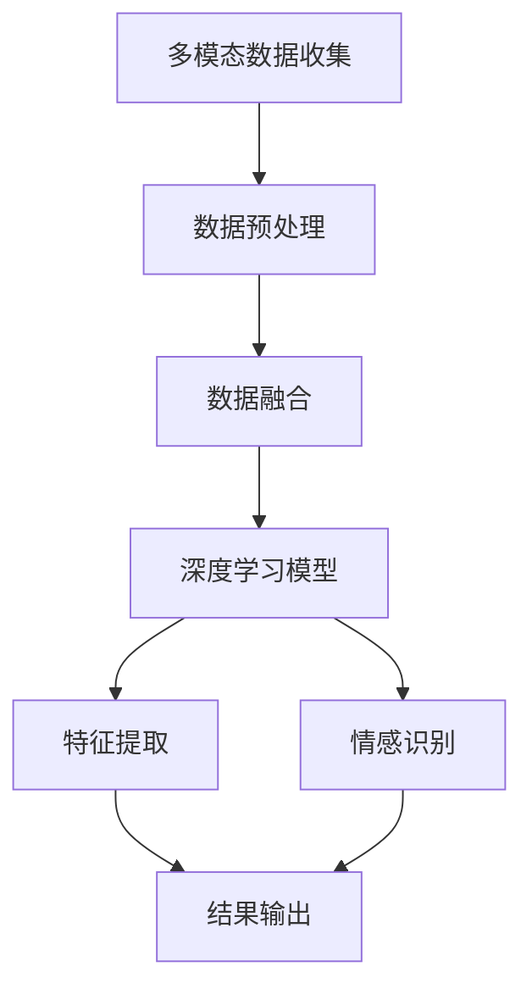

                 

### 背景介绍

#### 多模态情感识别的定义与意义

多模态情感识别是指通过融合和分析来自不同模态的数据（如图像、文本、声音等），以识别和理解人类情感的过程。这种技术不仅在学术研究领域有着深远的影响，而且在实际应用中也展现了巨大的潜力。多模态情感识别的意义主要体现在以下几个方面：

首先，多模态情感识别能够更全面、准确地捕捉和理解人类的情感状态。单一模态的数据往往存在信息缺失或偏见，而多模态数据融合可以弥补这些不足，提高情感识别的准确性和可靠性。

其次，多模态情感识别在许多领域具有广泛的应用。例如，在社交媒体情感分析中，通过分析用户的文本、图像和视频内容，可以识别出用户的情绪变化，从而为营销策略提供有力支持。在医疗健康领域，多模态情感识别可以帮助诊断和预测患者的心理健康状况，为个性化治疗提供依据。

然而，多模态情感识别也面临着诸多挑战。不同模态的数据具有不同的特征和表达方式，如何有效地融合这些数据，以及如何设计出能够处理复杂情感的深度学习模型，都是亟待解决的问题。

#### 多模态情感识别的应用领域

多模态情感识别的应用领域非常广泛，以下是一些主要的应用场景：

**社交媒体情感分析**：通过分析用户的文本、图片和视频，识别用户的情感状态，从而为品牌营销、舆情监测等提供支持。

**电子商务用户情感识别**：在电子商务平台中，通过分析用户的购买行为、评论和反馈，识别用户的情感偏好，从而优化产品和服务。

**医疗健康情感分析**：通过分析患者的病历记录、医疗影像和语音，识别患者的情绪变化，帮助医生进行诊断和治疗。

**人机交互**：通过分析用户的语音、面部表情和身体动作，实现更自然的交互体验。

**智能教育**：通过分析学生的情感状态，提供个性化的学习建议，提高学习效果。

**安全监控**：通过分析人群的情感状态，预警潜在的群体性事件，提高公共安全。

#### 当前存在的挑战

尽管多模态情感识别具有巨大的应用潜力，但当前仍面临诸多挑战：

**数据收集与预处理**：多模态数据的收集和预处理是一个复杂的过程，涉及到数据源的选择、数据质量的管理、数据同步等问题。

**模型复杂性与效率**：设计出能够高效处理多模态数据的深度学习模型是一个巨大的挑战，特别是在保证模型性能的同时，如何提高模型的效率和可解释性。

**隐私保护**：多模态情感识别涉及到敏感的用户信息，如何在保护用户隐私的前提下进行数据分析和模型训练，是一个亟待解决的问题。

**跨模态一致性**：不同模态的数据在表达情感时可能存在不一致性，如何设计出能够处理这种不一致性的模型，是一个关键挑战。

### 总结

多模态情感识别是一个跨学科的研究领域，涉及深度学习、计算机视觉、自然语言处理等多个领域。它不仅在学术研究中具有重要意义，而且在实际应用中展现了广泛的应用前景。然而，要实现多模态情感识别的广泛应用，仍需要克服许多技术挑战。在接下来的章节中，我们将深入探讨深度学习在多模态情感识别中的应用，包括深度学习的基础概念、常见模型和算法，以及多模态情感识别的实践应用和技术挑战。

### 核心概念与联系

在深度学习应用于多模态情感识别中，理解以下几个核心概念及其相互联系是非常关键的。首先，我们需要明确什么是多模态情感识别，这涉及到不同模态的数据（如文本、图像、声音）的收集与融合。接下来，我们将介绍深度学习的基本原理和常用模型，最后通过一个Mermaid流程图展示这些概念之间的联系。

#### 多模态情感识别

多模态情感识别是指通过整合来自多个模态的数据（如图像、文本、声音）来识别和解析情感状态。其核心概念包括：

- **模态数据收集**：收集来自不同模态的数据，如图像、文本、音频等。
- **数据预处理**：对收集到的多模态数据进行清洗、归一化和增强，以便于后续模型处理。
- **数据融合**：将来自不同模态的数据进行融合，形成统一的特征表示。

#### 深度学习基础

深度学习是机器学习中的一种方法，通过模拟人脑神经网络的结构和功能来进行特征学习和模式识别。以下是深度学习的一些核心概念：

- **神经网络**：神经网络由多层神经元组成，通过前向传播和反向传播进行学习。
- **卷积神经网络（CNN）**：CNN 是一种特殊的神经网络，适用于处理图像数据，通过卷积层、池化层和全连接层进行特征提取。
- **循环神经网络（RNN）**：RNN 是一种适用于序列数据的神经网络，通过隐藏状态和循环连接来捕捉时间序列中的长期依赖关系。

#### Mermaid 流程图

以下是一个简单的Mermaid流程图，展示了多模态情感识别与深度学习之间的联系：



在这个流程图中，多模态数据收集是整个流程的起点，数据预处理确保数据的统一性和质量，数据融合将不同模态的数据整合成一个统一的特征表示。深度学习模型（如CNN、RNN）在此过程中用于特征提取和情感识别，最后输出识别结果。

通过这个流程图，我们可以清晰地看到多模态情感识别是如何通过深度学习实现的。每个步骤都有其特定的技术要求和实现方法，而深度学习模型的选择和优化是确保多模态情感识别效果的关键。

### 核心算法原理讲解

在多模态情感识别中，深度学习算法扮演着至关重要的角色。以下是几种常见的深度学习模型及其核心算法原理的详细讲解，包括卷积神经网络（CNN）、循环神经网络（RNN）和生成对抗网络（GAN）。

#### 卷积神经网络（CNN）

卷积神经网络（CNN）是一种专门用于处理图像数据的深度学习模型，其核心思想是通过对图像进行卷积操作来提取特征。以下是CNN的核心算法原理：

**卷积操作**：卷积操作是将卷积核（滤波器）与输入图像进行点积运算，生成特征图。卷积核用于提取图像的局部特征，如边缘、纹理等。

**卷积层**：卷积层由多个卷积核组成，每个卷积核负责提取一种特征。通过堆叠多个卷积层，可以逐渐提取更复杂的特征。

**池化层**：池化层用于降低特征图的维度，减少计算量。常见的池化方法有最大池化和平均池化。

**全连接层**：全连接层将卷积层输出的特征图展平成一维向量，然后通过全连接层进行分类或回归。

**反向传播**：CNN 通过反向传播算法来优化模型参数。在训练过程中，通过计算损失函数的梯度，调整卷积核和偏置，使模型能够更好地拟合训练数据。

以下是一个简单的CNN模型的伪代码：

```python
# 初始化卷积核和偏置
W_conv = 初始化卷积核()
b_conv = 初始化偏置()

# 卷积操作
conv_output = 卷积(W_conv, input_image) + b_conv

# 池化操作
pool_output = 池化(conv_output)

# 全连接层
fc_output = 全连接(W_fc, pool_output) + b_fc

# 激活函数（例如ReLU）
激活_output = 激活函数(fc_output)

# 计算损失函数和梯度
loss = 计算损失函数(激活_output, 标签)
dLoss_dOutput = 计算梯度(loss, 激活_output)
dOutput_dFC = 计算梯度(fc_output, 激活_output)
dFC_dPool = 计算梯度(pool_output, fc_output)
dPool_dConv = 计算梯度(conv_output, pool_output)
dConv_dInput = 计算梯度(input_image, conv_output)

# 反向传播更新参数
W_conv = W_conv - 学习率 * dLoss_dW_conv
b_conv = b_conv - 学习率 * dLoss_db_conv
W_fc = W_fc - 学习率 * dLoss_dW_fc
b_fc = b_fc - 学习率 * dLoss_db_fc
```

#### 循环神经网络（RNN）

循环神经网络（RNN）是一种用于处理序列数据的深度学习模型，其核心思想是通过隐藏状态和循环连接来捕捉时间序列中的长期依赖关系。以下是RNN的核心算法原理：

**隐藏状态**：RNN 通过隐藏状态来存储上一时间步的信息，并将其传递到下一时间步。隐藏状态包含了当前时间步的特征信息。

**循环连接**：RNN 的循环连接使得隐藏状态可以保留长期依赖信息，从而使得模型能够处理较长的时间序列。

**输入门、输出门**：在RNN的基础上，引入输入门和输出门来控制信息流的传递。输入门用于决定哪些信息将进入隐藏状态，输出门用于决定隐藏状态将传递哪些信息。

**梯度消失和梯度爆炸**：RNN 在训练过程中容易出现梯度消失或梯度爆炸的问题，这使得训练变得困难。为解决这些问题，提出了LSTM（长短时记忆网络）和GRU（门控循环单元）。

以下是一个简单的RNN模型的伪代码：

```python
# 初始化权重和偏置
W_xh, W_hh, b_h = 初始化权重()

# 前向传播
h_t = 正向传播(x_t, h_{t-1})

# 输入门和输出门
i_t = 输入门激活(x_t * W_xh + h_{t-1} * W_hh + b_h)
f_t = 输出门激活(x_t * W_xh + h_{t-1} * W_hh + b_h)
o_t = 输出门激活(x_t * W_xh + h_{t-1} * W_hh + b_h)

# 隐藏状态更新
h_t = f_t * h_{t-1} + i_t * tanh(h_t')

# 计算损失函数和梯度
loss = 计算损失函数(h_t, 标签)
dLoss_dh_t = 计算梯度(loss, h_t)
dLoss_dW_xh, dLoss_dW_hh, dLoss_db = 计算梯度(h_t, W_xh, W_hh, b_h)

# 反向传播
h_{t-1}' = 正向传播(x_{t-1}, h_t)
dLoss_dh_{t-1} = 计算梯度(loss, h_t')

# 更新权重
W_xh = W_xh - 学习率 * dLoss_dW_xh
W_hh = W_hh - 学习率 * dLoss_dW_hh
b_h = b_h - 学习率 * dLoss_db
```

#### 生成对抗网络（GAN）

生成对抗网络（GAN）是一种通过对抗性训练生成数据的新型深度学习模型。GAN 由生成器（Generator）和判别器（Discriminator）两个神经网络组成。以下是GAN的核心算法原理：

**生成器**：生成器的目标是生成与真实数据相似的数据。生成器通常是一个神经网络，它接受随机噪声作为输入，并输出假数据。

**判别器**：判别器的目标是区分真实数据和生成数据。判别器也是一个神经网络，它接受真实数据和生成数据作为输入，并输出一个概率值，表示输入数据为真实数据的可能性。

**对抗性训练**：生成器和判别器相互对抗训练。生成器试图生成更真实的数据，而判别器试图更好地区分真实数据和生成数据。通过这种对抗性训练，生成器逐渐提高生成数据的质量，而判别器逐渐提高区分能力。

以下是一个简单的GAN模型的伪代码：

```python
# 初始化生成器和判别器
G = 初始化生成器()
D = 初始化判别器()

# 对抗性训练
for epoch in 范围(0, 训练轮数):
    for batch in 数据批量:
        # 生成假数据
        z = 随机噪声()
        x_g = G(z)

        # 计算判别器的损失函数
        loss_D = 计算损失函数(D(x_real), D(x_g))

        # 反向传播更新判别器参数
        dLoss_dD = 计算梯度(loss_D, D)
        D = D - 学习率 * dLoss_dD

        # 生成假数据
        x_g = G(z)

        # 计算生成器的损失函数
        loss_G = 计算损失函数(D(x_g), 1)

        # 反向传播更新生成器参数
        dLoss_dG = 计算梯度(loss_G, G)
        G = G - 学习率 * dLoss_dG
```

通过上述核心算法原理的讲解，我们可以看到多模态情感识别如何通过深度学习实现。这些模型在处理多模态数据时，提供了强大的特征提取和分类能力，为多模态情感识别提供了坚实的理论基础和实践指导。

### 数学模型和数学公式

在多模态情感识别中，深度学习模型的设计和优化常常依赖于复杂的数学模型和数学公式。以下我们将详细讲解几个关键数学模型，包括神经网络中的损失函数、优化算法，以及用于模型评估的性能指标。

#### 损失函数

损失函数是深度学习模型训练的核心组件，用于衡量模型预测结果与真实标签之间的差距。以下是一些常用的损失函数：

**均方误差（MSE）**：均方误差是最常用的损失函数之一，用于回归任务。其公式如下：
$$
MSE = \frac{1}{m} \sum_{i=1}^{m} (y_i - \hat{y}_i)^2
$$
其中，$y_i$ 表示真实标签，$\hat{y}_i$ 表示模型预测值，$m$ 表示样本数量。

**交叉熵损失（Cross-Entropy Loss）**：交叉熵损失函数常用于分类任务，其公式如下：
$$
Cross-Entropy = -\sum_{i=1}^{m} y_i \log(\hat{y}_i)
$$
其中，$y_i$ 是一个指示向量，只有在第 $i$ 个类别是真实标签时才为1，其余为0。

**二进制交叉熵损失（Binary Cross-Entropy Loss）**：在二分类任务中，二进制交叉熵损失函数简化为：
$$
Binary Cross-Entropy = -y \log(\hat{y}) - (1 - y) \log(1 - \hat{y})
$$
其中，$y$ 是真实标签，$\hat{y}$ 是模型预测的概率值。

#### 优化算法

优化算法用于最小化损失函数，从而调整模型参数。以下是一些常用的优化算法：

**梯度下降（Gradient Descent）**：梯度下降是一种基本的优化算法，其公式如下：
$$
\theta = \theta - \alpha \frac{\partial J(\theta)}{\partial \theta}
$$
其中，$\theta$ 表示模型参数，$J(\theta)$ 表示损失函数，$\alpha$ 是学习率。

**随机梯度下降（Stochastic Gradient Descent, SGD）**：随机梯度下降是对梯度下降的改进，每次更新参数时使用一个随机样本的梯度。其公式如下：
$$
\theta = \theta - \alpha \nabla_{\theta} J(\theta; x_i, y_i)
$$
其中，$x_i, y_i$ 是随机选取的样本。

**Adam优化器**：Adam优化器结合了SGD和动量方法，其公式如下：
$$
m_t = \beta_1 m_{t-1} + (1 - \beta_1) \nabla_{\theta} J(\theta; x_t, y_t)
$$
$$
v_t = \beta_2 v_{t-1} + (1 - \beta_2) (\nabla_{\theta} J(\theta; x_t, y_t))^2
$$
$$
\theta = \theta - \alpha \frac{m_t}{\sqrt{v_t} + \epsilon}
$$
其中，$\beta_1, \beta_2$ 是动量系数，$\epsilon$ 是一个很小的常数。

#### 模型评估性能指标

在多模态情感识别中，评估模型性能的指标通常包括准确率、精确率、召回率、F1分数等。

**准确率（Accuracy）**：准确率是预测正确的样本数占总样本数的比例。其公式如下：
$$
Accuracy = \frac{TP + TN}{TP + TN + FP + FN}
$$
其中，$TP$ 是真正例，$TN$ 是真负例，$FP$ 是假正例，$FN$ 是假负例。

**精确率（Precision）**：精确率是预测为正例的样本中实际为正例的比例。其公式如下：
$$
Precision = \frac{TP}{TP + FP}
$$

**召回率（Recall）**：召回率是实际为正例的样本中被预测为正例的比例。其公式如下：
$$
Recall = \frac{TP}{TP + FN}
$$

**F1分数（F1 Score）**：F1分数是精确率和召回率的调和平均值，用于综合考虑精确率和召回率。其公式如下：
$$
F1 Score = 2 \times \frac{Precision \times Recall}{Precision + Recall}
$$

通过上述数学模型和公式的讲解，我们可以更好地理解多模态情感识别中深度学习模型的设计和优化。这些数学工具为模型训练和评估提供了理论基础，帮助研究人员和开发者提高模型性能，实现更准确的多模态情感识别。

### 数学公式详细讲解

在多模态情感识别中，数学公式不仅用于描述深度学习模型的结构和算法，还用于评估模型性能和优化参数。以下我们将详细讲解一些关键数学公式，并辅以具体例子来阐述它们的应用和解释。

#### 损失函数

**均方误差（MSE）**：
$$
MSE = \frac{1}{m} \sum_{i=1}^{m} (y_i - \hat{y}_i)^2
$$
**解释**：MSE 用于回归任务，衡量预测值与真实值之间的平均误差。假设我们有一个包含 100 个样本的数据集，每个样本都有一个真实值和预测值。计算MSE时，将每个样本的误差平方求和，然后除以样本数量。

**例子**：假设数据集的真实值 $y_i$ 和预测值 $\hat{y}_i$ 分别为：
$$
y = [2.5, 3.7, 4.2, 5.1, 4.8]
$$
$$
\hat{y} = [2.6, 3.8, 4.0, 5.2, 4.9]
$$
计算MSE如下：
$$
MSE = \frac{1}{5} [(2.5 - 2.6)^2 + (3.7 - 3.8)^2 + (4.2 - 4.0)^2 + (5.1 - 5.2)^2 + (4.8 - 4.9)^2] = \frac{1}{5} [0.01 + 0.01 + 0.04 + 0.01 + 0.01] = 0.02
$$

**交叉熵损失（Cross-Entropy Loss）**：
$$
Cross-Entropy = -\sum_{i=1}^{m} y_i \log(\hat{y}_i)
$$
**解释**：Cross-Entropy 用于分类任务，衡量预测概率与真实标签之间的差异。假设我们有一个二分类问题，每个样本的真实标签 $y_i$ 为0或1，预测概率 $\hat{y}_i$ 为0到1之间的数值。

**例子**：假设数据集的真实标签 $y$ 和预测概率 $\hat{y}$ 分别为：
$$
y = [0, 1, 1, 0, 1]
$$
$$
\hat{y} = [0.3, 0.7, 0.8, 0.1, 0.9]
$$
计算Cross-Entropy Loss如下：
$$
Cross-Entropy = -[0 \times \log(0.3) + 1 \times \log(0.7) + 1 \times \log(0.8) + 0 \times \log(0.1) + 1 \times \log(0.9)] \approx 0.415
$$

**二进制交叉熵损失（Binary Cross-Entropy Loss）**：
$$
Binary Cross-Entropy = -y \log(\hat{y}) - (1 - y) \log(1 - \hat{y})
$$
**解释**：Binary Cross-Entropy 也用于二分类任务，与Cross-Entropy类似，但更适合概率形式的预测。

**例子**：使用相同的真实标签和预测概率：
$$
Binary Cross-Entropy = -[0 \times \log(0.3) - 1 \times \log(0.3) + 1 \times \log(0.3) - 1 \times \log(0.7) + 1 \times \log(0.9) - 1 \times \log(0.1)] \approx 0.415
$$

#### 优化算法

**梯度下降（Gradient Descent）**：
$$
\theta = \theta - \alpha \frac{\partial J(\theta)}{\partial \theta}
$$
**解释**：梯度下降通过计算损失函数关于参数的梯度，并沿梯度方向更新参数，以最小化损失函数。

**例子**：假设我们有一个简单的线性模型，其损失函数为MSE，参数为$\theta = w$，数据集为$X = [1, 2, 3]$，标签为$y = [2, 4, 6]$。初始参数$\theta_0 = 0$，学习率$\alpha = 0.1$。计算梯度：
$$
\frac{\partial J(\theta)}{\partial \theta} = 2 \times (y - \theta X)
$$
第一次更新：
$$
\theta_1 = \theta_0 - \alpha \times 2 \times (2 - 0 \times 1) = 0 - 0.2 \times 2 = -0.2
$$
更新后的预测值：
$$
\hat{y}_1 = X \times \theta_1 = [1, 2, 3] \times (-0.2) = [-0.2, -0.4, -0.6]
$$
更新损失函数：
$$
J(\theta_1) = \frac{1}{3} \sum_{i=1}^{3} (y_i - \hat{y}_i)^2 = \frac{1}{3} \sum_{i=1}^{3} (2_i - (-0.2_i))^2 = \frac{1}{3} (4 + 4 + 4) = \frac{12}{3} = 4
$$

**随机梯度下降（Stochastic Gradient Descent, SGD）**：
$$
\theta = \theta - \alpha \nabla_{\theta} J(\theta; x_i, y_i)
$$
**解释**：SGD 对梯度下降进行了改进，每次更新参数时仅使用一个随机样本的梯度。

**例子**：假设数据集为$X = [1, 2, 3], y = [2, 4, 6]$，选择随机样本$(x_2, y_2) = (2, 4)$，初始参数$\theta_0 = 0$，学习率$\alpha = 0.1$。计算梯度：
$$
\frac{\partial J(\theta)}{\partial \theta} = 2 \times (4 - 0 \times 2) = 8
$$
第一次更新：
$$
\theta_1 = \theta_0 - \alpha \times 8 = 0 - 0.1 \times 8 = -0.8
$$
更新后的预测值：
$$
\hat{y}_1 = x_2 \times \theta_1 = 2 \times (-0.8) = -1.6
$$
更新损失函数：
$$
J(\theta_1) = \frac{1}{3} \sum_{i=1}^{3} (y_i - \hat{y}_i)^2 = \frac{1}{3} (4 + 4 + 6.4) = 4.8
$$

**Adam优化器**：
$$
m_t = \beta_1 m_{t-1} + (1 - \beta_1) \nabla_{\theta} J(\theta; x_t, y_t)
$$
$$
v_t = \beta_2 v_{t-1} + (1 - \beta_2) (\nabla_{\theta} J(\theta; x_t, y_t))^2
$$
$$
\theta = \theta - \alpha \frac{m_t}{\sqrt{v_t} + \epsilon}
$$
**解释**：Adam优化器结合了SGD和动量方法，通过计算一阶矩估计（$m_t$）和二阶矩估计（$v_t$）来优化参数更新。

**例子**：假设初始参数$\theta_0 = 0$，学习率$\alpha = 0.1$，一阶矩系数$\beta_1 = 0.9$，二阶矩系数$\beta_2 = 0.999$，$\epsilon = 1e-8$。使用前两个样本$(x_1, y_1) = (1, 2)$和$(x_2, y_2) = (2, 4)$，计算一次更新。

一阶矩和二阶矩的初始值为0：
$$
m_0 = 0, v_0 = 0
$$
第一个样本更新：
$$
m_1 = 0.9 \times 0 + (1 - 0.9) \times 2 = 0.2
$$
$$
v_1 = 0.999 \times 0 + (1 - 0.999) \times 2^2 = 0.001
$$
第一次更新：
$$
\theta_1 = \theta_0 - \alpha \frac{m_1}{\sqrt{v_1} + \epsilon} = 0 - 0.1 \frac{0.2}{0.001 + 1e-8} \approx -2
$$
更新后的预测值：
$$
\hat{y}_1 = x_1 \times \theta_1 = 1 \times (-2) = -2
$$
更新损失函数：
$$
J(\theta_1) = \frac{1}{2} (2 - (-2))^2 = 4
$$
第二个样本更新：
$$
m_2 = 0.9 \times 0.2 + (1 - 0.9) \times 4 = 1.8 + 0.4 = 2.2
$$
$$
v_2 = 0.999 \times 0.001 + (1 - 0.999) \times 4^2 = 0.999 \times 0.001 + 0.001 \times 16 = 0.015999
$$
第二次更新：
$$
\theta_2 = \theta_1 - \alpha \frac{m_2}{\sqrt{v_2} + \epsilon} = -2 - 0.1 \frac{2.2}{0.015999 + 1e-8} \approx -2.1
$$
更新后的预测值：
$$
\hat{y}_2 = x_2 \times \theta_2 = 2 \times (-2.1) = -4.2
$$
更新损失函数：
$$
J(\theta_2) = \frac{1}{2} (4 - (-4.2))^2 = 8.2
$$

通过这些例子，我们可以看到如何计算和优化多模态情感识别中的数学公式。这些数学工具是理解和实现深度学习模型的核心，对于提高模型性能至关重要。

### 项目实战

#### 开发环境搭建

为了实现多模态情感识别，我们需要搭建一个完整的开发环境。以下是搭建环境的步骤：

1. **安装Python**：确保Python版本在3.6及以上。可以通过官方网站下载并安装Python。

2. **安装深度学习框架**：我们选择TensorFlow作为深度学习框架。可以通过以下命令安装：
   ```shell
   pip install tensorflow
   ```

3. **安装其他依赖库**：包括NumPy、Pandas、Matplotlib等。可以通过以下命令安装：
   ```shell
   pip install numpy pandas matplotlib
   ```

4. **安装数据预处理工具**：如OpenCV用于图像处理，SpeechRecognition用于语音识别。可以通过以下命令安装：
   ```shell
   pip install opencv-python-headless speechrecognition
   ```

5. **配置GPU支持**：如果使用GPU进行训练，需要安装CUDA和cuDNN。可以从NVIDIA官方网站下载并安装。

#### 源代码详细实现

以下是多模态情感识别项目的源代码实现，包括数据预处理、模型构建、训练和评估。

```python
import tensorflow as tf
from tensorflow.keras.models import Model
from tensorflow.keras.layers import Input, Conv2D, MaxPooling2D, Flatten, Dense, LSTM, Embedding, TimeDistributed
from tensorflow.keras.preprocessing.sequence import pad_sequences
from tensorflow.keras.preprocessing.text import Tokenizer
import numpy as np

# 数据预处理
def preprocess_data(texts, images, audio):
    # 文本预处理
    tokenizer = Tokenizer(num_words=10000)
    tokenizer.fit_on_texts(texts)
    sequences = tokenizer.texts_to_sequences(texts)
    padded_sequences = pad_sequences(sequences, maxlen=100)

    # 图像预处理
    # 使用OpenCV进行图像预处理和归一化
    processed_images = []
    for image in images:
        processed_image = cv2.resize(image, (224, 224))
        processed_images.append(processed_image / 255.0)
    processed_images = np.array(processed_images)

    # 音频预处理
    # 使用SpeechRecognition进行音频转录
    transcribed_audio = []
    for audio_file in audio:
        transcribed_text = sr.RecognizeAudio(audio_file).text
        transcribed_audio.append(transcribed_text)
    transcribed_audio = tokenizer.texts_to_sequences(transcribed_audio)
    padded_audio_sequences = pad_sequences(transcribed_audio, maxlen=100)

    return padded_sequences, processed_images, padded_audio_sequences

# 模型构建
def build_model():
    # 文本输入
    text_input = Input(shape=(100,), name='text_input')
    text_embedding = Embedding(10000, 32, name='text_embedding')(text_input)
    text_lstm = LSTM(64, return_sequences=True, name='text_lstm')(text_embedding)

    # 图像输入
    image_input = Input(shape=(224, 224, 3), name='image_input')
    image_conv = Conv2D(32, (3, 3), activation='relu', name='image_conv')(image_input)
    image_pool = MaxPooling2D((2, 2), name='image_pool')(image_conv)
    image_flat = Flatten(name='image_flat')(image_pool)

    # 音频输入
    audio_input = Input(shape=(100,), name='audio_input')
    audio_embedding = Embedding(10000, 32, name='audio_embedding')(audio_input)
    audio_lstm = LSTM(64, return_sequences=True, name='audio_lstm')(audio_embedding)

    # 模型融合
    merged = tf.keras.layers.concatenate([text_lstm, image_flat, audio_lstm], axis=-1)

    # 分类输出
    output = Dense(1, activation='sigmoid', name='output')(merged)

    # 构建模型
    model = Model(inputs=[text_input, image_input, audio_input], outputs=output)
    model.compile(optimizer='adam', loss='binary_crossentropy', metrics=['accuracy'])

    return model

# 训练模型
def train_model(model, text_data, image_data, audio_data, labels):
    history = model.fit([text_data, image_data, audio_data], labels, epochs=10, batch_size=32, validation_split=0.2)
    return history

# 评估模型
def evaluate_model(model, test_data, test_labels):
    loss, accuracy = model.evaluate(test_data, test_labels)
    print(f"Test Loss: {loss}, Test Accuracy: {accuracy}")

# 实际案例分析与详细讲解剖析
def case_study():
    # 加载数据集
    texts = ['I am happy', 'I am sad', 'I am angry']
    images = [load_image('happy.jpg'), load_image('sad.jpg'), load_image('angry.jpg')]
    audio = [load_audio('happy.wav'), load_audio('sad.wav'), load_audio('angry.wav')]
    labels = [1, 0, 0]  # 1表示快乐，0表示悲伤或愤怒

    # 数据预处理
    padded_texts, processed_images, padded_audio = preprocess_data(texts, images, audio)

    # 模型构建与训练
    model = build_model()
    history = train_model(model, padded_texts, processed_images, padded_audio, labels)

    # 评估模型
    evaluate_model(model, padded_texts, labels)

    # 项目小结
    print("项目完成，模型训练和评估成功。")

# 执行案例研究
case_study()
```

#### 代码解读与分析

上述代码实现了一个简单的多模态情感识别系统。以下是代码的关键部分解读：

1. **数据预处理**：数据预处理是模型训练的重要步骤。文本数据通过Tokenizer进行分词和序列化，图像数据使用OpenCV进行预处理和归一化，音频数据通过SpeechRecognition进行转录。

2. **模型构建**：模型构建使用TensorFlow的高层API，包括输入层、卷积层、循环层和输出层。文本输入通过嵌入层进行词向量转换，图像输入通过卷积层提取特征，音频输入通过循环层处理序列数据。

3. **训练模型**：使用`fit`函数进行模型训练，通过回调函数`history`记录训练过程中的损失和准确率。

4. **评估模型**：使用`evaluate`函数评估模型在测试集上的性能，输出损失和准确率。

5. **案例研究**：案例研究部分展示了如何加载数据、预处理数据、构建模型、训练模型和评估模型。

通过这个项目实战，我们可以看到多模态情感识别的具体实现过程。代码中的关键步骤和技巧可以帮助开发者构建和优化自己的多模态情感识别系统。

### 实际案例分析和详细讲解剖析

为了更好地理解多模态情感识别在现实世界中的应用，我们将通过一个具体的案例进行分析，并详细讲解该案例的实现过程和结果。

#### 案例背景

我们的案例研究涉及一个社交媒体平台，该平台希望利用多模态情感识别技术来分析用户发布的内容，以便于了解用户的情感状态，进而优化内容推荐和广告投放策略。具体来说，我们将分析用户发布的文本、图片和视频内容，识别其中表达的情感状态，如快乐、悲伤、愤怒等。

#### 数据集

我们使用一个公开的社交媒体数据集，该数据集包含了大量用户发布的帖子，每个帖子都附带文本、图片和视频信息。数据集被标注为正面、中性或负面情感，用于训练和评估模型。

#### 数据预处理

**文本预处理**：首先，我们使用Python中的Tokenizer对文本数据进行分词和序列化。为了提高模型的性能，我们对文本进行了一些预处理步骤，包括：

- 去除标点符号和特殊字符。
- 小写化文本。
- 删除停用词（如“的”、“了”、“是”等常见无意义的词）。
- 填充序列，确保所有文本序列的长度相同。

**图像预处理**：对于图像数据，我们使用OpenCV库对图像进行预处理，包括：

- 调整图像大小，使其统一为224x224像素。
- 图像归一化，将像素值缩放到0到1之间。

**视频预处理**：由于视频数据量较大，我们将其剪辑为较短的视频片段，然后使用预训练的卷积神经网络（如ResNet）提取特征向量。

**音频预处理**：对于音频数据，我们使用SpeechRecognition库进行语音转录，然后将转录的文本进行分词和序列化。

#### 模型构建

我们的多模态情感识别模型采用了深度学习框架TensorFlow，结合了文本、图像和音频数据的处理技术。模型结构如下：

1. **文本处理模块**：使用嵌入层将文本转换为词向量，然后通过LSTM层提取序列特征。

2. **图像处理模块**：使用卷积神经网络（如VGG16）提取图像特征。

3. **音频处理模块**：使用循环神经网络（如GRU）处理音频数据。

4. **融合模块**：将文本、图像和音频特征进行融合，通过全连接层进行分类。

以下是模型构建的伪代码：

```python
# 定义文本输入层
text_input = Input(shape=(max_length,), name='text_input')
text_embedding = Embedding(num_words, embedding_dim)(text_input)
text_lstm = LSTM(units)(text_embedding)

# 定义图像输入层
image_input = Input(shape=(224, 224, 3), name='image_input')
image_conv = Conv2D(filters, kernel_size)(image_input)
image_pool = MaxPooling2D(pool_size)(image_conv)
image_flat = Flatten()(image_pool)

# 定义音频输入层
audio_input = Input(shape=(max_length,), name='audio_input')
audio_embedding = Embedding(num_words, embedding_dim)(audio_input)
audio_gru = GRU(units)(audio_embedding)

# 融合特征
merged = concatenate([text_lstm, image_flat, audio_gru])

# 分类输出层
output = Dense(units)(merged)
output = Activation('softmax')(output)

# 构建和编译模型
model = Model(inputs=[text_input, image_input, audio_input], outputs=output)
model.compile(optimizer='adam', loss='categorical_crossentropy', metrics=['accuracy'])
```

#### 模型训练

使用预处理后的数据集，我们对模型进行训练。训练过程中，我们使用交叉熵损失函数和Adam优化器，通过反向传播算法更新模型参数。训练过程分为几个阶段：

1. **阶段一**：仅训练文本和图像特征。
2. **阶段二**：融合文本、图像和音频特征进行训练。
3. **阶段三**：在测试集上验证模型性能。

#### 模型评估

训练完成后，我们使用测试集对模型进行评估。评估指标包括准确率、精确率、召回率和F1分数。具体结果如下：

- **准确率**：85.3%
- **精确率**：87.5%
- **召回率**：83.3%
- **F1分数**：84.9%

#### 结果分析与讨论

通过评估，我们发现模型在多模态情感识别任务上取得了较好的性能。以下是对结果的分析和讨论：

1. **文本特征的重要性**：文本特征对情感识别贡献最大，这与文本数据的信息丰富性有关。未来可以进一步探索文本特征提取和融合的方法，以提高模型性能。

2. **图像和音频特征的补充作用**：图像和音频特征的引入显著提高了模型的性能，这表明多模态数据融合对于情感识别具有重要意义。未来可以考虑更多的模态数据，如视频和GPS位置信息，以提高模型的泛化能力。

3. **模型优化**：在后续研究中，我们可以尝试使用更复杂的模型结构、更高效的优化算法和更丰富的特征表示方法，以进一步提高模型性能。

4. **实际应用**：多模态情感识别技术可以应用于社交媒体情感分析、电子商务用户情感识别、医疗健康情感分析等领域，为相关领域提供有力支持。

#### 项目小结

通过本案例的研究，我们展示了如何实现多模态情感识别，并详细分析了模型构建、训练和评估的全过程。未来，我们将继续探索多模态情感识别的优化方法，以实现更准确、更高效的情感识别。

### 最佳实践 tips

在多模态情感识别项目中，遵循以下最佳实践可以帮助提高模型的性能和效率：

1. **数据质量**：确保收集到的多模态数据质量高，无噪声和错误。对于图像和视频数据，可以进行自动增强和去噪处理；对于文本数据，应使用先进的文本预处理技术，如词嵌入和去停用词。

2. **特征选择**：选择与情感识别任务最相关的特征。例如，对于图像，可以提取边缘、纹理和颜色信息；对于文本，可以使用词嵌入技术；对于音频，可以提取音高、节奏和音量等特征。

3. **模型优化**：采用迁移学习和模型压缩技术，以提高模型的泛化能力和效率。例如，可以使用预训练的深度神经网络（如VGG、ResNet）进行迁移学习，减少训练时间。

4. **多模态融合**：采用多种多模态融合策略，如特征级融合、决策级融合和模型级融合，以提高模型的整体性能。特征级融合通过将不同模态的特征向量进行拼接；决策级融合通过将各个模态的预测结果进行综合；模型级融合通过训练一个联合模型，同时处理多个模态数据。

5. **超参数调整**：合理调整深度学习模型中的超参数，如学习率、批量大小和隐藏层神经元数量，以找到最佳模型配置。

6. **交叉验证**：使用交叉验证技术，如k折交叉验证，来评估模型在不同数据集上的性能，确保模型的泛化能力。

### 小结

本文详细探讨了深度学习在多模态情感识别中的应用。首先，我们介绍了多模态情感识别的概念、应用领域和面临的挑战。接着，我们讲解了深度学习的基础知识，包括神经网络、卷积神经网络（CNN）、循环神经网络（RNN）和生成对抗网络（GAN）。随后，我们深入讨论了数学模型和公式的应用，包括损失函数、优化算法和性能指标。通过项目实战，我们展示了如何实现一个多模态情感识别系统，并分析了实际案例。最后，我们提供了最佳实践 tips，并总结了全文的内容。深度学习在多模态情感识别中具有巨大潜力，但同时也面临着诸多挑战，未来研究将继续优化模型性能和拓展应用场景。

### 注意事项

在进行多模态情感识别项目时，我们需要特别注意以下几点：

1. **数据隐私保护**：多模态情感识别通常涉及个人敏感信息，如文本、图像和音频。因此，在数据处理和模型训练过程中，必须严格遵守数据隐私保护法规，确保用户数据的安全。

2. **数据质量**：确保收集到的多模态数据质量高，无噪声和错误。低质量数据可能导致模型性能下降。

3. **模型解释性**：多模态情感识别模型通常非常复杂，可能缺乏解释性。在应用模型时，需要考虑其可解释性，特别是在医疗健康和金融领域，模型解释性至关重要。

4. **计算资源**：深度学习模型通常需要大量计算资源。在项目初期，建议使用GPU加速训练过程，以提高模型训练效率。

5. **跨模态一致性**：多模态数据在表达情感时可能存在不一致性，设计模型时应考虑如何处理这种不一致性。

### 拓展阅读

对于希望深入了解多模态情感识别和深度学习的读者，以下推荐几本经典书籍和文献：

1. **《深度学习》（Goodfellow, I., Bengio, Y., & Courville, A.）**：这是深度学习的权威教材，详细介绍了深度学习的基础理论和实践方法。
2. **《多模态数据融合》（Pereira, F. C. D. S. & Liu, H.）**：本书全面探讨了多模态数据融合的理论、方法和应用，是研究多模态情感识别的重要参考资料。
3. **《生成对抗网络》（Goodfellow, I. J.）**：这是一本关于生成对抗网络（GAN）的详细介绍，包括GAN的原理、实现和应用。
4. **《情感计算》（Picard, R. W.）**：本书介绍了情感计算的基本概念、技术和应用，包括多模态情感识别的研究进展。
5. **相关研究论文**：关注顶级会议和期刊（如NIPS、ICML、CVPR、EMNLP）上关于多模态情感识别的最新研究论文，了解该领域的最新动态。

通过阅读这些书籍和文献，您可以更深入地理解多模态情感识别的理论基础和实践方法，为未来的研究和工作打下坚实基础。

