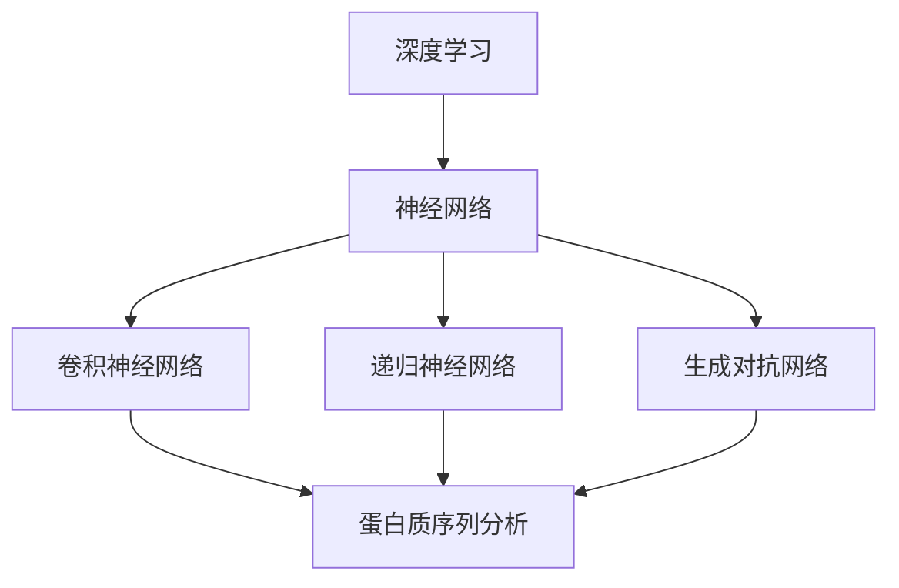
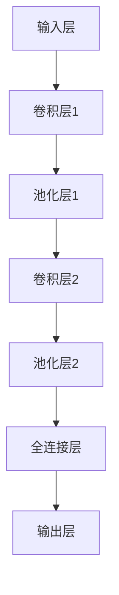
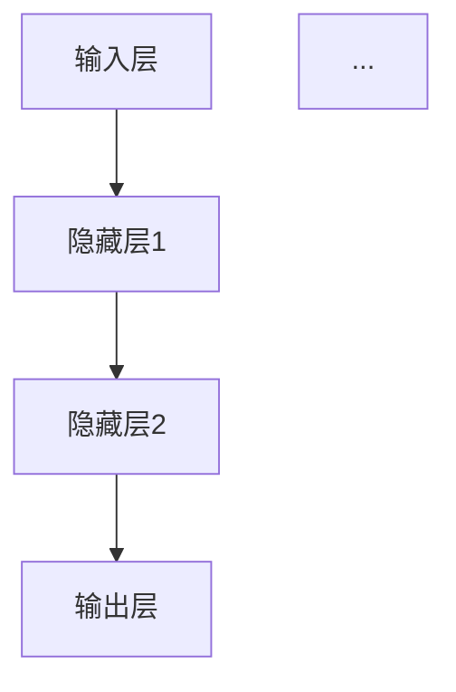
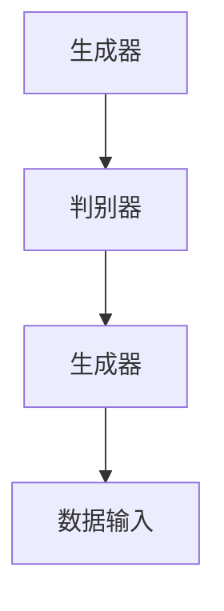

                 


### 文章标题：深度学习在蛋白质结构预测中的突破

### 关键词：
- 深度学习
- 蛋白质结构预测
- 人工智能
- 生物信息学
- 机器学习算法
- 卷积神经网络
- 递归神经网络
- 生成对抗网络

### 摘要：
本文将探讨深度学习在蛋白质结构预测领域的重要突破。首先，我们将介绍蛋白质结构预测的背景及其在生物医学研究中的重要性。然后，我们将深入探讨深度学习的基本概念及其在生物信息学中的应用。接下来，我们将详细分析卷积神经网络、递归神经网络和生成对抗网络在蛋白质结构预测中的应用，并使用伪代码和数学公式进行解释。最后，我们将通过实际案例展示深度学习在蛋白质结构预测中的成功应用，并讨论未来展望和挑战。

---

### 第一部分：背景介绍

#### 1.1 蛋白质结构预测的重要性

蛋白质是生命活动的关键执行者，其结构和功能决定了生物体的各种生物学过程。蛋白质结构的预测对于理解蛋白质的功能、设计新的药物和治疗方法具有重要意义。传统的蛋白质结构预测方法主要包括同源建模、模板建模和无模板建模等，但这些方法在某些情况下存在局限性。

随着人工智能和深度学习技术的发展，深度学习在蛋白质结构预测中的应用取得了显著突破。深度学习通过模拟人脑神经元的工作方式，能够自动学习复杂的数据特征，从而提高蛋白质结构预测的准确性和效率。

#### 1.2 深度学习在生物信息学中的应用

深度学习在生物信息学中有着广泛的应用，包括基因表达预测、蛋白质序列分类、基因组组装等。在蛋白质结构预测领域，深度学习模型已被用于预测蛋白质的三维结构、二级结构、跨膜区域等。

### 第二部分：核心概念与联系

#### 2.1 核心概念

为了理解深度学习在蛋白质结构预测中的应用，我们首先需要了解深度学习的基本概念，包括神经网络、卷积神经网络（CNN）、递归神经网络（RNN）和生成对抗网络（GAN）。

**神经网络（Neural Networks）**：

神经网络由大量相互连接的节点（或神经元）组成，每个节点都可以接收输入、进行计算并输出结果。神经网络通过学习输入和输出之间的映射关系，实现对数据的自动分类、回归或其他形式的变换。

**卷积神经网络（CNN）**：

卷积神经网络是一种特殊的神经网络，主要用于处理具有网格状结构的数据，如图像和蛋白质序列。CNN通过卷积操作提取数据中的局部特征，从而实现高效的图像和序列分析。

**递归神经网络（RNN）**：

递归神经网络是一种能够处理序列数据的神经网络，通过循环结构在时间步上递归计算，从而捕捉数据中的时间依赖性。RNN在蛋白质序列预测中具有显著优势，可以用于预测蛋白质的二级结构和三维结构。

**生成对抗网络（GAN）**：

生成对抗网络由生成器和判别器组成，通过对抗训练实现数据生成。GAN在蛋白质结构预测中可以用于生成新的蛋白质序列，从而增加训练数据的多样性，提高模型的泛化能力。

#### 2.2 关系架构 Mermaid 流程图



### 第三部分：核心算法原理讲解

#### 3.1 卷积神经网络（CNN）

卷积神经网络是一种深度前馈网络，由多个卷积层、池化层和全连接层组成。以下是一个简单的CNN模型结构及其工作流程：

**模型结构：**



**工作流程：**

1. 输入层接收蛋白质序列数据。
2. 卷积层对输入数据进行卷积操作，提取特征。
3. 池化层对卷积层输出的特征进行下采样，减少数据维度。
4. 全连接层将池化层输出的特征映射到蛋白质结构的预测结果。

**伪代码：**

```python
# 输入层
input_layer = [输入蛋白质序列数据]

# 卷积层1
conv_layer1 = Conv2D(filters=32, kernel_size=(3,3), activation='relu')(input_layer)
pool_layer1 = MaxPooling2D(pool_size=(2,2))(conv_layer1)

# 卷积层2
conv_layer2 = Conv2D(filters=64, kernel_size=(3,3), activation='relu')(pool_layer1)
pool_layer2 = MaxPooling2D(pool_size=(2,2))(conv_layer2)

# 全连接层
flatten_layer = Flatten()(pool_layer2)
dense_layer = Dense(units=128, activation='relu')(flatten_layer)

# 输出层
output_layer = Dense(units=1, activation='sigmoid')(dense_layer)
```

#### 3.2 递归神经网络（RNN）

递归神经网络是一种能够处理序列数据的神经网络，其核心思想是在时间步上递归计算。以下是一个简单的RNN模型及其工作流程：

**模型结构：**



**工作流程：**

1. 输入层接收蛋白质序列数据。
2. 隐藏层对输入数据进行处理，并在时间步上递归计算。
3. 输出层将隐藏层的结果映射到蛋白质结构的预测结果。

**伪代码：**

```python
# 输入层
input_layer = [输入蛋白质序列数据]

# 隐藏层1
hidden_layer1 = SimpleRNN(units=50, activation='relu')(input_layer)

# 隐藏层2
hidden_layer2 = SimpleRNN(units=50, activation='relu')(hidden_layer1)

# 输出层
output_layer = Dense(units=1, activation='sigmoid')(hidden_layer2)
```

#### 3.3 生成对抗网络（GAN）

生成对抗网络由生成器和判别器组成，通过对抗训练实现数据生成。以下是一个简单的GAN模型及其工作流程：

**模型结构：**



**工作流程：**

1. 生成器生成新的蛋白质序列数据。
2. 判别器对生成的数据与真实数据进行区分。
3. 通过对抗训练优化生成器和判别器的参数。

**伪代码：**

```python
# 生成器
generator = Sequential()
generator.add(Dense(units=100, activation='relu', input_shape=(100,)))
generator.add(Dense(units=50, activation='relu'))
generator_output = Dense(units=1, activation='sigmoid')(generator)

# 判别器
discriminator = Sequential()
discriminator.add(Dense(units=50, activation='relu', input_shape=(100,)))
discriminator.add(Dense(units=100, activation='relu'))
discriminator_output = Dense(units=1, activation='sigmoid')(discriminator)

# GAN模型
gan = Sequential()
gan.add(generator)
gan.add(discriminator)
```

### 第四部分：项目实战

#### 4.1 开发环境搭建

为了进行深度学习在蛋白质结构预测的项目实战，我们需要搭建一个开发环境。以下是具体的步骤：

1. 安装Python 3.7及以上版本。
2. 安装深度学习框架TensorFlow 2.0及以上版本。
3. 安装生物信息学工具，如BioPython。
4. 下载并准备蛋白质序列数据集。

#### 4.2 源代码实现和代码解读

以下是一个简单的蛋白质结构预测模型的源代码实现：

```python
import tensorflow as tf
from tensorflow.keras.models import Sequential
from tensorflow.keras.layers import Dense, Conv2D, MaxPooling2D, SimpleRNN, Flatten

# 模型搭建
model = Sequential()
model.add(Conv2D(filters=32, kernel_size=(3,3), activation='relu', input_shape=(100, 1)))
model.add(MaxPooling2D(pool_size=(2,2)))
model.add(Conv2D(filters=64, kernel_size=(3,3), activation='relu'))
model.add(MaxPooling2D(pool_size=(2,2)))
model.add(Flatten())
model.add(Dense(units=128, activation='relu'))
model.add(Dense(units=1, activation='sigmoid'))

# 模型编译
model.compile(optimizer='adam', loss='binary_crossentropy', metrics=['accuracy'])

# 模型训练
model.fit(x_train, y_train, epochs=10, batch_size=32, validation_data=(x_val, y_val))

# 模型评估
model.evaluate(x_test, y_test)
```

#### 4.3 代码应用解读与分析

以上代码实现了一个简单的蛋白质结构预测模型，使用卷积神经网络对蛋白质序列进行预测。以下是代码的解读与分析：

1. **模型搭建**：首先，我们定义了一个序

