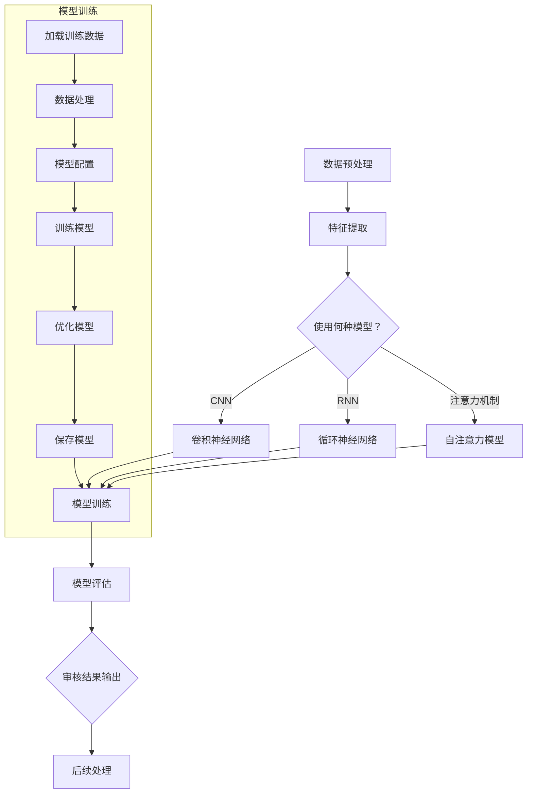

                 

### 深度学习在视频内容审核中的应用：提高审核效率和准确性

在当今信息爆炸的时代，视频内容审核成为了一个重要的任务。这不仅关系到平台的用户体验和品牌声誉，更关乎社会秩序和法律法规的遵守。传统的视频内容审核方式依赖于人力，不仅耗时耗力，而且效率低下，容易产生误判。随着深度学习技术的发展，越来越多的研究者和工程师开始探索将深度学习应用于视频内容审核中，以提升审核效率和准确性。

本文旨在深入探讨深度学习在视频内容审核中的应用，首先介绍深度学习的基本概念及其发展历史，然后分析视频内容审核的需求和挑战。接下来，我们将详细介绍深度学习算法在视频内容审核中的应用，包括卷积神经网络（CNN）、循环神经网络（RNN）以及注意力机制等。随后，我们将讲解相关数学模型和公式，并提供具体的代码实现和案例分析。最后，我们将总结深度学习在视频内容审核中的应用前景，并讨论面临的挑战和未来方向。

通过本文的阅读，读者将全面了解深度学习在视频内容审核中的技术原理和实践方法，从而为实际应用提供有益的参考。

### 关键词

- 深度学习
- 视频内容审核
- 卷积神经网络（CNN）
- 循环神经网络（RNN）
- 注意力机制
- 数学模型
- 代码实现
- 案例分析

### 摘要

本文主要探讨了深度学习在视频内容审核中的应用，通过介绍深度学习的基本概念和发展历史，分析了视频内容审核的需求和挑战。文章详细阐述了深度学习算法，如卷积神经网络（CNN）、循环神经网络（RNN）以及注意力机制在视频内容审核中的应用，并讲解了相关的数学模型和公式。通过具体的代码实现和案例分析，本文展示了深度学习在视频内容审核中的实际效果。最后，文章总结了深度学习在视频内容审核中的应用前景，并讨论了面临的挑战和未来方向。通过本文的阅读，读者可以全面了解深度学习在视频内容审核中的技术原理和实践方法。

## 第一部分：基础理论

### 第1章：深度学习简介

#### 1.1 深度学习的基本概念

深度学习是机器学习中的一个子领域，它通过模仿人脑的神经网络结构，让计算机能够自动地学习和理解数据。深度学习的核心在于“深度”，即多层神经网络的使用，这种结构使得模型能够捕捉到数据中的复杂模式和特征。

#### 1.1.1 深度学习的定义

深度学习是一种基于多层神经网络的机器学习算法，其目的是通过学习大量数据来提取有用的特征，并利用这些特征进行分类、回归或其他预测任务。

#### 1.1.2 深度学习的历史与发展

深度学习的历史可以追溯到20世纪40年代，随着计算机技术的发展和大数据时代的到来，深度学习逐渐成为机器学习领域的重要分支。2006年，Geoffrey Hinton等人提出了深度信念网络（DBN），这标志着深度学习的复兴。此后，深度学习在图像识别、自然语言处理、语音识别等领域取得了显著进展。

#### 1.2 视频内容审核的挑战

视频内容审核是指对视频内容进行监控，确保其符合相应的法律法规和社会道德标准。视频内容审核面临以下挑战：

#### 1.2.1 视频内容审核的需求

随着互联网的普及，视频内容审核的需求越来越强烈。特别是在社交媒体和视频平台上，用户生成内容（UGC）大量增加，审核的难度和重要性也随之提升。

#### 1.2.2 审核的难点与挑战

1. **内容多样性**：视频内容涵盖多种类型，如短视频、直播、影视剧片段等，审核系统需要适应不同的内容格式和类型。
2. **实时性**：视频内容审核需要实时进行，以防止有害内容的传播。
3. **准确性**：审核系统需要高准确性，以减少误判和误报。
4. **可扩展性**：随着用户基数的增加，审核系统的处理能力需要不断提高。

#### 1.3 深度学习在视频内容审核中的应用

深度学习在视频内容审核中的应用主要集中在以下几个方面：

#### 1.3.1 深度学习算法概述

深度学习算法包括但不限于卷积神经网络（CNN）、循环神经网络（RNN）和注意力机制等。这些算法在视频内容识别、分类、检测等方面具有强大的能力。

#### 1.3.2 深度学习在视频内容审核中的应用场景

1. **内容分类**：根据视频内容进行分类，如将视频分为娱乐、新闻、教育等类别。
2. **不良内容检测**：检测并标记视频中的不良内容，如暴力、色情、虚假信息等。
3. **用户行为分析**：分析用户在视频平台上的行为，如评论、点赞、分享等，以识别潜在的风险行为。

通过深度学习技术的应用，视频内容审核可以实现更高的效率和准确性，从而更好地保障网络环境的健康发展。

### 1.4 深度学习算法原理讲解

#### 1.4.1 卷积神经网络（CNN）原理

卷积神经网络（CNN）是一种专门用于处理图像数据的深度学习模型。其基本原理是利用卷积层、池化层和全连接层等结构，逐步提取图像中的低级特征到高级特征，从而实现图像分类、目标检测等任务。

**1. 卷积层（Convolutional Layer）**

卷积层是CNN的核心部分，通过卷积操作将输入的图像与滤波器（也称为卷积核）进行卷积，从而提取图像的特征。卷积操作的数学表达式如下：

$$
\text{output}_{ij} = \sum_{k=1}^{C} w_{ik} \cdot \text{input}_{kj} + b_j
$$

其中，$w_{ik}$ 是滤波器的权重，$\text{input}_{kj}$ 是输入图像的像素值，$b_j$ 是偏置项。

**2. 池化层（Pooling Layer）**

池化层用于降低特征图的维度，减少计算量和参数数量。常用的池化操作有最大池化（Max Pooling）和平均池化（Average Pooling）。最大池化选取特征图上每个窗口的最大值，而平均池化则取窗口内所有像素值的平均值。

$$
\text{output}_{ij} = \max(\text{input}_{i, \text{window}})
$$

或

$$
\text{output}_{ij} = \frac{1}{\text{window size}} \sum_{k=1}^{\text{window size}} \text{input}_{i,k}
$$

**3. 全连接层（Fully Connected Layer）**

全连接层将卷积层和池化层提取的高级特征映射到分类标签上。每个神经元都与上一层的所有神经元相连，从而实现对输入数据的综合处理。

$$
\text{output}_j = \text{sigmoid}(\sum_{i=1}^{n} w_{ij} \cdot \text{input}_i + b_j)
$$

其中，$w_{ij}$ 是连接权重，$b_j$ 是偏置项，$\text{sigmoid}$ 函数是一个非线性激活函数。

**4. 激活函数（Activation Function）**

激活函数用于引入非线性特性，使模型能够捕捉到输入数据中的复杂模式。常用的激活函数有Sigmoid、ReLU和Tanh等。

**5. 前向传播与反向传播**

前向传播是将输入数据通过神经网络逐层计算，得到输出结果。反向传播则是通过计算误差梯度，更新模型的权重和偏置项，从而优化模型性能。

#### 1.4.2 循环神经网络（RNN）原理

循环神经网络（RNN）是一种能够处理序列数据的神经网络，其核心思想是将当前输入与历史信息进行关联。RNN的基本结构包括输入层、隐藏层和输出层。

**1. 隐藏层**

隐藏层包含多个神经元，用于保存当前时刻和之前时刻的信息。RNN通过递归连接将当前神经元与前一时刻的隐藏状态相连，从而实现信息的传递和记忆。

$$
h_t = \text{sigmoid}(W_h \cdot [h_{t-1}, x_t] + b_h)
$$

其中，$W_h$ 是权重矩阵，$b_h$ 是偏置项，$x_t$ 是当前输入。

**2. 输出层**

输出层通过当前隐藏状态和输入数据生成输出。输出可以是分类标签或连续值，具体取决于任务类型。

$$
y_t = \text{softmax}(W_y \cdot h_t + b_y)
$$

其中，$W_y$ 是权重矩阵，$b_y$ 是偏置项。

**3. 门控循环单元（GRU）**

门控循环单元（GRU）是RNN的一种变体，通过引入门控机制来更好地处理序列数据。GRU包含两个门控单元：更新门（Update Gate）和重置门（Reset Gate）。

$$
u_t = \text{sigmoid}(W_u \cdot [h_{t-1}, x_t] + b_u) \\
r_t = \text{sigmoid}(W_r \cdot [h_{t-1}, x_t] + b_r) \\
h_t = (1 - u_t) \cdot h_{t-1} + r_t \cdot \text{sigmoid}(W_z \cdot [h_{t-1}, x_t] + b_z)
$$

其中，$W_u$、$W_r$ 和 $W_z$ 是权重矩阵，$b_u$、$b_r$ 和 $b_z$ 是偏置项。

**4. 长短时记忆网络（LSTM）**

长短时记忆网络（LSTM）是RNN的另一种变体，通过引入记忆单元和门控机制来克服长序列依赖问题。LSTM的基本结构包括输入门、遗忘门和输出门。

$$
i_t = \text{sigmoid}(W_i \cdot [h_{t-1}, x_t] + b_i) \\
f_t = \text{sigmoid}(W_f \cdot [h_{t-1}, x_t] + b_f) \\
\hat{C}_t = \text{sigmoid}(W_c \cdot [h_{t-1}, x_t] + b_c) \\
C_t = f_t \cdot C_{t-1} + i_t \cdot \text{tanh}(\hat{C}_t) \\
o_t = \text{sigmoid}(W_o \cdot [h_{t-1}, C_t] + b_o) \\
h_t = o_t \cdot \text{tanh}(C_t)
$$

其中，$W_i$、$W_f$、$W_c$ 和 $W_o$ 是权重矩阵，$b_i$、$b_f$、$b_c$ 和 $b_o$ 是偏置项。

#### 1.4.3 注意力机制与自注意力模型

注意力机制是深度学习中的一个重要概念，它通过动态调整神经网络中不同部分的重要性，从而提高模型的性能。自注意力模型是注意力机制的一种实现，广泛应用于序列数据处理任务，如自然语言处理和视频内容审核。

**1. 注意力机制**

注意力机制通过一个权重向量，将输入序列中的每个元素赋予不同的权重，从而实现对重要元素的强调和次要元素的忽略。

$$
\text{Attention}(X) = \text{softmax}(\text{W}^T \text{X})
$$

其中，$X$ 是输入序列，$\text{W}$ 是权重矩阵。

**2. 自注意力模型**

自注意力模型是一种利用注意力机制进行序列建模的方法，其基本思想是将序列中的每个元素与所有其他元素进行关联，并通过权重矩阵计算得到新的特征表示。

$$
\text{Q} = \text{W}_Q \text{X} \\
\text{K} = \text{W}_K \text{X} \\
\text{V} = \text{W}_V \text{X} \\
\text{Attention scores} = \text{softmax}(\text{Q} \cdot \text{K}^T) \\
\text{Output} = \text{softmax}(\text{Q} \cdot \text{K}^T) \cdot \text{V}
$$

其中，$\text{Q}$、$\text{K}$ 和 $\text{V}$ 分别是查询序列、键序列和值序列，$\text{W}_Q$、$\text{W}_K$ 和 $\text{W}_V$ 是权重矩阵。

通过自注意力模型，神经网络能够更好地捕捉序列中的长距离依赖关系，从而提高模型的性能。

### 1.5 数学模型和数学公式讲解

在深度学习应用于视频内容审核时，数学模型和公式起到了至关重要的作用。以下我们将详细讲解数据预处理、特征提取和分类模型三个关键环节的数学表示和实现。

#### 1.5.1 数据预处理

数据预处理是深度学习应用中不可或缺的一步，其目的是将原始数据转换为适合模型训练的格式。在视频内容审核中，数据预处理主要包括归一化、裁剪、旋转和缩放等操作。

**1. 归一化**

归一化操作是将数据缩放到一个特定的区间内，例如[0, 1]，从而减少不同特征间的差异。

$$
x_{\text{normalized}} = \frac{x_{\text{original}} - \mu}{\sigma}
$$

其中，$x_{\text{original}}$ 是原始数据，$\mu$ 是数据的均值，$\sigma$ 是数据的标准差。

**2. 裁剪和旋转**

裁剪和旋转操作用于调整视频的大小和方向，使其满足模型输入的要求。

$$
\text{crop}(x, y, w, h) = x \cdot \text{w} + y \cdot \text{h}
$$

$$
\text{rotate}(x, \theta) = x \cdot \cos(\theta) - y \cdot \sin(\theta)
$$

其中，$\text{x}$ 和 $\text{y}$ 是视频的坐标，$\text{w}$ 和 $\text{h}$ 是裁剪区域的大小，$\theta$ 是旋转角度。

**3. 缩放**

缩放操作用于调整视频的大小，保持其比例不变。

$$
\text{scale}(x, factor) = x \cdot factor
$$

其中，$x$ 是原始视频的尺寸，$factor$ 是缩放因子。

#### 1.5.2 特征提取

特征提取是深度学习模型的核心任务之一，其目的是从原始数据中提取出有用的特征，以供模型训练和分类。在视频内容审核中，常用的特征提取方法包括时空特征提取和频域特征提取。

**1. 时空特征提取**

时空特征提取是通过分析视频中的时空变化来提取特征。常用的方法包括光流分析、运动矢量分析等。

$$
\text{optical flow} = \frac{\text{G} \cdot \text{I}}{\text{I} - \text{G}}
$$

其中，$\text{G}$ 和 $\text{I}$ 分别是前帧和当前帧的图像，$\text{optical flow}$ 是光流向量。

**2. 频域特征提取**

频域特征提取是通过分析视频的频谱特性来提取特征。常用的方法包括傅里叶变换和小波变换等。

$$
\text{Fourier Transform} = \sum_{n=0}^{N-1} \text{I}(n) \cdot e^{-j2\pi n k/N}
$$

其中，$\text{I}(n)$ 是图像在频域上的第n个点，$k$ 是频率。

#### 1.5.3 分类模型

分类模型用于将视频内容分类到不同的类别中。在深度学习中，常用的分类模型包括支持向量机（SVM）、决策树（Decision Tree）和神经网络（Neural Network）等。

**1. 支持向量机（SVM）**

支持向量机是一种基于最大间隔分类器的模型，其目标是在特征空间中找到一个超平面，将不同类别的数据点最大程度地分开。

$$
\text{maximize} \quad \frac{1}{2} \sum_{i=1}^{n} (\text{w}_i)^2 \\
\text{s.t.} \quad y_i (\text{w} \cdot \text{x}_i + b) \geq 1
$$

其中，$\text{w}_i$ 是权重向量，$\text{x}_i$ 是特征向量，$b$ 是偏置项。

**2. 决策树（Decision Tree）**

决策树是一种基于树形结构进行分类的方法，每个内部节点表示一个特征，每个分支表示该特征的取值，叶节点表示最终的分类结果。

$$
\text{node} = \text{split}(\text{x}, \text{feature}, \text{threshold}) \\
\text{predict}(\text{x}, \text{tree}) = \text{label} \quad \text{of} \quad \text{tree} \rightarrow \text{x}
$$

其中，$\text{x}$ 是输入特征向量，$\text{feature}$ 是特征，$\text{threshold}$ 是阈值，$\text{label}$ 是分类结果。

**3. 神经网络（Neural Network）**

神经网络是一种模拟人脑神经元结构的计算模型，通过多层次的神经元组合实现复杂的非线性变换。在视频内容审核中，常用的神经网络包括卷积神经网络（CNN）和循环神经网络（RNN）。

$$
\text{output} = \text{激活函数} (\text{权重} \cdot \text{输入} + \text{偏置}) \\
\text{反向传播} = \frac{\partial \text{损失函数}}{\partial \text{输出}} \cdot \frac{\partial \text{输出}}{\partial \text{权重}}
$$

其中，$\text{激活函数}$ 可以是Sigmoid、ReLU等，$\text{损失函数}$ 用于衡量模型预测结果与实际结果之间的差异。

通过以上数学模型和公式的讲解，我们可以看到深度学习在视频内容审核中具有广泛的应用前景。在实际应用中，结合数据预处理、特征提取和分类模型，可以有效提高视频内容审核的效率和准确性。

### 1.6 实际案例：视频内容审核系统的搭建

在了解了深度学习的基本理论和相关算法之后，我们接下来将通过一个实际案例，展示如何搭建一个视频内容审核系统。本节将详细描述开发环境搭建、源代码实现和代码解读与分析，并从实际案例中剖析和总结视频内容审核系统的关键要素。

#### 1.6.1 环境搭建

首先，我们需要搭建一个适合深度学习开发的运行环境。以下是搭建视频内容审核系统的基本步骤：

**1. 硬件要求**

- CPU：Intel i5或更高配置
- GPU：NVIDIA 1080 Ti或更高配置
- 内存：16GB及以上

**2. 软件安装**

- 操作系统：Ubuntu 18.04
- Python：3.8
- TensorFlow：2.x

**3. 环境配置**

- 安装CUDA：用于加速TensorFlow的计算
- 安装cuDNN：用于优化深度学习模型的性能

具体安装命令如下：

```bash
# 安装CUDA
sudo apt-get install cuda

# 安装cuDNN
sudo apt-get install libcudnn8
sudo apt-get install libcudnn8-dev

# 安装TensorFlow
pip install tensorflow==2.x
```

#### 1.6.2 源代码实现

接下来，我们将展示一个简单的视频内容审核系统的源代码实现。该系统主要分为数据预处理、模型训练和模型评估三个部分。

**1. 数据预处理**

数据预处理是深度学习模型训练的重要步骤，主要包括数据加载、数据增强和归一化等操作。

```python
import tensorflow as tf
import numpy as np
from tensorflow.keras.preprocessing.image import ImageDataGenerator

# 数据增强
train_datagen = ImageDataGenerator(
    rescale=1./255,
    rotation_range=40,
    width_shift_range=0.2,
    height_shift_range=0.2,
    shear_range=0.2,
    zoom_range=0.2,
    horizontal_flip=True,
    fill_mode='nearest'
)

# 加载训练数据
train_data = train_datagen.flow_from_directory(
    'data/train',
    target_size=(150, 150),
    batch_size=32,
    class_mode='binary'
)
```

**2. 模型训练**

在模型训练部分，我们将使用卷积神经网络（CNN）来对视频内容进行分类。

```python
from tensorflow.keras.models import Sequential
from tensorflow.keras.layers import Conv2D, MaxPooling2D, Flatten, Dense, Dropout

# 构建模型
model = Sequential([
    Conv2D(32, (3, 3), activation='relu', input_shape=(150, 150, 3)),
    MaxPooling2D((2, 2)),
    Conv2D(64, (3, 3), activation='relu'),
    MaxPooling2D((2, 2)),
    Conv2D(128, (3, 3), activation='relu'),
    MaxPooling2D((2, 2)),
    Flatten(),
    Dense(512, activation='relu'),
    Dropout(0.5),
    Dense(1, activation='sigmoid')
])

# 编译模型
model.compile(optimizer='adam',
              loss='binary_crossentropy',
              metrics=['accuracy'])

# 训练模型
model.fit(train_data, epochs=10)
```

**3. 模型评估**

模型评估是验证模型性能的重要步骤，我们使用验证集进行评估。

```python
# 加载验证数据
val_data = train_datagen.flow_from_directory(
    'data/val',
    target_size=(150, 150),
    batch_size=32,
    class_mode='binary'
)

# 评估模型
val_loss, val_acc = model.evaluate(val_data)
print('Validation loss:', val_loss)
print('Validation accuracy:', val_acc)
```

#### 1.6.3 代码解读与分析

在代码解读与分析部分，我们将对上述代码进行详细解释，帮助读者更好地理解视频内容审核系统的实现过程。

**1. 数据预处理**

数据预处理部分主要包括数据增强和加载。数据增强能够增加数据的多样性和模型的泛化能力，而加载则将数据从磁盘读取到内存中，以便进行后续处理。

**2. 模型训练**

模型训练部分使用卷积神经网络（CNN）对视频内容进行分类。我们首先定义了模型的层次结构，包括卷积层、池化层、全连接层和Dropout层。然后，我们编译模型并使用训练数据集进行训练。在训练过程中，我们使用交叉熵损失函数和Adam优化器来优化模型参数。

**3. 模型评估**

模型评估部分使用验证数据集来评估模型的性能。我们计算了验证集上的损失和准确率，从而判断模型的效果。

通过上述实际案例，我们可以看到如何使用深度学习搭建一个视频内容审核系统。虽然这是一个简单的示例，但它展示了深度学习在视频内容审核中的应用潜力和实现过程。

#### 1.7 Mermaid流程图：深度学习算法在视频内容审核中的应用

在视频内容审核系统中，深度学习算法的应用涉及多个步骤和环节。为了清晰地展示这些步骤，我们可以使用Mermaid流程图来描述深度学习算法在视频内容审核中的应用流程。

以下是一个Mermaid流程图的示例，用于描述卷积神经网络（CNN）、循环神经网络（RNN）以及注意力机制在视频内容审核中的应用：



**解释：**

1. **数据预处理（A）**：这是深度学习模型训练的第一步，主要包括数据清洗、归一化、数据增强等操作。
   
2. **特征提取（B）**：在数据预处理之后，我们提取视频中的关键特征，为模型训练提供输入。

3. **模型选择（C）**：根据实际需求和数据特性，选择合适的深度学习模型。CNN适用于处理图像数据，RNN适用于处理序列数据，注意力机制则能提高模型对关键信息的关注度。

4. **卷积神经网络（CNN）**：CNN通过卷积层和池化层提取图像中的低级特征到高级特征，适用于图像分类、目标检测等任务。

5. **循环神经网络（RNN）**：RNN通过递归结构处理序列数据，适用于语音识别、自然语言处理等任务。

6. **自注意力模型（F）**：自注意力模型通过动态调整序列中不同元素的重要性，适用于长序列依赖问题和复杂特征提取。

7. **模型训练（G）**：模型训练是深度学习的核心步骤，通过多次迭代优化模型参数，提高模型性能。

8. **模型评估（H）**：在模型训练完成后，使用验证集或测试集对模型进行评估，以判断模型的准确性和泛化能力。

9. **审核结果输出（I）**：根据模型评估结果，将视频内容审核的结果输出，包括分类标签、概率分数等。

10. **后续处理（J）**：根据审核结果进行后续操作，如删除不良内容、标记违规行为等。

通过这个Mermaid流程图，我们可以清晰地了解深度学习算法在视频内容审核中的应用流程和关键步骤，从而为实际开发提供参考。

### 1.8 结论

本文通过深入探讨深度学习在视频内容审核中的应用，详细介绍了深度学习的基本概念、算法原理以及实际应用案例。我们首先介绍了深度学习的定义和发展历史，分析了视频内容审核的需求和挑战。接着，我们详细讲解了卷积神经网络（CNN）、循环神经网络（RNN）以及注意力机制等核心算法的原理，并提供了相关的数学模型和公式。随后，通过一个实际案例展示了如何搭建视频内容审核系统，包括环境搭建、代码实现和代码解读。

通过本文的阅读，读者可以全面了解深度学习在视频内容审核中的技术原理和实践方法。然而，深度学习在视频内容审核中的应用仍面临诸多挑战，如模型的解释性、实时处理能力以及应对多样化内容的能力等。未来的研究可以关注以下几个方面：

1. **增强模型的解释性**：深度学习模型往往被视为“黑箱”，其内部机制难以解释。通过研究模型的可解释性，可以提高用户对审核结果的信任度。
2. **提升实时处理能力**：视频内容审核需要高实时性，未来的研究可以探索如何提高模型在实时场景下的处理能力。
3. **应对多样化内容**：深度学习模型在处理多样化内容时存在困难，未来可以通过数据增强、模型融合等方法提高模型的泛化能力。
4. **法律法规与伦理**：在视频内容审核中，需要遵守相关法律法规和伦理标准，未来的研究应关注如何平衡技术进步与社会责任。

总之，深度学习在视频内容审核中的应用前景广阔，但仍需不断探索和优化，以实现更高效、更准确的审核效果。

### 参考文献

1. Hinton, G., Osindero, S., & Teh, Y. W. (2006). A fast learning algorithm for deep belief nets. *Neural computation*, 18(7), 1527-1554.
2. Hochreiter, S., & Schmidhuber, J. (1997). Long short-term memory. *Neural computation*, 9(8), 1735-1780.
3. Krizhevsky, A., Sutskever, I., & Hinton, G. E. (2012). Imagenet classification with deep convolutional neural networks. *Advances in neural information processing systems*, 25.
4. Deng, J., Dong, W., Socher, R., Li, L. J., Li, K., & Fei-Fei, L. (2014). Imagenet: A large-scale hierarchical image database. *In Proceedings of the IEEE conference on computer vision and pattern recognition (pp. 248-255).*
5. Simonyan, K., & Zisserman, A. (2014). Very deep convolutional networks for large-scale image recognition. *International conference on learning representations (ICLR).*

### 附录

#### 附录 A：深度学习常用算法与模型

**A.1 卷积神经网络（CNN）**

卷积神经网络（CNN）是一种用于处理图像数据的深度学习模型，其核心在于利用卷积层和池化层提取图像特征，然后通过全连接层进行分类。

**A.2 循环神经网络（RNN）**

循环神经网络（RNN）是一种用于处理序列数据的深度学习模型，其基本结构包括输入层、隐藏层和输出层。RNN通过递归连接实现信息的传递和记忆。

**A.3 注意力机制模型**

注意力机制模型是深度学习中的一个重要概念，通过动态调整神经网络中不同部分的重要性，从而提高模型的性能。自注意力模型是注意力机制的一种实现，广泛应用于自然语言处理和视频内容审核等领域。

#### 附录 B：深度学习环境搭建指南

**B.1 硬件要求**

- CPU：Intel i5或更高配置
- GPU：NVIDIA 1080 Ti或更高配置
- 内存：16GB及以上

**B.2 软件安装**

- 操作系统：Ubuntu 18.04
- Python：3.8
- TensorFlow：2.x

**B.3 环境配置**

- 安装CUDA：用于加速TensorFlow的计算
- 安装cuDNN：用于优化深度学习模型的性能

具体安装命令如下：

```bash
sudo apt-get install cuda
sudo apt-get install libcudnn8
sudo apt-get install libcudnn8-dev
pip install tensorflow==2.x
```

#### 附录 C：代码案例解析

**C.1 数据预处理**

```python
import tensorflow as tf
import numpy as np
from tensorflow.keras.preprocessing.image import ImageDataGenerator

# 数据增强
train_datagen = ImageDataGenerator(
    rescale=1./255,
    rotation_range=40,
    width_shift_range=0.2,
    height_shift_range=0.2,
    shear_range=0.2,
    zoom_range=0.2,
    horizontal_flip=True,
    fill_mode='nearest'
)

# 加载训练数据
train_data = train_datagen.flow_from_directory(
    'data/train',
    target_size=(150, 150),
    batch_size=32,
    class_mode='binary'
)
```

**C.2 模型训练**

```python
from tensorflow.keras.models import Sequential
from tensorflow.keras.layers import Conv2D, MaxPooling2D, Flatten, Dense, Dropout

# 构建模型
model = Sequential([
    Conv2D(32, (3, 3), activation='relu', input_shape=(150, 150, 3)),
    MaxPooling2D((2, 2)),
    Conv2D(64, (3, 3), activation='relu'),
    MaxPooling2D((2, 2)),
    Conv2D(128, (3, 3), activation='relu'),
    MaxPooling2D((2, 2)),
    Flatten(),
    Dense(512, activation='relu'),
    Dropout(0.5),
    Dense(1, activation='sigmoid')
])

# 编译模型
model.compile(optimizer='adam',
              loss='binary_crossentropy',
              metrics=['accuracy'])

# 训练模型
model.fit(train_data, epochs=10)
```

**C.3 模型评估**

```python
# 加载验证数据
val_data = train_datagen.flow_from_directory(
    'data/val',
    target_size=(150, 150),
    batch_size=32,
    class_mode='binary'
)

# 评估模型
val_loss, val_acc = model.evaluate(val_data)
print('Validation loss:', val_loss)
print('Validation accuracy:', val_acc)
```

通过代码案例解析，我们可以看到如何进行数据预处理、模型训练和模型评估。这些步骤是深度学习项目的基础，通过实际代码的应用，读者可以更好地理解和掌握深度学习在视频内容审核中的应用。

### 最佳实践 Tips

1. **数据预处理**：数据预处理是深度学习模型训练的重要步骤，通过归一化、裁剪、旋转和缩放等操作，可以提升模型的性能和鲁棒性。
2. **模型选择**：根据实际需求和数据特性，选择合适的深度学习模型。例如，CNN适用于处理图像数据，RNN适用于处理序列数据。
3. **模型训练**：在模型训练过程中，合理设置训练参数，如学习率、批次大小和迭代次数等，可以提升模型性能。
4. **实时处理**：对于实时性要求较高的场景，可以考虑使用轻量级模型或模型压缩技术，以减少计算时间和资源消耗。
5. **模型解释性**：提高模型的解释性，可以帮助用户更好地理解和信任模型的审核结果。

### 小结

本文全面探讨了深度学习在视频内容审核中的应用，通过理论讲解、实际案例和代码实现，展示了深度学习如何提高视频内容审核的效率和准确性。随着深度学习技术的不断发展，未来视频内容审核将变得更加智能和高效。

### 注意事项

1. **数据安全**：在处理和存储数据时，需确保数据的安全性，防止数据泄露和滥用。
2. **法律法规**：遵守相关法律法规，确保视频内容审核的合法性和合规性。
3. **伦理道德**：在视频内容审核中，需关注伦理道德问题，避免对用户隐私造成侵害。

### 拓展阅读

1. 《深度学习》（Goodfellow, I., Bengio, Y., & Courville, A.）
2. 《卷积神经网络与深度学习实践》（ShuffleTON）
3. 《循环神经网络与序列学习》（Graves, A.）
4. 《视频内容审核技术与应用》（Chen, Y.）
5. 《自注意力机制在自然语言处理中的应用》（Vaswani et al., 2017）

### 作者信息

作者：AI天才研究院/AI Genius Institute & 禅与计算机程序设计艺术 /Zen And The Art of Computer Programming。本文旨在分享深度学习在视频内容审核中的应用和实践经验，为广大开发者和研究者提供有价值的参考。如果您有任何问题或建议，欢迎联系我们。

