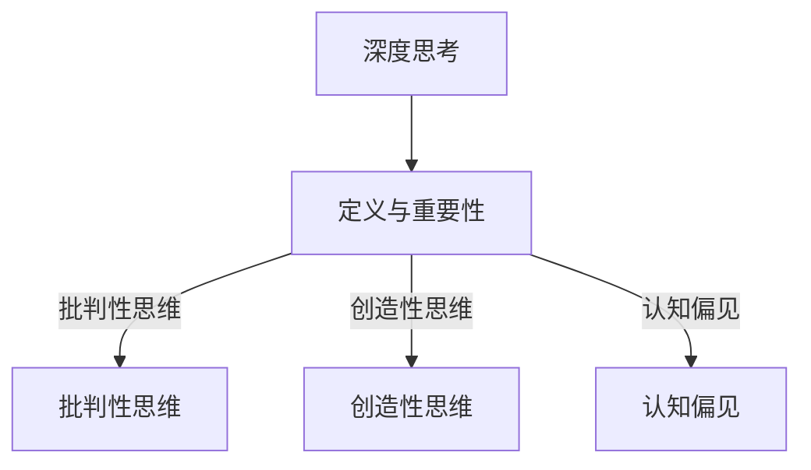
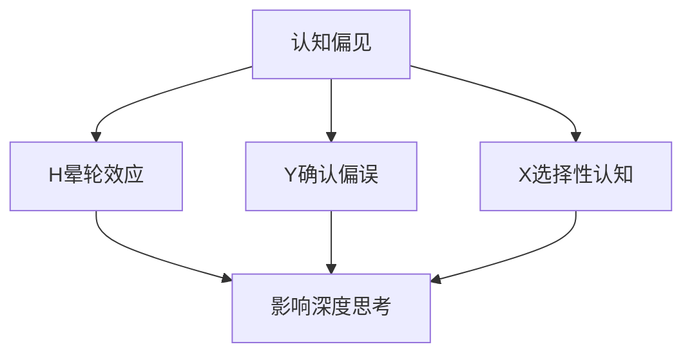
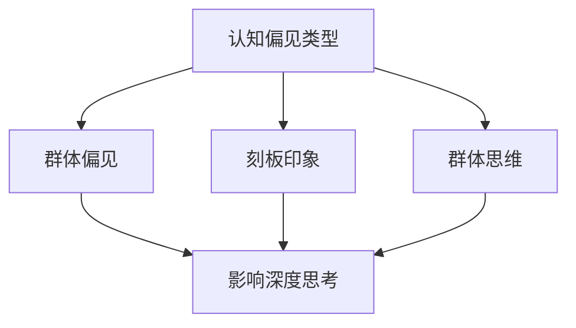
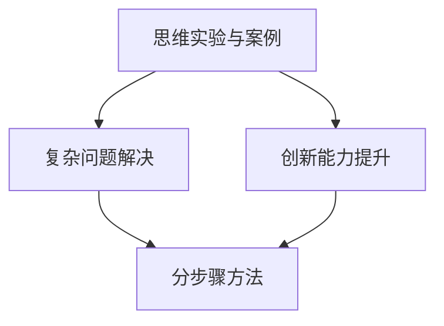
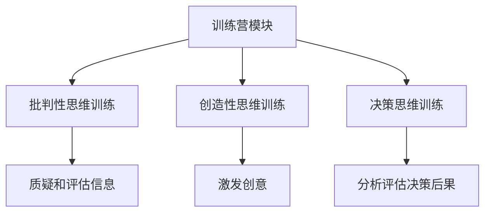
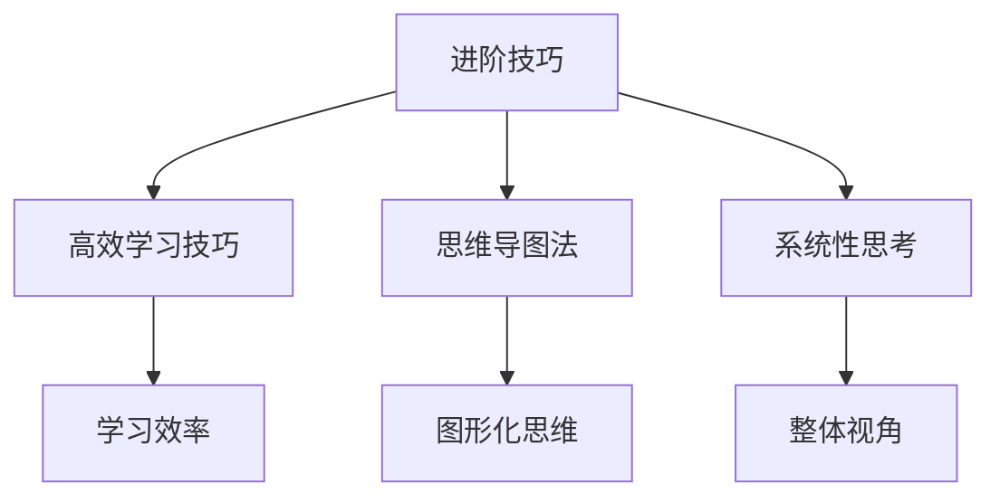
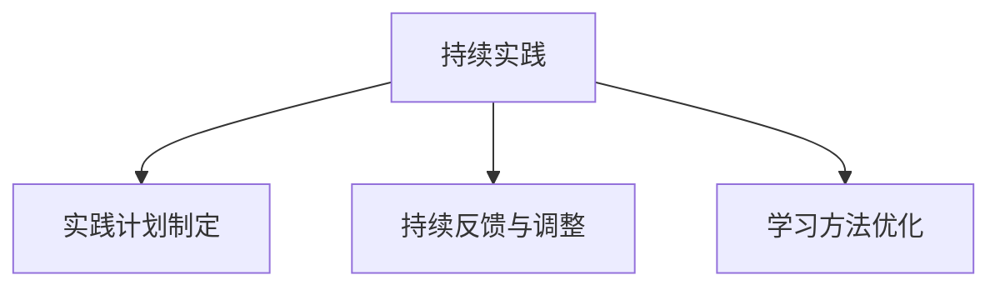

                 

### 文章标题

《深度思考训练营：对抗认知偏见的思维课程》

### 关键词

- 深度思考
- 认知偏见
- 思维训练
- 批判性思维
- 创造性思维
- 决策思维

### 摘要

本文旨在探讨如何通过深度思考和对抗认知偏见来提升个人认知能力。书中分为三个主要部分：深度思考基础、实践训练营和深度思考的进阶技巧。第一部分介绍了深度思考和认知偏见的基本概念；第二部分通过思维实验和训练营模块，提供了实践方法；第三部分则提供了高效的进阶技巧和持续的实践方法。通过这本书，读者将能够掌握深度思考的技巧，提升自己的认知能力，并在日常生活和工作中更好地应对复杂的决策和问题。

---

# 《深度思考训练营：对抗认知偏见的思维课程》

## 引言

在当今快速变化的世界中，深度思考显得尤为重要。然而，人们的思维方式常常受到认知偏见的影响，导致我们难以做出明智的决策和解决问题。本书《深度思考训练营：对抗认知偏见的思维课程》旨在帮助读者通过一系列的训练和实践，提升深度思考的能力，并有效地对抗认知偏见。

## 第一部分：深度思考基础

### 第1章：深度思考的本质

深度思考是一种深思熟虑的思考方式，它不仅仅是表面上的理解，而是对问题的本质和复杂性进行深入的探究。深度思考的重要性在于它能够帮助我们更好地理解世界，做出更为明智的决策。

### 1.1 深度思考的定义与重要性

深度思考是指通过深入、系统和批判性的方式来理解复杂问题。这种思考方式能够帮助我们揭示问题的实质，发现隐藏的关联，从而做出更为合理的决策。

#### 核心概念与联系

为了更好地理解深度思考，我们需要了解几个核心概念：

1. **认知偏见**：指人们在进行信息处理和决策时，由于各种心理和社会因素的影响，导致思维产生偏差。
2. **批判性思维**：指对信息、观点和假设进行深入分析和评估的能力。
3. **创造性思维**：指产生新颖、有创意的想法和解决方案的能力。

**Mermaid 流程图：**

### 1.2 认知偏见简介

认知偏见是影响深度思考的主要障碍之一。以下是一些常见的认知偏见：

1. **晕轮效应**：对某个人或事物的整体印象影响对其个别特质的判断。
2. **确认偏误**：在寻找和评估信息时，更倾向于接受那些与我们已有信念相符的信息。
3. **选择性认知**：倾向于关注那些与我们的期望或信念相符的信息，而忽视其他信息。

#### 核心概念与联系

为了更好地理解认知偏见，我们可以通过以下Mermaid流程图来展示它们之间的联系：

### 第2章：认知偏见的类型

认知偏见不仅限于个体，也存在于社会和文化层面。以下是一些常见的认知偏见类型：

1. **群体偏见**：对某一群体的成员持有负面看法或偏见。
2. **刻板印象**：对某一群体的固定看法，不考虑个体差异。
3. **群体思维**：在群体中，个体倾向于接受群体的意见，甚至放弃自己的判断。

#### 核心概念与联系

以下Mermaid流程图展示了不同认知偏见类型之间的联系：

## 第二部分：实践训练营

### 第4章：思维实验与案例

思维实验是一种通过设想特定情境来检验思维方式的工具。以下是一些实用的思维实验和案例：

1. **复杂问题解决**：通过分步骤的方法来解决复杂的现实问题。
2. **创新能力提升**：通过创意思维训练来提高解决问题的创新能力。

#### 核心概念与联系

以下Mermaid流程图展示了思维实验与案例的核心概念：

### 第5章：训练营模块

训练营模块旨在通过不同的训练方法来提升批判性思维、创造性和决策思维。

1. **批判性思维训练**：通过质疑和评估信息来提高思维的批判性。
2. **创造性思维训练**：通过多种方法来激发创意，提高解决问题的能力。
3. **决策思维训练**：通过分析和评估不同决策的后果来提高决策的质量。

#### 核心概念与联系

以下Mermaid流程图展示了训练营模块的核心概念：

## 第三部分：深度思考的进阶技巧

### 第6章：深度思考的进阶技巧

进阶技巧包括高效学习技巧、思维导图法和系统性思考等。这些技巧有助于进一步提高深度思考的能力。

1. **高效学习技巧**：通过有效的学习方法和工具来提高学习效率。
2. **思维导图法**：通过图形化的方式来组织和展示思维过程。
3. **系统性思考**：通过整体视角来分析和解决复杂问题。

#### 核心概念与联系

以下Mermaid流程图展示了进阶技巧的核心概念：

### 第7章：深度思考的持续实践

持续实践是深度思考能力提升的关键。本章提供了持续实践的方法和技巧，包括制定实践计划、持续反馈与调整等。

#### 核心概念与联系

以下Mermaid流程图展示了持续实践的核心概念：

## 结论

深度思考是一种宝贵的思维能力，它能够帮助我们更好地理解世界，做出更为明智的决策。通过本书的深度思考训练营，读者将能够掌握对抗认知偏见的方法，提升自己的深度思考能力。希望读者能够在实践中不断进步，成为更为出色的思考者。

### 作者信息

作者：AI天才研究院/AI Genius Institute & 禅与计算机程序设计艺术 /Zen And The Art of Computer Programming

