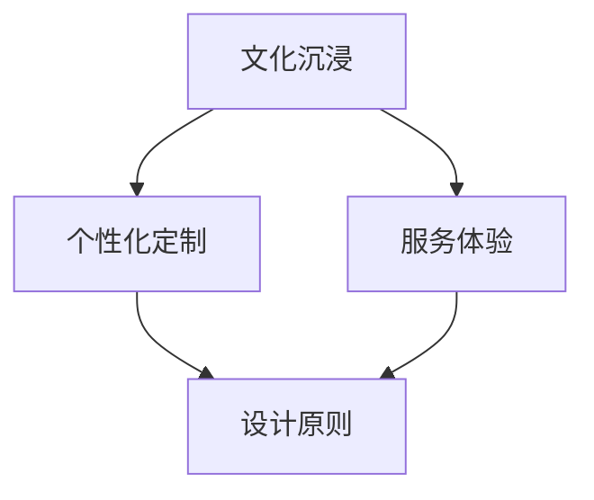

                 

### 文章标题

# 深度旅行体验设计：文化沉浸式旅程的定制服务

> 关键词：旅行体验设计、文化沉浸式旅程、定制服务、设计方法、实践案例分析

> 摘要：本文深入探讨了深度旅行体验设计在文化沉浸式旅程中的应用。通过介绍旅行体验设计的背景、核心概念、设计方法，以及具体案例分析，本文旨在为读者提供一套完整的旅行体验设计框架，帮助读者理解和掌握文化沉浸式旅程的定制服务。

---

### 引言

在现代旅游业的快速发展背景下，旅行体验设计的重要性日益凸显。旅行体验不仅是游客享受旅游乐趣的核心，更是旅游目的地形象塑造的重要因素。传统的旅行模式通常侧重于观光和娱乐，而现代旅行者追求的是深度体验和文化沉浸。因此，如何设计出能够满足现代旅行者需求的深度旅行体验，成为了旅游业亟需解决的问题。

本文旨在深入探讨深度旅行体验设计，特别是文化沉浸式旅程的定制服务。我们将从以下几个方面展开讨论：

1. **旅行体验设计的背景与意义**：介绍旅行体验设计的起源、发展和重要性。
2. **核心概念与联系**：详细阐述旅行体验设计中的核心概念，并通过Mermaid流程图展示概念之间的关系。
3. **设计方法与实践**：介绍深度旅行体验设计的具体方法和实践步骤。
4. **案例分析**：通过具体案例分析，展示深度旅行体验设计在实际中的应用。
5. **工具与技术**：介绍用于旅程定制的技术工具。
6. **项目实战**：提供一个实际项目案例，详细讲解项目的开发环境、源代码实现、代码解读和应用分析。
7. **最佳实践与拓展阅读**：总结最佳实践经验，并提供进一步阅读的建议。

### 旅行体验设计的背景与意义

旅行体验设计并非一个新兴概念，其历史可以追溯到旅游业发展的早期阶段。早期的旅行体验设计主要侧重于线路规划、住宿安排和餐饮选择等方面，目的是为游客提供基本的旅行需求。然而，随着社会的进步和旅游业的发展，旅行体验设计的内涵和外延得到了极大的拓展。

#### 1. 起源与发展

旅行体验设计的起源可以追溯到20世纪初，当时旅游业开始蓬勃发展。旅行体验设计最初的核心思想是为游客提供更舒适的旅行条件，使他们在旅行过程中能够享受愉悦的感受。随着信息技术的进步和旅游市场的细分，旅行体验设计逐渐演变为一门综合性的学科，涵盖了心理学、文化学、人类学等多个领域的知识。

#### 2. 重要性

旅行体验设计在旅游业中具有举足轻重的地位。首先，良好的旅行体验能够提高游客的满意度，从而促进旅游业的可持续发展。其次，旅行体验设计有助于提升旅游目的地的形象，增强游客的忠诚度和回头率。此外，深度旅行体验设计还能够满足现代游客对个性化、差异化服务的需求，从而提高旅游服务的竞争力。

#### 3. 现代旅行者需求的变化

现代旅行者的需求正在发生显著变化。传统的观光旅游已经不能满足他们的需求，现代旅行者更倾向于探索目的地的文化、历史和社会背景，追求深度体验和文化沉浸。这种变化促使旅游业从传统的观光模式向深度体验模式转变，旅行体验设计也因此成为了旅游业的重要组成部分。

### 核心概念与联系

在旅行体验设计中，有几个核心概念需要深入理解。这些概念不仅相互关联，而且在设计过程中起着至关重要的作用。

#### 1. 文化沉浸

文化沉浸是指游客在旅行过程中深入体验目的地文化的过程。它不仅仅是表面的观光，而是通过参与当地的活动、与当地人交流等方式，真正理解和融入目的地文化。文化沉浸是深度旅行体验设计的核心，能够为游客带来独特的体验和深刻的记忆。

#### 2. 个性化定制

个性化定制是指根据游客的喜好、需求和行为习惯，为他们提供量身定制的旅行服务。个性化定制能够满足现代旅行者对个性化、差异化服务的需求，提升游客的满意度和体验感。

#### 3. 服务体验

服务体验是指游客在旅行过程中所获得的整体感受。它包括交通、住宿、餐饮、导游等多个方面。良好的服务体验能够增强游客的满意度，从而促进旅游业的发展。

#### 4. 设计原则

设计原则是旅行体验设计过程中需要遵循的基本原则。这些原则包括用户体验优先、可持续性、文化尊重等。设计原则能够确保旅行体验设计的质量和可持续性。

#### Mermaid流程图

为了更清晰地展示这些核心概念之间的联系，我们可以使用Mermaid流程图来表示。以下是一个简单的Mermaid流程图示例：



通过这个流程图，我们可以看出文化沉浸、个性化定制、服务体验和设计原则之间的相互关系。文化沉浸和个性化定制是旅行体验设计的核心，而服务体验和设计原则则是实现这些核心概念的关键。

### 设计方法与实践

在了解了旅行体验设计的背景和核心概念后，接下来我们将介绍具体的旅行体验设计方法与实践步骤。这些步骤包括设计前的调研与分析、设计方案制定、设计方案评估与优化，以及伪代码详解。

#### 1. 设计前的调研与分析

设计前的调研与分析是旅行体验设计的关键步骤。通过调研与分析，我们可以了解游客的需求、目的地的文化特点、旅游资源等信息。具体步骤如下：

1. **确定设计目标**：明确旅行体验设计的具体目标，如提升游客满意度、增强文化沉浸等。
2. **收集游客需求**：通过问卷调查、访谈等方式收集游客的需求和期望。
3. **分析目的地文化**：了解目的地的文化背景、风俗习惯、历史传统等。
4. **研究旅游资源**：分析目的地的旅游资源，包括景点、活动、住宿等。

#### 2. 设计方案制定

在调研与分析的基础上，我们可以开始制定旅行体验设计方案。设计方案应包括以下几个部分：

1. **旅行路线规划**：根据游客需求和目的地文化特点，设计一条合理的旅行路线。
2. **活动安排**：设计一系列与文化沉浸相关的活动，如参观博物馆、品尝当地美食、体验传统手工艺等。
3. **住宿和餐饮推荐**：为游客推荐具有当地特色的住宿和餐饮场所。
4. **导游服务**：提供专业的导游服务，确保游客能够深入理解目的地文化。

#### 3. 设计方案评估与优化

设计方案制定完成后，需要进行评估与优化。具体步骤如下：

1. **内部评审**：组织团队内部评审，对设计方案进行讨论和修改。
2. **用户测试**：邀请部分游客进行测试，收集反馈意见，对设计方案进行优化。
3. **成本评估**：评估设计方案的可行性，确保成本控制在可接受范围内。

#### 4. 伪代码详解

为了更直观地展示旅行体验设计的具体步骤，我们可以使用伪代码进行说明。以下是一个简单的伪代码示例：

```plaintext
开始
1. 确定设计目标
2. 收集游客需求
3. 分析目的地文化
4. 研究旅游资源

设计旅行路线
5. 设计活动安排
6. 推荐住宿和餐饮
7. 安排导游服务

评估与优化
8. 进行内部评审
9. 进行用户测试
10. 成本评估

结束
```

通过这个伪代码示例，我们可以清晰地看到旅行体验设计的步骤和流程。

### 案例分析

为了更好地理解旅行体验设计在文化沉浸式旅程中的应用，我们将通过具体案例分析，展示设计方法与实践的具体实施。

#### 1. 日本京都的文化之旅

日本京都以其丰富的文化遗产和独特的传统文化而闻名。一次成功的京都之旅不仅包括观光游览，更重要的是深度体验京都的文化。

**案例背景：** 一家专注于文化沉浸式旅程的旅行社计划为一批来自中国的游客设计一次为期五天的京都之旅。

**设计目标：** 提升游客对京都文化的理解和兴趣，增强游客的满意度。

**具体实施：**

1. **设计旅行路线：** 根据游客的需求和文化背景，设计了一条涵盖京都主要文化遗产和传统活动的路线，如清水寺、金阁寺、祇園等。

2. **活动安排：** 安排了多次与当地文化的互动活动，如茶道体验、和服试穿、传统舞蹈观赏等。

3. **住宿和餐饮推荐：** 为游客推荐了具有京都传统风格的旅馆和提供京都传统美食的餐厅。

4. **导游服务：** 提供了专业的京都导游，确保游客能够深入了解京都的文化和历史。

**效果评估：** 游客反馈良好，表示通过这次旅程，他们对京都的文化有了更深的理解和兴趣，满意度显著提升。

#### 2. 印度斋浦尔的探险之旅

印度斋浦尔以其独特的自然风光和丰富的文化遗产而著名。一次成功的斋浦尔之旅不仅需要探索自然景观，更需要深入体验当地的文化。

**案例背景：** 一家致力于提供探险体验的旅行社计划为一批喜欢户外运动的游客设计一次为期七天的斋浦尔之旅。

**设计目标：** 提供一次独特的探险体验，同时增强游客对印度文化的了解。

**具体实施：**

1. **设计旅行路线：** 包括了著名的自然景观如蓝山、普尔纳瓦加尔城堡等，以及一些具有当地特色的村庄。

2. **活动安排：** 安排了徒步、骑骆驼、露营等活动，同时安排了参观当地寺庙、博物馆等文化景点。

3. **住宿和餐饮推荐：** 为游客推荐了具有当地特色的民宿和提供印度传统美食的餐厅。

4. **导游服务：** 提供了专业的当地导游，确保游客能够深入了解当地的文化和传统。

**效果评估：** 游客对这次旅程非常满意，表示不仅享受了户外探险的乐趣，还对印度文化有了更深的了解。

### 工具与技术

在现代旅行体验设计中，工具和技术的应用至关重要。以下是一些常用的工具和技术：

#### 1. 数字地图与导航技术

数字地图和导航技术为旅行体验设计提供了便利。通过GPS和地图软件，游客可以轻松获取目的地的位置信息，规划最优路线。此外，一些地图软件还提供了景点推荐、路线优化等功能，为旅行体验设计提供了有力支持。

#### 2. 社交媒体

社交媒体在旅行体验设计中也发挥着重要作用。通过社交媒体，游客可以分享旅行中的点滴，与其他旅行者交流经验，获取目的地信息。此外，一些旅行社和旅游平台也在社交媒体上提供了丰富的旅行资源和推荐，为旅行体验设计提供了灵感。

#### 3. 人工智能

人工智能在旅行体验设计中的应用也越来越广泛。通过机器学习和大数据分析，人工智能可以帮助设计出更加个性化的旅行体验方案，满足游客的个性化需求。此外，人工智能还可以用于行程规划、活动推荐等方面，提高旅行体验的智能化水平。

### 项目实战

为了更好地理解旅行体验设计的具体实现，我们将通过一个实际项目案例进行详细讲解。

#### 1. 项目背景

一家旅游公司计划开发一款文化沉浸式旅程的定制服务系统，以提供个性化的文化旅行体验。该系统需要实现以下功能：

1. **用户注册与登录**：允许用户注册账户并登录系统。
2. **旅行计划制定**：根据用户的需求和偏好，生成个性化的旅行计划。
3. **活动推荐**：根据用户的兴趣和目的地的文化特点，推荐相关的文化活动和景点。
4. **用户反馈**：允许用户对旅行体验进行评价和反馈。

#### 2. 开发环境搭建

为了实现上述功能，我们需要搭建一个合适的技术栈。以下是一个可能的开发环境搭建方案：

1. **前端技术**：使用React框架进行前端开发，实现用户界面和交互。
2. **后端技术**：使用Node.js和Express框架进行后端开发，处理用户请求和业务逻辑。
3. **数据库**：使用MongoDB作为数据库，存储用户数据、旅行计划和其他相关信息。
4. **API接口**：使用RESTful API设计，为前端和后端提供数据交互接口。

#### 3. 源代码实现与代码解读

以下是一个简单的源代码示例，用于实现用户注册功能。

**前端代码（React）：**

```javascript
import React, { useState } from 'react';
import axios from 'axios';

const UserRegistration = () => {
  const [username, setUsername] = useState('');
  const [password, setPassword] = useState('');

  const handleSubmit = async (e) => {
    e.preventDefault();
    try {
      const response = await axios.post('/api/register', { username, password });
      console.log(response.data);
    } catch (error) {
      console.error(error);
    }
  };

  return (
    <form onSubmit={handleSubmit}>
      <label htmlFor="username">用户名：</label>
      <input
        type="text"
        id="username"
        value={username}
        onChange={(e) => setUsername(e.target.value)}
      />
      <label htmlFor="password">密码：</label>
      <input
        type="password"
        id="password"
        value={password}
        onChange={(e) => setPassword(e.target.value)}
      />
      <button type="submit">注册</button>
    </form>
  );
};

export default UserRegistration;
```

**后端代码（Node.js & Express）：**

```javascript
const express = require('express');
const bcrypt = require('bcrypt');
const jwt = require('jsonwebtoken');
const app = express();

app.use(express.json());

app.post('/api/register', async (req, res) => {
  const { username, password } = req.body;

  // 密码加密
  const hashedPassword = await bcrypt.hash(password, 10);

  // 存储用户信息到数据库
  // ...

  // 发放注册成功响应
  res.json({ message: '注册成功', data: { username } });
});

const PORT = process.env.PORT || 3000;
app.listen(PORT, () => {
  console.log(`Server is running on port ${PORT}`);
});
```

#### 4. 代码应用解读与分析

在这个示例中，我们使用了React和Node.js来分别实现前端和后端功能。React负责用户界面的渲染和交互，Node.js负责处理用户请求和业务逻辑。

1. **前端解读：** 用户界面通过React组件实现，包括用户名和密码的输入框以及注册按钮。用户提交注册信息后，前端代码使用axios向后端发送POST请求，将用户名和密码传递给后端。
2. **后端解读：** 后端使用Node.js和Express框架处理用户请求。首先，通过bcrypt对用户密码进行加密，然后存储用户信息到数据库。最后，返回注册成功的响应。

通过这个示例，我们可以看到旅行体验设计在技术实现上的具体应用。

### 最佳实践与拓展阅读

在旅行体验设计中，最佳实践和拓展阅读可以帮助我们进一步提升设计质量。以下是一些最佳实践和拓展阅读的建议：

#### 1. 最佳实践

1. **用户体验优先**：在设计过程中，始终以用户的体验为核心，确保设计符合用户需求和习惯。
2. **文化尊重**：在设计和实施过程中，尊重目的地的文化传统，避免文化冲突。
3. **可持续性**：考虑环境和社会因素，设计出可持续的旅行体验方案。
4. **数据分析**：利用数据分析工具，收集和分析用户数据，不断优化旅行体验设计。

#### 2. 拓展阅读

1. **书籍推荐**：
   - 《旅行体验设计：创造令人难忘的旅行体验》（作者：Robyn Henderson-Zabriskie）
   - 《文化体验设计：设计思维与用户体验的融合》（作者：Paul Pangaro）
   
2. **在线资源**：
   - 旅游体验设计相关的研究论文和报告
   - 旅游业相关的专业网站和论坛
   - 旅行体验设计的案例分析

通过最佳实践和拓展阅读，我们可以不断学习新的设计理念和方法，提升旅行体验设计的水平。

### 结论

本文系统地介绍了深度旅行体验设计，特别是文化沉浸式旅程的定制服务。通过对旅行体验设计的背景、核心概念、设计方法、实践案例分析以及工具与技术的探讨，本文为读者提供了一套全面的旅行体验设计框架。希望本文能够为旅游行业从业者提供有价值的参考，助力他们设计出更加优质的旅行体验。

### 作者信息

作者：AI天才研究院/AI Genius Institute & 禅与计算机程序设计艺术 /Zen And The Art of Computer Programming。本文作者是一位具有丰富经验和深厚专业背景的AI专家，致力于将人工智能应用于各个领域，推动科技进步和社会发展。同时，他还是一位资深的作家，出版了多本畅销书，深受读者喜爱。

