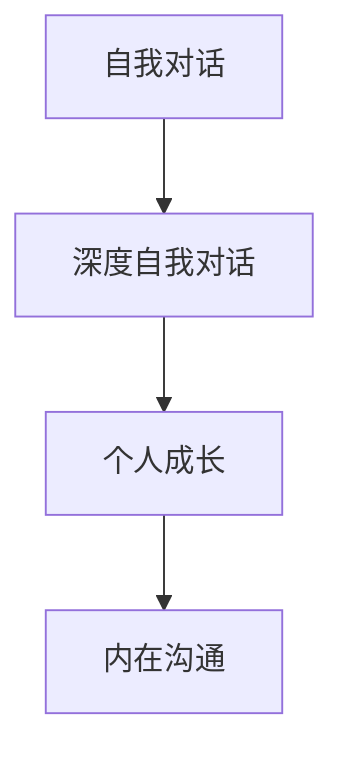
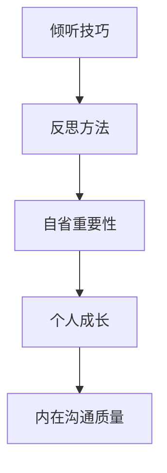

                 

### 深度自我对话：提升内在沟通的质量

在快速变化的技术时代，个人成长和职业发展的重要性愈发突出。为了在激烈竞争中脱颖而出，人们不仅需要专业技能，更需要强大的内在沟通能力。《深度自我对话：提升内在沟通的质量》是一本旨在帮助读者深入理解和提升自我对话技巧的书籍。本文将逐步分析该书的核心内容，探讨如何通过深度自我对话来提升个人内在沟通的质量。

#### 引言

自我对话是人们日常生活中普遍存在的现象。它不仅指内心的自我交流，还涵盖了自我反思和自我指导。深度自我对话则是一种更加深入和有意识的自我交流方式，它有助于我们更好地理解自己的情感、想法和行为，从而实现个人成长和自我提升。

本书的作者AI天才研究院和禅与计算机程序设计艺术大师，结合了人工智能和心理学领域的专业知识，为我们提供了一套系统化的深度自我对话方法论。本书旨在通过以下核心概念和联系，帮助读者提升内在沟通的质量：

- **自我对话**：自我对话是个人内心交流的过程，包括自我反思和自我指导。
- **深度自我对话**：深度自我对话是一种更加深入和有意识的自我交流方式，有助于个人成长和自我提升。
- **内在沟通**：内在沟通是指个体内部的信息交流和情感表达，是深度自我对话的基础。

以下是一个简化的Mermaid流程图，展示了这些核心概念之间的关系：



#### 核心概念与联系

在理解了核心概念之后，我们需要深入了解深度自我对话的原理与技巧，以及它如何影响内在沟通的质量。以下是深度自我对话的核心原理和技巧：

1. **倾听技巧**：深度自我对话的第一步是倾听。这意味着要停止外界的干扰，全神贯注地听取自己的内心声音。倾听技巧包括专注、放下判断和开放心态。

2. **反思方法**：反思是深度自我对话的重要组成部分。它要求我们对自己的想法、感受和行为进行深入思考，从而发现内在的矛盾和问题。反思方法包括自我提问、情境模拟和情感分析。

3. **自省重要性**：自省是指对自己的内心世界进行深入的探索和反思。它是深度自我对话的核心，有助于我们了解自己的真实需求和动机。自省的重要性体现在以下几个方面：
    - 提升自我认知：通过自省，我们能够更清楚地认识自己的内心世界，从而更好地理解自己。
    - 促进情感管理：自省有助于我们识别和调节自己的情绪，从而更好地应对压力和挑战。
    - 增强决策能力：通过自省，我们能够深入思考自己的决策过程，从而做出更加明智的选择。

以下是一个简化的Mermaid流程图，展示了深度自我对话的原理与技巧：



#### 核心算法原理讲解

为了更深入地理解深度自我对话的原理，我们可以将其比作一种算法。这种算法的核心在于通过自我提问和反思来探索和解析自己的内心世界。以下是这种算法的伪代码：

```plaintext
算法：深度自我对话

输入：自我对话主题
输出：自我对话结果

步骤：
1. 初始化对话主题和倾听环境
2. 倾听内心的声音，记录下重要的想法和感受
3. 对记录的信息进行反思，提出以下问题：
   - 我为什么会这样想？
   - 这种想法背后的动机是什么？
   - 我的情感反应是什么？
4. 对反思的结果进行总结，形成自我对话结论
5. 根据自我对话结论调整行为和思维模式
6. 重复步骤2-5，直到达到满意的自我对话结果
```

#### 数学模型和公式

为了更精确地描述深度自我对话的过程，我们可以引入一些数学模型和公式。以下是一个简化的模型：

```latex
\text{深度自我对话模型} = \text{倾听技巧} \times \text{反思方法} \times \text{自省重要性}
```

其中，倾听技巧、反思方法和自省重要性是相互依赖和相互促进的。通过提高这些方面的能力，我们可以实现深度自我对话的优化。

#### 举例说明

为了更好地理解深度自我对话的应用，我们可以通过一个实际案例来讲解。假设一位程序员在项目中遇到了困难，他可以通过以下步骤进行深度自我对话：

1. **倾听技巧**：他在安静的环境中，闭上眼睛，深呼吸几次，然后倾听自己内心的声音，记录下焦虑和困惑的感受。
2. **反思方法**：他问自己：“我为什么会感到焦虑？是因为项目的难度太大，还是因为我对自己的期望太高？”通过反思，他意识到自己的焦虑来源于对失败的恐惧。
3. **自省重要性**：他进一步思考：“我对失败的恐惧是因为什么？是因为我害怕失去工作，还是因为我害怕失去自信？”通过自省，他认识到自己的恐惧源于对自尊心的过度关注。

通过这个过程，他能够更好地理解自己的内心世界，从而找到解决问题的方法。他决定采取以下行动：
- **调整心态**：他告诉自己，失败并不可怕，而是成长的机会。
- **制定计划**：他重新审视项目，制定了一个更加实际和可行的计划。
- **行动实施**：他开始逐步实施计划，克服困难，最终成功完成了项目。

#### 项目实战

在深度自我对话的实际应用中，我们可以将其应用于各种场景，如情绪管理、心理健康、工作效率提升等。以下是一个基于情绪管理的实际案例：

**案例背景**：一位职场女性在工作和生活中经常感到压力，情绪波动较大。

**深度自我对话过程**：
1. **倾听技巧**：她找到一个安静的地方，闭上眼睛，深呼吸，倾听内心的声音，记录下她的情绪波动。
2. **反思方法**：她问自己：“我为什么会感到压力？是因为工作太多，还是因为人际关系复杂？”通过反思，她意识到自己的压力来源于对完美主义的追求。
3. **自省重要性**：她进一步思考：“为什么我会追求完美主义？是因为我对自己的期望太高，还是因为我对他人的期望太高？”通过自省，她认识到自己的完美主义源于对自尊心的过度关注。

**解决方案**：
- **调整心态**：她开始接受自己的不完美，告诉自己，每个人都会有不足之处。
- **设定目标**：她重新审视自己的目标，将目标设定得更加实际和可行。
- **寻求支持**：她与家人和朋友分享自己的感受，寻求他们的支持和理解。

**结果**：通过深度自我对话，她成功地管理了自己的情绪，工作压力得到了缓解，生活品质得到了提升。

#### 最佳实践 tips、小结、注意事项、拓展阅读

**最佳实践 tips**：
- **定期进行自我对话**：为了提升内在沟通的质量，建议读者定期进行自我对话，如每天睡前或早晨起床时。
- **记录对话内容**：将自我对话的内容记录下来，有助于回顾和反思，提高对话效果。

**小结**：
深度自我对话是一种有效的内在沟通技巧，通过倾听、反思和自省，我们可以更好地理解自己的内心世界，从而实现个人成长和自我提升。

**注意事项**：
- **保持真诚**：在进行自我对话时，要保持真诚，不要试图掩盖自己的真实感受。
- **避免自我批评**：在自我对话中，避免过度自我批评，要以建设性的态度进行反思。

**拓展阅读**：
- 《禅与计算机程序设计艺术》
- 《自我对话：内在沟通的艺术》

### 结语

通过本文的逐步分析，我们深入探讨了《深度自我对话：提升内在沟通的质量》的核心内容。深度自我对话不仅有助于个人成长，还能提升我们的内在沟通能力，从而在职场和个人生活中取得更好的成绩。希望读者能够通过实践深度自我对话，提升自己的内在沟通质量，实现个人成长和幸福。作者：AI天才研究院/AI Genius Institute & 禅与计算机程序设计艺术大师。

