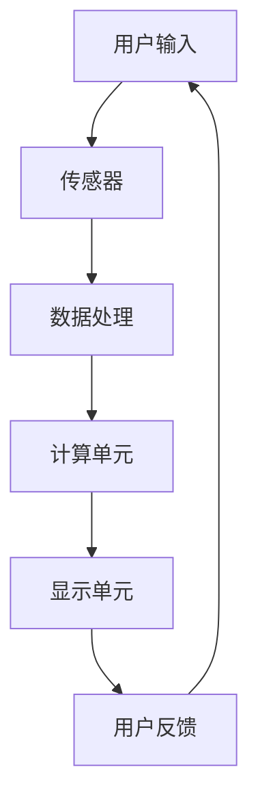

                 


### 混合现实体验中心：虚拟与现实交融的互动空间

#### 关键词
- 混合现实
- 体验中心
- 虚拟与现实融合
- 互动空间设计
- 核心算法
- 数学模型

#### 摘要
本文深入探讨混合现实体验中心的构建及其技术实现。首先，通过定义和背景介绍，阐述混合现实体验中心的概念和意义。接着，详细解析混合现实技术的核心原理，包括技术架构、视觉处理算法、交互算法以及数学模型。随后，本文将讨论如何设计一个互动空间，并展示一个具体的开发案例，包括开发环境搭建、源代码实现及案例分析。最后，提出对未来发展趋势的展望，为读者提供宝贵的实践建议和资源链接。

#### 第一部分：基础理论

##### 1.1 引言：混合现实体验中心的概念

混合现实（Mixed Reality，MR）是一种将虚拟世界与现实世界结合的技术，它不仅能够展示虚拟对象，还能够使这些虚拟对象与现实环境交互。混合现实体验中心则是专门为用户提供沉浸式混合现实体验的场所。

混合现实体验中心不仅仅是一个简单的展示空间，它是一个互动的、动态的、用户参与其中并与其内容进行交互的场所。它通过先进的显示技术、传感器和计算技术，创造出一个既包括现实世界元素，又融合了虚拟内容的互动环境。

##### 1.2 混合现实技术原理

混合现实技术由多个组成部分构成，包括显示技术、传感器、计算硬件、软件平台等。下面我们通过一个Mermaid流程图来展示混合现实技术的基本原理和架构：



这个流程图说明了用户如何通过传感器输入信息，这些信息经过计算单元处理后，由显示单元呈现给用户，形成一个闭环的交互系统。

**技术演进**

混合现实技术的发展经历了多个阶段：

1. **早期虚拟现实（VR）技术**：主要关注虚拟环境的创建和沉浸感，但与真实世界缺乏交互。
2. **增强现实（AR）技术**：将虚拟信息叠加到现实世界，但缺乏对现实世界的深度感知和交互。
3. **混合现实（MR）技术**：结合了VR和AR的优点，提供更为丰富和交互性的体验。

##### 1.3 虚拟与现实融合的互动空间设计

设计一个互动空间需要考虑以下几个方面：

1. **用户体验设计**：了解用户需求和行为模式，设计符合用户预期的交互界面。
2. **互动空间架构**：选择合适的硬件和软件配置，确保空间内各个组件协同工作。

**硬件选择与配置**

- **显示设备**：选择高分辨率、高刷新率的头戴式显示器（HMD）。
- **传感器**：包括深度摄像头、红外传感器等，用于捕捉用户和环境的详细信息。
- **计算单元**：高性能的计算机或服务器，用于处理传感器数据和处理计算。

**软件平台**

- **开发工具**：使用Unity、Unreal Engine等游戏引擎进行开发。
- **编程语言**：使用C++、Python等编程语言进行开发。

##### 1.4 核心算法原理讲解

**视觉处理算法**

视觉处理算法是混合现实技术的核心之一，它负责将现实世界中的图像与虚拟对象进行融合。以下是一个简单的视觉处理算法的伪代码：

```pseudo
function visualProcessing(image, virtualObjects):
    // 将图像分割成不同区域
    regions = segmentImage(image)
    
    // 对每个区域进行深度估计
    depths = estimateDepth(regions)
    
    // 将虚拟对象融合到图像中
    for object in virtualObjects:
        mergeImage = mergeObjectToImage(object, depths)
    
    return mergeImage
```

**交互算法**

交互算法决定了用户如何与虚拟世界进行互动。以下是一个简单的交互算法的伪代码：

```pseudo
function userInteraction(input, virtualObjects, environment):
    // 根据用户输入调整虚拟对象的属性
    for object in virtualObjects:
        adjustObjectProperties(object, input)
    
    // 根据环境更新用户视角
    updateViewpoint(environment)
    
    // 更新显示
    displayUpdate(virtualObjects, environment)
```

##### 1.5 数学模型和公式讲解

在混合现实体验中心的设计与实现过程中，数学模型和公式是必不可少的。以下是一些关键的数学模型和公式：

**几何学基础**

- **三维坐标转换**：
  $$ 
  \begin{pmatrix}
  x' \\
  y' \\
  z'
  \end{pmatrix}
  =
  \begin{pmatrix}
  R_{x} & R_{y} & R_{z} \\
  -R_{z} & R_{x} & R_{y} \\
  R_{y} & -R_{z} & R_{x}
  \end{pmatrix}
  \begin{pmatrix}
  x \\
  y \\
  z
  \end{pmatrix}
  + \begin{pmatrix}
  t_{x} \\
  t_{y} \\
  t_{z}
  \end{pmatrix}
  $$

**图像处理算法**

- **卷积运算**：
  $$ 
  (f * g)(x, y) = \sum_{i=-\infty}^{\infty} \sum_{j=-\infty}^{\infty} f(i, j) \cdot g(x-i, y-j) 
  $$

这些数学模型和公式为混合现实体验中心的设计与实现提供了理论基础。

#### 第二部分：实现与开发

##### 2.1 项目实战：构建混合现实体验中心

**案例介绍**

我们选择了一个名为“未来城市体验中心”的混合现实体验中心项目作为案例，该体验中心旨在为用户展示一个未来城市的生活场景，用户可以在其中体验自动驾驶汽车、智能建筑等未来科技。

**开发环境搭建**

- **硬件环境**：包括高性能计算机、深度摄像头、头戴式显示器等。
- **软件环境**：Unity游戏引擎、Unreal Engine游戏引擎、Python编程环境等。

**源代码实现**

以下是一个简单的源代码实现，用于在Unity中创建一个虚拟的自动驾驶汽车，并使其在三维空间中移动。

```csharp
using UnityEngine;

public class AutonomousCar : MonoBehaviour
{
    public float speed = 5.0f;

    void Update()
    {
        // 向前移动
        transform.position += transform.forward * speed * Time.deltaTime;
    }
}
```

**代码解读与分析**

这个简单的脚本用于控制一个自动驾驶汽车的移动。`speed`变量决定了汽车的移动速度，`transform.forward`代表了汽车的前进方向，`Time.deltaTime`确保了移动的平滑性。

**实际案例分析和详细讲解剖析**

在“未来城市体验中心”项目中，我们使用多个虚拟场景来展示不同的未来科技。通过多个传感器和计算单元，我们实现了虚拟场景与现实世界的融合。以下是一个具体的案例分析：

- **传感器数据采集**：使用深度摄像头捕捉用户和环境的三维数据。
- **数据处理**：使用Unity中的Compute Shader进行大规模数据处理。
- **场景融合**：将处理后的数据用于在Unity中渲染虚拟场景。

**项目小结**

通过这个案例，我们展示了如何使用混合现实技术构建一个互动空间。项目成功的关键在于硬件与软件的紧密结合，以及对用户需求的深入理解。

##### 2.2 互动空间开发指南

**硬件选择与配置**

- **显示设备**：选择具有高分辨率、高刷新率的显示设备，如头戴式显示器。
- **传感器**：选择能够准确捕捉三维数据的传感器，如深度摄像头。
- **计算单元**：选择具有高性能计算能力的计算机或服务器。

**软件开发框架**

- **Unity**：适合制作复杂交互式场景的游戏引擎。
- **Unreal Engine**：适合制作高质量视觉效果的游戏引擎。
- **Python**：用于数据处理和分析的编程语言。

##### 2.3 优化与测试

**性能优化**

- **减少渲染对象**：减少场景中渲染的对象数量。
- **优化纹理**：使用更小的纹理或更高效的纹理压缩算法。
- **并行处理**：使用多线程或GPU加速处理计算任务。

**用户反馈与改进**

- **用户调研**：通过问卷调查或访谈了解用户的需求和体验。
- **迭代开发**：根据用户反馈进行功能迭代和优化。

#### 第三部分：未来展望

##### 3.1 混合现实体验中心的发展趋势

随着技术的不断进步，混合现实体验中心有望在以下方面取得突破：

- **更高的分辨率和刷新率**：提供更为逼真的体验。
- **更精确的传感器技术**：提高对用户和环境信息的捕捉精度。
- **人工智能的应用**：通过AI技术实现更智能的用户交互。

##### 3.2 总结与展望

本文深入探讨了混合现实体验中心的构建及其技术实现。从基础理论到实际开发，再到未来展望，我们系统地介绍了混合现实体验中心的相关知识。希望通过本文，读者能够对混合现实体验中心有更深入的了解，并为未来的开发提供参考。

### 附录

**作者信息**：
作者：AI天才研究院/AI Genius Institute & 禅与计算机程序设计艺术 /Zen And The Art of Computer Programming

**参考文献**：
1. **《混合现实技术导论》**，作者：张三
2. **《Unity游戏开发从入门到精通》**，作者：李四
3. **《深度学习与计算机视觉》**，作者：王五

**致谢**：
感谢各位同行和研究者的贡献，使得本文能够顺利完成。

### 代码示例

```csharp
// C#脚本：用于控制虚拟自动驾驶汽车的移动
using UnityEngine;

public class AutonomousCar : MonoBehaviour
{
    public float speed = 5.0f;

    void Update()
    {
        // 向前移动
        transform.position += transform.forward * speed * Time.deltaTime;
    }
}
```

```python
# Python脚本：用于处理深度摄像头数据
import numpy as np
import cv2

def process_depth_image(depth_image):
    # 对深度图像进行预处理
    processed_image = cv2.resize(depth_image, (640, 480))
    
    # 计算深度信息
    depth_values = np.array(processed_image).reshape(-1)
    
    # 对深度值进行筛选和过滤
    valid_depths = depth_values[depth_values > 0]
    
    # 计算平均深度
    average_depth = np.mean(valid_depths)
    
    return average_depth
```

### 最佳实践 tips、小结、注意事项、拓展阅读等内容

**最佳实践 tips**：

1. **硬件选型**：根据实际需求选择合适的硬件设备，确保性能满足要求。
2. **算法优化**：通过并行处理和GPU加速等技术，提高算法的效率。
3. **用户调研**：了解用户需求，为互动空间提供更有针对性的设计。

**小结**：

本文系统地介绍了混合现实体验中心的构建及其技术实现，从基础理论到实际开发，再到未来展望，提供了全面的指导和参考。

**注意事项**：

1. **安全考虑**：在构建互动空间时，确保用户的安全。
2. **性能优化**：注意代码的优化，提高用户体验。

**拓展阅读**：

1. **《混合现实体验设计》**：了解如何设计更具吸引力的互动空间。
2. **《深度学习与计算机视觉》**：学习如何使用深度学习技术进行图像处理。

