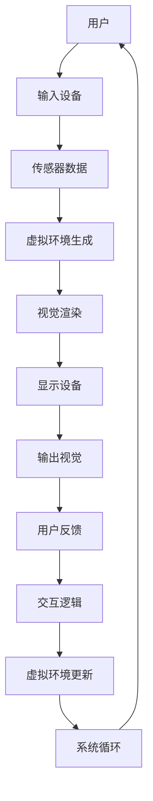
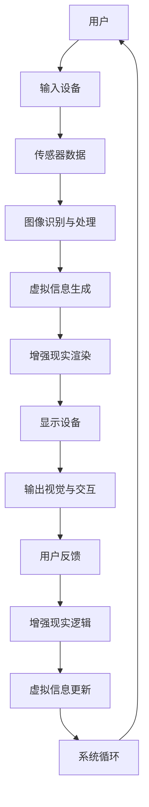

                 

### 文章标题

《混合现实体验实验室建设：虚拟与现实交融的研究中心创立》

### 关键词

混合现实，虚拟现实，增强现实，体验实验室，研究中心，技术原理，应用场景，建设方案，运营管理

### 摘要

本文深入探讨了混合现实体验实验室的建设过程，旨在为虚拟与现实交融的研究中心提供全面的技术指导。文章首先介绍了混合现实的定义、分类和发展历程，随后详细阐述了虚拟现实和增强现实的技术原理、内容制作方法以及应用场景。接着，本文提供了详细的实验室建设方案，包括硬件设备选型、软件平台搭建和开发环境配置。最后，文章探讨了实验室的运营管理策略，并总结了混合现实体验实验室建设的重要性，展望了未来的发展趋势。本文旨在为从事混合现实研究和应用的读者提供有价值的参考。

---

### 引言

#### 混合现实体验实验室建设的背景

随着科技的飞速发展，虚拟现实（VR）和增强现实（AR）技术逐渐成为人们关注的焦点。虚拟现实通过模拟虚拟环境，为用户提供沉浸式体验；而增强现实则通过叠加虚拟信息到真实环境中，实现了虚拟与现实的深度融合。这两种技术不仅改变了人们的娱乐和生活方式，还在教育、医疗、工业等多个领域展现了巨大的应用潜力。然而，技术的快速发展也带来了新的挑战，如何有效地整合和利用这些技术资源，构建一个能够提供卓越体验的混合现实体验实验室，成为了一个亟待解决的问题。

#### 混合现实体验实验室建设的重要性

混合现实体验实验室不仅是一个技术展示平台，更是研究和创新的重要载体。它为研究者提供了一个集中的环境，可以探索新的技术方案、评估技术效果，并开展跨学科合作。此外，实验室还为企业提供了一个展示其产品和服务的机会，有助于吸引投资和拓展市场。更重要的是，通过实验室的建设和运营，可以培养一批具备跨学科知识和创新能力的高素质人才，为未来的技术发展和产业升级提供坚实的人才保障。

#### 本书结构概述

本书旨在为混合现实体验实验室的建设提供系统、全面的技术指导。全书分为八个章节，分别从不同角度对混合现实技术进行了深入探讨。

- **第一章**：混合现实概述，介绍混合现实的定义、分类、发展历程和未来趋势。
- **第二章**：虚拟现实技术原理，详细阐述虚拟现实硬件设备、软件平台和交互技术。
- **第三章**：增强现实技术原理，介绍增强现实硬件设备、软件平台和交互技术。
- **第四章**：混合现实内容制作技术，讲解内容制作流程、3D建模与渲染技术、交互设计与用户体验。
- **第五章**：混合现实应用场景，分析教育培训、医疗健康、游戏娱乐、工业制造、智能交通等领域的应用。
- **第六章**：混合现实体验实验室建设方案，提供实验室规划与设计、硬件设备选型与配置、软件平台搭建与优化、开发环境搭建和源代码实现与解读的详细方案。
- **第七章**：混合现实体验实验室运营与管理，探讨实验室运营策略、管理模式与团队建设、资源分配与优化、持续改进与优化。
- **第八章**：结论，总结混合现实体验实验室建设的重要性，展望未来的发展趋势。

通过本书的阅读，读者可以全面了解混合现实技术的原理、应用场景和建设运营策略，为混合现实体验实验室的成功建设提供有力支持。在接下来的章节中，我们将逐步深入探讨这些内容，帮助读者构建一个高效的混合现实体验实验室。

---

### 混合现实概述

#### 混合现实定义

混合现实（Mixed Reality，简称MR）是一种将虚拟信息与现实世界融合在一起的技术。与虚拟现实和增强现实不同，混合现实不仅将虚拟元素叠加到现实环境中，还能够与现实世界进行交互，从而创造出一种全新的现实体验。在混合现实中，用户可以通过特殊设备（如头戴显示器、增强现实眼镜等）实时看到虚拟物体和现实环境的结合，并能与之进行自然交互。

#### 混合现实技术分类

混合现实技术可以按照不同的标准进行分类。以下是几种常见的分类方法：

1. **根据应用领域分类**：
   - **教育领域**：利用混合现实技术进行教学，如虚拟实验室、历史场景重现等。
   - **医疗领域**：通过混合现实技术进行手术模拟、患者康复训练等。
   - **娱乐领域**：开发混合现实游戏、主题公园等，提供沉浸式娱乐体验。
   - **工业领域**：应用于产品设计、制造流程优化、远程协作等。

2. **根据实现方式分类**：
   - **基于投影的混合现实**：利用投影设备将虚拟图像投射到真实环境中。
   - **基于显示器的混合现实**：通过头戴显示器将虚拟图像直接叠加到用户视野中。
   - **基于增强现实的混合现实**：结合增强现实技术，将虚拟元素叠加到现实环境中，同时保持与现实世界的交互。

#### 混合现实技术发展历程

混合现实技术的发展可以追溯到上世纪80年代，当时计算机图形学和虚拟现实技术开始兴起。以下是混合现实技术发展的重要里程碑：

1. **1980年代**：虚拟现实概念被提出，并开始应用于军事、娱乐等领域。
2. **1990年代**：增强现实技术逐渐兴起，例如波音公司开发的Head Mounted Display（HMD）设备。
3. **2000年代**：随着计算机性能的提升和传感技术的发展，虚拟现实和增强现实技术得到了广泛应用。
4. **2010年代**：微软发布HoloLens，标志着混合现实技术的商业化和广泛应用。
5. **2020年代**：混合现实技术继续快速发展，越来越多的企业和研究机构投入其中，推出了众多创新应用。

#### 混合现实技术未来趋势

随着技术的不断进步，混合现实技术在未来将迎来更多的发展机遇。以下是几个关键趋势：

1. **设备性能提升**：随着硬件技术的进步，混合现实设备的性能将得到显著提升，提供更清晰、更稳定的图像效果和更自然的交互体验。
2. **应用场景拓展**：混合现实技术将在更多领域得到应用，如智能城市、智能家居、远程办公等。
3. **跨平台融合**：混合现实技术将与5G、物联网、人工智能等技术深度融合，提供更加丰富和多样化的应用体验。
4. **产业生态建设**：随着市场的扩大，混合现实产业链将逐渐成熟，形成完整的生态体系，包括硬件设备、软件开发、内容制作、运营服务等。

通过本章节的介绍，读者可以初步了解混合现实技术的定义、分类和发展历程，为后续章节的深入学习打下基础。在接下来的章节中，我们将详细探讨虚拟现实和增强现实的技术原理，以及它们在混合现实中的应用。

### 虚拟现实技术原理

#### 虚拟现实硬件设备介绍

虚拟现实（VR）硬件设备是构建沉浸式虚拟环境的核心组成部分，主要包括头戴显示器（HMD）、定位追踪设备、手柄控制器和耳机等。

1. **头戴显示器（HMD）**：
   - **分辨率**：高分辨率HMD可以提供更清晰的图像，提升沉浸感。常见的分辨率有1440x1600（两个眼睛）和1920x1080（单眼）。
   - **刷新率**：高刷新率（一般超过90Hz）可以减少视觉疲劳，提供更流畅的体验。
   - **视场角（FOV）**：较大的视场角（一般大于90度）可以提供更广阔的视野，增强沉浸感。
   - **显示技术**：OLED显示技术因其低延迟、高对比度和广视角而广泛应用于高端VR设备。

2. **定位追踪设备**：
   - **外部传感器**：例如摄像头和红外传感器，用于跟踪用户的位置和动作。
   - **内部传感器**：如陀螺仪和加速度计，用于检测设备的运动状态。

3. **手柄控制器**：
   - **基本控制器**：提供基本的手部动作控制，如方向、点击等。
   - **增强控制器**：如适用于特定游戏的操纵杆、手柄等，提供更精细的控制。

4. **耳机**：
   - **立体声**：提供空间音效，增强沉浸感。
   - **耳机线缆**：无线耳机因其不受束缚，提供了更自由的体验。

#### 虚拟现实软件平台介绍

虚拟现实软件平台是构建虚拟环境和应用程序的基础，常见的平台包括Oculus、HTC Vive、PlayStation VR和Windows Mixed Reality等。

1. **Oculus**：
   - **Oculus Rift**：Oculus的首款VR头戴显示器，提供高分辨率和低延迟的虚拟现实体验。
   - **Oculus Quest**：一款无线VR头戴显示器，无需外部传感器，提供独立的虚拟现实体验。

2. **HTC Vive**：
   - **HTC Vive**：具备高分辨率和精确追踪功能的VR头戴显示器，支持空间定位和手柄控制。

3. **PlayStation VR**：
   - **PlayStation VR**：与PlayStation 4和5游戏机配套的VR头戴显示器，提供丰富的游戏体验。

4. **Windows Mixed Reality**：
   - **Windows Mixed Reality**：微软推出的VR头戴显示器，支持混合现实应用，适用于商业和个人使用。

#### 虚拟现实交互技术

虚拟现实交互技术是用户与虚拟环境之间互动的桥梁，常见的交互方式包括视觉交互、手势交互和语音交互。

1. **视觉交互**：
   - **光标控制**：用户通过移动光标来选择和操作虚拟对象。
   - **视线交互**：用户通过注视目标来触发操作，类似于现实世界的视线选择。

2. **手势交互**：
   - **手势识别**：通过内置传感器识别用户的手势，实现虚拟对象的抓取、旋转等操作。
   - **全手势交互**：使用空间手势进行复杂操作，提供更自然的交互体验。

3. **语音交互**：
   - **语音指令**：用户通过语音指令控制虚拟环境，如切换场景、调整音量等。
   - **语音识别**：智能语音助手提供即时反馈和操作建议。

#### Mermaid 流程图：虚拟现实系统架构

以下是一个简化的虚拟现实系统架构Mermaid流程图，展示了主要组件和交互流程：



在这个流程图中，用户通过输入设备（如手柄、手势传感器等）与虚拟环境进行交互，传感器数据被处理并用于生成虚拟环境。视觉渲染后，图像通过显示设备输出给用户，用户反馈又用于更新虚拟环境和交互逻辑，形成一个闭环系统。

通过上述对虚拟现实技术原理的介绍，读者可以初步了解虚拟现实硬件设备、软件平台和交互技术的基本概念，为后续章节的内容奠定基础。

### 增强现实技术原理

#### 增强现实硬件设备介绍

增强现实（AR）硬件设备是构建增强现实体验的关键组件，常见的设备包括增强现实眼镜、智能手机和平板电脑等。

1. **增强现实眼镜**：
   - **AR眼镜**：例如微软HoloLens和谷歌Glass，它们通过光学投影或透明显示屏将虚拟信息叠加到用户视野中，提供高度沉浸的AR体验。
   - **特性**：高分辨率显示屏、实时定位与追踪技术、与外部设备的无线连接能力。

2. **智能手机和平板电脑**：
   - **增强现实应用**：智能手机和平板电脑通过内置的摄像头、传感器和处理器，运行增强现实应用，如AR游戏、导航和学习教育等。
   - **增强现实摄像头**：通过识别和标记现实环境中的特定物体或图像，将虚拟信息叠加到用户视野中。

#### 增强现实软件平台介绍

增强现实软件平台提供了开发、运行和管理增强现实应用的环境，常见的平台包括ARKit、ARCore和Unity AR。

1. **ARKit**：
   - **苹果公司开发**：为iOS设备和Mac提供强大的增强现实开发框架。
   - **功能**：实时图像识别、3D物体追踪、环境映射和动画效果等。

2. **ARCore**：
   - **谷歌公司开发**：为Android设备和谷歌Daydream VR头戴设备提供增强现实开发工具。
   - **功能**：环境感知、光线估算、运动追踪和位姿估算等。

3. **Unity AR**：
   - **Unity公司开发**：跨平台增强现实开发引擎，支持2D和3D内容制作。
   - **功能**：完整的开发工具集、丰富的插件和社区支持。

#### 增强现实交互技术

增强现实交互技术是用户与增强现实环境之间互动的关键，常见的交互方式包括手势交互、语音交互和标记交互。

1. **手势交互**：
   - **手势识别**：通过摄像头和深度传感器识别用户的手部动作，实现虚拟对象的抓取、旋转和放置等。
   - **自然手势**：利用增强现实技术，用户可以通过自然手势进行交互，如挥动手臂切换屏幕或放大缩小虚拟对象。

2. **语音交互**：
   - **语音指令**：用户可以通过语音命令控制增强现实应用，如启动应用、切换场景或调整参数。
   - **语音识别**：智能语音助手可以识别用户的语音输入，并提供即时反馈和操作建议。

3. **标记交互**：
   - **标记识别**：通过摄像头识别现实环境中的特定标记或图像，触发虚拟信息的显示或交互。
   - **动态标记**：利用增强现实技术，用户可以创建和放置动态标记，实现虚拟信息与现实环境的互动。

#### Mermaid 流程图：增强现实系统架构

以下是一个简化的增强现实系统架构Mermaid流程图，展示了主要组件和交互流程：



在这个流程图中，用户通过输入设备（如智能手机摄像头）捕捉现实环境中的图像，传感器数据被处理用于识别和跟踪图像。生成的虚拟信息通过增强现实渲染叠加到用户视野中，用户反馈用于更新虚拟信息和交互逻辑，形成一个闭环系统。

通过上述对增强现实技术原理的介绍，读者可以初步了解增强现实硬件设备、软件平台和交互技术的基本概念，为后续章节的内容奠定基础。在接下来的章节中，我们将进一步探讨混合现实内容制作技术，以及这些技术在各个应用场景中的具体应用。

### 混合现实内容制作技术

#### 混合现实内容制作流程

混合现实内容制作是一个复杂的过程，涉及多个环节，从前期策划到后期渲染，每个环节都需要精心设计和执行。

1. **前期策划**：
   - **需求分析**：明确项目需求，包括用户目标、应用场景和功能需求。
   - **设计原型**：根据需求分析，制作初步的设计原型，包括用户界面、交互流程和内容布局。

2. **中期制作**：
   - **3D建模与渲染**：使用3D建模工具（如Blender、Maya等）创建虚拟场景和对象，并进行渲染，以获得高质量的图像效果。
   - **内容整合**：将渲染的3D模型、音频和视频等多媒体内容整合到混合现实平台中。

3. **后期优化**：
   - **用户体验测试**：对内容进行用户体验测试，收集反馈并进行优化，确保内容符合用户需求。
   - **性能优化**：针对硬件性能进行优化，确保内容的流畅性和稳定性。

#### 3D建模与渲染技术

3D建模与渲染技术在混合现实内容制作中扮演着至关重要的角色。以下是一些关键技术和工具：

1. **3D建模工具**：
   - **Blender**：一款开源的3D建模和渲染软件，功能强大且用户友好。
   - **Maya**：Autodesk公司开发的3D建模和动画软件，广泛用于电影、游戏和工业设计等领域。
   - **3ds Max**：Autodesk公司开发的3D建模和动画软件，适用于建筑、工程和媒体制作。

2. **渲染引擎**：
   - **Unity**：一款跨平台的游戏开发引擎，支持3D建模、动画和实时渲染。
   - **Unreal Engine**：Epic Games开发的游戏开发引擎，具有高效的渲染性能和强大的视觉效果。

3. **渲染技术**：
   - **实时渲染**：在混合现实应用中，实时渲染技术至关重要，它能够确保虚拟内容与真实环境同步，提供流畅的交互体验。
   - **全局光照**：通过模拟光线在场景中的传播，提高图像的真实感。
   - **光线追踪**：模拟光线的传播路径，实现更逼真的渲染效果。

#### 交互设计与用户体验

交互设计与用户体验是混合现实内容制作的重要环节，决定了用户能否顺利、愉快地使用应用。

1. **用户界面设计**：
   - **直观性**：设计简洁直观的用户界面，使用户能够快速理解和使用应用。
   - **一致性**：保持界面设计的一致性，避免用户在不同场景下感到困惑。

2. **交互设计**：
   - **自然交互**：利用手势、语音等自然交互方式，提高用户的互动体验。
   - **反馈机制**：通过视觉、声音等反馈机制，引导用户正确操作。

3. **用户体验**：
   - **沉浸感**：通过高质量的画面和逼真的音效，增强用户的沉浸感。
   - **互动性**：设计丰富的交互内容，激发用户的参与和兴趣。

#### 伪代码讲解：内容同步算法

在混合现实应用中，内容同步算法至关重要，它负责将虚拟内容与真实环境实时同步。以下是一个简化的伪代码示例，用于描述内容同步算法的基本逻辑：

```plaintext
1. 初始化环境
2. 获取真实环境的图像和传感器数据
3. 对图像进行预处理（如去噪、增强等）
4. 利用传感器数据计算虚拟内容的位姿（位置和方向）
5. 根据位姿调整虚拟内容的位置和方向
6. 对虚拟内容进行渲染
7. 输出渲染结果到显示设备
8. 记录用户交互操作
9. 根据用户交互操作更新虚拟内容
10. 返回步骤3，持续循环
```

这个伪代码示例展示了内容同步算法的基本流程，包括初始化环境、获取传感器数据、预处理图像、计算虚拟内容位姿、调整虚拟内容位置和方向、渲染输出以及记录用户交互操作。通过不断循环执行这些步骤，可以实现虚拟内容与真实环境的实时同步。

通过上述对混合现实内容制作技术的介绍，读者可以初步了解内容制作的基本流程、3D建模与渲染技术、交互设计与用户体验，以及内容同步算法。在接下来的章节中，我们将进一步探讨混合现实在不同应用场景中的具体应用，帮助读者更好地理解混合现实技术的实际应用价值。

### 混合现实应用场景

混合现实（MR）技术凭借其独特的沉浸式和交互式特点，正在各行各业中展现出广泛的应用潜力。以下将详细介绍混合现实在教育培训、医疗健康、游戏娱乐、工业制造、智能交通等领域的应用场景，并结合实际案例进行深入剖析。

#### 教育培训

在教育领域，混合现实技术为师生提供了全新的教学手段和学习体验。通过MR技术，学生可以身临其境地参与历史场景重现、科学实验模拟等教学活动，提高学习兴趣和效果。

1. **历史场景重现**：
   - **案例**：例如，利用MR技术重现古埃及金字塔建造过程，学生可以通过穿戴MR设备，亲身体验古代建筑师的日常工作和生活方式。
   - **效果**：这种沉浸式体验有助于学生更深入地理解历史知识，增强记忆效果。

2. **科学实验模拟**：
   - **案例**：在物理实验室中，利用MR技术模拟复杂的物理实验，如电磁感应、粒子碰撞等，让学生在没有风险的情况下反复实验。
   - **效果**：通过MR技术，学生可以更直观地观察实验现象，提高实验技能和科学素养。

#### 医疗健康

在医疗健康领域，混合现实技术为医生提供了强大的辅助工具，用于手术模拟、患者康复训练、医学教育等。

1. **手术模拟**：
   - **案例**：利用MR技术，医生可以在虚拟环境中模拟手术操作，提高手术技能和安全性。
   - **效果**：通过MR手术模拟，医生可以在没有实际病人时进行反复练习，减少手术风险。

2. **患者康复训练**：
   - **案例**：对于中风或瘫痪患者，利用MR技术设计个性化的康复训练方案，通过虚拟环境进行康复训练，提高康复效果。
   - **效果**：MR康复训练提供实时反馈，帮助患者更好地掌握康复动作，提高康复成功率。

#### 游戏娱乐

在游戏娱乐领域，混合现实技术为玩家带来了全新的游戏体验，通过沉浸式场景和互动式玩法，让游戏更加真实和有趣。

1. **沉浸式游戏**：
   - **案例**：例如，一款名为《Minecraft Earth》的游戏，玩家可以在现实世界中探索和建造虚拟世界。
   - **效果**：这种沉浸式游戏体验极大地激发了玩家的创造力和参与度。

2. **多人合作游戏**：
   - **案例**：《Cosmic Scorer》是一款混合现实篮球游戏，玩家可以通过穿戴MR设备，与朋友在虚拟现实中进行篮球比赛。
   - **效果**：多人合作游戏增强了社交互动，提高了玩家的游戏体验。

#### 工业制造

在工业制造领域，混合现实技术为生产和管理提供了创新的解决方案，如远程协作、设备维护和产品展示等。

1. **远程协作**：
   - **案例**：利用MR技术，工程师可以在异地通过虚拟现实会议与现场人员进行实时协作，共同解决问题。
   - **效果**：这种远程协作提高了工作效率，减少了人员调度成本。

2. **设备维护**：
   - **案例**：通过MR技术，技术人员可以在虚拟环境中进行设备维护模拟训练，提高操作技能。
   - **效果**：MR设备维护训练减少了实际设备损坏的风险，提高了维护效率。

#### 智能交通

在智能交通领域，混合现实技术为交通管理和车辆驾驶提供了智能化支持，如交通监控、驾驶模拟和安全预警等。

1. **交通监控**：
   - **案例**：利用MR技术，交通管理部门可以在虚拟环境中实时监控交通流量，优化交通信号配置。
   - **效果**：通过MR交通监控，提高了交通管理效率和安全性。

2. **驾驶模拟**：
   - **案例**：利用MR技术，驾驶学校可以模拟真实驾驶场景，进行驾驶技能训练。
   - **效果**：MR驾驶模拟提高了驾驶学员的实战经验和应对突发情况的能力。

#### 典型案例分析与讲解

1. **教育培训领域：哈佛大学混合现实实验室**
   - **案例简介**：哈佛大学混合现实实验室利用MR技术进行科学教育和研究，通过虚拟现实和增强现实技术展示复杂科学概念。
   - **效果分析**：实验室通过MR技术成功将抽象的科学理论具象化，为学生提供了生动的学习体验，显著提高了学习效果。

2. **医疗健康领域：瑞士巴塞尔大学医疗中心**
   - **案例简介**：瑞士巴塞尔大学医疗中心利用MR技术进行手术模拟和患者康复训练，提高了医疗质量和患者满意度。
   - **效果分析**：通过MR手术模拟，医生显著提升了手术技能和操作安全性，患者康复速度和效果也得到了提升。

3. **游戏娱乐领域：索尼《PlayStation VR》**
   - **案例简介**：《PlayStation VR》是一款结合了虚拟现实和增强现实技术的游戏平台，为玩家提供了丰富的沉浸式游戏体验。
   - **效果分析**：该平台成功吸引了大量玩家，不仅提升了玩家的游戏体验，还推动了VR技术在消费电子领域的发展。

4. **工业制造领域：德国西门子工厂**
   - **案例简介**：德国西门子工厂利用MR技术进行远程协作和设备维护，提高了生产效率和设备利用率。
   - **效果分析**：通过MR远程协作，西门子显著减少了异地工作成本，提高了生产效率和设备维护质量。

5. **智能交通领域：新加坡智能交通系统**
   - **案例简介**：新加坡智能交通系统利用MR技术进行交通监控和驾驶模拟，提升了城市交通管理效率和安全性。
   - **效果分析**：通过MR交通监控，新加坡成功减少了交通拥堵，提高了城市交通运行效率。

通过上述案例分析，可以看出混合现实技术在不同领域的广泛应用和显著效果。随着技术的不断发展和完善，混合现实技术将在未来带来更多创新应用，推动各行各业的转型升级。

### 混合现实体验实验室建设方案

#### 实验室规划与设计

实验室规划与设计是混合现实体验实验室建设的关键步骤，直接关系到实验效果和用户体验。以下是实验室规划与设计的几个关键要素：

1. **场地选择**：
   - **空间大小**：实验室应选择宽敞的空间，以便容纳各种设备和人员。
   - **光线控制**：确保实验室有良好的光线控制，减少外部光线对增强现实和虚拟现实体验的影响。
   - **通风系统**：实验室应配备良好的通风系统，保持空气流通，避免设备过热。

2. **设备布局**：
   - **区域划分**：将实验室划分为不同功能区域，如设备存放区、体验区、控制区等。
   - **走道设计**：合理设计走道，确保人员流动顺畅，不影响体验活动。

3. **环境设计**：
   - **装饰风格**：根据实验室的主题和用途，设计合适的装饰风格，提升用户体验。
   - **指示标志**：设置清晰的指示标志，帮助人员快速找到设备和使用方法。

#### 硬件设备选型与配置

硬件设备的选型与配置是实验室建设的重要组成部分，直接影响到实验效果和用户体验。以下是几个关键硬件设备的选型与配置建议：

1. **头戴显示器（HMD）**：
   - **分辨率**：选择分辨率高、视场角（FOV）大的HMD，以提高沉浸感。
   - **跟踪系统**：选择支持六自由度（6DoF）跟踪的HMD，实现精确的位置和姿态跟踪。

2. **增强现实眼镜**：
   - **显示技术**：选择具备高清晰度和低延迟的显示技术，如OLED。
   - **传感器**：确保眼镜配备先进的传感器，如陀螺仪、加速度计等，用于实时追踪用户动作。

3. **手柄控制器**：
   - **功能**：选择具备多种交互功能的控制器，如手势识别、触摸屏等。
   - **兼容性**：选择兼容多种平台和控制软件的控制器，提高设备的利用率。

4. **其他设备**：
   - **投影设备**：用于构建大型虚拟场景或增强现实投影。
   - **音响系统**：提供高质量立体声效果，增强沉浸感。

#### 软件平台搭建与优化

软件平台是混合现实体验的核心，其搭建与优化直接影响到实验效果和用户体验。以下是软件平台搭建与优化的几个关键步骤：

1. **开发环境搭建**：
   - **操作系统**：选择适合混合现实开发的操作系统，如Windows Mixed Reality、Android或iOS。
   - **开发工具**：安装并配置适合的编程工具和开发框架，如Unity、Unreal Engine等。

2. **内容制作工具**：
   - **3D建模工具**：选择功能强大的3D建模工具，如Blender、Maya等。
   - **渲染引擎**：选择适合的渲染引擎，如Unity、Unreal Engine等，以提高渲染效果。

3. **增强现实开发框架**：
   - **ARKit**：适用于iOS设备的增强现实开发框架。
   - **ARCore**：适用于Android设备的增强现实开发框架。

4. **优化与调试**：
   - **性能优化**：对软件进行性能优化，确保在低延迟和高画质之间取得平衡。
   - **兼容性测试**：测试软件在不同设备和操作系统上的兼容性，确保用户在不同平台上获得一致的体验。

#### 开发环境搭建

开发环境搭建是混合现实体验实验室建设的基础工作，以下是一个简化的开发环境搭建流程：

1. **硬件准备**：
   - **安装操作系统**：在头戴显示器和增强现实眼镜上安装适合的操作系统，如Windows Mixed Reality或Android。
   - **连接设备**：将头戴显示器和增强现实眼镜连接到计算机或其他设备，确保设备可以正常工作。

2. **软件安装**：
   - **安装开发工具**：在计算机上安装开发工具，如Unity、Unreal Engine、Blender等。
   - **安装开发框架**：根据需求安装相应的增强现实开发框架，如ARKit、ARCore等。

3. **环境配置**：
   - **设置传感器**：确保传感器（如陀螺仪、加速度计）正确连接并配置。
   - **调试设备**：通过调试工具检查设备是否正常工作，如追踪精度、图像质量等。

4. **测试与优化**：
   - **进行测试**：在虚拟环境中进行测试，确保软件可以正常运行。
   - **优化性能**：对软件进行性能优化，确保流畅的体验。

#### 源代码实现与解读

以下是混合现实体验实验室的一个简化的源代码示例，用于展示如何创建一个基本的虚拟物体并实现与用户的交互：

```cpp
#include <MRFramework.h>

// 创建虚拟物体
MRObject* createVirtualObject() {
    MRObject* obj = new MRObject();
    obj->loadModel("model.obj");
    obj->setScale(0.5f);
    obj->setPosition(0.0f, 1.5f, 0.0f);
    return obj;
}

// 处理用户交互
void handleUserInteraction(MRObject* obj) {
    if (userInput.isButtonDown(MR_BUTTON_LEFT)) {
        // 拖动物体
        vec3 delta = userInput.getMouseDelta();
        obj->setPosition(obj->getPosition() + delta);
    } else if (userInput.isButtonDown(MR_BUTTON_RIGHT)) {
        // 旋转物体
        float angle = userInput.getMouseWheelDelta() * 0.01f;
        obj->rotateAroundY(angle);
    }
}

int main() {
    // 初始化MR框架
    MRFramework::init();

    // 创建虚拟物体
    MRObject* obj = createVirtualObject();

    while (!MRFramework::isQuitRequested()) {
        // 更新用户输入
        userInput.update();

        // 处理用户交互
        handleUserInteraction(obj);

        // 渲染虚拟物体
        MRFramework::render(obj);

        // 处理其他MR事件
        MRFramework::handleEvents();
    }

    // 清理资源
    delete obj;
    MRFramework::shutdown();

    return 0;
}
```

这个源代码示例展示了如何创建一个虚拟物体并处理用户交互。其中，`createVirtualObject`函数用于创建虚拟物体，`handleUserInteraction`函数用于处理用户的拖动和旋转操作。主函数`main`中，首先初始化MR框架，然后创建虚拟物体并进入主循环，不断更新用户输入、处理交互、渲染物体和处理其他事件，最后清理资源并关闭MR框架。

通过以上对实验室规划与设计、硬件设备选型与配置、软件平台搭建与优化、开发环境搭建和源代码实现与解读的详细介绍，读者可以全面了解混合现实体验实验室的建设方案，为实际操作提供参考和指导。

### 混合现实体验实验室运营与管理

#### 实验室运营策略

一个成功的混合现实体验实验室需要明确的运营策略，以吸引参与者并保持持续的发展。以下是一些关键的运营策略：

1. **目标人群定位**：
   - **学生与教育机构**：提供面向学生和教育机构的混合现实教学和培训服务。
   - **企业客户**：为企业提供混合现实技术应用方案和定制化服务。
   - **公众用户**：开发适合普通公众的体验项目和活动，增加实验室的知名度和吸引力。

2. **内容多样化**：
   - **教育内容**：开发丰富多样的教育课程和互动体验，满足不同学科的需求。
   - **企业应用**：根据企业需求，提供定制化的混合现实解决方案，如产品展示、培训、设计等。
   - **公众娱乐**：设计有趣的游戏和互动体验，吸引公众参与，提升用户体验。

3. **营销与推广**：
   - **社交媒体**：利用社交媒体平台宣传实验室的活动和成果，吸引潜在用户。
   - **合作伙伴**：与教育机构、企业、媒体等建立合作关系，共同推广实验室。
   - **活动策划**：定期举办体验活动、讲座和研讨会，提高实验室的知名度和影响力。

4. **服务质量**：
   - **用户反馈**：及时收集用户反馈，不断优化体验和服务质量。
   - **技术支持**：提供专业的技术支持，解决用户在使用过程中遇到的问题。
   - **安全保障**：确保用户隐私和数据安全，建立完善的安全管理制度。

#### 管理模式与团队建设

实验室的管理模式与团队建设是确保运营顺利进行的关键。以下是一些建议：

1. **组织结构**：
   - **项目组**：设立项目组，负责不同项目的开发和运营。
   - **技术团队**：建立技术团队，负责设备的维护、软件的开发和优化。
   - **市场团队**：设立市场团队，负责实验室的推广和市场营销。
   - **客服团队**：建立客服团队，提供用户支持和售后服务。

2. **人员配备**：
   - **项目经理**：负责项目的规划、执行和监督，确保项目按期完成。
   - **开发人员**：招聘具备相关技能的开发人员，负责软件的开发和优化。
   - **运营人员**：招聘运营人员，负责实验室的日常运营和服务管理。
   - **技术支持人员**：招聘技术支持人员，负责设备的维护和用户支持。

3. **培训与激励**：
   - **定期培训**：定期为团队成员提供培训，提高专业技能和服务水平。
   - **激励机制**：建立激励机制，奖励在项目运营中表现突出的员工。

#### 资源分配与优化

资源分配与优化是确保实验室高效运行的重要因素。以下是一些建议：

1. **设备资源**：
   - **设备维护**：定期对设备进行检查和维护，确保设备正常运行。
   - **设备更新**：根据技术发展和需求变化，及时更新设备，提升实验室的硬件水平。

2. **人力资源**：
   - **合理分配**：根据项目需求和人员技能，合理分配人力资源，确保项目进度和质量。
   - **人员培训**：定期对员工进行培训，提高团队的整体素质和能力。

3. **资金管理**：
   - **预算制定**：制定详细的预算计划，合理分配资金，确保项目的资金需求。
   - **成本控制**：严格控制成本，避免不必要的浪费，提高资金使用效率。

4. **技术资源**：
   - **技术共享**：建立技术共享平台，促进团队成员之间的技术交流和协作。
   - **技术引进**：积极引进先进技术和创新方案，提升实验室的技术水平和竞争力。

#### 持续改进与优化

实验室的持续改进与优化是确保其长期发展的重要手段。以下是一些建议：

1. **用户反馈**：
   - **定期收集**：定期收集用户反馈，了解用户需求和满意度，为改进提供依据。
   - **分析改进**：对用户反馈进行分析，找出存在的问题和改进点，制定改进计划。

2. **技术创新**：
   - **研发投入**：加大对技术研发的投入，推动实验室的技术创新和突破。
   - **技术合作**：与科研机构、企业等建立合作关系，共同推进技术研究和应用。

3. **质量管理**：
   - **质量标准**：建立严格的质量管理标准，确保实验室的服务和产品质量。
   - **质量监控**：对实验室的服务和产品进行质量监控，及时发现和处理问题。

4. **效果评估**：
   - **定期评估**：定期对实验室的运营效果进行评估，总结经验教训，为下一步改进提供参考。
   - **持续优化**：根据评估结果，持续优化实验室的运营策略和服务质量，提升实验室的整体水平。

通过上述对混合现实体验实验室运营与管理策略、管理模式与团队建设、资源分配与优化、持续改进与优化的详细介绍，读者可以全面了解实验室的运营与管理，为实际操作提供指导。一个高效的混合现实体验实验室不仅需要先进的技术和设备，还需要科学的运营和管理，以实现其最大价值。

### 结论

混合现实体验实验室的建设是一个涉及多领域、多层次的技术工程。通过本文的详细探讨，我们全面了解了混合现实技术的定义、分类、发展历程以及虚拟现实和增强现实的技术原理、内容制作方法、应用场景、建设方案和运营管理策略。混合现实体验实验室不仅为研究者提供了一个集中的环境，可以探索新的技术方案、评估技术效果，并开展跨学科合作，还为企业和教育机构提供了展示其产品和服务的机会，有助于培养具备跨学科知识和创新能力的高素质人才。

展望未来，随着硬件性能的提升、跨平台融合以及与其他新兴技术的融合，混合现实体验实验室将在更多领域展现其巨大的应用潜力。例如，智能城市、智能家居、远程办公等都将因混合现实技术的应用而变得更加智能和高效。同时，随着产业链的不断完善和市场的扩大，混合现实体验实验室的建设和运营将迎来更多的发展机遇。

为了推动混合现实技术的发展，我们提出以下建议：

1. **加强技术研发**：加大对混合现实技术的研发投入，推动技术创新和突破。
2. **完善产业生态**：构建完整的产业链，包括硬件设备、软件开发、内容制作、运营服务等，形成良性的产业生态。
3. **培养人才**：加强人才培养，培养一批具备跨学科知识和实践能力的高素质人才，为混合现实技术的发展提供人才保障。
4. **推广普及**：通过政策扶持、市场推广等多种方式，加快混合现实技术的普及和应用，推动社会各领域的数字化转型。

混合现实体验实验室的建设是一个长期而持续的过程，需要多方共同努力。我们期待在未来的发展中，混合现实技术能够为人们的生活和工作带来更多的便利和乐趣，为社会的发展做出更大的贡献。

