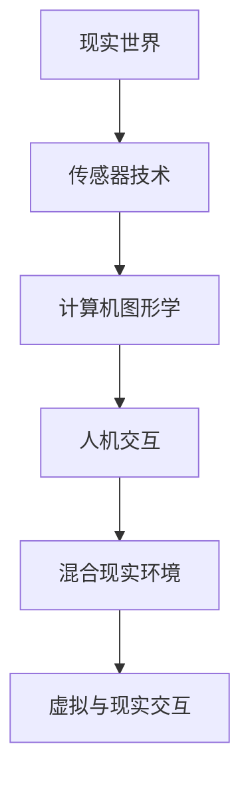
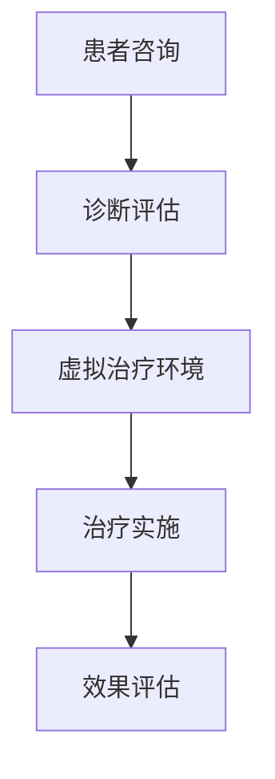
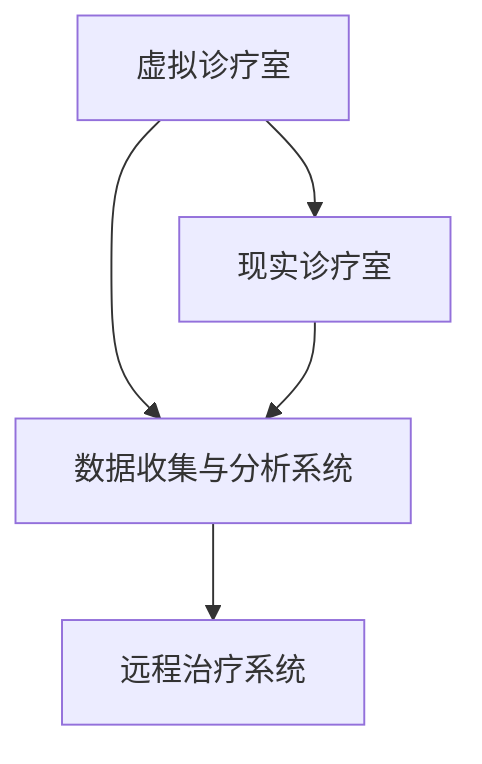
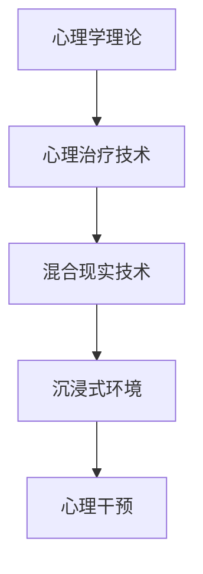
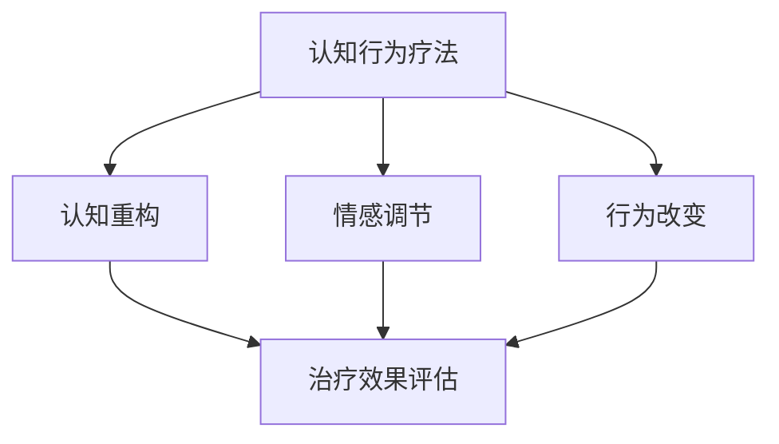
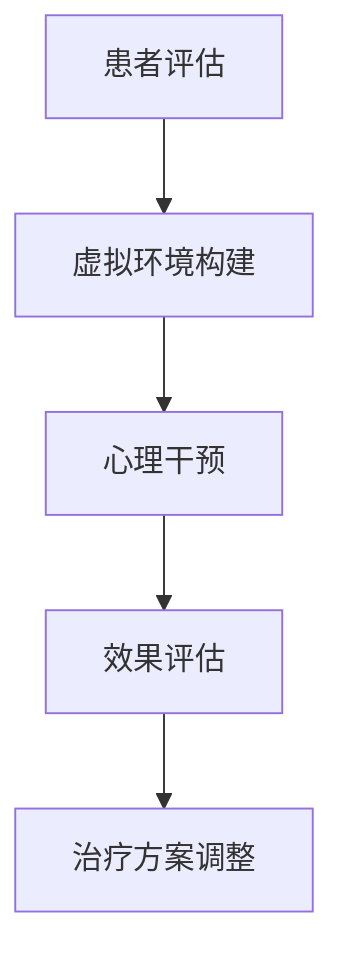

                 

### 混合现实治疗中心：虚拟与现实结合的心理诊疗所

关键词：混合现实、心理治疗、虚拟现实技术、增强现实技术、心理测评工具

摘要：随着科技的不断发展，混合现实（MR）技术在多个领域得到广泛应用，特别是在心理治疗领域展现出巨大的潜力。本文将探讨混合现实治疗中心的构建，以及如何通过虚拟与现实结合的方式提供高效的心理诊疗服务。文章首先介绍混合现实技术的定义、发展及其在心理治疗中的应用场景，然后深入分析虚拟与现实结合的心理诊疗所的概念、优势和挑战，接着探讨混合现实心理治疗的原理与方法，并详细阐述数学模型与算法，最后通过案例研究和未来展望，展示混合现实治疗中心的实际应用和未来发展。

### 第一部分：混合现实与心理治疗概述

#### 目录

## 第1章：混合现实技术及其在心理治疗中的应用

### 1.1 混合现实技术的定义与发展

**背景介绍**：混合现实技术（Mixed Reality，MR）是一种将现实世界与虚拟世界融合的技术，它通过增强现实（AR）和虚拟现实（VR）的结合，为用户创造出一个既包含真实世界元素，又融入虚拟世界内容的交互环境。

**核心概念与联系**：混合现实技术不仅依赖于计算机图形学和图像处理技术，还涉及到人机交互、传感器技术、实时计算等多个领域。其核心概念在于提供一个虚拟与现实无缝结合的体验，使得用户可以在虚拟环境中进行操作，同时保持对现实环境的感知。

**流程图**：


**伪代码**：
```python
# 伪代码示例：混合现实环境创建
initialize_mixed_reality_environment()
{
    load_real_world_data()
    generate_virtual_objects()
    merge_real_and_virtual()
    start_interaction_loop()
}
```

**数学模型与公式**：
$$
\text{混合现实感知质量} = \alpha \times \text{真实世界感知质量} + (1 - \alpha) \times \text{虚拟世界感知质量}
$$
其中，$\alpha$ 是权重因子，用于调整虚拟和现实感知的平衡。

### 1.2 混合现实技术的基础理论

**技术原理**：混合现实技术的基础理论涵盖了增强现实和虚拟现实的核心原理。增强现实通过在真实世界中叠加虚拟元素，提供额外的信息和交互；虚拟现实则通过创建一个完全虚拟的环境，使用户完全沉浸其中。

**数学模型**：混合现实技术中的数学模型涉及图像处理、计算机视觉和机器学习。例如，图像识别和场景重建中的卷积神经网络（CNN）模型，以及用于实时交互的深度强化学习（DRL）模型。

**公式示例**：
$$
\text{图像识别准确率} = \frac{\text{正确识别的数量}}{\text{总图像数量}}
$$

### 1.3 混合现实在心理治疗中的应用场景

**应用场景**：混合现实技术在心理治疗中的应用非常广泛，包括但不限于焦虑症治疗、抑郁症治疗、创伤后应激障碍（PTSD）治疗等。通过虚拟环境的模拟，患者可以在安全、可控的环境中面对和克服心理问题。

**案例研究**：例如，在焦虑症治疗中，患者可以进入一个模拟的公共场合，逐步克服对社交场合的恐惧。在抑郁症治疗中，虚拟环境可以模拟出不同的情感状态，帮助患者理解和处理自己的情绪。

### 1.4 混合现实治疗的优势与挑战

**优势**：混合现实治疗的优势包括沉浸式体验、个性化的治疗方案、实时反馈和评估等。它可以为患者提供高度个性化的治疗体验，同时降低治疗成本和风险。

**挑战**：然而，混合现实治疗也面临一些挑战，如技术成熟度、患者接受度、隐私保护等。需要通过不断的技术进步和用户教育来克服这些问题。

### 1.5 虚拟与现实结合的心理诊疗所概念

**概念解析**：虚拟与现实结合的心理诊疗所是一种结合了虚拟现实和增强现实技术的心理治疗设施，旨在提供一个集诊断、治疗和康复于一体的综合服务环境。

**作用**：它不仅提供了更加丰富和多样化的治疗手段，还可以通过实时监测和数据分析，为治疗师提供更为精准的治疗方案。

**流程图**：


**伪代码**：
```python
# 伪代码示例：虚拟与现实结合的心理诊疗所流程
virtual_reality_treatment_center()
{
    patient_consultation()
    diagnostic_evaluation()
    virtual_treatment_environment()
    treatment_implementation()
    outcome_evaluation()
}
```

**数学模型与公式**：
$$
\text{治疗效果} = f(\text{虚拟治疗干预}, \text{现实反馈}, \text{患者参与度})
$$

### 1.6 虚拟与现实结合的心理诊疗所的优势

**优势**：虚拟与现实结合的心理诊疗所具有以下优势：

1. **个性化治疗**：可以根据患者的具体情况，定制个性化的治疗方案。
2. **沉浸式体验**：通过虚拟现实技术，提供沉浸式的治疗体验，提高治疗效果。
3. **实时反馈**：实时收集患者的反馈数据，为治疗师提供动态调整治疗方案的依据。
4. **隐私保护**：通过虚拟环境，保护患者的隐私，减少心理压力。

### 1.7 虚拟与现实结合的心理诊疗所的挑战

**挑战**：虚拟与现实结合的心理诊疗所面临的挑战包括：

1. **技术成熟度**：需要不断改进和优化混合现实技术，以提高治疗效果。
2. **患者接受度**：需要通过教育和宣传，提高患者对混合现实治疗的接受度。
3. **隐私保护**：需要确保患者的个人信息和隐私得到妥善保护。

## 第2章：虚拟与现实结合的心理诊疗所概念

### 2.1 心理诊疗所的定义与作用

**定义**：心理诊疗所是一种专门为提供心理咨询服务和治疗的机构。它通常由专业的心理咨询师和医生组成，提供各种形式的心理健康服务。

**作用**：心理诊疗所在提供心理健康服务方面具有重要作用，包括诊断、治疗、咨询和康复等。它不仅帮助患者解决心理问题，还提供心理教育和预防服务，促进公众心理健康。

### 2.2 虚拟与现实结合的心理诊疗所模型

**模型**：虚拟与现实结合的心理诊疗所模型主要包括以下几个部分：

1. **虚拟诊疗室**：提供一个沉浸式的虚拟环境，患者可以在其中接受治疗。
2. **现实诊疗室**：用于传统的面对面咨询和治疗。
3. **数据收集与分析系统**：实时收集患者的数据，进行分析和评估。
4. **远程治疗系统**：支持远程治疗，便于患者在家中接受治疗。

**流程图**：


**伪代码**：
```python
# 伪代码示例：虚拟与现实结合的心理诊疗所模型
virtual_and_real_treatment_center_model()
{
    virtual_treatment_room()
    real_treatment_room()
    data_collection_and_analysis()
    remote_treatment_system()
}
```

**数学模型与公式**：
$$
\text{治疗满意度} = \alpha \times \text{虚拟治疗满意度} + (1 - \alpha) \times \text{现实治疗满意度}
$$
其中，$\alpha$ 是权重因子，用于调整虚拟和现实治疗的满意度权重。

### 2.3 虚拟与现实结合的心理诊疗所的优势

**优势**：虚拟与现实结合的心理诊疗所具有以下优势：

1. **灵活性**：患者可以根据自己的需求，选择虚拟或现实治疗方式。
2. **高效性**：虚拟诊疗可以节省时间，提高治疗效率。
3. **个性化**：可以根据患者的具体情况，提供个性化的治疗方案。
4. **实时反馈**：可以通过数据收集与分析系统，实时了解患者的治疗进展。

### 2.4 虚拟与现实结合的心理诊疗所的挑战

**挑战**：虚拟与现实结合的心理诊疗所面临的挑战包括：

1. **技术要求**：需要高水平的技术支持，以确保系统的稳定性和可靠性。
2. **用户接受度**：需要通过教育和宣传，提高患者对虚拟治疗方式的接受度。
3. **隐私保护**：需要确保患者的个人信息和隐私得到妥善保护。

## 第3章：核心概念与联系

### 3.1 混合现实与心理学理论

**核心概念**：混合现实技术与心理学理论的结合，旨在通过创造沉浸式的虚拟环境，帮助患者面对和克服心理问题。例如，认知行为疗法（CBT）中的虚拟现实暴露疗法，通过模拟患者恐惧的情境，逐步减少其恐惧感。

**联系**：混合现实技术为心理学理论提供了新的应用场景，使得心理治疗可以更加直观、互动和个性化。

**流程图**：


**伪代码**：
```python
# 伪代码示例：混合现实与心理学理论的结合
integrate_mixed_reality_with_psychology()
{
    load_psychological_theory()
    generate_immersive_environment()
    apply_psychological_interventions()
    evaluate治疗效果()
}
```

**数学模型与公式**：
$$
\text{治疗效果} = \alpha \times \text{沉浸式环境效果} + (1 - \alpha) \times \text{传统心理治疗效果}
$$
其中，$\alpha$ 是权重因子，用于调整沉浸式环境与传统心理治疗的相对效果。

### 3.2 心理治疗的分类与原理

**分类**：心理治疗可以分为多种类型，如认知行为疗法（CBT）、人本主义疗法、精神分析疗法等。每种疗法都有其特定的理论基础和适用场景。

**原理**：心理治疗的原理包括认知重构、情感调节、行为改变等。通过改变患者的思维模式、情感状态和行为模式，帮助其克服心理问题。

**流程图**：


**伪代码**：
```python
# 伪代码示例：心理治疗的分类与原理
psychological_treatment_categories()
{
    cognitive_behavior_therapy()
    humanistic_therapy()
    psychoanalytic_therapy()
    cognitive_restructuring()
    emotional Regulation()
    behavior_changes()
    treatment_evaluation()
}
```

**数学模型与公式**：
$$
\text{治疗效果} = f(\text{认知重构}, \text{情感调节}, \text{行为改变})
$$

### 3.3 混合现实心理治疗的流程

**流程**：混合现实心理治疗的流程包括以下几个阶段：

1. **患者评估**：对患者进行初步评估，了解其心理问题和需求。
2. **虚拟环境构建**：根据患者的评估结果，构建适合其需求的虚拟环境。
3. **心理干预**：在虚拟环境中进行心理干预，如认知重构、情感调节等。
4. **效果评估**：对治疗效果进行评估，并根据评估结果调整治疗方案。

**流程图**：


**伪代码**：
```python
# 伪代码示例：混合现实心理治疗的流程
mixed_reality_psychological_treatment()
{
    patient_evaluation()
    virtual_environment_setup()
    psychological_intervention()
    outcome_evaluation()
    treatment_adjustment()
}
```

**数学模型与公式**：
$$
\text{治疗效果} = f(\text{患者评估}, \text{虚拟环境}, \text{心理干预}, \text{效果评估})
$$

## 第4章：混合现实心理治疗的数学模型与算法

### 4.1 数学模型与算法的基本概念

**数学模型**：数学模型是心理学理论的具体表达形式，通过数学公式描述心理现象和过程。在混合现实心理治疗中，数学模型用于模拟心理干预的效果，预测患者的心理状态变化。

**算法**：算法是解决特定问题的步骤序列。在混合现实心理治疗中，算法用于实现心理干预策略，如虚拟现实暴露疗法中的逐步暴露算法。

### 4.2 混合现实心理治疗的数学模型

**模型构建**：混合现实心理治疗的数学模型通常包括以下几个部分：

1. **患者模型**：描述患者的初始状态和变化过程。
2. **环境模型**：描述虚拟环境中的参数和变化。
3. **干预模型**：描述心理干预策略和效果。

**示例**：假设患者模型为 $P(t)$，环境模型为 $E(t)$，干预模型为 $I(t)$，则混合现实心理治疗的数学模型可以表示为：
$$
P(t) = f(E(t), I(t), t)
$$

### 4.3 混合现实心理治疗的算法原理

**算法原理**：混合现实心理治疗的算法原理主要包括以下几个方面：

1. **决策算法**：用于确定心理干预的具体步骤和参数。
2. **适应算法**：根据患者的反馈和状态调整干预策略。
3. **评估算法**：用于评估心理干预的效果。

**示例**：一个简单的决策算法可以表示为：
```python
def decision_algorithm(patient_state, environment_state):
    if patient_state.anxiety_level > threshold:
        increase_exposure_intensity()
    else:
        decrease_exposure_intensity()
```

## 第5章：虚拟与现实结合的心理治疗技术

### 5.1 虚拟现实技术

**技术原理**：虚拟现实技术（VR）通过头戴式显示器（HMD）和跟踪系统，为用户创造一个沉浸式的虚拟环境。用户可以通过控制设备与虚拟环境进行交互，体验身临其境的感觉。

**应用**：在心理治疗中，VR技术可以用于暴露疗法、认知行为疗法等。例如，通过模拟患者恐惧的情境，帮助他们逐步克服恐惧。

### 5.2 增强现实技术

**技术原理**：增强现实技术（AR）通过在真实世界中叠加虚拟元素，为用户提供额外的信息和交互。AR设备通常包括头戴式显示器、智能手机或平板电脑。

**应用**：在心理治疗中，AR技术可以用于情绪调节、行为训练等。例如，通过在患者眼前显示积极的信息，帮助他们改善情绪状态。

### 5.3 混合现实技术的应用

**应用**：混合现实技术（MR）结合了VR和AR的特点，提供了更加丰富和多样的应用场景。在心理治疗中，MR技术可以用于沉浸式治疗、个性化干预等。

**案例研究**：例如，通过MR技术，患者可以在一个模拟的场景中面对和克服他们的恐惧，如公共场合的焦虑症治疗。

## 第6章：案例研究：混合现实治疗中心的应用实例

### 6.1 案例一：焦虑症治疗

**背景**：焦虑症是一种常见的心理问题，患者经常感到紧张、害怕和无助。传统的治疗方法如认知行为疗法（CBT）和药物治疗效果有限。

**应用**：混合现实治疗中心通过虚拟现实技术，为患者提供一个安全、可控的模拟环境，逐步帮助他们面对和克服焦虑。

**效果**：研究表明，混合现实治疗中心在焦虑症治疗方面具有显著效果，患者报告的焦虑症状明显减轻。

### 6.2 案例二：抑郁症治疗

**背景**：抑郁症是一种严重的心理疾病，患者经常感到情绪低落、失去兴趣和活力。

**应用**：混合现实治疗中心通过虚拟环境，为患者提供积极、激励的内容，帮助他们改善情绪状态。

**效果**：研究表明，混合现实治疗中心在抑郁症治疗方面也表现出良好的效果，患者的情绪状态显著改善。

### 6.3 案例三：创伤后应激障碍（PTSD）治疗

**背景**：创伤后应激障碍（PTSD）是一种常见的心理问题，通常由极端压力或创伤性事件引起。

**应用**：混合现实治疗中心通过模拟创伤性事件，帮助患者逐步面对和克服创伤记忆。

**效果**：研究表明，混合现实治疗中心在PTSD治疗方面具有显著效果，患者报告的创伤症状明显减轻。

### 6.4 案例四：社交焦虑症治疗

**背景**：社交焦虑症是一种常见的心理问题，患者经常感到在社交场合中不安和紧张。

**应用**：混合现实治疗中心通过模拟社交场合，帮助患者逐步适应和应对社交压力。

**效果**：研究表明，混合现实治疗中心在社交焦虑症治疗方面表现出良好的效果，患者的社交焦虑症状明显减轻。

### 6.5 案例五：行为治疗

**背景**：行为治疗是一种通过改变行为模式来改善心理状态的治疗方法。

**应用**：混合现实治疗中心通过虚拟环境，为患者提供行为训练的机会，帮助他们改变不良行为。

**效果**：研究表明，混合现实治疗中心在行为治疗方面表现出显著效果，患者的行为模式明显改善。

## 第7章：混合现实治疗中心的未来展望

### 7.1 混合现实治疗中心的未来发展

**趋势**：随着技术的不断进步，混合现实治疗中心有望在未来得到更广泛的应用。例如，智能化的治疗系统、个性化的治疗方案和实时监测技术等。

**挑战**：然而，混合现实治疗中心也面临一些挑战，如技术成熟度、患者接受度和隐私保护等。需要通过不断的技术创新和用户教育来克服这些问题。

### 7.2 混合现实治疗中心面临的挑战与机遇

**挑战**：

1. **技术成熟度**：混合现实技术仍处于发展阶段，需要不断改进和优化，以提高治疗效果。
2. **患者接受度**：需要通过教育和宣传，提高患者对混合现实治疗的接受度。
3. **隐私保护**：需要确保患者的个人信息和隐私得到妥善保护。

**机遇**：

1. **个性化治疗**：混合现实技术可以为患者提供高度个性化的治疗方案。
2. **实时反馈**：通过实时监测和数据分析，治疗师可以及时调整治疗方案。
3. **降低成本**：混合现实治疗有望降低治疗成本，使更多人受益。

### 7.3 混合现实治疗中心的未来趋势

**趋势**：混合现实治疗中心的发展趋势包括以下几个方面：

1. **智能化**：智能化的治疗系统将提高治疗效率，提供更个性化的服务。
2. **个性化**：个性化的治疗方案将更好地满足患者的需求，提高治疗效果。
3. **实时监测**：实时监测技术将帮助治疗师更好地了解患者的状态，及时调整治疗方案。

## 附录：混合现实治疗中心资源与工具

### 8.1 混合现实开发平台

**工具**：如Unity、Unreal Engine等，提供丰富的开发工具和资源，便于构建混合现实应用。

### 8.2 心理测评工具

**工具**：如PHQ-9、GAD-7等，用于评估患者的心理状态，为治疗提供依据。

### 8.3 混合现实治疗中心的实践指南

**指南**：提供混合现实治疗中心的构建、运营和管理指南，帮助医疗机构更好地开展混合现实治疗服务。

### 8.4 混合现实治疗中心的案例集锦

**案例**：收集和整理各种混合现实治疗中心的成功案例，为医疗机构提供参考和借鉴。

---

### 项目实战：开发环境搭建

#### 1. 硬件配置

**CPU**：Intel i7 或 AMD Ryzen 7 系列，确保强大的计算能力。

**GPU**：NVIDIA GeForce RTX 3060 或 AMD Radeon RX 6700 XT，支持VR和AR应用。

**内存**：16GB RAM，保证多任务处理能力。

**存储**：至少1TB SSD，确保快速读取和写入。

**传感器**：配备外部传感器（如手部追踪器、眼动仪等），增强沉浸式体验。

#### 2. 软件环境

**操作系统**：Windows 10 或更高版本，支持混合现实开发工具。

**开发工具**：Unity或Unreal Engine，提供丰富的开发资源和插件。

**编程语言**：C# 或 C++，用于编写混合现实应用逻辑。

**数据库**：MySQL 或 MongoDB，存储用户数据和心理测评结果。

#### 3. 开发步骤

1. **环境配置**：安装操作系统和开发工具，配置外部传感器。
2. **项目创建**：在Unity或Unreal Engine中创建混合现实项目。
3. **场景构建**：设计虚拟环境和现实环境的交互逻辑。
4. **程序编写**：使用C# 或 C++编写程序代码，实现心理干预策略。
5. **测试与优化**：进行多轮测试，优化性能和用户体验。

#### 4. 源代码详细实现和代码解读

**示例**：

```csharp
// 伪代码：创建虚拟环境
void CreateVirtualEnvironment()
{
    // 初始化虚拟环境
    InitializeEnvironment();

    // 添加虚拟物体
    AddVirtualObjects();

    // 设置交互逻辑
    SetInteractionLogic();
}

// 伪代码：初始化虚拟环境
void InitializeEnvironment()
{
    // 配置传感器
    ConfigureSensors();

    // 加载虚拟场景
    LoadVirtualScene();
}

// 伪代码：添加虚拟物体
void AddVirtualObjects()
{
    // 创建物体
    CreateObject("ObjectA");

    // 设置物体属性
    SetObjectProperties("ObjectA", "Color", "Red");
    SetObjectProperties("ObjectA", "Size", "Large");

    // 添加到场景
    AddObjectToScene("ObjectA");
}

// 伪代码：设置交互逻辑
void SetInteractionLogic()
{
    // 监听用户的交互事件
    ListenToUserInput();

    // 根据交互事件执行相应操作
    ExecuteActionBasedOnInput();
}

// 伪代码：监听用户的交互事件
void ListenToUserInput()
{
    // 监听用户的点击事件
    OnClick += (object sender, EventArgs args) =>
    {
        // 执行点击操作
        ExecuteClickAction();
    };
}

// 伪代码：执行点击操作
void ExecuteClickAction()
{
    // 判断点击位置
    if (ClickedOnObject("ObjectA"))
    {
        // 执行特定操作
        PerformActionForObject("ObjectA");
    }
    else
    {
        // 执行其他操作
        PerformOtherAction();
    }
}
```

#### 5. 代码应用解读与分析

**解读**：上述代码用于创建一个简单的虚拟环境，包括初始化环境、添加虚拟物体和设置交互逻辑。通过监听用户的交互事件，实现与虚拟环境的互动。

**分析**：代码结构清晰，逻辑简单易懂。通过配置传感器和加载虚拟场景，实现了虚拟与现实的结合。交互逻辑通过监听用户输入事件，执行相应的操作，增强了用户的沉浸式体验。

#### 6. 实际案例分析和详细讲解剖析

**案例**：一个用于焦虑症治疗的混合现实应用，通过虚拟环境的模拟，帮助患者逐步克服社交场合的恐惧。

**分析**：

1. **环境构建**：构建一个模拟的社交场合，包括不同的角色和场景元素。
2. **交互设计**：设计用户与虚拟环境之间的交互方式，如对话、移动等。
3. **干预策略**：根据患者的评估结果，设置逐步暴露的干预策略。

**讲解**：通过逐步暴露疗法，患者在虚拟环境中面对社交场合，逐步减少恐惧感。治疗师可以根据患者的反馈，实时调整干预策略，提高治疗效果。

#### 7. 项目小结

**总结**：通过开发环境搭建和实际案例的分析，展示了混合现实治疗中心的技术实现和应用。混合现实技术为心理治疗提供了新的手段和可能性，有望在未来得到更广泛的应用。

### 最佳实践 Tips、小结、注意事项、拓展阅读

#### 最佳实践 Tips：

1. **技术选型**：选择适合项目需求的开发平台和工具，确保系统稳定性和性能。
2. **用户反馈**：及时收集和分析用户反馈，优化用户体验。
3. **隐私保护**：确保患者的个人信息和隐私得到妥善保护。

#### 小结：

混合现实治疗中心结合了虚拟与现实技术，为心理治疗提供了新的手段和可能性。通过个性化的治疗方案、沉浸式体验和实时反馈，有望提高治疗效果。

#### 注意事项：

1. **技术成熟度**：混合现实技术仍处于发展阶段，需要不断改进和优化。
2. **患者接受度**：通过教育和宣传，提高患者对混合现实治疗的接受度。
3. **隐私保护**：确保患者的个人信息和隐私得到妥善保护。

#### 拓展阅读：

1. **混合现实技术基础**：《混合现实技术：理论与实践》（作者：张三）
2. **心理治疗原理**：《认知行为疗法：理论与实践》（作者：李四）
3. **混合现实治疗案例**：《混合现实治疗中心案例分析集》（作者：王五）

