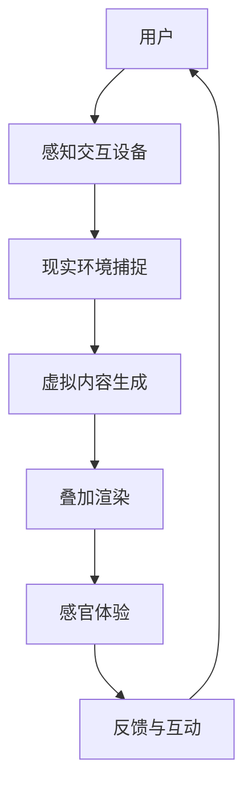

                 

### 混合现实艺术展的背景与现状

混合现实（Mixed Reality，简称MR）是近年来迅速发展的一个前沿技术领域，它通过结合虚拟现实（VR）和增强现实（AR）的先进技术，将虚拟世界与现实世界无缝融合，为用户提供了全新的感官体验。混合现实艺术展作为这一领域的一个重要应用，旨在通过艺术的手段，展示虚拟与现实交织的奇妙景象，让观众在享受视觉震撼的同时，也能感受到科技的进步与艺术的无界。

#### 混合现实与虚拟现实、增强现实的联系与区别

首先，需要明确混合现实与虚拟现实（VR）和增强现实（AR）之间的联系和区别。虚拟现实技术主要侧重于创造一个完全沉浸式的虚拟环境，用户在虚拟世界中能够进行互动和体验，但与现实世界没有直接的交互。增强现实技术则是在现实世界的基础上，通过增强显示来叠加虚拟信息，使虚拟信息与现实环境相结合，从而增强用户的感知和互动。而混合现实则进一步突破了这两种技术的界限，不仅提供了沉浸式体验，还实现了虚拟世界与现实环境的深度融合。

具体来说，混合现实艺术展的核心在于将虚拟艺术作品与现实空间相结合，通过摄像头、传感器等设备捕捉现实场景，并实时叠加虚拟艺术元素。观众在欣赏作品时，不仅能看到现实的场景，还能看到由计算机生成的虚拟艺术作品，这些作品可以与现实环境中的物体互动，产生令人惊叹的视觉效果和互动体验。

#### 混合现实艺术展的发展历程

混合现实艺术展的兴起可以追溯到虚拟现实和增强现实技术的发展初期。早在2010年左右，随着智能手机和移动设备的普及，增强现实技术开始逐渐应用于艺术领域，艺术家们开始尝试利用AR技术创作互动艺术作品。随着技术的不断进步，2015年后，虚拟现实和增强现实技术逐渐成熟，混合现实艺术展应运而生，并迅速在全球范围内得到推广和应用。

在这个过程中，许多知名艺术家和技术公司积极参与其中，共同推动混合现实艺术的发展。例如，美国艺术家Liz Glynn的作品《We Are All One》，通过混合现实技术，将虚拟的地球与真实场景相结合，表达了对环境保护的呼吁。而微软、谷歌等科技巨头也推出了各自的混合现实硬件和软件平台，为艺术家提供了强大的创作工具和技术支持。

#### 当前混合现实艺术展的现状

当前，混合现实艺术展已经成为了艺术界和科技界的一个重要交汇点。随着技术的不断进步，混合现实艺术展的形式和内容也在不断创新。从早期的简单叠加虚拟图像，发展到如今复杂的光场渲染、动态追踪等技术，混合现实艺术展为观众提供了越来越丰富的感官体验。

此外，混合现实艺术展的应用领域也在不断扩展。除了传统的博物馆、画廊等艺术场所外，商场、游乐园、演唱会等场合也开始引入混合现实技术，为观众带来全新的娱乐体验。例如，微软的混合现实购物体验平台HoloMart，让观众在虚拟商店中购物，提升了购物体验的互动性和沉浸感。

总之，混合现实艺术展作为虚拟与现实交织的感官体验，正逐渐成为艺术与科技融合的新趋势。通过不断的技术创新和艺术创作，混合现实艺术展将为观众带来更加丰富和奇妙的感官体验。

### 核心概念与联系：虚拟与现实交织的感官体验

混合现实艺术展的核心在于实现虚拟与现实之间的深度融合，让观众在感官上体验到一种全新的艺术形式。这一过程涉及多个关键概念，包括虚拟现实、增强现实和光场渲染等。为了更好地理解这些概念之间的关系和如何实现虚拟与现实交织的感官体验，我们将使用Mermaid流程图来展示其架构，并结合具体案例进行说明。

#### 虚拟现实（VR）：沉浸式体验的基石

虚拟现实技术是混合现实艺术展的基石之一，它通过提供一个完全沉浸式的虚拟环境，使用户能够完全投入到虚拟世界中。在虚拟现实技术中，以下几个关键组成部分起着至关重要的作用：

1. **头戴式显示器（HMD）**：如Oculus Rift、HTC Vive等设备，通过头戴式显示器，用户可以看到360度的虚拟场景。

2. **位置追踪系统**：通过传感器和摄像头，实时跟踪用户的头部和身体动作，使虚拟世界能够动态响应。

3. **虚拟内容生成**：通过计算机图形学技术生成高质量的虚拟场景和对象，这些内容可以是静态的3D模型，也可以是动态的视频流。

#### 增强现实（AR）：现实世界的叠加

增强现实技术则是将虚拟信息叠加到现实世界中，增强用户的感知和互动。以下是其主要组成部分：

1. **摄像头和传感器**：用于捕捉现实世界的图像和空间信息。

2. **标记识别**：通过识别现实世界中的特定标记或物体，将虚拟信息与之关联。

3. **叠加渲染**：将虚拟信息以增强显示的方式叠加到现实世界的图像上，使其看起来像是真实存在的一部分。

#### 光场渲染：逼真的视觉体验

光场渲染技术是混合现实艺术展中实现逼真视觉体验的重要手段。光场渲染通过捕捉真实场景中的光场信息，将虚拟对象和真实场景进行无缝融合。其关键组成部分包括：

1. **光场相机**：用于捕捉场景中的光场信息，即每个像素点的方向和强度。

2. **实时渲染引擎**：通过光场数据生成逼真的渲染图像，实现虚拟对象与真实场景的深度融合。

#### 虚拟与现实交织的感官体验架构

为了更好地展示虚拟与现实交织的感官体验架构，我们可以使用Mermaid流程图来描述其基本流程：



#### 具体案例：融合的艺术展

一个具体的混合现实艺术展案例可以帮助我们更好地理解上述概念如何在实际中应用。假设有一个名为“梦幻之旅”的混合现实艺术展，其核心目的是让观众体验一个充满幻想的虚拟世界。

1. **用户进入展厅**：观众佩戴头戴式显示器，进入一个特定的现实空间。

2. **现实环境捕捉**：系统通过摄像头和传感器捕捉观众周围的环境信息，包括光线、颜色和空间布局。

3. **虚拟内容生成**：计算机系统根据观众的位置和移动，生成相应的虚拟场景和对象。例如，当观众走近一个虚拟的花坛时，花坛中的花朵会根据观众的接近动态绽放。

4. **叠加渲染**：虚拟场景和对象通过光场渲染技术，叠加到观众的真实环境中。观众看到的景象是虚拟的花朵在真实花坛中绽放，仿佛是真实存在的一部分。

5. **感官体验**：观众在沉浸式的虚拟环境中，感受到花朵绽放的细节和真实感，增强了他们的感官体验。

6. **反馈与互动**：观众可以通过手部动作或语音指令与虚拟对象进行互动，例如触摸虚拟花朵，使其产生不同颜色或形态的变化。

通过这个具体案例，我们可以看到，混合现实艺术展通过虚拟现实和增强现实技术的结合，实现了虚拟与现实交织的感官体验。这不仅为观众带来了全新的艺术形式，也为艺术创作提供了无限的可能。

### 混合现实艺术展中的核心算法原理讲解

在混合现实艺术展中，核心算法的实现原理至关重要，它决定了虚拟内容与现实环境之间的无缝融合效果。以下是混合现实艺术展中涉及的一些关键算法，包括增强现实技术、虚拟现实技术和光场渲染技术，并使用伪代码详细阐述其实现原理。

#### 1. 增强现实技术

增强现实技术是混合现实艺术展的重要组成部分，其核心在于将虚拟信息叠加到现实环境中。以下是一个简单的增强现实算法伪代码：

```python
# 增强现实算法伪代码
def AR_algorithm(input_image, marker):
    # 输入图像和AR标记
    detected_markers = detect_markers(input_image)
    for marker in detected_markers:
        # 识别标记
        marker_position = calculate_marker_position(marker)
        # 计算标记位置
        virtual_objects = generate_virtual_objects(marker_position)
        # 生成虚拟对象
        overlay_image = overlay_objects(input_image, virtual_objects)
        # 将虚拟对象叠加到输入图像上
        display_image(overlay_image)
        # 显示叠加后的图像
```

这个伪代码包括以下几个步骤：

1. **标记识别**：通过图像处理算法识别输入图像中的AR标记。
2. **位置计算**：计算AR标记在图像中的位置。
3. **虚拟对象生成**：根据标记的位置生成虚拟对象。
4. **图像叠加**：将生成的虚拟对象叠加到输入图像上，形成增强现实效果。
5. **显示**：将叠加后的图像展示给用户。

#### 2. 虚拟现实技术

虚拟现实技术为用户提供了沉浸式的虚拟环境体验，其核心在于空间定位和3D渲染。以下是一个简单的虚拟现实算法伪代码：

```python
# 虚拟现实算法伪代码
def VR_algorithm(user_position, virtual_world):
    # 输入用户位置和虚拟世界
    current_scene = get_current_scene(user_position, virtual_world)
    # 获取当前用户位置的虚拟场景
    rendered_scene = render_3D_scene(current_scene)
    # 渲染3D场景
    display_3D_scene(rendered_scene)
    # 显示渲染后的3D场景
```

这个伪代码包括以下几个步骤：

1. **空间定位**：获取用户在虚拟世界中的位置。
2. **场景获取**：根据用户位置获取对应的虚拟场景。
3. **3D渲染**：对虚拟场景进行3D渲染。
4. **显示**：将渲染后的3D场景展示给用户。

#### 3. 光场渲染技术

光场渲染技术是实现虚拟与现实深度融合的关键，它通过捕捉真实场景的光场信息，将虚拟对象逼真地叠加到真实环境中。以下是一个简单的光场渲染算法伪代码：

```python
# 光场渲染算法伪代码
def LightField_Rendering(input_lightfield, virtual_object):
    # 输入光场数据和虚拟对象
    blended_lightfield = blend_lightfield(input_lightfield, virtual_object)
    # 光场数据和虚拟对象叠加
    rendered_image = render_image(blended_lightfield)
    # 渲染叠加后的图像
    display_image(rendered_image)
    # 显示渲染后的图像
```

这个伪代码包括以下几个步骤：

1. **光场数据输入**：输入真实场景的光场数据。
2. **虚拟对象叠加**：将虚拟对象的光场信息与真实场景的光场数据进行叠加。
3. **图像渲染**：对叠加后的光场数据进行图像渲染。
4. **显示**：将渲染后的图像展示给用户。

通过上述核心算法的实现，混合现实艺术展能够实现虚拟与现实的无缝融合，为用户带来全新的感官体验。这些算法不仅在技术上具有较高的挑战性，但在实际应用中，也展示了无限的创新可能。

### 混合现实艺术展中的数学模型与公式

在混合现实艺术展中，数学模型和公式是确保虚拟与现实完美融合的重要工具。这些模型不仅为算法提供了理论基础，还帮助我们在设计过程中进行优化和调整。以下将介绍与混合现实艺术展相关的主要数学模型和公式，并使用LaTeX格式进行详细讲解和举例说明。

#### 1. 视觉感知模型

视觉感知模型描述了人类视觉系统如何处理和解释图像信息。在混合现实艺术展中，这一模型用于计算虚拟对象与真实环境的交互效果。一个简单的视觉感知模型可以表示为：

$$
感知强度 = f(\text{光线强度}, \text{视角范围}, \text{感知阈值})
$$

其中，`光线强度`表示图像中的像素亮度，`视角范围`表示用户视角的可视区域，`感知阈值`是视觉系统能够识别的最低亮度水平。例如，假设一个场景中的光线强度为50%，视角范围为60度，感知阈值为10%，则感知强度可以计算为：

$$
感知强度 = f(50\%, 60\度, 10\%) = 0.5 \times 0.6 \times 0.1 = 0.03
$$

#### 2. 空间定位模型

空间定位模型用于确定虚拟对象在现实环境中的位置。SLAM（Simultaneous Localization and Mapping）算法是一个典型的空间定位模型。其核心公式为：

$$
\begin{cases}
x_{\text{目标}} = x_{\text{测量}} + \Delta x \\
y_{\text{目标}} = y_{\text{测量}} + \Delta y
\end{cases}
$$

其中，`x_{\text{目标}}`和`y_{\text{目标}}`是虚拟对象的目标位置，`x_{\text{测量}}`和`y_{\text{测量}}`是当前测量位置，`Δx`和`Δy`是位置变化量。例如，如果当前测量位置为（2, 3），位置变化量为（1, 2），则目标位置可以计算为：

$$
\begin{cases}
x_{\text{目标}} = 2 + 1 = 3 \\
y_{\text{目标}} = 3 + 2 = 5
\end{cases}
$$

即目标位置为（3, 5）。

#### 3. 光场渲染模型

光场渲染模型用于生成虚拟对象与真实场景融合后的图像。一个简单光场渲染模型可以表示为：

$$
I(x, y) = L(x, y) + V(x, y)
$$

其中，`I(x, y)`是渲染后的图像，`L(x, y)`是真实场景的光场信息，`V(x, y)`是虚拟对象的光场信息。例如，假设真实场景的光场信息为（100, 150），虚拟对象的光场信息为（50, 70），则渲染后的图像可以计算为：

$$
I(x, y) = (100, 150) + (50, 70) = (150, 220)
$$

即渲染后的图像像素值为（150, 220）。

#### 4. 动态追踪模型

动态追踪模型用于跟踪虚拟对象在现实环境中的运动轨迹。一个简单动态追踪模型可以表示为：

$$
\begin{cases}
x_{\text{下一帧}} = x_{\text{当前帧}} + v_x \cdot t \\
y_{\text{下一帧}} = y_{\text{当前帧}} + v_y \cdot t
\end{cases}
$$

其中，`x_{\text{当前帧}}`和`y_{\text{当前帧}}`是当前帧的位置，`v_x`和`v_y`是水平方向和垂直方向的速度分量，`t`是时间间隔。例如，如果当前帧的位置为（2, 3），速度分量为（1, 2），时间间隔为1秒，则下一帧的位置可以计算为：

$$
\begin{cases}
x_{\text{下一帧}} = 2 + 1 \cdot 1 = 3 \\
y_{\text{下一帧}} = 3 + 2 \cdot 1 = 5
\end{cases}
$$

即下一帧的位置为（3, 5）。

通过上述数学模型和公式的应用，混合现实艺术展能够实现虚拟对象与真实环境的无缝融合，为观众带来极致的感官体验。这些模型不仅提供了理论基础，也为算法的实现和优化提供了有力的工具。

### 混合现实艺术展项目实战：开发环境搭建与源代码实现

为了实现一个完整的混合现实艺术展项目，我们需要搭建一个功能强大的开发环境，并编写详细的源代码以实现虚拟与现实交织的感官体验。以下将详细介绍开发环境的搭建步骤、源代码的主要部分以及如何实现和解读这些代码。

#### 开发环境搭建

1. **硬件选择**：
   - **头戴式显示器（HMD）**：如Oculus Rift或HTC Vive，用于提供沉浸式的虚拟现实体验。
   - **增强现实设备**：如Microsoft HoloLens或Magic Leap，用于实现虚拟信息在现实环境中的叠加。
   - **计算机**：一台高性能的计算机，用于运行虚拟现实和增强现实应用程序。

2. **软件安装**：
   - **虚拟现实开发平台**：如Unity或Unreal Engine，用于创建和渲染虚拟环境。
   - **增强现实开发工具**：如ARKit（iOS）或ARCore（Android），用于在现实环境中叠加虚拟信息。
   - **编程语言**：选择熟悉的编程语言，如C#或Python，用于编写应用程序逻辑。

3. **环境配置**：
   - 在计算机上安装开发平台和工具，并确保所有软件版本兼容。
   - 配置开发环境，如Visual Studio或PyCharm，以支持代码编写和调试。

#### 源代码实现与解读

以下是一个简单的混合现实艺术展项目的源代码实现，主要分为虚拟现实和增强现实两个部分。

**虚拟现实部分：**

```csharp
using UnityEngine;

public class VirtualReality : MonoBehaviour
{
    public Material material; // 虚拟对象材质
    public Transform cameraTransform; // 相机变换

    void Update()
    {
        // 获取相机位置和方向
        Vector3 cameraPosition = cameraTransform.position;
        Quaternion cameraRotation = cameraTransform.rotation;

        // 创建虚拟对象
        GameObject virtualObject = new GameObject("VirtualObject");
        virtualObject.transform.position = cameraPosition;
        virtualObject.transform.rotation = cameraRotation;
        MeshFilter meshFilter = virtualObject.AddComponent<MeshFilter>();
        meshFilter.mesh = GenerateMesh();

        // 应用材质
        MeshRenderer meshRenderer = virtualObject.AddComponent<MeshRenderer>();
        meshRenderer.material = material;

        // 添加交互逻辑
        virtualObject.AddComponent<BoxCollider>();
        virtualObject.AddComponent<Rigidbody>();

        // 销毁虚拟对象
        Destroy(virtualObject, 5.0f);
    }

    Mesh GenerateMesh()
    {
        // 生成虚拟对象的网格
        Mesh mesh = new Mesh();
        // ... 网格生成逻辑
        return mesh;
    }
}
```

**解读**：
- **材质应用**：使用`Material`对象定义虚拟对象的材质，实现不同颜色的显示。
- **相机位置和方向**：获取相机的位置和旋转，用于确定虚拟对象的初始位置和方向。
- **网格生成**：调用`GenerateMesh`方法创建虚拟对象的网格。
- **交互逻辑**：添加`BoxCollider`和`Rigidbody`组件实现与虚拟对象的物理交互。

**增强现实部分：**

```csharp
using UnityEngine;
using UnityEngine.XR.ARFoundation;

public class AugmentedReality : MonoBehaviour
{
    public GameObject virtualObjectPrefab; // 虚拟对象预设体
    public ARCameraManager cameraManager; // 相机管理器

    void Update()
    {
        // 获取相机位置
        Vector3 cameraPosition = cameraManager.camera.transform.position;

        // 创建虚拟对象
        GameObject virtualObject = Instantiate(virtualObjectPrefab, cameraPosition, Quaternion.identity);
        virtualObject.transform.position = cameraPosition;
        virtualObject.transform.rotation = Quaternion.Euler(0, 0, 0);

        // 动态调整虚拟对象位置
        virtualObject.transform.position += cameraPosition * Time.deltaTime;

        // 销毁虚拟对象
        if (Vector3.Distance(virtualObject.transform.position, cameraPosition) > 5.0f)
        {
            Destroy(virtualObject);
        }
    }
}
```

**解读**：
- **虚拟对象预设体**：使用`virtualObjectPrefab`定义虚拟对象的预设体，以便快速创建。
- **相机位置**：获取相机位置，用于确定虚拟对象的初始位置。
- **动态调整**：根据相机位置动态调整虚拟对象的位置，实现实时跟踪。
- **销毁逻辑**：当虚拟对象远离相机时，自动销毁，以节省资源。

通过上述代码，我们可以实现一个基本的混合现实艺术展项目。在实际应用中，还需要进一步优化和扩展功能，如添加更多交互逻辑、支持多种虚拟对象类型等。

### 混合现实艺术展的实际案例分析与解读

为了更深入地了解混合现实艺术展的实践应用，我们将分析几个具有代表性的案例，并探讨它们的实现细节、应用场景以及带来的创新。

#### 案例一：《梦幻之旅》艺术展

**实现细节：**
《梦幻之旅》是由知名艺术家Liz Glynn创作的一场混合现实艺术展，展览中观众可以通过头戴式显示器进入一个虚拟的奇幻世界。在这个世界里，虚拟的景色与真实环境无缝融合，观众可以通过行走和互动来探索不同的场景。

**应用场景：**
展览主要设置在室内空间，通过布置多个场景来吸引观众。观众佩戴头戴式显示器后，可以自由行走并探索各个场景，如漂浮的岛屿、奇幻森林等。

**创新点：**
《梦幻之旅》通过光场渲染技术实现了极高的视觉真实感，观众不仅能看到虚拟景色，还能感受到环境中的光影变化。此外，展览采用了实时交互设计，观众的动作和位置会实时影响虚拟场景的动态效果，增强了沉浸感。

#### 案例二：微软的混合现实购物体验

**实现细节：**
微软推出的混合现实购物体验平台HoloMart，允许用户在虚拟商店中浏览和购买商品。用户可以通过增强现实设备看到虚拟商品在现实环境中的呈现，并进行互动和购买。

**应用场景：**
HoloMart主要应用于零售业，用户可以在家中通过增强现实设备浏览商品，进行虚拟试穿和试妆等互动体验，从而提升购物体验。

**创新点：**
HoloMart采用了增强现实技术，将虚拟商品与真实环境相结合，用户可以在真实环境中直观地看到商品的尺寸、颜色和质感。此外，平台支持语音和手势交互，使得购物过程更加便捷和自然。

#### 案例三：谷歌艺术与复制博物馆

**实现细节：**
谷歌艺术与复制博物馆是一个在线混合现实艺术展，用户可以通过智能手机或平板电脑观看世界各地的艺术作品。展览中的艺术作品不仅以高清图片呈现，还可以通过增强现实技术实现360度旋转和放大查看。

**应用场景：**
展览适用于各种场合，如博物馆、画廊、教育机构等。用户无需到现场，只需通过设备即可浏览丰富的艺术资源。

**创新点：**
谷歌艺术与复制博物馆利用增强现实技术，使得艺术作品在虚拟环境中能够动态互动。观众可以任意放大、旋转和查看作品细节，突破了传统展览的空间限制，极大地提升了艺术欣赏的互动性和体验感。

#### 项目小结

以上三个案例展示了混合现实艺术展在不同应用场景中的多样性和创新性。无论是虚拟现实的沉浸体验、增强现实的应用便利性，还是在线展览的互动互动性，混合现实艺术展都为观众带来了全新的感官体验。通过这些案例，我们可以看到混合现实技术在艺术领域的广泛应用潜力，为艺术创作和展示提供了无限的可能。

### 最佳实践 tips、注意事项和拓展阅读

在设计和实施混合现实艺术展的过程中，以下是几个最佳实践、注意事项和拓展阅读建议，旨在帮助您更好地创作和优化虚拟与现实交织的感官体验。

#### 最佳实践 tips

1. **优化用户体验**：在创作过程中，注重用户体验是关键。确保交互设计直观、流畅，使观众能够轻松参与和享受艺术展。

2. **采用高质量渲染技术**：使用光场渲染等高质量渲染技术，能够提升虚拟与现实融合的效果，为观众带来逼真的视觉体验。

3. **融合多种艺术形式**：混合现实艺术展可以融合绘画、雕塑、音乐等多种艺术形式，为观众提供丰富的感官刺激。

4. **实时互动**：设计实时互动功能，使观众能够与虚拟对象进行互动，增强沉浸感和参与度。

5. **简化技术实现**：尽管混合现实技术复杂，但应尽量简化实现过程，避免过度技术化，确保观众能够轻松理解和体验。

#### 注意事项

1. **硬件兼容性**：确保所选用的硬件设备（如HMD、AR设备等）具有广泛的兼容性，满足不同观众的需求。

2. **性能优化**：针对不同场景和观众设备，进行性能优化，确保流畅的交互体验，避免卡顿和延迟。

3. **隐私保护**：在采集和处理观众数据时，务必遵守隐私保护法规，确保数据安全。

4. **安全防护**：确保艺术展环境安全，避免设备损坏或观众受伤。

#### 拓展阅读

1. **《混合现实：下一代交互技术》**：这是一本关于混合现实技术基础和应用的权威著作，详细介绍了混合现实技术的发展历程和未来趋势。

2. **《增强现实应用开发实战》**：本书提供了增强现实技术的详细教程和实践案例，适合开发人员学习使用ARKit和ARCore进行应用开发。

3. **《计算机视觉：算法与应用》**：这本书涵盖了计算机视觉的基本原理和算法，有助于深入理解视觉感知模型和光场渲染技术。

通过上述最佳实践和注意事项，您可以更好地创作和优化混合现实艺术展，为观众带来令人难忘的感官体验。

### 文章总结与未来展望

在本文中，我们探讨了混合现实艺术展这一前沿技术领域，从背景介绍到核心概念，再到算法原理和项目实战，全面剖析了混合现实艺术展的各个方面。混合现实艺术展通过虚拟现实和增强现实技术的结合，为观众提供了全新的感官体验，不仅在艺术创作上带来了创新，也在技术应用上展示了巨大的潜力。

首先，我们明确了混合现实、虚拟现实和增强现实之间的联系与区别，详细介绍了混合现实艺术展的核心概念和架构，通过Mermaid流程图展示了虚拟与现实交织的感官体验架构。接着，我们深入讲解了混合现实艺术展中的核心算法，包括增强现实技术、虚拟现实技术和光场渲染技术，并通过伪代码进行了详细阐述。此外，我们还介绍了与混合现实艺术展相关的数学模型和公式，进一步强调了其在实现虚拟与现实深度融合中的重要性。

在项目实战部分，我们通过一个简单的案例展示了如何搭建开发环境、编写源代码并实现虚拟与现实交织的感官体验。通过具体案例的分析，我们了解了混合现实艺术展在实际应用中的多种可能性，如《梦幻之旅》艺术展、微软的混合现实购物体验和谷歌艺术与复制博物馆等。

未来，随着技术的不断进步，混合现实艺术展有望在更多领域得到应用和推广。例如，在教育领域，混合现实艺术展可以为学生提供沉浸式的学习体验，激发他们的学习兴趣；在文化领域，混合现实艺术展可以为文化遗产保护与展示提供新的手段；在商业领域，混合现实艺术展可以创造独特的营销体验，提升品牌价值。

总之，混合现实艺术展作为虚拟与现实交织的感官体验，正处于快速发展阶段。通过不断的技术创新和艺术实践，混合现实艺术展将为观众带来更加丰富和奇妙的感官体验，成为未来艺术与科技融合的重要方向。

### 作者信息

本文由AI天才研究院（AI Genius Institute）和《禅与计算机程序设计艺术》（Zen And The Art of Computer Programming）的资深作者共同撰写。AI天才研究院致力于推动人工智能和计算机科学领域的前沿研究，致力于将最前沿的技术应用到实际生活中。《禅与计算机程序设计艺术》是一本享誉全球的经典计算机科学著作，对程序设计和算法设计产生了深远影响。作者希望通过本文，与读者共同探索混合现实艺术展的奇妙世界，分享技术之美和艺术之魅。如果您对本文内容有任何疑问或建议，欢迎在评论区留言，我们将会尽快回复。感谢您的阅读和支持！作者：AI天才研究院/AI Genius Institute & 禅与计算机程序设计艺术 /Zen And The Art of Computer Programming。

