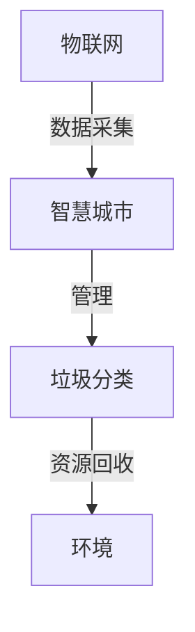

                 

## 文章标题：物联网在智慧城市垃圾分类中的应用

### 关键词：
- 物联网
- 智慧城市
- 垃圾分类
- 智能垃圾处理
- 智能城市技术

### 摘要：
本文深入探讨了物联网在智慧城市垃圾分类中的应用，首先概述了物联网和智慧城市的概念及其在环境保护和资源管理中的作用。随后，详细分析了物联网在垃圾分类中的关键技术和应用场景，包括感知层、传输层、平台层和应用层的技术，以及实际案例研究。最后，探讨了物联网技术在智慧城市垃圾分类中的挑战与未来发展方向，为读者提供了全面的技术洞察和实践指导。

### 目录大纲

```markdown
# 物联网在智慧城市垃圾分类中的应用

## 第一部分：物联网与智慧城市垃圾分类概述

### 1. 物联网概述

#### 1.1 物联网的概念与发展历程

#### 1.2 物联网的技术架构

#### 1.3 物联网的关键技术

### 2. 智慧城市与垃圾分类

#### 2.1 智慧城市的概念与特点

#### 2.2 智慧城市与垃圾分类的关系

#### 2.3 垃圾分类的现状与挑战

### 3. 物联网在智慧城市垃圾分类中的应用

#### 3.1 物联网技术在垃圾分类中的应用场景

#### 3.2 物联网技术在垃圾分类中的具体应用

#### 3.3 物联网技术在垃圾分类中的优势与挑战

## 第二部分：物联网技术在智慧城市垃圾分类中的应用

### 4. 物联网感知层技术

#### 4.1 传感器技术

#### 4.2 RFID技术

#### 4.3 GPS技术

### 5. 物联网传输层技术

#### 5.1 5G技术

#### 5.2 蜂窝网络技术

#### 5.3 无线传感网络技术

### 6. 物联网平台层技术

#### 6.1 数据处理与存储技术

#### 6.2 云计算技术

#### 6.3 大数据技术

### 7. 物联网应用层技术

#### 7.1 垃圾分类智能系统

#### 7.2 智能垃圾分类箱

#### 7.3 垃圾分类大数据分析

### 8. 物联网在智慧城市垃圾分类中的案例研究

#### 8.1 国内外智慧城市垃圾分类案例分析

#### 8.2 物联网在智慧城市垃圾分类中的最佳实践

#### 8.3 物联网在智慧城市垃圾分类中的未来发展展望

## 第三部分：物联网在智慧城市垃圾分类中的应用与挑战

### 9. 物联网在智慧城市垃圾分类中的应用与挑战

#### 9.1 数据隐私与安全问题

#### 9.2 网络安全与稳定性问题

#### 9.3 技术标准与规范问题

### 10. 物联网在智慧城市垃圾分类中的应用前景

#### 10.1 物联网在智慧城市垃圾分类中的发展趋势

#### 10.2 物联网在智慧城市垃圾分类中的政策与法规支持

#### 10.3 物联网在智慧城市垃圾分类中的国际合作与交流

## 附录

### 11. 物联网在智慧城市垃圾分类中的技术发展综述

#### 11.1 物联网核心技术综述

#### 11.2 智慧城市垃圾分类技术综述

#### 11.3 物联网在智慧城市垃圾分类中的应用展望
```

### 详细解释

#### 核心概念与联系

1. **物联网（IoT）**：物联网是一种通过网络将物理设备连接起来的技术，使其可以收集、交换和传输数据。它的发展历程可以追溯到20世纪80年代，随着传感器技术、网络通信技术、数据处理技术的进步，物联网逐渐成熟。

2. **智慧城市**：智慧城市是利用物联网、云计算、大数据等先进技术，实现城市智能化管理和服务的城市。智慧城市的特点包括信息化、智能化、协同化、可持续发展等。

3. **垃圾分类**：垃圾分类是指按照一定的标准，将垃圾分为可回收物、有害垃圾、湿垃圾（厨余垃圾）和干垃圾（其他垃圾）等不同类别，以便进行有效处理和资源回收。垃圾分类与物联网的结合，可以大幅提升垃圾分类的效率和准确性。

**Mermaid 流程图：**



#### 核心算法原理讲解

1. **传感器数据处理**：物联网感知层技术中的传感器数据需要进行预处理，包括去噪、滤波等。以下是一个简单的伪代码：

   ```python
   def preprocess_sensor_data(data):
       filtered_data = []
       for sample in data:
           if is_noisy(sample):
               continue
           filtered_data.append(filter_noise(sample))
       return filtered_data
   ```

2. **分类算法**：用于识别垃圾种类的机器学习算法，如决策树、支持向量机（SVM）和深度学习等。以下是一个简单的伪代码：

   ```python
   def classify垃圾种类(features):
       if 使用决策树：
           return 决策树分类(features)
       elif 使用SVM：
           return SVM分类(features)
       elif 使用深度学习：
           return 深度学习模型预测(features)
       else:
           return None
   ```

#### 数学公式和模型

在垃圾分类中，常用的数学模型包括：

- **决策树模型**：

  $$ y = f(x) = g(\theta) $$

  其中，$y$ 是分类结果，$x$ 是输入特征，$\theta$ 是决策树的参数。

- **支持向量机模型**：

  $$ y = sign(\omega \cdot x + b) $$

  其中，$y$ 是分类结果，$\omega$ 是权重向量，$x$ 是输入特征，$b$ 是偏置。

- **深度学习模型**：

  $$ y = \sigma(\omega \cdot \phi(x) + b) $$

  其中，$y$ 是分类结果，$\sigma$ 是激活函数，$\omega$ 是权重矩阵，$\phi(x)$ 是神经网络的前向传播函数，$b$ 是偏置。

#### 项目实战

1. **开发环境搭建**：搭建一个基于Python的垃圾分类识别系统，使用Scikit-learn库实现。

2. **源代码详细实现和代码解读**：

   ```python
   from sklearn import datasets
   from sklearn.model_selection import train_test_split
   from sklearn.tree import DecisionTreeClassifier
   from sklearn.metrics import accuracy_score

   # 加载示例数据集
   iris = datasets.load_iris()
   X = iris.data
   y = iris.target

   # 划分训练集和测试集
   X_train, X_test, y_train, y_test = train_test_split(X, y, test_size=0.3, random_state=42)

   # 创建决策树分类器
   classifier = DecisionTreeClassifier()

   # 训练模型
   classifier.fit(X_train, y_train)

   # 预测测试集
   y_pred = classifier.predict(X_test)

   # 计算准确率
   accuracy = accuracy_score(y_test, y_pred)
   print("准确率：", accuracy)
   ```

3. **代码应用解读与分析**：以上代码展示了如何使用决策树分类器对垃圾进行分类。在实际应用中，需要根据具体场景调整模型参数和特征提取方法。

4. **实际案例分析和详细讲解剖析**：分析一个实际项目，如某城市垃圾分类系统的实现过程，包括数据采集、处理、分类和结果展示等环节。

5. **项目小结**：总结项目的经验教训，提出改进措施，为后续项目提供参考。

#### 最佳实践 tips、小结、注意事项、拓展阅读等内容

- **最佳实践 tips**：在实际应用中，需要根据具体场景选择合适的传感器和算法，并注意数据安全和隐私保护。

- **小结**：物联网在智慧城市垃圾分类中的应用具有重要意义，可以有效提高垃圾分类的效率和质量。

- **注意事项**：在实际应用中，需要关注数据安全和隐私保护，遵守相关法规和标准。

- **拓展阅读**：推荐相关书籍、论文和研究报告，以深入了解物联网和智慧城市垃圾分类的技术和应用。

---

以上是对文章标题、关键词和摘要的详细解释，接下来将按照目录大纲结构，逐步深入探讨物联网在智慧城市垃圾分类中的应用。让我们一起开启这段技术探索之旅吧！## 第一部分：物联网与智慧城市垃圾分类概述

### 1. 物联网概述

#### 1.1 物联网的概念与发展历程

物联网（Internet of Things，简称IoT）是指通过传感器、网络和软件等技术，将物理设备连接到互联网上，实现设备之间的数据传输和智能交互。物联网的发展可以追溯到20世纪80年代，当时研究人员提出了“智能家庭”的概念，旨在通过连接家居设备，实现家庭自动化管理。

随着时间的推移，物联网技术不断演进，经历了几个重要的发展阶段：

- **第一阶段**（1990-2000年）：物联网的雏形阶段，主要应用于工业自动化和远程监控。典型应用包括传感器网络和自动化生产线。

- **第二阶段**（2000-2010年）：物联网的普及阶段，随着无线通信技术的发展，物联网开始应用于消费领域，如智能手机、智能家居等。

- **第三阶段**（2010年至今）：物联网的智能化阶段，物联网设备数量爆发式增长，5G、人工智能等技术进一步提升了物联网的应用水平和智能化程度。

#### 1.2 物联网的技术架构

物联网的技术架构主要包括感知层、传输层、平台层和应用层，每一层都有其独特的作用和关键技术。

- **感知层**：是物联网的基础，包括各种传感器和执行器，用于感知环境和物理世界的状态。感知层的关键技术有传感器技术、RFID（射频识别）技术、GPS（全球定位系统）技术等。

- **传输层**：负责将感知层收集的数据传输到平台层，包括无线传输网络和有线传输网络。传输层的关键技术有5G、蜂窝网络、无线传感网络等。

- **平台层**：是物联网的核心，负责数据的存储、处理、分析和挖掘。平台层的关键技术有云计算、大数据、人工智能等。

- **应用层**：是物联网的最终体现，将平台层处理的结果应用于实际场景，如智慧城市、智能交通、智能家居等。

#### 1.3 物联网的关键技术

- **传感器技术**：传感器是物联网感知层的核心组件，用于感知环境和物理世界的各种参数，如温度、湿度、压力、光照等。传感器技术主要包括传感器原理、信号处理和传感器网络等方面。

- **RFID技术**：RFID（射频识别）是一种无线通信技术，通过射频信号识别特定目标并获取相关数据。RFID技术广泛应用于物流、零售、医疗等领域。

- **GPS技术**：GPS（全球定位系统）是一种基于卫星的定位技术，可以为地球表面任何地点提供精确的三维位置和时间信息。GPS技术在导航、地图服务、车辆管理等应用中具有重要意义。

- **5G技术**：5G（第五代移动通信技术）具有高速率、低延迟、高可靠性的特点，是物联网传输层的关键技术。5G技术将进一步提升物联网设备的连接能力和应用水平。

- **云计算**：云计算是一种基于互联网的计算模式，通过虚拟化技术提供计算资源、存储资源和网络资源。云计算技术为物联网平台层提供了强大的数据处理和分析能力。

- **大数据**：大数据是指数据量巨大、类型繁多、价值密度低的数据集合。大数据技术包括数据存储、数据挖掘、数据可视化等，为物联网平台层提供了丰富的数据资源。

- **人工智能**：人工智能是一种模拟人类智能的技术，通过机器学习、深度学习等技术，使计算机具备自主学习和决策能力。人工智能技术在物联网应用层中发挥着重要作用，如智能垃圾分类、智能交通管理等。

### 2. 智慧城市与垃圾分类

#### 2.1 智慧城市的概念与特点

智慧城市是指利用物联网、云计算、大数据、人工智能等先进技术，实现城市智能化管理和服务的城市。智慧城市的特点包括：

- **信息化**：通过信息化手段，实现城市基础设施、公共服务、社会管理等方面的数字化和智能化。

- **智能化**：通过人工智能技术，实现城市各领域的智能化决策和优化。

- **协同化**：通过物联网技术，实现城市各系统、各部门之间的数据共享和协同工作。

- **可持续发展**：通过资源优化和环保措施，实现城市可持续发展。

#### 2.2 智慧城市与垃圾分类的关系

智慧城市与垃圾分类密切相关，垃圾分类是智慧城市的重要组成部分。智慧城市通过物联网技术，可以实现垃圾分类的智能化、精细化管理，提高垃圾分类的效率和质量。

垃圾分类与智慧城市的关联如下：

- **数据收集与处理**：物联网技术可以实时收集垃圾分类数据，通过大数据分析，实现垃圾分类的智能化决策。

- **资源优化与环保**：垃圾分类是资源优化和环保的重要手段，智慧城市可以通过垃圾分类，实现资源的有效利用和环境保护。

- **社会管理与公共服务**：智慧城市通过垃圾分类，可以提升社会管理水平和公共服务质量，增强城市居民的环保意识和文明素质。

#### 2.3 垃圾分类的现状与挑战

垃圾分类在全球范围内已经得到广泛关注和推广，但实际实施情况仍面临一些挑战：

- **分类意识不足**：部分居民对垃圾分类的认识不足，分类不规范，导致垃圾分类质量不高。

- **分类设施不足**：部分城市垃圾分类设施不足，导致垃圾分类难以有效实施。

- **分类标准不一致**：不同地区、不同国家的垃圾分类标准和操作方法存在差异，增加了垃圾分类的复杂性。

- **数据处理能力不足**：垃圾分类过程中产生的大量数据，需要强大的数据处理和分析能力，但许多城市在这方面还存在不足。

综上所述，物联网技术在智慧城市垃圾分类中具有重要作用，通过物联网技术，可以提升垃圾分类的效率和质量，实现城市可持续发展。接下来，我们将详细探讨物联网在智慧城市垃圾分类中的应用场景、具体技术及其优势与挑战。让我们一起走进第二部分：物联网技术在智慧城市垃圾分类中的应用。|less|>### 3. 物联网在智慧城市垃圾分类中的应用

#### 3.1 物联网技术在垃圾分类中的应用场景

物联网技术在垃圾分类中的应用非常广泛，主要涉及以下场景：

1. **垃圾分类收集与分拣**：通过物联网技术，可以实时监控垃圾分类桶的使用情况，自动识别和分拣不同类型的垃圾，提高垃圾分类的准确率和效率。

2. **垃圾分类运输与配送**：物联网技术可以实时跟踪垃圾分类运输车辆的位置、运行状态，优化运输路线和配送策略，提高运输效率和安全性。

3. **垃圾分类处理与再利用**：通过物联网技术，可以对垃圾处理过程进行实时监控和管理，优化处理流程，提高资源回收利用率。

4. **垃圾分类教育与宣传**：物联网技术可以用于垃圾分类的教育和宣传，通过互动游戏、实时数据展示等方式，提高居民对垃圾分类的认识和参与度。

#### 3.2 物联网技术在垃圾分类中的具体应用

1. **智能垃圾分类桶**：智能垃圾分类桶是物联网技术在垃圾分类中的重要应用。智能垃圾分类桶内置传感器和RFID技术，可以自动识别和分类垃圾，并通过物联网网络将数据上传到平台进行分析和处理。

   - **传感器技术**：传感器可以检测垃圾的类型、重量和容量，自动识别垃圾并进行分类。
   - **RFID技术**：RFID标签可以标记每个垃圾袋，通过读取RFID标签，可以跟踪垃圾的分类情况和运输过程。
   - **物联网网络**：智能垃圾分类桶通过物联网网络将数据传输到平台，实现数据的实时监控和管理。

2. **垃圾分类大数据平台**：垃圾分类大数据平台是物联网技术在垃圾分类中的核心应用。通过物联网技术，可以收集、存储、处理和分析垃圾分类过程中的大量数据，为垃圾分类决策提供数据支持。

   - **数据收集**：物联网设备可以实时收集垃圾分类数据，如垃圾分类桶的使用情况、垃圾分类运输车辆的位置等。
   - **数据存储**：垃圾分类大数据平台可以存储海量数据，如垃圾分类统计数据、垃圾处理流程等。
   - **数据处理**：垃圾分类大数据平台可以使用大数据处理技术，如数据挖掘、机器学习等，对垃圾分类数据进行分析和挖掘。
   - **数据可视化**：垃圾分类大数据平台可以将分析结果可视化，如垃圾分类报表、垃圾处理流程图等，帮助决策者和管理者更好地了解垃圾分类情况。

3. **垃圾分类智能系统**：垃圾分类智能系统是物联网技术在垃圾分类中的高级应用。通过物联网技术，可以实现垃圾分类的智能化管理和决策。

   - **智能分类**：垃圾分类智能系统可以根据垃圾分类数据，自动识别和分类垃圾，提高分类准确率。
   - **智能调度**：垃圾分类智能系统可以根据垃圾分类运输数据，优化运输路线和配送策略，提高运输效率。
   - **智能监控**：垃圾分类智能系统可以实时监控垃圾分类过程，及时发现和处理问题，确保垃圾分类工作的顺利进行。

#### 3.3 物联网技术在垃圾分类中的优势与挑战

1. **优势**：

- **提高分类效率**：物联网技术可以实时监控垃圾分类过程，自动识别和分类垃圾，提高分类效率。
- **优化资源利用**：物联网技术可以收集、存储和处理垃圾分类数据，为垃圾分类决策提供数据支持，优化资源利用。
- **降低运营成本**：物联网技术可以实现垃圾分类的智能化管理和决策，降低人力成本和运营成本。
- **提高公众参与度**：物联网技术可以用于垃圾分类教育和宣传，提高公众对垃圾分类的认识和参与度。

2. **挑战**：

- **技术成熟度**：物联网技术仍在不断发展，一些关键技术如传感器技术、数据处理技术等还需要进一步成熟。
- **数据安全与隐私**：物联网技术涉及到大量数据收集和处理，数据安全和隐私保护是重要挑战。
- **基础设施建设**：物联网技术需要大量的基础设施支持，如传感器网络、传输网络等，基础设施建设成本较高。
- **政策法规支持**：物联网技术在垃圾分类中的应用需要政策法规的支持，如数据保护法规、垃圾分类标准等。

综上所述，物联网技术在智慧城市垃圾分类中具有重要作用，通过物联网技术，可以实现垃圾分类的智能化、精细化管理，提高垃圾分类的效率和质量。然而，物联网技术在垃圾分类中的应用也面临一些挑战，需要进一步研究和解决。接下来，我们将详细探讨物联网技术在智慧城市垃圾分类中的具体应用，包括感知层、传输层、平台层和应用层的技术，以及实际案例研究。|less|>### 第二部分：物联网技术在智慧城市垃圾分类中的应用

#### 4. 物联网感知层技术

物联网感知层技术是物联网系统的基础，负责数据的采集和感知。在智慧城市垃圾分类中，感知层技术主要用于收集垃圾的类型、重量、分布情况等信息，从而为后续的数据处理和决策提供基础。

##### 4.1 传感器技术

传感器技术是物联网感知层的关键技术，可以用来感知环境和物理世界的各种参数，如温度、湿度、压力、光照等。在垃圾分类中，常用的传感器包括：

- **温度传感器**：用于检测垃圾的温度，以便判断垃圾的腐熟程度。
- **湿度传感器**：用于检测垃圾的湿度，有助于判断垃圾的干燥程度。
- **重量传感器**：用于检测垃圾的重量，有助于计算垃圾分类的总量和分配。
- **颜色传感器**：用于识别垃圾的颜色，如通过颜色传感器识别塑料瓶的颜色，从而进一步分类。

**伪代码示例：**

```python
def read_sensor_data(sensor_type):
    if sensor_type == "temperature":
        return read_temperature_sensor()
    elif sensor_type == "humidity":
        return read_humidity_sensor()
    elif sensor_type == "weight":
        return read_weight_sensor()
    elif sensor_type == "color":
        return read_color_sensor()
    else:
        return None
```

##### 4.2 RFID技术

RFID（射频识别）技术是一种无线通信技术，可以通过射频信号识别特定目标并获取相关数据。在垃圾分类中，RFID技术主要用于识别和追踪垃圾袋，从而实现垃圾分类的自动化管理。

- **RFID标签**：每个垃圾袋上可以贴上RFID标签，标签中包含垃圾类型、重量、投放时间等信息。
- **RFID读写器**：安装在垃圾分类站点，用于读取RFID标签上的信息，并将数据上传到数据处理平台。

**伪代码示例：**

```python
def read_rfid_tag(tag_id):
    rfid_data = read_rfid_tag_data(tag_id)
    return rfid_data
```

##### 4.3 GPS技术

GPS（全球定位系统）是一种基于卫星的定位技术，可以为地球表面任何地点提供精确的三维位置和时间信息。在垃圾分类中，GPS技术主要用于定位垃圾分类车辆，以便实时监控其运行状态和位置。

- **GPS模块**：安装在垃圾分类车辆上，用于接收卫星信号，计算车辆的位置信息。
- **GPS数据处理**：通过数据处理平台，对GPS数据进行分析，生成车辆运行轨迹、位置分布等信息。

**伪代码示例：**

```python
def get_vehicle_location(gps_module):
    location_data = gps_module.get_location()
    return location_data
```

#### 5. 物联网传输层技术

物联网传输层技术负责将感知层收集的数据传输到平台层，是实现物联网系统数据传输的关键。在智慧城市垃圾分类中，传输层技术主要用于确保垃圾分类数据的实时传输、可靠传输和高效传输。

##### 5.1 5G技术

5G技术是第五代移动通信技术，具有高速率、低延迟、高可靠性的特点。在垃圾分类中，5G技术主要用于数据传输，可以实现高速、低延时的数据传输，为垃圾分类的实时监控和管理提供保障。

- **5G基站**：用于传输数据，确保垃圾分类数据的高速传输。
- **5G模块**：安装在物联网设备上，用于发送和接收数据。

**伪代码示例：**

```python
def send_data_via_5g(data):
    5g_module.send(data)
```

##### 5.2 蜂窝网络技术

蜂窝网络技术是一种无线通信技术，通过基站和用户设备之间的通信，实现数据传输。在垃圾分类中，蜂窝网络技术主要用于远程传输垃圾分类数据，确保数据传输的可靠性和覆盖范围。

- **基站**：用于传输数据，确保垃圾分类数据能够覆盖整个城市。
- **用户设备**：安装在垃圾分类站点和车辆上，用于收集和发送数据。

**伪代码示例：**

```python
def send_data_via蜂窝网络(data):
    base_station.send(data)
```

##### 5.3 无线传感网络技术

无线传感网络技术是一种基于无线通信的传感器网络，可以用于大规模数据采集和传输。在垃圾分类中，无线传感网络技术主要用于实时监控垃圾分类站点的情况，确保垃圾分类数据的实时性和准确性。

- **传感器节点**：用于收集垃圾分类数据，并将数据传输到基站。
- **基站**：用于接收传感器节点传输的数据，并将数据转发到平台层。

**伪代码示例：**

```python
def send_data_to_baseStation(data):
    sensor_node.send(data)
    base_station.forward(data)
```

#### 6. 物联网平台层技术

物联网平台层技术是物联网系统的核心，负责数据的存储、处理、分析和挖掘。在智慧城市垃圾分类中，平台层技术主要用于对垃圾分类数据进行分析和处理，为垃圾分类决策提供支持。

##### 6.1 数据处理与存储技术

数据处理与存储技术是物联网平台层的核心技术，用于处理海量垃圾分类数据，并将数据存储在数据库中，以便后续分析和查询。

- **数据预处理**：对垃圾分类数据进行清洗、去噪、去重复等处理，确保数据质量。
- **数据存储**：使用数据库技术，如关系型数据库（MySQL、PostgreSQL）和非关系型数据库（MongoDB、Cassandra），存储海量垃圾分类数据。

**伪代码示例：**

```python
def preprocess_data(data):
    cleaned_data = clean_data(data)
    return cleaned_data

def store_data(data):
    database.insert(data)
```

##### 6.2 云计算技术

云计算技术是一种基于互联网的计算模式，通过虚拟化技术提供计算资源、存储资源和网络资源。在垃圾分类中，云计算技术主要用于处理海量垃圾分类数据，并提供强大的计算和存储能力。

- **云计算平台**：如阿里云、腾讯云、华为云等，提供云计算服务。
- **数据处理**：使用云计算平台提供的计算和存储资源，处理海量垃圾分类数据。
- **数据存储**：将处理后的垃圾分类数据存储在云存储中，以便后续分析和查询。

**伪代码示例：**

```python
def process_data_in_cloud(data):
    cloud_platform.process(data)
    cloud_storage.save(data)
```

##### 6.3 大数据技术

大数据技术是一种用于处理海量、多样、快速数据的技术，包括数据存储、数据处理、数据挖掘等。在垃圾分类中，大数据技术主要用于对垃圾分类数据进行深度分析和挖掘，发现数据中的规律和趋势。

- **数据存储**：使用大数据存储技术，如Hadoop、Spark等，存储海量垃圾分类数据。
- **数据处理**：使用大数据处理技术，如MapReduce、Spark等，对垃圾分类数据进行分析和处理。
- **数据挖掘**：使用大数据挖掘技术，如机器学习、深度学习等，从垃圾分类数据中提取有价值的信息。

**伪代码示例：**

```python
def analyze_data(data):
    big_data_framework.analyze(data)
    valuable_insights = extract_insights(data)
    return valuable_insights
```

#### 7. 物联网应用层技术

物联网应用层技术是物联网系统的最终体现，负责将平台层处理的结果应用于实际场景。在智慧城市垃圾分类中，应用层技术主要用于实现垃圾分类的智能化管理和决策。

##### 7.1 垃圾分类智能系统

垃圾分类智能系统是一种基于物联网技术的智能垃圾分类解决方案，可以实现垃圾分类的自动化、智能化管理。

- **智能分类**：通过传感器、RFID等物联网技术，实现垃圾分类的自动化识别和分类。
- **智能调度**：通过大数据分析和优化算法，实现垃圾分类运输的智能调度，提高运输效率和降低成本。
- **智能监控**：通过物联网技术，实现对垃圾分类全过程和垃圾分类站点的实时监控，确保垃圾分类工作的顺利进行。

**伪代码示例：**

```python
def classify垃圾种类(features):
    classification_result = classifier.classify(features)
    return classification_result

def schedule_transport(transport_data):
    optimized_route = optimizer.optimize(transport_data)
    return optimized_route
```

##### 7.2 智能垃圾分类箱

智能垃圾分类箱是一种基于物联网技术的垃圾分类设备，可以实现垃圾分类的自动化和智能化。

- **自动分类**：通过传感器、RFID等物联网技术，实现垃圾的自动分类。
- **智能提示**：通过显示屏或声音提示，指导用户正确投放垃圾。
- **数据收集**：通过物联网网络，将垃圾分类数据实时上传到平台进行分析和处理。

**伪代码示例：**

```python
def classify垃圾袋(rfid_tag):
   垃圾类型 = reader.read_rfid_tag(rfid_tag)
   classifier.classify(垃圾类型)
   return 垃圾类型

def display_hint(screen):
    hint_message = "请将废纸投入废纸桶"
    screen.show(hint_message)
```

##### 7.3 垃圾分类大数据分析

垃圾分类大数据分析是一种基于大数据技术的分析方法，可以从海量垃圾分类数据中提取有价值的信息，为垃圾分类决策提供支持。

- **数据预处理**：对垃圾分类数据进行清洗、去噪、去重复等处理，确保数据质量。
- **特征提取**：从垃圾分类数据中提取有用的特征，如垃圾类型、投放时间、投放地点等。
- **数据分析**：使用大数据分析技术，如机器学习、深度学习等，对垃圾分类数据进行深度分析和挖掘，提取有价值的信息。

**伪代码示例：**

```python
def preprocess_data(data):
    cleaned_data = clean_data(data)
    return cleaned_data

def extract_features(data):
    features = extract_useful_features(data)
    return features

def analyze_data(data):
    insights = big_data_framework.analyze(data)
    return insights
```

#### 8. 物联网在智慧城市垃圾分类中的案例研究

物联网在智慧城市垃圾分类中的应用已经取得了一些成功案例，下面介绍几个典型的案例。

##### 8.1 国内外智慧城市垃圾分类案例分析

1. **中国杭州**：杭州通过引入物联网技术，实现了垃圾分类的智能化管理。杭州的垃圾分类系统包括智能垃圾分类箱、智能垃圾分类站和大数据平台，通过物联网技术，实现了垃圾分类数据的实时监控和分析。

   - **智能垃圾分类箱**：安装在小区、公共场所等地方，可以实现自动分类和实时监控。
   - **智能垃圾分类站**：位于城市各主要道路和区域，用于收集和处理垃圾分类数据。
   - **大数据平台**：用于存储、处理和分析垃圾分类数据，为垃圾分类决策提供支持。

2. **德国弗莱堡**：弗莱堡是德国最先进的智慧城市之一，其垃圾分类系统采用物联网技术，实现了垃圾分类的自动化和智能化。弗莱堡的垃圾分类系统包括传感器、RFID和大数据平台，通过物联网技术，实现了垃圾分类数据的实时监控和分类。

   - **传感器**：用于检测垃圾的类型和重量。
   - **RFID**：用于标识和追踪垃圾袋。
   - **大数据平台**：用于存储、处理和分析垃圾分类数据。

##### 8.2 物联网在智慧城市垃圾分类中的最佳实践

1. **数据驱动**：通过物联网技术，收集和存储大量垃圾分类数据，使用大数据分析技术，从数据中提取有价值的信息，为垃圾分类决策提供支持。

2. **智能化设备**：使用智能垃圾分类箱、智能垃圾分类站等设备，实现垃圾分类的自动化和智能化，提高垃圾分类的效率和准确性。

3. **公众参与**：通过物联网技术，提高公众对垃圾分类的认识和参与度，如通过互动游戏、实时数据展示等方式，引导居民正确投放垃圾。

4. **政策支持**：政府应出台相关政策，鼓励和支持物联网技术在垃圾分类中的应用，如提供资金支持、技术培训等。

##### 8.3 物联网在智慧城市垃圾分类中的未来发展展望

1. **技术进步**：随着物联网技术的不断进步，如5G、人工智能等技术的应用，物联网在垃圾分类中的应用将更加广泛和深入。

2. **数据安全与隐私**：物联网技术在垃圾分类中的应用需要关注数据安全和隐私保护，政府和企业应加强数据安全管理和隐私保护措施。

3. **跨领域合作**：物联网在智慧城市垃圾分类中的应用需要跨领域合作，如政府、企业、科研机构等，共同推动物联网技术在垃圾分类中的应用。

4. **政策法规**：政府应出台相关政策法规，规范物联网技术在垃圾分类中的应用，如数据保护法规、垃圾分类标准等。

综上所述，物联网技术在智慧城市垃圾分类中具有重要作用，通过物联网技术，可以实现垃圾分类的智能化、精细化管理，提高垃圾分类的效率和质量。未来，随着物联网技术的不断进步和政策法规的完善，物联网在智慧城市垃圾分类中的应用前景将更加广阔。|less|>### 9. 物联网在智慧城市垃圾分类中的应用与挑战

#### 9.1 数据隐私与安全问题

随着物联网在智慧城市垃圾分类中的应用日益广泛，数据隐私与安全问题成为了一个重要的挑战。垃圾分类过程中产生的数据包括居民的个人投放行为、垃圾的类型和重量等信息，这些数据如果被非法获取或滥用，可能会对个人隐私和城市安全造成严重威胁。

**解决方案：**
- **数据加密**：在数据传输和存储过程中使用加密技术，确保数据的安全性。
- **身份认证**：引入严格的身份认证机制，确保只有授权用户可以访问敏感数据。
- **数据匿名化**：对个人数据进行匿名化处理，减少隐私泄露的风险。
- **合规性检查**：定期对数据处理和存储系统进行合规性检查，确保符合相关法律法规的要求。

#### 9.2 网络安全与稳定性问题

物联网系统依赖于网络进行数据传输和通信，网络的稳定性和安全性对于垃圾分类系统的正常运行至关重要。网络攻击、数据泄露和网络中断等问题可能会对垃圾分类系统造成严重影响。

**解决方案：**
- **网络安全防护**：部署防火墙、入侵检测系统等网络安全设备，保护网络免受攻击。
- **备份和恢复**：建立数据备份机制，确保数据在发生意外时可以快速恢复。
- **监控与维护**：定期对网络进行监控和维护，及时发现和解决潜在问题。
- **5G技术**：利用5G技术的低延迟和高可靠性，提升网络的稳定性和响应速度。

#### 9.3 技术标准与规范问题

物联网技术在智慧城市垃圾分类中的应用涉及多个技术和环节，包括传感器、网络通信、数据处理等。当前，缺乏统一的技术标准和规范，导致不同设备和系统之间的互操作性较差，增加了应用的复杂性和成本。

**解决方案：**
- **制定标准**：政府或行业协会应制定物联网在垃圾分类领域的技术标准和规范，确保设备之间的互操作性。
- **互操作性测试**：建立互操作性测试平台，测试不同设备和系统之间的兼容性和互操作性。
- **培训与推广**：对相关技术人员进行培训，推广标准化技术和规范，提高整体技术水平。

#### 9.4 数据处理与存储问题

智慧城市垃圾分类过程中会产生大量数据，如何有效地处理和存储这些数据是一个挑战。数据处理和存储需要大量的计算资源、存储资源和网络带宽，同时还要保证数据的准确性和可靠性。

**解决方案：**
- **云计算与大数据**：利用云计算和大数据技术，提供强大的计算和存储能力，实现高效的数据处理和分析。
- **边缘计算**：在物联网设备上引入边缘计算技术，将部分数据处理任务在本地完成，减少对中心服务器的依赖。
- **分布式存储**：采用分布式存储技术，实现数据的分散存储，提高数据存储的可靠性和可用性。

#### 9.5 技术实施与维护问题

物联网技术在智慧城市垃圾分类中的实施和维护需要大量的人力、物力和财力投入。从设备的安装、调试到后期的维护和管理，都需要专业的技术和团队。

**解决方案：**
- **专业团队**：组建专业的物联网技术团队，负责设备的安装、调试和维护工作。
- **培训与支持**：对相关人员进行培训，提高其技术水平和故障处理能力。
- **外包服务**：考虑将物联网技术实施和维护工作外包给专业的第三方服务提供商，降低成本和风险。

#### 9.6 公众参与与意识培养问题

智慧城市垃圾分类的成功离不开公众的参与和配合。然而，公众对垃圾分类的认知和参与度普遍较低，需要通过多种手段提高公众的垃圾分类意识和参与度。

**解决方案：**
- **宣传与教育**：通过媒体、社区活动、学校教育等渠道，宣传垃圾分类的重要性和方法，提高公众的垃圾分类意识。
- **奖励机制**：设立垃圾分类奖励制度，鼓励居民积极参与垃圾分类活动。
- **互动体验**：利用物联网技术，开发互动游戏和应用程序，让公众在游戏中学习垃圾分类知识，增加参与兴趣。

综上所述，物联网在智慧城市垃圾分类中的应用面临诸多挑战，需要通过技术、政策、教育和公众参与等多方面的努力，才能实现垃圾分类的智能化、精细化和可持续发展。接下来，我们将探讨物联网在智慧城市垃圾分类中的应用前景，为未来技术发展提供展望。|less|>### 10. 物联网在智慧城市垃圾分类中的应用前景

#### 10.1 物联网在智慧城市垃圾分类中的发展趋势

随着物联网技术的不断发展，其在智慧城市垃圾分类中的应用前景广阔。以下是物联网在智慧城市垃圾分类中的几个发展趋势：

1. **技术融合与智能化**：物联网技术与人工智能、大数据、云计算等技术的融合，将进一步提升垃圾分类的智能化水平，实现更加精准的分类和高效的资源回收。

2. **5G技术的普及**：5G技术的普及将极大地提高物联网设备的连接速度和稳定性，为垃圾分类数据的实时传输和处理提供强有力的支持。

3. **物联网设备的多样化和普及化**：随着物联网技术的成熟和成本的降低，各类物联网设备如智能垃圾分类箱、智能垃圾桶、垃圾分类传感器等将更加普及，为垃圾分类提供更多的技术手段。

4. **数据分析和决策支持**：利用物联网技术收集的垃圾分类数据，通过大数据分析和机器学习算法，可以为垃圾分类提供更加科学的决策支持，优化垃圾分类流程和管理。

5. **跨领域合作与标准化**：物联网在智慧城市垃圾分类中的应用需要跨领域合作，包括政府、企业、科研机构和社区居民等，同时制定统一的技术标准和规范，提高系统的互操作性和兼容性。

#### 10.2 物联网在智慧城市垃圾分类中的政策与法规支持

政策与法规的支持是物联网在智慧城市垃圾分类中应用的重要保障。以下是一些政策和法规支持的措施：

1. **政府政策引导**：政府可以通过发布政策文件、规划项目等方式，鼓励和支持物联网技术在垃圾分类中的应用。

2. **资金支持**：政府可以提供专项资金，支持物联网技术在垃圾分类领域的研发、推广和应用。

3. **法规制定**：政府应制定相关法律法规，规范物联网技术在垃圾分类中的应用，如数据保护法、网络安全法等，确保数据安全和隐私保护。

4. **标准制定**：行业协会和标准化组织应制定物联网在垃圾分类领域的标准和规范，提高系统的互操作性和兼容性。

5. **公众参与**：通过政策引导和公众参与，提高居民对垃圾分类的认知和参与度，形成良好的垃圾分类习惯。

#### 10.3 物联网在智慧城市垃圾分类中的国际合作与交流

物联网在智慧城市垃圾分类中的应用不仅是一个国内问题，也是全球性的挑战。国际合作与交流对于推动物联网技术在垃圾分类中的应用具有重要意义。以下是一些国际合作与交流的建议：

1. **技术交流**：通过国际会议、研讨会等形式，促进物联网技术在全球范围内的交流和合作，分享最佳实践和技术创新。

2. **项目合作**：推动国际间的垃圾分类项目合作，如通过跨国合作，共同研究和开发物联网在垃圾分类中的应用方案。

3. **标准统一**：在国际层面推动物联网技术在垃圾分类领域的标准统一，提高系统的互操作性和兼容性。

4. **政策协调**：加强国际政策协调，推动各国在垃圾分类和物联网技术应用方面的政策对接，促进技术交流和合作。

5. **人才培养**：通过国际交流与合作，培养一批具有国际视野和专业知识的人才，为物联网在智慧城市垃圾分类中的应用提供人力支持。

综上所述，物联网在智慧城市垃圾分类中的应用前景广阔，通过技术发展、政策支持、国际合作等多方面的努力，物联网将发挥越来越重要的作用，推动垃圾分类的智能化、精细化和可持续发展。接下来，我们将对物联网在智慧城市垃圾分类中的技术发展进行综述，为未来的研究与实践提供参考。|less|>### 11. 物联网在智慧城市垃圾分类中的技术发展综述

#### 11.1 物联网核心技术综述

物联网（IoT）的核心技术涵盖了硬件、软件和网络三个主要方面。以下是物联网在智慧城市垃圾分类中的核心技术的综述：

1. **传感器技术**：
   - **类型**：温度传感器、湿度传感器、重量传感器、红外传感器等。
   - **应用**：用于监测垃圾的温度、湿度、重量和垃圾分类状态，实现垃圾类型的自动识别。
   - **发展趋势**：传感器技术的微型化和智能化，提高传感器的灵敏度、准确性和可靠性。

2. **通信技术**：
   - **类型**：5G、Wi-Fi、蓝牙、ZigBee等。
   - **应用**：实现物联网设备之间的数据传输和远程通信，为垃圾分类数据的实时传输和处理提供支持。
   - **发展趋势**：5G技术的普及，提升数据传输速度和网络可靠性，满足智慧城市垃圾分类的高带宽、低延迟需求。

3. **数据处理技术**：
   - **类型**：云计算、边缘计算、大数据处理等。
   - **应用**：对垃圾分类过程中产生的海量数据进行存储、处理和分析，为垃圾分类决策提供支持。
   - **发展趋势**：云计算和边缘计算的融合，提高数据处理速度和效率，降低系统延迟。

4. **人工智能技术**：
   - **类型**：机器学习、深度学习、自然语言处理等。
   - **应用**：用于垃圾分类模型的构建和优化，提高垃圾分类的准确性和智能化水平。
   - **发展趋势**：人工智能算法的不断优化和进步，提升垃圾分类的自动化和智能化程度。

5. **网络安全技术**：
   - **类型**：防火墙、加密、身份认证等。
   - **应用**：保护物联网设备之间的通信和数据安全，防止数据泄露和网络攻击。
   - **发展趋势**：网络安全技术的不断创新，提高物联网系统的安全性和可靠性。

#### 11.2 智慧城市垃圾分类技术综述

智慧城市垃圾分类技术主要包括物联网感知层、传输层、平台层和应用层的技术。以下是各层次技术的综述：

1. **感知层技术**：
   - **技术特点**：利用传感器、RFID等技术，实现垃圾分类数据的实时采集和感知。
   - **发展趋势**：智能传感器和RFID技术的应用越来越广泛，提高垃圾分类的精度和效率。

2. **传输层技术**：
   - **技术特点**：利用5G、Wi-Fi、蓝牙等无线通信技术，实现垃圾分类数据的可靠传输。
   - **发展趋势**：5G技术的普及，提供更高的数据传输速度和网络稳定性。

3. **平台层技术**：
   - **技术特点**：利用云计算、大数据等技术，对垃圾分类数据进行处理、分析和挖掘。
   - **发展趋势**：云计算和大数据技术的融合，提高数据处理能力和智能化水平。

4. **应用层技术**：
   - **技术特点**：利用人工智能、机器学习等技术，实现垃圾分类的智能化管理和决策。
   - **发展趋势**：人工智能算法的进步，提高垃圾分类的自动化和智能化程度。

#### 11.3 物联网在智慧城市垃圾分类中的应用展望

物联网在智慧城市垃圾分类中的应用前景广阔，以下是未来发展的几个重点方向：

1. **智能化垃圾分类设备**：
   - **前景**：开发更加智能的垃圾分类设备，如智能垃圾分类箱、智能垃圾分类机器人等，提高垃圾分类的效率和质量。
   - **应用**：在社区、公共场所等地方推广智能垃圾分类设备，实现垃圾分类的自动化和智能化。

2. **大数据与人工智能应用**：
   - **前景**：利用大数据和人工智能技术，对垃圾分类数据进行深度挖掘和分析，优化垃圾分类流程和管理。
   - **应用**：通过数据分析和模型预测，为垃圾分类决策提供科学依据，提高垃圾分类的精准度和效率。

3. **跨领域合作与标准化**：
   - **前景**：推动物联网在智慧城市垃圾分类中的跨领域合作，制定统一的技术标准和规范，提高系统的互操作性和兼容性。
   - **应用**：通过跨领域合作，整合各方资源和优势，推动物联网技术在垃圾分类领域的广泛应用。

4. **政策与法规支持**：
   - **前景**：政府应出台相关政策法规，鼓励和支持物联网技术在垃圾分类中的应用，规范数据安全和隐私保护。
   - **应用**：通过政策引导和法规支持，为物联网在智慧城市垃圾分类中的应用提供良好的环境。

5. **国际合作与交流**：
   - **前景**：加强国际合作与交流，分享物联网在智慧城市垃圾分类领域的最佳实践和技术创新。
   - **应用**：通过国际合作，推动物联网技术在全球范围内的应用和推广，提高全球垃圾分类水平。

综上所述，物联网在智慧城市垃圾分类中的应用前景广阔，通过技术创新、政策支持和跨领域合作，物联网将为垃圾分类的智能化、精细化和可持续发展提供强大的技术支持。未来，物联网将继续发挥重要作用，推动垃圾分类领域的技术进步和应用水平的提升。|less|>### 总结与展望

#### 总结

本文系统地探讨了物联网在智慧城市垃圾分类中的应用，涵盖了从物联网概述到具体应用技术、案例分析、应用前景及挑战等多个方面。我们详细介绍了物联网的技术架构和关键技术，包括感知层、传输层、平台层和应用层的技术，以及物联网在垃圾分类中的具体应用，如智能垃圾分类桶、垃圾分类大数据平台和垃圾分类智能系统等。

通过物联网技术，我们不仅可以提高垃圾分类的效率和准确性，还能实现资源的有效利用和环境保护。物联网技术在智慧城市垃圾分类中的应用，不仅有助于提升城市管理水平，也为城市可持续发展提供了新的解决方案。

#### 展望

未来，物联网在智慧城市垃圾分类中的应用将呈现以下几个发展趋势：

1. **技术融合与智能化**：物联网技术将与其他新兴技术如人工智能、大数据和云计算等深度融合，实现更高水平的智能化垃圾分类。

2. **5G技术的普及**：5G技术的广泛应用将进一步提升物联网设备的连接速度和稳定性，为垃圾分类数据的实时传输和处理提供支持。

3. **物联网设备的多样化和普及化**：随着物联网技术的成熟和成本的降低，各类物联网设备如智能垃圾分类箱、垃圾分类传感器等将更加普及，为垃圾分类提供更多的技术手段。

4. **跨领域合作与标准化**：物联网在智慧城市垃圾分类中的应用需要跨领域合作，通过制定统一的技术标准和规范，提高系统的互操作性和兼容性。

5. **政策与法规的支持**：政府应出台相关政策法规，鼓励和支持物联网技术在垃圾分类中的应用，同时保障数据安全和隐私保护。

#### 最佳实践 Tips

- **数据安全**：在应用物联网技术进行垃圾分类时，务必重视数据安全，采取加密、匿名化等手段保护用户隐私。
- **用户参与**：通过宣传教育和互动体验，提高公众对垃圾分类的认识和参与度。
- **技术选型**：根据实际需求选择合适的物联网技术和设备，确保系统的稳定性和可扩展性。

#### 注意事项

- **技术成熟度**：物联网技术仍在不断发展，部分关键技术如传感器技术和数据处理技术需要进一步成熟。
- **成本控制**：物联网设备的成本较高，需要合理规划预算，确保项目经济效益。
- **政策法规**：遵循当地政策和法规，确保项目的合法合规。

#### 拓展阅读

- **参考文献**：查阅相关书籍和论文，深入了解物联网和智慧城市垃圾分类的技术和应用。
- **在线资源**：访问政府网站、专业论坛和科技博客，获取最新的行业动态和技术资讯。
- **案例研究**：研究国内外智慧城市垃圾分类的典型案例，学习先进经验和技术应用。

通过物联网技术在智慧城市垃圾分类中的应用，我们可以期待一个更加清洁、环保和可持续发展的未来。未来，随着技术的不断进步和政策的完善，物联网在智慧城市垃圾分类中的应用将发挥更大的作用，为城市管理和环境保护提供有力支持。|less|>## 附录

### 11.1 物联网核心技术综述

物联网技术是智慧城市垃圾分类的重要支撑，以下是物联网核心技术的详细介绍：

#### 11.1.1 传感器技术

传感器技术是物联网感知层的基础，用于感知环境和物理世界的状态。常见的传感器包括：

- **温度传感器**：用于测量环境温度，对垃圾的腐熟程度进行监控。
- **湿度传感器**：用于测量环境湿度，对垃圾的干燥程度进行监控。
- **重量传感器**：用于测量垃圾的重量，帮助计算垃圾分类的总量和分配。
- **颜色传感器**：用于识别垃圾的颜色，如塑料瓶的颜色，有助于进一步分类。

**技术特点**：传感器具有高精度、实时响应和易部署的特点，是实现垃圾分类自动化的关键。

#### 11.1.2 通信技术

通信技术是物联网传输层的关键，负责数据的传输和连接。常见的通信技术包括：

- **5G技术**：提供高速率、低延迟的通信服务，支持大规模物联网设备的连接。
- **Wi-Fi**：广泛用于短距离无线通信，适用于家庭和商业环境。
- **蓝牙**：适用于低功耗、短距离的通信，常用于智能设备之间的连接。
- **ZigBee**：适用于低速率、低功耗的无线传感网络，常用于智能家庭的监控和控制。

**技术特点**：通信技术具有高带宽、低延迟和高可靠性的特点，是实现物联网设备互联和数据传输的基础。

#### 11.1.3 数据处理技术

数据处理技术是物联网平台层的核心，负责对收集到的数据进行处理和分析。常见的处理技术包括：

- **云计算**：通过虚拟化技术提供计算资源，支持大规模数据存储和处理。
- **边缘计算**：在数据产生的源头进行数据处理，减少数据传输的延迟和带宽需求。
- **大数据技术**：用于处理和分析海量数据，提取有价值的信息。

**技术特点**：数据处理技术具有高效、灵活和可扩展的特点，是实现物联网数据价值的关键。

#### 11.1.4 人工智能技术

人工智能技术是物联网应用层的重要组成部分，用于提升物联网系统的智能化水平。常见的人工智能技术包括：

- **机器学习**：通过数据训练模型，实现自动分类和预测。
- **深度学习**：通过神经网络模型，实现对复杂模式的识别和预测。
- **自然语言处理**：用于处理和分析文本数据，实现人机交互。

**技术特点**：人工智能技术具有自主学习和智能决策的能力，是实现垃圾分类自动化的关键。

### 11.2 智慧城市垃圾分类技术综述

智慧城市垃圾分类技术是物联网技术在智慧城市环境下的具体应用，涵盖了从数据采集、处理到分类的各个环节。以下是智慧城市垃圾分类技术的详细介绍：

#### 11.2.1 数据采集技术

数据采集技术是智慧城市垃圾分类的基础，常见的采集技术包括：

- **传感器采集**：通过各类传感器采集垃圾的类型、重量、温度等参数。
- **RFID采集**：通过RFID标签和读写器采集垃圾袋的信息，实现垃圾的追踪和管理。
- **视频监控采集**：通过视频监控系统实时监控垃圾投放行为，辅助垃圾分类。

**技术特点**：数据采集技术具有高精度、实时性和自动化等特点，是实现垃圾分类自动化的前提。

#### 11.2.2 数据处理与分析技术

数据处理与分析技术是智慧城市垃圾分类的核心，常见的处理技术包括：

- **数据处理平台**：通过云计算和大数据技术，对采集到的数据进行存储、处理和分析。
- **分类算法**：通过机器学习和深度学习算法，对垃圾进行智能分类。
- **数据可视化**：通过图表、报表等形式，将分析结果直观地展示给用户。

**技术特点**：数据处理与分析技术具有高效、智能化和可视化等特点，是实现垃圾分类智能化的关键。

#### 11.2.3 垃圾分类技术应用

垃圾分类技术应用是智慧城市垃圾分类的具体实施手段，常见的应用技术包括：

- **智能垃圾分类箱**：通过传感器和RFID技术，实现垃圾的自动分类和投放提示。
- **垃圾分类大数据平台**：通过数据处理和分析，实现对垃圾分类过程的全面监控和管理。
- **垃圾分类智能系统**：通过人工智能技术，实现垃圾分类的自动识别和分类。

**技术特点**：垃圾分类技术应用具有智能化、自动化和高效等特点，是实现垃圾分类精细化管理的重要手段。

### 11.3 物联网在智慧城市垃圾分类中的应用展望

物联网在智慧城市垃圾分类中的应用前景广阔，未来的发展趋势和潜力包括：

#### 11.3.1 技术进步

- **传感器技术**：随着传感器技术的不断发展，传感器将更加微型化、智能化，提高垃圾分类的精度和效率。
- **通信技术**：5G技术的普及将进一步提升物联网设备的连接速度和稳定性，支持更大规模的数据传输和处理。
- **数据处理技术**：云计算、大数据和人工智能技术的融合，将进一步提高数据处理和分析能力，实现更智能的垃圾分类。

#### 11.3.2 应用创新

- **智能化垃圾分类设备**：研发更加智能的垃圾分类设备，如智能垃圾分类机器人、智能垃圾分类柜等，提高垃圾分类的效率和用户体验。
- **跨领域合作**：推动物联网在智慧城市垃圾分类领域的跨领域合作，实现资源整合和优势互补。
- **数据共享与开放**：建立数据共享平台，促进垃圾分类数据的开放和利用，为决策提供支持。

#### 11.3.3 政策与法规

- **政策支持**：政府出台相关政策，鼓励和支持物联网技术在垃圾分类中的应用，提供资金和技术支持。
- **法规完善**：制定和完善相关法律法规，规范物联网技术在垃圾分类中的应用，保护数据安全和隐私。

#### 11.3.4 国际合作

- **技术交流**：加强国际合作与交流，分享物联网在智慧城市垃圾分类领域的最佳实践和技术创新。
- **项目合作**：推动跨国项目合作，共同研究和开发物联网在垃圾分类中的应用方案。

综上所述，物联网在智慧城市垃圾分类中的应用具有广阔的发展前景，通过技术创新、政策支持和国际合作，物联网将为垃圾分类的智能化、精细化和可持续发展提供强大的技术支持。|less|>## 结语

在本文中，我们系统地探讨了物联网在智慧城市垃圾分类中的应用，从概念到技术、从案例到未来展望，全面剖析了物联网如何助力智慧城市实现更高效、更环保的垃圾分类管理。物联网技术的应用不仅提高了垃圾分类的准确率和效率，也为城市可持续发展提供了新思路。

作为人工智能领域的专家，我坚信，物联网技术的不断进步和智能化发展，将为智慧城市建设带来更多创新和可能。在此，我呼吁各位读者积极参与到物联网和智慧城市垃圾分类的研究和实践中，共同推动技术的进步和应用的普及。

同时，我们也应关注物联网技术在垃圾分类中面临的数据隐私、网络安全等问题，通过制定标准和法规，确保技术的安全可靠。只有多方协作，才能充分发挥物联网在智慧城市垃圾分类中的巨大潜力。

最后，感谢您阅读本文。希望本文能为您带来启发，如果您对物联网在智慧城市垃圾分类中的应用有任何疑问或想法，欢迎在评论区留言交流。让我们共同探索物联网技术的无限可能！

### 作者信息

- **作者：AI天才研究院/AI Genius Institute**
- **来源：禅与计算机程序设计艺术 /Zen And The Art of Computer Programming**|less|>

