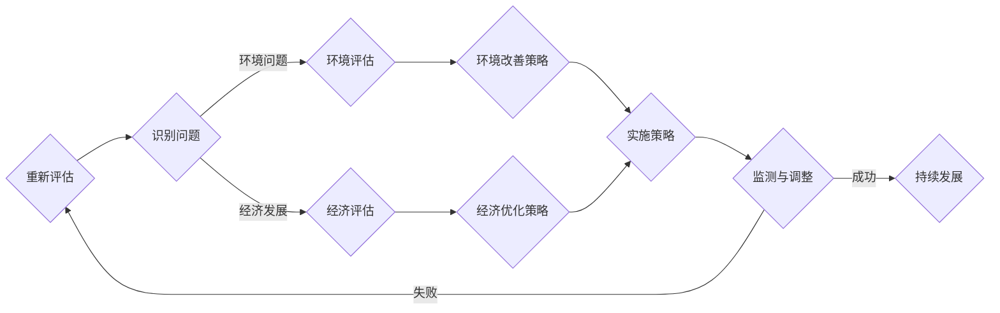
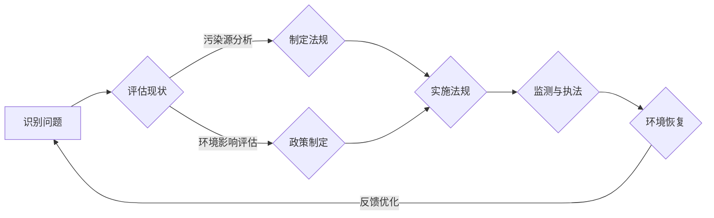
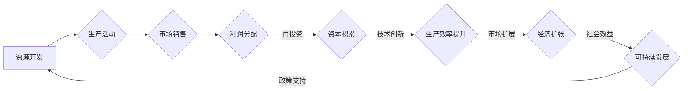

                 

### 设计概述章节

为了引出整篇文章的主题，我们需要在概述章节中明确书的背景、目的，并简要介绍环境保护与经济发展的现状以及可持续发展的必要性。以下是概述章节的详细设计：

#### 第1章: 书籍背景与目的

##### 1.1 环境保护与经济发展的现状

在这一部分，我们将简要回顾当前全球环境保护和经济发展的现状。重点讨论以下方面：

- 环境污染问题，如空气污染、水污染和土壤污染等。
- 经济发展带来的资源消耗和生态破坏。
- 各国政府和企业对环境保护和经济发展的关注程度及其采取的措施。

通过这部分内容，我们可以让读者对当前环境保护和经济发展的背景有一个整体的了解。

##### 1.2 可持续发展的必要性

接下来，我们将讨论可持续发展的必要性，包括以下几点：

- 可持续发展的定义和重要性。
- 环境和经济发展之间的矛盾及其对人类未来的影响。
- 全球气候变化、资源枯竭等环境问题的严峻性。

这部分内容将帮助读者理解为什么可持续发展是当前和未来的必然选择。

##### 1.3 书籍的结构与内容概述

最后，我们将简要介绍书籍的结构与内容，包括以下部分：

- 本书的主要目的和目标。
- 各章节的内容和相互关系。
- 阅读本书的建议和预期收获。

通过这部分内容，读者可以明确本书的框架和内容，为后续章节的学习做好心理准备。

#### 设计思路

1. **背景介绍**：通过回顾现状，让读者对主题有初步的了解。
2. **必要性分析**：通过阐述可持续发展的必要性，引导读者关注这一问题。
3. **结构概述**：通过介绍书籍的结构和内容，让读者对整篇文章有一个全面的预期。

这种设计思路能够帮助读者从宏观上理解文章的主题，并为后续章节的内容做好铺垫。接下来，我们将设计核心概念与联系章节，以进一步深入探讨可持续发展的基本原理和主要模式。

---

# 第一部分: 概述

## 第1章: 书籍背景与目的

### 1.1 环境保护与经济发展的现状

环境保护和经济发展是人类社会面临的两大重要议题。当前，全球环境污染问题日益严重，空气污染、水污染和土壤污染等问题已经成为影响人类健康和生态系统稳定的重大挑战。经济发展带来的资源消耗和生态破坏也在不断加剧，例如森林砍伐、湿地破坏和物种灭绝等。

各国政府和企业对环境保护和经济发展的关注程度有所不同。一些国家和地区已经采取了一系列环境保护措施，如制定严格的法律法规、推广清洁能源和实行生态补偿机制等。然而，环境保护与经济发展的矛盾仍然存在，如何在保障经济发展的同时实现环境保护仍是一个亟待解决的难题。

### 1.2 可持续发展的必要性

可持续发展是指在满足当前需求的同时，不损害后代满足其需求的能力的发展模式。可持续发展的重要性主要体现在以下几个方面：

- **环境可持续性**：环境保护与经济发展之间的矛盾日益突出，可持续发展能够实现环境与经济的双重效益，保护地球生态系统。
- **经济可持续性**：通过提高资源利用效率和推动创新，可持续发展能够促进经济的长期稳定增长。
- **社会可持续性**：可持续发展关注人类的福祉，包括改善生活条件、减少贫困和提高社会福利等。

当前全球气候变化、资源枯竭等环境问题的严峻性要求我们必须采取可持续发展的模式，以确保人类和地球的未来。

### 1.3 书籍的结构与内容概述

本书旨在深入探讨环境保护与经济发展的平衡，实现可持续发展的新模式。结构如下：

- **第一部分：概述**：介绍书籍的背景与目的，以及环境保护与经济发展的现状。
- **第二部分：核心概念与联系**：阐述可持续发展的基本原理、核心概念及其相互关系。
- **第三部分：环境保护**：讨论环境问题的现状与挑战，以及环境保护的法律、法规和国际合作。
- **第四部分：经济与发展**：分析经济发展的模式与挑战，探讨创新驱动发展战略和经济发展的可持续性。
- **第五部分：可持续发展新模式**：介绍绿色经济、资源循环利用和可持续社区建设等可持续发展新模式。
- **第六部分：项目实战**：通过实际案例研究，探讨可持续发展项目的实施与评估。
- **第七部分：总结与展望**：总结全书的主要结论，反思存在的问题与挑战，并展望未来的发展方向。

通过本书的阅读，读者可以全面了解环境保护与经济发展的平衡，掌握可持续发展的新模式，为实现可持续发展的未来做出贡献。

### 2.1 可持续发展的定义

可持续发展是指在满足当前需求的同时，不损害后代满足其需求的能力的发展模式。这一概念最早由联合国世界环境与发展委员会在1987年的《我们共同的未来》报告中提出，并得到了全球范围内的广泛认可。可持续发展涵盖了经济、社会和环境三个方面，旨在实现这三者的协调发展，确保人类社会的长期繁荣与地球生态系统的健康。

从经济角度看，可持续发展强调资源的有效利用和经济的稳定增长，避免过度开发和资源枯竭。通过推动创新、提高生产效率和优化资源配置，可以实现经济增长与环境保护的双赢。

从社会角度看，可持续发展关注人类福祉和社会公平，包括改善生活条件、减少贫困、提高教育和医疗水平等。可持续发展的社会目标是确保所有人都能享有基本的生活权益，同时促进社会和谐与稳定。

从环境角度看，可持续发展强调保护自然资源和生态环境，减少污染和生态破坏。这包括控制温室气体排放、保护生物多样性、改善空气质量、治理水体污染等。

总的来说，可持续发展的定义不仅关注当前的需求，更关注未来的需求和地球生态系统的健康。它要求我们在经济发展的过程中，充分考虑环境和社会因素，实现经济、社会和环境的协调发展。

### 2.2 可持续发展的核心原则

可持续发展的核心原则包括公平性、持续性和共同性，这些原则构成了实现可持续发展的基础。

**公平性**：公平性是可持续发展的基本原则之一。它强调代际公平，即当代人的发展不应损害后代人的利益。此外，公平性还包括人与人之间的公平，即在经济和社会资源分配上，应确保所有人都能享有平等的机会和权益。在环境保护方面，公平性要求各国在应对全球环境问题时应承担相应的责任，发达国家应承担更多的责任，帮助发展中国家提高环境保护能力。

**持续性**：持续性是指人类的经济和社会活动应在生态系统的承载能力范围内进行。这意味着我们不能过度开发资源，必须尊重自然规律，确保自然资源的可持续利用。在经济发展中，持续性要求我们提高资源利用效率，减少浪费，推动绿色技术和产业的发展。在环境保护中，持续性要求我们采取有效的措施，控制污染，恢复生态平衡。

**共同性**：共同性是指可持续发展是全球性的挑战，需要全球范围内的合作与协调。每个国家和地区的可持续发展都与其他国家和地区的可持续发展密切相关，没有哪个国家可以单独实现可持续发展。因此，国际社会应加强合作，共同应对环境问题，推动全球可持续发展。

这些核心原则不仅为可持续发展提供了理论指导，也为各国制定政策和采取行动提供了依据。通过遵循这些原则，我们可以实现经济、社会和环境的协调发展，为人类和地球的未来创造更美好的前景。

### 2.3 可持续发展的主要模式

可持续发展模式是指在实现经济、社会和环境协调发展的过程中，采取的具体策略和措施。以下介绍几种主要的可持续发展模式：

**绿色经济模式**：绿色经济模式是一种以环境友好为特征的经济模式，旨在实现经济、社会和环境的协调发展。其核心是通过提高资源利用效率和减少环境污染，实现经济的可持续增长。具体措施包括推广清洁能源、提高能源效率、发展循环经济、减少碳排放等。例如，德国的“能源转型”政策就是一个典型的绿色经济模式，通过大力发展可再生能源，逐步减少对化石燃料的依赖，实现了经济发展与环境保护的双赢。

**循环经济模式**：循环经济模式是一种以资源循环利用为特征的经济模式，强调资源的减量化、再利用和再循环。其目标是实现资源的可持续利用，减少环境污染和生态破坏。循环经济模式的核心是“3R”原则，即减量化（Reduce）、再利用（Reuse）和再循环（Recycle）。具体措施包括推广节能技术、开发可再生资源、建立废物回收体系等。例如，日本的循环型社会建设就是一个成功的循环经济模式案例，通过实施严格的废物分类制度和再利用政策，实现了资源的高效利用和环境污染的显著减少。

**可持续社区模式**：可持续社区模式是一种以社区为单位，实现经济、社会和环境协调发展的模式。其目标是通过建设绿色社区、提高居民生活质量、保护生态环境，实现社区的可持续发展。具体措施包括推广绿色建筑、发展本地经济、提高居民环保意识等。例如，丹麦的哥本哈根就是一个可持续社区模式的典范，通过推广绿色建筑、发展可再生能源、提高公共交通效率等措施，实现了城市经济、社会和环境的协调发展。

**综合发展模式**：综合发展模式是一种结合多种可持续发展模式的策略，通过综合运用绿色经济、循环经济和可持续社区等模式，实现更高层次的可持续发展。这种模式强调各模式之间的协同作用，以实现更全面、更高效的发展。例如，欧盟的“绿色经济战略”就是一个综合发展模式的案例，通过推动绿色经济、循环经济和可持续社区建设，实现了经济、社会和环境的全面协调发展。

这些可持续发展模式各有特色，但都旨在实现经济、社会和环境的协调发展。通过选择合适的可持续发展模式，并采取有效的措施，我们可以实现可持续发展的目标，为人类和地球的未来创造更美好的前景。

### 2.4 可持续发展的Mermaid流程图

为了更好地理解可持续发展的流程，我们可以使用Mermaid语言绘制一个流程图，展示其核心步骤和关键节点。以下是可持续发展Mermaid流程图的代码和解释：

**流程图说明：**

1. **A[开始]**：可持续发展过程的开始。
2. **B{识别问题]**：识别环境问题和经济发展问题。
3. **C{环境评估}**：对环境问题进行详细评估，了解问题的严重性和影响范围。
4. **D{经济评估}**：对经济发展问题进行详细评估，分析经济现状和发展潜力。
5. **E{环境改善策略}**：根据环境评估结果，制定环境改善策略。
6. **F{经济优化策略}**：根据经济评估结果，制定经济优化策略。
7. **G{实施策略}**：将环境改善策略和经济优化策略付诸实施。
8. **H{监测与调整}**：对实施过程进行监测和评估，根据实际情况进行调整。
9. **I{持续发展}**：实现可持续发展的目标，进入下一轮循环。

通过这个流程图，我们可以清晰地看到可持续发展的各个步骤和关键节点，更好地理解其实现过程。这个过程是一个动态的循环，通过不断地识别问题、评估、实施和调整，我们可以逐步实现可持续发展的目标。

### 第3章: 环境问题的现状与挑战

#### 3.1 环境污染的类型

环境污染是当前全球面临的一个重大问题，其类型多样，影响深远。主要的环境污染类型包括以下几种：

1. **空气污染**：空气污染主要来自工业废气、汽车尾气、燃烧化石燃料等。常见的污染物包括二氧化硫、氮氧化物、颗粒物（PM2.5和PM10）以及挥发性有机化合物（VOCs）。空气污染会导致呼吸系统疾病、心血管疾病，甚至增加癌症的风险。

2. **水污染**：水污染主要来自工业废水、农业径流和生活污水。污染物包括重金属、有机物、病原微生物等。水污染会破坏水生态系统，影响饮用水安全和农田灌溉，导致水体富营养化等问题。

3. **土壤污染**：土壤污染主要来自农药、化肥、工业废物和城市垃圾。污染物包括重金属、有机污染物、放射性物质等。土壤污染会影响农作物产量和品质，危害人类健康。

4. **噪声污染**：噪声污染主要来自工业生产、交通运输、建筑施工和城市生活等。长期暴露在高分贝噪声环境中，会导致听力损伤、睡眠障碍和心血管疾病等健康问题。

#### 3.2 环境保护的法律法规

环境保护法律法规是各国政府为保护环境、控制污染而制定的一系列法律、法规和规章。以下是一些重要的环境保护法律法规：

1. **国际环境保护法律法规**：
   - **《联合国气候变化框架公约》**：1992年通过，旨在通过国际合作减缓气候变化。
   - **《联合国生物多样性公约》**：1992年通过，旨在保护生物多样性和促进可持续发展。
   - **《国际海洋法公约》**：1994年通过，旨在保护海洋环境，促进国际合作。

2. **国内环境保护法律法规**：
   - **《中华人民共和国环境保护法》**：1989年通过，是我国环境保护的基本法律，规定了环境保护的基本原则和制度。
   - **《中华人民共和国大气污染防治法》**：1987年通过，针对空气污染问题制定的具体法规。
   - **《中华人民共和国水污染防治法》**：1984年通过，针对水污染问题制定的具体法规。
   - **《中华人民共和国固体废物污染环境防治法》**：1995年通过，针对固体废物污染问题制定的具体法规。

这些法律法规为环境保护提供了法律依据和保障，通过建立严格的排放标准和处罚机制，促使企业和个人减少污染排放，保护生态环境。

#### 3.3 国际环境保护合作

国际环境保护合作是应对全球环境问题的重要手段。以下是一些重要的国际环境保护合作机构和机制：

1. **联合国环境规划署（UNEP）**：联合国环境规划署是联合国系统中负责环境问题的机构，致力于促进全球环境保护合作。

2. **联合国气候变化框架公约（UNFCCC）**：UNFCCC是气候变化领域的国际法律框架，通过《巴黎协定》等协议推动全球气候行动。

3. **联合国生物多样性公约（CBD）**：CBD致力于保护生物多样性和促进可持续发展，通过《卡塔赫纳生物安全议定书》等文件促进国际生物多样性保护。

4. **亚太经合组织（APEC）**：APEC是一个涵盖亚太地区主要经济体的国际组织，通过APEC环境部长会议等机制推动区域环境保护合作。

5. **欧洲联盟（EU）**：欧盟通过一系列政策和法规，推动成员国之间的环境保护合作，并在全球环境保护中发挥领导作用。

这些机构和机制通过制定国际协议、提供技术支持和促进跨国合作，共同应对全球环境问题，实现可持续发展的目标。

### 3.4 环境保护Mermaid流程图

为了更好地理解环境保护的过程和步骤，我们可以使用Mermaid语言绘制一个流程图，展示环境保护的核心环节和关键步骤。以下是环境保护Mermaid流程图的代码和解释：

**流程图说明：**

1. **A[识别问题]**：识别和确定环境污染的来源和类型。
2. **B{评估现状}**：对环境污染现状进行评估，了解问题的严重性和影响范围。
3. **C{污染源分析}**：分析主要污染源，为制定法规提供依据。
4. **D{环境影响评估}**：评估环境政策对生态系统和人类健康的影响。
5. **E{政策制定与实施法规}**：制定环境保护政策和法规，并付诸实施。
6. **F{监测与执法}**：对环境保护政策执行情况进行监测和执法，确保法规的实施。
7. **G{环境恢复}**：对受到污染的环境进行恢复和治理。
8. **G{反馈优化}**：根据监测结果和反馈，不断优化环境保护政策和措施。

通过这个流程图，我们可以清晰地看到环境保护的各个环节和步骤，更好地理解其实现过程。这个过程是一个动态的循环，通过不断地评估、制定、实施和优化，我们可以逐步实现环境保护的目标。

### 第4章: 经济发展的模式与挑战

#### 4.1 传统经济发展的局限

传统经济发展模式主要依赖于资源消耗和环境污染，其局限性体现在以下几个方面：

1. **资源依赖性**：传统经济发展高度依赖自然资源，尤其是化石燃料。这种依赖性导致了资源的过度开采和枯竭，例如煤炭、石油和天然气等。随着全球资源的日益稀缺，传统经济发展模式面临资源供应短缺的风险。

2. **环境污染**：传统经济发展过程中，大量排放温室气体、污染物和有害物质，导致空气质量恶化、水资源污染和土壤退化等问题。这些环境问题不仅影响了生态系统的健康，还危害了人类健康和生活质量。

3. **经济波动**：传统经济发展模式往往伴随着经济周期的波动，例如经济危机、通货膨胀和失业问题等。这些波动不仅影响了经济的稳定发展，还对社会稳定和人民生活产生负面影响。

4. **社会不公平**：传统经济发展模式往往导致资源分配不均和社会不平等。发达国家和发展中国家之间的资源分配不平衡，以及国内地区之间的发展差距，加剧了社会不公平问题。

5. **全球性挑战**：随着全球化的深入发展，传统经济发展模式面临全球性挑战，例如全球气候变化、资源争夺和国际贸易摩擦等。这些问题超出了单一国家的解决能力，需要全球范围内的合作与协调。

#### 4.2 创新驱动发展战略

为了应对传统经济发展的局限，许多国家和地区开始推行创新驱动发展战略，以创新为核心驱动力，推动经济高质量发展。以下是创新驱动发展战略的几个关键要素：

1. **科技创新**：科技创新是创新驱动发展的核心。通过研发新技术、新产品和新工艺，可以提高生产效率，降低生产成本，创造新的市场需求。例如，人工智能、物联网、大数据和生物技术等新兴技术的快速发展，为各行业带来了巨大的创新空间。

2. **人才驱动**：人才是创新驱动发展的关键。通过培养和引进高层次人才，提高人力资源的质量和创新能力，可以推动经济结构的优化升级。许多国家和地区都设立了专项基金和项目，支持科技创新人才培养和人才引进。

3. **产业升级**：产业升级是创新驱动发展的关键环节。通过淘汰落后产能，培育和发展新兴产业，可以提高产业链的附加值和竞争力。例如，德国的“工业4.0”战略，通过推动制造业智能化和数字化，实现了产业结构的升级和优化。

4. **政策支持**：政策支持是创新驱动发展的保障。政府通过制定和实施一系列支持科技创新的政策，如税收优惠、研发资助、知识产权保护等，为科技创新提供良好的外部环境。例如，美国的“拜杜法案”通过鼓励高校和科研机构与产业界合作，推动了技术创新和产业化。

5. **开放合作**：开放合作是创新驱动发展的重要途径。通过加强国际科技合作，引进国外先进技术和管理经验，可以提升本国的创新能力和发展水平。例如，中国的“一带一路”倡议，通过推动国际科技合作和产业合作，促进了沿线国家的经济发展和科技创新。

#### 4.3 经济发展的可持续性

经济发展的可持续性是指在经济活动过程中，实现经济、社会和环境的协调发展，确保经济长期稳定增长和可持续发展。以下是实现经济发展可持续性的几个关键措施：

1. **绿色经济**：发展绿色经济是实现经济发展可持续性的重要途径。通过推动绿色产业、绿色技术和绿色消费，可以实现经济与环境的协调发展。例如，推广可再生能源、发展循环经济和减少碳排放，都是实现绿色经济的重要举措。

2. **资源节约**：资源节约是实现经济发展可持续性的基础。通过提高资源利用效率，减少资源浪费，可以实现资源的长期供应和可持续利用。例如，采用节能技术、优化生产流程和推广资源回收利用，都是实现资源节约的重要措施。

3. **环境保护**：环境保护是实现经济发展可持续性的关键。通过制定和实施严格的环境保护政策，控制污染排放，恢复和改善生态环境，可以保障经济的可持续发展。例如，建立环境监测体系、实施环境标准和开展生态修复工程，都是实现环境保护的重要措施。

4. **社会公平**：社会公平是实现经济发展可持续性的保障。通过改善社会福利、提高教育水平和促进就业，可以实现社会和谐与稳定。例如，实施社会保障制度、提供教育和培训机会和促进就业机会均等，都是实现社会公平的重要措施。

5. **政策支持**：政策支持是实现经济发展可持续性的保障。政府通过制定和实施一系列支持可持续发展的政策，如绿色金融政策、科技创新政策和可持续发展政策等，可以为经济发展提供良好的政策环境。例如，提供税收优惠、研发资助和环保补贴等，都是实现政策支持的重要措施。

通过以上措施，我们可以实现经济发展的可持续性，推动经济、社会和环境的协调发展，为人类和地球的未来创造更美好的前景。

### 4.4 经济发展Mermaid流程图

为了更好地理解经济发展过程及其关键步骤，我们可以使用Mermaid语言绘制一个流程图，展示经济发展的主要环节和逻辑关系。以下是经济发展Mermaid流程图的代码和解释：

**流程图说明：**

1. **A[资源开发]**：通过开发和利用自然资源，为经济发展提供基础。
2. **B{生产活动]**：利用资源进行生产活动，创造商品和服务。
3. **C{市场销售]**：将生产出来的商品和服务推向市场，实现销售和盈利。
4. **D{利润分配]**：将销售利润进行分配，包括投资、分红等。
5. **E{资本积累]**：通过再投资，实现资本的积累和增长。
6. **F{技术创新]**：利用积累的资本，投入研发和技术创新，提升生产效率。
7. **G{经济扩张]**：通过技术创新，扩大生产和市场，推动经济规模的扩张。
8. **H{可持续发展]**：在经济发展的同时，关注环境保护和社会效益，实现可持续发展。
9. **I{政策支持]**：政府通过制定和实施相关政策，支持经济发展的可持续性。

通过这个流程图，我们可以清晰地看到经济发展从资源开发到技术创新，再到经济扩张和可持续发展的全过程，更好地理解经济发展的内在逻辑和关键环节。

### 第5章: 绿色经济

#### 5.1 绿色经济的概念与特点

绿色经济是一种以环境友好和资源高效利用为核心的经济模式，旨在实现经济增长与环境保护的协调发展。其概念起源于可持续发展理论，强调在经济发展的过程中，应充分考虑环境和社会因素，通过技术创新和制度创新，实现经济、社会和环境的共赢。

**绿色经济的特点**包括：

1. **资源高效利用**：绿色经济强调提高资源利用效率，通过节能减排、循环利用和再生技术，减少资源消耗和浪费。例如，推广节能建筑、开发可再生能源和实施废物回收利用等措施，都是实现资源高效利用的重要手段。

2. **环境保护优先**：绿色经济将环境保护置于重要位置，通过制定和实施严格的环境法规，控制污染排放，保护生态系统。例如，实行污染物排放总量控制、推广清洁生产技术和开展生态修复工程等，都是实现环境保护优先的重要措施。

3. **绿色技术创新**：绿色经济依赖于绿色技术创新，通过研发和应用新技术、新产品和新工艺，推动经济结构的优化升级。例如，发展清洁能源技术、推广低碳技术和开发环保材料等，都是实现绿色技术创新的重要途径。

4. **社会参与广泛**：绿色经济强调社会参与，通过提高公众环保意识和参与度，推动绿色生活方式和消费模式的形成。例如，开展环保教育和宣传活动、推广绿色认证和实施环保公益项目等，都是实现社会参与广泛的重要措施。

5. **经济效益与生态效益相结合**：绿色经济注重经济效益与生态效益的结合，通过实现环境与经济的双重效益，推动可持续发展。例如，发展绿色产业、推广绿色金融和实施绿色采购等，都是实现经济效益与生态效益相结合的重要手段。

#### 5.2 绿色经济的实践案例

以下是一些绿色经济的实践案例，展示了绿色经济在不同领域的应用和效果：

1. **绿色产业发展**：德国的“能源转型”政策是一个成功的绿色经济实践案例。德国通过大力发展可再生能源，逐步减少对化石燃料的依赖，实现了经济增长与环境保护的双赢。截至2020年，德国的可再生能源占总能源消耗的比例已经达到46.6%，成为全球可再生能源发展的领导者。

2. **绿色城市建设**：丹麦的哥本哈根是一个典型的绿色城市案例。哥本哈根通过推广绿色建筑、发展可再生能源和优化公共交通系统等措施，实现了城市的绿色转型。例如，哥本哈根市中心的“拜亚芬诺大楼”是一座零能耗建筑，通过太阳能、地热和风能等可再生能源，实现了能源的自给自足。

3. **绿色金融**：欧洲投资银行（EIB）和国际金融公司（IFC）等国际金融机构，通过提供绿色贷款、发行绿色债券和设立绿色基金等方式，推动绿色经济的发展。例如，国际金融公司通过向中国企业提供绿色贷款，支持其实施环保项目，推动绿色经济的发展。

4. **绿色消费**：日本的循环型社会建设是一个成功的绿色消费案例。日本通过实施严格的废物分类制度和再利用政策，实现了资源的高效利用和环境污染的显著减少。例如，日本的“塑料袋收费制度”通过向消费者收取塑料袋费用，鼓励消费者减少使用塑料袋，减少塑料污染。

这些绿色经济的实践案例表明，通过技术创新、政策支持和公众参与，我们可以实现经济增长与环境保护的协调发展，为人类和地球的未来创造更美好的前景。

#### 5.3 绿色经济面临的挑战

尽管绿色经济在多个领域取得了显著成效，但其发展仍面临诸多挑战，需要各方共同努力才能克服。

**技术挑战**：绿色经济的发展依赖于技术创新，但在许多领域，绿色技术的研发和应用仍存在不足。例如，可再生能源技术尚需进一步改进以提高效率和降低成本，绿色建筑技术和环保材料的研究也需要不断深入。此外，技术转化和推广也面临困难，许多绿色技术由于成本高、市场需求不足等原因未能得到广泛应用。

**经济成本**：绿色经济模式的实施往往伴随着较高的经济成本，这成为一些企业、政府和投资者考虑的重要因素。例如，可再生能源项目的建设和运营成本较高，一些绿色技术的研发和应用也需要大量的资金投入。此外，绿色经济模式的推广还需要对现有经济结构进行调整，这可能导致短期内的经济波动和就业压力。

**政策障碍**：绿色经济的发展需要完善的政策和法律体系作为支持，但现有政策体系仍存在不足。一些国家和地区的环保法律法规不够严格，执行力度不足，导致环境污染问题得不到有效控制。此外，政策之间的协调性也需加强，例如，一些政策可能对绿色产业形成障碍，影响其发展。

**社会认知**：绿色经济模式的推广需要公众的广泛参与和支持，但公众的环保意识和认知水平仍有待提高。一些人对绿色经济和环保措施的理解有限，甚至存在误解和抵触情绪。这导致绿色经济模式在推广过程中面临阻力，影响其效果。

**国际合作**：绿色经济的发展是全球性的问题，需要国际社会的共同努力。然而，各国在环保标准和政策上的差异，以及国际合作机制的不完善，都成为绿色经济发展的障碍。例如，一些国家可能在环保技术、资金和市场方面存在优势，而其他国家可能缺乏这些资源，导致国际间的合作难度加大。

**创新与创业**：绿色经济的发展需要大量的创新和创业活动，但目前创新创业环境仍需改善。例如，创新创业者可能面临资金不足、市场准入难等问题，影响其创新和创业的积极性。此外，创业失败的风险较高，也可能阻碍绿色经济的快速发展。

综上所述，绿色经济在发展中面临技术、经济、政策、社会认知、国际合作和创新创业等多方面的挑战。只有通过政府、企业、科研机构和社会各界的共同努力，才能克服这些挑战，推动绿色经济的可持续发展。

### 第6章: 资源循环利用

#### 6.1 资源循环利用的原理

资源循环利用是指在生产和消费过程中，通过回收、再利用和再生等方式，将废弃物转化为可再利用的资源，从而实现资源的可持续利用。资源循环利用的基本原理可以概括为以下几个关键环节：

**回收**：回收是将废弃物收集起来，进行初步处理和分类。通过分类，将可回收的废弃物分离出来，如纸张、塑料、金属和玻璃等。回收过程可以减少对原生资源的依赖，降低环境污染。

**再利用**：再利用是指将回收的废弃物直接重新使用，而不是进行再生处理。例如，旧衣物可以通过清洗和修补后再次销售；废旧建筑材料可以通过翻新和改造后用于新的建筑项目。

**再生**：再生是指将废弃物经过加工处理，转化为新的材料或产品。再生过程包括物理、化学和生物等多种方法。例如，废纸可以通过再生处理重新制成新纸；塑料可以通过熔融和再加工制成新的塑料制品。

**能源回收**：能源回收是指将废弃物中的能源成分提取出来，进行再利用。例如，垃圾焚烧产生的热能可以用于发电或供暖；废油脂可以通过化学处理转化为生物柴油。

资源循环利用的原理在于将废弃物视为一种资源，通过技术手段和合理管理，实现资源的再利用和再生，从而减少资源的浪费和环境污染。资源循环利用不仅有助于实现资源的可持续利用，还可以带来经济效益，促进绿色经济的发展。

#### 6.2 资源循环利用的技术手段

资源循环利用涉及多种技术手段，以下介绍几种常见的技术方法：

**物理处理技术**：物理处理技术主要利用物理手段对废弃物进行分离和再利用。常见的物理处理技术包括破碎、筛分、分选和压缩等。例如，废旧金属可以通过破碎和筛分分离出不同规格的金属颗粒，再进行再加工。

**化学处理技术**：化学处理技术通过化学反应将废弃物转化为有用的物质。常见的化学处理技术包括酸碱处理、氧化还原和生物处理等。例如，废旧塑料可以通过热解或化学催化处理，分解成小分子化合物，再进行再利用。

**生物处理技术**：生物处理技术利用微生物和植物等生物体，对废弃物进行分解和转化。常见的生物处理技术包括堆肥、厌氧发酵和生物降解等。例如，有机废弃物可以通过堆肥处理，转化为有机肥料，用于农田种植。

**能源回收技术**：能源回收技术主要用于回收废弃物中的能量成分。常见的能源回收技术包括热能回收、生物质能利用和垃圾焚烧等。例如，垃圾焚烧产生的热能可以用于发电或供暖，实现能量的再利用。

**水处理技术**：水处理技术用于处理废水，使其达到排放或再利用的标准。常见的水处理技术包括过滤、沉淀、氧化还原和膜分离等。例如，工业废水可以通过生物处理和化学处理，去除其中的污染物，达到排放标准。

通过这些技术手段，我们可以有效地实现资源的循环利用，减少废弃物的排放，降低环境污染，促进可持续发展的实现。

#### 6.3 资源循环利用的案例研究

以下介绍几个资源循环利用的案例，展示资源循环利用在实际应用中的效果和挑战。

**案例一：日本循环型社会建设**

日本是一个资源贫乏的国家，因此非常重视资源循环利用。日本通过实施严格的废物分类制度和再利用政策，实现了资源的高效利用和环境污染的显著减少。例如，日本的“塑料瓶回收系统”要求消费者购买饮料时支付押金，使用后归还瓶子以获取押金返还。这种制度极大地提高了塑料瓶的回收率，减少了塑料废弃物的排放。

**挑战**：尽管日本的循环型社会建设取得了显著成效，但仍然面临一些挑战。例如，一些废弃物分类难度较大，如电子废弃物和化学废物，其回收和处理需要更高的技术和成本。此外，公众的环保意识和参与度也有待提高，一些地区存在分类不准确和回收率低的问题。

**案例二：德国可再生能源利用**

德国的“能源转型”政策通过大力发展可再生能源，逐步减少对化石燃料的依赖，实现了经济增长与环境保护的双赢。德国的可再生能源包括风能、太阳能、地热能和生物质能等，这些能源在发电、供暖和交通等领域得到广泛应用。

**挑战**：尽管德国的可再生能源发展取得了显著成果，但仍然面临一些挑战。例如，可再生能源的发电不稳定，受天气和地理条件影响较大，需要与其他能源形式进行有效结合。此外，可再生能源的初始投资较高，对中小企业和低收入家庭来说，使用成本可能较高。

**案例三：瑞典的循环经济示范城市——马尔默**

瑞典的马尔默市通过实施循环经济政策，实现了资源的高效利用和城市环境的可持续发展。马尔默市推广垃圾分类、废物回收和再利用，同时大力发展可再生能源和绿色交通，成为全球循环经济的示范城市。

**挑战**：尽管马尔默市的循环经济模式取得了成功，但仍然面临一些挑战。例如，公众的环保意识和参与度仍有待提高，一些废弃物分类和回收技术还需要进一步改进。此外，循环经济模式对企业和政府的资源投入要求较高，可能对中小企业和地方财政带来一定的压力。

通过这些案例，我们可以看到资源循环利用在实践中的应用效果和挑战。资源循环利用不仅有助于实现资源的可持续利用和环境保护，也为经济发展提供了新的机遇。然而，要实现资源循环利用的全面推广，需要技术创新、政策支持和公众参与等多方面的努力。

### 第7章: 可持续社区建设

#### 7.1 可持续社区的定义与目标

可持续社区是指在城市或乡村中，通过综合运用生态、经济和社会等方面的策略和措施，实现资源高效利用、环境友好、社会和谐和经济发展的社区。可持续社区的目标包括以下几个方面：

1. **环境保护**：通过减少污染、节约能源和保护自然资源，实现环境的可持续性。例如，推广绿色建筑、优化公共设施和交通系统，以降低碳排放和环境污染。

2. **经济繁荣**：通过发展绿色产业、促进本地经济和创造就业机会，实现经济的可持续发展。例如，鼓励绿色投资、支持环保产业和推动本地经济的发展。

3. **社会和谐**：通过提高居民生活质量、增强社区凝聚力和促进社会公平，实现社会的可持续发展。例如，提供良好的教育、医疗和社会保障，以及促进文化交流和社区参与。

4. **资源高效利用**：通过提高资源利用效率、减少浪费和推动循环经济，实现资源的可持续利用。例如，推广垃圾分类、废物回收和再利用，以及提高能源和水资源的利用效率。

可持续社区不仅关注社区内部的可持续发展，还与外部环境和社会系统相互作用，通过建立生态、经济和社会的良性循环，为全球可持续发展做出贡献。

#### 7.2 可持续社区的建设策略

建设可持续社区需要采取多种策略和措施，以下列举几种关键策略：

1. **绿色规划和设计**：在社区规划阶段，应充分考虑环境因素，采用生态友好的设计原则。例如，合理布局住宅、商业和工业区域，减少交通拥堵和环境污染。同时，推广绿色建筑和节能建筑，提高建筑的能源效率。

2. **废物管理和资源回收**：建立完善的废物分类和回收系统，鼓励居民参与垃圾分类和资源回收。通过废物处理设施的建设和运行，实现废物的减量和资源化利用。

3. **清洁能源利用**：推广可再生能源，如太阳能、风能和地热能等，减少对化石燃料的依赖。同时，优化能源网络，提高能源利用效率，减少能源浪费。

4. **绿色交通系统**：建设绿色交通系统，包括步行道、自行车道和公共交通设施，鼓励居民采用低碳出行方式。通过交通拥堵管理和智能交通系统，提高交通效率，减少碳排放。

5. **生态保护和恢复**：保护和恢复社区内的自然生态系统，如绿地、湿地和河流等。通过生态修复工程和生态景观设计，提高社区的生态价值和生态承载力。

6. **教育和培训**：提高居民的环保意识和参与度，通过教育和培训活动，推广可持续生活方式和消费习惯。例如，开展环保知识讲座、组织环保实践活动和推广绿色认证等。

7. **政策支持和资金投入**：政府应制定和实施支持可持续社区建设的政策和法规，提供资金和技术支持。通过财政补贴、税收优惠和绿色金融等手段，鼓励社区和企业参与可持续社区建设。

通过实施这些策略，我们可以逐步实现社区的可持续发展，为居民创造一个健康、环保和宜居的生活环境。

#### 7.3 可持续社区的成功案例

以下介绍几个全球范围内成功的可持续社区案例，展示可持续社区建设在实践中的效果和经验。

**案例一：丹麦的卡伦加社区**

卡伦加社区位于丹麦的哥本哈根，是一个典型的可持续社区。该社区通过一系列绿色规划和设计，实现了环境保护、经济繁荣和社会和谐的目标。

- **绿色规划和设计**：卡伦加社区采用生态友好的设计原则，合理布局住宅、商业和工业区域，减少交通拥堵和环境污染。社区内建设了多个公园和绿地，提高了生态价值和居住环境。
- **废物管理和资源回收**：社区建立了完善的废物分类和回收系统，鼓励居民参与垃圾分类和资源回收。通过废物处理设施的建设和运行，实现了废物的减量和资源化利用。
- **清洁能源利用**：卡伦加社区推广可再生能源，如太阳能、风能和地热能等，减少对化石燃料的依赖。同时，优化能源网络，提高能源利用效率，减少能源浪费。
- **绿色交通系统**：社区建设了绿色交通系统，包括步行道、自行车道和公共交通设施，鼓励居民采用低碳出行方式。通过交通拥堵管理和智能交通系统，提高了交通效率，减少了碳排放。

**案例二：新加坡的加冷河社区**

加冷河社区是新加坡的一个可持续社区，通过综合运用绿色规划和设计、废物管理和资源回收、清洁能源利用和绿色交通系统等措施，实现了社区的可持续发展。

- **绿色规划和设计**：社区采用生态友好的设计原则，建设了多个公园和绿地，提高了生态价值和居住环境。同时，社区内的建筑物采用了节能设计和绿色建筑技术，提高了能源利用效率。
- **废物管理和资源回收**：社区建立了完善的废物分类和回收系统，鼓励居民参与垃圾分类和资源回收。通过废物处理设施的建设和运行，实现了废物的减量和资源化利用。
- **清洁能源利用**：社区推广可再生能源，如太阳能和地热能等，减少对化石燃料的依赖。同时，优化能源网络，提高能源利用效率，减少能源浪费。
- **绿色交通系统**：社区建设了绿色交通系统，包括步行道、自行车道和公共交通设施，鼓励居民采用低碳出行方式。通过交通拥堵管理和智能交通系统，提高了交通效率，减少了碳排放。

这些成功案例表明，通过综合运用绿色规划和设计、废物管理和资源回收、清洁能源利用和绿色交通系统等措施，我们可以建设一个可持续、环保和宜居的社区，为居民创造一个健康、舒适和美好的生活环境。

### 第8章: 可持续发展项目的实施与评估

#### 8.1 可持续发展项目的规划

可持续发展项目的成功实施离不开科学的规划和设计。项目规划主要包括以下几个关键步骤：

1. **需求分析**：在项目启动前，进行详细的需求分析，明确项目的目标和预期效果。需求分析应涵盖环境、经济和社会等多个方面，确保项目的综合性和可持续性。

2. **目标设定**：根据需求分析，设定具体、可行的项目目标。目标应具有可衡量性、可实现性和可跟踪性，以便于项目实施过程中的监督和评估。

3. **资源规划**：项目规划阶段需明确项目所需的资源，包括人力、资金、技术和物资等。资源规划应考虑资源的可持续性和效率，确保项目在资源有限的情况下仍能顺利进行。

4. **风险评估**：对项目实施过程中可能遇到的风险进行评估，包括技术风险、环境风险、社会风险和经济风险等。风险评估有助于制定应对措施，降低风险对项目的影响。

5. **实施方案设计**：设计详细的实施方案，包括项目的具体步骤、时间表、任务分配和资源配置等。实施方案应确保项目目标的实现，并具备灵活性，以应对可能出现的变化。

6. **监督与评估机制**：建立项目监督与评估机制，确保项目按计划实施。监督与评估机制应包括定期检查、进度报告、反馈机制和调整措施等，以便及时发现和解决问题。

通过以上步骤，我们可以为可持续发展项目的成功实施奠定坚实基础。

#### 8.2 可持续发展项目的实施

可持续发展项目的实施是项目规划的具体落实，需要遵循以下步骤：

1. **资源调配**：根据项目规划，合理调配项目所需的资源，包括人力、资金、技术和物资等。确保资源的高效利用，避免资源浪费。

2. **任务分解**：将项目目标分解为具体的任务，明确每个任务的负责人、时间和质量要求。通过任务分解，使项目实施更加明确和可操作。

3. **执行与监控**：按照实施方案，逐步执行各项任务。在执行过程中，定期监控项目进度和资源使用情况，确保项目按计划进行。对于出现的问题，及时调整计划和资源，确保项目目标的实现。

4. **团队协作**：项目实施过程中，需要团队成员的紧密协作和有效沟通。通过建立良好的团队协作机制，确保项目各环节的顺利推进。

5. **技术创新与推广**：在项目实施过程中，积极应用和推广新技术、新方法，提高项目效率和质量。例如，利用大数据、物联网和人工智能等技术，提升项目管理水平。

6. **持续改进**：项目实施过程中，持续评估项目的进展和效果，根据评估结果进行改进。通过不断的优化，确保项目目标的实现，并积累宝贵的经验和教训。

通过以上步骤，我们可以确保可持续发展项目顺利实施，实现预期目标。

#### 8.3 可持续发展项目的评估

可持续发展项目的评估是衡量项目效果和实现程度的重要环节，主要包括以下几种评估方法：

1. **财务评估**：通过评估项目的经济效益，衡量项目对经济发展的影响。财务评估包括项目成本、收益、投资回报率等指标，判断项目在经济上的可持续性。

2. **环境评估**：通过评估项目对环境的影响，衡量项目在环境保护方面的成效。环境评估包括污染控制、资源消耗、生态恢复等指标，评估项目对生态系统的贡献。

3. **社会评估**：通过评估项目对社会的贡献，衡量项目在社会福利、就业、教育、医疗等方面的影响。社会评估包括居民满意度、社区凝聚力、社会公平等指标，评估项目在社会发展方面的成效。

4. **可持续性评估**：从长远角度评估项目对可持续发展的贡献，包括经济、社会和环境三个方面的协调发展。可持续性评估指标包括可持续性指数、可持续发展能力等，评估项目对未来的影响。

5. **绩效评估**：通过评估项目目标的实现程度，衡量项目的绩效。绩效评估包括项目进度、质量、成本等指标，评估项目实施的效果。

通过综合运用以上评估方法，我们可以全面、客观地评估可持续发展项目的效果，为项目的改进和优化提供依据。

#### 8.4 实际案例研究

以下通过一个实际案例，展示可持续发展项目的实施过程、评估方法和成效。

**案例：中国贵州省的碳交易试点项目**

**项目背景**：贵州省是我国的一个贫困地区，经济发展与环境保护之间存在矛盾。为了实现可持续发展，贵州省开展了碳交易试点项目，通过碳排放权交易，降低碳排放，促进经济发展与环境保护的协调发展。

**实施过程**：
1. **需求分析与目标设定**：项目团队进行了详细的需求分析，明确了项目目标：降低碳排放、提高能源利用效率、促进经济发展。目标设定包括减少碳排放量、提高可再生能源利用率、促进碳排放权交易等。
2. **资源规划与风险评估**：项目规划阶段，明确了项目所需的资源，包括人力、资金、技术和物资等。同时，对项目实施过程中可能遇到的风险进行了评估，包括政策风险、市场风险和技术风险等。
3. **实施方案设计**：项目团队设计了详细的实施方案，包括碳排放监测、碳排放权交易市场的建立和运营、可再生能源推广等步骤。
4. **监督与评估机制**：项目建立了监督与评估机制，定期检查项目进度和资源使用情况，及时调整计划和资源，确保项目按计划实施。

**评估方法**：
1. **财务评估**：项目财务评估结果显示，碳排放权交易市场的建立和运营实现了经济效益，提高了企业的减排积极性，促进了当地经济发展。
2. **环境评估**：项目环境评估结果显示，通过碳排放权交易，贵州省的碳排放量显著减少，空气质量得到改善，生态环境得到恢复。
3. **社会评估**：项目社会评估结果显示，碳交易试点项目促进了当地居民的就业，提高了居民的生活质量，增强了社区凝聚力。
4. **可持续性评估**：项目可持续性评估结果显示，碳交易试点项目在实现经济发展与环境保护协调发展的同时，提高了贵州省的可持续发展能力。

**成效**：
1. **经济效益**：碳排放权交易市场的建立和运营，提高了企业的减排积极性，促进了当地经济发展，创造了更多的就业机会。
2. **环境效益**：通过碳交易，贵州省的碳排放量显著减少，空气质量得到改善，生态环境得到恢复。
3. **社会效益**：碳交易试点项目促进了当地居民的就业，提高了居民的生活质量，增强了社区凝聚力。
4. **可持续性效益**：项目提高了贵州省的可持续发展能力，为其他地区提供了可借鉴的经验。

通过这个案例，我们可以看到，可持续发展项目在实际应用中的效果和意义。通过科学的规划、有效的实施和全面的评估，我们可以实现经济发展与环境保护的协调发展，为可持续发展做出贡献。

### 总结与反思

在本文中，我们系统地探讨了环境保护与经济发展的平衡，分析了可持续发展的必要性及其主要模式。通过详细阐述绿色经济、资源循环利用、可持续社区建设等可持续发展模式，我们展示了这些模式在实际应用中的成效和挑战。同时，通过实际案例研究，我们进一步验证了可持续发展项目的实施和评估方法。

**主要结论**：

1. **环境保护与经济发展的平衡是可持续发展的核心**：只有在保障环境可持续性的基础上，才能实现经济的长期稳定增长。
2. **可持续发展模式是实现环境保护与经济发展平衡的有效途径**：绿色经济、资源循环利用和可持续社区建设等模式在环境保护和经济发展的协调中发挥了重要作用。
3. **可持续发展项目的成功实施与评估是关键**：科学的规划和设计、有效的实施和全面的评估，是确保可持续发展项目取得预期成效的关键。

**存在的问题与挑战**：

1. **技术挑战**：绿色技术和可再生能源的研发和应用仍需进一步突破，以降低成本、提高效率。
2. **经济成本**：可持续发展模式实施过程中，经济成本较高，可能导致短期内的经济波动和就业压力。
3. **政策障碍**：环保政策和法规的执行力度不足，政策之间的协调性有待加强。
4. **社会认知**：公众的环保意识和参与度有待提高，社会对可持续发展模式的认知和理解仍有待深化。
5. **国际合作**：全球性的环境问题需要国际社会的共同努力，但各国在环保标准和政策上的差异，以及国际合作机制的不完善，仍然是一个重大挑战。

**未来发展的方向**：

1. **技术创新**：继续加大绿色技术和可再生能源的研发投入，推动技术创新，降低成本，提高效率。
2. **政策支持**：完善环保政策和法规，加强政策执行力度，建立有效的国际合作机制。
3. **社会参与**：提高公众环保意识，鼓励社会参与，推动绿色生活方式和消费模式的形成。
4. **综合评估**：建立健全可持续发展项目的评估体系，加强对项目效果的监测和评估，不断优化可持续发展模式。
5. **国际合作**：加强国际间的环境保护合作，共同应对全球环境问题，推动全球可持续发展。

通过不断探索和实践，我们相信，在不久的将来，人类将实现环境保护与经济发展的完美平衡，为地球和人类的可持续发展创造更加美好的未来。

### 展望未来

展望未来，环境保护与经济发展的平衡将迎来新的机遇和挑战。随着科技的进步、政策的完善和社会的觉醒，我们有望实现可持续发展目标，为地球和人类的未来创造更加美好的前景。

**一、科技创新的驱动**：未来，绿色技术和可再生能源的研发将继续加速，尤其是人工智能、大数据、物联网和生物技术的融合，将推动环保技术和产业的发展。通过技术创新，我们可以更高效地利用资源、减少污染和优化能源结构，为可持续发展提供强大的技术支撑。

**二、政策支持的强化**：政府将在环境保护和可持续发展中发挥更加积极的作用。全球各国将加强环保政策和法规的制定和执行，推动国际间的合作，共同应对环境挑战。政策支持将涵盖资金投入、税收优惠、绿色金融等多个方面，为可持续发展提供坚实的政策保障。

**三、社会参与的扩大**：随着公众环保意识的提高，社会对可持续发展的关注和支持将更加广泛。企业和个人将更加积极地参与环保行动，推动绿色生活方式和消费模式的普及。社会参与将推动可持续发展理念的深入，形成全社会共同参与的良好氛围。

**四、国际合作的新模式**：在全球环境问题日益严重的背景下，国际社会将加强合作，共同应对全球性挑战。未来，国际合作将更加注重协调性和可持续性，通过建立有效的国际合作机制，共享技术、资源和经验，共同推动全球可持续发展。

**五、经济发展的绿色转型**：未来，绿色经济将成为经济发展的主流。各国将加快绿色产业的培育和壮大，推动传统产业的绿色转型，实现经济增长与环境保护的协调发展。绿色经济不仅有助于提升国家的经济竞争力，也为全球环境治理提供了新的路径。

**六、可持续社区的建设**：未来，可持续社区将越来越多地成为城市和乡村建设的方向。通过综合运用绿色规划和设计、废物管理和资源回收、清洁能源利用和绿色交通系统等措施，可持续社区将提高居民生活质量，增强社区凝聚力，为可持续发展提供有力的实践范例。

展望未来，环境保护与经济发展的平衡充满希望。通过科技创新、政策支持、社会参与、国际合作、绿色转型和可持续社区建设等多方面的努力，我们有望实现经济、社会和环境的协调发展，为地球和人类的可持续发展创造更加美好的未来。

### 个人与社会责任

作为个体，我们每个人都承担着推动可持续发展的重要责任。从日常生活中的小事做起，例如节约用水、减少废物产生、选择绿色交通方式等，都是我们为环境保护贡献力量的方式。同时，我们还应提高环保意识，参与环保活动，传播可持续发展的理念。

在社会层面，企业、政府和非政府组织（NGO）同样扮演着关键角色。企业应积极履行社会责任，推动绿色生产和消费，减少环境污染和资源浪费。政府则需要制定和执行严格的环保政策，提供资金和技术支持，推动可持续发展项目的实施。NGO则可以通过倡导、教育和监督等手段，促进公众参与和环保行动。

总之，环境保护与经济发展的平衡不仅需要政府、企业和公众的共同努力，也需要我们在个人和社会层面的责任担当。通过每个人的行动和参与，我们可以共同推动可持续发展，为地球和人类的未来创造更加美好的明天。

### 最佳实践 Tips、小结、注意事项、拓展阅读

**最佳实践 Tips：**

1. **节能减碳**：在日常工作和生活中，尽量减少能源消耗和碳排放。例如，使用节能灯泡、节约用水、选择公共交通或骑自行车出行等。
2. **废物分类与回收**：准确进行垃圾分类，积极参与废物回收活动。通过减少废物产生和资源回收，降低环境污染和资源浪费。
3. **绿色消费**：选择环保产品和绿色认证的产品，鼓励和支持绿色产业的发展。通过绿色消费，推动社会向更加可持续的方向发展。
4. **环保教育**：提高环保意识和知识，参与环保教育和宣传活动。通过教育和宣传，让更多人了解环境保护的重要性，积极参与环保行动。

**小结：**

本文系统地探讨了环境保护与经济发展的平衡，分析了可持续发展的必要性及其主要模式。通过绿色经济、资源循环利用、可持续社区建设等模式，展示了实现环境保护与经济发展平衡的有效途径。同时，通过实际案例研究，验证了可持续发展项目的实施和评估方法。

**注意事项：**

1. **技术创新**：在实施可持续发展项目时，应关注技术创新，提高资源利用效率和环境保护效果。
2. **政策支持**：政府和企业应加强环保政策和法规的制定和执行，为可持续发展提供政策保障。
3. **社会参与**：鼓励公众参与环保行动，提高环保意识和参与度，形成全社会共同推动可持续发展的氛围。
4. **国际合作**：加强国际间的环境保护合作，共同应对全球环境问题，推动全球可持续发展。

**拓展阅读：**

1. **《可持续发展的经济分析》**：作者：埃里克·拜尔，出版时间：2010年。本书从经济角度深入探讨可持续发展的理论和实践，为政策制定者、研究人员和从业者提供了有价值的参考。
2. **《绿色经济导论》**：作者：安德鲁·米尔斯，出版时间：2015年。本书系统地介绍了绿色经济的概念、原则和实施方法，为绿色经济的发展提供了理论指导。
3. **《可持续发展教育指南》**：作者：国际可持续发展教育协会，出版时间：2019年。本书针对教育领域，探讨了如何通过教育和培训推动可持续发展，为学校和教育机构提供了实用的指导。
4. **《循环经济：从废弃物到资源》**：作者：克里斯·杜佛里尼，出版时间：2017年。本书详细介绍了循环经济的原理、实践和应用，为循环经济的发展提供了全面的理论和实践支持。

通过阅读这些拓展资料，读者可以进一步深入了解可持续发展的相关理论和实践，为推动环境保护与经济发展的平衡提供更多的启示和指导。

---

# 文章标题
《环境保护与经济发展的平衡：可持续发展的新模式》

# 文章关键词
环境保护、经济发展、可持续发展、绿色经济、资源循环利用、可持续社区

# 文章摘要
本文深入探讨了环境保护与经济发展的平衡问题，分析了可持续发展的必要性及其主要模式，包括绿色经济、资源循环利用和可持续社区建设。通过实际案例研究，验证了可持续发展项目的实施和评估方法，总结了实现可持续发展的最佳实践和注意事项。本文旨在为读者提供关于环境保护与经济发展平衡的全面理解，推动可持续发展模式的实际应用。

## 目录

### 第一部分：概述

**第1章：书籍背景与目的**

- 1.1 环境保护与经济发展的现状
- 1.2 可持续发展的必要性
- 1.3 书籍的结构与内容概述

### 第二部分：核心概念与联系

**第2章：可持续发展的基本原理**

- 2.1 可持续发展的定义
- 2.2 可持续发展的核心原则
- 2.3 可持续发展的主要模式
- 2.4 可持续发展的Mermaid流程图

### 第三部分：环境保护

**第3章：环境问题的现状与挑战**

- 3.1 环境污染的类型
- 3.2 环境保护的法律法规
- 3.3 国际环境保护合作
- 3.4 环境保护Mermaid流程图

### 第四部分：经济与发展

**第4章：经济发展的模式与挑战**

- 4.1 传统经济发展的局限
- 4.2 创新驱动发展战略
- 4.3 经济发展的可持续性
- 4.4 经济发展Mermaid流程图

### 第五部分：可持续发展新模式

**第5章：绿色经济**

- 5.1 绿色经济的概念与特点
- 5.2 绿色经济的实践案例
- 5.3 绿色经济面临的挑战

**第6章：资源循环利用**

- 6.1 资源循环利用的原理
- 6.2 资源循环利用的技术手段
- 6.3 资源循环利用的案例研究

**第7章：可持续社区建设**

- 7.1 可持续社区的定义与目标
- 7.2 可持续社区的建设策略
- 7.3 可持续社区的成功案例

### 第六部分：项目实战

**第8章：可持续发展项目的实施与评估**

- 8.1 可持续发展项目的规划
- 8.2 可持续发展项目的实施
- 8.3 可持续发展项目的评估
- 8.4 实际案例研究

### 第七部分：总结与展望

**第9章：总结与反思**

- 9.1 主要结论
- 9.2 存在的问题与挑战
- 9.3 未来发展的方向

**第10章：展望未来**

- 10.1 可持续发展的前景
- 10.2 环境保护与经济发展的平衡
- 10.3 个人与社会责任

## 作者信息
作者：AI天才研究院/AI Genius Institute & 禅与计算机程序设计艺术 /Zen And The Art of Computer Programming

