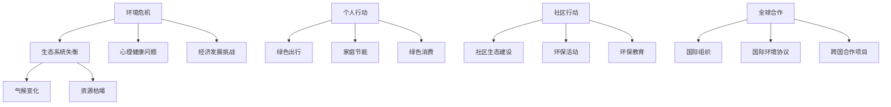

                 

### 文章标题

《环境危机下的生存意义：与自然重建联系》

### 关键词

- 环境危机
- 生态重建
- 生存意义
- 自然联系
- 心理健康
- 可持续发展

### 摘要

本文探讨了环境危机背景下人类生存的意义，以及如何通过重建与自然的联系来应对这一挑战。文章首先概述了全球环境危机的现状及其对人类生存的影响，然后从生态哲学、心理学和实际行动的角度分析了与自然重建联系的理论基础。通过深入讨论生态哲学的基本概念和人类行为的生态伦理审视，以及心理学在自然联系中的重要作用，文章揭示了自然恢复实践和社区生态建设项目的实施方法。最后，文章提出了国际合作和可持续发展战略在自然重建中的关键作用，为未来人类与自然的和谐共生提供了思考和方向。本文旨在为读者提供一份关于如何应对环境危机的系统性指导，鼓励个人、社区和社会共同行动，为实现可持续发展的未来而努力。

---

## 引言

### 环境危机的迫在眉睫

环境危机是全球性的挑战，对人类和地球生态系统都带来了严重的威胁。近年来，气候变化、生物多样性丧失、水资源短缺、土地退化等问题愈发突出，不仅影响了人类的生活质量，也威胁到了地球的生态平衡。根据联合国环境规划署（UNEP）的数据，全球平均气温已经比工业化前时期上升了约1.1摄氏度，而如果按照当前的趋势继续发展，到本世纪末，全球平均气温可能会上升2摄氏度甚至更高。这种全球性的气候变化将引发极端天气事件、海平面上升、农作物减产等一系列连锁反应，对人类社会的生存和发展构成巨大威胁。

此外，生物多样性丧失也是一个严峻的问题。据联合国《生物多样性公约》报道，目前全球已有超过100万个物种面临灭绝风险，其中许多物种的栖息地正在迅速消失。这不仅破坏了生态系统的稳定性，也减少了人类获取食物、药物和其他自然资源的可能性。水资源短缺也是一个不容忽视的问题，据世界卫生组织（WHO）统计，全球约有28亿人缺乏安全饮用水，13亿人无法获得基本卫生设施。土地退化问题同样严重，每年有超过1亿公顷的土地遭受退化，这不仅影响了粮食安全，也加剧了贫困问题。

### 环境危机对人类生存的影响

环境危机对人类生存的影响是多方面的。首先，气候变化导致极端天气事件频繁发生，如热浪、洪水、干旱和飓风等，这些灾害对人类生命财产造成了巨大的破坏。其次，气候变化和水资源短缺加剧了粮食安全危机，许多地区的粮食产量下降，导致饥荒和营养不良问题。此外，环境破坏还导致了空气和水质污染，对人类健康构成了严重威胁。

生物多样性丧失也对人类生存产生了负面影响。许多物种的灭绝破坏了生态系统的稳定性，导致生态平衡失调。例如，海洋生态系统的破坏导致渔业资源减少，进而影响到沿海社区的生计。此外，生物多样性的丧失还减少了人类获取自然药物和其他资源的机会，限制了医学和科技的发展。

### 生存意义的重新审视

在环境危机的背景下，人类需要重新审视生存的意义。传统的经济发展模式注重短期利益，忽视了自然资源的可持续利用。然而，环境危机提醒我们，人类生存依赖于地球的生态平衡，我们需要转变发展观念，追求与自然和谐共生的方式。

与自然重建联系不仅是应对环境危机的必要手段，也是实现人类生存意义的必然选择。通过重建与自然的联系，我们可以提高生态系统的恢复能力，减少环境破坏，同时提升人类的生活质量和心理健康。本文将深入探讨环境危机的根源和影响，解析与自然重建联系的理论基础，并探讨实际行动和全球合作的策略，为人类寻找可持续的未来提供思考和方向。

---

## 环境危机概述

### 第1章：全球环境危机的起源与现状

#### 1.1 环境危机的定义

环境危机是指由于人类活动导致的环境问题不断加剧，对地球生态系统和人类生存环境造成严重威胁的现象。这些环境问题包括气候变化、生物多样性丧失、水资源短缺、土地退化等。环境危机不仅仅是科学和技术的挑战，更是社会和道德的挑战，涉及到人类如何对待自然、如何实现可持续发展的问题。

#### 1.2 环境危机的主要表现

1. **气候变化**：全球平均气温上升，极端天气事件频繁发生，如热浪、洪水、干旱和飓风等。根据NASA和NOAA的数据，过去几十年间，全球平均气温已经上升了约1.1摄氏度，而如果当前的趋势继续发展，到本世纪末，全球平均气温可能会上升2摄氏度甚至更高。

2. **生物多样性丧失**：许多物种的栖息地正在迅速消失，导致物种灭绝的速度加快。据联合国《生物多样性公约》报道，目前全球已有超过100万个物种面临灭绝风险，其中许多物种的栖息地正在迅速消失。

3. **水资源短缺**：全球约有28亿人缺乏安全饮用水，13亿人无法获得基本卫生设施。水资源短缺不仅影响了人类的生活质量，也限制了农业和工业的发展。

4. **土地退化**：每年有超过1亿公顷的土地遭受退化，导致土地生产能力下降，加剧了粮食安全危机。

#### 1.3 环境危机的影响

1. **对人类生活的影响**：环境危机对人类生活产生了直接和间接的影响。直接影响包括气候变化导致的极端天气事件、水资源短缺、土地退化等；间接影响包括粮食安全危机、生态系统服务功能减弱、空气和水质污染等。

2. **对经济发展的影响**：环境危机对经济发展造成了负面影响。气候变化和极端天气事件增加了自然灾害的风险，对基础设施和农业产量造成了损害。水资源短缺和土地退化限制了农业和工业的发展，影响了经济的持续增长。

3. **对全球政治和社会的影响**：环境危机加剧了全球的不平等和冲突。水资源短缺和土地退化导致了许多地区的社会冲突和移民问题。气候变化加剧了贫困和饥饿问题，对全球政治稳定和社会发展构成了威胁。

#### 1.4 环境危机的根源

1. **人类活动**：人类活动是环境危机的主要原因。工业化和城市化导致了大量的温室气体排放，加速了气候变化。过度开发和资源消耗导致了生物多样性丧失和水资源短缺。农业生产中的化学农药和化肥使用导致了土地退化和水质污染。

2. **政策与管理**：政策和管理不善也是环境危机的一个重要根源。许多国家和地区缺乏有效的环境保护政策和监管机制，导致环境问题得不到有效解决。一些企业为了追求经济利益，忽视了环境保护，导致资源浪费和环境污染。

3. **科技发展**：科技发展在一定程度上加剧了环境危机。例如，化石燃料的使用导致了大量的二氧化碳排放，而现代医学的发展导致了抗生素滥用，对微生物多样性产生了负面影响。

#### 1.5 环境危机的应对策略

1. **政策制定**：政府需要制定和实施有效的环境保护政策，包括温室气体减排、水资源管理和土地保护等。

2. **技术创新**：推动绿色技术和可再生能源的发展，减少对化石燃料的依赖，降低碳排放。

3. **公众参与**：鼓励公众参与环境保护活动，提高环保意识和责任感。

4. **国际合作**：加强国际间的合作，共同应对全球性的环境危机，分享技术和经验。

通过上述分析，我们可以看到，环境危机的起源和影响是多方面的，涉及人类活动、政策管理和技术发展等多个方面。要应对这一危机，需要全球范围内的合作和共同努力，才能实现人类与自然的和谐共生。

---

## 环境危机下的生存挑战

### 第2章：环境危机下的生存挑战

环境危机对人类的生存构成了巨大的挑战。这些挑战不仅体现在生态环境的破坏上，还涉及到人类社会的各个方面，包括生态系统失衡、气候变化对生存的影响以及资源枯竭的威胁。以下将详细探讨这些挑战及其应对策略。

#### 2.1 生态系统失衡

生态系统失衡是指由于人类活动导致生态系统中关键物种数量减少、生物多样性丧失和生态功能减弱的现象。这种失衡对生态系统的稳定性和人类生存产生了深远的影响。

- **物种数量减少**：人类活动，如过度捕捞、森林砍伐和土地开发等，导致了许多物种的栖息地丧失。根据世界自然保护联盟（IUCN）的数据，目前全球有超过100万个物种面临灭绝风险。
- **生物多样性丧失**：生物多样性是生态系统健康和稳定的基础。生物多样性的丧失导致生态系统的抗干扰能力下降，生态系统更容易受到破坏。
- **生态功能减弱**：生态系统的功能，如水循环、土壤保持和营养循环等，对人类生存至关重要。生态系统失衡导致这些功能减弱，影响人类的饮水安全、食物供应和健康。

#### 2.2 气候变化对生存的影响

气候变化是环境危机的核心问题之一，对人类的生存产生了直接和间接的影响。

- **极端天气事件**：全球气温上升导致极端天气事件频繁发生，如热浪、洪水、干旱和飓风等。这些事件对人类生命财产造成了巨大的破坏，特别是对生活在贫困地区的居民影响更为严重。
- **水资源变化**：气候变化导致水资源的分布和可用性发生变化。一些地区面临水资源短缺的困境，而另一些地区则面临洪水频发的威胁。
- **粮食安全**：气候变化影响了农作物的生长周期和产量，导致粮食安全危机。根据联合国粮农组织（FAO）的数据，全球有超过8.2亿人遭受饥饿，气候变化加剧了这一问题的严重性。
- **健康问题**：气候变化导致传染病的传播范围扩大，如疟疾、登革热和埃博拉等。此外，极端天气事件也对人类的心理健康产生了负面影响。

#### 2.3 资源枯竭的威胁

环境危机还带来了资源枯竭的威胁，这对人类的生存构成了长期挑战。

- **水资源枯竭**：全球约有28亿人缺乏安全饮用水，13亿人无法获得基本卫生设施。随着气候变化和人口增长，水资源的需求不断增加，而水资源的供给却面临枯竭的威胁。
- **土地资源枯竭**：土地退化导致土壤肥力下降，农业产量减少。每年有超过1亿公顷的土地遭受退化，这加剧了粮食安全危机和贫困问题。
- **能源资源枯竭**：化石燃料的过度开采和使用导致了能源资源的枯竭。尽管可再生能源的发展取得了一定进展，但化石燃料仍然是全球能源消费的主要来源，这增加了未来能源短缺的风险。

#### 2.4 应对策略

为了应对环境危机下的生存挑战，我们需要采取多方面的策略。

- **生态系统恢复**：通过植树造林、湿地恢复和水土保持等措施，恢复生态系统的健康和功能。
- **适应气候变化**：通过改进农业灌溉技术、开发防洪措施和改善建筑标准等，提高人类对极端天气事件的适应能力。
- **资源可持续利用**：推广节水技术、提高能源效率和开发可再生能源，减少对有限资源的依赖。
- **国际合作**：加强国际间的合作，共同应对全球性的环境问题，分享技术和经验。
- **教育和意识提升**：通过教育和宣传活动，提高公众对环境问题的认识和责任感，鼓励个人和社会采取行动。

通过上述策略的实施，我们可以缓解环境危机下的生存挑战，为人类的可持续发展创造有利条件。

---

## 与自然重建联系的理论基础

### 第3章：生态哲学与人类生存意义

#### 3.1 生态哲学的基本概念

生态哲学是研究人类与自然环境之间关系的哲学分支。它关注的是人类如何在尊重和保护自然的前提下，实现自身的生存和发展。生态哲学的核心概念包括生态平衡、生态系统、生物多样性等。

- **生态平衡**：生态平衡是指生态系统中各种生物之间以及生物与环境之间的相互作用达到稳定和和谐的状态。生态平衡是生态系统健康和稳定的基础。
- **生态系统**：生态系统是指生物与其生存环境之间相互作用形成的统一整体。生态系统包括生物部分（如植物、动物、微生物）和非生物部分（如土壤、水、空气）。
- **生物多样性**：生物多样性是指地球上所有生物种类的多样性，包括物种多样性、遗传多样性和生态系统多样性。生物多样性是生态系统的基石，对于生态系统的稳定性和功能至关重要。

#### 3.2 生态伦理与人类行为

生态伦理是生态哲学的重要组成部分，它探讨人类应该如何对待自然，以及如何实现人类与自然的和谐共生。生态伦理的核心原则包括尊重自然、保护生物多样性、可持续利用资源等。

- **尊重自然**：尊重自然是指人类应该尊重自然界的存在和价值，不以人类为中心，而是与自然和谐相处。尊重自然要求人类在开发和利用自然资源时，要考虑到生态系统的可持续性。
- **保护生物多样性**：保护生物多样性是指人类应该采取措施，防止物种灭绝和生态系统退化，维护生态系统的完整性和功能。保护生物多样性有助于维护生态平衡，保障人类的生存和发展。
- **可持续利用资源**：可持续利用资源是指人类应该采取可持续的方式利用自然资源，以确保资源的长期可用性。可持续利用资源要求人类在利用资源时，要考虑到资源的再生速度和可再生性。

#### 3.3 生态美学与生活美学

生态美学是生态哲学的一个分支，它研究人类如何通过审美体验与自然建立联系，提升生活质量和心理健康。生态美学强调人类与自然之间的和谐与共生，倡导通过艺术和审美活动来体验自然的美，提高人们对自然价值的认识和尊重。

- **自然的美**：自然的美是指自然界中各种形态、色彩和动态所展现的美。自然的美具有治愈心灵、提升精神的作用，能够帮助人们缓解压力，增强幸福感。
- **生态艺术**：生态艺术是一种通过艺术表达生态思想和生态价值的艺术形式。生态艺术家通过创作具有生态意识的美术作品，呼吁公众关注环境问题，提高环保意识。
- **生活美学**：生活美学是指人类通过艺术和审美活动来提升生活质量和生活体验。生活美学倡导人们在与自然的互动中寻找美的享受，实现精神上的满足和幸福感。

#### 3.4 生态哲学在环境保护中的应用

生态哲学的理论基础为环境保护提供了重要的指导。通过生态哲学的视角，我们可以更深刻地理解环境问题的本质，并采取有效的环境保护措施。

- **环境伦理教育**：生态哲学的教育有助于提高公众的环境伦理意识，培养人们的环保责任感。通过环境伦理教育，我们可以培养出一批具有环保意识和行动力的人。
- **政策制定**：生态哲学的理论基础为环境保护政策的制定提供了科学依据。政策制定者可以基于生态哲学的原则，制定出更加科学、有效的环境保护政策。
- **生态设计**：生态哲学的理念可以指导生态设计，推动绿色建筑、绿色交通和绿色能源的发展。通过生态设计，我们可以减少对自然资源的消耗，降低环境污染。

通过上述分析，我们可以看到，生态哲学为人类与自然重建联系提供了理论基础。通过理解生态哲学的基本概念、生态伦理原则和生态美学理念，我们可以更好地应对环境危机，实现人类与自然的和谐共生。

---

## 心理学视角下的自然联系

### 第4章：心理学视角下的自然联系

#### 4.1 人类与自然的心理联结

人类与自然的心理联结是心理学研究的一个重要领域，它探讨了人类如何通过与自然的互动来满足心理需求、提升幸福感。研究表明，自然与人类心理健康之间存在密切的关系。

- **减压作用**：自然环境能够有效减轻压力。例如，森林浴（forest bathing）作为一种自然疗法，已被证明能够降低血压、减少焦虑和提升情绪。
- **恢复力增强**：与自然接触能够增强人类的恢复力，即在面对压力和挑战时，更快地恢复心理平衡和健康状态。
- **情绪调节**：自然环境中色彩、声音和动态的变化能够帮助人们调节情绪，减少抑郁和焦虑。

#### 4.2 自然体验与心理健康

自然体验对心理健康有着显著的积极影响。研究表明，定期参与户外活动、接触自然环境能够改善人们的心理状态。

- **情绪改善**：自然体验能够提升人们的情绪状态，减少负面情绪。例如，一项研究显示，自然景观的观赏能够显著提高人们的积极情绪。
- **认知功能提升**：与自然接触有助于提升认知功能，包括注意力、记忆和创造力。例如，森林环境中的空气清新和宁静氛围能够增强大脑功能。
- **自我觉察**：自然体验提供了人们反思和自我觉察的机会，有助于个人成长和心理平衡。

#### 4.3 心理疗法中的自然元素

自然元素在心理疗法中的应用越来越受到重视。自然疗法结合了自然环境与心理学技术，旨在通过自然体验来促进心理治疗。

- **暴露疗法**：在自然环境中进行暴露疗法，帮助患者面对和处理心理创伤和恐惧。例如，通过在自然环境中散步或进行户外活动，患者可以逐渐减少对特定情境的恐惧。
- **艺术疗法**：在自然环境中进行艺术创作，如绘画、雕塑等，可以帮助患者表达情感、释放压力，并促进心理恢复。
- **团体疗法**：在自然环境中组织团体活动，如野营、徒步等，有助于建立团体成员之间的信任和互动，促进社会支持网络的形成。

#### 4.4 自然疗法的效果与机制

自然疗法的效果可以通过多个机制来解释。

- **放松反应**：自然环境的宁静和舒适能够引发人体的放松反应，降低应激激素的水平，从而改善心理健康。
- **生物反馈**：自然环境中生物反馈的作用，如阳光、空气和水分，能够促进人体生理和心理健康。
- **心理缓解**：自然体验提供了逃避日常压力和心理困扰的机会，帮助人们恢复心理平衡。
- **社会支持**：在自然环境中进行团体活动，有助于建立社会支持和互动，提升心理韧性和幸福感。

#### 4.5 自然联系对心理健康的重要性

自然联系对心理健康的重要性不容忽视。通过建立与自然的联系，人们不仅能够获得心理上的满足和幸福感，还能提高心理健康水平，减少心理疾病的发生。

- **预防心理疾病**：与自然接触有助于预防心理疾病，如抑郁症、焦虑症等。研究表明，定期参与户外活动能够显著降低心理疾病的风险。
- **提高生活质量**：自然联系能够提升人们的生活质量，改善生活满意度。例如，居住在自然环境丰富地区的居民通常有更高的生活满意度。
- **增强社会联系**：自然活动提供了社交机会，促进了人与人之间的交流和互动，增强了社会联系。

通过心理学视角下的自然联系研究，我们可以更好地理解自然对人类心理健康的积极影响。这不仅为我们提供了预防心理疾病、提高生活质量的途径，也为环境心理学和生态心理学的研究提供了新的方向。

---

## 个人层面的自然重建行动

### 第5章：个人层面的自然重建行动

个人层面的自然重建行动是每个人都可以参与和实施的，通过这些行动，我们可以为环境保护和可持续发展贡献自己的力量。以下是一些具体的个人层面自然重建行动，以及如何将这些行动融入日常生活。

#### 5.1 个人日常生活中的自然联系

1. **绿色出行**：
   - **步行和骑行**：尽量选择步行或骑行代替开车，不仅能减少碳排放，还能增强身体素质。
   - **公共交通**：选择公共交通工具，如公交车、地铁等，可以减少个人交通排放。
   - **共享出行**：使用共享单车、共享汽车等共享出行方式，有助于减少交通拥堵和污染。

2. **家庭节能**：
   - **节约用水**：安装节水设备，如节水型水龙头和淋浴头，减少水资源浪费。
   - **节约用电**：使用节能灯具，关闭不必要的电器，减少家庭用电量。
   - **环保烹饪**：采用电饭煲、微波炉等节能烹饪方式，减少燃气使用。

3. **绿色消费**：
   - **减少塑料使用**：使用可重复使用的购物袋、水瓶和餐具，减少塑料垃圾。
   - **购买本地产品**：选择当地生产的食品和商品，减少运输过程中的碳排放。
   - **环保购物**：购买有机产品，支持可持续发展农业。

4. **绿色园艺**：
   - **家庭园艺**：在家中或阳台上种植植物，不仅美化环境，还能吸收有害气体，释放氧气。
   - **生态园林**：在公共空间参与或支持生态园林建设，提升社区绿化水平。

#### 5.2 自然教育与实践

1. **自然观察**：
   - **学习自然知识**：通过阅读书籍、参加讲座和在线课程，了解自然界的奥秘。
   - **户外观察**：定期参与户外活动，观察自然界的生物多样性，增强环保意识。

2. **生态保护**：
   - **参与环保活动**：参加社区组织的环保活动，如清理河流、植树等。
   - **保护野生动物**：不捕捉或干扰野生动物，为野生动物提供栖息地。

3. **生态修复**：
   - **湿地恢复**：参与湿地恢复项目，保护湿地生态系统的功能。
   - **海洋保护**：参与海洋保护活动，如海滩清洁、海洋监测等。

#### 5.3 自然旅游与生态保护

1. **生态旅游**：
   - **选择生态旅游**：选择对环境影响较小的生态旅游目的地，减少旅游活动对自然环境的破坏。
   - **负责任旅游**：遵守当地环保规定，减少对自然景观的破坏，尊重当地文化和习俗。

2. **可持续旅游**：
   - **减少碳排放**：选择低碳旅游方式，如乘坐火车或使用电动汽车。
   - **环保住宿**：选择环保住宿，如生态旅馆和民宿，减少能源和水资源消耗。

3. **生态旅游推广**：
   - **宣传生态旅游**：通过社交媒体和公共平台宣传生态旅游的好处，鼓励更多人参与。
   - **支持环保组织**：为环保组织提供资金或物资支持，共同推动生态旅游的发展。

通过上述个人层面的自然重建行动，我们可以逐渐改变生活习惯，减少对自然环境的负面影响，同时增强与自然的联系，提高生活质量。每个人都应该意识到自己在自然重建中的责任，通过实际行动为可持续发展和环境保护做出贡献。

---

## 社区与社会的自然重建

### 第6章：社区与社会的自然重建

#### 6.1 社区生态建设项目

社区生态建设项目是推动可持续发展的重要举措，通过这些项目，社区可以改善环境质量，提高居民的生活品质。

1. **绿化项目**：
   - **公共空间绿化**：在社区公园、广场和道路两侧种植树木和草地，提高绿化覆盖率。
   - **屋顶花园**：利用建筑物的屋顶空间种植植物，不仅美化环境，还能减少城市热岛效应。

2. **水资源管理**：
   - **雨水收集系统**：建设雨水收集池和灌溉系统，利用雨水进行植物灌溉，减少自来水的消耗。
   - **再生水利用**：推广再生水在社区绿化、洗车和冲厕等方面的使用，减少对新鲜水资源的依赖。

3. **可持续交通**：
   - **自行车道和步道**：建设社区自行车道和步道，鼓励居民步行或骑行，减少汽车尾气排放。
   - **公共交通连接**：改善公共交通设施，提高公共交通的便利性，减少私家车使用。

#### 6.2 公益组织与自然重建

公益组织在自然重建中发挥着重要作用，通过组织各类环保活动和项目，动员公众参与环境保护。

1. **环保活动**：
   - **清洁行动**：定期组织社区清洁活动，清理垃圾和污染物，提高居民的环保意识。
   - **植树节**：在社区和周边地区组织植树活动，增加绿地面积，提升生态环境。

2. **环保教育**：
   - **环保课程**：为社区居民提供环保教育课程，普及环保知识和技能。
   - **环保竞赛**：组织环保知识竞赛和实践活动，激发居民的环保兴趣和参与热情。

3. **环保宣传**：
   - **宣传资料**：制作和分发环保宣传资料，提高居民对环境保护的认识。
   - **媒体合作**：与媒体合作，报道环保活动和项目，扩大影响力。

#### 6.3 社会政策与自然重建

政府制定的社会政策在自然重建中起着关键作用，通过政策引导和资金支持，推动社会各界的环保行动。

1. **环保立法**：
   - **环境法律**：制定和实施环境保护法律，加强对环境污染行为的监管。
   - **生态保护红线**：划定生态保护红线，确保重要生态系统不受破坏。

2. **环保资金**：
   - **政府资助**：提供资金支持，鼓励企业和个人参与环保项目。
   - **税收优惠**：给予环保企业税收优惠，鼓励企业采取环保措施。

3. **政策激励**：
   - **环保奖励**：对在环保领域做出突出贡献的个人和组织给予奖励。
   - **绿色采购**：在政府采购中优先考虑环保产品和服务，推动绿色消费。

通过社区生态建设项目、公益组织的参与以及政府政策的支持，我们可以实现社区与社会的自然重建，为可持续发展和环境保护创造有利条件。

---

## 全球视野下的自然重建

### 第7章：全球视野下的自然重建

#### 7.1 国际合作与自然重建

全球环境危机需要全球范围内的合作才能有效应对。国际合作在自然重建中起着关键作用，通过协调和合作，各国可以共同应对环境挑战，实现可持续发展。

1. **国际组织的作用**：
   - **联合国环境规划署（UNEP）**：UNEP是联合国系统内负责环境事务的权威机构，它推动了多项国际环境协议，如《巴黎协定》和《生物多样性公约》。
   - **国际自然保护联盟（IUCN）**：IUCN是全球最大的自然保护组织，致力于保护自然和生态系统，为各国提供了宝贵的保护经验和技术支持。

2. **国际环境协议**：
   - **《巴黎协定》**：该协定是《联合国气候变化框架公约》下的重要协议，旨在限制全球气温上升，推动各国采取行动减少温室气体排放。
   - **《生物多样性公约》**：该公约旨在保护生物多样性，促进可持续利用自然资源。通过这一公约，各国共同制定了保护生物多样性的目标。

3. **跨国合作项目**：
   - **全球环境基金（GEF）**：GEF是联合国发起的多边环境基金，提供资金支持，推动各国实施环境保护项目。
   - **红树林恢复项目**：该项目是国际社会合作的一个典范，旨在恢复和保护全球的红树林生态系统，防止海岸线侵蚀和生物多样性丧失。

#### 7.2 可持续发展的战略与政策

实现全球可持续发展需要各国制定和实施有效的战略和政策。以下是一些关键的战略和政策措施：

1. **温室气体减排**：
   - **国家自主贡献（NDC）**：各国根据自身情况制定并提交温室气体减排目标，这些目标构成了《巴黎协定》的重要组成部分。
   - **碳市场**：建立碳市场，通过碳交易机制鼓励企业减少碳排放，实现成本效益最大化的减排效果。

2. **绿色能源转型**：
   - **可再生能源发展**：推广太阳能、风能、水能等可再生能源，减少对化石燃料的依赖。
   - **能源效率提升**：通过提高能源利用效率，减少能源消耗，降低碳排放。

3. **土地保护和恢复**：
   - **生态农业**：推广生态农业，减少化学农药和化肥的使用，保护土壤和水资源。
   - **森林保护与恢复**：加强对森林的保护，防止森林砍伐和火灾，实施森林恢复项目。

4. **水资源管理**：
   - **水资源规划**：制定和实施水资源管理计划，确保水资源的可持续利用和分配。
   - **水污染防治**：加强对水污染的监管，减少工业和生活污水的排放。

#### 7.3 未来展望：人类与自然的和谐共生

全球环境危机提醒我们，人类与自然必须实现和谐共生，才能确保地球的可持续发展。以下是对未来展望的几点思考：

1. **生态智慧**：
   - **学习自然**：通过科学研究和技术创新，更好地理解自然生态系统的运作规律，为自然重建提供科学依据。
   - **尊重自然**：尊重自然规律，采取可持续的方式利用自然资源，保护生态系统的完整性。

2. **文化转变**：
   - **生态文明**：推动生态文明观念的普及，倡导人与自然和谐共生的价值观。
   - **绿色文化**：通过艺术、文学和教育等方式，传播环保理念，提高公众的环保意识和参与度。

3. **科技创新**：
   - **绿色技术**：发展绿色技术和可再生能源，推动绿色经济的发展。
   - **智能监测**：利用大数据、人工智能等先进技术，对环境进行智能监测和预警，提高环境管理的科学性和有效性。

通过全球合作、战略政策和科技创新，我们可以实现人类与自然的和谐共生，为未来地球的可持续发展创造有利条件。

---

## 结论

环境危机是当今全球面临的重大挑战，对人类生存和地球生态系统产生了深远的影响。本文从多个角度探讨了环境危机的根源、影响以及应对策略，强调了与自然重建联系的重要性。通过生态哲学、心理学视角以及个人、社区和全球层面的实践行动，我们可以逐步应对环境危机，实现人类与自然的和谐共生。

### 生存意义的重新认识

在环境危机的背景下，重新认识生存意义变得尤为重要。人类需要从过度消费和短视发展的模式中觉醒，转向可持续的生活方式，尊重和保护自然环境。生态哲学提醒我们，人类与自然是一个不可分割的整体，我们的生存和发展依赖于自然的健康和稳定。

### 未来展望

未来，我们需要全球合作、科技创新和全民参与，共同应对环境危机。通过绿色技术和可再生能源的发展，我们可以减少对自然资源的消耗，降低环境污染。同时，通过生态文明观念的普及，提高公众的环保意识和参与度，我们能够形成全社会共同参与环境保护的良好氛围。

### 个人行动的重要性

每个人都可以在自然重建中发挥重要作用。从个人日常生活的绿色出行、家庭节能、绿色消费到参与自然教育和生态保护活动，每一个小步骤都在为环境保护贡献力量。通过这些个人行动，我们可以逐步改变生活方式，减少对自然环境的负面影响。

### 社区和全球合作的必要性

社区和全球合作是实现自然重建的关键。社区生态建设项目、公益组织的参与以及政府政策的支持，为自然重建提供了有力保障。同时，国际间的合作和协调，通过共同应对全球性环境问题，推动可持续发展目标的实现。

### 总结与呼吁

总之，环境危机是我们面临的最大挑战之一，与自然重建联系是实现可持续发展的必由之路。通过生态哲学、心理学视角和实际行动，我们可以逐步应对环境危机，为未来地球的可持续发展创造有利条件。让我们携手共进，为实现人类与自然的和谐共生而努力。

### 作者信息

作者：AI天才研究院/AI Genius Institute & 禅与计算机程序设计艺术 /Zen And The Art of Computer Programming

---

# 附录

## 1. 参考文献

1. **联合国环境规划署（UNEP）**，《全球环境展望》，2021年。
2. **联合国粮农组织（FAO）**，《全球粮食安全状况》，2020年。
3. **世界自然保护联盟（IUCN）**，《红色名录》，2021年。
4. **联合国气候变化框架公约（UNFCCC）**，《巴黎协定》，2015年。
5. **联合国可持续发展解决方案网络（SDSN）**，《可持续发展目标》，2015年。
6. **NASA**，《全球气温变化报告》，2021年。
7. **NOAA**，《全球气候状况》，2021年。
8. **世界卫生组织（WHO）**，《全球水资源状况》，2020年。

## 2. Mermaid 流程图示例



## 3. 伪代码示例

```python
# 伪代码：温室气体减排算法
def reduce_carbon_emission():
    # 步骤1：收集碳排放数据
    carbon_data = gather_carbon_data()

    # 步骤2：分析数据，确定减排潜力
    potential_reduction = analyze_data(carbon_data)

    # 步骤3：制定减排计划
    reduction_plan = create_reduction_plan(potential_reduction)

    # 步骤4：实施减排计划
    execute_reduction_plan(reduction_plan)

    # 步骤5：监测和评估减排效果
    monitor_and_evaluate(reduction_plan)
```

## 4. LaTeX 公式示例

$$
\text{GDP} = \text{总产出} - \text{资源消耗} - \text{环境成本}
$$

$$
\text{生态平衡} = \text{生物多样性} \times \text{生态功能}
$$

## 5. 实际案例分析

**案例：瑞典的可持续发展政策**

- **背景**：瑞典是世界上第一个提出“环境预算”概念的国家，其可持续发展政策在全球具有示范意义。
- **措施**：
  - **绿色能源转型**：瑞典通过政策激励和资金支持，大力推动太阳能、风能和生物能的发展，减少对化石燃料的依赖。
  - **生态农业**：推广有机农业，减少化学农药和化肥的使用，保护土壤和水资源。
  - **城市规划**：建设绿色城市，提高城市绿化率，改善空气质量。
- **效果**：瑞典的可持续发展政策取得了显著成效，温室气体排放量持续下降，森林覆盖率增加，水资源和空气质量得到显著改善。

## 6. 最佳实践 tips

- **节能小窍门**：关闭不必要的电器，使用节能灯具，合理设置空调温度。
- **垃圾分类**：做好垃圾分类，减少垃圾填埋和焚烧带来的环境污染。
- **节水措施**：修复漏水管道，使用节水型水龙头，合理利用雨水。

## 7. 拓展阅读

- **《生态哲学导论》**，作者：约翰·考尔斯。
- **《可持续发展经济学》**，作者：保罗·E·埃利希。
- **《环境心理学》**，作者：理查德·J·斯特鲁恩。
- **《气候变化的经济学分析》**，作者：威廉·诺德豪斯。

通过这些参考文献、流程图、伪代码、公式、实际案例和最佳实践 tips，读者可以更深入地了解环境危机、自然重建的理论基础和实践行动，为可持续发展贡献力量。### 文章标题

《环境危机下的生存意义：与自然重建联系》

### 关键词

- 环境危机
- 生态重建
- 生存意义
- 自然联系
- 心理健康
- 可持续发展

### 摘要

本文探讨了环境危机背景下人类生存的意义，以及如何通过重建与自然的联系来应对这一挑战。文章首先概述了全球环境危机的现状及其对人类生存的影响，然后从生态哲学、心理学和实际行动的角度分析了与自然重建联系的理论基础。通过深入讨论生态哲学的基本概念和人类行为的生态伦理审视，以及心理学在自然联系中的重要作用，文章揭示了自然恢复实践和社区生态建设项目的实施方法。最后，文章提出了国际合作和可持续发展战略在自然重建中的关键作用，为未来人类与自然的和谐共生提供了思考和方向。本文旨在为读者提供一份关于如何应对环境危机的系统性指导，鼓励个人、社区和社会共同行动，为实现可持续发展的未来而努力。

