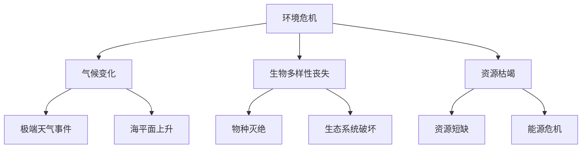
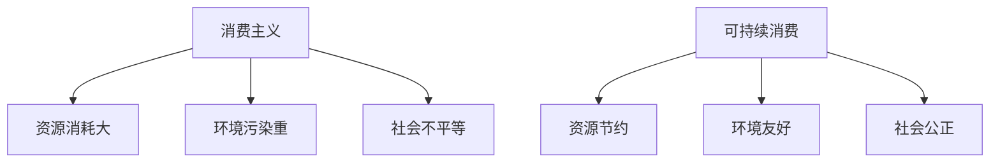
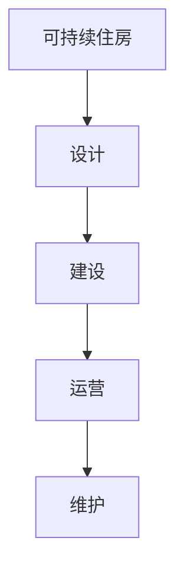
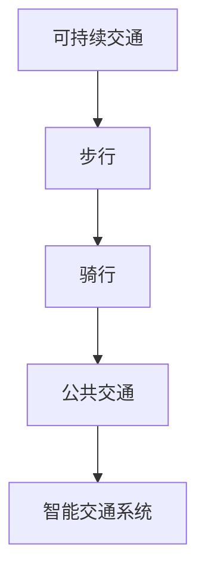
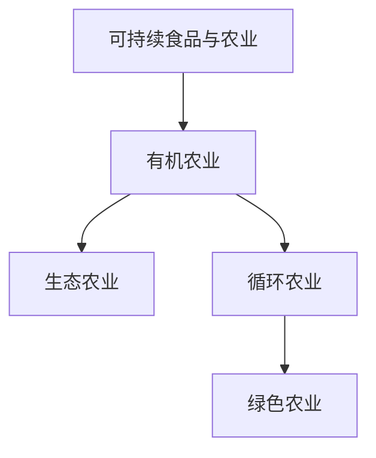
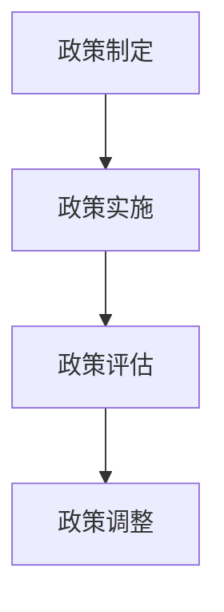
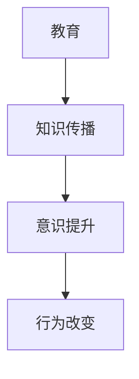
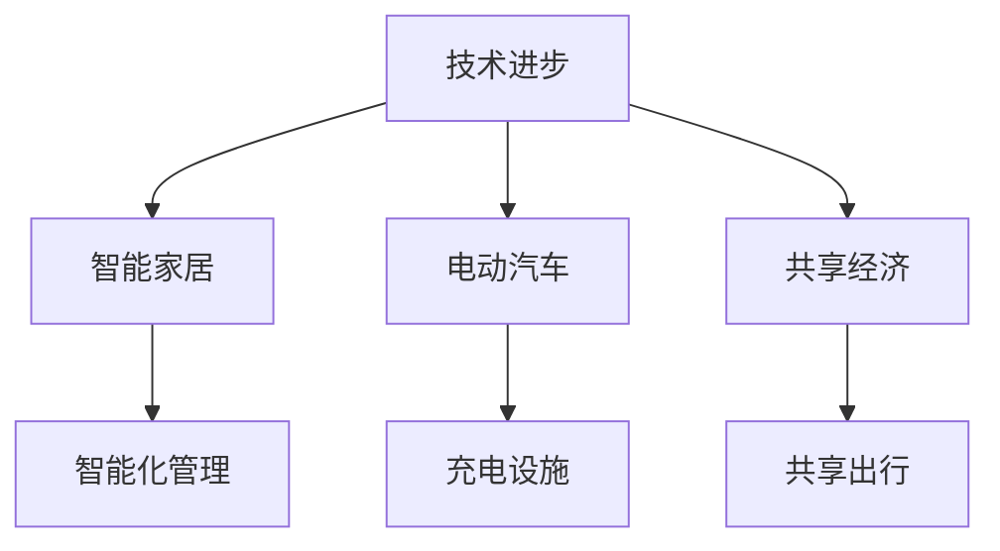

                 

### 文章标题：环境危机下的生活方式革新：从消费主义到可持续发展

#### 关键词：环境危机、消费主义、可持续发展、生活方式革新、可持续发展实践、政策推动、教育与意识提升

> _摘要：本文从环境危机的起源与发展、消费主义与环境危机的关联、可持续发展的概念与目标等多个角度，探讨了在环境危机下如何实现生活方式的革新，从消费主义转向可持续发展。通过详细分析可持续住房、可持续交通、可持续食品与农业等领域的实践方法，以及政策推动与教育意识提升的作用，本文提出了生活方式革新的未来趋势和对策，为全球环境危机的解决提供了可行的路径。_

---

### 引言

#### 第1章：环境危机现状

- **1.1 环境危机的起源与发展**：介绍环境危机的起源和演变过程，分析其产生的原因和主要特征。
- **1.2 环境危机的主要表现**：阐述环境危机在气候变化、生物多样性丧失、资源枯竭等方面的表现。
- **1.3 消费主义与环境危机的关联**：探讨消费主义对环境危机的影响，解释消费主义与可持续发展之间的矛盾。
- **1.4 可持续发展的概念与目标**：阐述可持续发展的定义和目标，分析其重要性。
- **1.5 可持续发展的现状与挑战**：介绍当前全球可持续发展的情况和面临的挑战。
- **1.6 本书的结构与目标**：概述本书的结构安排和主要目标，为读者提供阅读指南。

#### 图1.1：环境危机的概念框架图


#### 表1.1：可持续发展目标

| 目标               | 描述                                                         |
|--------------------|--------------------------------------------------------------|
| 无贫穷             | 消除所有形式的贫困，实现包容性经济增长                         |
| 社会包容性         | 减少不平等，提供平等机会，促进社会凝聚力                       |
| 良好健康与福祉     | 提高健康水平，实现健康的生活方式，确保获得优质医疗服务       |
| 质量教育           | 提供全面优质的教育，提高技能和知识，促进终身学习               |
| 性别平等           | 实现性别平等，赋予女性同等权利，消除性别歧视                   |
| 清洁饮水与卫生设施 | 提供安全、清洁的饮用水和卫生设施，确保健康生活条件           |
| 可持续城市和社区   | 促进可持续城市化和社区发展，改善城市基础设施和服务             |
| 良好的工作与经济增长 | 促进包容性经济增长，创造就业机会，提高生产力                   |
| 产业创新与基础设施 | 促进可持续技术和基础设施的发展，实现可持续工业化               |
| 减缓气候变化       | 减少温室气体排放，增强气候适应能力，保护生态系统             |
| 生活与生态系统     | 保护海洋和陆地生态系统，促进生物多样性，实现可持续农业         |
| 资源效率与浪费     | 提高资源利用效率，减少浪费，推动循环经济                     |
| 均衡的全球贸易     | 促进公平、平衡的全球贸易体系，减少贫困，促进可持续发展         |

#### 第2章：消费主义到可持续消费

- **2.1 消费主义的影响**：分析消费主义对环境、社会和经济的影响。
- **2.2 可持续消费的核心理念**：介绍可持续消费的定义、原则和目标。
- **2.3 可持续消费的实践方法**：探讨如何在实际生活中实施可持续消费。
- **2.4 可持续消费的案例分析**：通过具体案例说明可持续消费的实际效果。
- **2.5 可持续消费的挑战与对策**：分析可持续消费面临的挑战和解决对策。

#### 图2.1：消费主义与可持续消费的比较图


#### 表2.1：可持续消费的主要实践方法

| 方法               | 描述                                                         |
|--------------------|--------------------------------------------------------------|
| 减少购买           | 减少不必要的购买，优化消费习惯                               |
| 二手商品购买       | 提倡购买二手商品，减少资源浪费和环境污染                     |
| 环保产品选择       | 选择环保材料和生产工艺的产品，减少环境污染                   |
| 包装回收与循环利用 | 实施包装回收和循环利用，减少废弃物排放                       |
| 绿色出行           | 鼓励步行、骑行和公共交通出行，减少汽车尾气排放               |
| 能源节约           | 提高能源利用效率，减少能源消耗，降低碳排放                   |
| 节约用水           | 实施节水措施，减少水资源消耗，保护水资源                     |
| 绿色饮食           | 提倡绿色饮食，减少肉食消费，减少温室气体排放                 |
| 可持续旅游         | 推广可持续旅游，减少旅游对环境的负面影响                     |

#### 第3章：可持续住房

- **3.1 可持续住房的概念与原则**：介绍可持续住房的定义和设计原则。
- **3.2 可持续住房的设计与建设**：探讨可持续住房的设计理念和技术。
- **3.3 可持续住房的运营与维护**：分析可持续住房的运营和维护方法。
- **3.4 可持续住房的案例分析**：通过具体案例说明可持续住房的实际效果。
- **3.5 可持续住房的挑战与对策**：分析可持续住房面临的挑战和解决对策。

#### 图3.1：可持续住房流程图


#### 表3.1：可持续住房的主要实践方法

| 方法               | 描述                                                         |
|--------------------|--------------------------------------------------------------|
| 节能建筑           | 利用建筑设计和建筑材料实现能源节约                             |
| 绿色建材           | 使用环保材料，减少环境污染                                   |
| 太阳能利用         | 利用太阳能等可再生能源提供电力和热水                         |
| 雨水收集与利用     | 收集雨水用于绿化、冲厕等，减少水资源消耗                     |
| 温室气体减排       | 通过建筑设计和技术手段减少温室气体排放                       |
| 废弃物管理         | 实施垃圾分类和回收利用，减少废弃物排放                       |
| 社区互动           | 推动社区参与可持续住房的建设和运营，提高居民环保意识         |

#### 第4章：可持续交通

- **4.1 可持续交通的概念与原则**：介绍可持续交通的定义和设计原则。
- **4.2 可持续交通的出行方式**：探讨步行、骑行、公共交通等可持续出行方式。
- **4.3 可持续交通的案例分析**：通过具体案例说明可持续交通的实际效果。
- **4.4 可持续交通的挑战与对策**：分析可持续交通面临的挑战和解决对策。

#### 图4.1：可持续交通流程图


#### 表4.1：可持续交通的主要实践方法

| 方法               | 描述                                                         |
|--------------------|--------------------------------------------------------------|
| 步行与骑行         | 提倡步行和骑行，减少汽车出行，提高城市空气质量               |
| 公共交通优化       | 提高公共交通服务质量，吸引更多人使用公共交通，减少私家车出行 |
| 智能交通系统       | 利用智能交通系统提高交通效率，减少拥堵和交通事故           |
| 车辆排放控制       | 提高汽车排放标准，推广电动汽车和清洁能源车辆               |
| 交通基础设施建设   | 增加自行车道、步行道和公共交通站点，提高出行便捷性         |
| 出行计划与管理     | 提供出行计划工具，帮助用户选择最佳出行方式，减少碳排放       |

#### 第5章：可持续食品与农业

- **5.1 可持续食品的概念与原则**：介绍可持续食品的定义和设计原则。
- **5.2 可持续食品的获取与消费**：探讨如何获取和消费可持续食品。
- **5.3 可持续农业的实践方法**：分析可持续农业的技术和方法。
- **5.4 可持续农业的案例分析**：通过具体案例说明可持续农业的实际效果。
- **5.5 可持续农业的挑战与对策**：分析可持续农业面临的挑战和解决对策。

#### 图5.1：可持续食品与农业流程图


#### 表5.1：可持续食品与农业的主要实践方法

| 方法               | 描述                                                         |
|--------------------|--------------------------------------------------------------|
| 有机农业           | 使用有机肥料和生物防治技术，减少化学农药和化肥的使用         |
| 生态农业           | 保护生态系统，维护生物多样性，实现农业生态平衡               |
| 循环农业           | 利用农业废弃物和副产品，减少资源浪费，提高资源利用效率       |
| 绿色农业           | 推广环保技术和方法，减少环境污染，提高农业生产效益         |
| 食品溯源           | 建立食品溯源体系，提高食品安全性和消费者信任度               |
| 绿色包装           | 使用环保包装材料，减少包装废弃物对环境的影响               |
| 消费者教育         | 提高消费者对可持续食品的认识，鼓励绿色消费行为               |

#### 第6章：政策推动与法律框架

- **6.1 政策在可持续发展中的角色**：探讨政策在推动可持续发展中的重要作用。
- **6.2 可持续发展的法律法规体系**：介绍全球和各国可持续发展的法律法规体系。
- **6.3 政策案例分析**：通过具体案例说明政策的实施效果。
- **6.4 政策实施的挑战与对策**：分析政策实施面临的挑战和解决对策。

#### 图6.1：政策推动流程图


#### 表6.1：主要可持续发展政策

| 政策名称                             | 描述                                                         |
|--------------------------------------|--------------------------------------------------------------|
| 联合国可持续发展目标（SDGs）         | 包含17个目标，涉及消除贫困、健康、教育、环境等多个方面       |
| 欧盟绿色新政（EU Green Deal）        | 以实现碳中和为目标，推动经济转型，提高能源效率，保护生物多样性 |
| 中国生态文明体制改革总体方案        | 推动生态文明建设，实现绿色发展，提高资源利用效率             |
| 美国清洁能源计划（Clean Energy Plan） | 促进清洁能源发展，减少温室气体排放，实现能源独立             |
| 日本环境基本法                       | 规定环境保护的基本政策和措施，推动可持续发展                 |

#### 第7章：教育与意识提升

- **7.1 教育在可持续发展中的作用**：探讨教育在推动可持续发展中的重要作用。
- **7.2 可持续教育的内容与形式**：介绍可持续教育的内容和形式。
- **7.3 意识提升的策略与实践**：探讨如何提升公众对可持续发展的意识。
- **7.4 教育与意识提升的案例分析**：通过具体案例说明教育与意识提升的实际效果。
- **7.5 教育与意识提升的挑战与对策**：分析教育与意识提升面临的挑战和解决对策。

#### 图7.1：教育与意识提升流程图


#### 表7.1：教育与意识提升的主要策略

| 策略               | 描述                                                         |
|--------------------|--------------------------------------------------------------|
| 教育普及           | 通过学校、社区等渠道普及可持续发展知识，提高公众意识         |
| 媒体宣传           | 利用电视、广播、互联网等媒体宣传可持续发展理念，吸引公众关注 |
| 实践活动           | 组织社区活动、志愿服务等，让公众参与可持续发展实践         |
| 意识培养           | 通过展览、讲座等形式培养公众的可持续发展意识                 |
| 教育改革           | 推动教育体系改革，将可持续发展理念融入课程和教学活动中       |
| 奖励机制           | 设立奖励制度，鼓励公众参与可持续发展活动和项目               |

#### 第8章：生活方式革新的未来趋势

- **8.1 可持续生活方式的未来发展**：探讨可持续生活方式的未来发展趋势。
- **8.2 技术创新与生活方式革新**：分析技术创新在生活方式革新中的作用。
- **8.3 社会变革与生活方式革新**：探讨社会变革对生活方式革新带来的影响。
- **8.4 可持续发展的长期目标**：阐述可持续发展的长期目标和实现路径。

#### 图8.1：生活方式革新的未来趋势图


#### 表8.1：未来生活方式革新的主要趋势

| 趋势               | 描述                                                         |
|--------------------|--------------------------------------------------------------|
| 智能化           | 利用物联网、人工智能等技术，实现生活设备的智能化管理       |
| 数字化           | 利用数字技术，实现生活数据的收集、分析和应用             |
| 共享化           | 推广共享经济模式，减少资源浪费，提高资源利用效率         |
| 绿色化           | 推广绿色生活方式，减少对环境的负面影响，实现可持续发展     |
| 个性化           | 提供个性化服务，满足不同用户的需求                       |
| 平台化           | 建立共享平台，促进不同领域之间的协作和整合                 |

#### 第9章：结论

- **9.1 全书总结**：总结全书的主要内容和观点，强调生活方式革新的重要性。
- **9.2 政策建议**：提出推动生活方式革新的政策建议。
- **9.3 未来研究方向**：探讨未来研究方向和可能的创新点。

#### 表9.1：生活方式革新的关键因素

| 因素           | 描述                                                         |
|----------------|--------------------------------------------------------------|
| 消费习惯       | 转变消费习惯，减少资源浪费和环境污染                       |
| 技术创新       | 利用技术创新，提高资源利用效率，减少碳排放                 |
| 政策支持       | 推动政策制定和实施，为生活方式革新提供法律和制度保障       |
| 教育意识       | 提高公众对可持续发展的认识，培养绿色消费行为               |
| 社会参与       | 鼓励公众参与可持续发展实践，提高社会凝聚力和责任感         |
| 国际合作       | 加强国际合作，共同应对全球环境危机，推动可持续发展         |

### 附录

#### 附录A：参考文献

- [1] United Nations. (2015). Sustainable Development Goals. Retrieved from https://sustainabledevelopment.un.org/sdgs
- [2] European Commission. (2019). EU Green Deal. Retrieved from https://ec.europa.eu/green-deal
- [3] United Nations Environment Programme. (2020). Sustainable Development Goals. Retrieved from https://www.unep.org/sustainabledevelopment/sustainable-development-goals/
- [4] National Development and Reform Commission of the People's Republic of China. (2017). Overall Plan for the Reform of the Ecological Civilization System. Retrieved from http://www.ndrc.gov.cn/xxgk/xwjz/jjstg/202007/t20200723_1236837.html
- [5] United States Environmental Protection Agency. (2021). Clean Energy Plan. Retrieved from https://www.epa.gov/climate-change/clean-energy-plan

#### 附录B：可持续发展指标体系

- [1] United Nations. (2019). Sustainable Development Goals Indicators. Retrieved from https://unstats.un.org/sdgs/indicators
- [2] European Commission. (2021). EU Green Deal Indicators. Retrieved from https://ec.europa.eu/eurostat/ramon/online/watchlist/home/home_view?uri=watchlist-mv-div-1
- [3] United Nations Development Programme. (2020). Human Development Index. Retrieved from https://hdr.undp.org/content/human-development-index
- [4] World Bank. (2021). World Development Indicators. Retrieved from https://databank.worldbank.org/source/world-development-indicators

#### 附录C：案例研究资料

- [1] The World Bank. (2020). Sustainable Housing in Nairobi. Retrieved from https://www.worldbank.org/en/country/kenya/overview
- [2] United Nations Environment Programme. (2019). Sustainable Mobility in Bogotá. Retrieved from https://www.unep.org/content/sustainable-mobility-bogota
- [3] Food and Agriculture Organization of the United Nations. (2021). Sustainable Agriculture in China. Retrieved from https://www.fao.org/sustainable-agriculture/china/en/
- [4] International Energy Agency. (2020). Smart Cities and Sustainable Energy. Retrieved from https://www.iea.org/reports/smart-cities-and-sustainable-energy

### 代码示例：

```python
# 伪代码示例
def sustainable_living():
    # 可持续生活方式的算法
    # 步骤1：评估个人消费习惯
    # 步骤2：制定可持续消费计划
    # 步骤3：实施并跟踪可持续消费行为
    # 步骤4：调整和优化可持续消费计划
    pass

# 可持续消费算法实现
sustainable_living()
```

### 数学模型：

$$
\text{生活质量指数(LQI)} = \frac{\text{健康指数} + \text{经济指数} + \text{环境指数}}{3}
$$

### 伪代码示例：

```python
# 伪代码示例
def sustainable_living():
    # 步骤1：评估个人消费习惯
    current_consumption = assess_consumption_habits()

    # 步骤2：制定可持续消费计划
    sustainable_plan = create_sustainable_consumption_plan(current_consumption)

    # 步骤3：实施并跟踪可持续消费行为
    implement_and_track_consumption_behavior(sustainable_plan)

    # 步骤4：调整和优化可持续消费计划
    optimize_consumption_plan(sustainable_plan)

# 可持续消费算法实现
sustainable_living()
```

### 数学模型：

$$
LQI = \frac{H + E + E}{3}
$$

其中，$H$ 为健康指数，$E$ 为经济指数，$E$ 为环境指数。这些指数可以通过不同的指标进行量化，如健康状况、经济收入和碳排放量等。

### 最佳实践 Tips：

- **减少一次性用品**：使用可重复使用的物品，如水杯、餐具等，减少塑料制品的使用。
- **垃圾分类与回收**：正确分类垃圾，积极参与回收活动，减少废弃物对环境的影响。
- **绿色出行**：尽量选择步行、骑行或公共交通出行，减少私家车使用。
- **节能减排**：在家中使用节能灯具，合理调节空调温度，减少能源消耗。
- **绿色饮食**：减少肉食消费，多吃蔬菜水果，推广素食主义。

### 注意事项：

- 在实施可持续生活方式时，要充分考虑个人和经济条件，避免盲目追求。
- 政策支持和社会参与对于生活方式革新至关重要，要积极参与相关活动和政策制定。
- 可持续消费不仅仅是个人行为，也是整个社会和产业的变革，需要多方共同努力。

### 拓展阅读：

- [1] United Nations. (2015). Transforming our world: The 2030 Agenda for Sustainable Development. Retrieved from https://sustainabledevelopment.un.org/post2015/transformingourworld
- [2] World Resources Institute. (2021). Tackling the climate crisis: The urgent need to act now. Retrieved from https://www.wri.org/blog/2021/02/tackling-climate-crisis-urgent-need-act-now
- [3] Intergovernmental Panel on Climate Change. (2019). Climate Change and Land. Retrieved from https://www.ipcc.ch/report/climate-change-and-land/
- [4] International Energy Agency. (2020). Energy Transition Insights: The role of technology. Retrieved from https://www.iea.org/researchpublications/energy-transition-insights-the-role-of-technology

---

### 作者信息：

作者：AI天才研究院/AI Genius Institute & 禅与计算机程序设计艺术 /Zen And The Art of Computer Programming

[本文由AI天才研究院撰写，版权归AI天才研究院所有。未经授权，禁止转载。]

