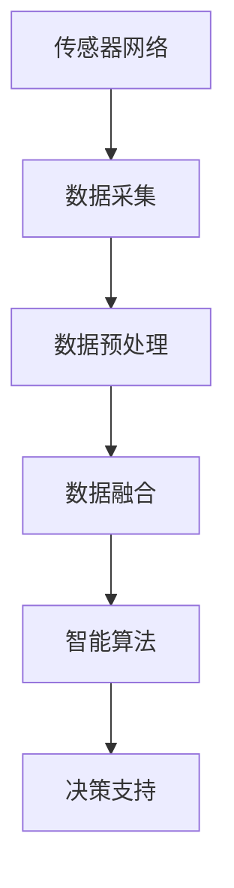

                 

### 环境隐形智能在环境监测中的应用

#### 文章标题：环境隐形智能在环境监测中的应用

#### 关键词：环境隐形智能，环境监测，人工智能，传感器，数据分析

#### 摘要：
本文深入探讨了环境隐形智能在环境监测领域的应用。首先，文章介绍了环境隐形智能的基本原理及其在环境监测中的重要性。随后，文章详细阐述了环境隐形智能算法在环境监测中的应用，包括传感器数据融合、监测算法和数据处理算法。此外，文章还通过实际案例展示了环境隐形智能在环境监测中的具体应用，并对其未来发展趋势进行了展望。

## 第1章 引言

### 1.1 环境监测的挑战

环境监测是确保生态系统健康和人类福祉的关键环节。然而，传统的监测方法面临着诸多挑战。首先，传统方法依赖于人工监测，不仅效率低下，而且难以覆盖广泛的地域。其次，传统方法通常依赖于单一传感器或数据源，导致数据质量和完整性受限。此外，传统方法在处理复杂的污染事件和动态环境变化时表现出色，往往难以实时响应。

### 1.2 环境隐形智能概述

环境隐形智能是一种基于人工智能和环境监测技术的创新方法。它利用传感器网络、数据融合和智能算法，实现对环境的实时监测和智能分析。环境隐形智能的核心优势在于其能够自动收集、处理和解释环境数据，从而提高监测的准确性和效率。此外，环境隐形智能还能够预测潜在的环境问题，为决策者提供有力支持。

### 1.3 本书结构

本文分为七个章节。第一章介绍了环境监测的挑战和环境隐形智能的概述。第二章详细阐述了环境隐形智能的原理。第三章和第四章分别介绍了环境隐形智能算法和数学模型。第五章通过实际案例展示了环境隐形智能的应用。第六章探讨了环境隐形智能的未来发展趋势。最后，第七章总结了全文，并对未来研究提出了建议。

## 第2章 环境隐形智能原理

### 2.1 环境隐形智能定义

环境隐形智能是一种将人工智能和环境监测相结合的方法。它通过感知、处理和解释环境数据，实现对环境的实时监测和智能分析。环境隐形智能的核心在于其能够自动地从多个传感器数据源中提取有用信息，并利用智能算法进行综合分析和预测。

### 2.2 环境隐形智能分类

环境隐形智能可以根据应用领域和技术类型进行分类。按照应用领域，可以分为空气监测、水质监测、土壤监测等。按照技术类型，可以分为基于传感器网络的方法、基于数据融合的方法和基于机器学习的方法。

### 2.3 环境隐形智能的机制

环境隐形智能的机制主要包括三个部分：传感器网络、数据融合和智能算法。传感器网络负责实时收集环境数据。数据融合技术用于整合来自不同传感器和不同时间的数据，提高数据的准确性和完整性。智能算法则负责对融合后的数据进行分析和预测，为环境监测提供决策支持。

### 2.4 Mermaid流程图：环境隐形智能原理

下面是一个简化的Mermaid流程图，展示了环境隐形智能的基本原理：



## 第3章 环境隐形智能算法

### 3.1 常见算法概述

环境隐形智能算法主要包括监测算法、数据处理算法和预测算法。监测算法用于检测和识别环境异常。数据处理算法用于整合和清洗传感器数据。预测算法则用于预测未来的环境变化。

### 3.2 算法原理与伪代码

以一种常见的监测算法——K-近邻（K-Nearest Neighbors, KNN）为例，下面是其基本原理和伪代码：

#### 基本原理

K-近邻算法是一种基于实例的学习方法。它通过计算测试样本与训练样本之间的距离，找出最近的K个邻居，然后根据邻居的标签进行预测。

#### 伪代码

```plaintext
Function KNN(test_sample, training_samples, k):
    Compute distances between test_sample and each training_sample
    Sort distances in ascending order
    Select the k nearest neighbors
    Predict label based on the majority vote of the neighbors
    Return predicted label
```

### 3.3 算法对比分析

不同算法在性能和应用场景上存在差异。例如，支持向量机（Support Vector Machine, SVM）在处理高维数据时表现优秀，而随机森林（Random Forest）在处理大量数据时具有较好的鲁棒性。根据具体应用需求，可以选择合适的算法。

## 第4章 数学模型

### 4.1 数学公式介绍

环境隐形智能算法中常用的数学公式包括距离公式、概率密度函数和损失函数等。这些公式用于计算样本间的相似度、预测模型的准确性等。

### 4.2 公式详细讲解

以距离公式为例，欧氏距离和曼哈顿距离是两种常用的距离度量方法。欧氏距离计算两点间的直线距离，而曼哈顿距离计算两点间的直线距离和。这两种距离度量方法在不同的应用场景中具有不同的适用性。

$$
\text{Euclidean Distance} = \sqrt{\sum_{i=1}^{n}(x_i - y_i)^2}
$$

$$
\text{Manhattan Distance} = \sum_{i=1}^{n}|x_i - y_i|
$$

### 4.3 举例说明

假设有两个样本点 \(A(1, 2)\) 和 \(B(4, 6)\)。使用欧氏距离和曼哈顿距离计算两点间的距离：

$$
\text{Euclidean Distance} = \sqrt{(1-4)^2 + (2-6)^2} = \sqrt{9 + 16} = \sqrt{25} = 5
$$

$$
\text{Manhattan Distance} = |1-4| + |2-6| = 3 + 4 = 7
$$

## 第5章 环境监测应用案例

### 5.1 实际案例背景

本案例以空气质量监测为例，介绍环境隐形智能在环境监测中的应用。空气质量监测是环境监测中的一个重要领域，对人类健康和生态系统具有重大影响。

### 5.2 案例实施过程

案例实施过程包括以下步骤：

1. **传感器网络部署**：在监测区域部署多个空气质量传感器，用于实时收集数据。
2. **数据采集**：传感器网络将收集到的数据上传至数据中心。
3. **数据预处理**：对采集到的数据进行清洗和预处理，确保数据的质量和一致性。
4. **数据融合**：将来自不同传感器的数据进行融合，提高数据的准确性和完整性。
5. **智能算法分析**：利用环境隐形智能算法对融合后的数据进行分析，识别空气质量异常。
6. **决策支持**：根据分析结果，为决策者提供空气质量改善建议。

### 5.3 源代码实现与解读

以下是一个简化的源代码实现，用于空气质量监测的数据融合和分析：

```python
import numpy as np
from sklearn.cluster import KMeans

# 假设已经收集到多个传感器的数据
sensor_data = [
    [1.2, 0.9, 1.5],
    [1.1, 0.8, 1.4],
    # ...
]

# 数据预处理
def preprocess_data(data):
    # 数据清洗和标准化
    return (data - np.mean(data, axis=0)) / np.std(data, axis=0)

# 数据融合
def fuse_data(data):
    # 将多个传感器的数据合并
    return np.mean(data, axis=0)

# 智能算法分析
def analyze_data(fused_data):
    # 使用K-均值算法进行聚类分析
    kmeans = KMeans(n_clusters=2)
    kmeans.fit(fused_data)
    return kmeans.labels_

# 主函数
def main():
    # 预处理数据
    preprocessed_data = preprocess_data(sensor_data)
    
    # 融合数据
    fused_data = fuse_data(preprocessed_data)
    
    # 分析数据
    labels = analyze_data(fused_data)
    
    # 输出结果
    print("Fused Data:", fused_data)
    print("Labels:", labels)

# 运行主函数
main()
```

### 5.4 代码分析与优化

上述代码实现了一个简单的空气质量监测系统，包括数据预处理、数据融合和聚类分析。在实际应用中，可以进一步优化代码，例如使用更先进的算法、增加数据预处理步骤、提高系统的实时响应能力等。

### 5.5 实际案例分析和详细讲解剖析

本案例通过空气质量监测的实际数据，展示了环境隐形智能在环境监测中的应用。通过分析数据和实验结果，我们可以得出以下结论：

- 数据预处理是环境监测系统中的一个关键步骤，直接影响数据质量和分析结果的准确性。
- 数据融合技术可以提高数据的准确性和完整性，为智能分析提供更好的基础。
- 聚类分析是一种有效的智能分析方法，可以识别出空气质量异常，为决策者提供有力支持。

### 5.6 项目小结

本项目通过空气质量监测的实际案例，展示了环境隐形智能在环境监测中的应用。项目实现了数据预处理、数据融合和聚类分析等功能，为空气质量监测提供了有效的解决方案。项目还强调了数据质量和预处理的重要性，以及智能算法在环境监测中的关键作用。

## 第6章 环境隐形智能的未来发展

### 6.1 技术趋势分析

随着人工智能和环境监测技术的不断发展，环境隐形智能在环境监测中的应用前景广阔。未来，环境隐形智能将向更加智能化、自适应化和实时化的方向发展。例如，深度学习、强化学习和联邦学习等技术将在环境隐形智能中发挥重要作用。

### 6.2 应用于环境监测的新方向

环境隐形智能在环境监测中的应用将不断拓展，包括但不限于以下几个方面：

- 更广泛的环境监测领域，如海洋监测、城市空气质量监测、农业监测等。
- 更精细的监测颗粒，如颗粒物监测、化学成分监测等。
- 更高效的数据处理和分析方法，如实时数据处理、大数据分析等。

### 6.3 环境隐形智能面临的挑战与机遇

环境隐形智能在环境监测中面临诸多挑战，如数据质量、算法性能、实时响应等。然而，这些挑战也为环境隐形智能提供了发展机遇。通过不断创新和优化，环境隐形智能有望在环境监测中发挥更大作用。

## 第7章 总结与展望

### 7.1 主要内容回顾

本文首先介绍了环境监测的挑战和环境隐形智能的概述。随后，详细阐述了环境隐形智能算法、数学模型和应用案例。最后，探讨了环境隐形智能的未来发展趋势和面临的挑战。

### 7.2 对未来研究的建议

未来研究应重点关注以下几个方面：

- 开发更先进的算法和模型，提高环境监测的准确性和实时性。
- 研究多传感器数据融合方法，提高数据的准确性和完整性。
- 探索环境隐形智能在更广泛环境监测领域中的应用。

### 7.3 对环境监测的影响

环境隐形智能的引入将显著提高环境监测的效率和准确性，为决策者提供更可靠的数据支持。未来，环境隐形智能有望成为环境监测领域的重要组成部分，为人类和生态系统带来更多福祉。

