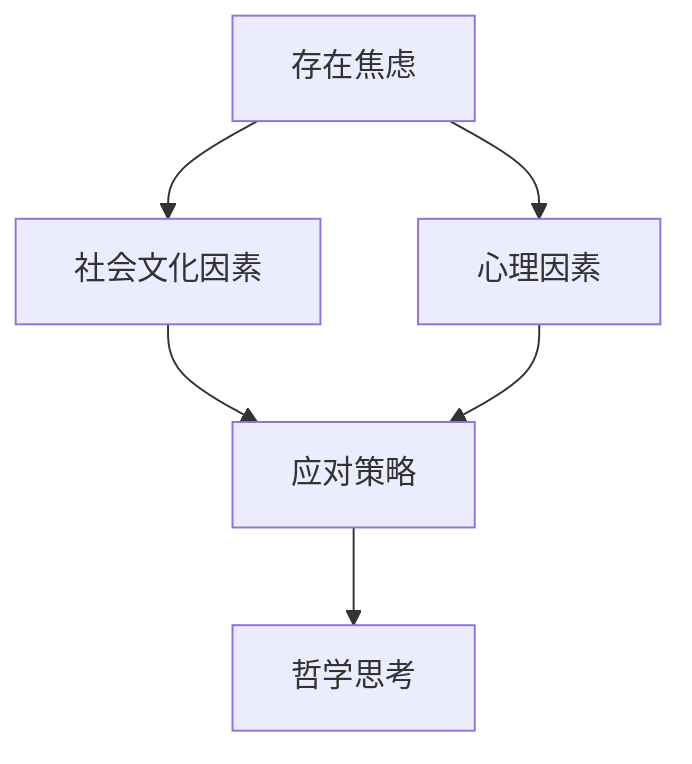

                 

## 现代人的存在焦虑：如何与之和解

### 文章关键词

- 现代生活
- 存在焦虑
- 心理调适
- 社会支持
- 哲学思考

### 文章摘要

本文旨在探讨现代人普遍存在的存在焦虑现象，分析其成因、影响和应对策略。通过心理学、哲学等多维度的深入剖析，文章提出了缓解存在焦虑的具体方法，并探讨了其在个人成长和社会发展中的意义。文章结构清晰，逻辑严密，适合对心理健康和哲学思考感兴趣的读者。

## 引言

在现代社会的快节奏中，存在焦虑成为一种普遍的心理现象。无论是职场压力、人际关系，还是自我认知，焦虑似乎无处不在。本文将深入探讨存在焦虑的成因、影响及应对方法，旨在帮助读者理解这一现象，找到与之和解的路径。

### 核心概念与联系

首先，我们需要明确几个核心概念：

1. **存在焦虑**：指个体在面对不确定性和未知时，产生的一种紧张、担忧的心理状态。
2. **社会文化因素**：现代社会的高度竞争、物质追求和文化压力等，都是存在焦虑的重要诱因。
3. **心理因素**：个体的性格、经历和认知模式，也会影响焦虑的产生和程度。
4. **应对策略**：包括心理调适、社会支持、哲学思考等。

这些概念之间存在着紧密的联系。例如，社会文化因素会影响个体的心理状态，进而影响其应对策略的选择。心理因素和应对策略之间也存在着相互作用，有效的应对策略可以帮助个体缓解焦虑。

### Mermaid 流程图

下面是一个简单的 Mermaid 流程图，展示了这些概念之间的关系：

通过这个流程图，我们可以直观地看到，社会文化因素和心理因素对存在焦虑有着直接影响，而有效的应对策略和哲学思考可以帮助个体更好地应对焦虑。

## 第一部分：理解存在焦虑

### 1.1 什么是存在焦虑

存在焦虑，又称存在性焦虑，是一种深刻的心理体验，表现为对生命意义、未来不确定性以及自我存在的担忧。其核心在于个体对自身存在的反思和对生命意义的追问。

### 1.2 存在焦虑的类型与成因

存在焦虑可以分为以下几种类型：

1. **存在性虚无感**：个体感到生命的无意义和空虚。
2. **未来不确定性焦虑**：对未来可能出现的困境和挑战感到担忧。
3. **自我认同焦虑**：对自己的身份和角色感到困惑和不安。

存在焦虑的成因复杂多样，主要包括：

- **社会文化因素**：现代社会的高度竞争、物质主义和文化压力，使得个体感受到巨大的生存压力。
- **心理因素**：个体的性格特点、经历和认知模式，也会影响焦虑的产生和程度。
- **个体差异**：不同人对焦虑的敏感度和应对方式有所不同。

### 1.3 存在焦虑的影响

存在焦虑对个人生活的影响是多方面的：

- **心理健康**：长期的焦虑可能导致心理健康问题，如抑郁症、焦虑症等。
- **社会关系**：焦虑可能导致个体回避社交，影响人际关系。
- **职业发展**：焦虑可能影响个体的职业表现和职业选择。

### 1.4 存在焦虑的诊断与评估

存在焦虑的诊断和评估需要结合个体的临床表现和心理测试。常见的评估方法包括：

- **自我评估**：通过问卷调查，如“存在焦虑量表”来评估个体的焦虑程度。
- **专业评估**：心理咨询师或心理医生通过面谈和评估，了解个体的心理状态。

### 具体内容与讲解

#### 1.1 什么是存在焦虑

存在焦虑是一种深刻的心理体验，它源于个体对生命意义和存在的反思。这种焦虑不同于一般的焦虑，它不是对特定事件或情境的反应，而是对生活本身的质疑和担忧。

存在焦虑的核心是对生命意义的追问。在现代社会中，随着物质生活水平的提高，人们开始更加关注精神层面的需求。然而，这种追求往往会带来更大的焦虑，因为生命意义是一个复杂而深刻的问题，没有简单的答案。

例如，一个人可能在追求事业成功的过程中，发现成功并不能带来持久的满足感。他会开始质疑自己的目标，甚至对生活本身产生怀疑。这种状态就是一种存在焦虑。

#### 1.2 存在焦虑的类型与成因

存在焦虑可以分为几种类型，每种类型都有其独特的特征和成因。

**1. 存在性虚无感**

存在性虚无感是一种普遍的心理体验，表现为对生活意义的彻底质疑。个体可能会感到自己毫无价值，甚至对生命产生绝望感。这种焦虑往往源于个体的孤独感和无助感，他们可能觉得自己的存在对世界毫无意义。

**2. 未来不确定性焦虑**

未来不确定性焦虑是另一种常见的存在焦虑类型。这种焦虑源于个体对未来的担忧和恐惧。他们可能会担心失业、疾病、死亡等不确定的事情。这种焦虑往往与个体的生活经历和性格特点有关，例如，那些经历过重大挫折或灾难的人可能更容易产生这种焦虑。

**3. 自我认同焦虑**

自我认同焦虑是个体对自己身份和角色的困惑和不安。这种焦虑可能源于个体的多重角色冲突，例如，一个人在职业角色和家庭角色之间感到矛盾。他们可能会质疑自己的价值和能力，甚至对自己的存在产生怀疑。

#### 1.3 存在焦虑的影响

存在焦虑对个人生活的影响是多方面的，它不仅影响心理健康，还会影响社会关系和职业发展。

**1. 心理健康**

存在焦虑可能导致一系列心理健康问题，如抑郁症、焦虑症等。长期的焦虑会消耗个体的精力，降低他们的生活质量。例如，一个人可能会因为焦虑而失眠、食欲不振，甚至出现自我伤害的行为。

**2. 社会关系**

存在焦虑可能影响个体的社交行为，导致他们回避社交，甚至疏远亲友。这种焦虑可能会使个体产生孤独感，进一步加剧他们的焦虑感。例如，一个人可能会因为害怕被评判而避免参加社交活动，这种回避行为可能会使他感到更加孤独和焦虑。

**3. 职业发展**

存在焦虑也可能影响个体的职业发展。焦虑可能导致个体缺乏自信，影响他们的工作表现。例如，一个人可能会因为焦虑而无法集中注意力，导致工作效率低下。此外，焦虑还可能影响个体的职业选择，使他们倾向于选择安全但缺乏挑战性的工作。

#### 1.4 存在焦虑的诊断与评估

诊断和评估存在焦虑是理解和应对这种焦虑的重要步骤。以下是一些常用的方法和工具：

**1. 自我评估**

自我评估是一种简单有效的方法，可以帮助个体了解自己的焦虑程度。常见的自我评估工具包括问卷和量表，如“存在焦虑量表”（Existential Anxiety Scale, EAS）。这个量表包括多个问题，旨在评估个体对存在焦虑的感受程度。例如，问题可能包括：“你是否经常感到生命的无意义？”或“你是否担心自己的未来？”

**2. 专业评估**

专业评估通常由心理咨询师或心理医生进行。他们通过面谈和评估，了解个体的心理状态和行为表现。专业评估可以更准确地诊断存在焦虑，并提供针对性的治疗建议。例如，心理咨询师可能会使用“心理评估问卷”（Psychological Assessment Schedule, PAS），这是一个综合性的评估工具，旨在评估个体的心理健康状况。

### 1.5 存在焦虑的典型表现与症状

存在焦虑的典型表现和症状包括以下几个方面：

**1. 情绪症状**

存在焦虑可能导致个体产生强烈的情绪反应，如焦虑、沮丧、恐惧和无助。个体可能会感到内心空虚，对未来充满担忧。

**2. 认知症状**

存在焦虑也可能影响个体的认知功能，导致他们出现思维混乱、注意力不集中、记忆力下降等问题。例如，一个人可能会因为焦虑而无法清晰地思考问题，甚至出现闪回和幻觉。

**3. 行为症状**

存在焦虑还可能影响个体的行为表现，导致他们出现回避行为、社交退缩、工作表现下降等问题。例如，一个人可能会因为害怕失败而避免接受新的挑战，这可能会导致他们的职业发展受到限制。

### 1.6 存在焦虑与心理健康的关系

存在焦虑与心理健康之间存在密切的关系。长期的焦虑可能导致一系列心理健康问题，如抑郁症、焦虑症、强迫症等。这些心理问题不仅会影响个体的生活质量，还可能对他们的社会关系和职业发展产生负面影响。

**1. 焦虑与抑郁症**

存在焦虑和抑郁症常常相互伴随。焦虑可能导致抑郁症的发生，而抑郁症也可能加剧焦虑。例如，一个人可能在经历焦虑的同时，也感到绝望和无助，这可能会导致抑郁症的发生。

**2. 焦虑与强迫症**

强迫症是一种常见的焦虑障碍，它表现为个体反复出现无法控制的思维和行为。存在焦虑可能导致个体出现强迫症的症状，例如，他们可能会反复检查门是否锁好，或者反复思考某个问题。

**3. 焦虑与社交恐惧症**

社交恐惧症是一种常见的焦虑障碍，它表现为个体对社交场合的极度恐惧和回避。存在焦虑可能导致社交恐惧症的发生，例如，一个人可能会因为焦虑而在社交场合中感到紧张和不安，这可能会导致他们回避社交活动。

### 1.7 存在焦虑的分类与诊断标准

存在焦虑可以按照不同的标准进行分类，例如：

**1. 根据焦虑的起源**

- **原发性焦虑**：焦虑直接源于个体的生命体验和存在反思。
- **继发性焦虑**：焦虑是由外部环境或内在心理冲突引起的。

**2. 根据焦虑的强度和持续时间**

- **急性焦虑**：焦虑症状短暂且强烈。
- **慢性焦虑**：焦虑症状持续时间较长，可能数月或数年。

在诊断存在焦虑时，医生通常会参考以下标准：

- **焦虑症状的严重程度**：焦虑症状是否严重影响了个体的日常生活和工作。
- **症状的持续时间**：焦虑症状是否持续了至少数月。
- **症状的频率**：焦虑症状是否频繁出现。

### 1.8 存在焦虑的常见原因与影响因素

存在焦虑的常见原因和影响因素包括：

**1. 社会文化因素**

- **高度竞争的社会环境**：现代社会的高竞争性可能导致个体感到巨大的压力和焦虑。
- **物质主义文化**：物质追求可能导致个体对生命的意义产生质疑。

**2. 心理因素**

- **性格特点**：某些性格特点，如完美主义和过度理性，可能导致个体更容易产生焦虑。
- **经历**：个体的生命经历，如挫折和创伤，可能导致焦虑的产生。

**3. 个体差异**

- **生理差异**：例如，神经质等特质可能影响个体的焦虑程度。
- **文化差异**：不同文化背景下，个体对焦虑的理解和应对方式可能有所不同。

### 1.9 存在焦虑的心理机制与生理反应

存在焦虑的心理机制涉及认知、情感和行为层面：

**1. 认知层面**

- **认知偏差**：个体可能对存在的威胁产生过度反应，例如，对不确定性的恐惧。
- **自我反思**：个体对自身的存在和生命意义进行深刻反思，可能导致焦虑。

**2. 情感层面**

- **恐惧和焦虑**：个体可能感到恐惧和焦虑，特别是对未知的恐惧。
- **无助感**：个体可能感到无助，无法应对存在的挑战。

**3. 行为层面**

- **回避行为**：个体可能避免面对存在的挑战，例如，回避社交场合。
- **过度理性化**：个体可能试图通过过度理性化来应对焦虑，但这种方法往往适得其反。

生理反应方面，存在焦虑可能导致：

- **神经系统反应**：例如，心跳加速、出汗等。
- **免疫系统反应**：长期焦虑可能影响免疫系统的功能。

### 1.10 存在焦虑的治疗与应对策略

存在焦虑的治疗和应对策略包括：

**1. 心理治疗**

- **认知行为疗法（CBT）**：通过改变不合理的认知，帮助个体减少焦虑。
- **存在主义疗法**：关注个体的存在体验和生命意义，帮助个体找到生活的意义。

**2. 药物治疗**

- **抗焦虑药物**：如苯二氮平类药物，用于缓解焦虑症状。
- **抗抑郁药物**：如选择性5-羟色胺再摄取抑制剂（SSRIs），用于治疗与焦虑相关的抑郁症状。

**3. 应对策略**

- **心理调适技巧**：如冥想、正念等，帮助个体管理焦虑。
- **社会支持**：建立支持网络，与家人、朋友或专业人士分享焦虑感受。

### 第二部分：应对存在焦虑的方法

### 2.1 心理调适技巧

在面对存在焦虑时，心理调适技巧是一种有效的方法，可以帮助个体缓解焦虑，提升生活质量。以下是一些常用的心理调适技巧：

#### 2.1.1 放松训练

放松训练是一种通过身体和呼吸的放松来减轻焦虑的方法。常见的放松训练包括：

- **深呼吸**：缓慢而深入地吸气，然后缓慢地呼气，重复几次。
- **渐进性肌肉放松**：从脚部开始，逐渐向上至头部，逐个放松身体的肌肉。

#### 2.1.2 认知重构

认知重构是一种通过改变思维模式来减少焦虑的方法。以下是一些认知重构的策略：

- **挑战不合理信念**：识别并质疑那些导致焦虑的不合理信念。
- **积极思维**：培养积极、乐观的思维模式，减少消极思维的影响。

#### 2.1.3 情绪管理

情绪管理是一种通过认识和调节情绪来应对焦虑的方法。以下是一些情绪管理的策略：

- **情绪识别**：学会识别和理解自己的情绪，避免情绪的积累和爆发。
- **情绪调节**：通过正念、冥想等方法，学会调节情绪，保持情绪的平衡。

### 2.2 心理治疗的选择

除了心理调适技巧，心理治疗也是应对存在焦虑的有效方法。以下是几种常用的心理治疗方法：

#### 2.2.1 认知行为疗法（CBT）

认知行为疗法（CBT）是一种以认知和行为改变为核心的心理治疗方法。CBT 通过帮助个体识别和改变不合理的认知模式，从而减轻焦虑症状。以下是一些 CBT 的关键步骤：

- **认知重建**：识别和挑战不合理的认知，建立更合理的思维模式。
- **行为实验**：通过实际的行为实验，验证新的认知模式的有效性。

#### 2.2.2 存在主义疗法

存在主义疗法关注个体的存在体验和生命意义，旨在帮助个体找到生活的意义和价值。存在主义疗法的方法包括：

- **存在对话**：通过与治疗师的存在对话，探索个体的存在体验和生命意义。
- **存在反思**：通过写作、绘画等方式，进行存在反思，帮助个体深化对自身存在的理解。

#### 2.2.3 焦虑管理治疗（AMT）

焦虑管理治疗（AMT）是一种专门针对焦虑症状的治疗方法。AMT 通过教授个体焦虑管理技巧，帮助个体减少焦虑。以下是一些 AMT 的关键步骤：

- **焦虑日记**：记录和分析个体的焦虑经历，了解焦虑的触发因素。
- **焦虑管理技巧**：教授个体应对焦虑的技巧，如深呼吸、放松训练等。

### 2.3 身体健康与存在焦虑

身体健康在应对存在焦虑中起着关键作用。以下是一些与健康相关的策略，可以帮助个体缓解焦虑：

#### 2.3.1 饮食与运动

**1. 饮食**

- **均衡饮食**：保证充足的营养摄入，特别是维生素和矿物质的补充。
- **避免咖啡因和糖**：咖啡因和糖可能会导致焦虑症状加剧。

**2. 运动**

- **定期运动**：适量的运动可以帮助释放压力，改善情绪。
- **选择适合自己的运动**：如瑜伽、太极拳等，可以帮助个体放松身心。

#### 2.3.2 睡眠与焦虑

良好的睡眠对缓解焦虑至关重要。以下是一些关于睡眠的建议：

- **保持规律的睡眠时间**：尽量每天在相同的时间入睡和起床。
- **创造舒适的睡眠环境**：保持卧室安静、舒适和黑暗。
- **避免在床上使用电子设备**：电子设备的蓝光可能会干扰睡眠。

#### 2.3.3 身体放松技巧

身体放松技巧可以帮助个体缓解紧张和焦虑，以下是一些常用的放松技巧：

- **深呼吸**：通过深呼吸，帮助身体放松。
- **渐进性肌肉放松**：逐个放松身体的肌肉，从脚部到头部。
- **瑜伽和冥想**：瑜伽和冥想可以帮助个体放松身心，提高情绪调节能力。

### 2.4 个人成长与存在焦虑

个人成长是应对存在焦虑的重要途径。以下是一些个人成长策略，可以帮助个体更好地应对焦虑：

#### 2.4.1 自我探索

自我探索是一种深入了解自己的方法，可以帮助个体找到生命的意义和价值。以下是一些自我探索的技巧：

- **日记记录**：通过日记记录自己的想法、感受和经历，帮助自己更好地了解自己。
- **反思和自省**：定期进行反思和自省，思考自己的价值观、目标和人生意义。

#### 2.4.2 职业规划

职业规划可以帮助个体找到适合自己的职业道路，从而减少职业焦虑。以下是一些职业规划的技巧：

- **职业咨询**：通过职业咨询，了解自己的兴趣、能力和职业发展方向。
- **设定职业目标**：设定短期和长期的职业目标，并制定实现这些目标的计划。

#### 2.4.3 个人价值观的塑造

个人价值观的塑造可以帮助个体在面对焦虑时保持内心的平静和坚定。以下是一些塑造个人价值观的技巧：

- **道德伦理教育**：通过学习道德伦理，培养自己的价值观和道德准则。
- **价值观反思**：定期反思自己的价值观，确保它们与自己的人生目标和信仰相一致。

### 2.5 社会支持与存在焦虑

社会支持在应对存在焦虑中起着重要作用。以下是一些社会支持的方法：

#### 2.5.1 建立支持网络

建立支持网络可以帮助个体在面临焦虑时获得支持和帮助。以下是一些建立支持网络的技巧：

- **与家人和朋友交流**：与家人和朋友分享自己的焦虑感受，获得他们的理解和支持。
- **参加社交活动**：参加社交活动，扩大社交圈子，增加社交支持。

#### 2.5.2 社交技巧的培养

良好的社交技巧可以帮助个体更好地应对焦虑，以下是一些培养社交技巧的技巧：

- **倾听和沟通**：学会倾听他人，并有效沟通自己的需求和感受。
- **自信心培养**：通过自我肯定和积极的自我评价，提高自信心。

#### 2.5.3 社区资源的利用

利用社区资源可以帮助个体获得更多的支持和帮助。以下是一些利用社区资源的技巧：

- **咨询专业人士**：寻求心理咨询师、心理医生等专业人士的帮助。
- **参加社区活动**：参加社区活动，如心理健康讲座、支持小组等。

### 第三部分：存在焦虑与哲学思考

### 3.1 存在主义哲学的视角

存在主义哲学是探讨个体存在意义和自由的重要理论。存在主义认为，人类生活本身没有固有的意义，意义是个人通过自己的选择和行动赋予的。以下是一些存在主义哲学的核心观点：

- **自由**：存在主义强调个体的自由，认为自由是人的本质。个体必须为自己的行为承担责任。
- **选择**：存在主义认为，个体必须通过选择来定义自己。每个选择都会带来不同的后果，个体必须对自己的选择负责。
- **意义**：存在主义认为，意义不是预设的，而是个体通过自己的行动和选择创造出来的。

### 3.2 哲学思考对存在焦虑的启示

哲学思考可以提供对存在焦虑的深刻理解，并启示个体如何面对和缓解焦虑。以下是一些哲学思考的启示：

- **生命的意义**：哲学思考可以帮助个体探索生命的意义，找到自己在世界中的位置。
- **自由与责任**：哲学思考强调个体的自由和责任，帮助个体认识到自己的选择和行动的重要性。
- **面对不确定性**：哲学思考可以帮助个体接受生活中的不确定性和未知，减少焦虑。

### 3.3 存在焦虑与宗教信仰

宗教信仰在应对存在焦虑中起着重要作用。宗教信仰提供了一种超越个体存在的视角，帮助个体找到安慰和力量。以下是一些宗教信仰对存在焦虑的影响：

- **精神安慰**：宗教信仰可以提供精神安慰，帮助个体在焦虑中找到平静和希望。
- **生活意义**：宗教信仰可以为个体提供生活的意义和目标，减少对生命意义的焦虑。
- **道德指导**：宗教信仰可以提供道德指导，帮助个体在面对困难时保持正直和坚定。

### 3.4 跨文化视角下的存在焦虑

跨文化视角可以帮助我们更好地理解存在焦虑的普遍性和多样性。不同文化背景下，个体对存在焦虑的理解和应对方式可能有所不同。以下是一些跨文化视角下的存在焦虑特点：

- **文化因素**：不同文化对焦虑的理解和应对方式有所不同，例如，集体主义文化可能更注重社会关系，而个人主义文化可能更注重个人自由。
- **宗教因素**：不同宗教对存在焦虑的影响不同，例如，佛教强调禅修和内心平静，而基督教强调信仰和救赎。

### 第三部分：存在焦虑与哲学思考

#### 3.1 存在主义哲学的视角

存在主义哲学，作为一种深刻的哲学流派，关注个体在无意义的世界中的存在和自由。存在主义认为，人生没有先天的意义，意义是个人通过自己的选择和行动赋予的。这种观点为理解存在焦虑提供了独特的视角。

存在主义哲学的核心观点包括：

- **自由**：存在主义强调个体的自由，认为自由是人的本质。每个人都是自由的，必须为自己的行为承担责任。
- **选择**：存在主义认为，个体必须通过选择来定义自己。每个选择都会带来不同的后果，个体必须对自己的选择负责。
- **意义**：存在主义认为，意义不是预设的，而是个体通过自己的行动和选择创造出来的。

#### 3.2 哲学思考对存在焦虑的启示

哲学思考可以为我们提供深刻的见解，帮助我们理解和应对存在焦虑。以下是一些哲学思考对存在焦虑的启示：

- **生命的意义**：哲学思考可以帮助我们探索生命的意义，找到自己在世界中的位置。这种探索可能涉及到个体的价值观、信仰和目标。通过深入思考生命的意义，个体可以减少对生命无意义的焦虑。
- **自由与责任**：哲学思考强调个体的自由和责任，帮助个体认识到自己的选择和行动的重要性。个体必须为自己的选择承担责任，这有助于减少因自由而产生的焦虑。
- **面对不确定性**：哲学思考可以帮助个体接受生活中的不确定性和未知，减少焦虑。存在主义哲学认为，个体必须接受生命的无常和不确定性，并学会在这些不确定中寻找意义。

#### 3.3 存在焦虑与宗教信仰

宗教信仰在应对存在焦虑中起着重要作用。宗教信仰提供了一种超越个体存在的视角，帮助个体找到安慰和力量。以下是一些宗教信仰对存在焦虑的影响：

- **精神安慰**：宗教信仰可以提供精神安慰，帮助个体在焦虑中找到平静和希望。宗教仪式、信仰实践和信仰团体的支持都可以为个体提供心理上的安慰。
- **生活意义**：宗教信仰可以为个体提供生活的意义和目标，减少对生命意义的焦虑。宗教信仰通常提供了一种关于世界和人生的解释，帮助个体理解自己的存在和生命的意义。
- **道德指导**：宗教信仰可以提供道德指导，帮助个体在面对困难时保持正直和坚定。宗教教义通常包含道德准则和价值观，这些准则和价值观可以帮助个体在面对挑战时做出正确的选择。

#### 3.4 跨文化视角下的存在焦虑

跨文化视角可以帮助我们更好地理解存在焦虑的普遍性和多样性。不同文化背景下，个体对存在焦虑的理解和应对方式可能有所不同。以下是一些跨文化视角下的存在焦虑特点：

- **文化因素**：不同文化对焦虑的理解和应对方式有所不同。例如，在集体主义文化中，个体可能更注重社会关系和群体的支持，而在个人主义文化中，个体可能更注重个人自由和独立。
- **宗教因素**：不同宗教对存在焦虑的影响不同。例如，佛教强调禅修和内心平静，基督教强调信仰和救赎，这些宗教实践可能对存在焦虑有不同的缓解作用。
- **社会结构**：不同社会结构也可能影响个体对存在焦虑的理解和应对方式。例如，在高度竞争的社会中，个体可能更容易感到焦虑，而在稳定的社会中，个体可能感到更加安心。

### 附录

#### 附录 A：存在焦虑研究综述

存在焦虑是一个多维度、跨学科的研究领域。以下是存在焦虑研究的一些主要成果：

- **心理学研究**：心理学研究主要集中在存在焦虑的成因、症状和治疗方法。认知行为疗法（CBT）和存在主义疗法被认为是有效的治疗方法。
- **哲学研究**：哲学研究探讨了存在焦虑的哲学意义和个体的存在体验。存在主义哲学对理解存在焦虑提供了独特的视角。
- **社会学研究**：社会学研究关注社会文化因素如何影响存在焦虑。社会结构和文化价值观可能对个体的焦虑水平产生影响。

#### 附录 B：存在焦虑相关资源推荐

为了进一步了解存在焦虑，以下是一些推荐的资源：

- **书籍**： 
  - 《存在主义心理学》
  - 《焦虑的意义》
  - 《存在的困惑》

- **学术论文**： 
  - 在学术期刊和会议上发表的关于存在焦虑的研究论文。

- **心理治疗机构与热线**： 
  - 本地心理咨询机构
  - 国家心理健康热线

### 作者信息

作者：AI天才研究院/AI Genius Institute & 禅与计算机程序设计艺术 /Zen And The Art of Computer Programming

### 总结

本文从心理学、哲学和社会学等多个角度，深入探讨了现代人的存在焦虑现象。通过理解焦虑的成因、影响和应对策略，以及哲学思考对焦虑的启示，读者可以更好地理解存在焦虑，并找到与之和解的路径。希望通过本文，读者能够在面对焦虑时，找到更加积极和有效的方法来应对。

