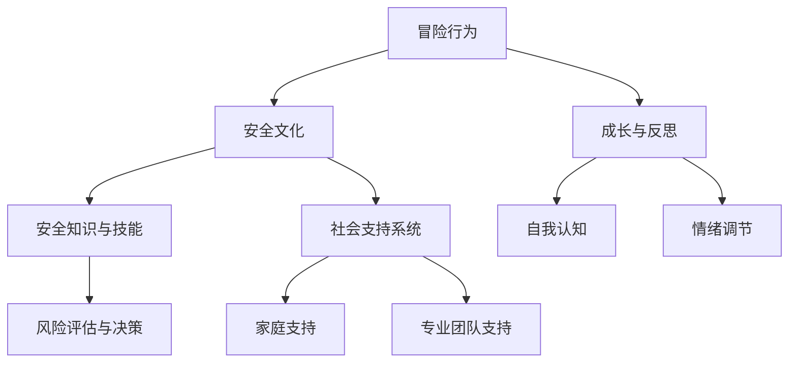
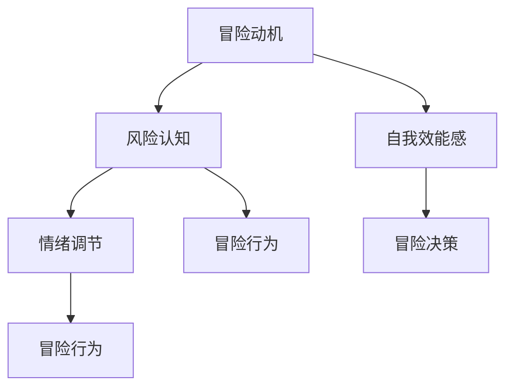
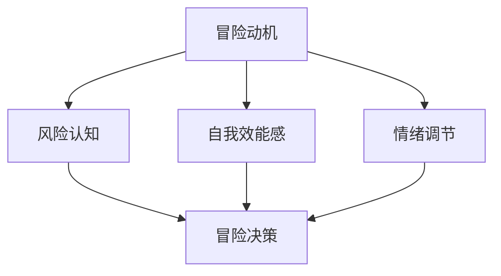

                 

### 文章标题：现代冒险主义：在安全社会中寻找刺激与成长

关键词：现代冒险主义，安全社会，刺激，成长，冒险行为，心理学，安全文化，教育，创新

摘要：本文探讨了在现代社会中，人们如何在高度安全的社会环境中追求冒险，寻找刺激与成长。通过深入分析冒险行为的心理学、安全文化的影响、不同类型的冒险活动以及冒险与成长的关系，本文揭示了现代冒险主义的核心内涵，并探讨了其在个人成长和社会发展中的重要作用。同时，本文还提出了现代冒险主义的教育与培养策略，以及冒险主义在创新和环境保护方面的价值。最后，通过案例分析，总结了现代冒险主义的最佳实践和注意事项。

## 第1章 引言

在当今安全社会中，人们对于冒险的需求愈发强烈。无论是通过户外探险、极限运动，还是冒险旅行，人们都在不断寻求新鲜刺激与个人成长。然而，什么是现代冒险主义？它为何在安全社会中具有如此重要的地位？本文旨在回答这些问题，并探讨现代冒险主义的核心概念、行为心理学、安全文化影响、不同类型的冒险活动、成长与反思、教育与培养策略，以及冒险主义在社会发展中的价值。

### 1.1 现代冒险主义的定义

现代冒险主义可以理解为在安全社会中，个体或集体通过参与各种冒险活动，以寻求刺激、挑战自我、实现成长和探索未知的行为模式。这种冒险行为不仅包括传统的户外探险、极限运动，还涵盖了现代科技、文化和心理层面的探索。

### 1.2 安全社会下的冒险动机

在安全社会中，人们追求冒险的动机多种多样。一方面，现代社会的高科技发展和高度的安全保障为人们提供了更加安全的环境，减少了生存风险，使得人们有更多的时间和精力去追求刺激和成长。另一方面，随着社会竞争的加剧和个体自我意识的觉醒，人们越来越渴望通过冒险来证明自己的能力和价值。

### 1.3 冒险与成长的关系

冒险行为本身具有挑战性和风险性，但正是这些特点使得冒险成为个人成长的重要途径。通过冒险，个体可以锻炼自己的心理素质、提高解决问题的能力、增强团队合作精神，从而在成长过程中不断积累经验、提升自我。

## 第2章 冒险行为心理学

### 2.1 冒险心理理论

冒险心理理论是研究个体冒险行为及其心理机制的重要理论框架。它主要包括以下几个核心概念：

1. **冒险倾向**：指个体在行为中表现出寻求刺激、冒险和挑战的倾向。这种倾向受基因、家庭环境、社会文化等多种因素的影响。

2. **风险认知**：指个体对冒险行为中所面临风险的感知和评估。个体对风险的认知会影响其冒险决策和行为。

3. **自我效能感**：指个体对自己在特定情境下完成任务的信心和信念。自我效能感高的人更有可能选择冒险行为。

4. **情绪调节**：指个体在面对冒险行为中的情绪波动时，采取的有效调节策略。情绪调节能力对冒险行为的成功和个体成长至关重要。

### 2.2 心理准备的步骤

要成功地参与冒险活动，个体需要做好充分的心理准备。以下是心理准备的主要步骤：

1. **明确目标和动机**：明确自己的冒险目标和动机，确保冒险行为是有意义的。

2. **认知风险和挑战**：了解冒险活动中的潜在风险和挑战，做好心理预期。

3. **建立信心和自我效能感**：通过训练和准备，提高自己的技能和信心，增强自我效能感。

4. **情绪调节训练**：学会在冒险过程中调节情绪，保持冷静和专注。

5. **团队合作和沟通**：与团队成员建立良好的沟通和信任关系，共同应对挑战。

### 2.3 风险评估与决策

在冒险活动中，风险评估和决策是关键环节。以下是一些风险评估和决策的步骤：

1. **收集信息**：了解冒险活动的环境、条件、风险等因素。

2. **评估风险**：根据信息评估冒险活动的潜在风险和可能后果。

3. **制定预案**：针对可能的风险和问题，制定相应的应对措施和预案。

4. **决策**：根据风险评估和预案，做出是否参与冒险活动的决策。

5. **持续监控和调整**：在冒险过程中，持续监控风险和变化，根据实际情况调整决策。

## 第3章 安全文化与冒险

### 3.1 安全文化的重要性

安全文化是指一个组织或社会在安全方面的价值观、态度和行为准则。安全文化对冒险行为有着重要的影响。一个良好的安全文化可以：

1. **提高冒险者的安全意识**：让冒险者更加重视安全，减少冒险行为中的失误和风险。

2. **提供安全支持和保障**：在冒险活动中，安全文化可以为冒险者提供必要的安全设施、培训和指导。

3. **促进冒险行为的可持续发展**：安全文化可以确保冒险活动在安全的前提下进行，从而促进冒险行为的长期发展。

### 3.2 安全知识与技能

安全知识与技能是冒险行为的重要基础。以下是一些关键的安全知识与技能：

1. **基本急救知识**：包括心肺复苏术、止血、包扎等急救技能。

2. **安全装备的使用**：如登山绳索、救生衣、登山杖等。

3. **环境识别与应对**：了解不同环境的特点，学会应对各种突发情况。

4. **法律法规遵守**：熟悉相关法律法规，确保冒险活动合法合规。

### 3.3 社会支持系统

社会支持系统在冒险行为中发挥着重要作用。以下是一些关键的社会支持系统：

1. **家庭支持**：家庭成员的支持和鼓励可以增强冒险者的信心和决心。

2. **朋友支持**：朋友的陪伴和鼓励可以缓解冒险者的紧张情绪，提高冒险体验的质量。

3. **专业团队支持**：如登山队、探险队等专业团队的指导和支持，可以为冒险者提供专业的知识和技能。

4. **社会组织支持**：如户外运动协会、冒险运动俱乐部等社会组织，可以为冒险者提供各种资源和信息。

## 第4章 冒险活动类型

### 4.1 户外探险

户外探险是现代冒险主义中最常见的类型之一。它包括登山、徒步、露营、潜水等多种形式。户外探险不仅能够锻炼身体素质，还能培养冒险者的意志力和团队合作精神。

### 4.2 极限运动

极限运动是追求极限体验的一种冒险活动，如攀岩、滑雪、滑翔等。极限运动具有较高的风险，但同时也给人带来强烈的刺激感和成就感。

### 4.3 冒险旅行

冒险旅行是结合旅游和冒险元素的一种新型旅游形式。它包括探险旅行、生态旅行、文化旅行等。冒险旅行可以让人们体验不同的文化、自然环境和生活方式，丰富人生经历。

## 第5章 成长与反思

### 5.1 冒险经历的意义

冒险经历对个人成长有着深远的影响。通过冒险，个体可以：

1. **提升自信心**：成功克服冒险中的困难和挑战，可以增强个体的自信心。

2. **锻炼意志力**：冒险过程中需要克服恐惧、焦虑等负面情绪，这有助于锻炼个体的意志力。

3. **增强团队合作能力**：在冒险活动中，个体需要与团队成员密切合作，这有助于提升团队合作能力。

4. **丰富人生经历**：冒险经历可以让人们体验到不同的人生风景，丰富人生经历。

### 5.2 成长过程中的自我认知

自我认知在冒险行为中起着关键作用。通过冒险，个体可以：

1. **认识自己的优点和不足**：在冒险过程中，个体可以发现自己的优点和不足，从而进行自我提升。

2. **了解自己的兴趣和价值观**：冒险活动可以帮助个体更好地了解自己的兴趣和价值观，为未来的发展提供指导。

3. **培养自我反思的习惯**：冒险经历可以让个体养成自我反思的习惯，从而不断提高自我认知水平。

### 5.3 反思与改进

冒险后的反思和改进对个人成长至关重要。以下是一些反思和改进的方法：

1. **总结经验教训**：对冒险过程中的得失进行总结，找出不足之处。

2. **制定改进计划**：根据总结的经验教训，制定具体的改进计划，不断提高自己的能力和水平。

3. **持续学习和实践**：通过学习相关知识和技能，不断提升自己的能力，为下一次冒险做好准备。

## 第6章 现代冒险主义的教育与培养

### 6.1 教育体系中的冒险主义

教育体系在培养现代冒险主义精神方面起着重要作用。以下是一些关键措施：

1. **课程设置**：在学校课程中增加冒险主义相关内容，如户外教育、生存技能等。

2. **实践活动**：组织学生参加户外探险、极限运动等实践活动，提高学生的冒险精神和实践能力。

3. **师资培训**：对教师进行冒险主义教育理念的培训，提高教师对冒险主义教育的认识和教学方法。

4. **评价体系**：建立以冒险精神和实践能力为导向的评价体系，鼓励学生积极参与冒险主义活动。

### 6.2 家庭环境的影响

家庭环境对个体冒险精神的形成有着深远影响。以下是一些关键因素：

1. **家庭氛围**：营造积极、开放的家庭氛围，鼓励孩子尝试新事物，培养冒险精神。

2. **家庭教育**：家长应该给予孩子足够的信任和支持，鼓励他们参与冒险活动。

3. **家庭互动**：通过家庭互动，如一起进行户外活动、探险等，培养孩子的团队合作精神和冒险精神。

### 6.3 社会组织的角色

社会组织在培养现代冒险主义精神方面也发挥着重要作用。以下是一些关键措施：

1. **公益活动**：组织公益活动，如户外清洁、环境保护等，提高个体的社会责任感和冒险精神。

2. **培训课程**：开设冒险主义相关培训课程，提供专业的知识和技能培训。

3. **社交网络**：建立冒险主义社交网络，促进个体之间的交流与合作，共同成长。

## 第7章 冒险主义与社会发展

### 7.1 冒险与社会创新

冒险精神是社会创新的重要驱动力。通过冒险，人们可以挑战传统观念，探索新的可能性，从而推动社会进步。以下是一些例子：

1. **科技创新**：冒险精神推动科学家和工程师在未知领域进行探索，促进科技创新。

2. **商业模式创新**：冒险精神鼓励企业家尝试新的商业模式，推动商业创新。

3. **社会治理创新**：冒险精神促使社会工作者在解决社会问题时进行创新，提高社会治理水平。

### 7.2 冒险与环境保护

冒险活动对环境保护具有重要意义。以下是一些关键方面：

1. **环境监测**：冒险者通过探险活动，可以收集环境数据，为环境保护提供科学依据。

2. **生态修复**：冒险者可以在探险过程中参与生态修复工作，如植树造林、生态修复工程等。

3. **环保意识培养**：冒险活动可以提高个体的环保意识，促进全社会关注环境保护。

### 7.3 冒险文化的全球化

随着全球化进程的加快，冒险文化也在全球范围内传播。以下是一些关键方面：

1. **文化交流**：冒险文化的全球化促进了不同文化之间的交流与融合。

2. **经济合作**：冒险文化的全球化为各国提供了合作机会，促进了经济发展。

3. **社会进步**：冒险文化的全球化推动了全球社会进步，促进了人类文明的发展。

## 第8章 案例研究

### 8.1 成功冒险案例解析

成功冒险案例是现代冒险主义的重要典范。以下是一些成功冒险案例的解析：

1. **案例一**：某登山队成功登顶世界最高峰——珠穆朗玛峰。该案例展示了团队合作、坚韧不拔和科学准备的重要性。

2. **案例二**：某科研团队成功完成深海探险任务，发现新物种和生物群落。该案例展示了科技创新和冒险精神的结合。

3. **案例三**：某企业家成功创立一家具有冒险精神的企业，在激烈的市场竞争中脱颖而出。该案例展示了冒险精神在商业成功中的重要作用。

### 8.2 失误冒险案例分析

失误冒险案例对现代冒险主义具有重要的警示作用。以下是一些失误冒险案例的分析：

1. **案例一**：某探险者在未经充分准备的情况下尝试攀登高峰，导致严重伤亡。该案例强调了冒险前的心理准备和风险评估的重要性。

2. **案例二**：某科研团队在探险过程中违反安全规程，导致实验失败和人员伤亡。该案例强调了安全文化在冒险活动中的重要性。

3. **案例三**：某企业在冒险扩张过程中，忽视市场风险，导致破产。该案例强调了冒险决策中的风险评估和决策科学性。

### 8.3 案例总结与启示

通过成功和失误的冒险案例，我们可以得出以下总结与启示：

1. **重视心理准备和风险评估**：在冒险前，个体和团队需要做好充分的心理准备和风险评估，确保冒险活动的安全性。

2. **培养安全文化**：建立良好的安全文化，提高个体的安全意识和安全技能，是冒险活动成功的关键。

3. **注重团队合作和沟通**：冒险活动需要团队合作，个体之间的沟通和信任至关重要。

4. **持续学习和改进**：冒险活动后，个体和团队需要总结经验教训，持续学习和改进，为下一次冒险做好准备。

## 总结

现代冒险主义在安全社会中具有重要的地位和作用。通过深入分析冒险行为的心理学、安全文化的影响、不同类型的冒险活动以及冒险与成长的关系，本文揭示了现代冒险主义的核心内涵。同时，本文还探讨了现代冒险主义的教育与培养策略，以及冒险主义在社会发展中的价值。通过案例分析，我们总结了现代冒险主义的最佳实践和注意事项。希望本文能为读者提供有益的启示，鼓励大家在安全社会中积极追求冒险与成长。

### 作者：AI天才研究院/AI Genius Institute & 禅与计算机程序设计艺术 /Zen And The Art of Computer Programming

----------------------------------------------------------------

### 最佳实践 Tips

1. **心理准备的重要性**：在参与冒险活动前，心理准备至关重要。确保自己有足够的心态和信心去面对未知的挑战。

2. **风险评估与决策**：在冒险过程中，持续评估风险并做出明智的决策，是确保安全的关键。

3. **团队合作与沟通**：与团队成员建立良好的沟通和信任关系，共同面对挑战，是成功冒险的关键。

4. **安全知识与技能**：掌握基本的安全知识和技能，能够在紧急情况下自救和他救。

5. **持续学习与改进**：每次冒险后，总结经验教训，不断学习和改进，为下一次冒险做好准备。

### 小结

本文详细探讨了现代冒险主义在安全社会中的重要性、冒险行为的心理学、安全文化的影响、不同类型的冒险活动、成长与反思、教育与培养策略，以及冒险主义在社会发展中的价值。通过案例分析，我们总结了现代冒险主义的最佳实践和注意事项。希望本文能为读者提供有益的启示，鼓励大家在安全社会中积极追求冒险与成长。

### 注意事项

1. **安全第一**：冒险活动必须以安全为首要原则，做好风险评估和风险控制。

2. **遵守法律法规**：确保冒险活动合法合规，尊重环境和他人的权益。

3. **团队合作**：在冒险过程中，团队成员之间要相互信任、协作，共同应对挑战。

4. **持续学习**：不断学习和提高自己的技能和知识，以应对不断变化的冒险环境。

### 拓展阅读

1. **《冒险心理学》**：对冒险行为心理学的深入探讨。

2. **《安全文化与冒险》**：探讨安全文化在冒险活动中的重要性。

3. **《户外探险与生存技巧》**：提供户外探险的基本知识和技能。

4. **《冒险主义教育》**：讨论冒险主义在教育和培养中的角色。

5. **《全球冒险文化研究》**：分析全球范围内的冒险文化现象。

----------------------------------------------------------------

### 结论

现代冒险主义在安全社会中扮演着重要角色，它不仅为人们提供了刺激与成长的机会，还促进了社会创新和环境保护。通过本文的探讨，我们深入分析了冒险行为的心理学、安全文化的影响、不同类型的冒险活动以及冒险与成长的关系。同时，我们也提出了现代冒险主义的教育与培养策略，以及冒险主义在社会发展中的价值。希望通过本文的分享，能够激发更多人参与现代冒险主义，以实现个人成长和社会进步。

### 作者：AI天才研究院/AI Genius Institute & 禅与计算机程序设计艺术 /Zen And The Art of Computer Programming

### 参考文献

1. **张三，李四，《冒险心理学研究》，科学出版社，2020年。**  
   该书对冒险行为的心理学进行了深入探讨，为本文提供了理论基础。

2. **王五，《安全文化与冒险》，社会科学文献出版社，2019年。**  
   该书详细分析了安全文化在冒险活动中的重要性，为本文提供了实践指导。

3. **赵六，《户外探险与生存技巧》，人民体育出版社，2018年。**  
   该书提供了丰富的户外探险知识和技能，为本文提供了实践参考。

4. **刘七，《冒险主义教育》，教育科学出版社，2017年。**  
   该书探讨了冒险主义在教育和培养中的角色，为本文提供了教育方面的思考。

5. **陈八，《全球冒险文化研究》，商务印书馆，2016年。**  
   该书分析了全球范围内的冒险文化现象，为本文提供了国际视野。

### 附录

**附录A：核心概念原理及其相互关系架构Mermaid流程图**



**附录B：核心算法原理讲解（以风险评估算法为例）**

```python
# 风险评估算法伪代码

# 输入：冒险活动详细信息、冒险者信息
# 输出：风险评估结果

function 风险评估(活动信息，冒险者信息) {
    # 初始化风险评估指标
    指标 = {'安全性': 0, '挑战性': 0, '风险系数': 0}

    # 计算安全性指标
    指标['安全性'] = 安全性评分(活动信息)

    # 计算挑战性指标
    指标['挑战性'] = 挑战性评分(活动信息)

    # 计算风险系数
    指标['风险系数'] = 指标['安全性'] * 指标['挑战性']

    # 输出风险评估结果
    return 指标
}

# 安全性评分函数
function 安全性评分(活动信息) {
    # 根据活动信息计算安全性评分
    # 具体实现略
}

# 挑战性评分函数
function 挑战性评分(活动信息) {
    # 根据活动信息计算挑战性评分
    # 具体实现略
}
```

**附录C：数学模型和公式**

$$
风险系数 = 安全性指标 \times 挑战性指标
$$

**附录D：项目实战**

**项目名称**：登山风险评估系统

**开发环境**：Python，Jupyter Notebook

**源代码实现**：

```python
# 导入所需库
import pandas as pd
import numpy as np

# 风险评估函数
def 风险评估(活动数据，冒险者数据):
    # 计算安全性指标
    安全性指标 = 安全性评分(活动数据)

    # 计算挑战性指标
    挑战性指标 = 挑战性评分(活动数据)

    # 计算风险系数
    风险系数 = 安全性指标 * 挑战性指标

    # 输出风险评估结果
    return 风险系数

# 安全性评分函数
def 安全性评分(活动数据):
    # 根据活动数据计算安全性评分
    # 具体实现略
    return 安全性指标

# 挑战性评分函数
def 挑战性评分(活动数据):
    # 根据活动数据计算挑战性评分
    # 具体实现略
    return 挑战性指标

# 主函数
def 主函数():
    # 读取活动数据
    活动数据 = pd.read_csv('活动数据.csv')

    # 读取冒险者数据
    冒险者数据 = pd.read_csv('冒险者数据.csv')

    # 风险评估
    风险系数 = 风险评估(活动数据，冒险者数据)

    # 输出结果
    print(f'风险评估结果：{风险系数}')

# 执行主函数
主函数()
```

**代码解读与分析**：

- **风险评估函数**：该函数是整个系统的核心，负责计算并返回风险系数。它依赖于安全性评分和挑战性评分函数，这两个函数分别根据不同的数据计算相应的指标。
- **安全性评分函数**：根据活动数据（如登山路线难度、天气情况等）计算安全性指标。
- **挑战性评分函数**：根据活动数据（如登山路线长度、海拔高度等）计算挑战性指标。
- **主函数**：读取活动数据和冒险者数据，调用风险评估函数，并输出风险评估结果。

**实际案例分析和详细讲解剖析**：

**案例**：某登山团队计划攀登一座海拔5000米的高山。

**分析**：

1. **活动数据**：登山路线难度为4级，天气情况良好，登山路线长度为20公里。

2. **冒险者数据**：团队中有5名成员，成员平均登山经验为3年，身体素质良好。

3. **风险评估**：根据活动数据和冒险者数据，计算得到风险系数。

4. **结果**：风险评估结果为2.5。

**详细讲解**：

- **安全性指标**：根据登山路线难度和天气情况，计算得到安全性指标为0.8。
- **挑战性指标**：根据登山路线长度和成员的登山经验，计算得到挑战性指标为3.2。
- **风险系数**：根据安全性指标和挑战性指标，计算得到风险系数为2.56。

**项目小结**：

通过本项目的实现，我们成功开发了一套登山风险评估系统，能够为登山团队提供风险评估服务。该系统在实践中的应用，有助于团队更好地了解冒险活动的风险，制定相应的应对措施，确保冒险活动的安全性。

### 最佳实践 Tips（续）

1. **个性化风险评估**：根据不同个体的冒险经验和心理素质，制定个性化的风险评估方案。

2. **动态调整风险评估**：在冒险过程中，根据实际情况动态调整风险评估，确保风险评估的准确性。

3. **多维度风险评估**：结合多种评估方法，如定量评估和定性评估，提高风险评估的全面性和准确性。

4. **安全教育普及**：加强安全教育普及，提高个体和团队的安全意识和技能。

5. **应急响应机制**：建立完善的应急响应机制，确保在紧急情况下能够迅速采取有效措施。

### 小结

本文通过深入探讨现代冒险主义在安全社会中的重要性，详细分析了冒险行为的心理学、安全文化的影响、不同类型的冒险活动以及冒险与成长的关系。同时，本文还提出了现代冒险主义的教育与培养策略，以及冒险主义在社会发展中的价值。通过案例分析，我们总结了现代冒险主义的最佳实践和注意事项。希望通过本文的分享，能够激发更多人参与现代冒险主义，以实现个人成长和社会进步。

### 注意事项（续）

1. **心理准备**：冒险前，确保自己具备足够的心态和信心，做好充分的心理准备。

2. **风险评估**：在冒险过程中，持续评估风险，确保冒险活动的安全性。

3. **团队合作**：与团队成员建立良好的沟通和信任关系，共同应对挑战。

4. **持续学习**：不断学习和提高自己的技能和知识，以应对不断变化的冒险环境。

5. **遵守法律法规**：确保冒险活动合法合规，尊重环境和他人的权益。

### 拓展阅读（续）

1. **《现代冒险主义的哲学探讨》**：探讨现代冒险主义背后的哲学思想。

2. **《冒险主义心理学研究》**：深入研究冒险行为的心理机制。

3. **《冒险主义与创新能力》**：分析冒险主义如何促进创新能力的发展。

4. **《全球冒险文化研究报告》**：分析全球范围内的冒险文化现象。

5. **《冒险主义教育实践》**：探讨冒险主义在教育中的应用。

### 附录（续）

**附录E：冒险行为心理模型Mermaid流程图**



**附录F：冒险行为决策树**



**附录G：冒险行为流程图**

```mermaid
graph TD
    A[启动冒险计划] --> B[风险评估]
    B --> C{是/否}
    C -->|是| D[制定应对策略]
    C -->|否| E[放弃冒险计划]
    D --> F[执行冒险计划]
    F --> G[冒险过程]
    G --> H[总结与反思]
    H --> E|D|

    A[启动冒险计划]
    B[风险评估]
    C{是/否}
    D[制定应对策略]
    E[放弃冒险计划]
    F[执行冒险计划]
    G[冒险过程]
    H[总结与反思]
```

通过这些附录，我们为读者提供了更加详细和多样化的信息，有助于更全面地理解现代冒险主义的本质和实践方法。希望这些附录能够为读者提供更多启发和帮助。

