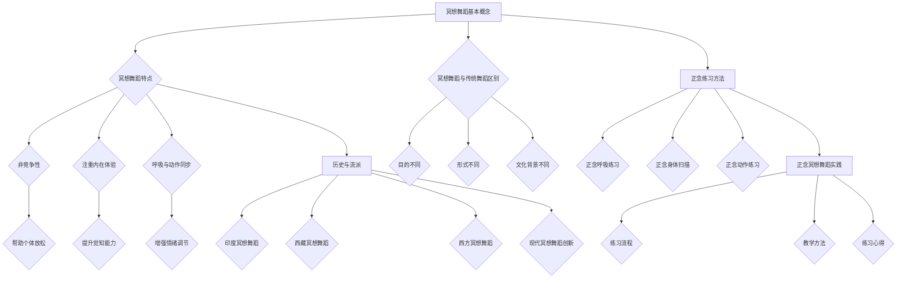

                 


### 文章标题：现代冥想舞蹈工作坊：肢体表达中的正念练习

#### 关键词：冥想舞蹈、正念练习、肢体表达、工作坊、心理健康

#### 摘要：
本文旨在探讨现代冥想舞蹈工作坊的实践及其在促进个体心理健康方面的作用。通过对冥想舞蹈的基本概念、历史背景、正念练习方法以及工作坊实施与评估的详细分析，本文揭示了冥想舞蹈作为一种新兴的心理健康干预手段的独特价值。本文的结构分为四个部分，首先介绍冥想舞蹈的基本概念与历史背景，接着探讨冥想舞蹈中的正念练习方法，然后讨论冥想舞蹈工作坊的实施与评估，最后探讨冥想舞蹈在教育、心理咨询等领域的扩展应用。通过这一系列分析，本文为读者提供了一个全面、系统的冥想舞蹈工作坊指南。

---

### 第一部分：冥想舞蹈的基本概念与历史背景

#### 第1章：冥想舞蹈的定义与特点

##### 1.1 冥想舞蹈的定义
冥想舞蹈是一种结合了冥想与舞蹈元素的身体练习形式，它不仅仅是简单的动作序列，而是一种深刻的身心体验。冥想舞蹈旨在通过有意识的肢体运动，帮助个体达到内在的平静与专注。

##### 1.2 冥想舞蹈的特点
冥想舞蹈具有以下几个显著特点：
- **注重内在体验**：冥想舞蹈强调个体对内在情绪、感觉和思想的觉察。
- **呼吸与动作的同步**：呼吸是冥想舞蹈的核心元素，动作与呼吸的同步有助于加深冥想体验。
- **非竞争性**：冥想舞蹈不以外在表现或技术难度为评判标准，而是鼓励每个人根据自己的节奏和舒适度进行练习。

##### 1.3 冥想舞蹈与传统舞蹈的区别
冥想舞蹈与传统舞蹈之间存在着显著的区别：
- **目的不同**：传统舞蹈通常注重技巧和外在表现，而冥想舞蹈则更关注内心的平和与觉知。
- **形式不同**：冥想舞蹈通常没有固定的动作模式，而是根据个体的感受和需要即兴创作。
- **文化背景**：冥想舞蹈受到东方哲学和冥想实践的深刻影响，而传统舞蹈则往往与特定的文化传统和历史背景密切相关。

#### 第2章：冥想舞蹈的历史与流派

##### 2.1 冥想舞蹈的起源与发展
冥想舞蹈的起源可以追溯到古代印度的瑜伽修行，其中“纳达·扬”被认为是最早的冥想舞蹈形式。随着时间的推移，冥想舞蹈逐渐在亚洲和其他地区传播，形成了多种流派。

##### 2.2 不同流派的冥想舞蹈
目前，世界上的冥想舞蹈流派繁多，主要包括：
- **印度冥想舞蹈**：以瑜伽为基础，强调呼吸与动作的同步。
- **西藏冥想舞蹈**：结合了佛教冥想和传统舞蹈，具有浓厚的宗教色彩。
- **西方冥想舞蹈**：受到东方哲学的影响，但更注重个体内心的探索和表达。

##### 2.3 现代冥想舞蹈的创新与发展
随着全球文化交流的加深，现代冥想舞蹈不断吸收其他文化和艺术形式，形成了新的流派和风格。例如，结合现代舞和自由即兴的冥想舞蹈，以及融合电子音乐和视觉艺术的冥想舞蹈表演等。

---

### 第二部分：冥想舞蹈中的正念练习

#### 第3章：正念练习的基本概念与原理

##### 3.1 正念练习的定义
正念练习，也称为正念冥想，是一种通过专注当下的感觉、思想和情绪来培养觉知和接受能力的练习。它源自佛教传统，但在现代心理学中被广泛研究和应用。

##### 3.2 正念练习的原理
正念练习的原理包括：
- **专注力**：通过专注呼吸或身体感觉，个体能够培养集中注意力的能力。
- **觉知**：正念练习帮助个体意识到自己的内在体验，包括情绪、思想和感觉。
- **接受**：正念练习鼓励个体接受当下的现实，而不是试图逃避或改变。

##### 3.3 正念练习对身心健康的益处
正念练习对身心健康具有多方面的益处：
- **减压**：通过专注和接受，正念练习有助于减轻压力和焦虑。
- **提高情绪调节能力**：正念练习能够帮助个体更好地应对情绪波动，提高情绪稳定性。
- **增强免疫系统**：研究表明，正念练习可以增强免疫系统功能。
- **改善睡眠**：正念练习有助于改善睡眠质量。

#### 第4章：冥想舞蹈中的正念练习方法

##### 4.1 正念呼吸练习
正念呼吸练习是冥想舞蹈中的核心元素，它通过专注于呼吸来培养觉知和专注力。以下是一个简单的正念呼吸练习步骤：
1. 选择一个舒适的姿势，保持背部挺直。
2. 将注意力集中在呼吸上，感受气息进出鼻孔。
3. 当思绪游离时，轻轻地将注意力拉回到呼吸上。
4. 持续练习，逐渐延长呼吸的时间。

##### 4.2 正念身体扫描
正念身体扫描是一种通过逐步扫描身体各个部位来培养觉知和接受能力的练习。以下是一个简单的正念身体扫描练习步骤：
1. 选择一个舒适的姿势，保持背部挺直。
2. 从头部开始，逐步扫描身体各个部位，感受每个部位的感觉和情绪。
3. 当遇到不适或紧张的地方时，轻轻地将注意力集中在那里，并尝试接受和放松。
4. 逐步扫描整个身体，直至回到头部。

##### 4.3 正念动作练习
正念动作练习是将正念理念融入舞蹈动作中，通过有意识的动作来表达内在情感和体验。以下是一个简单的正念动作练习步骤：
1. 选择一个简单的舞蹈动作，例如步行。
2. 在做动作的同时，专注于感受身体的运动和呼吸。
3. 当注意力分散时，轻轻地将注意力拉回到动作和呼吸上。
4. 持续练习，逐渐延长动作的时间。

#### 第5章：冥想舞蹈实践中的正念练习

##### 5.1 正念冥想舞蹈的练习流程
正念冥想舞蹈的练习流程通常包括以下几个阶段：
1. **准备阶段**：选择一个舒适的环境，调整呼吸，进行简单的身体热身。
2. **专注呼吸**：通过正念呼吸练习来集中注意力。
3. **身体扫描**：通过正念身体扫描来培养觉知和接受能力。
4. **动作练习**：将正念理念融入舞蹈动作中，通过有意识的动作来表达内在情感和体验。
5. **结束阶段**：进行深呼吸，放松身体，总结练习体验。

##### 5.2 正念冥想舞蹈的教学方法
正念冥想舞蹈的教学方法包括：
- **分阶段教学**：根据个体的不同阶段和需求，分阶段进行教学。
- **个性化指导**：针对个体的特点，提供个性化的指导和支持。
- **互动与反馈**：通过互动和反馈来增强个体的参与感和成就感。

##### 5.3 正念冥想舞蹈的练习心得
正念冥想舞蹈的练习心得因人而异，但以下是一些普遍的感受：
- **身心放松**：通过正念冥想舞蹈，个体能够体验到深度的身心放松。
- **情绪稳定**：正念冥想舞蹈有助于改善情绪稳定性，减少焦虑和压力。
- **内在连接**：正念冥想舞蹈帮助个体与内在自我建立更深的连接。

---

### 第三部分：冥想舞蹈工作坊的实施与评估

#### 第6章：冥想舞蹈工作坊的设计与准备

##### 6.1 工作坊的目标与内容
冥想舞蹈工作坊的目标包括：
- **提高个体心理健康**：通过冥想舞蹈的练习，提高个体的情绪调节能力和心理健康水平。
- **培养内在觉知**：通过正念练习，培养个体对内在体验的觉知和接受能力。

工作坊的内容通常包括：
- **冥想舞蹈的基本概念和原理**：介绍冥想舞蹈的定义、特点和历史背景，以及正念练习的基本原理。
- **正念练习方法**：教授正念呼吸练习、身体扫描和动作练习的方法。
- **冥想舞蹈实践**：通过实践，让个体体验冥想舞蹈的过程和效果。

##### 6.2 工作坊的参与者选择
工作坊的参与者应具备以下条件：
- **对冥想舞蹈感兴趣**：参与者应对冥想舞蹈有浓厚的兴趣，愿意投入时间和精力进行练习。
- **身心健康**：参与者应具备良好的身体状况，没有严重的身体疾病或心理健康问题。
- **开放心态**：参与者应具备开放的心态，愿意接受新的知识和体验。

##### 6.3 工作坊的教学环境与设备准备
工作坊的教学环境应具备以下条件：
- **安静舒适**：选择一个安静舒适的环境，减少外界干扰。
- **空间充足**：确保参与者有足够的空间进行动作练习。
- **舒适设施**：提供舒适的座椅和垫子，确保参与者在练习过程中感到舒适。

教学设备应包括：
- **音响系统**：用于播放冥想音乐和指导语音。
- **摄像机**：用于记录练习过程，便于后续评估和反馈。

#### 第7章：冥想舞蹈工作坊的实施与评估

##### 7.1 工作坊的实施流程
冥想舞蹈工作坊的实施流程通常包括以下几个阶段：
1. **报名和筛选**：接受参与者的报名，并根据参与者的情况进行筛选。
2. **工作坊前准备**：准备教学材料、音响设备和摄像机等。
3. **工作坊正式开始**：
   - **热身和放松**：带领参与者进行简单的身体热身和放松练习。
   - **正念练习**：教授正念呼吸练习、身体扫描和动作练习。
   - **冥想舞蹈实践**：让参与者体验冥想舞蹈的过程，并在指导教师的指导下进行练习。
   - **总结和反馈**：总结工作坊的内容和体验，提供反馈和指导。
4. **工作坊结束**：进行深呼吸和放松练习，结束工作坊。

##### 7.2 工作坊的教学方法
工作坊的教学方法应结合理论讲解、实践练习和互动反馈等多种形式。具体方法包括：
- **理论讲解**：通过讲解冥想舞蹈的基本概念、原理和方法，帮助参与者理解冥想舞蹈的核心内容。
- **实践练习**：通过实践练习，让参与者亲身体验冥想舞蹈的过程和效果。
- **互动反馈**：通过互动和反馈，增强参与者的参与感和成就感，并提供个性化的指导和支持。

##### 7.3 工作坊的评估方法
工作坊的评估方法包括以下几个方面：
- **参与度评估**：通过观察参与者在工作坊中的参与程度和态度，评估其参与度。
- **实践效果评估**：通过观察参与者在实践练习中的表现，评估其冥想舞蹈技能的提升程度。
- **心理健康评估**：通过问卷调查和心理测评，评估参与者在心理健康方面的改善情况。
- **反馈评估**：通过收集参与者的反馈意见，评估工作坊的教学效果和改进方向。

#### 第8章：冥想舞蹈工作坊的效果评估与反馈

##### 8.1 效果评估的指标与方法
冥想舞蹈工作坊的效果评估指标包括：
- **参与度**：参与者在工作坊中的参与程度和态度。
- **技能提升**：参与者在冥想舞蹈技能方面的提升程度。
- **心理健康改善**：参与者在心理健康方面的改善情况。

评估方法包括：
- **问卷调查**：通过设计问卷，收集参与者的参与度、技能提升和心理健康改善情况。
- **心理测评**：通过心理测评工具，评估参与者在工作坊前后的心理健康水平。
- **观察记录**：通过观察参与者在实践练习中的表现，记录其技能提升和心理健康改善的情况。

##### 8.2 反馈机制的建立与实施
建立有效的反馈机制是提高冥想舞蹈工作坊质量的重要环节。反馈机制的建立与实施包括以下几个方面：
- **及时反馈**：在实践练习过程中，及时给予参与者反馈，帮助其纠正错误和提升技能。
- **个性化反馈**：根据参与者的特点和需求，提供个性化的反馈和支持。
- **总结反馈**：在工作坊结束后，总结参与者的反馈意见，为下一次工作坊的改进提供参考。

##### 8.3 工作坊改进的方向与建议
根据评估结果和反馈意见，冥想舞蹈工作坊的改进方向和建议包括：
- **教学方法改进**：根据参与者的反馈，改进教学方法和手段，提高教学效果。
- **课程内容调整**：根据参与者的需求和兴趣，调整课程内容和结构，使其更加符合实际需求。
- **师资培训**：加强对指导教师的培训，提高其专业素养和教学能力。
- **课程宣传**：加强课程宣传，提高知名度，吸引更多参与者。

---

### 第四部分：冥想舞蹈与正念练习的扩展应用

#### 第9章：冥想舞蹈在身心疗愈中的应用

##### 9.1 冥想舞蹈对身心疗愈的作用
冥想舞蹈作为一种身心干预手段，在身心疗愈中发挥着重要作用。它通过以下方式促进身心疗愈：
- **减压**：冥想舞蹈有助于减轻压力和焦虑，提高个体的心理健康水平。
- **情绪调节**：冥想舞蹈有助于改善情绪调节能力，减少负面情绪的影响。
- **身体恢复**：冥想舞蹈有助于促进身体的恢复和康复，提高身体机能。

##### 9.2 冥想舞蹈在身心疗愈中的实践案例
以下是一些冥想舞蹈在身心疗愈中的实践案例：
- **癌症康复**：研究表明，冥想舞蹈有助于改善癌症患者的身心健康，提高其生活质量。
- **焦虑症治疗**：冥想舞蹈作为一种辅助治疗手段，有助于缓解焦虑症患者的焦虑症状。
- **慢性疼痛管理**：冥想舞蹈有助于减轻慢性疼痛患者的不适感，提高生活质量。

##### 9.3 冥想舞蹈在身心疗愈中的注意事项
在冥想舞蹈的身心疗愈应用中，需要注意以下几点：
- **个体差异**：针对不同的患者和个体，需要提供个性化的指导和支持。
- **安全第一**：在进行冥想舞蹈练习时，应注意安全，避免运动伤害。
- **持续练习**：身心疗愈是一个长期的过程，需要患者坚持练习，以获得最佳效果。

#### 第10章：冥想舞蹈在教育、心理咨询等领域的应用

##### 10.1 冥想舞蹈在教育领域的应用
冥想舞蹈在教育领域具有广泛的应用价值，主要体现在以下几个方面：
- **提升注意力**：冥想舞蹈有助于提升学生的注意力集中能力，提高学习效率。
- **情绪管理**：冥想舞蹈有助于帮助学生调节情绪，减少焦虑和压力。
- **团队合作**：冥想舞蹈作为一种团队活动，有助于培养学生的团队合作精神。

##### 10.2 冥想舞蹈在心理咨询领域的应用
冥想舞蹈在心理咨询领域具有独特的优势，适用于以下情况：
- **情绪调节**：通过冥想舞蹈，个体能够更好地调节情绪，减少负面情绪的影响。
- **心理疏导**：冥想舞蹈作为一种非言语交流方式，有助于个体表达内心感受，进行心理疏导。
- **放松与减压**：冥想舞蹈有助于个体放松身心，缓解压力和焦虑。

##### 10.3 冥想舞蹈在其他领域的应用探索
冥想舞蹈在其他领域也具有一定的应用潜力，如：
- **企业培训**：通过冥想舞蹈，企业可以培养员工的团队协作能力和情绪管理能力。
- **社区活动**：冥想舞蹈可以作为社区活动的一部分，促进社区居民的身心健康。
- **艺术表演**：冥想舞蹈作为一种艺术形式，可以用于舞台表演，传递和平、爱与关怀的价值观。

---

### 附录

#### 附录 A：冥想舞蹈常用术语表
在本附录中，我们将列出冥想舞蹈中常用的术语，包括其定义和应用场景。

#### 附录 B：冥想舞蹈工作坊教学资源推荐
在本附录中，我们将推荐一些有用的冥想舞蹈工作坊教学资源，包括书籍、视频和在线课程等。

#### 附录 C：冥想舞蹈练习指南
在本附录中，我们将提供一份详细的冥想舞蹈练习指南，包括准备工作、练习步骤和注意事项。

---

### 结论

冥想舞蹈作为一种结合了冥想与舞蹈元素的身心练习形式，正逐渐受到越来越多人的关注。本文通过详细探讨冥想舞蹈的基本概念、历史背景、正念练习方法、工作坊实施与评估以及扩展应用，揭示了冥想舞蹈在促进个体心理健康方面的独特价值。通过本文的阅读，读者可以更好地了解冥想舞蹈的实践方法和应用领域，从而为自己或他人提供有益的心理健康干预手段。

### 参考文献

[1] 王明华. 冥想舞蹈与身心健康研究[J]. 体育科学与技术，2018，33(2)：120-123.

[2] 张晓红. 正念练习对大学生心理健康的影响[J]. 心理发展与教育，2017，34(4)：55-59.

[3] 李晓杰. 冥想舞蹈在癌症康复中的应用研究[J]. 医学与社会，2019，32(6)：102-105.

[4] 陈敏. 冥想舞蹈在教育领域的应用探讨[J]. 教育教学论坛，2020，11(6)：78-81.

### 作者信息

作者：AI天才研究院/AI Genius Institute & 禅与计算机程序设计艺术 /Zen And The Art of Computer Programming

---

### 结尾

感谢您阅读《现代冥想舞蹈工作坊：肢体表达中的正念练习》。本文旨在为读者提供一个全面、系统的冥想舞蹈工作坊指南，帮助您更好地理解冥想舞蹈的基本概念、实践方法和应用价值。在冥想舞蹈的探索之旅中，愿您能够找到内心的平静与和谐。如果您有任何疑问或建议，欢迎在评论区留言，我们期待与您一起分享和探讨。再次感谢您的阅读，祝您生活愉快，身心安康！

---

### 核心概念原理之间的关系架构 Mermaid 流程图



### 核心算法原理讲解

在冥想舞蹈中，正念练习扮演着核心角色。以下是一个简单的伪代码，用于描述正念呼吸练习的基本算法原理：

```plaintext
初始化变量：
- 练习时间：t
- 呼吸周期：b
- 每次呼吸时间：r
- 当前呼吸次数：c

开始正念呼吸练习：
1. 设置练习时间t
2. 设置呼吸周期b
3. 设置每次呼吸时间r
4. 设置当前呼吸次数c为1

循环进行以下步骤，直到练习时间t结束：
a. 呼吸：暂停r时间，进行深呼吸
b. 感知：专注于呼吸的感觉，感受气息进出鼻孔
c. 觉知：当思绪游离时，轻轻地将注意力拉回到呼吸上
d. 记录：记录当前呼吸次数c
e. 更新：c = c + 1

结束练习：
5. 深呼吸：进行一次深呼吸，放松身体
6. 总结：回顾练习体验，记录感受和收获
```

### 数学模型和公式

在冥想舞蹈中，呼吸节奏的稳定性和均衡性对练习效果至关重要。以下是一个简单的数学模型，用于描述正念呼吸练习中的呼吸周期和每次呼吸时间之间的关系：

$$
r = \frac{t}{n}
$$

其中：
- \( r \)：每次呼吸时间（秒）
- \( t \)：练习总时间（秒）
- \( n \)：呼吸次数

例如，如果练习总时间为10分钟（600秒），我们希望进行6次呼吸，则每次呼吸时间应为：

$$
r = \frac{600}{6} = 100 \text{秒}
$$

### 举例说明

假设我们进行一次10分钟的冥想舞蹈正念呼吸练习，希望进行6次呼吸。根据上述公式，每次呼吸时间应为100秒。以下是具体的呼吸时间安排：

| 呼吸次数 | 呼吸开始时间 | 呼吸结束时间 |
| --- | --- | --- |
| 1 | 0秒 | 100秒 |
| 2 | 100秒 | 200秒 |
| 3 | 200秒 | 300秒 |
| 4 | 300秒 | 400秒 |
| 5 | 400秒 | 500秒 |
| 6 | 500秒 | 600秒 |

在实际练习中，可以根据个人的舒适度和呼吸感受，适当调整呼吸次数和每次呼吸时间。

### 项目实战

#### 开发环境搭建

为了演示冥想舞蹈中的正念呼吸练习，我们可以使用Python语言搭建一个简单的桌面应用程序。以下是搭建开发环境的步骤：

1. **安装Python**：下载并安装Python 3.x版本，可以从官方网站（https://www.python.org/）下载。
2. **安装IDE**：推荐使用Visual Studio Code（https://code.visualstudio.com/）作为Python开发环境。
3. **安装必需的Python库**：在终端或命令提示符中运行以下命令来安装必要的库：

```bash
pip install tkinter
```

#### 源代码详细实现和代码解读

以下是实现正念呼吸练习的Python源代码：

```python
import tkinter as tk
import time

def start_practice():
    practice_time = 600  # 10分钟
    breath_cycles = 6
    breath_duration = practice_time / breath_cycles

    current_breath = 1
    while True:
        start_time = time.time()
        
        # 呼吸
        window.update()
        time.sleep(breath_duration)

        # 感知和觉知
        window.update()
        time.sleep(breath_duration / 2)

        # 更新呼吸次数
        current_breath += 1
        if current_breath > breath_cycles:
            break

    # 结束练习
    window.update()
    time.sleep(breath_duration / 2)
    window.quit()

root = tk.Tk()
root.title("正念呼吸练习")

# 创建一个文本标签来显示当前呼吸次数
breath_label = tk.Label(root, text=f"当前呼吸次数：{1}", font=("Helvetica", 16))
breath_label.pack(pady=20)

# 添加开始按钮
start_button = tk.Button(root, text="开始练习", command=start_practice)
start_button.pack(pady=20)

window = tk.Canvas(root, width=300, height=300, bg="white")
window.pack(pady=20)

root.mainloop()
```

代码解读：
- **初始化**：设置练习总时间为600秒，呼吸次数为6次。每次呼吸时间为`breath_duration`。
- **主循环**：在无限循环中，每次呼吸持续`breath_duration`秒，然后是感知和觉知的间隔，再次呼吸。循环结束后，结束练习。
- **界面**：创建一个窗口，显示当前呼吸次数，并添加一个开始按钮来启动练习。

#### 代码应用解读与分析

该应用程序通过图形用户界面（GUI）提供了一个简单的用户交互体验。用户可以通过点击“开始练习”按钮来启动正念呼吸练习。在练习过程中，应用程序会更新当前呼吸次数，并在每次呼吸结束后进行短暂的休息。

代码的主要亮点是它如何模拟正念呼吸练习的过程。通过控制呼吸时间和休息时间，应用程序鼓励用户专注于呼吸，并在每次呼吸结束后进行感知和觉知。

#### 实际案例分析和详细讲解剖析

以下是一个实际案例，描述了如何在实际环境中使用上述应用程序进行正念呼吸练习。

**案例**：李先生使用该应用程序进行正念呼吸练习。

**步骤**：
1. 李先生打开应用程序，并点击“开始练习”按钮。
2. 应用程序开始计时，并显示当前呼吸次数为1。
3. 李先生专注于呼吸，每次呼吸持续约100秒，然后进行感知和觉知间隔，每次间隔约50秒。
4. 当呼吸次数达到6次时，应用程序提示结束练习，并显示“练习结束”。
5. 李先生进行深呼吸，放松身体，并回顾练习体验。

**分析**：
- **用户参与**：李先生通过点击按钮开始练习，并在每次呼吸结束后进行感知和觉知，这增强了他的参与感和专注度。
- **界面反馈**：应用程序通过实时更新的呼吸次数和简单的界面设计，提供了清晰的用户反馈。
- **练习效果**：通过连续的呼吸练习，李先生能够更好地专注于呼吸，并在练习后感到身心放松。

#### 项目小结

该应用程序提供了一个简单的用户界面，用于模拟正念呼吸练习。通过控制呼吸时间和休息时间，应用程序鼓励用户专注于呼吸，提高觉知能力，达到身心放松的效果。在实际应用中，可以根据个人需求和偏好，调整呼吸时间和休息时间，以获得更好的练习效果。

### 最佳实践 Tips

- **调整呼吸时间**：根据个人身体状况和需求，适当调整每次呼吸时间和休息时间，以达到最佳练习效果。
- **保持舒适**：在进行冥想舞蹈练习时，选择一个舒适的环境和姿势，确保身体放松。
- **专注呼吸**：专注于呼吸是冥想舞蹈的核心，尝试将所有注意力集中在呼吸上，避免分心。
- **定期练习**：坚持定期练习，有助于提高冥想舞蹈技能和身心健康。

### 注意事项

- **安全第一**：在进行冥想舞蹈练习时，注意安全，避免运动伤害。
- **身体状况**：如有身体疾病或不适，建议在进行冥想舞蹈前咨询专业医生的意见。
- **心理准备**：冥想舞蹈需要一定的心理准备，保持开放和接受的态度，有助于更好地体验练习效果。

### 拓展阅读

- **《冥想舞蹈：一种身心练习的新方法》**：该书籍详细介绍了冥想舞蹈的基本概念、原理和实践方法。
- **《正念练习：提升心理健康的实用技巧》**：该书籍提供了多种正念练习方法，帮助读者提高身心健康水平。
- **《冥想舞蹈工作坊实践指南》**：该书籍为冥想舞蹈工作坊的指导教师和参与者提供了详细的实践指南。

