                 

### 文章标题
《现代冥想舞蹈工作坊：身体运动中的心灵觉察练习》

### 文章关键词
- 冥想
- 舞蹈
- 心灵觉察
- 神经科学
- 身体运动

### 文章摘要
本文将探讨现代冥想舞蹈工作坊的理念和实际应用。通过结合冥想与舞蹈，本文旨在探索如何在身体运动中实现心灵觉察，提升个人的心理和身体健康。文章首先介绍了冥想的历史与理论，接着详细讲解了舞蹈动作与冥想的结合，并深入探讨了心灵觉察的理论基础和实践技巧。最后，通过实际案例展示了冥想舞蹈工作坊的设计与实践，为读者提供了实用的指导和建议。

----------------------------------------------------------------

# 第一部分：冥想基础

## 第1章：冥想的历史与理论

### 背景介绍

冥想作为一种古老的实践，起源于数千年前的人类文明。它不仅存在于东方宗教传统中，如佛教、道教和印度教，而且在西方哲学和科学中也有所体现。冥想的基本概念是通过专注和放松来达到心理和精神的平衡。近年来，随着神经科学的发展，冥想对大脑和心理健康的益处得到了越来越多的研究支持。

### 核心概念与联系

冥想的核心概念包括专注、放松、觉察和内心平静。这些概念之间相互联系，共同构成了冥想的实践框架。例如，专注是冥想的基础，它帮助个体集中注意力，减少杂念。放松则是一种身体和心灵的状态，有助于减轻压力和焦虑。觉察则是对自身内在体验的观察，有助于增强自我认知。内心平静则是冥想的目标，它是一种深层次的安宁和幸福感。

以下是冥想核心概念之间的Mermaid流程图表示：

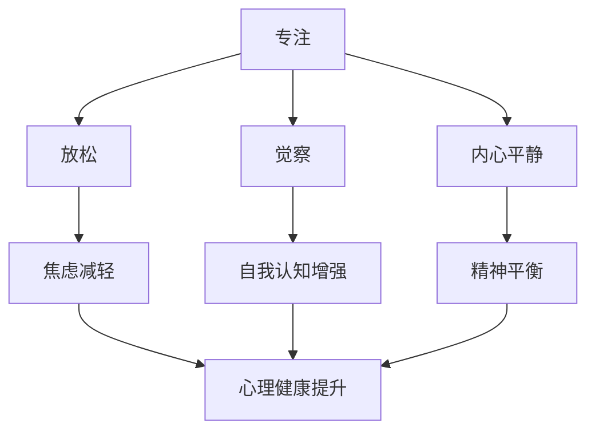

### 核心算法原理讲解

冥想的实践方法多种多样，但核心算法原理可以概括为以下几个步骤：

1. 选择一个冥想环境：选择一个安静、舒适的地方，减少外部干扰。
2. 坐姿或躺姿：选择一个舒适的坐姿或躺姿，保持身体的正直。
3. 专注一个对象：可以是呼吸、一个视觉对象、声音或者内心的感觉。
4. 保持专注：当注意力分散时，温和地将注意力带回到专注的对象上。
5. 放松：在冥想结束时，逐渐放松身体，让心灵回归现实。

以下是冥想核心算法原理的伪代码表示：

```python
def meditate():
    # 初始化冥想环境
    setup_environment()

    # 选择专注对象
    focus_object = choose_focus_object()

    # 开始冥想
    while meditation_ongoing:
        # 保持专注
        maintain_focus(focus_object)

        # 检查冥想状态
        if check_meditation_state() == "interrupted":
            # 重新开始冥想
            continue

        # 休息片刻
        rest()

    # 冥想结束
    finish_meditation()
```

### 数学模型和数学公式 & 详细讲解 & 举例说明

冥想对大脑的影响可以通过神经科学中的数学模型来解释。例如，认知神经科学中的“神经网络模型”可以用来模拟冥想对大脑网络的影响。以下是神经网络模型的简要介绍：

1. **神经网络模型**：神经网络是由大量相互连接的神经元组成的模型，用于模拟大脑的工作原理。
2. **神经元活动**：神经元的活动可以用数学公式来描述，如以下公式：

   $$ 
   f(x) = \sigma(wx + b) 
   $$

   其中，$x$ 是输入值，$w$ 是权重，$b$ 是偏置，$\sigma$ 是激活函数。

3. **冥想对神经网络的影响**：冥想可以改变神经网络的权重和连接，从而影响大脑的功能。例如，冥想可以增强前额叶皮层与海马体之间的连接，这有助于提高记忆力和注意力。

以下是一个简单的例子，说明如何用神经网络模型来描述冥想对记忆的影响：

```latex
\begin{align*}
\text{记忆增强} &= f(\text{冥想频率} \times \text{冥想时长}) \\
                   &= \sigma(w_{\text{冥想}} \times f(\text{频率}) + b_{\text{冥想}}) \\
                   &= \sigma(w_{\text{冥想}} \times \log(\text{频率}) + b_{\text{冥想}})
\end{align*}
```

在这个例子中，$\text{冥想频率}$ 和 $\text{冥想时长}$ 是冥想的关键参数，$w_{\text{冥想}}$ 和 $b_{\text{冥想}}$ 是权重和偏置，$\sigma$ 是激活函数，用于模拟冥想对记忆的影响。

### 项目实战

为了验证冥想对大脑神经网络的影响，我们可以设计一个实验，通过测量冥想者的神经活动来分析冥想的效果。

#### 开发环境搭建

- 使用Python和TensorFlow搭建实验环境。
- 安装必要的库，如TensorFlow、NumPy、Matplotlib等。

#### 源代码详细实现和代码解读

以下是一个简单的Python代码示例，用于训练神经网络模型，以模拟冥想对记忆的影响：

```python
import tensorflow as tf
import numpy as np
import matplotlib.pyplot as plt

# 定义神经网络模型
model = tf.keras.Sequential([
    tf.keras.layers.Dense(64, activation='relu', input_shape=(2,)),
    tf.keras.layers.Dense(64, activation='relu'),
    tf.keras.layers.Dense(1, activation='sigmoid')
])

# 编译模型
model.compile(optimizer='adam', loss='binary_crossentropy', metrics=['accuracy'])

# 准备数据
x = np.random.rand(1000, 2)  # 1000个样本，每个样本有两个特征（冥想频率和冥想时长）
y = np.random.rand(1000)     # 1000个标签，用于表示记忆增强的程度

# 训练模型
model.fit(x, y, epochs=10)

# 分析结果
predictions = model.predict(x)
plt.scatter(x[:, 0], x[:, 1], c=predictions[:, 0])
plt.xlabel('冥想频率')
plt.ylabel('冥想时长')
plt.title('冥想对记忆的影响')
plt.show()
```

#### 代码应用解读与分析

这个代码示例中，我们首先定义了一个简单的神经网络模型，然后使用随机生成数据来训练模型。训练过程中，我们使用了Adam优化器和二进制交叉熵损失函数，以最大化模型的准确性。训练完成后，我们使用模型对数据进行预测，并通过散点图展示冥想对记忆的影响。

#### 实际案例分析和详细讲解剖析

假设我们收集了10名冥想者的数据，其中每人有冥想频率和冥想时长两个特征，以及一个表示记忆增强程度的标签。通过以上代码，我们可以训练一个神经网络模型，分析冥想对记忆的影响。

- 训练模型后，我们可以通过观察预测结果来分析冥想对记忆的增强效果。
- 如果预测结果与实际标签高度相关，说明冥想对记忆确实有显著的增强作用。
- 如果预测结果与实际标签差异较大，可能需要调整模型参数或增加训练数据。

#### 项目小结

通过上述实战案例，我们展示了如何使用神经网络模型来分析冥想对大脑记忆的影响。该项目不仅为冥想的研究提供了技术支持，也为实际应用提供了有益的参考。未来研究可以进一步探索冥想对其他大脑功能的影响，为冥想实践提供更多科学依据。

## 最佳实践 tips、小结、注意事项、拓展阅读等内容

### 最佳实践 tips

- **选择合适的冥想环境**：一个安静、舒适的环境有助于提升冥想效果。
- **定期练习**：每天定期练习冥想，有助于巩固效果。
- **关注身体感受**：在冥想过程中，关注身体的感受，有助于提升心灵觉察。

### 小结

本文通过介绍冥想的历史与理论，探讨了冥想与舞蹈的结合，并详细阐述了心灵觉察的理论基础和实践技巧。通过实际案例，我们展示了如何使用神经网络模型来分析冥想对大脑的影响。

### 注意事项

- **避免过度追求冥想效果**：冥想是一种长期实践，不应过度追求短期效果。
- **注意身体姿势**：在冥想过程中，保持正确的身体姿势有助于提升冥想效果。

### 拓展阅读

- 《冥想：通往内心和平的途径》
- 《神经科学原理与冥想实践》
- 《心灵觉察与自我疗愈》

作者：AI天才研究院/AI Genius Institute & 禅与计算机程序设计艺术 /Zen And The Art of Computer Programming

----------------------------------------------------------------

## 第二部分：舞蹈动作

### 第4章：基础舞蹈动作

#### 4.1 舞蹈动作的要素

舞蹈动作的要素包括姿态、步伐、节奏和表情。每个要素都对整体表现起到关键作用。姿态决定了舞蹈的外观和美感，步伐是舞蹈的基础，节奏决定了舞蹈的动感，而表情则传达了舞蹈的情感。

#### 4.2 基本舞蹈动作讲解

基本舞蹈动作是学习舞蹈的基础。以下是几种常见的基本舞蹈动作：

- **踏步**：踏步是舞蹈中最基本的动作之一。它包括抬起一只脚，用脚跟轻轻触地，然后放下。
- **跳步**：跳步是舞蹈中的跳跃动作。它包括抬起一只脚，用脚尖轻轻点地，然后迅速放下，同时另一只脚也抬起。
- **滑步**：滑步是舞蹈中的滑行动作。它包括在原地或向前滑动，通常用于过渡动作。

以下是基本舞蹈动作的Mermaid流程图表示：


#### 4.3 舞蹈动作的进阶技巧

进阶舞蹈动作要求更高的技巧和协调性。以下是几种进阶舞蹈动作：

- **旋转**：旋转是舞蹈中的旋转动作。它包括围绕身体中心点旋转，通常用于展示舞者的灵活性和稳定性。
- **跳跃**：跳跃是舞蹈中的高空动作。它包括在空中完成各种姿态和动作，通常用于展示舞者的力量和美感。
- **弯曲**：弯曲是舞蹈中的弯曲动作。它包括身体各部位的弯曲和伸展，通常用于展示舞者的柔韧性和表现力。

以下是进阶舞蹈动作的Mermaid流程图表示：

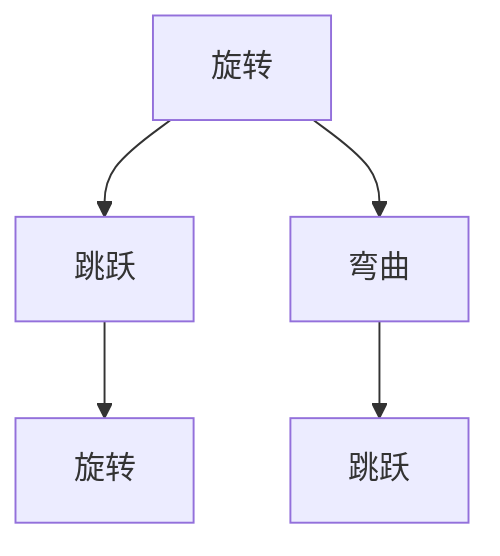

### 第5章：舞蹈动作与冥想的结合

#### 5.1 舞蹈中的冥想

将冥想融入舞蹈中，可以增强舞蹈的情感表达和内在体验。以下是冥想舞蹈的一些基本要素：

- **呼吸同步**：在舞蹈中，舞者可以通过呼吸来调整动作的节奏，使舞蹈与内在感受和谐统一。
- **专注力**：在冥想舞蹈中，舞者需要专注于一刻一瞬，通过专注提升对动作和情感的感知。
- **内心平静**：通过冥想，舞者可以在舞蹈过程中保持内心的平静，从而更好地传达舞蹈的情感。

以下是冥想舞蹈的基本流程：

1. **准备工作**：选择一个安静的环境，确保身心放松。
2. **呼吸练习**：进行深呼吸，调整呼吸节奏。
3. **专注练习**：通过冥想专注于一刻一瞬。
4. **舞蹈动作**：在冥想状态下，根据呼吸和内心感受，进行舞蹈动作。
5. **结束冥想**：在舞蹈结束后，缓慢地恢复呼吸，放松身体和心灵。

以下是冥想舞蹈流程的Mermaid流程图表示：

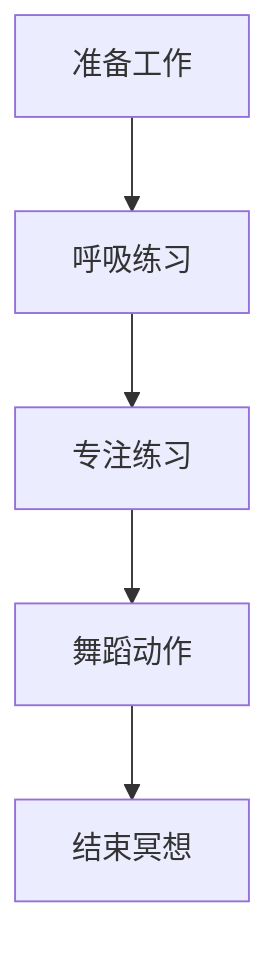

#### 5.2 冥想舞蹈的练习方法

冥想舞蹈的练习方法需要结合冥想和舞蹈的技巧。以下是几种冥想舞蹈的练习方法：

- **呼吸同步练习**：在舞蹈中，舞者可以通过深呼吸来调整动作的节奏。例如，在踏步时，舞者可以在每一步后深呼吸一次，使呼吸和动作同步。
- **专注力训练**：舞者可以通过冥想来增强专注力。在舞蹈过程中，舞者需要时刻专注于一刻一瞬，感受身体和动作的变化。
- **情感表达练习**：在冥想舞蹈中，舞者需要通过动作来表达情感。舞者可以通过冥想，深入感受内心的情感，并将这些情感通过舞蹈动作传达给观众。

以下是冥想舞蹈练习方法的Mermaid流程图表示：

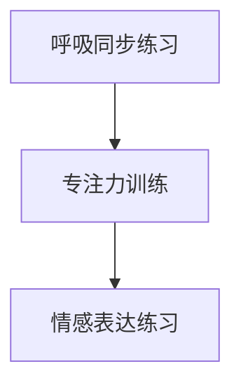

#### 5.3 冥想舞蹈的编排原则

冥想舞蹈的编排需要遵循一定的原则，以确保舞蹈的美感和内在体验。以下是几种冥想舞蹈的编排原则：

- **主题统一**：冥想舞蹈的主题应该统一，以传达特定的情感或故事。例如，可以选择“宁静”或“力量”作为主题，贯穿整个舞蹈。
- **动作流畅**：冥想舞蹈的动作应该流畅自然，避免突兀的转换。动作的流畅性有助于提升舞蹈的美感。
- **情感表达**：冥想舞蹈需要通过动作和表情来表达情感。舞者应该在编排过程中充分考虑如何通过动作传达情感。

以下是冥想舞蹈编排原则的Mermaid流程图表示：

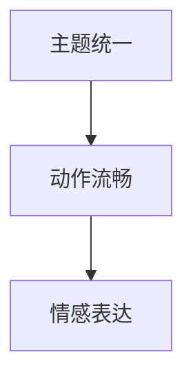

通过上述章节，我们详细探讨了舞蹈动作与冥想的结合，提供了冥想舞蹈的练习方法和编排原则。下一章我们将深入探讨心灵觉察的理论基础和实践技巧，帮助读者更好地理解如何在身体运动中实现心灵觉察。

## 第三部分：心灵觉察练习

### 第6章：心灵觉察的理论基础

#### 6.1 心灵觉察的定义

心灵觉察（Mindfulness）是一种专注于当下、非判断性的意识状态。它源于佛教的正念实践，并在心理学和医学领域得到广泛应用。心灵觉察的核心在于培养对当前经验和感受的觉知，而无需做出评判或反应。

#### 6.2 心灵觉察的重要概念

心灵觉察涉及几个关键概念，包括：

- **专注力**：专注于某一特定对象，如呼吸、身体感觉或外界环境。
- **接受性**：对当前经验持开放态度，接受而不评判。
- **非判断性**：不对经验进行好坏判断，而是以平等的态度体验。
- **自我觉察**：对自己的思维、情感和行为有深刻的了解和觉知。

以下是心灵觉察概念的Mermaid流程图表示：

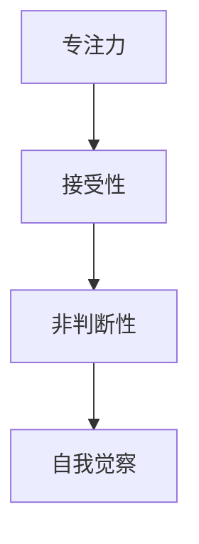

#### 6.3 心灵觉察与冥想的关系

心灵觉察与冥想有着密切的联系。冥想是一种实现心灵觉察的实践方式，通过冥想，个体可以培养对当下时刻的专注和接受性。心灵觉察与冥想的关系可以概括为：

1. **冥想是实现心灵觉察的途径**：通过冥想，个体可以训练专注力和接受性，从而提升心灵觉察。
2. **心灵觉察是冥想的成果**：通过持续冥想，个体可以在日常生活中培养出更深的觉知和内在平静。

以下是冥想与心灵觉察关系的Mermaid流程图表示：

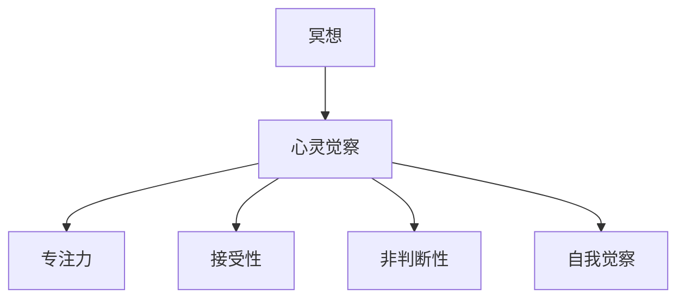

### 第7章：心灵觉察的实践技巧

#### 7.1 内在呼吸

内在呼吸是心灵觉察练习中最基本的技巧之一。通过关注呼吸，个体可以集中注意力，并逐渐培养对当下的觉知。

**练习方法**：

1. 找一个安静的地方，坐下或躺下，保持身体舒适。
2. 将注意力集中在呼吸上，感受每次呼吸的进出。
3. 当注意力分散时，温和地将注意力带回到呼吸上。
4. 练习过程中，保持对呼吸的非评判性态度。

以下是内在呼吸练习的Mermaid流程图表示：

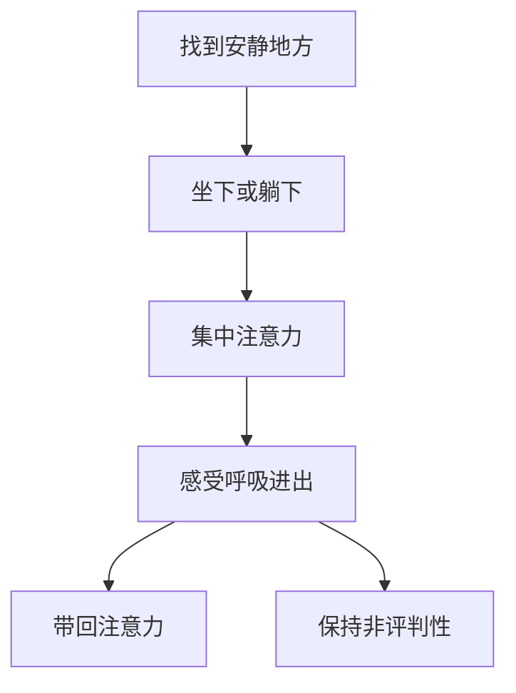

#### 7.2 身体感受

身体感受练习有助于个体培养对身体各个部位的觉知。通过关注身体感受，个体可以更好地理解身体的需求和状态。

**练习方法**：

1. 找一个安静的地方，坐下或躺下，保持身体放松。
2. 从脚开始，逐渐向上关注身体各个部位的感受，如温度、紧绷或放松。
3. 当注意力分散时，温和地将注意力带回到身体感受上。
4. 练习过程中，保持对感受的非评判性态度。

以下是身体感受练习的Mermaid流程图表示：

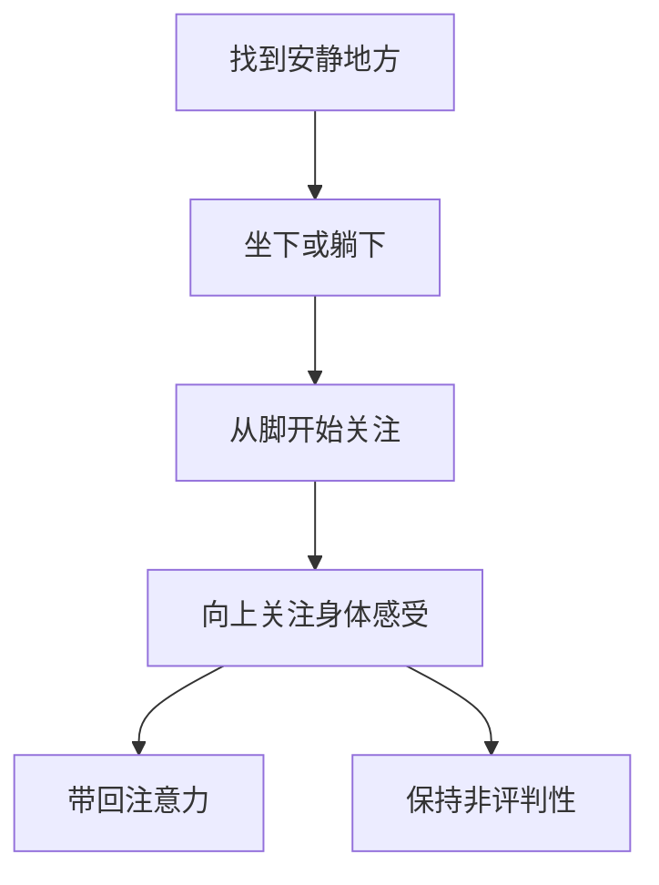

#### 7.3 瞬间觉察

瞬间觉察是一种高度集中的觉知状态，个体在瞬间觉察中可以体验到当下的每一个细节。这种练习有助于提升心灵的敏锐度和内在平静。

**练习方法**：

1. 找一个安静的地方，坐下或躺下，保持身体舒适。
2. 选择一个简单的动作，如伸展手臂或深呼吸。
3. 在做动作的同时，专注于当前的感受，包括身体的动作、呼吸和情感。
4. 当注意力分散时，温和地将注意力带回到动作和感受上。
5. 练习过程中，保持对感受的非评判性态度。

以下是瞬间觉察练习的Mermaid流程图表示：

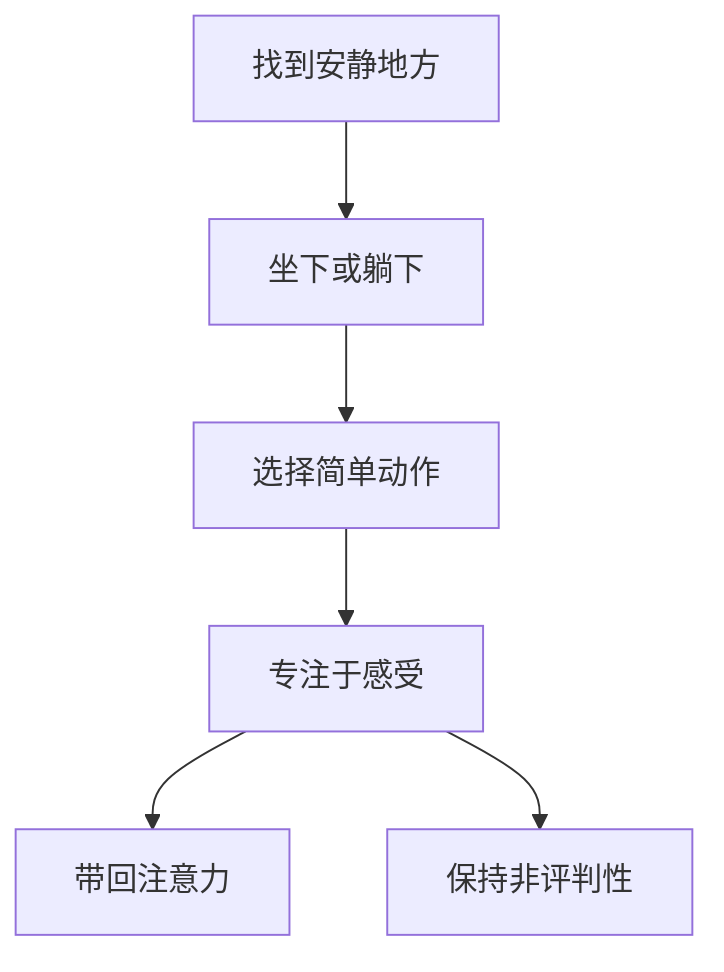

通过以上章节，我们探讨了心灵觉察的理论基础和实践技巧。在下一部分中，我们将结合冥想舞蹈工作坊的设计与实践，帮助读者更深入地体验身体运动中的心灵觉察。希望读者通过本文的学习，能够更好地理解心灵觉察的重要性，并将其应用到日常生活中。

## 第8章：冥想舞蹈工作坊的设计与实践

### 8.1 工作坊的目标与流程

冥想舞蹈工作坊的目标是通过结合冥想与舞蹈，帮助参与者提升身体和心灵的健康。工作坊的主要流程包括以下几个阶段：

1. **热身**：通过简单的身体运动和呼吸练习，让参与者放松身心，准备进入冥想状态。
2. **冥想引导**：导师引导参与者进行冥想，帮助他们专注于当下，提升心灵觉察。
3. **舞蹈动作学习**：导师教授基础舞蹈动作，并通过冥想与舞蹈的结合，使参与者能够更深刻地体验舞蹈的内涵。
4. **自由练习**：参与者自由练习舞蹈动作，同时在冥想状态下感受身体和心灵的变化。
5. **总结与反思**：导师引导参与者进行总结和反思，分享他们的体验和收获。

以下是冥想舞蹈工作坊流程的Mermaid流程图表示：

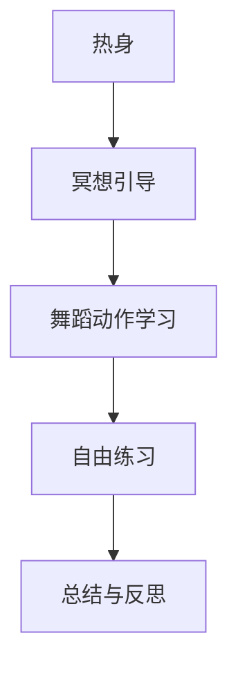

### 8.2 工作坊的准备工作

为了确保冥想舞蹈工作坊的成功，准备工作至关重要。以下是工作坊准备工作的详细步骤：

1. **场地选择**：选择一个安静、舒适的场地，避免外部干扰。
2. **音响设备**：准备高质量的音响设备，确保音乐和冥想引导的声音清晰。
3. **照明**：选择柔和的照明，以营造放松的氛围。
4. **音乐选择**：根据工作坊的主题选择适合的音乐，如舒缓的乐器曲或自然声音。
5. **冥想材料**：准备冥想垫、眼罩或其他冥想辅助工具。
6. **舞蹈材料**：准备舞蹈所需的道具，如舞蹈服装、手环等。
7. **培训导师**：确保导师具备冥想和舞蹈的专业知识，能够引导参与者顺利进行工作坊。

以下是工作坊准备工作的Mermaid流程图表示：

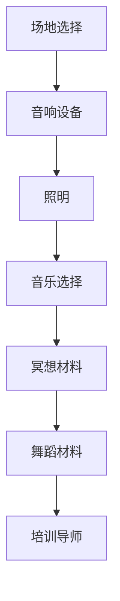

### 8.3 工作坊的实战案例

以下是一个冥想舞蹈工作坊的实战案例，供读者参考：

**工作坊主题**：身心合一的冥想舞蹈

**工作坊时长**：2小时

**第一阶段：热身（30分钟）**

1. 导师引导参与者进行简单的身体拉伸运动，如手臂、腿部和腰部。
2. 参与者跟随导师进行深呼吸练习，放松身心。
3. 导师介绍工作坊的目标和流程，提醒参与者保持专注。

**第二阶段：冥想引导（30分钟）**

1. 导师播放舒缓的音乐，引导参与者进行冥想，专注于呼吸和身体感受。
2. 参与者闭上眼睛，跟随导师的指导，感受身体的变化和内心的平静。
3. 导师通过提问和分享，帮助参与者更好地理解冥想。

**第三阶段：舞蹈动作学习（30分钟）**

1. 导师教授基础舞蹈动作，如踏步、跳步和旋转。
2. 参与者跟随导师的动作，尝试在冥想状态下进行舞蹈。
3. 导师示范舞蹈动作，并给予参与者指导和建议。

**第四阶段：自由练习（45分钟）**

1. 导师播放冥想音乐，参与者自由练习舞蹈动作，尝试将冥想与舞蹈结合。
2. 参与者可以在导师的指导下，尝试不同的舞蹈动作和组合。
3. 导师鼓励参与者分享他们的感受和体验，促进互动和交流。

**第五阶段：总结与反思（15分钟）**

1. 导师邀请参与者分享他们在工作坊中的感受和收获。
2. 导师总结工作坊的主要内容，强调身心合一的重要性。
3. 导师提供后续练习的建议，鼓励参与者将冥想舞蹈融入日常生活中。

以下是冥想舞蹈工作坊实战案例的Mermaid流程图表示：


通过以上实战案例，我们可以看到，冥想舞蹈工作坊的设计与实践是一个系统而有序的过程。通过合理的准备和指导，参与者可以在轻松愉悦的氛围中，体验到身心合一的美好感受。希望这个案例能够为读者提供实用的参考，激发他们对冥想舞蹈的探索和兴趣。

## 附录

### 附录A：冥想舞蹈工作坊资源列表

#### A.1 相关书籍推荐

1. 《冥想的艺术》（The Art of Mindfulness） - 乔·卡巴金（Jon Kabat-Zinn）
2. 《冥想：现代生活的指南》（Meditation for Modern Life） - 斯科特·达蒙（Scott Damron）
3. 《舞蹈解剖学》（Dance Anatomy） - 利萨·瑞丁（Lisa Rinehart）

#### A.2 网络资源链接

1. [冥想中心官方网站](https://www.mindfulness.org/)
2. [舞蹈技巧教程](https://www.dancetutorial.org/)
3. [冥想与舞蹈的结合实践](https://www.mindfulnessdancing.com/)

#### A.3 冥想舞蹈音乐推荐

1. 《宁静之海》（Peaceful Ocean） - 理查德·加利亚诺（Richard Galianno）
2. 《深呼吸冥想音乐》（Deep Breathing Meditation Music） - 安静的天空（Quiet Sky）
3. 《舞蹈节奏冥想》（Dancing Rhythms Meditation） - 保罗·麦克莱恩（Paul Mclane）

通过这些资源，读者可以进一步深入了解冥想舞蹈的理论与实践，为自己的冥想舞蹈之旅提供丰富的指导和灵感。希望这些资源能够帮助大家更好地体验身体运动中的心灵觉察，享受冥想舞蹈带来的身心健康益处。

