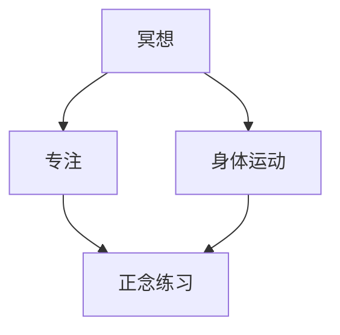

                 

# 现代冥想舞蹈工作室：身体运动中的正念练习空间

## 关键词
- 冥想舞蹈
- 正念练习
- 身体运动
- 空间设计
- 心理健康

## 摘要
本文旨在探讨现代冥想舞蹈工作室的概念和设计原则。通过结合冥想、舞蹈和身体运动，冥想舞蹈工作室提供了一个独特的正念练习空间，帮助人们在快节奏的生活中找到平衡和内在平静。本文首先介绍了冥想舞蹈的历史和发展，然后深入探讨了冥想舞蹈的核心概念和正念练习的关系，接着分析了身体运动与正念之间的联系。最后，本文提出了设计冥想舞蹈工作室的几个关键原则，包括空间布局、设备选择和课程设计等。

## 引言
在现代社会的快节奏生活中，人们常常感到压力和焦虑。寻找一种有效的方法来放松身心，提高心理健康已成为许多人的关注点。冥想和身体运动被认为是两种有效的放松方法，它们分别从心理和生理两个层面帮助人们缓解压力。而冥想舞蹈则巧妙地将两者结合起来，提供了一种全新的正念练习方式。冥想舞蹈工作室作为一种专门的空间设计，旨在为人们提供一个能够全身心投入的正念练习场所。本文将探讨冥想舞蹈工作室的设计原则和实施方法，帮助读者更好地理解和创建这样的空间。

## 冥想舞蹈的历史与发展
冥想舞蹈起源于古代，不同文化中都有其独特的表现形式。在印度，冥想舞蹈被称为“纳达舞蹈”（Nada Dance），它结合了音乐、舞蹈和冥想，旨在达到精神上的觉醒。在古代希腊和罗马，舞蹈也常常伴随着冥想仪式，用于祈求神灵的保佑。随着时间的推移，冥想舞蹈在不同的文化中不断演变，形成了多种风格和流派。

在20世纪，冥想舞蹈作为一种精神实践在西方国家得到了广泛的关注和发展。尤其是近年来，随着正念练习的普及，冥想舞蹈逐渐成为一种流行的身体运动方式。冥想舞蹈将冥想的专注和平静与舞蹈的美感和节奏相结合，使人们在运动中体验到内心的平静和自我觉察。

## 核心概念与联系
### 冥想与舞蹈的关系
冥想舞蹈的核心在于将冥想与舞蹈相结合。冥想是一种心理训练，旨在培养专注力、自我觉察和内在平静。舞蹈则是一种身体表达形式，通过动作和节奏来释放内心的情感和能量。冥想舞蹈将这两种元素融合在一起，通过身体运动来引导冥想，使人们在动作中体验到冥想的状态。

### 正念练习的理念
正念练习是一种专注于当下的心理练习，它强调对当前体验的完全接纳和专注。正念练习可以帮助人们减少焦虑、提高情绪调节能力，并促进身心健康。在冥想舞蹈中，正念练习被用来增强专注力和自我觉察，使人们在舞蹈过程中能够更好地与身体和内心进行连接。

### 身体运动与正念的联系
身体运动被认为是一种有效的正念练习方式，因为它可以强迫人们将注意力集中在当下的身体感觉上。在冥想舞蹈中，身体运动与正念练习的结合使得人们能够在运动中体验到冥想的平静和专注。这种练习方式不仅能够提高身体的灵活性，还能够增强心理的韧性。

### Mermaid 流程图
下面是一个描述冥想舞蹈中核心概念之间关系的 Mermaid 流程图：



在这个流程图中，冥想和身体运动都是正念练习的组成部分，它们共同促进了内心的平静和专注。

## 核心算法原理讲解
### 伪代码
冥想舞蹈的算法原理可以简化为以下几个步骤：

```
初始化冥想舞蹈课程
1. 设定冥想主题
2. 准备舞蹈音乐
3. 指导学员进行身体拉伸和呼吸练习

开始冥想舞蹈课程
1. 集中注意力，引导学员进行深呼吸
2. 按照音乐节奏，进行舞蹈动作
3. 在舞蹈过程中，提醒学员保持正念，专注于当下的身体感觉

结束冥想舞蹈课程
1. 指导学员进行身体放松
2. 总结课程体验，鼓励学员在日常中继续练习
```

### 数学模型和公式
冥想舞蹈中的数学模型可以用来描述身体运动和正念练习之间的关系。以下是一个简化的数学模型：

$$
\text{冥想效果} = f(\text{身体运动}, \text{正念专注})
$$

其中，$f$ 是一个复合函数，它将身体运动和正念专注结合起来，产生冥想效果。

### 详细讲解与举例说明
假设一个学员在进行冥想舞蹈练习时，身体运动和正念专注分别达到了70%和80%的效率。根据上述数学模型，我们可以计算出冥想效果：

$$
\text{冥想效果} = f(0.7, 0.8) = 0.7 \times 0.8 = 0.56
$$

这意味着该学员在冥想舞蹈练习中的冥想效果为56%。通过调整身体运动和正念专注的效率，学员可以进一步提高冥想效果。

## 身体运动与正念的联系
身体运动被认为是一种有效的正念练习方式，因为它可以强迫人们将注意力集中在当下的身体感觉上。在冥想舞蹈中，身体运动与正念练习的结合使得人们能够在运动中体验到冥想的平静和专注。这种练习方式不仅能够提高身体的灵活性，还能够增强心理的韧性。

### 身体运动对正念练习的影响
- **提高专注力**：身体运动可以训练大脑专注于当前的身体感觉，从而提高专注力。
- **增强自我觉察**：通过身体运动，人们可以更好地了解自己的身体，提高自我觉察能力。
- **减少焦虑**：身体运动可以释放体内的紧张和压力，从而减少焦虑和紧张感。
- **促进情绪调节**：身体运动可以帮助人们更好地调节情绪，提高情绪稳定性。

### 正念练习对身体运动的影响
- **增强运动体验**：通过正念练习，人们可以更加专注和投入于身体运动，从而增强运动体验。
- **提高运动效果**：正念练习可以帮助人们更好地控制身体运动，提高运动效果。
- **预防运动伤害**：正念练习可以减少因分心而导致的运动伤害，提高运动安全性。

## 设计冥想舞蹈工作室的关键原则
### 空间布局
设计冥想舞蹈工作室时，空间布局至关重要。以下是几个关键原则：

- **宽敞明亮**：选择一个宽敞明亮的房间，以确保学员有足够的空间进行舞蹈动作。
- **舒适安静**：确保工作室有一个舒适的氛围，减少噪音和干扰。
- **自然光线**：利用自然光线，创造一个放松和愉悦的环境。
- **充足通风**：确保工作室有良好的通风，提供新鲜空气。

### 设备选择
选择合适的设备是确保冥想舞蹈工作室功能齐全的关键。以下是几个推荐设备：

- **舞蹈地板**：选择专业的舞蹈地板，以提高舒适度和安全性。
- **音响系统**：安装高质量的音响系统，确保音乐播放清晰，氛围营造得当。
- **镜子**：设置镜子，帮助学员观察和调整自己的动作。
- **照明设备**：选择柔和的照明设备，创造一个放松的环境。

### 课程设计
课程设计是冥想舞蹈工作室的核心。以下是设计课程时需要考虑的几个方面：

- **课程目标**：明确每节课的目标，例如提高专注力、增强身体灵活性等。
- **课程结构**：合理安排课程结构，包括热身、舞蹈练习、冥想放松等环节。
- **教学内容**：根据学员的水平和需求，设计合适的舞蹈动作和冥想练习。
- **课程反馈**：收集学员的反馈，不断调整和优化课程内容。

### 项目实战
以下是一个冥想舞蹈工作室的实战案例：

#### 开发环境搭建
- **硬件设备**：购买舞蹈地板、音响系统、镜子、照明设备等。
- **软件系统**：选择合适的舞蹈教学软件，如Open Dance Studio。

#### 源代码详细实现
```python
# 舞蹈动作生成器
class DanceActionGenerator:
    def generate_action(self, difficulty_level):
        # 根据难度级别生成舞蹈动作
        pass

# 冥想练习控制器
class MeditationController:
    def start_meditation(self, meditation_type):
        # 启动冥想练习
        pass

# 课程管理系统
class CourseManagementSystem:
    def create_course(self, course_name, course_content):
        # 创建课程
        pass

    def enroll_student(self, student_name, course_id):
        # 学生报名课程
        pass
```

#### 代码解读与分析
这段代码展示了冥想舞蹈工作室的核心功能，包括舞蹈动作生成器、冥想练习控制器和课程管理系统。通过这些模块，工作室可以提供个性化的舞蹈和冥想课程。

#### 实际案例分析和详细讲解剖析
- **案例**：一名新学员参加冥想舞蹈课程，课程内容包括热身、舞蹈练习和冥想放松。
- **分析**：在热身环节，学员通过简单的拉伸运动和深呼吸来准备身体。在舞蹈练习环节，学员跟随教练进行一系列舞蹈动作，同时保持正念。在冥想放松环节，学员通过冥想练习来放松身心，达到内心的平静。

#### 项目小结
通过实战案例，我们可以看到冥想舞蹈工作室如何通过合理的课程设计和设备选择，为学员提供一个全面的正念练习空间。这个项目不仅提升了学员的身心健康，也为冥想舞蹈行业的发展提供了新的思路。

## 最佳实践 Tips
- **保持一致性**：定期练习是提升冥想舞蹈效果的关键。建议每周至少参加一次课程。
- **个性化调整**：根据个人需求和身体状况，调整舞蹈动作和冥想练习的难度。
- **深度体验**：尝试不同风格的冥想舞蹈，以丰富自己的练习体验。
- **社交互动**：加入冥想舞蹈社区，与他人分享练习心得，相互鼓励。

## 小结与注意事项
本文介绍了现代冥想舞蹈工作室的设计原则和实施方法。通过结合冥想、舞蹈和身体运动，冥想舞蹈工作室提供了一个独特的正念练习空间，帮助人们在快节奏的生活中找到平衡和内在平静。在设计和运营冥想舞蹈工作室时，应注意空间布局、设备选择和课程设计，以及学员的个人需求和体验。

## 拓展阅读
- **《冥想与正念练习》**：深入探讨冥想和正念练习的理论和实践。
- **《舞蹈心理学》**：了解舞蹈如何影响心理状态和情绪调节。
- **《冥想舞蹈教程》**：提供具体的冥想舞蹈练习指导。

## 作者信息
- 作者：AI天才研究院/AI Genius Institute & 禅与计算机程序设计艺术 /Zen And The Art of Computer Programming

### 附录A：冥想舞蹈资源指南
- **相关书籍**：
  - 《冥想舞蹈：身体、心灵与精神的融合》
  - 《正念练习手册：如何在生活中实现冥想》
  - 《舞蹈心理学：舞蹈如何影响心理和情感》
- **网站与社交媒体**：
  - [冥想舞蹈协会](http://www.meditatedanceassociation.org/)
  - [正念练习社区](http://www.mindfulnesspracticecommunity.com/)
  - [舞蹈爱好者论坛](http://www.danceenthusiastforum.com/)
- **正念练习工具与设备**：
  - [呼吸练习器](http://www.breathingexercise.com/)
  - [冥想音乐专辑](http://www.meditationmusicalbum.com/)
  - [瑜伽垫与球](http://www.yogapadandball.com/)

