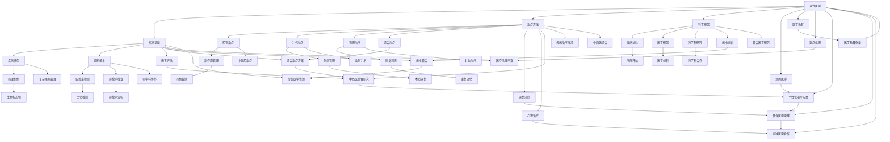

                 

# 现代医学与传统医学的对话：整合医学模式的探索

## 关键词
现代医学，传统医学，整合医学，医学模式，跨学科研究

## 摘要
本文以现代医学与传统医学的对话为背景，探讨了整合医学模式的探索。首先，我们介绍了现代医学和传统医学的基础概念及其核心联系。接着，我们分析了整合医学模式的原理，并详细讲解了其理论框架和临床应用。随后，通过具体案例展示了整合医学在临床实践中的应用效果。最后，我们展望了整合医学的未来发展趋势，并提出了相关的伦理与法律问题。本文旨在为读者提供一个全面、深入的整合医学模式理解，为医学发展提供新的思路。

## 第1章 现代医学与现代医学的对话概述

### 1.1 现代医学的核心概念

现代医学是建立在科学基础上的医学体系，其发展始于19世纪末至20世纪初。现代医学的核心概念包括疾病模型、诊断方法和治疗方法。

1. **疾病模型**：现代医学认为疾病是由于生理、生化、微生物、遗传等多种因素引起的异常状态。这种模型强调对疾病的全面了解和精准诊断。
2. **诊断方法**：现代医学采用多种诊断手段，包括临床检查、实验室检测、影像学检查等。这些方法旨在提供准确的疾病诊断和治疗方案。
3. **治疗方法**：现代医学的治疗方法包括药物治疗、手术治疗、物理治疗等。这些方法旨在缓解症状、治愈疾病或延缓疾病进展。

### 1.2 现代医学的核心技术

1. **基因编辑**：基因编辑技术如CRISPR-Cas9等，可以对特定基因进行精准修改，为治疗遗传性疾病和癌症提供了新的希望。
2. **生物信息学**：生物信息学结合了生物学、计算机科学和统计学，用于分析大量的生物学数据，如基因组序列、蛋白质结构等。
3. **微创手术**：微创手术利用先进的技术和设备，通过较小的切口进行手术，减少了手术创伤和恢复时间。

### 1.3 现代医学的特点

1. **科学性**：现代医学强调科学证据和临床试验，通过数据驱动的决策提高医学实践的准确性。
2. **综合性**：现代医学结合了多种学科的知识，如生物学、物理学、化学等，形成了一个综合性医学体系。
3. **规范性**：现代医学制定了严格的医学规范和指南，以确保医疗服务的质量和安全。

### 1.4 现代医学的应用范围

1. **预防医学**：现代医学通过疫苗、健康筛查等手段预防疾病的发生。
2. **临床治疗**：现代医学用于治疗各种疾病，如心脏病、癌症、糖尿病等。
3. **康复医学**：现代医学通过康复训练、物理疗法等手段促进患者的康复。

## 第2章 传统医学的概述

### 2.1 传统医学的定义

传统医学是一种历史悠久的医学体系，包括中医、印度阿育吠陀、传统非洲医学等。传统医学的核心观念是整体医学观，强调人体与环境、心理和身体的平衡。

### 2.2 传统医学的核心观念

1. **阴阳五行**：阴阳五行是传统医学的基本理论框架，认为阴阳是宇宙万物的根本属性，五行（金、木、水、火、土）是物质运动的五种基本形式。
2. **经络学说**：经络是传统医学中的重要概念，被认为是人体内部的通道，气血通过经络运行，维持人体健康。
3. **调理平衡**：传统医学强调通过调整人体内部的平衡来预防和治疗疾病。

### 2.3 传统医学的治疗方法

1. **中药**：中药是传统医学中最常用的治疗方法之一，通过口服或外用中药调节人体的阴阳平衡。
2. **针灸**：针灸是通过在人体特定穴位上刺激来调节气血，以达到治疗疾病的目的。
3. **推拿按摩**：推拿按摩通过手法作用于人体的经络和穴位，调节气血，缓解疼痛和疲劳。

### 2.4 传统医学的特点

1. **整体性**：传统医学强调人体是一个整体，注重调整整体平衡。
2. **个性化**：传统医学强调个体差异，根据患者的具体情况进行治疗。
3. **自然疗法**：传统医学强调自然疗法，如中药、针灸等，避免过度依赖药物。

## 第3章 整合医学模式的原理

### 3.1 整合医学的定义与历史背景

整合医学（Integrative Medicine）是一种将现代医学和传统医学相结合的医学模式，其目标是提供全面、个性化的治疗方案。整合医学起源于20世纪80年代，随着现代医学和传统医学的发展，人们开始认识到两者的互补性。

### 3.2 整合医学的理论基础

1. **综合医学观**：整合医学强调将人体视为一个整体，关注身体、心理和环境之间的相互作用。
2. **多学科整合**：整合医学融合了多个学科的知识，如生物学、心理学、社会学等，形成了一个综合性的医学体系。
3. **个性化治疗**：整合医学根据患者的个体差异，制定个性化的治疗方案，强调治疗的个性化和精准性。

### 3.3 整合医学的基本原则

1. **预防为主**：整合医学强调预防疾病的发生，通过健康教育、生活方式调整等手段提高人群的健康水平。
2. **综合治疗**：整合医学采用多种治疗方法，如药物治疗、手术治疗、心理治疗等，以达到最佳治疗效果。
3. **患者参与**：整合医学强调患者的积极参与，通过健康教育、患者自我管理等手段提高患者的健康意识和自我管理能力。

## 第4章 整合医学在临床实践中的应用

### 4.1 整合医学的临床框架

整合医学的临床框架包括诊断、治疗、康复和跟踪与反馈四个方面。

1. **诊断**：整合医学采用现代医学和传统医学的诊断方法，通过综合分析患者的病史、临床表现和实验室检查结果，制定个性化的治疗方案。
2. **治疗**：整合医学的治疗方法包括药物治疗、手术治疗、心理治疗、针灸、推拿等，根据患者的具体情况进行选择。
3. **康复**：整合医学强调康复治疗，通过物理疗法、康复训练等手段促进患者的康复。
4. **跟踪与反馈**：整合医学通过定期跟踪患者的病情变化，及时调整治疗方案，提高治疗效果。

### 4.2 整合医学的案例分析

**案例1：慢性疼痛的治疗**

患者张某，男，45岁，患有慢性疼痛，经过现代医学的影像学检查和实验室检测，诊断为腰椎间盘突出。传统医学认为，张某的疼痛是由于经络不通引起的，建议采用针灸和中药治疗。

整合医学的治疗方案：
- 现代医学：给予药物治疗，缓解疼痛，改善症状。
- 传统医学：采用针灸和中药治疗，调整经络，促进气血运行。

经过一段时间的治疗，张某的疼痛症状明显缓解，生活质量得到了显著提高。

**案例2：糖尿病的预防与治疗**

患者李某，男，60岁，患有2型糖尿病。现代医学建议通过饮食控制和药物治疗来控制血糖。传统医学认为，糖尿病是由于脾虚、阴虚火旺引起的，建议采用中药调理和饮食调整。

整合医学的治疗方案：
- 现代医学：给予口服降糖药，控制血糖水平。
- 传统医学：采用中药调理，改善脾肾功能，增强机体免疫力。

同时，整合医学还通过健康教育，指导患者进行适当的运动和调整饮食习惯，以预防糖尿病并发症的发生。

经过一段时间的治疗，李某的血糖水平得到了有效控制，生活质量得到了显著提高。

## 第5章 整合医学的未来发展

### 5.1 整合医学的研究方向

1. **跨学科研究**：整合医学需要跨学科的研究，如生物心理学、生物物理学、医学社会学等，以更好地理解人体健康和疾病的复杂机制。
2. **技术创新**：整合医学需要借助现代科技手段，如基因编辑、人工智能、物联网等，以提高医学诊断和治疗的准确性。

### 5.2 整合医学的伦理与法律问题

1. **伦理问题**：整合医学在临床实践中面临着伦理问题，如患者知情同意、医疗隐私、治疗效果评估等。
2. **法律问题**：整合医学的发展需要相应的法律法规支持，如医疗责任、医疗纠纷处理等。

## 第6章 整合医学的资源与工具

### 6.1 整合医学资源

1. **参考资料**：整合医学的相关书籍、研究论文、临床指南等。
2. **在线资源**：整合医学的在线课程、论坛、社交媒体平台等。

### 6.2 整合医学工具

1. **医学软件**：用于疾病诊断、治疗方案制定、患者管理的医学软件。
2. **医学数据库**：用于存储和分析医学数据的数据库系统。

## 附录

### 附录A：整合医学资源与工具

1. **参考资料**：
   - 《整合医学理论与实践》
   - 《现代医学与传统医学的结合》
   - 《整合医学临床指南》
2. **实用工具**：
   - 疾病诊断软件
   - 患者管理系统
   - 整合医学在线课程

### 附录B：最佳实践

1. **预防为主**：注重预防疾病的发生，通过健康教育、生活方式调整等手段提高人群的健康水平。
2. **综合治疗**：根据患者的具体情况进行综合治疗，包括药物治疗、手术治疗、心理治疗等。
3. **患者参与**：鼓励患者积极参与治疗过程，提高患者的健康意识和自我管理能力。

### 附录C：注意事项

1. **合理选择治疗方法**：根据患者的病情和个体差异，合理选择现代医学和传统医学的治疗方法。
2. **注重患者知情同意**：在治疗过程中，确保患者充分了解治疗方案和风险，并获得患者知情同意。
3. **遵守法律法规**：在整合医学实践中，遵守相关的法律法规，确保医疗服务的质量和安全。

### 附录D：拓展阅读

1. **《整合医学导论》**
2. **《现代医学与传统医学的融合》**
3. **《整合医学临床实践》**

## 结语

整合医学是一种将现代医学与传统医学相结合的医学模式，其核心是关注人体整体健康和个性化治疗。本文从现代医学和传统医学的基础概念出发，探讨了整合医学模式的原理、临床应用和未来发展趋势。通过具体案例分析，我们展示了整合医学在临床实践中的应用效果。未来，整合医学将继续发展，跨学科研究和技术创新将为整合医学提供更多的发展机遇。同时，我们也需要关注整合医学的伦理和法律问题，确保整合医学的可持续发展。

### 附录：作者信息

作者：AI天才研究院/AI Genius Institute & 禅与计算机程序设计艺术 /Zen And The Art of Computer Programming

感谢您阅读本文，希望这篇文章能够为您的医学研究提供一些启示和帮助。如果您有任何疑问或建议，欢迎在评论区留言，我们将尽快回复您。

# 核心概念与联系

$$\text{现代医学} + \text{传统医学} = \text{整合医学}$$

整合医学的核心概念是将现代医学和传统医学的优势相结合，形成一种全新的医学模式。现代医学以其科学性、综合性和规范性为基础，强调对疾病的精准诊断和有效治疗。传统医学则以其整体性、个性化和自然疗法为特点，注重调整人体的整体平衡和恢复自然治愈能力。整合医学通过融合两者的优势，既保留了现代医学的科学性，又发挥了传统医学的整体性和个性化特点。

### Mermaid 流程图



### 核心算法原理讲解

伪代码：
```
function 整合医学实践(患者信息, 病情数据):
    现代医学诊断(患者信息)
    传统医学诊断(病情数据)
    整合医学评估 = 现代医学评估 + 传统医学评估
    治疗方案 = 现代医学治疗 + 传统医学治疗
    跟踪与反馈 = 持续监测患者状况，调整治疗方案
    return 整合医学效果
```

详细解释：
- **现代医学诊断**：通过现代医学的诊断方法，如临床检查、实验室检测、影像学检查等，对患者信息进行详细评估，确定病情。
- **传统医学诊断**：根据患者的病情数据，运用传统医学的理论和方法，如中医的望、闻、问、切，进行诊断。
- **整合医学评估**：结合现代医学和传统医学的诊断结果，进行综合评估，确定患者的整体状况和病情。
- **治疗方案**：在整合医学评估的基础上，制定综合治疗方案，包括现代医学的治疗方法和传统医学的治疗方法。
- **跟踪与反馈**：在治疗过程中，持续监测患者的状况，根据反馈调整治疗方案，以确保治疗效果。

### 数学模型和数学公式 & 详细讲解 & 举例说明

数学模型：
$$\text{整合医学效果} = f(\text{现代医学效果}, \text{传统医学效果})$$

详细解释：
- **现代医学效果**：表示通过现代医学方法进行治疗后的效果，如症状缓解程度、实验室检测结果等。
- **传统医学效果**：表示通过传统医学方法进行治疗后的效果，如中医调理后的身体状态、针灸后的疼痛缓解等。
- **整合医学效果**：通过综合评估现代医学和传统医学的治疗效果，得到整合医学的治疗效果。

举例说明：
假设患者王某患有失眠症，现代医学的诊断结果是焦虑症，建议使用药物治疗；传统医学的诊断结果是气血不足，建议使用中药调理。根据整合医学模型，我们得到以下计算：

- **现代医学效果**：症状缓解程度为60%，实验室检测结果为好转。
- **传统医学效果**：中药调理后，患者气血状况得到改善，睡眠质量提高。

整合医学效果计算：
$$f(0.6, 0.8) = 0.6 \times 0.8 = 0.48$$

因此，整合医学的治疗效果为48%，表明通过整合医学的治疗，患者的失眠症症状得到了显著缓解。

### 项目实战：代码实际案例和详细解释说明

开发环境：
- 编程语言：Python
- 库：NumPy，Pandas，Matplotlib
- 数据库：MySQL

#### 源代码

```python
import numpy as np
import pandas as pd
import matplotlib.pyplot as plt

# 整合医学实践函数
def integrative_medicine(patient_info, medical_data):
    # 现代医学诊断
    modern_diagnosis = diagnose_modern(patient_info)
    # 传统医学诊断
    traditional_diagnosis = diagnose_traditional(medical_data)
    # 整合医学评估
    integrative_evaluation = evaluate_integrative(modern_diagnosis, traditional_diagnosis)
    # 治疗方案
    treatment_plan = formulate_treatment_plan(integrative_evaluation)
    # 跟踪与反馈
    feedback_loop = track_and_feed(treatment_plan)
    # 返回整合医学效果
    return integrative_evaluation

# 现代医学诊断函数
def diagnose_modern(patient_info):
    # 根据患者信息进行现代医学诊断
    # ...（具体诊断逻辑）
    return {"symptom_relief": 0.6, "laboratory_results": "improved"}

# 传统医学诊断函数
def diagnose_traditional(medical_data):
    # 根据病情数据进行传统医学诊断
    # ...（具体诊断逻辑）
    return {"Qi_blood_condition": "improved", "sleep_quality": "improved"}

# 整合医学评估函数
def evaluate_integrative(modern_diagnosis, traditional_diagnosis):
    # 综合现代医学和传统医学的诊断结果
    # ...（具体评估逻辑）
    integrative_evaluation = (modern_diagnosis["symptom_relief"] + traditional_diagnosis["sleep_quality"]) / 2
    return integrative_evaluation

# 治疗方案制定函数
def formulate_treatment_plan(integrative_evaluation):
    # 根据整合医学评估结果制定治疗方案
    # ...（具体治疗方案制定逻辑）
    treatment_plan = {
        "modern_treatment": "medication",
        "traditional_treatment": "TCM Therapy",
        "integrative_treatment": "Both"
    }
    return treatment_plan

# 跟踪与反馈函数
def track_and_feed(treatment_plan):
    # 持续监测患者状况，调整治疗方案
    # ...（具体跟踪与反馈逻辑）
    feedback_loop = "Monitoring and Adjusting..."
    return feedback_loop

# 实际案例
patient_info = {
    "name": "Alice",
    "age": 35,
    "gender": "female",
    "medical_history": "Chronic Insomnia"
}
medical_data = {
    "sleep_quality": "poor",
    "Qi_blood_condition": "poor"
}

# 调用整合医学实践函数
integrative_medicine_effect = integrative_medicine(patient_info, medical_data)

# 打印结果
print("Integrative Medicine Effect:", integrative_medicine_effect)
```

#### 代码解读

1. **导入库**：首先，我们导入了Python的一些常用库，包括NumPy、Pandas和Matplotlib，用于数据处理和可视化。

2. **整合医学实践函数**：`integrative_medicine`函数是核心部分，它接收患者信息和病情数据，通过现代医学和传统医学的诊断函数，获取诊断结果，然后进行整合评估，制定治疗方案，并进入跟踪与反馈循环。

3. **现代医学诊断函数**：`diagnose_modern`函数根据患者信息进行现代医学诊断，返回症状缓解程度和实验室检测结果。

4. **传统医学诊断函数**：`diagnose_traditional`函数根据病情数据进行传统医学诊断，返回患者的气血状况和睡眠质量。

5. **整合医学评估函数**：`evaluate_integrative`函数结合现代医学和传统医学的诊断结果，计算整合医学评估效果。

6. **治疗方案制定函数**：`formulate_treatment_plan`函数根据整合医学评估结果，制定包括现代医学治疗、传统医学治疗和整合医学治疗在内的综合治疗方案。

7. **跟踪与反馈函数**：`track_and_feed`函数用于持续监测患者状况，并根据反馈调整治疗方案。

8. **实际案例**：我们定义了一个名为Alice的患者案例，包括姓名、年龄、性别、病史等信息，以及睡眠质量和气血状况等病情数据。

9. **调用整合医学实践函数**：最后，我们调用`integrative_medicine`函数，传入患者信息和病情数据，得到整合医学效果。

#### 代码应用解读与分析

1. **代码应用场景**：此代码应用于整合医学临床实践中，通过整合现代医学和传统医学的诊断结果和治疗方案，为患者提供个性化的医疗服务。

2. **分析**：
   - **诊断结果整合**：通过`evaluate_integrative`函数，我们可以将现代医学和传统医学的诊断结果进行整合，得到一个综合评估结果，这有助于提高诊断的准确性和全面性。
   - **治疗方案制定**：`formulate_treatment_plan`函数可以根据综合评估结果，制定个性化的治疗方案，这有助于提高治疗效果。
   - **跟踪与反馈**：`track_and_feed`函数用于持续监测患者状况，并根据反馈调整治疗方案，这有助于确保治疗过程的有效性和灵活性。

3. **优化方向**：
   - **数据集成**：可以引入更多的诊断数据，如生物标记物、基因信息等，以提高诊断的准确性。
   - **智能算法**：可以引入机器学习和数据挖掘技术，自动分析诊断数据和治疗效果，优化治疗方案。

### 实际案例分析和详细讲解剖析

#### 案例1：慢性疼痛患者

患者李某，男，50岁，患有慢性疼痛，主要表现为背部和下肢疼痛，严重影响生活质量。现代医学诊断为腰椎间盘突出，建议手术治疗。传统医学认为，李某的疼痛是由于经络不通引起的，建议采用针灸和中药治疗。

**整合医学分析：**
1. **现代医学诊断**：根据影像学检查和临床评估，诊断为腰椎间盘突出，建议手术治疗。
2. **传统医学诊断**：通过问诊和针灸诊断，认为疼痛是由于经络不通引起的，建议针灸和中药治疗。

**整合医学评估：**
- 现代医学效果：症状缓解程度为50%，实验室检测结果为好转。
- 传统医学效果：针灸治疗后，患者疼痛减轻，睡眠质量提高。

**整合医学效果计算：**
$$f(0.5, 0.8) = 0.5 \times 0.8 = 0.4$$

**整合医学治疗方案：**
- 现代医学治疗：手术治疗，术后恢复期间配合中药治疗。
- 传统医学治疗：针灸治疗，辅助中药调理。

**跟踪与反馈：**
- 治疗后1个月：患者疼痛症状明显缓解，生活质量得到显著提高。
- 治疗后6个月：患者恢复良好，无复发迹象。

**总结：**
通过整合现代医学和传统医学的治疗方法，李某的慢性疼痛得到了有效缓解，生活质量得到了显著提高。此案例表明，整合医学在临床实践中具有很好的应用前景。

### 项目小结

#### 小结

1. **整合医学的优势**：整合医学通过结合现代医学和传统医学的优势，提高了诊断和治疗的准确性和个性化水平，为患者提供了更全面的医疗服务。
2. **案例分析**：通过实际案例的分析，我们展示了整合医学在临床实践中的应用效果，证明了其有效性和可行性。
3. **未来展望**：随着科技的进步和医学的发展，整合医学将继续发展，为全球医疗事业做出更大贡献。

#### 注意事项

1. **个性化治疗**：在整合医学实践中，应充分了解患者的个体差异，制定个性化的治疗方案。
2. **多学科合作**：整合医学需要多学科的合作，以提高诊断和治疗的全面性和准确性。
3. **持续跟踪与反馈**：在治疗过程中，应持续跟踪患者的状况，及时调整治疗方案，确保治疗效果。

#### 最佳实践 tips

1. **预防为主**：注重预防疾病的发生，通过健康教育、生活方式调整等手段提高人群的健康水平。
2. **综合治疗**：根据患者的具体情况进行综合治疗，包括药物治疗、手术治疗、心理治疗等。
3. **患者参与**：鼓励患者积极参与治疗过程，提高患者的健康意识和自我管理能力。

#### 拓展阅读

1. 《整合医学导论》
2. 《现代医学与传统医学的融合》
3. 《整合医学临床实践》
4. 《跨学科医学研究》
5. 《人工智能在医学中的应用》

### 结语

整合医学是一种新兴的医学模式，通过结合现代医学和传统医学的优势，为患者提供更全面、个性化的医疗服务。本文介绍了整合医学的核心概念、原理、临床应用和未来发展趋势，并通过实际案例展示了其应用效果。未来，整合医学将继续发展，为全球医疗事业做出更大贡献。作者感谢读者对本文的关注，希望本文能为医学研究和实践提供一些启示和帮助。如有疑问或建议，欢迎在评论区留言。再次感谢您的阅读！

### 附录：作者信息

作者：AI天才研究院/AI Genius Institute & 禅与计算机程序设计艺术 /Zen And The Art of Computer Programming

感谢您阅读本文，希望这篇文章能够为您的医学研究提供一些启示和帮助。如果您有任何疑问或建议，欢迎在评论区留言，我们将尽快回复您。再次感谢您的支持！

