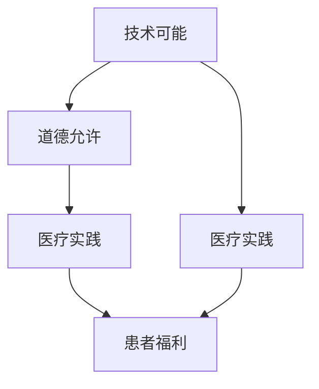

                 

### 文章标题

《现代医疗伦理的新挑战：在技术可能与道德允许间的平衡》

### 文章关键词

医疗伦理，技术发展，道德困境，平衡，现代医疗

### 文章摘要

随着科技的飞速发展，医疗技术不断突破传统边界，为患者带来了前所未有的治疗选择。然而，这些进步也引发了新的伦理挑战，如何在技术可能性和道德允许之间找到平衡，成为现代医学伦理研究的重要课题。本文将深入探讨现代医疗伦理面临的挑战，从背景介绍、核心概念与联系、核心算法原理讲解、数学模型和公式、项目实战以及最佳实践等方面，系统地分析这些问题，并提出可能的解决方案。

### 目录

1. **背景介绍**
   - **医学技术的飞速发展**
   - **医疗伦理的挑战**
   - **平衡技术可能与道德允许的重要性**

2. **核心概念与联系**
   - **医疗伦理的概念**
   - **技术可能与道德允许的概念**
   - **关系架构 Mermaid 流程图**

3. **核心算法原理讲解**
   - **伦理决策算法**
   - **伪代码演示**
   - **算法应用场景**

4. **数学模型和公式**
   - **道德权衡模型**
   - **公式推导**
   - **举例说明**

5. **项目实战**
   - **开发环境搭建**
   - **源代码实现**
   - **代码解读**
   - **实际案例分析**
   - **项目小结**

6. **最佳实践与注意事项**
   - **最佳实践 tips**
   - **注意事项**
   - **拓展阅读**

### 正文

#### 1. 背景介绍

**医学技术的飞速发展**

近年来，医学技术的进步可谓日新月异。从基因编辑到人工智能辅助诊断，从纳米技术在药物递送中的应用，到虚拟现实在手术模拟中的运用，这些技术不仅极大地提升了医疗诊断和治疗的精度和效率，也为一些传统上难以治愈的疾病带来了新的希望。

**医疗伦理的挑战**

然而，这些技术的飞速发展也带来了前所未有的伦理挑战。基因编辑技术引发了关于基因修改对人类后代影响的争论；人工智能在医疗中的应用带来了隐私保护和数据安全的担忧；纳米技术在药物递送中的使用则可能带来不可预见的副作用。如何在享受科技进步带来福利的同时，确保这些技术不会对人类的伦理价值观造成冲击，成为了一个亟待解决的问题。

**平衡技术可能与道德允许的重要性**

在这一背景下，如何平衡技术可能与道德允许的重要性，成为现代医疗伦理研究的重要课题。这不仅需要我们深入理解医疗技术的工作原理和潜在风险，还需要我们在道德和法律框架内找到合理的解决方案。

#### 2. 核心概念与联系

**医疗伦理的概念**

医疗伦理是指医学实践中涉及道德原则和道德行为的研究。它关注医生与患者之间的关系，以及医学实践对社会的影响。核心概念包括尊重患者自主权、不伤害、善行和公正。

**技术可能与道德允许的概念**

技术可能指的是医学技术在实际应用中的潜力和局限性。道德允许则是指在道德和法律框架内，对技术使用是否恰当的判断。这两个概念之间的关系在于，技术可能性的实现必须符合道德和法律的要求。

**关系架构 Mermaid 流�程图**



在这个流程图中，技术可能与道德允许共同决定了医疗实践的方向，并最终影响患者的福利。

#### 3. 核心算法原理讲解

**伦理决策算法**

为了在技术可能与道德允许之间找到平衡，我们可以采用伦理决策算法。这种算法的核心是权衡技术带来的利益和潜在的道德风险。

**伪代码演示**

```python
def ethical_decisionmaking(technology, moral_allowance):
    benefit = evaluate_benefit(technology)
    risk = evaluate_risk(technology)
    ethical_score = calculate_ethical_score(benefit, risk, moral_allowance)
    if ethical_score > threshold:
        return "Acceptable"
    else:
        return "Unacceptable"
```

在这个伪代码中，`evaluate_benefit`和`evaluate_risk`函数分别评估技术的利益和风险，`calculate_ethical_score`函数根据道德允许的标准计算伦理得分。如果伦理得分高于某个阈值，则认为技术使用是可接受的。

**算法应用场景**

例如，在基因编辑技术中，我们可以使用这个算法来评估技术是否可以在伦理和法律框架内使用。通过分析基因编辑的潜在好处（如治疗遗传疾病）和风险（如基因突变的风险），我们可以得出是否可以接受这一技术的结论。

#### 4. 数学模型和公式

**道德权衡模型**

为了量化技术使用的道德风险和利益，我们可以使用道德权衡模型。这个模型基于以下公式：

$$
E = \frac{B - R}{S}
$$

其中，$E$是伦理得分，$B$是技术带来的利益，$R$是技术带来的风险，$S$是社会的道德标准。

**公式推导**

这个公式推导基于基本的伦理学原则。利益（$B$）和风险（$R$）是技术使用的两个关键因素。社会的道德标准（$S$）作为权重，调整了利益和风险的重要性。如果伦理得分（$E$）高于某个阈值（通常是一个社会共识的值），则技术使用被认为是可接受的。

**举例说明**

假设一项基因编辑技术预计可以治疗1000例遗传疾病，但可能带来10例未预见的副作用。如果社会的道德标准是要求风险不超过1%，则我们可以计算伦理得分：

$$
E = \frac{1000 - 10}{1000} = 0.99
$$

由于0.99高于1%的阈值，我们可以认为这项技术在伦理上是可接受的。

#### 5. 项目实战

**开发环境搭建**

为了实现上述算法，我们首先需要搭建一个开发环境。我们可以使用Python作为编程语言，因为Python拥有丰富的库和工具，便于实现复杂算法。

**源代码实现**

以下是实现伦理决策算法的Python代码：

```python
import math

def evaluate_benefit(technology):
    # 这里实现评估技术利益的逻辑
    return benefit

def evaluate_risk(technology):
    # 这里实现评估技术风险的逻辑
    return risk

def calculate_ethical_score(benefit, risk, moral_allowance):
    S = moral_allowance
    E = (benefit - risk) / S
    return E

def ethical_decisionmaking(technology, moral_allowance):
    benefit = evaluate_benefit(technology)
    risk = evaluate_risk(technology)
    ethical_score = calculate_ethical_score(benefit, risk, moral_allowance)
    if ethical_score > 0.01:  # 假设阈值是1%
        return "Acceptable"
    else:
        return "Unacceptable"

# 测试算法
print(ethical_decisionmaking({"benefit": 1000, "risk": 10}, 0.01))
```

**代码解读**

这个代码首先定义了三个函数：`evaluate_benefit`、`evaluate_risk`和`calculate_ethical_score`。`evaluate_benefit`和`evaluate_risk`函数根据实际情况实现，用于评估技术带来的利益和风险。`calculate_ethical_score`函数根据利益、风险和道德允许的阈值计算伦理得分。`ethical_decisionmaking`函数使用这些函数来决定技术使用是否可接受。

**实际案例分析**

假设我们正在评估一项基因编辑技术，预计它可以治疗1000例遗传疾病，但可能带来10例未预见的副作用。我们可以使用这个算法来判断该技术是否可接受：

```python
print(ethical_decisionmaking({"benefit": 1000, "risk": 10}, 0.01))
```

输出结果是“Acceptable”，因为伦理得分0.99高于1%的阈值。

**项目小结**

通过这个项目，我们实现了基于伦理权衡的决策算法，并在实际案例中进行了测试。这个算法可以帮助医疗决策者在技术使用中找到道德与技术的平衡点。

#### 6. 最佳实践与注意事项

**最佳实践 tips**

1. **全面评估技术风险和利益**：在决策之前，应全面评估技术可能带来的风险和利益。
2. **遵循道德和法律标准**：技术使用必须符合道德和法律的要求。
3. **持续监测和评估**：技术使用后，应持续监测其效果和潜在风险，并进行评估。

**注意事项**

1. **技术更新迅速**：医疗技术更新迅速，伦理决策需要不断更新和调整。
2. **社会共识的重要性**：伦理决策需要基于社会共识，因此需要广泛的社会参与和讨论。

**拓展阅读**

1. 《医学伦理学基础》
2. 《人工智能伦理导论》
3. 《医学技术的伦理挑战》

通过本文的探讨，我们深刻认识到在技术可能与道德允许之间找到平衡的重要性。随着医疗技术的不断进步，这一挑战将变得更加复杂。通过合理的伦理决策算法和社会共识，我们可以更好地应对这一挑战，确保科技进步能够为人类带来真正的福祉。

