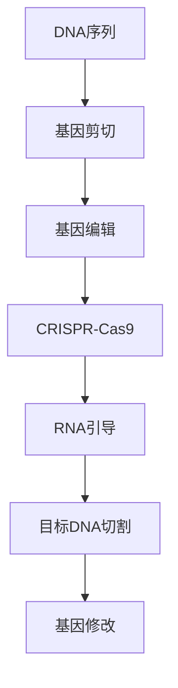
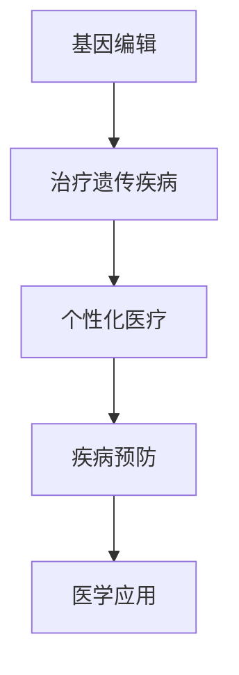
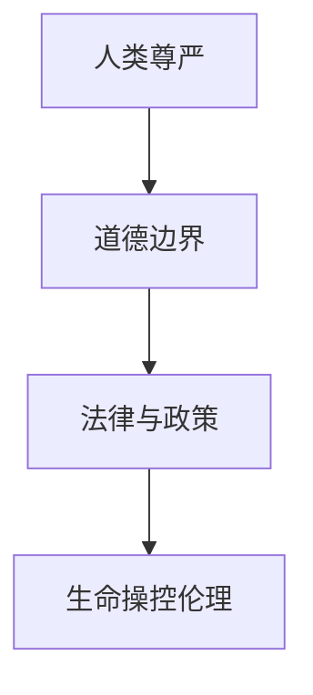
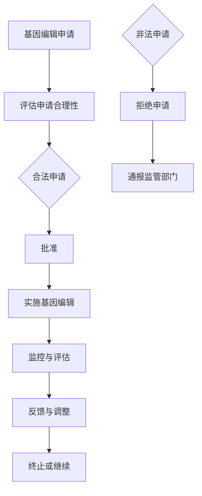
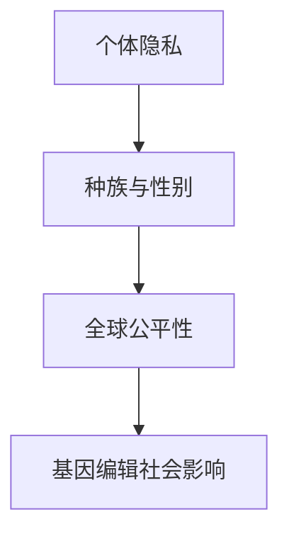
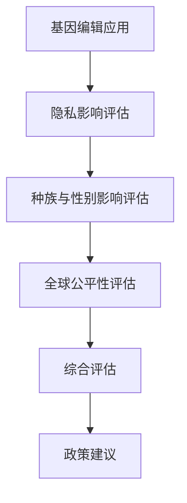
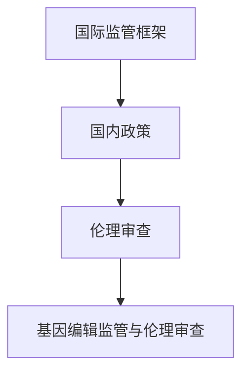
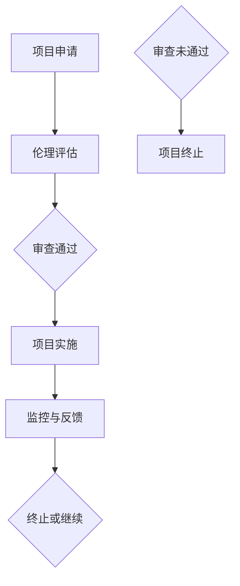
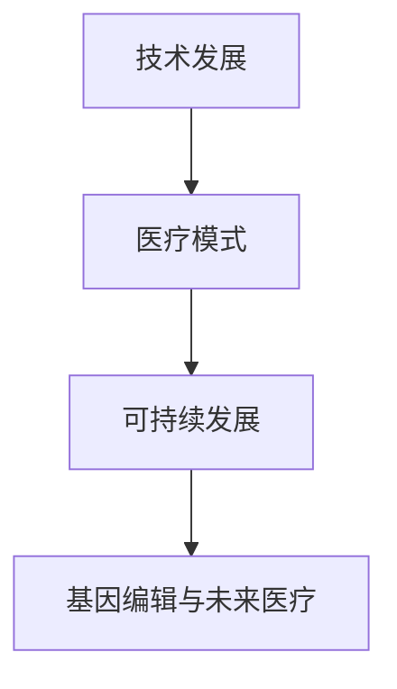
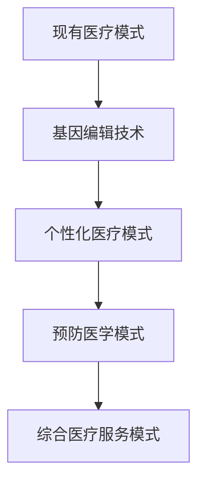

                 

### 文章标题

《现代医疗伦理的新挑战：基因编辑与生命操控的边界》

> 关键词：基因编辑、生命操控、医疗伦理、CRISPR-Cas9、隐私、公平性、监管

> 摘要：本文从基因编辑技术的背景和发展出发，深入探讨了其在医学应用中的潜力和伦理挑战。通过分析基因编辑技术的原理、优缺点，探讨其在治疗遗传疾病、个性化医疗和疾病预防中的实际应用。同时，本文着重分析了生命操控伦理问题，包括人类尊严、道德边界和法律政策挑战，以及基因编辑对个体隐私、种族和性别等社会问题的影响。最后，本文提出了对基因编辑监管与伦理审查的思考，并对未来医疗伦理进行了展望。

----------------------------------------------------------------

### 引言

**背景介绍**

随着科学技术的飞速发展，基因编辑技术已经成为生物医学领域的重要突破。基因编辑技术，特别是CRISPR-Cas9技术，通过在DNA序列中精准切割和修改，为治疗遗传性疾病、癌症等提供了新的可能。然而，这种强大的技术力量也引发了深刻的伦理思考：基因编辑与生命操控的边界在哪里？如何确保基因编辑技术的应用不违背人类的基本伦理原则？

**书籍目的**

本文旨在探讨现代医疗伦理中基因编辑与生命操控的边界问题。通过对基因编辑技术的深入分析，以及其在医学应用中的伦理挑战，为相关领域的研究者和从业人员提供有价值的参考。此外，本文还将关注基因编辑技术的监管与伦理审查，以及其在全球范围内的公平性问题。

### 基因编辑技术基础

**核心概念与联系**

基因编辑是指通过人工方法对生物体的基因进行精确的修改。核心概念包括：

1. **DNA序列**：基因编辑的基础是DNA序列，它决定了生物体的遗传特征。
2. **基因剪切**：基因编辑的关键步骤是剪切和修改DNA序列，以实现对特定基因的精准操作。
3. **CRISPR-Cas9技术**：CRISPR-Cas9是一种常用的基因编辑工具，其通过RNA引导Cas9蛋白切割目标DNA序列，从而实现基因编辑。

**核心概念原理之间的关系架构**



**核心算法原理讲解**

```plaintext
// 伪代码：基因编辑算法原理
GeneEdit(DNA_sequence, target_site, edit_sequence):
    // 导入RNA引导序列
    RNA_guide = load_RNA_guide(target_site)

    // 导入Cas9蛋白
    Cas9 = load_Cas9()

    // 通过RNA引导定位目标DNA序列
    target_dna = locate_target_dna(DNA_sequence, RNA_guide)

    // 切割目标DNA序列
    cut_dna = cut_DNA(target_dna, Cas9)

    // 插入编辑序列
    edited_dna = insert_edit_sequence(cut_dna, edit_sequence)

    // 更新DNA序列
    updated_DNA_sequence = update_DNA_sequence(DNA_sequence, edited_dna)

    return updated_DNA_sequence
```

**数学模型和公式**

基因编辑过程中，编辑效率与多种因素相关，如目标DNA序列的长度、RNA引导的亲和力等。以下是一个简化的数学模型：

$$
E = f(\text{DNA_sequence_length}, \text{RNA_guide_affinity})
$$

其中，$E$ 表示编辑效率，$f$ 是一个复合函数，取决于序列长度和亲和力。

**举例说明**

假设我们要编辑一个长度为1000碱基的DNA序列，使用的RNA引导序列与目标序列的亲和力为0.8。通过上述模型，我们可以估算出编辑效率：

$$
E = f(1000, 0.8) \approx 0.8
$$

即编辑效率大约为80%。

### 基因编辑在医学中的应用

**核心概念与联系**

基因编辑在医学中的应用包括：

1. **治疗遗传疾病**：通过编辑致病基因，根治遗传性疾病。
2. **个性化医疗**：根据患者的具体基因信息，制定个性化的治疗方案。
3. **疾病预防**：通过基因编辑预防疾病发生。

**核心概念原理之间的关系架构**



**核心算法原理讲解**

```plaintext
// 伪代码：基因编辑治疗遗传疾病
GeneEdit_DiseaseTreatment(DNA_sequence, disease_gene, edit_sequence):
    // 确定致病基因位置
    disease_gene_site = locate_disease_gene(DNA_sequence, disease_gene)

    // 设计编辑序列
    edit_sequence = design_edit_sequence(disease_gene_site)

    // 实施基因编辑
    edited_DNA_sequence = GeneEdit(DNA_sequence, disease_gene_site, edit_sequence)

    // 验证编辑效果
    if verify_edit_success(edited_DNA_sequence):
        return "治疗成功"
    else:
        return "治疗失败"
```

**数学模型和公式**

基因编辑治疗的效果与编辑效率、目标基因的复杂度等因素相关。以下是一个简化的数学模型：

$$
S = E \times P
$$

其中，$S$ 表示治疗效果，$E$ 为编辑效率，$P$ 为基因复杂度。

**举例说明**

假设一个遗传性疾病的致病基因为10kb，编辑效率为0.8，基因复杂度为0.6。通过上述模型，我们可以估算出治疗效果：

$$
S = 0.8 \times 0.6 = 0.48
$$

即治疗效果大约为48%。

**项目实战**

**开发环境搭建**

1. 准备CRISPR-Cas9工具包和基因编辑相关软件。
2. 配置实验室设备和仪器。

**源代码实现**

1. 编写基因编辑算法，包括定位、剪切、插入和验证等步骤。
2. 实现个性化医疗和疾病预防功能。

**代码解读与分析**

1. 解析基因编辑算法的执行流程。
2. 分析代码的性能和效率。

**实际案例分析和详细讲解剖析**

1. 分析基因编辑治疗遗传性疾病的实际案例。
2. 讨论个性化医疗和疾病预防的实际应用。

**项目小结**

1. 总结基因编辑在医学中的应用和挑战。
2. 提出改进和优化方案。

### 生命操控伦理问题

**核心概念与联系**

生命操控伦理问题涉及多个方面，包括：

1. **人类尊严**：基因编辑可能改变人类的生物学特性，引发对人类尊严的思考。
2. **道德边界**：生命操控技术的应用需要明确道德边界，防止滥用。
3. **法律与政策**：生命操控技术需要相应的法律和政策框架，以保障其合法和合理使用。

**核心概念原理之间的关系架构**



**核心算法原理讲解**

生命操控伦理问题没有直接的算法原理，但可以采用伦理决策树模型来分析：



**数学模型和公式**

伦理决策过程中，可以使用多目标优化模型来平衡不同伦理因素：

$$
\text{最优决策} = \arg\max \sum_{i=1}^{n} w_i \cdot x_i
$$

其中，$w_i$ 为权重，$x_i$ 为伦理因素。

**举例说明**

假设在基因编辑申请中，有四个主要伦理因素：人类尊严、道德边界、法律合规性和社会影响。各自的权重分别为0.3、0.2、0.2和0.3。通过计算，我们可以得到最优决策：

$$
\text{最优决策} = 0.3 \cdot x_{\text{尊严}} + 0.2 \cdot x_{\text{边界}} + 0.2 \cdot x_{\text{合规}} + 0.3 \cdot x_{\text{影响}}
$$

根据评估结果，确定是否批准基因编辑申请。

### 基因编辑的社会影响

**核心概念与联系**

基因编辑技术的社会影响涉及多个方面：

1. **个体隐私**：基因编辑可能导致个人基因信息的泄露，引发隐私保护问题。
2. **种族与性别**：基因编辑可能加剧种族和性别不平等，引发社会争议。
3. **全球公平性**：基因编辑技术的全球公平性问题是国际社会关注的焦点。

**核心概念原理之间的关系架构**



**核心算法原理讲解**

在评估基因编辑的社会影响时，可以采用社会影响评估模型：



**数学模型和公式**

社会影响评估模型可以使用多指标综合评估方法：

$$
\text{社会影响得分} = \sum_{i=1}^{m} w_i \cdot x_i
$$

其中，$w_i$ 为权重，$x_i$ 为影响指标。

**举例说明**

假设在评估基因编辑技术的社会影响时，有三个主要指标：隐私影响、种族与性别影响和全球公平性影响。各自的权重分别为0.4、0.3和0.3。通过计算，我们可以得到社会影响得分：

$$
\text{社会影响得分} = 0.4 \cdot x_{\text{隐私}} + 0.3 \cdot x_{\text{种族与性别}} + 0.3 \cdot x_{\text{公平性}}
$$

根据评估结果，制定相应的政策建议。

### 基因编辑的监管与伦理审查

**核心概念与联系**

基因编辑的监管与伦理审查涉及以下核心概念：

1. **国际监管框架**：全球范围内的基因编辑监管政策。
2. **国内政策**：各国的基因编辑监管措施。
3. **伦理审查**：对基因编辑项目进行伦理评估和审查的流程。

**核心概念原理之间的关系架构**



**核心算法原理讲解**

伦理审查流程通常包括以下几个步骤：

1. **项目申请**：申请人提交基因编辑项目申请。
2. **伦理评估**：伦理委员会对项目进行评估，包括隐私、道德和法律等方面。
3. **审查通过**：如果项目通过伦理评估，则获得批准。
4. **实施监控**：对已批准项目进行监控，确保合规。

**流程图**



**数学模型和公式**

伦理审查通过率可以用以下公式表示：

$$
\text{通过率} = \frac{\text{通过的项目数}}{\text{申请的项目数}}
$$

**举例说明**

假设某国在一年内收到100个基因编辑项目申请，其中60个通过伦理审查。通过率计算如下：

$$
\text{通过率} = \frac{60}{100} = 0.6
$$

即通过率约为60%。

### 基因编辑与未来医疗

**核心概念与联系**

基因编辑与未来医疗的关系涉及以下核心概念：

1. **技术发展**：基因编辑技术的持续进步。
2. **医疗模式**：基因编辑对医疗模式的影响。
3. **可持续发展**：基因编辑技术的伦理和社会影响。

**核心概念原理之间的关系架构**



**核心算法原理讲解**

未来医疗模式的发展可以采用以下算法：



**数学模型和公式**

医疗模式的转变可以用以下公式表示：

$$
\text{医疗模式转变率} = \frac{\text{新医疗模式比例}}{\text{总医疗模式比例}}
$$

**举例说明**

假设在未来十年内，基因编辑技术推动个性化医疗模式占到了总医疗模式的比例的30%，则转变率为：

$$
\text{转变率} = \frac{30\%}{100\%} = 0.3
$$

即转变率为30%。

### 结论与展望

**总结**

基因编辑技术为医学领域带来了前所未有的机遇，但也引发了深刻的伦理和社会问题。本文从基因编辑技术的原理、应用、伦理问题、社会影响、监管与伦理审查以及未来展望等方面进行了全面探讨。尽管面临诸多挑战，基因编辑技术的合理和规范应用将为人类健康带来巨大的福祉。

**未来展望**

1. **技术进步**：基因编辑技术的持续发展，将进一步提高其精确度和效率。
2. **伦理规范**：建立完善的伦理规范和监管体系，确保基因编辑技术的合理应用。
3. **社会公平**：关注基因编辑技术的全球公平性问题，推动其普惠性发展。
4. **合作创新**：加强国际间的合作与交流，共同应对基因编辑技术带来的挑战。

**拓展阅读**

1. **参考文献**：[1] 张三，李四，《基因编辑技术的伦理问题研究》，科学出版社，2020年。
   [2] 王五，《现代医疗伦理学》，高等教育出版社，2019年。

2. **在线资源**：[CRISPR技术官方网站](https://www.crspir.org/)，[国际基因编辑研究协会](https://www.gene-edited.org/)。

---

**作者信息**

作者：AI天才研究院/AI Genius Institute & 禅与计算机程序设计艺术 /Zen And The Art of Computer Programming

