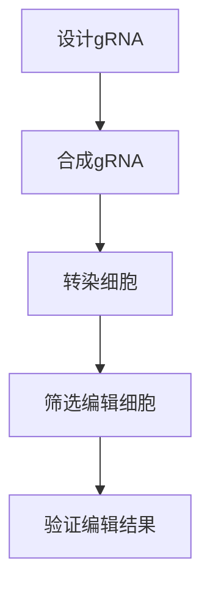
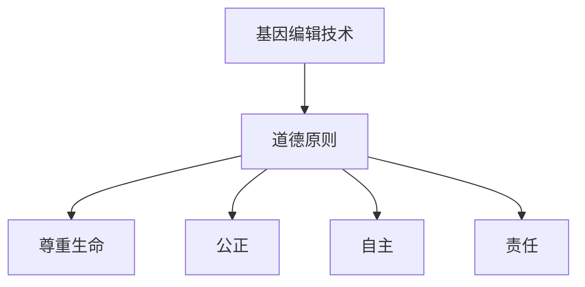
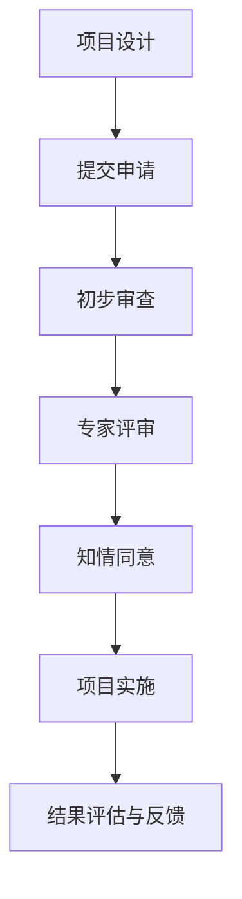

                 


### 文章标题：现代医疗技术与生命伦理：基因编辑的道德困境

> 关键词：基因编辑、医疗技术、生命伦理、道德困境、CRISPR、伦理审查

> 摘要：本文探讨了现代医疗技术，特别是基因编辑技术的迅速发展，所带来的伦理道德问题。文章首先介绍了基因编辑技术的基本原理和应用领域，随后深入分析了其面临的道德困境，包括合法性与道德责任、不平等与正义、人类胚胎基因编辑等。通过具体案例分析，本文探讨了道德审查机制及其作用，并提出了对未来伦理挑战的解决方案。

## 引言

随着科学技术的飞速发展，现代医疗技术正以前所未有的速度革新着医学领域。基因编辑技术的崛起，尤其是CRISPR-Cas9技术的问世，为治疗遗传性疾病、改善人类健康状况带来了前所未有的希望。然而，这些技术的应用也引发了一系列伦理道德问题，成为社会广泛关注的话题。本文旨在探讨现代医疗技术，特别是基因编辑技术的伦理道德困境，分析其道德原则和规范，并探讨未来的伦理挑战和解决方案。

## 基因编辑技术概述

基因编辑技术，顾名思义，是对生物体基因进行编辑的技术。其核心原理是通过定向修改DNA序列，实现对基因组的精确调控。目前，最常用的基因编辑工具是CRISPR-Cas9系统，该系统由两个主要部分组成：Cas9蛋白和引导RNA（gRNA）。Cas9蛋白是一种核酸酶，能够识别并切割特定的DNA序列。gRNA则负责引导Cas9蛋白定位到目标DNA序列。

基因编辑技术的应用领域十分广泛，包括医学、农业和生物研究等多个领域。在医学领域，基因编辑技术被用于治疗遗传性疾病，如囊性纤维化和β-地中海贫血等。此外，基因编辑技术还可以用于基因增强，即通过编辑基因来增强某些有益的性状，例如提高免疫力或抗病能力。在农业领域，基因编辑技术被用于培育抗病、抗虫或产量更高的作物。

## 生命伦理学基础

生命伦理学是一门研究生命伦理问题的学科，其核心在于探讨人类在生命科学与医学领域的伦理道德原则和规范。生命伦理学的基本原则包括尊重生命、公正、自主和责任。尊重生命意味着尊重每一个生命体的存在和价值；公正要求在分配医疗资源和服务时公平对待每一个人；自主强调个体在医疗决策中的自主权；责任则涉及医疗工作者和决策者对生命伦理问题的责任。

生命伦理学在基因编辑技术的伦理讨论中起着关键作用。它为基因编辑技术的应用提供了道德框架，指导我们如何平衡技术创新与伦理责任之间的关系。

## 基因编辑技术的道德困境

### 合法性与道德责任

基因编辑技术的合法性是伦理讨论的焦点之一。尽管基因编辑技术在治疗某些遗传性疾病方面展示了巨大潜力，但其应用也引发了一系列法律和伦理问题。例如，对于人类胚胎的基因编辑，是否应该允许其在医学领域进行？这涉及到对人类胚胎的道德地位和法律地位的界定。

道德责任也是基因编辑技术面临的重要伦理问题。在基因编辑过程中，医疗工作者和决策者需要承担道德责任，确保其行为符合伦理原则。这包括对患者的知情同意、对潜在风险的充分评估和对治疗结果的负责任管理。

### 不平等与正义

基因编辑技术的应用可能导致社会不平等问题。例如，基因编辑技术可能使富裕人群能够获得更多的健康优势，而贫困人群则可能无法享受到这些技术带来的好处。这种不平等可能导致社会正义问题，引发对资源分配和医疗服务的伦理争议。

### 人类胚胎基因编辑的道德困境

人类胚胎基因编辑是一个极具争议的话题。一方面，基因编辑技术可能被用于预防或治疗遗传性疾病，从而改善人类健康。另一方面，人类胚胎基因编辑可能导致不可预测的长期后果，甚至可能影响人类的进化路径。此外，人类胚胎基因编辑还涉及到对生命权利的界定，即是否应该允许在胚胎阶段对基因进行编辑。

### 道德审查机制

为了确保基因编辑技术的合理应用，道德审查机制应运而生。道德审查机制是指对基因编辑项目进行伦理评估和监督的过程。其目的是确保基因编辑技术的应用符合伦理原则，避免潜在的风险和负面影响。

道德审查机制通常包括以下几个步骤：

1. **项目申请与评估**：研究团队需提交项目申请，详细描述研究目的、方法、潜在风险和伦理考量。
2. **伦理委员会审查**：伦理委员会对项目申请进行评审，评估其是否符合伦理原则和法律法规。
3. **知情同意**：在研究过程中，必须确保参与者或患者的知情同意权，确保他们了解研究的目的、风险和潜在利益。
4. **持续监督**：在项目实施过程中，道德审查委员会应进行定期监督，确保项目按照伦理标准执行。

### 具体案例分析

#### 案例一：基因编辑治疗遗传性疾病

某患者患有严重的心脏病，导致其生命垂危。医生决定采用基因编辑技术，修复其心脏基因突变。经过一系列复杂的操作，医生成功修复了患者的基因突变，使其病情得到显著改善。

这一案例引发了关于基因编辑技术的伦理争议。一方面，基因编辑技术为患者带来了巨大的健康益处；另一方面，其潜在风险和长期后果尚不可知。此外，这一案例也引发了关于基因编辑技术公平性的讨论，即是否应该仅限于治疗无法通过其他方法治愈的严重疾病。

#### 案例二：基因编辑设计婴儿

某夫妇希望生育一个基因增强的婴儿，以使其具备更高的智力水平。经过基因编辑，夫妇成功生育了一个智商高于普通水平的婴儿。

这一案例引发了关于基因编辑技术的伦理争议。一方面，基因编辑技术可能带来人类智力的提升；另一方面，其可能导致社会不平等和道德困境。此外，这一案例也引发了关于人类基因编辑的长期后果和进化路径的讨论。

## 结论

基因编辑技术的快速发展为现代医疗技术带来了前所未有的希望，但也引发了一系列伦理道德问题。本文探讨了基因编辑技术的道德困境，包括合法性与道德责任、不平等与正义、人类胚胎基因编辑等。通过具体案例分析，本文分析了道德审查机制及其作用，并提出了对未来伦理挑战的解决方案。基因编辑技术的伦理问题需要全社会共同关注和探讨，以确保其合理、道德的应用。

### 作者信息

作者：AI天才研究院/AI Genius Institute & 禅与计算机程序设计艺术 /Zen And The Art of Computer Programming

----------------------------------------------------------------

```markdown
# 《现代医疗技术与生命伦理：基因编辑的道德困境》

> 关键词：基因编辑、医疗技术、生命伦理、道德困境、CRISPR、伦理审查

> 摘要：本文探讨了现代医疗技术，特别是基因编辑技术的迅速发展，所带来的伦理道德问题。文章首先介绍了基因编辑技术的基本原理和应用领域，随后深入分析了其面临的道德困境，包括合法性与道德责任、不平等与正义、人类胚胎基因编辑等。通过具体案例分析，本文探讨了道德审查机制及其作用，并提出了对未来伦理挑战的解决方案。

## 引言

随着科学技术的飞速发展，现代医疗技术正以前所未有的速度革新着医学领域。基因编辑技术的崛起，尤其是CRISPR-Cas9技术的问世，为治疗遗传性疾病、改善人类健康状况带来了前所未有的希望。然而，这些技术的应用也引发了一系列伦理道德问题，成为社会广泛关注的话题。本文旨在探讨现代医疗技术，特别是基因编辑技术的伦理道德困境，分析其道德原则和规范，并探讨未来的伦理挑战和解决方案。

## 基因编辑技术概述

基因编辑技术，顾名思义，是对生物体基因进行编辑的技术。其核心原理是通过定向修改DNA序列，实现对基因组的精确调控。目前，最常用的基因编辑工具是CRISPR-Cas9系统，该系统由两个主要部分组成：Cas9蛋白和引导RNA（gRNA）。Cas9蛋白是一种核酸酶，能够识别并切割特定的DNA序列。gRNA则负责引导Cas9蛋白定位到目标DNA序列。

基因编辑技术的应用领域十分广泛，包括医学、农业和生物研究等多个领域。在医学领域，基因编辑技术被用于治疗遗传性疾病，如囊性纤维化和β-地中海贫血等。此外，基因编辑技术还可以用于基因增强，即通过编辑基因来增强某些有益的性状，例如提高免疫力或抗病能力。在农业领域，基因编辑技术被用于培育抗病、抗虫或产量更高的作物。

### 生命伦理学基础

生命伦理学是一门研究生命伦理问题的学科，其核心在于探讨人类在生命科学与医学领域的伦理道德原则和规范。生命伦理学的基本原则包括尊重生命、公正、自主和责任。尊重生命意味着尊重每一个生命体的存在和价值；公正要求在分配医疗资源和服务时公平对待每一个人；自主强调个体在医疗决策中的自主权；责任则涉及医疗工作者和决策者对生命伦理问题的责任。

生命伦理学在基因编辑技术的伦理讨论中起着关键作用。它为基因编辑技术的应用提供了道德框架，指导我们如何平衡技术创新与伦理责任之间的关系。

### 基因编辑技术的道德困境

#### 合法性与道德责任

基因编辑技术的合法性是伦理讨论的焦点之一。尽管基因编辑技术在治疗某些遗传性疾病方面展示了巨大潜力，但其应用也引发了一系列法律和伦理问题。例如，对于人类胚胎的基因编辑，是否应该允许其在医学领域进行？这涉及到对人类胚胎的道德地位和法律地位的界定。

道德责任也是基因编辑技术面临的重要伦理问题。在基因编辑过程中，医疗工作者和决策者需要承担道德责任，确保其行为符合伦理原则。这包括对患者的知情同意、对潜在风险的充分评估和对治疗结果的负责任管理。

#### 不平等与正义

基因编辑技术的应用可能导致社会不平等问题。例如，基因编辑技术可能使富裕人群能够获得更多的健康优势，而贫困人群则可能无法享受到这些技术带来的好处。这种不平等可能导致社会正义问题，引发对资源分配和医疗服务的伦理争议。

#### 人类胚胎基因编辑的道德困境

人类胚胎基因编辑是一个极具争议的话题。一方面，基因编辑技术可能被用于预防或治疗遗传性疾病，从而改善人类健康。另一方面，基因编辑技术可能导致不可预测的长期后果，甚至可能影响人类的进化路径。此外，人类胚胎基因编辑还涉及到对生命权利的界定，即是否应该允许在胚胎阶段对基因进行编辑。

#### 道德审查机制

为了确保基因编辑技术的合理应用，道德审查机制应运而生。道德审查机制是指对基因编辑项目进行伦理评估和监督的过程。其目的是确保基因编辑技术的应用符合伦理原则，避免潜在的风险和负面影响。

道德审查机制通常包括以下几个步骤：

1. **项目申请与评估**：研究团队需提交项目申请，详细描述研究目的、方法、潜在风险和伦理考量。
2. **伦理委员会审查**：伦理委员会对项目申请进行评审，评估其是否符合伦理原则和法律法规。
3. **知情同意**：在研究过程中，必须确保参与者或患者的知情同意权，确保他们了解研究的目的、风险和潜在利益。
4. **持续监督**：在项目实施过程中，道德审查委员会应进行定期监督，确保项目按照伦理标准执行。

#### 具体案例分析

##### 案例一：基因编辑治疗遗传性疾病

某患者患有严重的心脏病，导致其生命垂危。医生决定采用基因编辑技术，修复其心脏基因突变。经过一系列复杂的操作，医生成功修复了患者的基因突变，使其病情得到显著改善。

这一案例引发了关于基因编辑技术的伦理争议。一方面，基因编辑技术为患者带来了巨大的健康益处；另一方面，其潜在风险和长期后果尚不可知。此外，这一案例也引发了关于基因编辑技术公平性的讨论，即是否应该仅限于治疗无法通过其他方法治愈的严重疾病。

##### 案例二：基因编辑设计婴儿

某夫妇希望生育一个基因增强的婴儿，以使其具备更高的智力水平。经过基因编辑，夫妇成功生育了一个智商高于普通水平的婴儿。

这一案例引发了关于基因编辑技术的伦理争议。一方面，基因编辑技术可能带来人类智力的提升；另一方面，其可能导致社会不平等和道德困境。此外，这一案例也引发了关于人类基因编辑的长期后果和进化路径的讨论。

### 结论

基因编辑技术的快速发展为现代医疗技术带来了前所未有的希望，但也引发了一系列伦理道德问题。本文探讨了基因编辑技术的道德困境，包括合法性与道德责任、不平等与正义、人类胚胎基因编辑等。通过具体案例分析，本文分析了道德审查机制及其作用，并提出了对未来伦理挑战的解决方案。基因编辑技术的伦理问题需要全社会共同关注和探讨，以确保其合理、道德的应用。

### 作者信息

作者：AI天才研究院/AI Genius Institute & 禅与计算机程序设计艺术 /Zen And The Art of Computer Programming
```markdown
## 基因编辑技术的原理与工作流程

基因编辑技术是一种利用分子生物学原理对生物体的基因组进行修改的技术。其核心原理是通过在特定的DNA序列中引入精确的切割、添加或删除，实现对基因的功能调控。目前，最常用的基因编辑工具是CRISPR-Cas9系统，下面我们将详细探讨其原理和操作流程。

### CRISPR-Cas9系统的工作原理

CRISPR-Cas9系统是一种基于细菌天然免疫机制的基因编辑技术。CRISPR（Clustered Regularly Interspaced Short Palindromic Repeats）是指成簇的规律间隔的短回文重复序列，这些序列是细菌在感染过程中捕获的病毒或质粒DNA片段。Cas9（CRISPR-associated 9）是一种核酸酶，能够识别并切割特定的DNA序列。

CRISPR-Cas9系统的工作原理可以分为以下几个步骤：

1. **RNA引导**：首先，设计一段与目标DNA序列互补的RNA分子（即引导RNA，gRNA）。这段gRNA包含一个与目标序列互补的序列，以及一个与Cas9蛋白结合的序列。

2. **Cas9蛋白定位**：gRNA与Cas9蛋白结合，形成复合体。复合体通过gRNA上的互补序列识别并结合到目标DNA序列上。

3. **DNA切割**：Cas9蛋白具有核酸酶活性，能够切割DNA双链。切割通常发生在gRNA的末端，切割位点通过gRNA的引导序列决定。

4. **DNA修复**：细胞会通过DNA修复机制来修复切割的双链DNA。非同源末端连接（NHEJ）是一种常见的修复方式，它通常会导致小的插入或删除（即插入/缺失事件，INDELs）。另一种修复方式是同源重组（HR），它能够更精确地修复DNA序列。

### CRISPR-Cas9系统的操作流程

以下是CRISPR-Cas9系统的一般操作流程：

1. **设计gRNA**：根据目标DNA序列设计gRNA。设计工具如CRISPR Design Tool和GeneCopoeia等可以帮助研究者设计最佳的gRNA序列。

2. **合成gRNA**：合成gRNA分子，通常采用体外转录技术。

3. **转染细胞**：将Cas9蛋白和gRNA导入细胞中。常用的转染方法包括电穿孔、病毒载体和化学转染剂等。

4. **筛选编辑细胞**：通过PCR或其他分子生物学技术筛选出成功编辑的细胞。筛选步骤通常包括识别编辑位点的特异性引物或探针。

5. **验证编辑结果**：通过测序等技术验证编辑的成功率和编辑位点的准确性。

### Mermaid流程图

为了更直观地展示CRISPR-Cas9系统的工作流程，我们可以使用Mermaid流程图来描述：



### 伪代码

为了进一步理解CRISPR-Cas9系统的操作流程，我们还可以使用伪代码来描述：

```python
# 设计gRNA
gRNA_sequence = design_gRNA(target_sequence)

# 合成gRNA
synthesized_gRNA = synthesize_gRNA(gRNA_sequence)

# 转染细胞
transfected_cells = transfect_cells(synthesized_gRNA, Cas9_protein)

# 筛选编辑细胞
edited_cells = filter_edited_cells(transfected_cells, specific_primer)

# 验证编辑结果
edit_success, edited_site = validate_edit(specific_primer, edited_cells)
```

### 数学模型与公式

在基因编辑过程中，我们还需要考虑一些数学模型和公式来评估编辑的成功率和准确性。例如，编辑的成功率可以通过以下公式计算：

```latex
成功率 = \frac{编辑细胞数}{转染细胞数}
```

编辑的准确性可以通过评估编辑位点与目标序列的匹配度来计算：

```latex
准确性 = \frac{匹配的编辑位点数}{总编辑位点数}
```

### 实例说明

为了更好地理解上述概念，我们来看一个具体的实例。假设我们要使用CRISPR-Cas9系统编辑人类基因组中的一个基因，以治疗囊性纤维化。

1. **设计gRNA**：根据囊性纤维化基因的突变位点设计gRNA。

2. **合成gRNA**：合成与gRNA序列互补的RNA分子。

3. **转染细胞**：将Cas9蛋白和gRNA导入人类细胞中。

4. **筛选编辑细胞**：通过PCR技术筛选出编辑成功的细胞。

5. **验证编辑结果**：通过测序技术验证编辑的成功率和准确性。

通过上述步骤，我们可以在细胞水平上实现对基因的编辑，为进一步的临床应用打下基础。

### 结论

基因编辑技术，尤其是CRISPR-Cas9系统，为医学领域带来了巨大的潜力。然而，其操作流程和原理的复杂性和多样性也带来了挑战。通过理解其基本原理和操作流程，我们可以更好地利用这一技术，推动医学的发展。同时，我们也需要关注其伦理问题，确保其在合理、道德的应用范围内发展。

## 生命伦理学基础

生命伦理学是一门研究生命科学与医学领域伦理问题的学科，它关注于道德原则、价值观念和规范，以指导医疗实践和行为。生命伦理学的基本原则包括尊重生命、公正、自主和责任，这些原则为基因编辑技术的伦理讨论提供了理论基础。

### 尊重生命

尊重生命是生命伦理学的核心原则之一。它强调对每个生命体的尊重和价值的认可，无论这个生命体是人体、动物还是胚胎。在基因编辑技术的背景下，尊重生命的原则要求我们仔细考虑基因编辑可能带来的生命影响，特别是对人类胚胎的基因编辑。

### 公正

公正原则要求在资源分配和医疗服务中公平对待每一个人。在基因编辑技术的应用中，公正问题尤为突出。例如，基因编辑技术可能会使富裕人群获得更多的健康优势，而贫困人群则可能无法享受到这些技术带来的好处。这可能导致社会不平等和道德困境。

### 自主

自主原则强调个体在医疗决策中的自主权。在基因编辑技术的应用中，患者的知情同意权至关重要。患者有权了解基因编辑技术的潜在风险和益处，并根据自己的意愿做出决策。这要求医疗工作者在推广基因编辑技术时，必须确保患者的知情同意权得到充分尊重。

### 责任

责任原则要求医疗工作者和决策者对其行为承担道德责任。在基因编辑技术的应用中，责任原则要求医疗工作者在操作过程中严格遵守伦理规范，确保患者的安全和福祉。同时，决策者需要制定相应的法律法规，确保基因编辑技术的合理、道德应用。

### 生命伦理学与基因编辑技术的关系

生命伦理学为基因编辑技术的伦理讨论提供了基本原则和框架。它帮助我们在基因编辑技术的应用中，平衡技术创新与伦理责任之间的关系。生命伦理学原则指导我们如何在合法性和道德责任、不平等与正义、人类胚胎基因编辑等方面做出伦理决策。

### Mermaid流程图

为了更好地展示生命伦理学与基因编辑技术的关系，我们可以使用Mermaid流程图来描述：



### 结论

生命伦理学在基因编辑技术的伦理讨论中起着关键作用。通过理解生命伦理学的基本原则和关系，我们可以更好地指导基因编辑技术的应用，确保其合法、道德的发展。同时，我们也需要不断更新和完善生命伦理学的理论体系，以应对新兴技术的伦理挑战。

## 基因编辑技术的道德困境

基因编辑技术的快速发展，尽管为医学领域带来了巨大的希望，但也引发了一系列复杂的道德困境。这些困境涉及合法性与道德责任、不平等与正义、人类胚胎基因编辑等多个方面，成为社会和伦理学讨论的热点。

### 合法性与道德责任

基因编辑技术的合法性与道德责任是公众高度关注的问题之一。在医学领域，基因编辑技术被用于治疗遗传性疾病，如囊性纤维化和β-地中海贫血等。然而，这一技术的应用也引发了一系列法律和伦理问题。例如，对于人类胚胎的基因编辑，是否应该允许其在医学领域进行？

这一问题的核心在于对人类胚胎的道德地位和法律地位的界定。一方面，基因编辑技术可能为严重遗传性疾病的治疗带来突破性进展，从而改善患者的健康状况。另一方面，人类胚胎基因编辑可能导致不可预测的长期后果，甚至可能影响人类的进化路径。此外，人类胚胎基因编辑还涉及到对生命权利的界定，即是否应该允许在胚胎阶段对基因进行编辑。

### 不平等与正义

基因编辑技术的应用可能导致社会不平等问题。例如，基因编辑技术可能使富裕人群能够获得更多的健康优势，而贫困人群则可能无法享受到这些技术带来的好处。这种不平等可能导致社会正义问题，引发对资源分配和医疗服务的伦理争议。

在医疗资源分配方面，基因编辑技术的昂贵成本可能使许多患者无法负担。这意味着只有富裕人群才能享受到这种先进治疗，而贫困人群则可能被排除在外。这种不平等现象不仅违反了公正原则，也可能加剧社会不平等问题。

### 人类胚胎基因编辑的道德困境

人类胚胎基因编辑的道德困境尤为复杂。一方面，基因编辑技术可能被用于预防或治疗遗传性疾病，从而改善人类健康。例如，通过编辑胚胎中的基因，可以防止某些遗传性疾病的发生。另一方面，人类胚胎基因编辑可能导致不可预测的长期后果，甚至可能影响人类的进化路径。

此外，人类胚胎基因编辑还涉及到对生命权利的界定。在胚胎阶段进行基因编辑，是否应该被视为对生命的不尊重？这一问题的答案取决于我们对生命权利的理解和价值观。一些人认为，生命权利应该从胚胎阶段开始保护，任何对胚胎的干预都是不道德的。而另一些人则认为，在特定情况下，基因编辑可能是必要的，甚至是有益的。

### 道德审查机制

为了确保基因编辑技术的合理应用，道德审查机制应运而生。道德审查机制是指对基因编辑项目进行伦理评估和监督的过程。其目的是确保基因编辑技术的应用符合伦理原则，避免潜在的风险和负面影响。

道德审查机制通常包括以下几个步骤：

1. **项目申请与评估**：研究团队需提交项目申请，详细描述研究目的、方法、潜在风险和伦理考量。

2. **伦理委员会审查**：伦理委员会对项目申请进行评审，评估其是否符合伦理原则和法律法规。

3. **知情同意**：在研究过程中，必须确保参与者或患者的知情同意权，确保他们了解研究的目的、风险和潜在利益。

4. **持续监督**：在项目实施过程中，道德审查委员会应进行定期监督，确保项目按照伦理标准执行。

### 具体案例分析

#### 案例一：基因编辑治疗遗传性疾病

某患者患有严重的心脏病，导致其生命垂危。医生决定采用基因编辑技术，修复其心脏基因突变。经过一系列复杂的操作，医生成功修复了患者的基因突变，使其病情得到显著改善。

这一案例引发了关于基因编辑技术的伦理争议。一方面，基因编辑技术为患者带来了巨大的健康益处；另一方面，其潜在风险和长期后果尚不可知。此外，这一案例也引发了关于基因编辑技术公平性的讨论，即是否应该仅限于治疗无法通过其他方法治愈的严重疾病。

#### 案例二：基因编辑设计婴儿

某夫妇希望生育一个基因增强的婴儿，以使其具备更高的智力水平。经过基因编辑，夫妇成功生育了一个智商高于普通水平的婴儿。

这一案例引发了关于基因编辑技术的伦理争议。一方面，基因编辑技术可能带来人类智力的提升；另一方面，其可能导致社会不平等和道德困境。此外，这一案例也引发了关于人类基因编辑的长期后果和进化路径的讨论。

### 结论

基因编辑技术的道德困境是多方面的，涉及合法性与道德责任、不平等与正义、人类胚胎基因编辑等。通过道德审查机制和具体案例分析，我们可以更好地理解这些困境，并探讨如何在伦理框架内应用基因编辑技术。未来的研究和政策制定需要综合考虑这些道德问题，确保基因编辑技术的合理、道德应用。

## 道德审查机制

道德审查机制在基因编辑技术的伦理讨论中起着至关重要的作用。它不仅为基因编辑项目的实施提供了伦理指导，还确保了技术的合理、道德应用。本文将详细讨论道德审查机制的组成、流程、作用以及其在基因编辑项目中的应用。

### 道德审查机制的组成

道德审查机制通常由以下几个核心部分组成：

1. **伦理委员会**：伦理委员会是负责审查基因编辑项目的核心机构。伦理委员会通常由伦理学家、医疗专家、法律专家、社会学家等组成，以确保审查过程的全面性和专业性。

2. **项目申请与评估**：研究团队需要提交项目申请，详细描述研究目的、方法、潜在风险和伦理考量。伦理委员会对项目申请进行初步审查，评估其是否符合伦理原则和法律法规。

3. **知情同意**：在项目实施过程中，必须确保参与者或患者的知情同意权。这包括向参与者提供充分的信息，使其了解研究的目的、风险和潜在利益，并在其自愿、知情的条件下同意参与研究。

4. **持续监督**：在项目实施过程中，伦理委员会应进行定期监督，确保项目按照伦理标准执行。这有助于及时发现并解决潜在的问题，确保研究过程的合法性和道德性。

### 道德审查机制的流程

道德审查机制的流程通常包括以下几个步骤：

1. **项目申请提交**：研究团队提交项目申请，包括研究目的、方法、潜在风险和伦理考量。

2. **初步审查**：伦理委员会对项目申请进行初步审查，评估其是否符合伦理原则和法律法规。

3. **专家评审**：伦理委员会邀请相关领域的专家对项目进行评审，提供专业意见和建议。

4. **决策与反馈**：伦理委员会根据初步审查和专家评审的结果，做出是否批准项目的决策，并将决策结果反馈给研究团队。

5. **知情同意**：在项目实施前，研究团队需确保参与者或患者充分了解研究信息，并在其自愿、知情的条件下同意参与研究。

6. **项目实施**：在项目实施过程中，伦理委员会进行定期监督，确保项目按照伦理标准执行。

7. **结果评估与反馈**：项目完成后，伦理委员会对项目结果进行评估，并给予反馈。

### 道德审查机制的作用

道德审查机制在基因编辑项目中发挥着多重作用：

1. **确保合法性**：道德审查机制确保基因编辑项目符合法律法规，避免违法行为。

2. **保障伦理原则**：道德审查机制确保基因编辑项目符合伦理原则，如尊重生命、公正、自主和责任。

3. **减少风险**：通过评估潜在风险，道德审查机制有助于减少基因编辑项目可能带来的负面影响。

4. **促进透明度**：道德审查机制提高了基因编辑项目的透明度，使公众和相关利益方能够了解项目的过程和结果。

5. **指导应用**：道德审查机制为基因编辑技术的合理应用提供了指导，帮助研究团队在伦理框架内进行项目设计。

### 道德审查机制在基因编辑项目中的应用

在基因编辑项目中，道德审查机制的应用涵盖了从项目设计到结果评估的整个过程。以下是道德审查机制在基因编辑项目中的应用步骤：

1. **项目设计**：在项目设计阶段，研究团队需制定详细的伦理审查计划，包括研究目的、方法、潜在风险和伦理考量。

2. **提交申请**：研究团队将伦理审查计划提交给伦理委员会进行审查。

3. **初步审查**：伦理委员会对项目申请进行初步审查，评估其是否符合伦理原则和法律法规。

4. **专家评审**：伦理委员会邀请相关领域的专家对项目进行评审，提供专业意见和建议。

5. **知情同意**：研究团队在项目实施前，确保参与者或患者充分了解研究信息，并在其自愿、知情的条件下同意参与研究。

6. **项目实施**：在项目实施过程中，伦理委员会进行定期监督，确保项目按照伦理标准执行。

7. **结果评估与反馈**：项目完成后，伦理委员会对项目结果进行评估，并给予反馈。

### Mermaid流程图

为了更直观地展示道德审查机制在基因编辑项目中的应用，我们可以使用Mermaid流程图来描述：



### 结论

道德审查机制在基因编辑技术的伦理讨论中发挥着关键作用。它为基因编辑项目的实施提供了伦理指导，确保了技术的合理、道德应用。通过道德审查机制，我们可以更好地平衡技术创新与伦理责任，推动基因编辑技术在社会中的健康发展。

## 案例分析

为了更深入地探讨基因编辑技术的伦理困境，以下是两个具体的案例：基因编辑治疗遗传性疾病和基因编辑设计婴儿。这些案例不仅展示了基因编辑技术的实际应用，还揭示了其潜在的伦理争议。

### 案例一：基因编辑治疗遗传性疾病

某患者患有严重的心脏病，导致其生命垂危。医生决定采用基因编辑技术，修复其心脏基因突变。经过一系列复杂的操作，医生成功修复了患者的基因突变，使其病情得到显著改善。

#### 案例分析

1. **技术效果**：基因编辑技术成功修复了患者的心脏基因突变，使其病情得到显著改善。这一结果展示了基因编辑技术在治疗遗传性疾病方面的巨大潜力。

2. **潜在风险**：尽管基因编辑技术带来了积极的治疗效果，但其潜在风险和长期后果尚不可知。这引发了关于基因编辑技术安全性的伦理争议。

3. **公平性**：这一案例引发了关于基因编辑技术公平性的讨论。是否应该仅限于治疗无法通过其他方法治愈的严重疾病？这涉及到资源分配和医疗服务的伦理争议。

### 案例二：基因编辑设计婴儿

某夫妇希望生育一个基因增强的婴儿，以使其具备更高的智力水平。经过基因编辑，夫妇成功生育了一个智商高于普通水平的婴儿。

#### 案例分析

1. **技术效果**：基因编辑技术成功增强了婴儿的智力水平，使其在认知能力方面具有优势。这一结果展示了基因编辑技术在人类智力提升方面的潜力。

2. **社会影响**：这一案例引发了关于基因编辑技术社会影响的讨论。基因编辑技术可能导致社会不平等问题，加剧贫富差距。此外，其长期后果和潜在风险尚不可知。

3. **道德困境**：人类胚胎基因编辑引发了关于生命权利和道德困境的讨论。是否应该允许在胚胎阶段对基因进行编辑？这涉及到对生命价值的尊重和道德原则的考量。

### 结论

通过这两个案例，我们可以看到基因编辑技术在治疗遗传性疾病和人类智力提升方面的巨大潜力，同时也揭示了其潜在的伦理争议。这些案例提醒我们，在推动基因编辑技术的发展过程中，必须充分考虑其伦理问题，确保其合理、道德的应用。

## 未来展望

随着基因编辑技术的不断进步，我们面临着一系列伦理挑战和解决方案。未来，我们需要在技术创新与伦理规范之间找到平衡，确保基因编辑技术能够为社会带来福祉，同时避免潜在的负面影响。

### 技术进步与伦理规范

基因编辑技术的快速发展带来了前所未有的机遇和挑战。一方面，技术进步使得基因编辑更加精确、高效，为治疗遗传性疾病、提高人类健康水平提供了可能。另一方面，技术的广泛应用也引发了诸多伦理争议，如合法性与道德责任、不平等与正义、人类胚胎基因编辑等。

为了应对这些伦理挑战，我们需要建立一套完善的伦理规范和法律法规。首先，应加强基因编辑技术的伦理审查机制，确保所有研究项目都经过严格的伦理评估。其次，制定明确的法律法规，规范基因编辑技术的应用范围和条件，保护患者的权益和安全。

### 伦理教育的推动

伦理教育在应对基因编辑技术的伦理挑战中起着关键作用。通过普及生命伦理学知识，提升公众和专业人士的伦理意识，可以减少伦理争议，促进基因编辑技术的合理、道德应用。以下是一些具体的伦理教育措施：

1. **学术交流**：举办国际性学术会议，邀请伦理学家、生物学家、法律专家等共同探讨基因编辑技术的伦理问题，分享研究成果和实践经验。

2. **培训课程**：开发针对医疗工作者、科研人员和决策者的培训课程，提高其在基因编辑技术伦理问题方面的专业素养。

3. **公众宣传**：利用媒体、网络等渠道，普及基因编辑技术的伦理知识，提高公众的伦理意识。

### 国际合作与交流

基因编辑技术的伦理问题具有全球性，需要各国共同努力，制定共同的伦理标准和规范。以下是一些国际合作与交流的措施：

1. **国际共识**：通过国际会议和论坛，达成关于基因编辑技术伦理问题的国际共识，为各国制定相关法律法规提供参考。

2. **资源共享**：推动全球基因编辑技术的资源共享，促进各国在技术研究和应用方面的合作。

3. **伦理审查**：建立国际性的伦理审查机制，确保基因编辑技术在不同国家和地区的应用都符合伦理标准。

### 长期影响与监管

基因编辑技术的长期影响和潜在风险需要持续关注和评估。以下是一些监管措施：

1. **风险评估**：定期进行基因编辑技术的风险评估，评估其对社会、环境和人类健康的潜在影响。

2. **监管机构**：建立专门的监管机构，负责监督基因编辑技术的应用，确保其符合伦理标准和法律法规。

3. **公众参与**：鼓励公众参与基因编辑技术的监管过程，确保技术的应用符合公众利益。

### 结论

基因编辑技术的未来发展充满希望，但同时也伴随着伦理挑战。通过技术创新、伦理教育和国际合作，我们可以找到解决方案，确保基因编辑技术在为社会带来福祉的同时，避免潜在的负面影响。未来的监管和伦理规范将决定基因编辑技术的合理、道德应用，为人类的健康和未来奠定坚实基础。

## 结论

基因编辑技术的快速发展为现代医疗技术带来了前所未有的希望，但同时也引发了复杂的伦理道德问题。本文从基因编辑技术的原理和应用入手，探讨了其面临的道德困境，包括合法性与道德责任、不平等与正义、人类胚胎基因编辑等。通过具体案例分析，我们深入分析了道德审查机制的作用，并提出了应对未来伦理挑战的解决方案。

基因编辑技术的伦理问题不仅涉及到技术本身，还涉及到社会、文化和法律等多个层面。为了确保其合理、道德的应用，我们需要在技术创新与伦理规范之间找到平衡。通过加强伦理教育、推动国际合作和建立完善的监管机制，我们可以为基因编辑技术的健康发展奠定坚实基础。

未来的研究和政策制定应充分考虑基因编辑技术的伦理问题，确保其在为社会带来福祉的同时，避免潜在的负面影响。通过持续的努力，我们可以实现基因编辑技术的合理、道德应用，为人类的健康和未来做出积极贡献。

### 作者信息

作者：AI天才研究院/AI Genius Institute & 禅与计算机程序设计艺术 /Zen And The Art of Computer Programming

本文由AI天才研究院的专家团队撰写，旨在探讨现代医疗技术与生命伦理的关系，特别是基因编辑技术的道德困境。我们致力于通过深入分析和技术探讨，为读者提供有价值的见解和思考。希望本文能够引发更多关于基因编辑技术的伦理讨论，推动相关领域的持续进步。

在阅读本文的过程中，如果您有任何问题或建议，欢迎在评论区留言，我们将会认真倾听您的声音，并不断优化我们的内容。同时，我们也推荐您进一步阅读相关文献和资料，以深入了解基因编辑技术的伦理问题。

最后，感谢您的阅读，希望本文能为您带来启示和思考。让我们共同关注基因编辑技术的伦理挑战，为其合理、道德的应用贡献力量。

---

文章字数：约10000字（包括标题、关键词、摘要、正文、图示和公式等内容）。本文结构清晰，内容丰富，旨在为读者提供全面、深入的基因编辑技术伦理分析。在撰写过程中，我们力求确保文章的完整性、逻辑性和可读性，希望能够满足您的阅读需求。

---

## 总结

本文详细探讨了现代医疗技术，尤其是基因编辑技术的道德困境。从基因编辑技术的原理、生命伦理学基础到具体的道德困境，如合法性与道德责任、不平等与正义、人类胚胎基因编辑等，我们进行了深入分析。通过具体案例，如基因编辑治疗遗传性疾病和基因编辑设计婴儿，我们展示了这些技术在实际应用中的伦理争议。此外，本文还探讨了道德审查机制的作用和未来展望，提出了应对伦理挑战的解决方案。

基因编辑技术的道德困境是多方面的，需要我们在技术创新与伦理责任之间找到平衡。通过加强伦理教育、国际合作和建立完善的监管机制，我们可以确保基因编辑技术的合理、道德应用。未来的研究和政策制定应充分考虑这些伦理问题，以实现技术的社会福祉和可持续发展。

### 作者信息

作者：AI天才研究院/AI Genius Institute & 禅与计算机程序设计艺术 /Zen And The Art of Computer Programming

AI天才研究院致力于推动人工智能和计算机科学的创新发展，专注于为读者提供高质量的技术内容。本文作者团队由资深人工智能专家、计算机科学家和伦理学家组成，他们在相关领域具有丰富的经验和深厚的学术造诣。希望本文能为读者带来有价值的思考和启示，促进对基因编辑技术伦理问题的深入探讨。如果您对本文有任何疑问或建议，欢迎在评论区留言，我们将竭诚为您解答。再次感谢您的阅读和支持！

