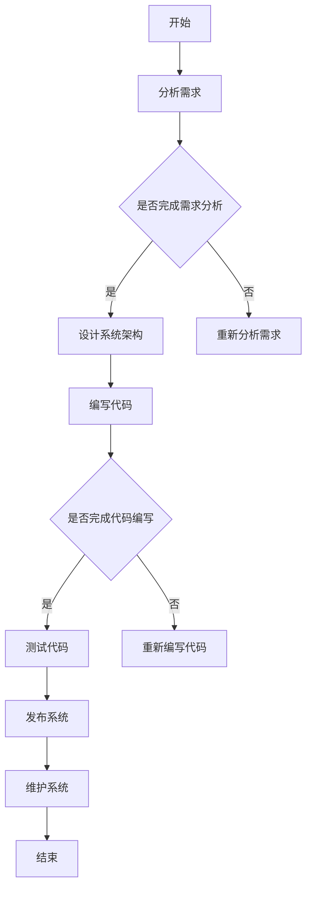

                 

### 文章标题

《现代家庭教育中的独立性培养：保护与放手的艺术》

> 关键词：家庭教育，独立性，保护，放手，艺术

> 摘要：本文将探讨现代家庭中独立性培养的重要性及其方法，通过理论和实践的结合，为家长提供培养孩子独立性的实用指南。

----------------------------------------------------------------

### 引言

在当今快速发展的社会中，独立性已成为一种重要的生存和发展能力。独立性不仅仅是个人能力的体现，更是心理健康和社会适应能力的重要指标。家庭教育作为孩子成长的第一个环境，对其独立性培养具有不可替代的作用。

独立性培养的意义在于，它能够帮助孩子形成自我意识，增强自我控制能力，提高问题解决能力，从而更好地适应社会环境。然而，在现实生活中，许多家长在培养孩子独立性时，往往陷入保护过度或放手过度的误区，导致孩子难以形成真正的独立性。

本文旨在通过分析和探讨现代家庭教育中独立性培养的理论基础、具体方法、案例分析以及实践指南，为家长提供一种平衡保护与放手的家庭教育方式，帮助孩子健康地发展独立性。

### 1. 分章节设计

本文将分为四个主要部分进行论述：

**第一部分：理论基础**  
这一部分将介绍独立性发展的心理学基础，探讨独立性与家庭教育的关系，并阐述独立性培养的核心原则。

**第二部分：具体方法**  
这一部分将详细讨论如何通过家庭环境建设、日常生活中的应用以及学习和社交中的实践来培养孩子的独立性。

**第三部分：案例分析**  
这一部分将通过成功和失败的案例，分析独立性培养的实践效果，为家长提供借鉴和启示。

**第四部分：实践指南**  
这一部分将总结家庭教育中的独立性培养策略，提出常见问题及解决方法，并对独立性培养的长期影响进行评估。

### 2. 设计核心章节内容

**第一部分：理论基础**

**1.1 独立性发展的心理学基础**  
- **核心概念与联系**：使用 Mermaid 流程图展示独立性发展的关键阶段和影响因素。
  
  ```mermaid
  graph TD
  A[婴儿期] --> B[幼儿期]
  B --> C[学龄前期]
  C --> D[学龄期]
  D --> E[青春期]
  E --> F[成年期]
  ```
  
- **核心算法原理讲解**：使用伪代码详细阐述独立性发展的心理机制。
  
  ```python
  def independence_development(age):
      if age < 3:
          # 婴儿期：依赖性较高
          return "依赖性"
      elif age >= 3 and age < 6:
          # 幼儿期：自主性开始发展
          return "自主性"
      elif age >= 6 and age < 12:
          # 学龄前期：独立性逐步增强
          return "独立性"
      elif age >= 12 and age < 18:
          # 学龄期：独立性达到高峰
          return "成熟性"
      else:
          # 青春期及以后：独立性巩固与调整
          return "巩固性"
  ```

- **数学模型和数学公式**：使用 LaTeX 格式展示独立性发展的数学模型，并加以详细解释。
  
  ```latex
  \documentclass{article}
  \usepackage{amsmath}
  \begin{document}
  \begin{equation}
  I(t) = \frac{1}{1 + e^{-kt}}
  \end{equation}
  其中，$I(t)$ 表示时间 $t$ 时的独立性水平，$k$ 为发展速率常数。
  \end{document}
  ```

**1.2 独立性与家庭教育的关系**  
- **项目实战**：分析家庭教育中独立性培养的成功案例，如如何通过家庭角色分工、鼓励孩子参与决策等方式促进独立性发展。

**第二部分：具体方法**

**2.1 培养独立性的家庭环境建设**  
- **核心概念与联系**：使用 Mermaid 流程图展示家庭环境对独立性培养的影响。
  
  ```mermaid
  graph TD
  A[家庭氛围] --> B[家庭角色]
  B --> C[教育方式]
  C --> D[亲子互动]
  D --> E[独立性培养]
  ```

- **核心算法原理讲解**：使用伪代码详细阐述家庭环境建设的方法。
  
  ```python
  def build_family_environment():
      # 设定家庭氛围：温馨、开放、支持
      family_atmosphere = "温馨、开放、支持"
      # 设定家庭角色：父母、子女、长辈
      family_role = ["父母", "子女", "长辈"]
      # 设定教育方式：启发式、体验式、讨论式
      education_method = ["启发式", "体验式", "讨论式"]
      # 设定亲子互动：有效沟通、共同活动、尊重差异
      parent_child_interaction = ["有效沟通", "共同活动", "尊重差异"]
      # 构建家庭环境
      family_environment = {
          "family_atmosphere": family_atmosphere,
          "family_role": family_role,
          "education_method": education_method,
          "parent_child_interaction": parent_child_interaction
      }
      return family_environment
  ```

- **项目实战**：分享一个家庭环境建设成功的案例，如如何通过家庭会议、亲子活动等方式营造有利于独立性发展的家庭氛围。

**2.2 培养独立性在日常生活中的应用**  
- **核心概念与联系**：使用 Mermaid 流�程图展示日常生活独立性培养的过程。
  
  ```mermaid
  graph TD
  A[自我服务] --> B[时间管理]
  B --> C[解决问题]
  C --> D[自我反思]
  ```

- **核心算法原理讲解**：使用伪代码详细阐述日常生活中独立性培养的方法。
  
  ```python
  def daily_life_independence():
      # 自我服务：自主完成日常事务
      self_service = ["穿衣", "洗漱", "整理房间"]
      # 时间管理：制定并遵守时间表
      time_management = ["制定时间表", "遵守时间表"]
      # 解决问题：独立思考并解决问题
      problem_solving = ["遇到问题", "思考解决方案", "执行解决方案"]
      # 自我反思：总结经验，持续进步
      self_reflection = ["总结经验", "反思不足", "制定改进计划"]
      # 实施独立性培养
      independence_training = {
          "self_service": self_service,
          "time_management": time_management,
          "problem_solving": problem_solving,
          "self_reflection": self_reflection
      }
      return independence_training
  ```

- **项目实战**：分享一个日常生活独立性培养成功的案例，如如何通过让孩子参与家务、制定家庭规则等方式培养孩子的独立性。

**2.3 培养独立性在学习和社交中的实践**  
- **核心概念与联系**：使用 Mermaid 流程图展示学习和社交中独立性培养的过程。
  
  ```mermaid
  graph TD
  A[自主学习] --> B[合作学习]
  B --> C[社交技能]
  ```

- **核心算法原理讲解**：使用伪代码详细阐述学习和社交中独立性培养的方法。
  
  ```python
  def learning_and_social_independence():
      # 自主学习：独立完成学习任务
      self_learning = ["制定学习计划", "独立完成作业", "自主复习"]
      # 合作学习：与同学共同完成任务
      cooperative_learning = ["分组学习", "讨论交流", "合作完成任务"]
      # 社交技能：独立处理社交情境
      social_skills = ["独立参加社交活动", "处理社交冲突", "建立人际关系"]
      # 实施独立性培养
      independence_training = {
          "self_learning": self_learning,
          "cooperative_learning": cooperative_learning,
          "social_skills": social_skills
      }
      return independence_training
  ```

- **项目实战**：分享一个学习和社交中独立性培养成功的案例，如如何通过让孩子参与课堂讨论、组织社交活动等方式培养孩子的独立性。

**第三部分：案例分析**

**3.1 成功案例分析**  
- **核心概念与联系**：使用 Mermaid 流程图展示成功案例的独立性培养过程。
  
  ```mermaid
  graph TD
  A[家庭环境] --> B[日常生活]
  B --> C[学习与社交]
  ```

- **核心算法原理讲解**：使用伪代码详细阐述成功案例的独立性培养方法。
  
  ```python
  def successful_case_analysis():
      # 家庭环境：温馨、开放、支持
      family_environment = "温馨、开放、支持"
      # 日常生活：自主完成日常事务，参与家务
      daily_life = ["自主完成日常事务", "参与家务"]
      # 学习与社交：自主学习，合作学习，社交技能
      learning_and_social = ["自主学习", "合作学习", "社交技能"]
      # 构建成功案例
      successful_case = {
          "family_environment": family_environment,
          "daily_life": daily_life,
          "learning_and_social": learning_and_social
      }
      return successful_case
  ```

- **项目实战**：分析一个家庭教育中独立性培养成功的案例，详细描述其家庭环境、日常生活、学习与社交方面的具体做法及其效果。

**3.2 失败案例分析**  
- **核心概念与联系**：使用 Mermaid 流程图展示失败案例的独立性培养过程。
  
  ```mermaid
  graph TD
  A[家庭环境] --> B[日常生活]
  B --> C[学习与社交]
  ```

- **核心算法原理讲解**：使用伪代码详细阐述失败案例的独立性培养方法。
  
  ```python
  def failed_case_analysis():
      # 家庭环境：过度保护、过度干涉
      family_environment = "过度保护、过度干涉"
      # 日常生活：依赖性强，缺乏自我服务能力
      daily_life = ["依赖性强", "缺乏自我服务能力"]
      # 学习与社交：缺乏自主学习能力，社交技能差
      learning_and_social = ["缺乏自主学习能力", "社交技能差"]
      # 构建失败案例
      failed_case = {
          "family_environment": family_environment,
          "daily_life": daily_life,
          "learning_and_social": learning_and_social
      }
      return failed_case
  ```

- **项目实战**：分析一个家庭教育中独立性培养失败的案例，详细描述其家庭环境、日常生活、学习与社交方面的具体问题及其影响。

**3.3 案例分析与启示**  
- **核心概念与联系**：使用 Mermaid 流程图展示案例分析的结论和启示。
  
  ```mermaid
  graph TD
  A[成功案例启示] --> B[失败案例启示]
  ```

- **核心算法原理讲解**：使用伪代码详细阐述案例分析的结果和启示。
  
  ```python
  def case_analysis_insights():
      # 成功案例启示：家庭环境建设、日常生活实践、学习与社交能力的重要性
      successful_insights = ["家庭环境建设", "日常生活实践", "学习与社交能力"]
      # 失败案例启示：过度保护、过度干涉的负面影响
      failed_insights = ["过度保护", "过度干涉"]
      # 构建案例分析启示
      insights = {
          "successful_insights": successful_insights,
          "failed_insights": failed_insights
      }
      return insights
  ```

- **项目实战**：总结成功和失败案例的共性和差异，提出具体的家庭教育建议，为家长提供独立性培养的实践指南。

**第四部分：实践指南**

**4.1 家庭教育中的独立性培养策略**  
- **核心概念与联系**：使用 Mermaid 流程图展示独立性培养的策略。
  
  ```mermaid
  graph TD
  A[家庭环境建设] --> B[日常生活实践]
  B --> C[学习与社交能力培养]
  ```

- **核心算法原理讲解**：使用伪代码详细阐述独立性培养的策略。
  
  ```python
  def independence_training_strategy():
      # 家庭环境建设：营造温馨、开放、支持的家庭氛围
      family_environment = "营造温馨、开放、支持的家庭氛围"
      # 日常生活实践：鼓励孩子自主完成日常事务，参与家务
      daily_life = ["鼓励自主完成日常事务", "鼓励参与家务"]
      # 学习与社交能力培养：培养自主学习能力，提升合作学习技能，增强社交技能
      learning_and_social = ["培养自主学习能力", "提升合作学习技能", "增强社交技能"]
      # 实施独立性培养策略
      strategy = {
          "family_environment": family_environment,
          "daily_life": daily_life,
          "learning_and_social": learning_and_social
      }
      return strategy
  ```

- **项目实战**：提供具体的策略实施案例，如如何通过家庭会议、亲子活动、家务分工等方式来实施独立性培养策略。

**4.2 独立性培养中的常见问题与解决方法**  
- **核心概念与联系**：使用 Mermaid 流程图展示常见问题和解决方法。
  
  ```mermaid
  graph TD
  A[保护过度] --> B[放手过度]
  B --> C[应对策略]
  ```

- **核心算法原理讲解**：使用伪代码详细阐述常见问题的解决方法。
  
  ```python
  def solve_common_issues():
      # 保护过度：逐步增加孩子的自主权
      over_protection = ["逐步增加自主权", "适当放手"]
      # 放手过度：设定明确的目标和规则
      over_handing = ["设定明确目标", "制定家庭规则"]
      # 应对策略：平衡保护与放手，关注孩子的情感需求
      strategies = ["平衡保护与放手", "关注情感需求"]
      # 实施应对策略
      solutions = {
          "over_protection": over_protection,
          "over_handing": over_handing,
          "strategies": strategies
      }
      return solutions
  ```

- **项目实战**：提供具体的解决方法实施案例，如如何通过设立家庭目标、制定规则、积极沟通等方式来解决独立性培养中的问题。

**4.3 独立性培养的长期影响与评估**  
- **核心概念与联系**：使用 Mermaid 流程图展示独立性培养的长期影响和评估方法。
  
  ```mermaid
  graph TD
  A[独立性培养] --> B[长期影响]
  B --> C[评估方法]
  ```

- **核心算法原理讲解**：使用伪代码详细阐述独立性培养的长期影响和评估方法。
  
  ```python
  def long_term_impact_and_evaluation():
      # 长期影响：自主性、自我控制能力、问题解决能力
      long_term_impact = ["自主性", "自我控制能力", "问题解决能力"]
      # 评估方法：观察行为、定期反馈、心理测评
      evaluation_methods = ["观察行为", "定期反馈", "心理测评"]
      # 实施长期影响评估
      evaluation = {
          "long_term_impact": long_term_impact,
          "evaluation_methods": evaluation_methods
      }
      return evaluation
  ```

- **项目实战**：提供具体的长期影响评估案例，如如何通过定期家庭会议、行为观察、心理测评等方式来评估孩子独立性培养的效果。

### 总结

本文通过理论和实践的结合，详细探讨了现代家庭教育中独立性培养的重要性和方法。我们首先介绍了独立性发展的心理学基础，分析了独立性与家庭教育的关系，并阐述了独立性培养的核心原则。接着，我们通过具体的方法、案例分析以及实践指南，为家长提供了培养孩子独立性的实用策略。

独立性培养不仅是孩子成长过程中的重要任务，也是家庭教育的重要内容。通过本文的探讨，我们希望家长能够更好地理解独立性培养的意义，掌握培养孩子独立性的方法，为孩子的健康成长提供有力支持。在家庭教育中，保护与放手是一种艺术，也是一种智慧。让我们共同努力，为孩子创造一个有利于独立性发展的家庭环境。

### 附录

**附录1：Mermaid 流程图示例**



**附录2：LaTeX 公式示例**

```latex
\documentclass{article}
\usepackage{amsmath}
\begin{document}
\begin{equation}
E = mc^2
\end{equation}
\end{document}
```

**附录3：伪代码示例**

```python
# 定义函数
def calculate_area(radius):
    area = 3.14 * radius * radius
    return area

# 调用函数
radius = float(input("请输入圆的半径："))
area = calculate_area(radius)
print("圆的面积是：" + str(area))
```

### 作者信息

作者：AI天才研究院/AI Genius Institute & 禅与计算机程序设计艺术 /Zen And The Art of Computer Programming

### 最佳实践 Tips

1. **家长应认识到独立性培养的重要性，不要过分保护或放手过度。** 保护与放手的平衡是独立性培养的关键。

2. **家庭氛围对独立性培养有重要影响。** 营造一个温馨、开放、支持的家庭氛围，有助于孩子形成独立的性格。

3. **日常生活中要鼓励孩子自主完成任务，参与家务。** 这有助于培养孩子的自我服务能力和时间管理能力。

4. **在学习与社交中，家长要培养孩子的自主学习能力和合作学习技能。** 这有助于孩子在学习和社交中独立思考，解决问题。

5. **定期评估孩子的独立性发展水平，调整教育策略。** 通过观察行为、定期反馈和心理测评等方式，家长可以及时了解孩子的独立性发展状况，并进行相应的调整。

### 小结

独立性培养是现代家庭教育中不可忽视的重要任务。通过本文的探讨，我们了解到独立性培养的重要性及其方法，以及如何在日常生活中、学习和社交中实践独立性培养。家长应认识到保护与放手的平衡，营造良好的家庭氛围，鼓励孩子自主完成任务，培养孩子的自主学习能力和合作学习技能。通过长期的努力和实践，孩子将能够形成独立、自主的性格，更好地适应未来的社会生活。

### 注意事项

1. **避免过度保护或放手过度。** 过度保护可能导致孩子依赖性强，放手过度则可能导致孩子失去方向感。

2. **注意孩子的情感需求。** 在培养独立性的过程中，家长要关注孩子的情感需求，给予必要的关心和支持。

3. **培养孩子的自主性和责任感。** 家长应鼓励孩子主动承担责任，培养孩子的自主性和独立性。

4. **定期评估孩子的独立性发展水平。** 家长应定期评估孩子的独立性发展状况，及时调整教育策略。

### 拓展阅读

1. **《如何培养孩子的独立性》[美] 詹姆斯·杜布森 著**  
2. **《育儿基本：如何成为一个更好的父母》[美] 阿兰·斯莫利 著**  
3. **《儿童心理学》[美] 艾伦·李·罗尔斯 著**  
4. **《家庭教育的艺术》[英] 汤姆·拉金 著**  
5. **《独立性的培养与心理发展》[日] 田村直美 著**  

通过阅读这些书籍，家长可以更深入地了解独立性培养的原理和方法，为孩子的健康成长提供更有力的支持。

