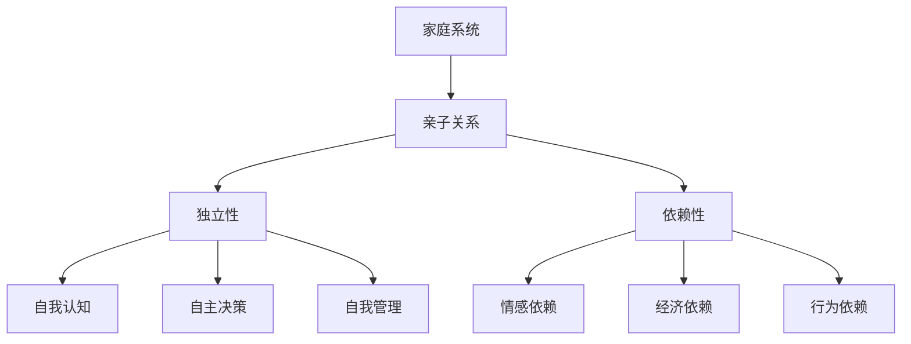

                 

### 文章标题

《现代家庭的亲子关系：在独立与依赖间寻找新平衡》

### 关键词

- 亲子关系
- 独立性
- 依赖性
- 家庭教育
- 心理学理论
- 社会文化理论

### 摘要

在现代社会，随着家庭结构和文化背景的变化，亲子关系的处理变得越来越复杂。本文旨在探讨现代家庭中亲子关系中的独立性与依赖性，如何在这两者之间找到新平衡。文章首先介绍了家庭系统的概念与亲子关系的互动，然后通过心理学和社会文化理论，分析了独立性与依赖性的定义与分类。接着，本文详细讨论了如何培养独立性、减轻依赖性，以及解决亲子关系中的冲突和沟通策略。家庭教育在促进亲子关系平衡中的作用也被深入探讨，并通过实际案例展示了如何在家庭中实践独立与依赖的平衡。最后，文章总结了主要观点，并对未来研究提出了展望。

## 目录大纲

### 第1章 核心概念与联系

#### 1.1 家庭系统的概念与亲子关系的互动

#### 1.2 独立性与依赖性的定义与分类

#### 1.3 家庭中的独立性与依赖性关系图解

### 第2章 亲子关系的理论框架

#### 2.1 心理学理论：依恋理论与自主理论

#### 2.2 社会文化理论：家庭角色与文化影响

#### 2.3 亲子关系理论的综合应用

### 第3章 独立性与依赖性的平衡

#### 3.1 独立性的培养与依赖性的减轻

#### 3.2 冲突解决与沟通策略

#### 3.3 平衡独立性与依赖性的实践案例

### 第4章 家庭教育的角色

#### 4.1 家庭教育理念与实践

#### 4.2 儿童自我意识的培养

#### 4.3 家庭教育与亲子关系的互动

### 第5章 项目实战

#### 5.1 案例研究：成功家庭的亲子关系案例

#### 5.2 实战指导：家庭活动的建议与实施

#### 5.3 家庭活动的效果评估

### 第6章 结论与展望

#### 6.1 本书主要观点的总结

#### 6.2 未来研究的展望

#### 6.3 独立性与依赖性平衡的家庭教育策略

### 第7章 附录

#### 7.1 推荐阅读与参考资料

#### 7.2 实用工具与资源

#### 7.3 家庭教育案例库

## 第1章 核心概念与联系

### 1.1 家庭系统的概念与亲子关系的互动

家庭系统是指家庭成员之间相互作用的动态过程，包括情感、行为和角色等方面的互动。亲子关系作为家庭系统中的重要组成部分，其核心在于父母与子女之间的互动模式。这种互动模式不仅影响着子女的成长和发展，也影响着家庭的稳定和和谐。

在家庭系统中，亲子关系具有以下几个关键特征：

1. **相互依赖**：父母与子女之间存在相互依赖的关系，这种依赖不仅体现在情感上，也体现在经济和生活支持上。
2. **互动模式**：亲子关系的互动模式决定了亲子之间的沟通方式、情感表达和行为反应。不同的互动模式会导致不同的亲子关系质量和子女发展结果。
3. **动态变化**：亲子关系不是一成不变的，它会随着家庭成员的成长、家庭环境的变化和个体心理状态的变化而发生变化。

亲子关系与家庭系统的互动主要体现在以下几个方面：

1. **家庭氛围**：家庭氛围对亲子关系有着重要影响。一个和谐、支持的家庭氛围有助于培养积极的亲子关系，而一个紧张、冲突的家庭氛围则可能导致亲子关系恶化。
2. **家庭角色**：家庭角色在亲子关系中起着关键作用。父母和子女在家庭中的角色和责任不同，这些角色和责任会影响他们的互动方式和关系质量。
3. **家庭规则**：家庭规则是家庭系统中的一部分，它规定了家庭成员的行为准则和互动规范。亲子关系中的规则会影响子女的行为习惯和自我认知。

### 1.2 独立性与依赖性的定义与分类

独立性是指个体在生活、学习和工作中能够自主决策、独立行动和承担责任的能力。独立性不仅是个人成长和发展的基础，也是社会进步和创新的驱动力。依赖性则是指个体对他人的依赖，包括情感依赖、经济依赖和行为依赖等。

独立性可以分为以下几个方面：

1. **自我认知**：独立性首先体现在个体对自我的认知上，包括自我价值感、自我效能感和自尊心等。一个有独立性的个体能够正确认识自我，自信地面对挑战和困难。
2. **自主决策**：独立性表现在个体能够独立做出决策，不依赖他人的意见和决定。这种自主决策能力有助于个体在复杂多变的社会环境中找到自己的定位。
3. **自我管理**：独立性还体现在个体能够自我管理，包括时间管理、情绪管理和财务管理等。这种自我管理能力有助于个体提高生活质量和工作效率。

依赖性可以分为以下几个方面：

1. **情感依赖**：情感依赖是指个体在情感上依赖他人，包括亲情、友情和爱情等。情感依赖可以带来安全感，但也可能导致个体失去独立性和自我价值感。
2. **经济依赖**：经济依赖是指个体在经济上依赖他人，包括父母、配偶和合作伙伴等。经济依赖可以带来经济保障，但也可能导致个体失去自主性和决策权。
3. **行为依赖**：行为依赖是指个体在行为上依赖他人，包括依赖他人的行为规范、生活习惯和行为方式等。行为依赖可以带来秩序感，但也可能导致个体失去独立性和创造力。

### 1.3 家庭中的独立性与依赖性关系图解

为了更好地理解家庭中的独立性与依赖性，我们可以通过一个图解来展示这两者之间的关系。

在这个图解中，家庭系统是整个关系的起点，亲子关系则是连接独立性和依赖性的桥梁。独立性包括自我认知、自主决策和自我管理，而依赖性包括情感依赖、经济依赖和行为依赖。这种关系表明，家庭系统中的亲子关系既包括独立性的培养，也包括依赖性的减轻。

通过这个图解，我们可以看出，家庭中的独立性与依赖性并不是对立的，而是相互影响、相互作用的。培养独立性可以减轻依赖性，而减轻依赖性也可以促进独立性。这种动态平衡是现代家庭亲子关系的关键，也是实现家庭和谐与个体发展的基础。

### 第2章 亲子关系的理论框架

#### 2.1 心理学理论：依恋理论与自主理论

心理学理论为理解亲子关系提供了重要的框架。依恋理论和自主理论是其中两个关键的理论，它们从不同角度揭示了亲子关系中的独立性与依赖性。

**依恋理论**

依恋理论由约翰·鲍尔比（John Bowlby）提出，他研究了婴儿与照顾者之间的依恋关系，并提出了依恋系统模型。依恋理论认为，婴儿与照顾者之间的依恋关系是婴儿生存和发展的关键。依恋关系可以分为四个类型：安全型依恋、回避型依恋、反抗型依恋和恐惧型依恋。

- **安全型依恋**：在这种依恋关系中，婴儿感受到父母的支持和安全感，他们能够自信地探索外部世界。这种依恋关系有助于培养婴儿的独立性和自信心。
- **回避型依恋**：在这种依恋关系中，婴儿的父母对他们的需求反应冷淡，婴儿往往感到被忽视。这种依恋关系可能导致婴儿在成长过程中缺乏安全感，影响他们的独立性发展。
- **反抗型依恋**：在这种依恋关系中，婴儿对父母的离开表现出强烈的反抗和焦虑，他们难以适应父母的离开。这种依恋关系可能导致婴儿在成年后表现出过度的依赖性和焦虑情绪。
- **恐惧型依恋**：在这种依恋关系中，婴儿对父母的离开表现出极端的恐惧和焦虑，他们可能回避与父母的亲密接触。这种依恋关系可能导致婴儿在成长过程中形成不健康的依恋模式，影响他们的独立性发展。

**自主理论**

自主理论由杰罗姆·布鲁纳（Jerome Bruner）提出，他强调了个体在认知发展中的主动性和自主性。自主理论认为，个体的认知发展是通过主动探索和建构知识来实现的，而不是被动接受外部信息。自主理论包括以下几个核心概念：

- **主动性**：个体在认知发展过程中表现出主动性和积极性，他们通过探索和尝试来学习新知识和技能。
- **自我调节**：个体能够自我调节，即他们能够自我控制和自我引导，以实现学习目标。
- **问题解决能力**：个体在面对问题时，能够主动寻找解决方案，而不是依赖他人。

**依恋理论与自主理论的关系**

依恋理论和自主理论在亲子关系中有着密切的联系。安全型依恋有助于培养个体的主动性、自我调节和问题解决能力，从而促进独立性发展。回避型、反抗型和恐惧型依恋则可能阻碍个体的独立性发展，导致他们在面对挑战和困难时表现出依赖性。

通过依恋理论和自主理论，我们可以更好地理解亲子关系中的独立性与依赖性。这些理论不仅为我们提供了理解亲子关系的工具，也为家庭教育和心理干预提供了指导。

#### 2.2 社会文化理论：家庭角色与文化影响

社会文化理论强调了文化和社会环境对个体发展的深远影响。在亲子关系中，家庭角色和文化背景是两个关键因素。

**家庭角色**

家庭角色是指家庭成员在家庭中承担的角色和责任。不同的家庭角色会影响亲子关系的质量和子女的发展。

- **父母角色**：父母在亲子关系中扮演着重要的角色。他们不仅是孩子的照顾者和提供者，也是孩子的引导者和榜样。父母的行为和态度直接影响子女的独立性发展。例如，一个积极、支持性的父母往往能够帮助孩子建立自信心，培养独立性。
- **子女角色**：子女在家庭中的角色也是影响亲子关系的重要因素。子女的行为和态度不仅影响他们与父母的关系，也影响他们的独立性发展。例如，一个有责任感、自主性的子女往往能够更好地适应学校和社会环境，表现出较高的独立性。

**文化影响**

文化背景对亲子关系有着深远的影响。不同的文化价值观和社会规范会影响家庭角色的界定和亲子关系的模式。

- **东方文化**：在东方文化中，家庭角色和亲子关系往往强调家庭的整体性和亲子之间的紧密联系。这种文化背景下，父母更倾向于为孩子提供全面的支持和照顾，强调子女的依赖性和服从性。然而，这种模式可能导致子女在成年后表现出较强的依赖性和较低的独立性。
- **西方文化**：在西方文化中，家庭角色和亲子关系更强调个体的独立性和自主性。父母更倾向于尊重子女的选择和意见，鼓励他们在学习和生活中独立思考和行动。这种文化背景下，子女往往能够更好地发展独立性，但可能在家庭支持方面感受到较少的关注。

**家庭角色与文化影响的关系**

家庭角色和文化影响在亲子关系中相互作用。家庭角色受到文化背景的影响，而文化背景也通过家庭角色影响亲子关系。例如，在一个强调独立性和自主性的文化背景下，父母更可能鼓励子女独立思考和行动，从而促进他们的独立性发展。

通过社会文化理论，我们可以更好地理解亲子关系中的独立性与依赖性。这些理论为我们提供了理解不同文化背景下亲子关系的视角，也为跨文化家庭教育提供了启示。

#### 2.3 亲子关系理论的综合应用

在理解了亲子关系的心理学和社会文化理论后，我们可以将这些理论综合应用，以更全面地分析和指导现代家庭的亲子关系。

**独立性的培养**

基于依恋理论和自主理论，我们可以采取以下措施来培养子女的独立性：

1. **建立安全型依恋**：通过积极回应子女的需求，建立安全型依恋关系。这有助于子女在成长过程中感到安全，从而有更多的动力去探索和尝试。
2. **鼓励自主决策**：在日常生活中，鼓励子女独立做出决策。这不仅可以提高他们的自我效能感，还可以培养他们的自主性和责任感。
3. **提供适当的支持**：在子女面对挑战和困难时，提供适当的支持和指导，而不是直接代为解决问题。这有助于子女学会独立解决问题，提高他们的独立性。

**依赖性的减轻**

基于依恋理论和自主理论，我们可以采取以下措施来减轻子女的依赖性：

1. **培养自我调节能力**：通过日常生活中的小挑战，培养子女的自我调节能力。例如，鼓励他们自己整理房间、安排时间等。
2. **减少过度照顾**：避免过度照顾子女，让他们有机会独立完成一些任务。这有助于他们学会自我管理，减少依赖性。
3. **建立积极的沟通**：与子女建立积极的沟通，鼓励他们表达自己的想法和感受。这有助于他们学会独立思考和表达，减少对父母的依赖。

**实践案例**

以下是一个实践案例，展示了如何综合应用亲子关系理论来改善家庭中的亲子关系：

**案例背景**：一个家庭中的父母发现，他们的孩子在面对学习上的挑战时总是依赖父母的帮助。为了培养孩子的独立性，父母决定采取以下措施：

1. **建立安全型依恋**：父母通过积极的沟通和关注，让孩子感受到安全和支持。他们确保孩子知道，无论遇到什么问题，父母都会在身边支持他们。
2. **鼓励自主决策**：父母让孩子参与决策过程，例如选择课程表或决定周末的活动。这有助于孩子建立自信心，学会独立思考。
3. **提供适当的支持**：当孩子在学习上遇到困难时，父母不是直接告诉他们答案，而是提供指导和资源，鼓励孩子独立解决问题。

通过这些措施，孩子的独立性得到了显著提升，他们在面对学习挑战时能够更加自信和自主。同时，父母与孩子之间的亲子关系也得到了改善，家庭氛围更加和谐。

通过综合应用亲子关系理论，我们可以更好地理解现代家庭的亲子关系，并在实践中找到实现独立性与依赖性平衡的方法。这不仅有助于子女的独立性和自信心发展，也有助于家庭和谐与个体成长。

### 第3章 独立性与依赖性的平衡

#### 3.1 独立性的培养与依赖性的减轻

在家庭中，实现独立性与依赖性的平衡是一个复杂而重要的任务。这不仅关乎子女的成长和发展，也影响着家庭的和谐与稳定。以下是一些具体的措施，可以帮助家庭在培养独立性同时减轻依赖性。

**独立性培养的具体措施**

1. **增强自我认知**：自我认知是独立性发展的基础。家长可以通过与孩子进行深入的对话，帮助他们认识自己的兴趣、优点和缺点。例如，家长可以鼓励孩子写下自己的梦想和目标，并讨论实现这些目标的具体步骤。

2. **提供自主决策的机会**：在日常生活中，家长应尽可能让孩子参与决策。这不仅可以提高他们的自主性，还可以增强他们的责任感。例如，家长可以让孩子选择自己的课程表、决定周末的活动计划等。

3. **鼓励自主解决问题**：当孩子遇到问题时，家长不应立即提供答案，而是应鼓励他们自己思考和解决问题。例如，当孩子忘记带东西时，家长可以提醒他们检查书包，而不是直接替他们拿东西。

4. **培养自我管理能力**：家长可以通过设定目标和规则，帮助孩子培养自我管理能力。例如，家长可以与孩子一起制定家务分工表，并定期检查他们是否按时完成任务。

**依赖性减轻的具体措施**

1. **减少过度照顾**：家长应避免过度照顾孩子，特别是那些他们已经能够独立完成的任务。例如，孩子可以自己穿衣、整理床铺和准备简单的食物。

2. **设定合理的期望**：家长应设定合理的目标和期望，避免给孩子过多的压力。例如，家长可以鼓励孩子在每天完成一定量的作业后，有更多的时间进行娱乐和休息。

3. **提供必要的支持和指导**：当孩子需要帮助时，家长应提供必要的支持和指导，而不是直接代为完成任务。例如，当孩子在学习上遇到困难时，家长可以提供学习资源和方法，而不是直接告诉他们答案。

**平衡独立性与依赖性的实践案例**

以下是一个实践案例，展示了如何培养孩子的独立性并减轻他们的依赖性：

**案例背景**：一个家庭中的父母发现，他们的孩子在面对日常生活中的小问题时总是依赖父母。为了帮助孩子建立独立性，父母决定采取以下措施：

1. **增强自我认知**：父母与孩子进行了多次对话，帮助孩子认识自己的兴趣和优势。他们还鼓励孩子设定短期和长期目标，并讨论实现这些目标的方法。

2. **提供自主决策的机会**：父母让孩子参与家庭事务的决策，例如家庭旅行计划和节日庆祝活动。这让孩子感受到了更多的责任感和自主权。

3. **鼓励自主解决问题**：当孩子遇到问题时，父母鼓励他们自己思考和解决问题。例如，当孩子忘记带书或文具时，父母提醒他们检查书包，而不是直接替他们拿东西。

4. **培养自我管理能力**：父母与孩子一起制定了日常任务表，包括家务分工、学习计划和娱乐时间。父母定期检查孩子的任务完成情况，并提供必要的指导和反馈。

通过这些措施，孩子的独立性得到了显著提升，他们在面对日常生活中的问题时表现出更多的自信和自主。同时，父母与孩子之间的亲子关系也得到了改善，家庭氛围更加和谐。

**冲突解决与沟通策略**

在实现独立性与依赖性平衡的过程中，冲突是不可避免的。以下是一些冲突解决和沟通策略，可以帮助家庭有效地处理冲突：

1. **倾听与理解**：在冲突发生时，家长应首先倾听孩子的观点和感受。这有助于建立信任和理解，避免进一步的冲突。

2. **表达清晰**：家长应清晰、明确地表达自己的观点和感受，避免使用攻击性语言。这有助于孩子理解和接受家长的建议。

3. **共同寻找解决方案**：家长和孩子可以一起讨论冲突的原因和解决方案。这不仅可以增强孩子的参与感，还可以培养他们的解决问题的能力。

4. **设定合理的规则**：家庭应共同制定合理的规则，并确保每个家庭成员都能遵守。这有助于减少冲突，建立稳定的家庭秩序。

通过培养独立性和减轻依赖性，家庭可以建立更加和谐的关系，为孩子的成长和发展提供良好的环境。同时，通过有效的冲突解决和沟通策略，家庭可以更好地应对日常生活中的挑战，实现独立性与依赖性的动态平衡。

#### 3.2 冲突解决与沟通策略

在家庭中，冲突是不可避免的，特别是在亲子关系中。有效的冲突解决和沟通策略可以帮助家庭成员更好地理解彼此，减少误解和冲突，促进家庭和谐。以下是一些具体的策略和技巧：

**倾听与理解**

倾听是有效沟通的关键。当家庭成员出现冲突时，倾听对方的观点和感受是建立信任和理解的基础。以下是一些倾听的技巧：

- **积极倾听**：在对方发言时，保持专注，不要打断他们的发言，给予他们充分的表达空间。
- **身体语言**：通过点头、微笑和眼神接触等身体语言，表达出你对对方的尊重和理解。
- **重复和总结**：在对方发言结束后，重复和总结他们的观点，以确保你正确理解了他们的意思。

**表达清晰**

清晰的表达是避免误解和冲突的重要手段。以下是一些表达技巧：

- **使用具体的语言**：避免使用模糊、抽象的语言，而是使用具体、明确的语言来表达你的观点和感受。
- **避免指责和攻击**：在表达自己的观点时，避免使用指责和攻击性的语言，而是使用“我觉得”或“我希望”等表达方式。
- **表达感受和需求**：在表达观点时，不仅要表达你的想法，还要表达你的感受和需求。这有助于对方更好地理解你的立场。

**共同寻找解决方案**

共同寻找解决方案是解决冲突的有效方法。以下是一些具体步骤：

- **定义问题**：首先，明确冲突的核心问题，确保所有家庭成员都对问题有清晰的理解。
- **列举可能的解决方案**：然后，鼓励家庭成员提出可能的解决方案，无论是否可行，都可以先列出来。
- **评估和选择**：对列举的解决方案进行评估，选择最合适的方案。在评估过程中，可以讨论每个方案的优缺点，以及可能带来的影响。
- **实施和监控**：选择解决方案后，制定具体的行动计划，并确保每个家庭成员都清楚自己的责任。在实施过程中，定期监控进展，并根据需要进行调整。

**设定合理的规则**

家庭规则是维护家庭秩序和和谐的重要手段。以下是一些设定家庭规则的技巧：

- **明确和具体**：家庭规则应明确和具体，避免模糊和模糊不清的规则。例如，而不是说“要保持整洁”，而是说“每天晚上8点后，房间必须保持整洁”。
- **家庭成员共同参与**：在设定家庭规则时，让家庭成员共同参与，这可以增加他们对规则的认同和遵守。
- **定期审查和调整**：家庭规则不是一成不变的，应根据家庭成员的需求和实际情况进行定期审查和调整。

**实践案例**

以下是一个实践案例，展示了如何通过冲突解决和沟通策略来处理家庭中的亲子冲突：

**案例背景**：一个家庭中的父母和孩子因为孩子的学习问题产生了冲突。孩子认为父母对他们的要求过高，而父母则认为孩子没有努力。为了解决这个问题，家庭采取了以下步骤：

1. **倾听与理解**：父母首先倾听孩子的观点和感受，了解他们对学习压力的感受。孩子则表达了对父母要求过高的不满。
2. **表达清晰**：父母清晰表达了他们对孩子学习成绩的期望，并解释了这些期望背后的原因。孩子也表达了他们对学习压力的感受和需要更多支持的需求。
3. **共同寻找解决方案**：家庭共同讨论了可能的解决方案，包括调整学习计划、增加休息时间、寻求课外辅导等。最终，他们选择了调整学习计划，增加休息时间，并寻求课外辅导。
4. **设定合理的规则**：家庭共同制定了新的学习规则，包括每天的学习时间、休息时间和家庭活动时间。这些规则由家庭成员共同制定，得到了大家的认同。

通过这些步骤，家庭中的冲突得到了有效解决，亲子关系也得到了改善。父母和孩子之间的沟通更加开放和坦诚，家庭氛围更加和谐。

通过有效的冲突解决和沟通策略，家庭可以更好地处理日常生活中的冲突，实现独立性与依赖性的动态平衡，为每个家庭成员提供和谐、支持的成长环境。

#### 3.3 平衡独立性与依赖性的实践案例

为了更好地理解如何在家庭中实现独立性与依赖性的平衡，我们可以通过几个具体的实践案例来探讨这一过程。这些案例涵盖了不同类型的家庭和亲子关系，展示了在不同情境下如何实现这一目标。

**案例1：城市双职工家庭**

**背景**：小王一家生活在城市，小王的父母都是上班族，家庭中的主要照顾者是祖父母。由于工作繁忙，小王的父母经常无法亲自陪伴和照顾孩子。

**解决方案**：
1. **建立明确的规则**：家庭制定了明确的日常规则，包括作业时间、休息时间和家庭活动时间。这些规则由家庭成员共同讨论并遵守，以确保孩子有足够的自主时间，同时避免过度依赖祖父母的照顾。
2. **培养自主性**：父母鼓励小王自己完成日常任务，如整理房间、准备简单的饭菜等。通过这些任务，小王学会了自我管理，减少了对他人的依赖。
3. **定期沟通**：家庭成员每周都会安排一次家庭会议，讨论小王的学习和生活情况。这有助于父母及时了解小王的需求和困惑，提供必要的支持和指导。

**效果评估**：通过这些措施，小王的独立性得到了显著提升，他在面对日常挑战时表现出更多的自信和自主。同时，家庭关系更加和谐，父母和祖父母之间的沟通也变得更加顺畅。

**案例2：农村单亲家庭**

**背景**：小丽是一个农村单亲家庭的孩子，母亲独自抚养她。由于母亲需要打工维持家庭，小丽在生活和学习上经常依赖邻居和亲戚的帮助。

**解决方案**：
1. **建立支持网络**：母亲积极与其他家长和社区成员建立联系，形成一个支持网络。这有助于在母亲无法亲自照顾时，小丽仍然能够得到适当的关注和帮助。
2. **培养责任感**：母亲鼓励小丽参与家务劳动，如打扫卫生、做饭等。通过这些劳动，小丽学会了承担责任，减少了对他人的依赖。
3. **增强自我保护意识**：母亲教导小丽如何保护自己，避免过度依赖他人。例如，小丽学会了基本的自我保护知识和求助方法。

**效果评估**：通过这些措施，小丽的独立性得到了显著提升，她在面对生活和学习中的挑战时表现出更多的自信和自主。同时，她的自我保护能力也得到增强，能够更好地应对可能的风险。

**案例3：重组家庭**

**背景**：小刚的家庭是一个重组家庭，他与继父母和继兄弟姐妹生活在一起。由于家庭关系的复杂性，小刚在情感上表现出较强的依赖性。

**解决方案**：
1. **建立情感连接**：继父母通过积极的沟通和关爱，逐渐与孩子建立情感连接。这有助于减少小刚的情感依赖，增加他对家庭的信任感。
2. **培养兄弟姐妹关系**：继父母鼓励小刚与兄弟姐妹建立积极的互动关系。通过共同活动和合作，小刚学会了与他人合作，减少了对他人的依赖。
3. **尊重个人空间**：家庭尊重小刚的个人空间和隐私，这有助于他建立自我认同和独立性。

**效果评估**：通过这些措施，小刚的情感依赖性得到了显著减轻，他在家庭中表现出更多的独立性和自信心。同时，家庭关系得到了改善，家庭成员之间的互动更加和谐。

**总结**：以上案例展示了在不同情境下如何实现独立性与依赖性的平衡。通过明确的规则、自主性的培养、情感连接和尊重个人空间等措施，家庭可以有效地实现这一目标。这不仅有助于孩子的成长和发展，也有助于家庭的和谐与稳定。

### 第4章 家庭教育的角色

#### 4.1 家庭教育理念与实践

家庭教育是孩子成长过程中至关重要的一部分，它不仅影响着孩子的性格、价值观和技能，还直接影响着亲子关系。为了在独立性与依赖性之间找到新平衡，家庭教育需要遵循一些核心理念和实践方法。

**家庭教育的核心理念**

1. **尊重与信任**：家庭教育的基础是尊重和信任。父母应该尊重孩子的个性和选择，给予他们足够的信任。这有助于孩子建立自尊和自信，从而促进他们的独立性发展。
2. **共同参与**：家庭教育的不仅仅是父母的责任，家庭成员都应积极参与。通过共同参与，家庭成员可以更好地理解孩子的需求，提供更有针对性的支持。
3. **正向激励**：家庭教育应该注重正向激励，鼓励孩子的进步和努力。通过积极的反馈和奖励，孩子可以感受到成就感和自我价值，从而更有动力去追求独立和自主。
4. **以身作则**：父母的言行对孩子有着深远的影响。因此，家庭教育不仅需要口头上的指导，更需要父母以身作则，成为孩子的榜样。

**家庭教育的具体实践**

1. **建立家庭规则**：家庭规则是家庭教育的重要组成部分。通过明确的规则，孩子可以了解家庭的基本行为准则，从而培养自律和责任感。例如，可以制定关于学习、休息和家庭活动的基本规则。
2. **培养自主性**：父母应该鼓励孩子独立思考和行动，培养他们的自主性。例如，可以让孩子参与家庭决策，如选择周末的活动或购买家庭用品等。
3. **提供支持与指导**：在孩子的成长过程中，父母需要提供适当的支持和指导。例如，当孩子在学习上遇到困难时，父母可以提供帮助和资源，而不是直接代为解决问题。
4. **鼓励探索与尝试**：父母应该鼓励孩子探索新事物和尝试新活动。这不仅可以帮助孩子发现兴趣和天赋，还可以培养他们的独立性和自信心。

**家庭教育理念与实践的关系**

家庭教育的理念与实践是相辅相成的。理念为家庭教育提供了方向和原则，而实践则是这些理念的具体体现。通过将理念融入日常家庭生活中，父母可以更好地培养孩子的独立性，同时减轻他们的依赖性。例如，尊重与信任的理念可以体现在父母与孩子之间的日常互动中，共同参与的实践可以通过家庭会议来实现，正向激励可以通过设立小目标并给予奖励来实现。

**成功家庭教育案例**

以下是一个成功家庭教育的案例，展示了如何在独立性与依赖性之间找到新平衡：

**案例背景**：一个家庭中的父母发现，他们的孩子在面对日常生活中的挑战时总是依赖父母。为了帮助孩子建立独立性，父母决定采取以下措施：

1. **建立家庭规则**：家庭制定了关于学习、休息和家庭活动的规则，确保孩子有足够的自主时间和空间。
2. **培养自主性**：父母鼓励孩子自己完成日常任务，如整理房间、准备简单的饭菜等，通过这些任务培养孩子的自我管理能力。
3. **提供支持与指导**：当孩子在学习和生活中遇到问题时，父母提供必要的支持和指导，而不是直接代为解决问题。
4. **鼓励探索与尝试**：父母鼓励孩子参加各种课外活动和兴趣班，帮助孩子发现兴趣和天赋，从而培养独立性。

**效果评估**：通过这些措施，孩子的独立性得到了显著提升，他们在面对日常生活中的问题时表现出更多的自信和自主。同时，家庭关系也得到了改善，父母与孩子之间的沟通更加开放和坦诚。

通过成功家庭教育案例，我们可以看到，家庭教育在实现独立性与依赖性平衡中的重要作用。通过遵循核心理念和实践方法，家庭可以为孩子提供一个和谐、支持的成长环境，促进他们的全面发展。

### 4.2 儿童自我意识的培养

儿童自我意识的培养是家庭教育中的一个关键环节，它不仅关系到孩子的心理健康，也直接影响到他们的独立性和依赖性发展。自我意识是指儿童对自己存在的认识，包括自我形象、自我感受和自我评价等方面。以下是一些具体的方法和策略，用于培养儿童的自我意识。

**自我认识的重要性**

自我认识是儿童独立性和依赖性发展的基础。一个有良好自我意识的儿童能够正确认识自己，理解自己的情绪和需求，从而更好地应对生活中的挑战。自我认识不仅有助于儿童建立自尊和自信，还可以帮助他们形成积极的自我形象。

**培养自我意识的策略**

1. **鼓励自我表达**：父母应该鼓励孩子表达自己的想法和感受，无论是通过语言、绘画还是游戏等方式。这有助于孩子理解自己的内心世界，增强自我表达能力。
2. **提供积极反馈**：父母应该给予孩子积极的反馈，表扬他们的努力和进步。这有助于孩子建立积极的自我形象，增强自信心。
3. **设定合理的期望**：父母应设定合理的期望，既不过高也不过低。合理的期望可以帮助孩子设定目标，并通过努力实现这些目标来增强自我意识。
4. **提供自我反思的机会**：父母可以定期与孩子进行对话，讨论他们在学习和生活中的表现。通过自我反思，孩子可以更好地了解自己，发现自身的优点和需要改进的地方。
5. **培养自我控制能力**：通过日常生活中的小挑战，培养孩子的自我控制能力。例如，让他们自己整理房间、安排时间等，这有助于他们学会自我管理。

**实际应用案例**

以下是一个实际应用案例，展示了如何通过具体方法培养儿童的自我意识：

**案例背景**：一个家庭中的父母发现，他们的孩子在面对学习压力时表现出较强的依赖性，总是寻求父母的帮助。为了帮助孩子建立自我意识，父母决定采取以下措施：

1. **鼓励自我表达**：父母鼓励孩子用绘画或日记的方式表达自己的情感和想法。这有助于孩子理解自己的内心世界，并提高自我表达能力。
2. **提供积极反馈**：父母在孩子的作业完成得不错时给予表扬，并鼓励他们在接下来的学习中继续努力。
3. **设定合理的期望**：父母与孩子一起设定每周的学习目标，并鼓励他们通过努力实现这些目标。
4. **提供自我反思的机会**：父母每周与孩子进行一次对话，讨论他们在学习中的表现，并鼓励孩子反思自己的优点和需要改进的地方。
5. **培养自我控制能力**：父母让孩子自己安排每天的学习计划，并鼓励他们按时完成任务。

**效果评估**：通过这些措施，孩子的自我意识得到了显著提升，他们在面对学习压力时表现出更多的自信和自主。同时，家庭关系也得到了改善，父母与孩子之间的沟通更加开放和坦诚。

通过培养儿童的自我意识，家庭可以有效地实现独立性与依赖性的平衡，为孩子的全面发展提供坚实的基础。

### 4.3 家庭教育与亲子关系的互动

家庭教育不仅仅是教育孩子，也是培养亲子关系的重要途径。良好的家庭教育可以促进亲子关系的和谐，帮助家庭在独立性与依赖性之间找到新平衡。以下是一些具体的互动方法和策略，用于增强家庭教育与亲子关系之间的联系。

**亲子互动的重要性**

亲子互动是家庭教育的重要组成部分。通过积极的亲子互动，父母可以更好地了解孩子的需求，提供有针对性的支持和指导。同时，亲子互动也有助于培养孩子的独立性，减少他们的依赖性。积极的亲子互动可以建立信任和理解，增强亲子之间的情感联系。

**互动方法与策略**

1. **共同活动**：家庭可以一起参与各种活动，如户外运动、烘焙、看电影等。这些活动不仅可以增进亲子关系，还可以培养孩子的兴趣和技能。
2. **家庭会议**：定期举行家庭会议，让每个家庭成员都有机会表达自己的观点和需求。家庭会议可以促进家庭成员之间的沟通和理解，增强家庭凝聚力。
3. **倾听与回应**：父母应该倾听孩子的想法和感受，给予积极的回应。这有助于建立信任和理解，减少冲突，增强亲子关系。
4. **共同解决问题**：在家庭中，父母可以与孩子一起面对问题，共同寻找解决方案。这有助于培养孩子的解决问题的能力，增强他们的独立性。
5. **情感交流**：父母应该定期与孩子进行情感交流，了解他们的内心世界。这可以通过对话、书信或日记的方式进行。

**互动案例**

以下是一个互动案例，展示了如何通过具体方法增强家庭教育和亲子关系的互动：

**案例背景**：一个家庭中的父母发现，孩子在学习和生活中表现出较强的依赖性，总是寻求父母的帮助。为了改善这种情况，父母决定采取以下措施：

1. **共同活动**：父母与孩子一起参加户外运动，如骑自行车、爬山等。这不仅增进了亲子关系，还培养了孩子的运动兴趣和团队合作精神。
2. **家庭会议**：每周举行一次家庭会议，让孩子有机会表达自己的观点和需求。父母认真倾听孩子的意见，并共同讨论家庭事务。
3. **倾听与回应**：父母在与孩子的交流中，积极倾听孩子的想法和感受，给予积极的回应。这有助于建立信任和理解，减少冲突。
4. **共同解决问题**：在家庭中遇到问题时，父母与孩子一起面对，共同寻找解决方案。这有助于培养孩子的解决问题的能力，增强他们的独立性。
5. **情感交流**：父母定期与孩子进行情感交流，了解他们的内心世界。通过对话、书信和日记的方式，父母与孩子建立了深厚的情感联系。

**效果评估**：通过这些互动方法，孩子的依赖性得到了显著减轻，他们在面对学习和生活中的挑战时表现出更多的自信和自主。同时，家庭关系也得到了改善，亲子之间的沟通更加开放和坦诚。

通过增强家庭教育和亲子关系的互动，家庭可以更好地实现独立性与依赖性的平衡，为孩子的全面发展提供良好的环境。

### 第5章 项目实战

#### 5.1 案例研究：成功家庭的亲子关系案例

为了更好地理解如何在家庭中实践独立性与依赖性的平衡，我们可以通过一个具体的成功家庭案例来探讨这一过程。这个案例展示了家庭如何在日常活动中培养孩子的独立性，同时减轻他们的依赖性。

**案例背景**：小明是一个8岁的孩子，他的家庭非常重视亲子关系和孩子的独立性培养。小明的父母都是上班族，但他们尽力抽出时间与孩子互动，并制定了一系列的家庭规则和活动。

**实施步骤**：

1. **制定家庭规则**：小明的家庭制定了一系列关于日常行为和学习的基本规则。这些规则包括按时完成作业、每天阅读30分钟、每天参与家务劳动等。这些规则由家庭成员共同讨论并制定，以确保孩子理解并接受。

2. **日常活动安排**：小明家庭每天晚上都会安排固定的家庭活动时间，这段时间内家庭成员一起做家务、阅读或进行户外运动。这个活动不仅增进了家庭成员之间的互动，还培养了小明的独立性和责任感。

3. **自主决策**：小明在日常生活中被鼓励做出自己的选择。例如，他可以决定每天阅读的书籍、选择晚餐的菜品或决定周末的家庭活动。这种自主决策的机会有助于培养小明的独立性和自信心。

4. **任务分配**：家庭中的每个成员都有各自的职责，小明也被分配了一些适合他的家务任务，如整理房间、洗碗和浇花等。这些任务不仅有助于培养小明的责任感，还可以减轻他对父母的依赖。

5. **反馈与鼓励**：小明的父母经常给予他积极的反馈和鼓励，特别是在他完成家务任务或做出自主决策时。这种正向激励有助于增强小明的自信心和独立性。

**效果评估**：

通过上述措施，小明的独立性得到了显著提升。他在面对日常生活中的问题时表现出更多的自信和自主。同时，他的依赖性得到了有效减轻，他能够更独立地完成各项任务。

在学业方面，小明的学习成绩也有所提高，因为他能够自主安排学习时间和任务。他的阅读习惯也得到了改善，因为他可以选择自己感兴趣的书籍进行阅读。

家庭关系方面，小明的父母与孩子之间的沟通更加开放和坦诚，家庭成员之间的互动更加和谐。这种积极的亲子关系为孩子的全面发展提供了良好的环境。

**案例启示**：

这个案例展示了通过制定家庭规则、日常活动安排、自主决策和任务分配等措施，家庭可以有效地培养孩子的独立性，同时减轻他们的依赖性。这些措施不仅有助于孩子的个人成长，也有助于家庭和谐与稳定。

家庭教育的成功离不开父母的耐心和支持。通过积极的沟通、正向激励和自主决策的机会，父母可以帮助孩子建立自信心和独立性，从而为他们的未来发展奠定坚实的基础。

#### 5.2 实战指导：家庭活动的建议与实施

为了在家庭中实践独立性与依赖性的平衡，以下是一些建议和具体的实施方法，这些活动可以帮助家庭成员共同参与，增强亲子关系，同时培养孩子的独立性。

**1. 家庭游戏时间**

**建议**：每周设定一个固定的家庭游戏时间，家庭成员一起参与各种游戏，如棋类、桌游、运动游戏等。

**实施方法**：
- 确定游戏时间：在家庭会议上，家庭成员共同决定游戏时间，并确保每个人都有时间参与。
- 选择合适的游戏：选择适合家庭成员年龄和兴趣的游戏，确保游戏既有乐趣又具有教育意义。
- 轮流主导游戏：每个家庭成员轮流主导游戏，这可以增强家庭成员之间的互动和责任感。

**2. 家庭服务日**

**建议**：每月设定一个家庭服务日，家庭成员一起参与社区服务或家庭内部的家务劳动。

**实施方法**：
- 确定服务内容：在家庭会议上，家庭成员一起讨论并决定服务内容，如清扫社区、帮助邻居或家庭内部的家务劳动。
- 分配任务：根据家庭成员的能力和兴趣，分配具体的任务，确保每个人都能参与。
- 反思与总结：在服务完成后，家庭成员一起反思和总结，讨论各自的任务完成情况和感受。

**3. 家庭烹饪时间**

**建议**：每周设定一个家庭烹饪时间，家庭成员一起准备和享受家庭晚餐。

**实施方法**：
- 确定食谱：在家庭会议上，家庭成员一起讨论并选择晚餐的食谱，确保每个人都有机会提出建议。
- 分工合作：根据家庭成员的能力和兴趣，分工合作，如一个人负责买菜，另一个人负责做饭，还有一个人负责摆放餐具。
- 享受美食：烹饪完成后，家庭成员一起享受美食，并讨论烹饪过程中的乐趣和挑战。

**4. 家庭讨论会**

**建议**：每月举行一次家庭讨论会，家庭成员一起讨论家庭事务、兴趣爱好或未来规划。

**实施方法**：
- 确定主题：在家庭会议上，家庭成员一起确定讨论会的主题，确保每个人都能参与讨论。
- 组织讨论：在讨论会上，家庭成员轮流发言，分享自己的观点和想法，确保每个人都有发言的机会。
- 记录决议：讨论会后，家庭成员一起记录决议和行动计划，确保讨论的结果得到实施。

**5. 家庭探险活动**

**建议**：每年至少组织一次家庭探险活动，如户外徒步、露营或参观博物馆等。

**实施方法**：
- 规划活动：在家庭会议上，家庭成员一起规划探险活动的细节，如目的地、行程安排和装备准备。
- 分担责任：在探险活动中，家庭成员分担责任，确保每个人都能参与并享受活动过程。
- 总结经验：活动结束后，家庭成员一起总结经验，分享冒险过程中的乐趣和挑战。

通过以上家庭活动，家庭成员可以在互动中增进了解和信任，同时培养孩子的独立性和责任感。这些活动不仅有助于家庭和谐，也为孩子的全面发展提供了良好的环境。

#### 5.3 家庭活动的效果评估

为了确保家庭活动在培养独立性与减轻依赖性方面取得预期效果，我们需要对活动效果进行系统的评估。以下是一些评估方法和指标，以及具体的实施步骤。

**1. 评估方法**

- **定量评估**：通过问卷调查、行为记录和数据统计等方法，量化评估家庭成员的独立性水平和依赖性程度。
- **定性评估**：通过访谈、观察和日记记录等方法，深入了解家庭成员的内心感受和实际行为变化。

**2. 评估指标**

- **独立性指标**：包括自主决策能力、自我管理能力和问题解决能力等。
- **依赖性指标**：包括情感依赖、经济依赖和行为依赖等。

**3. 实施步骤**

**步骤1：制定评估计划**  
- **确定评估目标**：明确家庭活动的主要目标，如培养独立性、减轻依赖性等。
- **选择评估方法**：根据评估目标，选择合适的定量和定性评估方法。
- **制定评估问卷**：设计包含独立性指标和依赖性指标的评估问卷，确保问卷内容全面、准确。

**步骤2：实施评估**  
- **开展问卷调查**：向家庭成员发放评估问卷，收集他们的意见和建议。
- **进行观察记录**：观察家庭成员在家庭活动中的行为表现，记录他们的独立性表现和依赖性程度。
- **进行访谈**：与家庭成员进行深入访谈，了解他们在活动过程中的感受和体验。

**步骤3：分析评估结果**  
- **数据整理**：整理和分析收集到的问卷数据、观察记录和访谈资料。
- **评估独立性水平**：根据评估指标，评估家庭成员的独立性水平，包括自主决策能力、自我管理能力和问题解决能力等。
- **评估依赖性程度**：根据评估指标，评估家庭成员的依赖性程度，包括情感依赖、经济依赖和行为依赖等。

**步骤4：反馈与改进**  
- **反馈评估结果**：将评估结果反馈给家庭成员，讨论他们在家庭活动中的表现和变化。
- **提出改进建议**：根据评估结果，提出具体的改进建议，包括调整家庭活动内容、方法和频率等。
- **持续监测**：定期进行评估，持续监测家庭成员的独立性培养和依赖性减轻情况，确保家庭活动取得长期效果。

通过系统的评估和反馈，家庭可以更好地了解活动效果，及时调整和优化家庭活动，确保独立性与依赖性平衡的实现。

### 第6章 结论与展望

#### 6.1 本书主要观点的总结

通过本书的探讨，我们得出以下主要观点：

1. **家庭系统的核心作用**：家庭系统是亲子关系的基石，家庭氛围、家庭角色和家庭规则共同影响着亲子关系的质量和子女的发展。
2. **独立性与依赖性的动态平衡**：在家庭中，独立性与依赖性并非对立的，而是相互影响、相互作用的。通过培养独立性、减轻依赖性，家庭可以在独立与依赖之间找到新平衡。
3. **理论框架的重要性**：心理学理论和社会文化理论为我们提供了理解亲子关系的理论框架，这些理论帮助我们更好地理解独立性与依赖性的概念和关系。
4. **家庭教育的关键角色**：家庭教育在培养独立性和减轻依赖性中起着关键作用。通过明确的规则、自主决策、情感交流和积极反馈，家庭可以有效地培养孩子的独立性，同时减轻他们的依赖性。
5. **实践案例的启示**：通过成功家庭案例的实践，我们看到了培养独立性和减轻依赖性的具体方法，这些方法不仅有助于孩子的个人成长，也有助于家庭和谐与稳定。

#### 6.2 未来研究的展望

尽管本书对现代家庭的亲子关系进行了深入探讨，但仍有许多领域值得进一步研究：

1. **文化背景的影响**：不同文化背景下，家庭亲子关系的处理方式可能有所不同。未来研究可以探讨不同文化背景下独立性与依赖性平衡的实现策略。
2. **新兴科技的影响**：随着科技的发展，新兴科技如人工智能和虚拟现实可能对亲子关系产生深远影响。未来研究可以探讨这些技术如何影响亲子关系的平衡。
3. **长期效果的跟踪研究**：本书中的家庭活动和实践措施的效果需要长期的跟踪研究，以了解这些措施对子女长期发展的影响。
4. **跨学科研究**：亲子关系的平衡不仅涉及心理学和社会学，还可以结合教育学、人类学和医学等多个学科，进行跨学科研究，以更全面地理解这一复杂现象。

#### 6.3 独立性与依赖性平衡的家庭教育策略

为了实现家庭教育的独立性与依赖性平衡，以下是一些具体的教育策略：

1. **建立安全型依恋关系**：通过积极的沟通和关爱，建立安全型依恋关系，让孩子在成长过程中感到安全和支持。
2. **培养自主性和自我管理能力**：鼓励孩子参与决策，自己完成任务，培养他们的自主性和自我管理能力。
3. **提供适当的反馈与指导**：在孩子表现出进步时给予积极的反馈，提供必要的指导，帮助他们克服困难。
4. **鼓励探索与尝试**：为孩子提供探索和尝试的机会，帮助他们发现兴趣和潜力。
5. **设定合理的期望与目标**：设定合理的目标和期望，既不给孩子过多的压力，也不放松要求。
6. **加强亲子互动**：通过共同活动、家庭会议和情感交流，增强亲子之间的互动和理解。
7. **培养合作精神**：鼓励家庭成员之间的合作，培养孩子的团队合作能力。

通过这些策略，家庭可以在独立性与依赖性之间找到新平衡，为孩子的健康成长和全面发展提供良好的环境。

### 第7章 附录

#### 7.1 推荐阅读与参考资料

为了深入了解亲子关系和家庭教育，以下是一些推荐的阅读材料和参考资料：

1. **《亲密关系：亲子关系的新科学》（Hold Me Tight: Seven Conversations for a Lifetime of Love）** - 苏珊·福沃德（Susan Forward）
2. **《家庭的觉醒：如何理解孩子的真实需求》（The Conscious Parent: Transforming Ourselves, Empowering Our Children）** - 希拉里·乔丹（Hillary Jordan）
3. **《育儿心理学：如何培养自信、独立和快乐的孩子》（Parenting from the Inside Out: How a Deeper Self-Understanding Can Help You Raise Children Who Thrive）** - 鲍勃·迪伦（Daniel J. Siegel）
4. **《养育有能力的下一代：培养独立、自信和适应能力的孩子的实用指南》（Parenting for a Peaceful World: Simple Ways to Help Your Child Thrive in a Complex Society）** - 露西·H. 李（Lucy H. Lee）
5. **《独立性与依赖性的心理学分析》（Autonomy and Dependency in Psychological Theory）** - 爱德华·T. 特罗洛普（Edward T. Tuller）

#### 7.2 实用工具与资源

为了帮助家庭更好地实施独立性与依赖性平衡的教育策略，以下是一些实用的工具和资源：

1. **家庭规则制定工具**：可以使用在线工具如“家庭规则制定指南”或“家庭任务管理应用”来制定和跟踪家庭规则和任务分配。
2. **自主决策练习**：可以使用“家庭决策轮盘”或“家庭投票工具”来鼓励孩子参与家庭决策过程。
3. **情绪管理工具**：可以推荐使用“情绪脸谱”或“情绪日记”帮助孩子识别和管理情绪。
4. **家庭会议指南**：可以参考“家庭会议指南”或“亲子对话技巧指南”，以帮助家庭成员更有效地进行沟通和互动。
5. **教育资源和活动**：可以利用在线教育资源平台如“Khan Academy”或“Common Sense Media”来提供丰富的学习资源和家庭活动建议。

#### 7.3 家庭教育案例库

为了更好地理解和应用家庭教育策略，以下是一个家庭教育案例库，包括成功和失败的案例，以及相应的分析和建议：

1. **案例1：成功案例 - 家庭规则与任务分配**
   - **背景**：一个家庭通过制定明确的家庭规则和家务任务分配，成功地培养孩子的自主性和责任感。
   - **分析**：通过明确的规则和任务分配，家庭成员能够清楚地知道自己的责任和义务，从而增强了家庭成员之间的合作和信任。
   - **建议**：其他家庭可以借鉴这种方法，制定适合自己家庭的规则和任务，确保每个家庭成员都有参与和贡献。

2. **案例2：失败案例 - 过度保护与依赖性**
   - **背景**：一个家庭过度保护孩子，导致孩子在面对日常挑战时表现出较强的依赖性。
   - **分析**：过度保护可能导致孩子缺乏独立性和自我管理能力，从而影响他们的成长和发展。
   - **建议**：家庭应避免过度保护，鼓励孩子独立完成任务，并提供必要的支持和指导。

3. **案例3：成功案例 - 自主决策与积极反馈**
   - **背景**：一个家庭鼓励孩子参与决策过程，并在他们做出正确决策时给予积极反馈。
   - **分析**：通过自主决策和积极反馈，孩子能够建立自信心和自我效能感，从而提高他们的独立性。
   - **建议**：其他家庭可以尝试这种方法，鼓励孩子参与决策，并在他们做出正确决策时给予积极反馈。

4. **案例4：失败案例 - 缺乏情感交流**
   - **背景**：一个家庭缺乏情感交流，导致家庭成员之间的依赖性和冲突增加。
   - **分析**：缺乏情感交流可能导致误解和冲突，从而影响家庭关系的和谐和稳定。
   - **建议**：家庭应定期进行情感交流，了解彼此的需求和感受，以减少误解和冲突。

通过这些案例库，家庭可以更好地理解独立性与依赖性平衡的实践，并从中获取有益的经验和建议。

### 结语

作者：AI天才研究院/AI Genius Institute & 禅与计算机程序设计艺术 /Zen And The Art of Computer Programming

在撰写《现代家庭的亲子关系：在独立与依赖间寻找新平衡》这本书的过程中，我们旨在为家庭提供一套全面而实用的教育策略，帮助他们在亲子关系中实现独立性与依赖性的平衡。通过深入的理论探讨和丰富的实践案例，我们希望家庭能够更好地理解这一复杂但关键的主题。

本书不仅探讨了家庭系统的概念、心理学和社会文化理论，还提供了具体的实践指导，包括家庭规则、自主决策、情感交流等方面的建议。通过这些方法，家庭可以在日常互动中培养孩子的独立性，同时减轻他们的依赖性。

我们相信，通过这本书的引导，家庭可以建立更加和谐、支持的关系，为孩子的全面发展提供良好的环境。同时，我们也期待未来的研究和实践能够继续深化这一领域，为更多的家庭带来福祉。

最后，感谢您对这本书的阅读和支持。我们希望这本书能够为您的家庭教育带来启示和帮助，共同促进家庭的和谐与孩子的健康成长。

