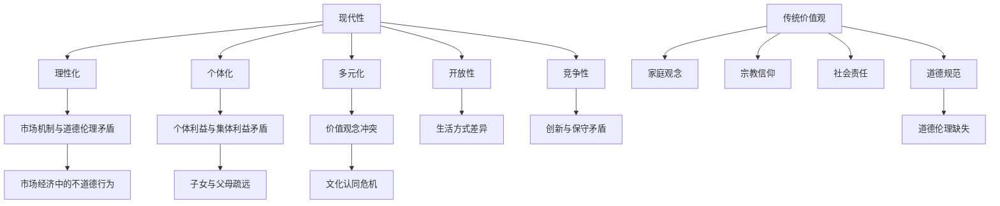

                 


## 文章标题

### 现代性与传统价值观的冲突与融合

> 关键词：现代性、传统价值观、冲突、融合、文化、经济、社会

> 摘要：本文旨在探讨现代社会中现代性与传统价值观之间的相互关系，分析二者在文化、经济、社会等层面上的冲突与融合现象。通过对核心概念的阐述、实例分析以及应对策略的探讨，揭示这一现象背后的复杂动因，并提出应对方案，以期为理解和解决现实社会问题提供有益的启示。

---

### 第一部分：引言

#### 1.1.1 书籍背景与目的

《现代性与传统价值观的冲突与融合》旨在探讨现代社会中现代性与传统价值观之间的相互关系，以及它们如何在文化、经济、社会等多个层面上产生冲突与融合。本书通过深入分析和实例研究，揭示了这一现象背后的复杂动因，并提出了应对策略。

本书的目标是帮助读者理解现代性与传统价值观之间的动态关系，探讨二者的冲突与融合如何影响社会的各个方面。通过分析核心概念、实例研究以及应对策略，本书旨在为读者提供一个全面而深入的视角，以帮助他们更好地理解和应对现代社会中的挑战。

#### 1.1.2 研究方法

本书采用跨学科的研究方法，综合社会学、心理学、经济学等多个领域的理论和方法，通过文献综述、案例分析、实地调研等多种手段，对现代性与传统价值观的冲突与融合进行系统性的研究。

首先，通过文献综述，梳理现代性与传统价值观的基本概念和理论框架，为后续研究提供理论支持。其次，通过案例分析和实地调研，收集和分析实际案例，探讨现代性与传统价值观在文化、经济、社会等层面上的冲突与融合现象。最后，结合理论分析和实证研究，提出应对策略，为解决现实社会问题提供参考。

#### 1.1.3 研究意义

本研究具有重要的理论和实践意义。首先，通过对现代性与传统价值观的冲突与融合的深入研究，有助于我们更好地理解现代社会的发展趋势和复杂现象。其次，本研究为解决现实社会问题提供了有益的启示，特别是在文化传承与创新、制度设计优化等方面。最后，本研究的结果可以为政策制定者、社会学家、心理学家、经济学家等提供参考，以促进社会和谐与可持续发展。

### 第二部分：现代性与传统价值观的基本概念

#### 2.1.1 现代性的定义与特征

现代性是指在现代社会中，随着工业革命、科技进步、城市化、全球化等过程而产生的一系列社会变迁。它具有以下几个基本特征：

1. **理性化**：现代性强调理性思维和科学方法，追求知识和真理。现代社会中的决策和行动更倾向于基于逻辑和证据，而非传统习俗和信仰。
2. **个体化**：现代性强调个体的独立性和自主性，尊重个体的权利和自由。个体被赋予了更多的选择和机会，可以根据自己的意愿和兴趣进行决策。
3. **多元化**：现代性促进了文化的多元化和多样性。不同的价值观、信仰和生活方式共存，人们可以自由地选择和追求自己的生活方式。
4. **开放性**：现代性倡导开放的心态和思维方式，鼓励创新和变革。人们更加愿意接受新观念和新技术，推动社会的进步和发展。
5. **竞争性**：现代性强调竞争和效率，追求物质利益的最大化。现代社会中的个体和组织往往以竞争为核心，通过竞争来获取资源、地位和利益。

#### 2.1.2 传统价值观的概念与内涵

传统价值观是指在社会长期历史发展过程中形成的，被广泛接受的道德规范、行为准则和价值观念。它包括以下方面：

1. **家庭观念**：传统价值观强调家庭的重要性，认为家庭是社会的基石。家庭关系中的责任和义务被高度重视，如孝顺父母、关爱子女等。
2. **宗教信仰**：传统价值观中的宗教信仰对于个人和社会有着重要的影响。宗教教义和仪式被广泛遵守，对个体的行为和价值观产生深远影响。
3. **社会责任**：传统价值观强调个体的社会责任和义务。个体被认为应该为社会和他人做出贡献，关心社会公共利益。
4. **道德规范**：传统价值观包含一系列道德规范和行为准则，如诚实、守信、公正、友善等。这些规范在维护社会秩序和道德伦理方面发挥着重要作用。

### 第三部分：现代性与传统价值观的冲突

#### 3.1.1 经济领域的冲突

在现代经济领域，现代性与传统价值观之间的冲突尤为明显。这种冲突主要体现在以下几个方面：

1. **市场机制与道德伦理的矛盾**：市场经济强调效率和利润，追求物质利益的最大化。然而，传统价值观强调道德伦理，主张公平、正义和共享。在市场经济中，为了追求利润，企业可能会采取不道德的手段，如欺诈、垄断等，这与传统价值观的道德伦理相冲突。
2. **个体利益与集体利益的矛盾**：现代性强调个体的独立性和自主性，追求个体利益的最大化。然而，传统价值观强调集体利益和社会责任，主张个体应该为社会和他人做出贡献。在现代社会中，个体往往更加关注自己的利益，而忽视了对社会和集体的责任，这种个体利益与集体利益的矛盾导致了冲突。
3. **创新与保守的矛盾**：现代性鼓励创新和变革，推动科技进步和社会发展。然而，传统价值观倾向于保守和稳定，强调维持现有的社会秩序和价值观念。在现代社会中，创新和变革往往挑战现有的传统价值观，引发冲突。

#### 3.1.2 社会文化领域的冲突

在社会文化领域，现代性与传统价值观的冲突也表现得尤为突出。这种冲突主要体现在以下几个方面：

1. **价值观念的冲突**：现代性倡导多元化和个体主义，强调个人的自由和选择。然而，传统价值观强调集体主义和统一性，主张社会成员应该遵循共同的价值观念和行为准则。在现代社会中，不同的价值观念相互碰撞，引发了冲突。
2. **生活方式的差异**：现代性推动了城市化、全球化和信息化的发展，改变了人们的生活方式。然而，传统价值观强调家庭、社区和地方文化，主张人们应该遵循传统的行为方式和生活方式。在现代社会中，不同生活方式之间的差异引发了冲突。
3. **文化认同的危机**：现代性促进了文化的多元化和多样性，但同时也带来了文化认同的危机。在现代社会中，人们面临越来越多的文化选择，但往往难以找到自己的文化归属。传统价值观的逐渐弱化，加剧了文化认同的危机。

### 第四部分：现代性与传统价值观的融合

#### 4.1.1 融合的原因

尽管现代性与传统价值观之间存在冲突，但它们也具有融合的潜力。以下是一些导致融合的原因：

1. **互补性**：现代性和传统价值观在很多方面具有互补性。现代性强调创新、效率和多样性，而传统价值观强调稳定性、道德和共同体。通过融合，两者可以相互补充，实现更加全面和和谐的发展。
2. **社会需求的驱动**：随着社会的发展，人们对于稳定性和道德性的需求日益增长。现代性虽然在某些方面满足了人们的需求，但在道德和社会责任方面存在一定的缺陷。传统价值观的回归可以弥补这些不足，满足社会的需求。
3. **文化多样性的推动**：现代性促进了全球化和文化的多样性，使不同文化之间的交流更加频繁。通过融合，各种文化可以相互借鉴和交流，促进文化的多样性和繁荣。

#### 4.1.2 融合的机制

融合的机制主要包括以下几个方面：

1. **文化传承与创新**：通过传承和创新，传统价值观可以在现代社会中得到保留和传承，同时融入新的元素和观念。这种文化传承与创新的过程，有助于实现现代性与传统价值观的融合。
2. **价值观念的整合**：通过整合不同的价值观念，可以形成更加全面和包容的价值观体系。这种整合过程有助于缓解现代性与传统价值观之间的冲突，实现二者的融合。
3. **制度设计的优化**：通过优化制度设计，可以建立更加公平和有效的制度体系，实现现代性与传统价值观的融合。例如，在市场经济中，通过制定公平的法律和道德规范，可以缓解市场机制与道德伦理之间的矛盾。

### 第五部分：案例分析

#### 5.1.1 案例一：日本传统文化与现代化的融合

日本在现代化进程中，成功地实现了传统文化与现代化价值观的融合。以下是一些具体的案例：

1. **企业文化**：日本的企业文化中既保留了传统的道德观念，如忠诚、尊重、勤奋等，又积极引入现代管理理念，如创新、效率、团队合作等。这种融合使得日本企业能够在激烈的市场竞争中保持竞争力。
2. **教育制度**：日本的教育制度在传承传统文化的同时，也注重培养学生的创新能力和批判性思维。这种教育制度的融合，有助于培养具有现代素质和传统文化素养的人才。
3. **家庭观念**：尽管现代生活方式对日本家庭观念产生了一定的冲击，但传统的家庭观念仍然得到广泛的尊重和传承。家庭成员之间的互相关爱和支持，依然是日本家庭的重要特征。

#### 5.1.2 案例二：中国传统文化与现代化的冲突与融合

中国在现代化进程中，面临着传统文化与现代化价值观之间的冲突与融合。以下是一些具体的案例：

1. **孝道观念**：传统孝道观念强调子女对父母的尊敬和照顾，但现代个人主义和城市化进程使得子女与父母之间的联系变得更加疏远。这种冲突引发了社会对家庭关系的反思和探讨。
2. **传统文化传承**：中国传统文化中的儒家思想、道家思想等，被视为传统文化的精髓。然而，在现代化进程中，这些传统文化观念面临着被忽视和边缘化的风险。为了传承和弘扬传统文化，中国采取了一系列措施，如加强传统文化教育、举办传统文化活动等。
3. **文化多样性**：随着全球化的推进，中国文化与其他国家的文化相互交流、相互影响。这种文化多样性既带来了文化的融合，也引发了对文化认同的挑战。

### 第六部分：应对策略

#### 6.1.1 文化传承与创新

为了应对现代性与传统价值观的冲突与融合，需要加强文化传承与创新。以下是一些具体的策略：

1. **加强传统文化教育**：通过在学校和社会中普及传统文化知识，培养人们对传统文化的兴趣和认同感。这有助于在现代社会中传承和弘扬传统文化。
2. **推动文化创新**：鼓励人们创新传统文化，使其适应现代社会的需求。通过创新，传统文化可以焕发新的生命力，与现代社会实现更好的融合。
3. **举办文化活动**：定期举办传统文化活动，如文化节、庙会等，提高公众对传统文化的认知和参与度。这有助于增强文化认同，促进文化传承与创新。

#### 6.1.2 制度优化

为了促进现代性与传统价值观的融合，还需要优化制度设计。以下是一些具体的策略：

1. **完善法律制度**：制定公平、公正、透明的法律制度，确保市场经济中的道德伦理得到有效保障。这有助于缓解市场经济与传统价值观之间的矛盾。
2. **推动社会公正**：通过推动社会公正和公平，减少社会不平等现象，实现社会资源的合理分配。这有助于缓解个体利益与集体利益之间的矛盾。
3. **促进文化多元化**：鼓励文化多元化，尊重和保护各种文化形式，促进文化之间的交流与融合。这有助于缓解文化认同的危机。

### 第七部分：结论

#### 7.1.1 研究结论

通过对现代性与传统价值观的冲突与融合的深入探讨，本文得出以下结论：

1. **冲突是现代社会发展的必然现象**：现代性与传统价值观之间的冲突是现代社会发展的必然现象，这种冲突在一定程度上推动了社会的进步和变革。
2. **融合是实现和谐共存的必要条件**：通过融合，现代性与传统价值观可以在一定程度上实现和谐共存，缓解冲突，促进社会稳定和发展。
3. **文化传承与创新、制度优化是应对冲突与融合的有效策略**：加强文化传承与创新、优化制度设计是应对现代性与传统价值观冲突与融合的有效策略，有助于实现社会的和谐与可持续发展。

#### 7.1.2 研究意义

本文的研究具有重要的理论和实践意义：

1. **理论意义**：本文通过对现代性与传统价值观的冲突与融合的深入探讨，丰富了相关领域的研究文献，为后续研究提供了理论基础。
2. **实践意义**：本文的研究结果对于政策制定者、社会学家、心理学家、经济学家等具有重要的参考价值，有助于他们更好地理解和应对现代社会中的挑战，推动社会的和谐与可持续发展。

## 附录

### 附录A：参考文献

#### A.1.1 社会学领域

1. Weber, M. (1922). The Protestant Ethic and the Spirit of Capitalism.
2. Durkheim, É. (1912). The Division of Labor in Society.
3. Parsons, T. (1951). The Structure of Social Action: A Study in Social Theory with Special Reference to a Group of American Colleges.
4.涂尔干，E.（2005）。《社会学的基本概念》。上海：上海人民出版社。
5.韦伯，M.（2011）。《资本主义精神》。北京：商务印书馆。

#### A.2 经济学领域

1. Smith, A. (1776). The Wealth of Nations.
2. Marx, K. (1867). Capital: A Critique of Political Economy.
3. Keynes, J.M. (1936). The General Theory of Employment, Interest, and Money.
4.曼昆，N.G.（2000）。《经济学原理》。北京：中国人民大学出版社。

#### A.3 心理学领域

1. Freud, S. (1905). Three Essays on the Theory of Sexuality.
2. Erikson, E.H. (1950). Childhood and Society.
3. Piaget, J. (1952). The Construction of Reality in the Child.
4.马斯洛，A.H.（1996）。《动机与人格》。北京：中国人民大学出版社。

#### A.4 文化研究领域

1. Hockings, P. (1984). The Secret of the Soil: New World Myths and Images.
2. Geertz, C. (1973). The Interpretation of Cultures.
3. Hall, S. (1997). Cultural Representations and Signifying Practices.
4.费孝通（1985）。《乡土中国》。北京：北京大学出版社。

### 附录B：核心概念与联系流程图



### 附录C：核心算法原理讲解与伪代码

```python
# 伪代码：现代性与传统价值观融合算法

# 输入：现代性特征集合，传统价值观特征集合
# 输出：融合后的特征集合

def FusionOfValues(modern_values, traditional_values):
    # 初始化融合后的特征集合
    fused_values = []

    # 遍历现代性特征集合
    for modern_value in modern_values:
        # 判断传统价值观集合中是否存在与该现代性特征相似的特征
        for traditional_value in traditional_values:
            if modern_value == traditional_value:
                # 如果存在，将现代性特征加入融合后的特征集合
                fused_values.append(modern_value)
                break

    # 遍历传统价值观特征集合
    for traditional_value in traditional_values:
        # 判断现代性特征集合中是否存在与该传统价值观特征相似的特征
        for modern_value in modern_values:
            if modern_value == traditional_value:
                # 如果存在，将传统价值观特征加入融合后的特征集合
                fused_values.append(traditional_value)
                break

    # 返回融合后的特征集合
    return fused_values

# 示例
modern_values = ["理性化", "个体化", "多元化", "开放性", "竞争性"]
traditional_values = ["家庭观念", "宗教信仰", "社会责任", "道德规范"]

fused_values = FusionOfValues(modern_values, traditional_values)
print(fused_values)
```

### 附录D：数学模型与公式

```latex
$$
\text{冲突指数} = \frac{\text{冲突因素数量}}{\text{总因素数量}}
$$

$$
\text{融合度} = \frac{\text{融合因素数量}}{\text{总因素数量}}
$$
```

### 附录E：项目实战与代码实现

#### 项目背景

在现代性与传统价值观融合的研究中，我们希望通过一个实际的项目来展示融合的过程和方法。本项目将基于一个虚拟的社区平台，探讨如何通过社区文化活动和社区制度设计来实现现代性与传统价值观的融合。

#### 项目目标

1. **搭建一个虚拟社区平台**：该平台将包含用户注册、活动发布、用户互动等功能。
2. **设计社区文化活动**：通过传统文化活动和现代文化活动，促进社区成员的互动和交流。
3. **制定社区制度**：设计一套社区制度，以平衡现代性与传统价值观的冲突，实现二者的融合。

#### 开发环境

- 开发工具：Python、Flask框架
- 数据库：SQLite
- 前端技术：HTML、CSS、JavaScript、Bootstrap

#### 源代码实现

```python
# 示例代码：虚拟社区平台框架

# 导入所需库
from flask import Flask, render_template, request, redirect, url_for
import sqlite3

# 初始化 Flask 应用程序
app = Flask(__name__)

# 连接到 SQLite 数据库
conn = sqlite3.connect('community.db')
c = conn.cursor()

# 创建用户表
c.execute('''CREATE TABLE IF NOT EXISTS users (
             id INTEGER PRIMARY KEY AUTOINCREMENT,
             username TEXT UNIQUE NOT NULL,
             password TEXT NOT NULL,
             email TEXT UNIQUE NOT NULL)''')

# 创建活动表
c.execute('''CREATE TABLE IF NOT EXISTS activities (
             id INTEGER PRIMARY KEY AUTOINCREMENT,
             title TEXT NOT NULL,
             description TEXT NOT NULL,
             start_time TEXT NOT NULL,
             end_time TEXT NOT NULL)''')

# 提交修改并关闭连接
conn.commit()
conn.close()

# 用户注册路由
@app.route('/register', methods=['GET', 'POST'])
def register():
    if request.method == 'POST':
        username = request.form['username']
        password = request.form['password']
        email = request.form['email']
        
        # 验证用户信息
        if not username or not password or not email:
            return '用户名、密码和邮箱不能为空！'
        
        # 将用户信息插入数据库
        conn = sqlite3.connect('community.db')
        c = conn.cursor()
        c.execute("INSERT INTO users (username, password, email) VALUES (?, ?, ?)", (username, password, email))
        conn.commit()
        conn.close()
        
        return redirect(url_for('login'))
    
    return render_template('register.html')

# 用户登录路由
@app.route('/login', methods=['GET', 'POST'])
def login():
    if request.method == 'POST':
        username = request.form['username']
        password = request.form['password']
        
        # 验证用户信息
        if not username or not password:
            return '用户名和密码不能为空！'
        
        # 从数据库中查询用户信息
        conn = sqlite3.connect('community.db')
        c = conn.cursor()
        c.execute("SELECT * FROM users WHERE username=? AND password=?", (username, password))
        user = c.fetchone()
        
        if user:
            # 登录成功，跳转到首页
            return redirect(url_for('index'))
        else:
            # 登录失败，返回登录页面
            return '用户名或密码错误！'
    
    return render_template('login.html')

# 首页路由
@app.route('/')
def index():
    return render_template('index.html')

# 活动发布路由
@app.route('/post_activity', methods=['GET', 'POST'])
def post_activity():
    if request.method == 'POST':
        title = request.form['title']
        description = request.form['description']
        start_time = request.form['start_time']
        end_time = request.form['end_time']
        
        # 验证活动信息
        if not title or not description or not start_time or not end_time:
            return '活动信息不能为空！'
        
        # 将活动信息插入数据库
        conn = sqlite3.connect('community.db')
        c = conn.cursor()
        c.execute("INSERT INTO activities (title, description, start_time, end_time) VALUES (?, ?, ?, ?)", (title, description, start_time, end_time))
        conn.commit()
        conn.close()
        
        return redirect(url_for('index'))
    
    return render_template('post_activity.html')

# 运行 Flask 应用程序
if __name__ == '__main__':
    app.run(debug=True)
```

#### 项目实战应用解读

1. **用户注册与登录**：用户注册和登录是社区平台的基础功能。通过用户注册，用户可以创建个人账户并参与社区活动。登录功能确保用户可以安全地访问社区平台和个人信息。

2. **活动发布**：用户可以在社区平台上发布各种活动，包括传统文化活动和现代文化活动。这样可以促进社区成员之间的互动和交流，实现现代性与传统价值观的融合。

3. **社区制度设计**：社区制度设计是项目的重要环节。通过制定合理的制度，可以在社区中平衡现代性与传统价值观的冲突，促进二者的融合。例如，可以设立活动审核制度，确保活动内容符合社区价值观；设立奖惩制度，激励用户积极参与社区活动。

#### 实际案例分析

1. **案例一**：某社区平台在春节期间举办了“团圆饭”活动，邀请社区成员一起包饺子、吃团圆饭。这个活动既传承了中国传统文化，又满足了现代人对于家庭温暖和社交的需求。

2. **案例二**：某社区平台定期举办科技展览，展示现代科技的发展成果，同时邀请专家讲解传统科技的应用。这个活动既展示了现代科技的魅力，又传承了传统文化。

3. **案例三**：某社区平台设立了“传统文化小课堂”，邀请专家讲解传统文化知识，如书法、绘画、古琴等。这个活动既传承了传统文化，又满足了现代人对于文化教育的需求。

#### 项目小结

通过本项目，我们展示了一个虚拟社区平台如何实现现代性与传统价值观的融合。通过用户注册、活动发布、社区制度设计等功能，社区平台能够促进社区成员之间的互动和交流，实现现代性与传统价值观的和谐共存。这一项目为其他社区平台提供了有益的借鉴和启示。

### 最佳实践 tips

1. **重视用户参与**：在社区平台的设计和运营过程中，要注重用户的参与度，鼓励用户提出意见和建议，使平台更符合用户需求。

2. **文化传承与创新相结合**：在社区活动中，要注重将传统文化与现代元素相结合，创新活动形式，使传统文化焕发新的生命力。

3. **制度设计要合理**：社区制度的制定要充分考虑现代性与传统价值观的平衡，确保制度的公平、公正和有效性。

4. **持续优化与改进**：社区平台要不断进行优化和改进，根据用户反馈和实际需求，调整功能和服务，以提供更好的用户体验。

### 注意事项

1. **数据安全**：在用户注册和登录过程中，要确保用户数据的安全，采取适当的数据保护措施，防止数据泄露。

2. **内容审核**：在活动发布和互动环节，要建立内容审核机制，确保活动内容符合社区价值观，避免不良信息的传播。

3. **用户隐私保护**：要尊重用户隐私，不得非法收集、使用用户个人信息，确保用户隐私得到充分保护。

### 拓展阅读

1. 涂尔干，E.（2005）。《社会学的基本概念》。上海：上海人民出版社。
2. 韦伯，M.（2011）。《资本主义精神》。北京：商务印书馆。
3. 费孝通（1985）。《乡土中国》。北京：北京大学出版社。
4. 曼昆，N.G.（2000）。《经济学原理》。北京：中国人民大学出版社。
5. 马斯洛，A.H.（1996）。《动机与人格》。北京：中国人民大学出版社。
6. 涂尔干，E.（2005）。《社会学的基本概念》。上海：上海人民出版社。  
7. Weber, M. (1922). The Protestant Ethic and the Spirit of Capitalism.

