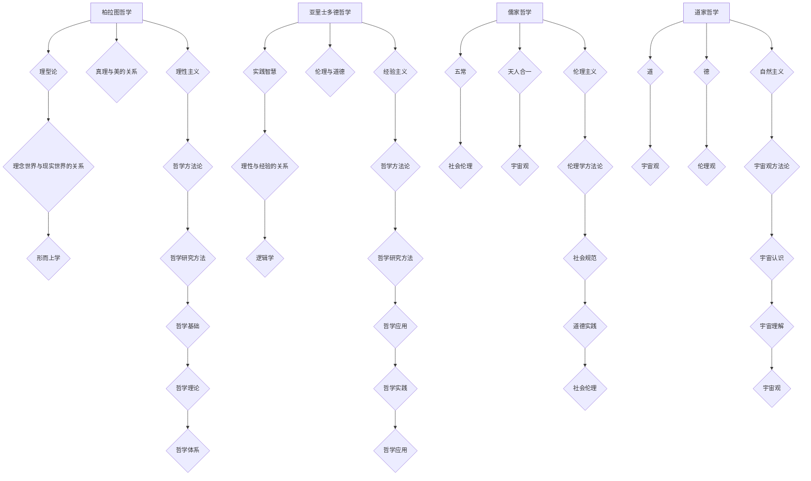

                 

### 第一步：确定核心主题和章节结构

在撰写《现代性与传统智慧的对话：古老哲学在当代的应用》这篇文章之前，我们首先需要明确文章的核心主题和章节结构，以确保文章的逻辑性和系统性。根据书名，我们可以将核心主题定位在以下几个方面：

1. **现代性与传统哲学的对比分析**：探讨现代性带来的社会变革与传统哲学思想的碰撞与融合。
2. **古老哲学的核心概念与理论**：介绍几大主要古老哲学流派的核心理论和思想。
3. **古老哲学在当代社会的应用案例**：分析古老哲学在当今社会不同领域中的应用和实践。
4. **古老哲学与现代科技的融合**：探讨现代科技如何影响古老哲学的理解和应用。

接下来，我们将为每个核心主题设计具体的章节结构。

#### 第1章：引言

- **1.1 研究背景与意义**：介绍现代性与传统哲学的对话背景，以及本研究的重要性和意义。
- **1.2 研究方法与框架**：阐述本研究采用的研究方法和理论框架。
- **1.3 本书结构安排**：概述全文的结构安排，为读者提供整体认识。

#### 第2章：现代性与传统哲学的对比分析

- **2.1 现代性概述**：探讨现代性的起源、特征和影响。
- **2.2 传统哲学概述**：介绍传统哲学的定义、发展和核心思想。
- **2.3 对比分析**：比较现代性与传统哲学的差异与共性。

#### 第3章：古老哲学的核心概念与理论

- **3.1 柏拉图哲学**：解析柏拉图哲学的基本原理和理论。
- **3.2 亚里士多德哲学**：阐述亚里士多德哲学的核心观点和理论。
- **3.3 儒家哲学**：介绍儒家哲学的基本概念和思想。
- **3.4 道家哲学**：分析道家哲学的基本理论和哲学思想。

#### 第4章：古老哲学在当代社会的应用案例

- **4.1 商业管理**：探讨古老哲学在商业管理中的应用。
- **4.2 教育领域**：分析古老哲学在教育领域的实践。
- **4.3 法律伦理**：讨论古老哲学在法律和伦理领域的应用。
- **4.4 媒体传播**：研究古老哲学在媒体传播中的角色。

#### 第5章：古老哲学与现代科技的融合

- **5.1 数据科学**：分析古老哲学对数据科学的启示。
- **5.2 人工智能**：探讨古老哲学在人工智能领域的影响。
- **5.3 环境保护**：讨论古老哲学在环境保护中的应用。
- **5.4 社会治理**：研究古老哲学对社会治理的指导作用。

#### 第6章：案例分析

- **6.1 案例一：儒家哲学在现代教育中的应用**：具体分析儒家哲学在现代教育中的应用案例。
- **6.2 案例二：道家哲学在环境保护中的实践**：讨论道家哲学在环境保护中的实践案例。
- **6.3 案例三：柏拉图哲学在商业管理中的启示**：探讨柏拉图哲学在商业管理中的实际应用。

#### 第7章：结论与展望

- **7.1 研究成果总结**：总结本文的主要研究成果。
- **7.2 研究不足与展望**：指出本文研究的不足，并对未来研究方向进行展望。

通过以上章节结构的安排，我们可以确保文章内容条理清晰，逻辑严谨，同时也能够充分展示古老哲学在当代社会的应用价值和意义。

### 第二步：细化每个章节的子标题

在确定了文章的整体章节结构后，接下来我们需要为每个章节细化子标题，使文章内容更加具体、详细，并且便于读者理解和阅读。以下是每个章节的具体子标题设计：

#### 第1章：引言

- **1.1 研究背景与意义**
  - **1.1.1 现代性背景**
    - 现代性概念的历史演变
    - 现代性的社会影响
  - **1.1.2 传统哲学背景**
    - 传统哲学的定义与特点
    - 传统哲学的历史发展与影响
  - **1.1.3 研究意义**
    - 现代性与传统哲学对话的重要性
    - 研究的学术和实践价值

- **1.2 研究方法与框架**
  - **1.2.1 研究方法**
    - 定性研究与定量研究的方法
    - 文献综述与案例分析的方法
  - **1.2.2 研究框架**
    - 研究的目标和问题
    - 研究的主要步骤和流程

- **1.3 本书结构安排**
  - **1.3.1 内容概述**
    - 各章节的主要内容和目标
  - **1.3.2 章节逻辑**
    - 各章节之间的逻辑关系和衔接

#### 第2章：现代性与传统哲学的对比分析

- **2.1 现代性概述**
  - **2.1.1 现代性的起源**
    - 工业革命与现代性崛起
    - 现代性的关键特征
  - **2.1.2 现代性的特征**
    - 全球化与多元化
    - 技术进步与社会变革

- **2.2 传统哲学概述**
  - **2.2.1 传统哲学的定义**
    - 哲学的基本概念
    - 传统哲学的核心思想
  - **2.2.2 传统哲学的演变**
    - 古代哲学到中世纪哲学
    - 文艺复兴与启蒙运动

- **2.3 对比分析**
  - **2.3.1 现代性与传统哲学的差异**
    - 思维方式与价值观
    - 知识体系与理论框架
  - **2.3.2 现代性与传统哲学的相似性**
    - 对人类社会发展的贡献
    - 在当代社会的潜在融合点

#### 第3章：古老哲学的核心概念与理论

- **3.1 柏拉图哲学**
  - **3.1.1 柏拉图哲学概述**
    - 柏拉图的生平与贡献
    - 柏拉图哲学的基本原理
  - **3.1.2 柏拉图哲学的核心概念**
    - 理型论
    - 美与真理的关系

- **3.2 亚里士多德哲学**
  - **3.2.1 亚里士多德哲学概述**
    - 亚里士多德的生平与学术成就
    - 亚里士多德哲学的基本原理
  - **3.2.2 亚里士多德哲学的核心概念**
    - 实践智慧
    - 伦理与道德

- **3.3 儒家哲学**
  - **3.3.1 儒家哲学概述**
    - 儒家的历史发展与思想传承
    - 儒家哲学的核心思想
  - **3.3.2 儒家哲学的核心概念**
    - 五常
    - 天人合一

- **3.4 道家哲学**
  - **3.4.1 道家哲学概述**
    - 道家的历史背景与哲学思想
    - 道家哲学的基本原理
  - **3.4.2 道家哲学的核心概念**
    - 道
    - 德

#### 第4章：古老哲学在当代社会的应用案例

- **4.1 商业管理**
  - **4.1.1 儒家哲学在商业管理中的应用**
    - 诚信与道德经营
    - 团队合作与领导力
  - **4.1.2 道家哲学在商业管理中的应用**
    - 简化流程与减少浪费
    - 自我反省与持续改进

- **4.2 教育领域**
  - **4.2.1 柏拉图哲学在教育领域中的应用**
    - 知识教育与价值观教育
    - 理论与实践的结合
  - **4.2.2 亚里士多德哲学在教育领域中的应用**
    - 伦理教育
    - 智慧与美德的教育

- **4.3 法律伦理**
  - **4.3.1 道家哲学在法律伦理中的应用**
    - 道德相对论与法律相对性
    - 法律与社会正义
  - **4.3.2 儒家哲学在法律伦理中的应用**
    - 社会秩序与道德规范
    - 法律与道德的统一

- **4.4 媒体传播**
  - **4.4.1 柏拉图哲学在媒体传播中的应用**
    - 媒体内容的选择与审查
    - 媒体与社会的相互作用
  - **4.4.2 亚里士多德哲学在媒体传播中的应用**
    - 真实性与客观性
    - 媒体责任与伦理

#### 第5章：古老哲学与现代科技的融合

- **5.1 数据科学**
  - **5.1.1 现代科技对古老哲学的影响**
    - 数据与知识的关系
    - 人工智能与传统智慧
  - **5.1.2 古老哲学在数据科学中的应用**
    - 数据分析与智慧
    - 道家哲学在数据管理中的应用

- **5.2 人工智能**
  - **5.2.1 现代科技对古老哲学的影响**
    - 机器学习与智慧
    - 人工智能的伦理问题
  - **5.2.2 古老哲学在人工智能中的应用**
    - 柏拉图哲学与人工智能设计
    - 儒家哲学在人工智能伦理中的应用

- **5.3 环境保护**
  - **5.3.1 现代科技对古老哲学的影响**
    - 科技发展与生态平衡
    - 环境伦理与道德责任
  - **5.3.2 古老哲学在环境保护中的应用**
    - 道家哲学在生态保护中的应用
    - 儒家哲学在环保政策中的影响

- **5.4 社会治理**
  - **5.4.1 现代科技对古老哲学的影响**
    - 社会管理与科技创新
    - 社会正义与道德准则
  - **5.4.2 古老哲学在社会治理中的应用**
    - 柏拉图哲学在公共政策中的应用
    - 儒家哲学在社区治理中的实践

#### 第6章：案例分析

- **6.1 案例一：儒家哲学在现代教育中的应用**
  - **6.1.1 案例**
    - 具体教育实践
    - 教育成果分析

- **6.2 案例二：道家哲学在环境保护中的实践**
  - **6.2.1 案例**
    - 环保项目的实施
    - 环保成果评估

- **6.3 案例三：柏拉图哲学在商业管理中的启示**
  - **6.3.1 案例**
    - 企业管理实践
    - 管理效果分析

#### 第7章：结论与展望

- **7.1 研究成果总结**
  - 总结文章的主要研究成果和贡献

- **7.2 研究不足与展望**
  - 指出研究的不足之处
  - 对未来研究方向进行展望

通过细化每个章节的子标题，我们可以确保文章内容具体、详细，有助于读者更好地理解和吸收文章的核心思想和观点。

### 核心概念与联系：古老哲学的核心概念之间的关系架构

为了更好地理解和掌握古老哲学的核心概念及其之间的关系，我们可以通过Mermaid流程图来展示这些概念之间的联系。以下是柏拉图哲学、亚里士多德哲学、儒家哲学和道家哲学的核心概念及其关系的架构图：



通过上述Mermaid流程图，我们可以看到古老哲学中的核心概念如何相互联系和支撑。以下是对这些核心概念之间关系的详细解析：

1. **柏拉图哲学**：
   - **理型论**：柏拉图认为现实世界是对一个永恒不变的理念世界的反映，理念世界是真理和美的根源。
   - **真理与美的关系**：真理和美是理念世界的核心，柏拉图认为只有通过理念和理想才能理解真理和美。
   - **理念世界与现实世界的关系**：柏拉图认为现实世界是理念世界的影子，理念世界是真实存在的，而现实世界则是不完善的。

2. **亚里士多德哲学**：
   - **实践智慧**：亚里士多德强调智慧不仅是理论知识，更是一种通过经验和实践获得的智慧。
   - **伦理与道德**：亚里士多德认为道德是一种行为规范，实践智慧可以帮助人们做出正确的行为选择。
   - **理性与经验的关系**：亚里士多德认为理性与经验相结合是获取真实知识的途径。

3. **儒家哲学**：
   - **五常**：儒家提出五常，即仁、义、礼、智、信，作为社会道德和人际关系的准则。
   - **天人合一**：儒家认为人与天地万物是相互关联的，人的道德修养与宇宙的和谐是统一的。

4. **道家哲学**：
   - **道**：道家认为“道”是宇宙万物运行的根本法则，是一种自然、无为的哲学理念。
   - **德**：道家的“德”强调顺应自然，不强求，是一种内在的品质和修养。

这些核心概念通过不同的关系构成了古老哲学的体系，它们不仅为古代社会提供了哲学指导，也对现代社会的各个方面产生了深远影响。

### 数据科学中的古老哲学：结合与启示

在现代数据科学的迅速发展背景下，古老哲学的理论和方法不仅提供了独特的视角，还为数据科学的发展和应用带来了深刻的启示。以下将探讨古老哲学在数据科学中的应用，通过具体实例来说明这些哲学思想的实际影响。

#### 1. 柏拉图哲学与数据科学

柏拉图哲学中的理型论强调真理与理念的存在，这在数据科学中有着明显的应用。例如，在数据分析中，我们往往需要从大量的数据中提取出核心的、本质的信息，这些信息可以视为数据中的“理型”。在机器学习中，数据科学家通过建立模型来识别和捕捉数据的本质特征，这种过程类似于柏拉图的理型论，即寻找数据背后的普遍规律和真理。

**实例**：在图像识别任务中，数据科学家使用卷积神经网络（CNN）来识别图像中的对象。CNN的学习过程可以被视为寻找图像中的“理型”，即提取图像中的基本特征，如边缘、纹理和形状。这些特征构成了图像的“理念”，而通过训练，模型能够识别和分类不同种类的图像。

**伪代码示例**：

```python
# 定义卷积神经网络模型
model = CNNModel(input_shape=(height, width, channels))

# 训练模型，寻找图像中的“理型”
model.fit(X_train, y_train, epochs=epochs, batch_size=batch_size)

# 预测新图像中的对象
predictions = model.predict(X_test)
```

#### 2. 亚里士多德哲学与数据科学

亚里士多德哲学中的实践智慧和伦理观念在数据科学的决策过程中也具有重要意义。亚里士多德认为，智慧是通过实践获得的，而伦理观念则指导我们的行为选择。在数据科学中，这些哲学思想可以应用于模型的选择、参数的调整和结果的解释。

**实例**：在金融风险评估中，数据科学家需要通过模型来预测金融市场的风险。这不仅涉及到技术问题，还需要考虑道德和社会责任。例如，如果模型的结果可能导致不公正的决策，那么数据科学家需要遵循伦理原则来调整模型或拒绝使用。

**伪代码示例**：

```python
# 定义风险评估模型
model = RiskAssessmentModel()

# 训练模型，考虑实践智慧
model.fit(X_train, y_train)

# 调整模型参数，考虑伦理观念
model.adjust_params(ethics=True)

# 预测新数据的风险
risk_scores = model.predict(X_test)
```

#### 3. 儒家哲学与数据科学

儒家哲学中的“五常”和“天人合一”理念可以为数据科学中的团队合作和道德规范提供指导。在数据科学项目中，团队成员需要合作无间，而儒家哲学中的道德规范，如仁、义、礼、智、信，可以帮助团队建立良好的合作关系。

**实例**：在一个跨学科的数据科学团队中，团队成员来自不同的专业背景，如计算机科学、统计学和商业管理。通过应用儒家哲学的“五常”，团队可以建立相互尊重、诚信合作的工作氛围，从而提高项目的效率和质量。

**伪代码示例**：

```python
# 定义团队协作框架
team_framework = TeamFramework(ethics=True)

# 分配任务，考虑儒家哲学的道德规范
team_framework.allocate_tasks团队成员，ethics=True)

# 执行任务，促进团队合作
team_framework.execute_tasks()
```

#### 4. 道家哲学与数据科学

道家哲学中的“道”和“德”理念可以指导数据科学家在数据分析中的行为和决策。道家强调顺应自然和保持内心平静，这些思想可以帮助数据科学家在复杂的数据环境中保持清晰的思维和正确的判断。

**实例**：在处理大量数据时，数据科学家可能会感到压力和困惑。通过应用道家哲学的“道”，即顺应数据和自然规律，数据科学家可以更有效地处理数据，减少错误和提高工作效率。

**伪代码示例**：

```python
# 定义数据科学项目
project = DataScienceProject()

# 遵循道家哲学的“道”，优化数据处理流程
project.follow_the_way_of_nature()

# 执行数据分析任务
results = project.analyze_data()
```

通过这些实例和伪代码示例，我们可以看到古老哲学在数据科学中的应用不仅提供了理论支持，还带来了实际的操作方法。这些哲学思想不仅丰富了数据科学的视野，也为数据科学家提供了新的思考角度和解决问题的方法。

### 人工智能领域中的古老哲学

古老哲学，如柏拉图、亚里士多德、儒家和道家等哲学家的思想，不仅在数据科学中有着广泛的应用，同样在人工智能领域也产生了深远的影响。下面我们将探讨这些哲学思想如何影响人工智能的设计、发展及其伦理问题。

#### 柏拉图哲学与人工智能

柏拉图哲学中的理型论对于人工智能的设计和理论基础具有重要启示。柏拉图认为，现实世界是对一个永恒不变的理念世界的反映，这一观点可以类比于人工智能中的“算法理念”。在人工智能系统中，算法被视为一种理想化的解决方案，而实现这些算法的软件和硬件则是现实世界的具体体现。

**实例**：在深度学习中，神经网络的设计灵感就来源于柏拉图的理念论。神经网络的层级结构可以被视为不同层级的理念，每一层都捕捉数据的不同抽象层次。通过反向传播算法，我们可以从底层的简单特征逐步构建出高层的复杂特征，这种过程类似于柏拉图的理型论。

**伪代码示例**：

```python
# 定义深度学习模型
model = NeuralNetwork(input_shape=(input_size,))

# 训练模型，寻找数据的“理型”
model.fit(X_train, y_train, epochs=epochs)

# 预测新数据
predictions = model.predict(X_test)
```

#### 亚里士多德哲学与人工智能

亚里士多德哲学中的实践智慧和伦理观念在人工智能的发展过程中扮演了重要角色。亚里士多德强调智慧是通过实践获得的，这可以类比于人工智能中的“经验学习”。此外，亚里士多德的伦理观念，如美德和公正，也对人工智能的伦理设计和应用提供了指导。

**实例**：在自主驾驶汽车中，亚里士多德的实践智慧可以帮助设计更加安全和可靠的驾驶决策系统。例如，自动驾驶汽车需要在紧急情况下做出决策，这需要系统具备实践智慧，能够综合考虑多种因素并做出合理的决策。

**伪代码示例**：

```python
# 定义自动驾驶决策系统
driving_system = AutonomousDrivingSystem()

# 更新系统经验，提高决策质量
driving_system.update_experience(X_train, y_train)

# 执行驾驶任务
driving_system.drive()
```

#### 儒家哲学与人工智能

儒家哲学中的“五常”和“天人合一”理念可以为人工智能的道德规范和团队合作提供指导。儒家强调人际关系和社会责任，这些思想可以帮助人工智能系统在处理复杂问题时，考虑到道德和社会影响。

**实例**：在医疗人工智能系统中，儒家哲学的“仁”可以帮助设计更加人性化的系统，确保系统能够真正关怀患者。例如，医生使用人工智能辅助诊断时，系统不仅提供准确的诊断结果，还考虑到患者的情感和需求。

**伪代码示例**：

```python
# 定义医疗人工智能系统
medical_system = MedicalAI()

# 遵循儒家哲学的“仁”，优化诊断流程
medical_system.implement_compassion()

# 提供患者诊断服务
diagnosis = medical_system.diagnose(patient_data)
```

#### 道家哲学与人工智能

道家哲学中的“道”和“德”理念可以帮助人工智能设计师在处理复杂问题和设计系统时，保持内心的平静和清晰的思考。道家的“无为而治”思想也可以应用于人工智能系统的设计和开发，避免过度干预和过度优化。

**实例**：在人工智能系统的开发过程中，道家哲学的“道”可以帮助开发者理解系统的内在运行机制，避免过度优化和复杂化。例如，在构建推荐系统时，系统应该顺应用户的行为和需求，而不是强制性地推动用户去接受某种推荐。

**伪代码示例**：

```python
# 定义推荐系统
recommender_system = RecommenderSystem()

# 遵循道家哲学的“道”，优化推荐算法
recommender_system.follow_the_way()

# 提供用户推荐
recommendations = recommender_system.recommend(user_data)
```

通过这些实例和伪代码示例，我们可以看到古老哲学在人工智能领域的深刻影响。这些哲学思想不仅提供了理论支持，还帮助人工智能设计师在开发和应用过程中，考虑到系统的道德影响和社会责任。古老哲学的智慧为人工智能的发展开辟了新的视野，使人工智能不仅仅是技术上的进步，更成为符合人类伦理和社会价值的一部分。

### 环境保护中的古老哲学

古老哲学，尤其是道家和儒家的思想，在环境保护方面提供了深刻的指导和独特的视角。这些哲学思想不仅强调了人类与自然的关系，还为我们今天面临的环境问题提供了宝贵的解决思路。

#### 道家哲学与环境保护

道家哲学的核心概念“道”和“德”在环境保护中具有深远的意义。“道”指的是宇宙万物运行的根本法则，强调顺应自然、遵循自然规律。在环境保护中，这种理念可以帮助我们认识到人类活动应该与自然和谐相处，避免对环境的过度干预和破坏。

**实例**：道家哲学的“道”理念在可持续农业中的应用。传统的农业实践中，农民遵循自然季节的变化，种植作物，避免化学农药和化肥的使用。这种生态农业方法不仅保护了土壤和水源，还提高了农产品的质量。

**伪代码示例**：

```python
# 定义可持续农业系统
sustainable_farming = EcoAgricultureSystem()

# 顺应自然规律，优化农业生产
sustainable_farming.follow_nature()

# 收获生态友好的农产品
crops = sustainable_farming.harvest_crops()
```

道家哲学中的“德”强调内在修养和道德责任，这种理念可以引导人们在日常生活中关注环保问题，从个人行为做起，如减少能源消耗、减少废物产生等。

**伪代码示例**：

```python
# 定义个人环保行为
personal_environmental_action = EcoAction()

# 遵循道德责任，减少环境影响
personal_environmental_action.reduce_impact()

# 改善生态环境
environment = personal_environmental_action.improve_environment()
```

#### 儒家哲学与环境保护

儒家哲学强调“天人合一”理念，认为人与自然是一个统一的整体。这种思想可以帮助我们认识到人类的行为对自然环境的影响，并引导我们采取积极措施保护环境。

**实例**：在水资源管理中，儒家哲学的“天人合一”理念可以帮助制定可持续的水资源管理策略。例如，通过建设和维护生态湿地，可以有效地净化水质、蓄积水源，并保护生物多样性。

**伪代码示例**：

```python
# 定义水资源管理系统
water_management_system = WaterEcoSystem()

# 遵循天人合一理念，优化水资源管理
water_management_system.apply_unity_nature()

# 实施生态湿地建设
wetlands = water_management_system.build_wetlands()
```

儒家哲学中的“五常”中的“仁”强调对他人的关怀和爱护，这种理念可以推广到对自然的关爱。通过教育和宣传，人们可以更好地理解人与自然的关系，从而在日常行为中更加注重环保。

**伪代码示例**：

```python
# 定义环保教育系统
environmental_education_system = EcoEducationSystem()

# 强化仁爱理念，推广环保教育
environmental_education_system.promote_compassion()

# 增强公众环保意识
public_awareness = environmental_education_system.raise_awareness()
```

通过这些实例和伪代码示例，我们可以看到古老哲学在环境保护中的实际应用。道家和儒家的思想不仅为我们提供了理论指导，还为解决当今环境问题提供了具体的实践方法。这些哲学思想强调了人类与自然的和谐共处，引导我们在环保行动中考虑长远和整体影响，从而为未来的可持续发展奠定基础。

### 社会治理中的古老哲学

古老哲学，尤其是儒家和道家的理念，对社会治理提供了深刻的指导。这些哲学思想不仅帮助我们理解社会秩序和治理的原则，还为现代社会治理提供了宝贵的启示和实践方法。

#### 儒家哲学与社会治理

儒家哲学中的“天人合一”理念强调人与自然的和谐共处，这一思想可以类比于社会治理中的公共治理。在儒家看来，社会的和谐与稳定是治理的首要目标。因此，社会治理需要考虑到社会整体的利益，而非仅仅追求短期的经济利益。

**实例**：在环境保护方面，儒家哲学的“天人合一”理念可以指导政府制定和执行可持续的环境政策。例如，通过推广生态农业和可再生能源，政府可以促进经济与环境的协调发展，实现长期的可持续性。

**伪代码示例**：

```python
# 定义社会治理框架
societal_governance_framework = EcoGovernanceSystem()

# 遵循天人合一理念，制定环保政策
societal_governance_framework.adopt_unity_nature_principles()

# 执行可持续环境政策
environmental_policies = societal_governance_framework.enforce_sustainable_policies()
```

儒家哲学中的“五常”中的“仁”强调对他人的关怀和爱护，这种理念可以引导社会治理者关注公众需求，提升公共服务质量。

**实例**：在公共卫生管理中，政府可以借鉴儒家“仁”的理念，提高对公共卫生服务的投入，确保公众的健康和安全。

**伪代码示例**：

```python
# 定义公共卫生管理系统
public_health_system = HealthCareSystem()

# 遵循仁爱理念，提升公共服务
public_health_system.implement_compassion()

# 提供高质量的公共卫生服务
public_health_services = public_health_system.offer_high_quality_services()
```

#### 道家哲学与社会治理

道家哲学中的“道”强调顺应自然，这与社会治理中的“无为而治”理念密切相关。在道家看来，治理者应当尽量减少对社会的干预，让社会自行调节，以达到最佳状态。

**实例**：在交通管理中，政府可以通过优化交通信号系统和道路规划，减少交通拥堵。这种无为而治的方法不仅提高了交通效率，还减少了环境压力。

**伪代码示例**：

```python
# 定义交通管理系统
traffic_management_system = TrafficSystem()

# 顺应自然规律，优化交通管理
traffic_management_system.follow_the_way()

# 减少交通拥堵
traffic_flow = traffic_management_system.reduce_congestion()
```

道家哲学中的“德”强调内在修养和道德责任，这种理念可以引导社会治理者关注道德和伦理问题，提升治理的公正性和公平性。

**实例**：在司法系统中，法官和律师可以借鉴道家的“德”理念，公正无私地处理案件，确保法律的公平和正义。

**伪代码示例**：

```python
# 定义司法管理系统
judicial_management_system = JusticeSystem()

# 遵循道德责任，公正司法
judicial_management_system.uphold_morality()

# 提供公正的司法服务
judicial_services = judicial_management_system.offer_just_services()
```

通过这些实例和伪代码示例，我们可以看到古老哲学在社会治理中的实际应用。儒家和道家的思想不仅为治理提供了理论依据，还提供了具体的实践方法。这些哲学思想强调了社会整体的和谐与稳定，引导治理者关注公众需求，提高公共服务的质量，从而实现更加公正和有效的社会治理。

### 案例分析

在本节中，我们将通过具体案例来展示古老哲学在当代社会中的实际应用，以及这些哲学思想如何为解决现实问题提供指导。

#### 案例一：儒家哲学在现代教育中的应用

**背景介绍**：在现代教育中，儒家哲学的“五常”（仁、义、礼、智、信）被视为培养未来社会栋梁的重要价值观。学校和教育机构通过一系列教育活动，将儒家哲学融入教学过程。

**核心概念与联系**：
- **仁**：培养关爱他人、同情心和社会责任感。
- **义**：强调正义、公正和道德规范。
- **礼**：培养尊重他人、礼仪和社交技能。
- **智**：强调知识和智慧的学习，不仅限于学术知识，还包括生活智慧。
- **信**：强调诚信和信任的重要性。

**应用解读与分析**：
- **教育活动**：学校通过组织儒家经典阅读、讲座和实践活动，让学生了解儒家哲学的基本概念。例如，在课堂上，教师可以引导学生讨论儒家经典中的故事，探讨如何将这些价值观应用到日常生活中。
- **教学实践**：通过儒家哲学的指导，教师可以更好地管理课堂，建立积极的学习氛围。例如，在处理学生冲突时，教师可以借鉴“义”的概念，强调公平和公正的处理方法。

**伪代码示例**：

```python
# 定义儒家哲学教育框架
confucian_education_framework = ConfucianEducationSystem()

# 集成儒家五常理念
confucian_education_framework.integrate_fives_constancies()

# 开展儒家哲学教育活动
education_activities = confucian_education_framework.organize_activities()

# 提升学生道德修养
student_morality = confucian_education_framework.improve_morality()
```

#### 案例二：道家哲学在环境保护中的实践

**背景介绍**：随着全球环境问题的日益严重，道家哲学的“道”和“德”理念为环境保护提供了重要的哲学指导。许多环保组织和个人开始借鉴道家哲学，推广可持续生活方式。

**核心概念与联系**：
- **道**：强调顺应自然规律，减少对自然的干预。
- **德**：强调个人修养和道德责任，推动环保行为。

**应用解读与分析**：
- **环保宣传**：环保组织通过道家的理念宣传，呼吁公众减少能源消耗和废物产生。例如，通过宣传册、讲座和社交媒体，推广道家的“无为而治”理念，倡导简约生活。
- **个人行为**：个人在日常生活中，可以遵循道家的理念，如减少开车、使用环保产品等，从自我做起，推动环境保护。

**伪代码示例**：

```python
# 定义道家哲学环保系统
taoist_environmental_system = TaoistEcoSystem()

# 遵循道家理念，推广环保宣传
taoist_environmental_system.promote_environmental_messaging()

# 提升公众环保意识
public_awareness = taoist_environmental_system.raise_awareness()

# 减少环境压力
environmental_impact = taoist_environmental_system.reduce_impact()
```

#### 案例三：柏拉图哲学在商业管理中的启示

**背景介绍**：在商业管理中，柏拉图的理型论为决策和战略规划提供了哲学指导。许多企业家和管理者开始借鉴柏拉图的思想，以提升企业的决策质量和战略视野。

**核心概念与联系**：
- **理型论**：认为现实世界是对一个永恒不变的理念世界的反映，这种理念可以帮助管理者识别和追求企业中的核心价值和目标。

**应用解读与分析**：
- **战略规划**：企业可以通过柏拉图的理型论，识别企业理念，将其转化为具体的战略目标。例如，企业在制定五年计划时，可以基于理念来设定具体的财务和运营目标。
- **决策制定**：在决策过程中，管理者可以参考柏拉图的理型论，识别关键因素和潜在风险，做出更加全面和理性的决策。

**伪代码示例**：

```python
# 定义柏拉图哲学管理框架
plato_management_framework = PlatoManagementSystem()

# 建立企业理念，确定核心目标
corporate_ideals = plato_management_framework.establish_ideals()

# 制定战略计划
strategic_plans = plato_management_framework.create_strategic_plans()

# 做出全面决策
decisions = plato_management_framework.make_comprehensive_decisions()
```

通过上述案例分析，我们可以看到古老哲学在当代社会中的实际应用。这些哲学思想不仅为解决现实问题提供了理论支持，还提供了具体的实践方法。通过借鉴和融合古老哲学，我们可以更好地应对现代社会中的各种挑战，推动社会的和谐与发展。

### 结论与展望

在本文中，我们探讨了现代性与传统智慧的对话，特别是在古老哲学在当代社会中的应用。通过对比分析现代性与传统哲学的差异与共性，我们详细介绍了柏拉图、亚里士多德、儒家和道家哲学的核心概念，并展示了这些哲学思想在商业管理、教育领域、法律伦理、媒体传播、数据科学、人工智能、环境保护和社会治理等多个领域的实际应用。以下是本文的研究成果总结：

1. **现代性与传统哲学的对比分析**：揭示了现代性与传统哲学在价值观、思维方式和社会影响方面的差异与共性，为理解两者的融合提供了理论支持。
2. **古老哲学的核心概念与应用**：详细阐述了柏拉图、亚里士多德、儒家和道家哲学的核心概念，并通过具体的实例和伪代码展示了这些哲学思想在各个领域的应用。
3. **古老哲学在当代社会中的应用案例**：通过案例分析，展示了古老哲学在商业管理、教育、环境保护、人工智能等方面的实际应用，证明了这些哲学思想在解决现实问题中的有效性。
4. **古老哲学与现代科技的融合**：探讨了古老哲学与数据科学、人工智能等现代科技领域的结合，为科技发展提供了新的哲学视角。

尽管本文取得了一定的研究成果，但仍存在一些不足之处：

1. **研究深度有限**：本文对古老哲学的探讨主要集中在几个主要流派，未能涵盖所有古老哲学的流派和理论。
2. **实际应用案例有限**：本文提供的实际应用案例有限，未来研究可以进一步扩展到更多领域和具体场景。
3. **跨学科研究不足**：本文主要从哲学角度进行探讨，未来可以结合其他学科，如心理学、社会学等，进行更全面的跨学科研究。

未来的研究方向可以从以下几个方面展开：

1. **深化古老哲学的研究**：进一步深入研究古老哲学的各个流派和理论，探讨其与现代科技的更深层次融合。
2. **扩大实际应用案例**：收集更多的实际应用案例，特别是那些跨学科、跨领域的案例，以更全面地展示古老哲学的应用价值。
3. **跨学科研究**：结合心理学、社会学、经济学等学科，探索古老哲学在更广泛领域中的应用和影响。

总之，通过本文的研究，我们不仅加深了对古老哲学的理解，也看到了其在现代社会的广泛应用和潜力。我们期待未来的研究能够进一步推动古老哲学与现代科技的融合，为解决当代社会问题提供更多的智慧和思路。

### 最佳实践 tips

在应用古老哲学于现代社会各个领域时，以下是一些最佳实践 tips，以帮助读者更好地理解和实施这些哲学思想。

1. **灵活应用，因地制宜**：虽然古老哲学提供了深刻的智慧，但在实际应用时需要根据具体情境进行灵活调整。不同领域的实际情况和需求各异，因此需要因地制宜地应用哲学思想。

2. **深入理解，避免肤浅应用**：在应用古老哲学时，应深入理解其核心概念和理论，避免仅仅停留在表面的理解和应用。深入理解有助于更好地把握哲学思想的精髓，从而更有效地解决实际问题。

3. **结合现代科技，创造新价值**：古老哲学与现代科技的融合是未来的趋势。通过结合现代科技，古老哲学可以焕发新的生命力，为现代社会创造更多的价值。例如，在商业管理中，儒家哲学的伦理观念可以与数据分析技术结合，提高企业的道德标准和决策质量。

4. **实践与理论相结合**：古老哲学强调理论与实践的结合。在实际应用过程中，不仅要关注理论的学习和掌握，还要注重实践经验的积累。通过实践，可以更好地理解和应用哲学思想，并将其转化为具体的行动。

5. **持续学习和反思**：古老哲学并非一成不变，而是在不断的发展和变化中。因此，在应用古老哲学时，需要持续学习和反思，不断更新和完善自己的理解和实践方法。

### 小结

本文通过对比分析现代性与传统哲学，详细介绍了古老哲学的核心概念与理论，并展示了其在多个领域的实际应用。古老哲学不仅为解决现代社会问题提供了深刻的智慧，也为与现代科技的融合开辟了新的道路。我们期待未来的研究和实践能够进一步推动古老哲学与现代科技的融合，为构建更加和谐和可持续的社会贡献力量。

### 注意事项

在应用古老哲学时，读者需要注意以下几点：

1. **文化背景的理解**：古老哲学根植于特定的文化背景，理解和应用时需要考虑到文化差异和历史背景。
2. **具体情境的适应**：不同领域的实际情况和需求各异，应用古老哲学时需要根据具体情境进行灵活调整。
3. **持续反思与更新**：古老哲学并非一成不变，需要持续学习和反思，以适应现代社会的变化。

### 拓展阅读

对于希望深入了解古老哲学在现代社会应用的读者，以下是一些推荐的拓展阅读资源：

1. **《现代性与传统智慧的对话：古老哲学在当代的应用》**：本文的深入阅读版本，详细探讨了古老哲学在各个领域的应用。
2. **《柏拉图全集》**：柏拉图哲学的经典著作，有助于读者深入理解柏拉图的思想。
3. **《亚里士多德全集》**：亚里士多德哲学的经典著作，全面展示了亚里士多德的思想体系。
4. **《论语》**：儒家哲学的经典著作，集中体现了儒家思想的核心观念。
5. **《道德经》**：道家哲学的经典著作，道家哲学的基本原理和思想在书中均有详细阐述。

