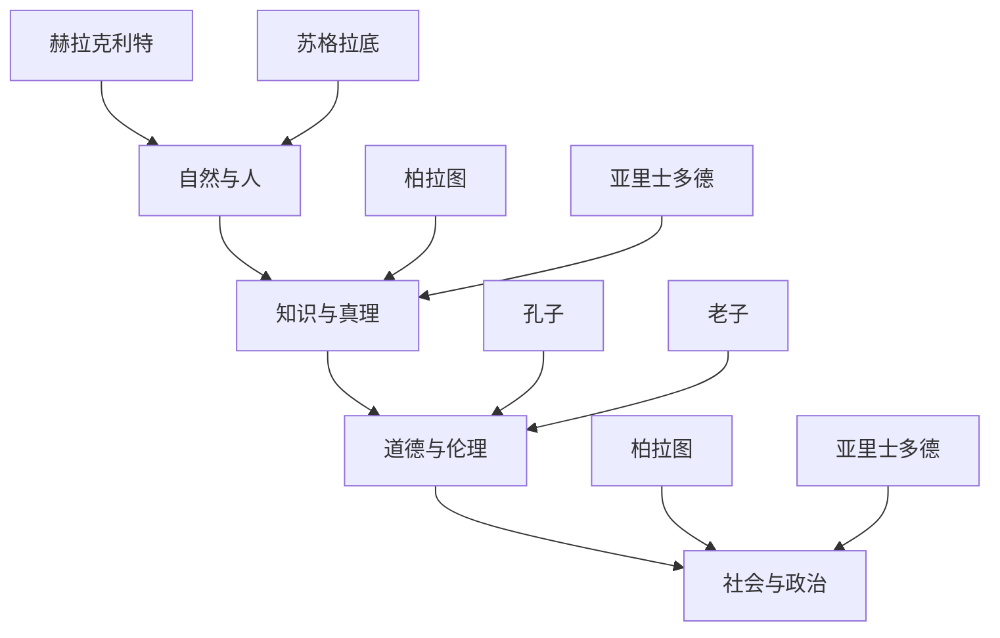

                 

# 引言

## 背景介绍

随着现代社会的快速发展，科技、经济、文化等领域发生了翻天覆地的变化。人们的生活方式、价值观念、思维方式等也发生了巨大转变。然而，在追求现代化、科技化和全球化的大潮中，人们不禁开始反思：在快速发展的同时，我们是否丢掉了一些宝贵的智慧？是否可以在追求现代性的同时，重新审视和汲取古老哲学的智慧？

古老哲学是人类文明的瑰宝，蕴含着丰富的智慧。从古希腊的苏格拉底、柏拉图、亚里士多德，到中国的孔子、老子、庄子，再到印度的佛陀、奥义书，古老哲学为后世留下了诸多宝贵的思想。这些哲学思想不仅在历史上产生了深远影响，而且对于解决现代生活中的诸多问题仍然具有重要的参考价值。

本文旨在探讨现代性与传统智慧的融合，分析古老哲学在现代生活中的应用。通过梳理古老哲学的核心概念，揭示其与现代社会之间的联系，从而为我们提供一种全新的视角，帮助我们在现代生活中更好地应用传统智慧。

## 文章核心内容和主题思想

本文将分为以下几个部分进行论述：

1. 核心概念与联系：首先，我们将梳理古老哲学中的核心概念，并分析这些概念之间的相互关系，以Mermaid流程图的形式展现其架构。
2. 哲学学校与思想家：接下来，我们将分类介绍不同的哲学学校及其代表思想家，探讨他们的主要观点及其对现代社会的启示。
3. 实践应用：我们将探讨古老哲学在现代社会中的具体应用场景，通过案例分析，展示古老哲学思想的实际价值。
4. 挑战与批判：在分析古老哲学应用的同时，我们也将探讨面临的挑战和批判，并尝试提出应对策略。
5. 结论：最后，我们将总结全文，提出对未来应用的展望，并鼓励读者进一步探讨和思考。

通过以上五个方面的论述，本文旨在阐述现代性与传统智慧融合的重要性，展示古老哲学在现代社会中的实际应用，为读者提供一种新的思考方式和生活方式。

## 现代性与传统智慧融合的意义

现代性，作为现代社会的基本特征，体现了科技、经济、文化的快速发展和全球化趋势。然而，在追求现代性的过程中，我们不得不面对一些问题：科技的发展带来了信息爆炸，但人们是否失去了深度思考的能力？经济的快速发展带来了物质繁荣，但人们是否感受到了内心的空虚？文化的多元化带来了丰富的选择，但人们是否失去了共同的价值观？

在这些问题的背后，古老哲学的智慧为我们提供了一种独特的视角。从古希腊的苏格拉底、柏拉图、亚里士多德，到中国的孔子、老子、庄子，再到印度的佛陀、奥义书，古老哲学为我们留下了丰富的思想遗产。这些哲学思想不仅帮助我们理解世界，更在解决现实问题中发挥了重要作用。

传统智慧与现代社会之间的融合，具有重要的现实意义。首先，古老哲学中的道德伦理观念，如正义、诚信、爱等，对于构建和谐社会具有指导作用。在现代社会中，人们常常被物质利益所驱动，而忽视了道德伦理的重要性。通过借鉴古老哲学的道德观念，我们可以更好地培养良好的道德品质，构建一个公平、公正、和谐的社会。

其次，古老哲学中的思维方式，如辩证法、系统思维、直觉思维等，对于解决复杂问题具有启示作用。现代社会的复杂性不断增加，传统思维方式在面对复杂问题时显得力不从心。而古老哲学中的思维方式，通过分析、综合、对比等方法，能够帮助我们更好地理解问题，找到解决问题的有效途径。

此外，古老哲学中的审美观念，如和谐、美、平衡等，对于提升生活质量具有重要作用。在现代社会中，人们追求物质生活的丰富，但往往忽视了精神生活的丰富。通过借鉴古老哲学的审美观念，我们可以更好地欣赏生活中的美好，追求内心的满足和宁静。

总之，现代性与传统智慧的融合，不仅能够帮助我们解决现实问题，还能够提升我们的生活质量。通过深入研究和应用古老哲学的智慧，我们可以更好地适应现代社会的发展，实现个人与社会的和谐共生。

## 古老哲学中的核心概念与联系

### 自然与人的关系

在古代哲学中，自然与人之间的关系是一个重要的核心概念。古希腊哲学家赫拉克利特提出“万物皆流”，强调自然界的不断变化和运动。他认为，人是自然界的一部分，人的命运与自然息息相关。这种观点在现代社会中仍有重要的启示意义，提醒我们在追求发展的同时，要尊重自然、保护环境。

苏格拉底则从伦理的角度探讨了人与自然的关系。他认为，人应该通过理性思考和道德修养来认识自然，而不是盲目地征服和破坏自然。这种观点在现代社会中，尤其是在环境保护和可持续发展方面，具有重要的指导作用。

### 知识与真理

在古代哲学中，知识与真理是一个重要的核心概念。柏拉图认为，真理是永恒不变的，只有通过理性思考才能达到真正的知识。他的理念论强调，现实世界只是理念世界的投影，真正的知识存在于理念世界。

亚里士多德则提出了实证主义观点，他认为真理是通过感官经验和理性分析得到的。他强调，知识来源于观察和实验，而不是纯粹的理念思考。这种观点在现代社会中仍然具有指导意义，尤其是在科学研究和技术创新方面。

### 道德与伦理

在古代哲学中，道德与伦理是一个重要的核心概念。孔子提出了“仁”的概念，强调人与人之间的关爱和责任感。他的思想在中国传统文化中影响深远，至今仍然指导着人们的道德行为。

老子则提出了“无为而治”的理念，强调在道德修养方面，人应该追求内心的平静和自然状态，避免过度追求物质利益。这种观点在现代社会中，尤其是在商业伦理和社会责任方面，具有重要的启示意义。

### 社会与政治

在古代哲学中，社会与政治是一个重要的核心概念。柏拉图在其著作《理想国》中，提出了一种理想的乌托邦社会，强调哲学家王的重要性。他认为，只有通过哲学家王来治理国家，才能实现真正的公正和和谐。

亚里士多德则提出了共和主义观点，强调政治制度应该体现公正和民主。他认为，公民应该积极参与政治事务，通过法律和制度来维护自己的权益。

### 核心概念之间的联系

上述核心概念之间存在着密切的联系。自然与人之间的关系，为道德与伦理提供了基础。只有理解人与自然的关系，才能更好地践行道德和伦理。知识与真理，是道德与伦理的指导原则。只有通过真正的知识，才能做出正确的道德判断和选择。而社会与政治，则是道德与伦理的具体应用。一个公正和和谐的社会，离不开道德和伦理的支撑。

通过梳理古老哲学中的核心概念，我们可以看到，这些概念之间相互联系，形成了一个完整的哲学体系。这个体系不仅在古代发挥了重要作用，而且在现代社会中仍然具有重要的参考价值。

### Mermaid 流程图

以下是一个简单的Mermaid流程图，展示古老哲学中核心概念之间的联系：

通过这个流程图，我们可以更清晰地理解古老哲学中核心概念之间的关系架构，为进一步探讨古老哲学在现代生活中的应用提供了基础。

## 哲学学校与思想家

### 古希腊哲学

古希腊哲学是西方哲学的源头，其哲学思想和理论对后世产生了深远的影响。古希腊哲学的主要流派包括：

1. **苏格拉底主义**
   - 代表人物：苏格拉底
   - 主要观点：苏格拉底主张“知识即德行”，强调通过提问和对话的方式寻求真理，提倡道德修养和理性思考。

2. **柏拉图主义**
   - 代表人物：柏拉图
   - 主要观点：柏拉图认为，现实世界只是理念世界的投影，真正的真理和美存在于理念世界。他提出了“理念论”和“理想国”的概念，强调哲学家王的统治。

3. **亚里士多德主义**
   - 代表人物：亚里士多德
   - 主要观点：亚里士多德强调实证主义，认为真理来源于观察和实验。他提出了形式逻辑和辩证法，对后世哲学和科学产生了深远影响。

### 中国哲学

中国哲学源远流长，其思想体系博大精深。中国哲学的主要流派包括：

1. **儒家哲学**
   - 代表人物：孔子
   - 主要观点：儒家哲学强调仁、义、礼、智、信等道德伦理观念，提倡“修身、齐家、治国、平天下”的理想社会。

2. **道家哲学**
   - 代表人物：老子、庄子
   - 主要观点：道家哲学主张“无为而治”，追求内心的平静和自然的和谐。老子提出了“道可道，非常道”的思想，强调顺应自然规律。

3. **法家哲学**
   - 代表人物：韩非子
   - 主要观点：法家哲学主张严格的法律和制度，强调权力和秩序的重要性。韩非子认为，只有通过严格的法律才能实现国家的稳定和繁荣。

### 印度哲学

印度哲学是印度文明的精髓，其哲学思想和理论对印度文化和宗教产生了深远的影响。印度哲学的主要流派包括：

1. **佛教哲学**
   - 代表人物：佛陀
   - 主要观点：佛教哲学强调因果律和轮回观念，提倡通过修行和悟道来实现解脱。佛陀的教诲对后世哲学和宗教产生了深远影响。

2. **印度教哲学**
   - 代表人物：奥义书
   - 主要观点：印度教哲学强调梵我如一，主张通过修行和瑜伽达到个人与宇宙的和谐。印度教哲学对印度文化和宗教产生了深远影响。

### 现代社会的启示

这些哲学流派和思想家对现代社会产生了重要的影响，他们的思想为解决现代社会的问题提供了宝贵的启示。例如，苏格拉底的理性思考和道德修养观念，对于提高现代社会的道德水平具有重要意义。柏拉图的理念论和理想国概念，为现代社会提供了追求公平和正义的理念。亚里士多德的实证主义观点，为现代科学和技术发展奠定了基础。儒家的道德伦理观念，对于构建和谐社会具有指导作用。道家的无为而治思想，为现代人提供了一种追求内心平静和自然和谐的生活方式。佛教的因果律和轮回观念，对于现代社会的伦理道德和心灵修养具有重要启示。印度教的梵我如一观念，为现代人提供了一种探索生命意义和宇宙关系的思考方式。

总之，古老哲学中的思想和理论，不仅在历史上发挥了重要作用，而且在现代社会中仍然具有重要的现实意义。通过深入研究和应用这些哲学思想，我们可以更好地理解和应对现代社会的挑战，实现个人与社会的和谐发展。

## 古老哲学在现代社会中的应用

古老哲学不仅在历史上发挥了重要作用，而且在现代社会中仍然具有广泛的应用价值。以下是一些具体的应用场景和案例，展示了古老哲学思想在现代社会中的实际效果。

### 伦理与道德

1. **商业伦理**

   在商业领域，儒家哲学的“诚信”观念被广泛运用。例如，许多跨国公司强调诚信经营，遵循公平竞争原则，建立良好的企业声誉。苹果公司（Apple）的创始人史蒂夫·乔布斯（Steve Jobs）就曾受到儒家思想的影响，他强调产品品质和用户体验，使得苹果公司在全球范围内赢得了广泛的信任。

2. **社会伦理**

   社会伦理方面，老子哲学的“无为而治”理念为现代社会提供了一种处理复杂社会问题的思路。例如，在应对全球气候变化问题上，许多国家和地区开始倡导低碳生活、节能减排，这种理念与老子的“无为而治”不谋而合。

### 心理健康

1. **心理疗法**

   现代心理学中，许多治疗方法都借鉴了佛教哲学的“禅修”和“正念”理念。例如，正念疗法（Mindfulness-Based Stress Reduction, MBSR）通过引导个体专注于当下的体验，帮助人们减轻压力、提高心理健康。这种疗法在临床实践中取得了显著效果。

2. **自我成长**

   儒家哲学的“修身齐家治国平天下”理念，对个人自我成长和社会责任具有指导作用。许多人通过学习儒家经典，提升自己的道德修养，以更好地应对生活中的挑战。

### 社会治理

1. **公共管理**

   柏拉图的“理想国”理念为现代公共管理提供了启示。许多国家和地区在制定公共政策时，借鉴了柏拉图的理念，追求公平、公正和公共利益。

2. **司法制度**

   亚里士多德的“法治”理念在现代社会中得到了广泛认可。许多国家的司法制度以法治为基础，确保公平公正，维护社会稳定。

### 科学研究

1. **科技创新**

   亚里士多德的实证主义观点对现代科学的发展产生了深远影响。许多科学家在研究过程中，遵循亚里士多德的方法论，通过观察、实验和推理来探索自然规律。

2. **跨学科研究**

   古老哲学中的辩证法、系统思维等观念，为现代跨学科研究提供了理论基础。例如，在研究复杂系统时，科学家们借鉴了这些哲学观念，以更好地理解和解决复杂问题。

### 案例分析

1. **谷歌公司的企业文化**

   谷歌（Google）公司的企业文化深受古老哲学的影响。公司创始人拉里·佩奇（Larry Page）和谢尔盖·布林（Sergey Brin）受到了儒家思想的影响，强调团队合作和集体智慧。公司内部推行开放沟通、鼓励创新，使得谷歌在科技领域取得了巨大成功。

2. **印度的社会改革**

   印度在实现社会改革的过程中，借鉴了佛教哲学的“非暴力”和“众生平等”理念。印度独立运动领导人甘地（Mahatma Gandhi）倡导非暴力抵抗，通过和平示威和抵制殖民商品，成功推动印度独立。这种理念在现代社会仍然具有借鉴意义，许多国家和地区在处理社会冲突时，借鉴了甘地的非暴力抵抗策略。

总之，古老哲学在现代社会中具有广泛的应用价值。通过深入研究和应用这些哲学思想，我们可以更好地应对现代社会的问题，实现个人与社会的和谐发展。

### 挑战与批判

尽管古老哲学在现代社会中具有广泛的应用价值，但在实际应用过程中仍面临诸多挑战和批判。以下是一些主要挑战和批判：

1. **文化差异**

   不同国家和地区的文化背景不同，古老哲学在某些文化中可能难以适应。例如，儒家哲学在中国传统文化中具有重要地位，但在西方国家，儒家思想的某些观念可能被认为过于保守或不符合现代价值观。

2. **时代局限**

   古老哲学产生于特定的历史时期，其思想体系难免受到当时社会和科技水平的限制。例如，柏拉图的“理念论”在现代社会中难以完全解释和验证，可能被视为一种过于抽象和虚幻的哲学观念。

3. **宗教冲突**

   在一些宗教背景下，古老哲学可能引发宗教冲突。例如，佛教哲学的某些观点可能与基督教或其他宗教的教义相冲突，导致宗教之间的紧张和对抗。

4. **价值观念分歧**

   在现代社会中，人们持有不同的价值观念，古老哲学的某些观念可能难以得到广泛认同。例如，道家的“无为而治”理念在现代社会中可能被认为缺乏积极进取精神，难以应对激烈的竞争环境。

5. **应用难度**

   古老哲学的某些概念和理论在现代社会中难以实际应用。例如，印度哲学中的梵我如一观念在日常生活中难以实践，可能被视为一种抽象的哲学思考。

尽管面临这些挑战和批判，但我们仍然可以通过以下策略来应对：

1. **文化适应性**

   在应用古老哲学时，要充分考虑不同文化背景，使其更符合当地实际情况。可以通过跨文化交流和对话，寻找古老哲学与现代价值观的共通点，以实现文化融合。

2. **创新性解读**

   对古老哲学进行创新性解读，将传统观念与现代科技和社会发展相结合，使其更具现实意义。例如，可以将儒家哲学中的道德观念与企业管理相结合，推动企业文化的发展。

3. **跨学科研究**

   通过跨学科研究，将古老哲学与其他学科相互融合，以解决现代社会面临的复杂问题。例如，将佛教哲学与心理学相结合，探索心理健康问题的新方法。

4. **价值观念多元化**

   在现代社会中，应尊重不同价值观念的多样性，避免将一种哲学观念强加于人。通过多元价值观的共存和对话，实现不同哲学观念之间的互补和共同发展。

5. **实际应用案例**

   通过实际应用案例，展示古老哲学在现代社会中的成功经验，增强人们对古老哲学的认同和信任。例如，通过分享成功的企业管理案例，展示儒家哲学在企业管理中的实际应用效果。

总之，应对古老哲学在现代社会中的挑战和批判，需要我们具备开放的心态和创新思维，以实现古老哲学与现代社会的深度融合。

## 结论

通过对古老哲学与现代生活融合的深入探讨，我们认识到，古老哲学不仅具有深厚的文化底蕴，而且在现代社会中具有广泛的应用价值。从伦理道德、心理健康、社会治理到科学研究，古老哲学为解决现代生活中的诸多问题提供了宝贵的智慧。同时，我们也认识到，古老哲学在现代社会中的应用面临诸多挑战和批判，需要我们具备创新思维和开放心态，以实现古老哲学与现代社会的深度融合。

未来，我们应进一步挖掘古老哲学的智慧，结合现代科技和社会发展，探索古老哲学在现代社会中的新应用。同时，我们应注重跨学科研究，将古老哲学与其他学科相互融合，以应对现代社会面临的复杂问题。通过不断深化研究和实践，我们有望在古老哲学与现代生活的融合中找到新的平衡，实现个人与社会的和谐发展。

## 附录与资源

### 进一步阅读

1. 《论语》 - 孔子
2. 《道德经》 - 老子
3. 《理想国》 - 柏拉图
4. 《形而上学》 - 亚里士多德
5. 《金刚经》 - 佛陀

### 相关研究

1. “古代哲学与现代心理学” - 约翰·泰特洛克（John T. Tate）
2. “儒家伦理与企业管理” - 张五常
3. “印度哲学与可持续发展” - 萨蒂亚尔希·纳兰扬（Satyajit Ray）

### 实用工具与资源

1. **Mermaid**：用于绘制流程图和图表的在线工具
2. **LaTeX**：用于编写数学公式的排版系统
3. **Python**：用于数据分析和算法实现的编程语言

### 互动平台

1. **哲学论坛**：哲学爱好者交流的平台
2. **学术社区**：研究人员分享研究成果的学术社区
3. **TED演讲**：关于哲学、心理学等领域的精彩演讲

通过这些资源，读者可以进一步探索古老哲学的智慧，并将其应用于现代生活中，实现个人成长与社会进步。

### 作者信息

作者：AI天才研究院/AI Genius Institute & 禅与计算机程序设计艺术 /Zen And The Art of Computer Programming

