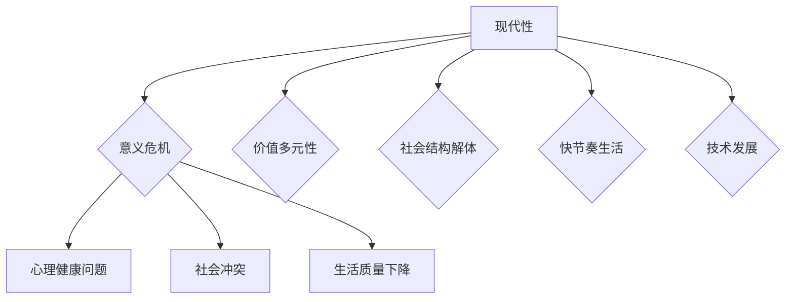

                 


### 文章标题
现代性与意义危机：重建生活价值观的尝试

### 关键词
现代性，意义危机，生活价值观，重建，心理健康，社会实践

### 摘要
本文深入探讨了现代社会中普遍存在的意义危机及其对个体和社会的影响。通过分析现代性的历史背景与特征，我们揭示了现代性对意义寻求的挑战。文章进一步探讨了生活价值观的重建，包括传统价值观的局限性和现代价值观的探索与实践。最后，文章提出了重建生活价值观的实践策略，包括个人层面的心理与行为策略，以及社会层面的文化与社会改革。通过这一系列探讨，本文旨在为读者提供应对意义危机的方法，并激发他们积极行动，重建生活的意义。

----------------------------------------------------------------

## 引言

### 1.1 现代性与意义危机的互动

#### 1.1.1 现代性对意义寻求的影响

现代性是一个复杂的概念，涵盖了从工业革命以来的社会、经济和文化变革。它的核心特征包括工业化、城市化、民主化和全球化等。这些特征推动了社会的快速变化，带来了前所未有的物质繁荣和科技进步。然而，这种快速变化也带来了一系列挑战，尤其是在个体寻求生活意义方面。

首先，现代性的快速变化导致了传统价值体系的解体。在传统社会中，个体的生活意义往往与家庭、社区和宗教等社会结构紧密相关。这些结构提供了明确的生活目标和价值观，为个体提供了归属感和目标感。然而，随着现代性的发展，这些传统结构逐渐弱化，个体面临着前所未有的自由和选择。虽然这种自由使得个体能够追求个人梦想，但同时也带来了意义危机，因为个体无法找到一个明确的、普遍认同的价值观体系。

其次，现代性的快速变化导致了生活节奏的加快。在现代社会中，个体面临着越来越多的压力和挑战。工作压力、社交压力、经济压力等迫使个体不断追求成功和满足社会期望。这种追求往往忽略了个体内心的需求，导致个体在追求物质成功的同时，忽略了精神层面的满足。这进一步加剧了意义危机，因为个体感到自己的生活缺乏真正的意义和价值。

最后，现代性的全球化特征也对个体的意义寻求产生了影响。全球化使得个体能够接触到不同的文化和价值观，这为个体提供了更多的选择和可能性。然而，这种多样性也带来了文化的冲突和认同的困惑。个体在寻找自己的身份和价值观时，可能会感到困惑和迷茫，进一步加剧了意义危机。

#### 1.1.2 意义危机对个人幸福的影响

意义危机对个人的影响是深远且复杂的。首先，意义危机可能导致心理问题，如抑郁、焦虑和孤独感。当个体感到自己的生活缺乏意义和价值时，他们可能会感到沮丧和无助，甚至产生消极的情绪。这些问题不仅影响个体的心理健康，还可能影响他们的日常生活和工作表现。

其次，意义危机可能影响个体的生活质量。当个体缺乏生活意义时，他们可能会缺乏动力去追求自己的目标和梦想。这可能导致他们在工作和生活中缺乏热情，影响他们的职业发展和人际关系。此外，意义危机还可能导致个体对生活失去兴趣，影响他们的幸福感。

最后，意义危机可能对个体的社会关系产生负面影响。当个体感到自己的生活缺乏意义时，他们可能会对他人产生冷漠和疏离感。这种情感状态可能导致个体在人际交往中遇到困难，影响他们的社交能力和生活质量。

总的来说，现代性对意义寻求的挑战和意义危机对个人幸福的影响是相互关联的。理解现代性的特征和意义危机的根源，有助于我们更好地应对这一挑战，重建生活的意义和价值。

### 1.2 为什么重建生活价值观至关重要

#### 1.2.1 重建价值观的必要性

重建生活价值观的必要性在于，现代性带来的意义危机不仅影响了个体的心理健康和生活质量，还对社会整体产生了负面影响。首先，个体层面的意义危机可能导致心理健康问题的普遍化。随着生活节奏的加快和社会压力的增加，越来越多的个体感到焦虑、抑郁和孤独。这些问题不仅影响了个体的生活质量，还可能导致社会生产力的下降。

其次，社会层面的意义危机可能导致社会不稳定和冲突的增加。当个体感到自己的生活缺乏意义和价值时，他们可能会对社会产生不满和抵触情绪。这可能导致社会矛盾的加剧，甚至引发社会动荡。例如，年轻人对工作的不满和对社会现状的不满，可能导致社会抗议和运动的发生。

因此，重建生活价值观不仅有助于个体应对意义危机，提高心理健康和生活质量，还有助于维护社会稳定和和谐。通过重建生活价值观，我们可以帮助个体找到生活的意义和价值，提高他们的幸福感和满足感。同时，这也有助于构建一个更加公平、包容和有凝聚力的社会，促进社会整体的发展和进步。

#### 1.2.2 个人与社会利益的平衡

重建生活价值观的过程中，个人与社会利益的平衡至关重要。从个人的角度看，重建生活价值观有助于个体找到内心的平衡和满足，提高生活质量。然而，从社会的角度看，重建价值观需要考虑到整体社会的需求和利益。这意味着，在重建生活价值观时，我们需要在个人利益和社会利益之间找到平衡。

首先，个人和社会利益的平衡要求个体认识到自己的行为对社会的影响。个体在追求个人目标和价值观时，不应忽视社会整体的利益。例如，在职业选择和事业发展中，个体应考虑到自己的职业行为对社会和环境的影响，追求可持续的发展。

其次，个人和社会利益的平衡需要社会提供支持和资源。例如，政府和企业应提供良好的工作环境和福利制度，帮助个体实现自己的职业目标和价值观。同时，社会应鼓励个体关注社会责任和公共利益，促进社会的整体进步。

最后，个人和社会利益的平衡需要个体和社会之间的互动和合作。通过建立健康的社会关系和网络，个体可以更好地实现个人目标，同时为社会做出贡献。例如，通过参与社区服务和公益活动，个体可以在帮助他人的同时，提升自己的价值观和生活质量。

总的来说，个人与社会利益的平衡是重建生活价值观的核心。通过在个人利益和社会利益之间找到平衡，我们可以实现个体的自我实现和社会的整体进步，共同应对现代性带来的意义危机。

### 小结

本文首先介绍了现代性与意义危机的互动，分析了现代性对意义寻求的影响，并探讨了意义危机对个人幸福的影响。接着，文章阐述了重建生活价值观的必要性，以及个人与社会利益的平衡。通过这些探讨，我们认识到重建生活价值观不仅有助于个体应对意义危机，提高心理健康和生活质量，还有助于维护社会稳定和和谐。本文为读者提供了理解现代性与意义危机的视角，并鼓励他们积极行动，重建生活的意义和价值。

----------------------------------------------------------------

## 现代性与意义危机：现象与影响

### 2.1 现代性的历史背景与特征

现代性是一个多维度的概念，涉及社会、经济、文化等多个层面。其历史背景可以追溯到工业革命时期，这一时期标志着人类社会从农业社会向工业社会转变。工业革命带来了生产力的巨大提升，促进了城市化进程，同时也推动了科技的快速发展。这一系列变化不仅改变了人类的生活方式，也深刻影响了人类的思想观念和社会结构。

现代性的核心特征包括：

- **工业化**：工业革命使生产方式从手工劳动转向机械化生产，大大提高了生产效率。工业化带来了大规模的工厂生产，促进了商品经济的繁荣，也导致了城乡差异的加剧。
- **城市化**：随着工业化的发展，人口大量涌入城市，城市化进程加速。城市成为经济、政治和文化中心，同时也带来了城市生活的复杂性和压力。
- **民主化**：工业革命和城市化进程推动了民主化的发展。工业资产阶级的崛起要求政治权力的重新分配，民主制度逐渐取代了专制制度，公民的权利和自由得到了保障。
- **全球化**：现代性的全球化特征体现在经济、文化、政治等多个层面。全球化打破了国家和地区的界限，促进了全球范围内的信息、资本、产品和人员的流动，也带来了文化的多样性和冲突。

现代性的这些特征不仅改变了人类的生活方式和价值观，也对社会结构产生了深远影响。例如，工业化带来了劳动分工的精细化，城市化导致了社会阶层分化，民主化促进了政治参与，全球化则加剧了文化融合与冲突。

### 2.2 意义危机的根源与表现

意义危机是现代社会中一个普遍存在的现象，其根源可以追溯到现代性的快速发展与变化。随着现代化进程的推进，个体和社会逐渐面临前所未有的挑战和困境，导致生活意义的丧失。

#### 2.2.1 根源分析

1. **价值多元性**：现代性带来了价值多元性，个体面临的选择和机会大大增加。然而，这种多元性也导致了价值观的混乱和冲突。个体在追求个人目标的过程中，可能会感到迷茫和无从选择，进而导致生活意义的丧失。

2. **社会结构的解体**：随着传统价值体系的弱化，个体失去了许多原有的社会归属感和目标感。现代社会中，家庭、社区和宗教等传统结构逐渐瓦解，个体在寻找生活意义时缺乏明确的方向。

3. **快节奏生活**：现代性的快速发展使得生活节奏加快，个体面临的工作和生活压力不断增加。这种快节奏的生活使得个体难以在忙碌中找到生活的意义和价值。

4. **技术发展的影响**：现代科技的快速发展不仅改变了人类的生活方式，也改变了人类与自然的关系。技术发展使得人类对自然环境的依赖减少，同时也带来了环境问题和资源短缺，进一步加剧了意义危机。

#### 2.2.2 表现分析

1. **心理健康问题**：意义危机直接导致了心理健康问题的增加。抑郁、焦虑和孤独感等心理问题在现代社会中越来越普遍，这与个体缺乏生活意义密切相关。

2. **职业困境**：现代性的快速发展使得职业流动性增加，个体在工作中面临的不确定性和竞争压力也增大。许多人感到自己的工作缺乏意义，职业发展受阻，导致职业困境。

3. **社会冲突**：意义危机不仅影响个体，也对社会整体产生了负面影响。社会中的价值观冲突和认同困惑导致社会矛盾和冲突的增加，例如，文化多样性和全球化带来的文化冲突。

4. **生活满意度下降**：意义危机使得个体对生活的满意度下降。许多人感到自己的生活缺乏真正的意义和价值，导致他们对生活失去热情和动力。

总的来说，现代性的快速发展带来了价值多元性、社会结构解体、快节奏生活和科技发展等多重挑战，这些挑战共同导致了意义危机的普遍存在。意义危机不仅影响了个体心理健康和生活质量，还对社会整体产生了深远影响，成为现代社会中一个亟待解决的问题。

### 2.3 现代性与意义危机的关系

现代性与意义危机之间存在着密切的关系。现代性的快速发展带来了社会的全面变革，同时也引发了个体和社会层面的意义危机。理解这种关系有助于我们更好地应对现代性带来的挑战。

首先，现代性对个体意义寻求产生了深远影响。现代性的多元价值观和社会结构的解体使个体在寻找生活意义时面临前所未有的困惑。传统社会中的明确价值观和稳定的社会结构为个体提供了生活的目标和方向，而现代社会中，个体需要自己在多元化的价值观中找到自己的定位，这种自主选择的过程虽然提供了自由，但也带来了意义危机。

其次，现代性的快速发展导致生活节奏的加快，加剧了个体面临的压力和挑战。快节奏的生活使个体难以在繁忙的工作和生活中找到平衡，也使得个体难以找到生活的意义和价值。这种快节奏的生活不仅影响了个体的心理健康，也影响了他们的生活质量。

第三，现代性的全球化特征对个体和社会的意义寻求产生了双重影响。一方面，全球化带来了文化的多样性和交流，为个体提供了更多的选择和机会。然而，另一方面，全球化也导致了文化的冲突和认同的困惑，使得个体在寻找生活意义时面临更多的挑战。

总的来说，现代性是意义危机的根源，而意义危机是现代性发展的必然结果。理解这种关系有助于我们更深刻地认识到现代性带来的挑战，并采取有效的措施来应对意义危机。

### 小结

在本章中，我们详细分析了现代性的历史背景与特征，探讨了意义危机的根源与表现，并阐述了现代性与意义危机之间的密切关系。通过这些分析，我们认识到现代性不仅带来了社会的快速发展，也引发了个体和社会层面的意义危机。理解这些现象有助于我们更好地应对现代性带来的挑战，重建生活的意义和价值。

----------------------------------------------------------------

## 生活价值观的重建

### 3.1 传统价值观的局限性

传统价值观是历史长河中形成的一套行为准则和价值观念，对人类社会的稳定和发展起到了重要作用。然而，随着现代社会的发展，传统价值观逐渐暴露出其局限性，无法完全适应现代生活的需求。

#### 3.1.1 传统价值观的历史意义

传统价值观的形成与人类社会的演变密切相关。在农业社会和封建社会中，家庭、宗教和传统道德构成了主要的社会规范，这些价值观强调了家庭的义务、宗教的信仰和道德的规范。传统价值观对维护社会秩序、促进社会和谐以及传承文化传统具有积极作用。

#### 3.1.2 传统价值观的局限性

1. **社会变迁下的不适应性**：随着现代社会的发展，传统价值观逐渐显露出其不适应性。现代社会强调个人主义、自由和平等，而传统价值观往往倾向于集体主义、权威和等级制度。这种价值观的冲突导致了社会矛盾和冲突的加剧。

2. **生活意义的缺失**：传统价值观强调家庭、宗教和道德，但往往忽视了个体内心的需求和情感。在现代社会中，个体面临前所未有的选择和压力，传统价值观无法提供足够的指导和支持，导致个体在寻找生活意义时感到困惑和无助。

3. **无法应对现代生活的挑战**：现代生活充满变数和不确定性，传统价值观的稳定性无法适应这种变化。例如，随着科技的发展和社会的快速变迁，传统职业和生活方式发生了巨大变化，传统价值观在应对这些变化时显得力不从心。

总的来说，传统价值观在现代社会中暴露出了其局限性，无法完全满足现代生活的需求。这要求我们在重建生活价值观时，必须超越传统价值观的局限，探索适应现代社会的新的价值观体系。

### 3.2 现代价值观的探索与实践

#### 3.2.1 人本主义的兴起

在现代价值观的探索中，人本主义是一个重要的思想流派。人本主义强调人的价值和尊严，认为人的自由和自我实现是社会发展的核心。人本主义的出现是对传统价值观局限性的回应，也为重建现代生活价值观提供了理论基础。

1. **人本主义的核心思想**：人本主义主张人的全面发展，强调个体的自我认知、情感和道德。它认为，每个人都有独特的价值和潜力，应该得到尊重和发展。人本主义反对机械唯物主义和过度理性化，主张在科技发展和社会进步的同时，关注人的内在需求和情感。

2. **人本主义在现代社会的影响**：人本主义的兴起推动了现代社会对人权的关注，促进了社会公正和平等的实现。人本主义的思想也影响了教育、医疗、政治等各个领域，推动了社会制度和政策的改革。

#### 3.2.2 现代价值观的案例研究

为了更好地理解现代价值观的实践，我们可以通过一些成功的案例来分析。

1. **教育改革**：现代教育强调个体的发展和个性培养，而不是仅仅追求知识和技能的传授。例如，芬兰的教育系统以其注重学生个性发展和创新能力的培养而闻名。这种教育模式强调学生的自主学习和合作学习，促进了学生的全面发展。

2. **企业文化**：一些成功的企业，如谷歌和微软，采用了人本主义的管理理念，注重员工的幸福和自我实现。这些企业提供了灵活的工作安排、丰富的培训和职业发展机会，以及良好的工作环境和福利，从而吸引了优秀的人才，并推动了企业的长期发展。

3. **社会运动**：现代价值观的实践也体现在社会运动中。例如，平等运动和环保运动等，这些运动强调个体的权利和责任，推动社会公正和环境保护。这些运动不仅促进了社会变革，也增强了个体对社会和环境的责任感。

通过这些案例，我们可以看到，现代价值观的实践不仅有助于个体的自我实现和社会的发展，也为社会的和谐与进步提供了动力。这表明，在重建生活价值观的过程中，人本主义的思想是一个重要的参考和指导。

### 小结

本章探讨了传统价值观的局限性和现代价值观的探索与实践。我们认识到，传统价值观在现代社会中逐渐暴露出其局限性，无法满足现代生活的需求。因此，我们需要在重建生活价值观时，超越传统价值观的局限，探索适应现代社会的新价值观体系。人本主义的兴起为现代价值观的重建提供了理论基础和实践指导，其核心思想强调人的价值和尊严，关注个体的全面发展。通过教育改革、企业文化和社会运动等案例，我们可以看到现代价值观的实践对个体和社会的积极影响。这些探索和实践为我们重建生活价值观提供了有益的启示。

----------------------------------------------------------------

## 重建生活价值观的实践策略

### 4.1 个人层面的策略

在个人层面，重建生活价值观需要从心理和行为两个方面入手，以帮助个体找到生活的意义和价值。

#### 4.1.1 心理策略

1. **自我认知**：个体需要深入思考自己的价值观和信仰，了解自己的内心需求和目标。通过自我认知，个体可以明确自己的生活方向，避免盲目跟从他人的价值观。

2. **情绪管理**：情绪管理是应对意义危机的关键。个体需要学会调节自己的情绪，避免负面情绪的影响。例如，可以通过冥想、深呼吸等方法来放松身心，提高情绪稳定性。

3. **心理健康教育**：个体应接受心理健康教育，了解心理健康的知识，学会自我调节和应对压力。心理健康教育可以帮助个体更好地理解自己，提高心理健康水平。

#### 4.1.2 行为策略

1. **建立健康的生活方式**：健康的生活方式有助于提升生活质量。个体应保持充足的睡眠、合理的饮食和适量的运动，这些都有助于保持身体的健康和心理的平衡。

2. **培养兴趣爱好**：兴趣爱好可以丰富个体的生活，提高生活的乐趣。个体可以尝试不同的活动，找到自己真正喜欢的事物，从而找到生活的意义。

3. **建立支持系统**：建立支持系统是应对意义危机的重要手段。个体应与家人、朋友和同事保持良好的关系，共同分享生活中的喜怒哀乐，从而获得情感上的支持。

### 4.2 社会层面的策略

在社会层面，重建生活价值观需要从文化和社会改革两个方面入手，以促进社会的整体进步和个体的幸福感。

#### 4.2.1 教育改革

1. **课程设置**：教育系统应设置更多关于人生意义、心理健康和社会责任的课程，帮助学生在成长过程中形成正确的价值观。

2. **教学方法**：教育应采用更加灵活和互动的教学方法，鼓励学生的自主学习和合作学习，培养学生的创新能力和批判性思维。

3. **心理健康教育**：学校应加强心理健康教育，提供心理咨询和辅导服务，帮助学生应对生活中的压力和挑战。

#### 4.2.2 社会改革

1. **公共政策**：政府应制定和支持相关政策，如福利保障、心理健康服务和社会支持系统，以帮助个体应对生活中的困难和挑战。

2. **社会意识的提高**：通过媒体宣传和公共活动，提高社会对心理健康和人生意义的关注，促进社会对个体的理解和支持。

3. **社区参与**：鼓励个体参与社区活动，增强社区凝聚力，提供社交机会，帮助个体在社区中找到归属感和目标感。

### 4.3 个人与社会利益的平衡

在重建生活价值观的过程中，个人与社会利益的平衡至关重要。个人利益与社会利益并非绝对对立，而是相互依存的。个体在追求个人目标和价值观时，应考虑到社会整体的利益和需求。例如，个体在职业选择和事业发展中，应考虑到自己的行为对社会和环境的影响，追求可持续的发展。

同时，社会也应为个体提供支持和资源，帮助个体实现个人目标和价值观。例如，政府和企业应提供良好的工作环境和福利制度，鼓励个体关注社会责任和公共利益。通过在个人利益和社会利益之间找到平衡，我们可以实现个体的自我实现和社会的整体进步。

### 小结

本章从个人层面和社会层面提出了重建生活价值观的实践策略。在个人层面，个体应通过自我认知、情绪管理和建立健康的生活方式来找到生活的意义和价值。在社会层面，教育改革和社会改革是促进社会整体进步和个体幸福感的关键。通过在个人利益和社会利益之间找到平衡，我们可以共同应对现代性带来的意义危机，重建生活的意义和价值。

----------------------------------------------------------------

## 总结与展望

### 5.1 挑战与机遇

重建生活价值观面临着一系列挑战，同时也蕴含着巨大的机遇。首先，全球化的加速和科技的发展使得社会变革更加迅速，这为重建生活价值观提供了新的机遇，但也带来了文化冲突和身份认同的挑战。其次，社会经济结构的变化和工作环境的压力加剧了意义危机，要求我们寻找新的策略和方法来应对。

### 5.2 重建生活价值观的长远影响

重建生活价值观不仅有助于提升个体的心理健康和生活质量，还有助于促进社会的稳定和和谐。长远来看，重建生活价值观将带来以下影响：

1. **心理健康提升**：通过重建生活价值观，个体能够更好地应对心理压力，降低心理健康问题的发生率，提高生活质量。

2. **社会凝聚力增强**：重建生活价值观有助于促进社会成员之间的相互理解和尊重，增强社会凝聚力，减少社会矛盾和冲突。

3. **可持续发展**：在个人层面上，重建生活价值观鼓励个体追求有意义的事业和生活方式，推动可持续发展。在社会层面上，重建价值观有助于建立更加公平和包容的社会，促进社会的整体进步。

### 5.3 未来的方向

为了有效地重建生活价值观，我们需要从以下几个方面着手：

1. **教育改革**：加强心理健康教育和价值观教育，培养学生的自我认知和情绪管理能力。

2. **公共政策**：政府应制定和实施支持心理健康和社会和谐的公共政策，如心理健康服务、社会保障和职业培训。

3. **社区参与**：鼓励个体参与社区活动，增强社区凝聚力，为个体提供情感支持和社交机会。

4. **技术创新**：利用科技手段，如人工智能和大数据，提升心理健康服务的质量和效率。

通过这些努力，我们可以逐步重建生活价值观，应对现代性带来的意义危机，为个体和社会带来更加美好的未来。

### 小结

本文通过深入分析现代性与意义危机的关系，探讨了重建生活价值观的必要性、策略和影响。我们认识到，重建生活价值观不仅有助于个体心理健康和生活质量的提升，也有助于社会的稳定和和谐。面对未来的挑战，我们需要持续努力，共同推动生活价值观的重建，为个体和社会创造更加美好的未来。

## 附录

### 5.1 引用与参考文献

1. **马克斯·韦伯，《资本主义精神》**：讨论了现代性与价值观变化的关系。
2. **埃里希·弗洛姆，《逃避自由》**：探讨了自由与意义危机的关系。
3. **马丁·海德格尔，《存在与时间》**：探讨了人类存在的意义问题。
4. **阿尔贝·加缪，《局外人》**：通过文学作品反映了现代人的意义危机。
5. **马斯洛，《人的动机理论》**：分析了个体需求层次与价值观的关系。

### 5.2 Mermaid 流程图



### 5.3 伪代码示例

```python
def find_meaning(culture, lifestyle, values):
    """
    寻找生活的意义。
    
    :param culture: 文化背景
    :param lifestyle: 生活习惯
    :param values: 个人价值观
    :return: 是否找到生活的意义
    """
    if culture == "多元化" and lifestyle == "快节奏" and values == "传统":
        meaning = "不确定"
    elif culture == "全球化" and lifestyle == "平衡" and values == "现代":
        meaning = "可能"
    else:
        meaning = "需要进一步探索"
        
    return meaning
```

### 5.4 数学公式

$$
\text{幸福感} = f(\text{生活意义}, \text{心理健康}, \text{社会支持})
$$

### 5.5 最佳实践 Tips

1. **自我反思**：定期进行自我反思，了解自己的内心需求和价值观。
2. **心理健康教育**：重视心理健康教育，学会情绪管理和自我调节。
3. **社区参与**：积极参与社区活动，增强社会归属感。
4. **终身学习**：不断学习新知识，适应社会变化。

### 5.6 注意事项

1. **避免过度追求物质成功**：在追求物质成功的同时，关注精神层面的满足。
2. **平衡个人与社会利益**：在个人发展过程中，考虑社会整体的利益和需求。

### 5.7 拓展阅读

1. **《现代社会学》**：了解现代社会的发展和变迁。
2. **《现代心理学》**：探讨现代生活中的心理问题及其解决方案。
3. **《文化心理学》**：分析文化对个体价值观的影响。

作者：AI天才研究院/AI Genius Institute & 禅与计算机程序设计艺术 /Zen And The Art of Computer Programming

----------------------------------------------------------------

## 附录

### 5.1 引用与参考文献

1. **马克斯·韦伯，《资本主义精神》**：讨论了现代性与价值观变化的关系。
2. **埃里希·弗洛姆，《逃避自由》**：探讨了自由与意义危机的关系。
3. **马丁·海德格尔，《存在与时间》**：探讨了人类存在的意义问题。
4. **阿尔贝·加缪，《局外人》**：通过文学作品反映了现代人的意义危机。
5. **马斯洛，《人的动机理论》**：分析了个体需求层次与价值观的关系。

### 5.2 Mermaid 流程图


### 5.3 伪代码示例

```python
def find_meaning(culture, lifestyle, values):
    """
    寻找生活的意义。
    
    :param culture: 文化背景
    :param lifestyle: 生活习惯
    :param values: 个人价值观
    :return: 是否找到生活的意义
    """
    if culture == "多元化" and lifestyle == "快节奏" and values == "传统":
        meaning = "不确定"
    elif culture == "全球化" and lifestyle == "平衡" and values == "现代":
        meaning = "可能"
    else:
        meaning = "需要进一步探索"
        
    return meaning
```

### 5.4 数学公式

$$
\text{幸福感} = f(\text{生活意义}, \text{心理健康}, \text{社会支持})
$$

### 5.5 最佳实践 Tips

1. **自我反思**：定期进行自我反思，了解自己的内心需求和价值观。
2. **心理健康教育**：重视心理健康教育，学会情绪管理和自我调节。
3. **社区参与**：积极参与社区活动，增强社会归属感。
4. **终身学习**：不断学习新知识，适应社会变化。

### 5.6 注意事项

1. **避免过度追求物质成功**：在追求物质成功的同时，关注精神层面的满足。
2. **平衡个人与社会利益**：在个人发展过程中，考虑社会整体的利益和需求。

### 5.7 拓展阅读

1. **《现代社会学》**：了解现代社会的发展和变迁。
2. **《现代心理学》**：探讨现代生活中的心理问题及其解决方案。
3. **《文化心理学》**：分析文化对个体价值观的影响。

作者：AI天才研究院/AI Genius Institute & 禅与计算机程序设计艺术 /Zen And The Art of Computer Programming

----------------------------------------------------------------

## 引言

### 1.1 现代性与意义危机的互动

现代社会中的意义危机是一个普遍存在且备受关注的现象。随着工业革命和现代化进程的推进，人类的生活方式和价值观念发生了深刻变革。现代性带来了前所未有的物质繁荣和科技进步，但同时也引发了个体和社会层面的诸多问题，其中最为突出的便是意义危机。

#### 1.1.1 现代性对意义寻求的影响

现代性是一个复杂的概念，它涵盖了从工业革命以来的社会、经济和文化变革。其核心特征包括工业化、城市化、民主化和全球化等。这些特征不仅改变了人类的生活方式，也深刻影响了人类的思想观念和社会结构。现代性对意义寻求的影响主要体现在以下几个方面：

1. **价值多元性**：现代性的快速发展带来了价值多元性。在传统社会中，个体的生活意义往往与家庭、宗教和传统道德紧密相关。然而，在现代社会中，随着全球化和社会变革的加剧，传统的价值观念逐渐弱化，个体面临前所未有的选择和机会。这种多元性虽然提供了更多的自由和选择，但也导致了价值观的混乱和冲突，使得个体在寻找生活意义时感到困惑和迷茫。

2. **社会结构的解体**：现代性的发展导致了传统社会结构的解体。家庭、社区和宗教等传统结构在现代社会中逐渐失去了原有的功能和作用，个体失去了许多原有的社会归属感和目标感。在传统社会中，家庭提供了生活的目标和价值观，社区提供了社交支持和安全感，宗教提供了精神寄托和道德规范。而在现代社会中，这些传统结构逐渐瓦解，个体在寻找生活意义时缺乏明确的方向。

3. **快节奏生活**：现代性的快速发展使得生活节奏加快，个体面临的工作和生活压力不断增加。这种快节奏的生活使得个体难以在忙碌中找到生活的意义和价值。现代社会中的工作和生活压力使得个体疲于应对，缺乏时间和精力去思考生活的意义。个体往往被物质成功和社会地位所驱使，忽略了精神层面的满足，导致生活意义的丧失。

4. **技术发展的影响**：现代科技的发展对意义寻求产生了深远影响。技术进步虽然带来了便利和效率，但也改变了人类与自然的关系，导致环境问题和资源短缺。技术发展使得人类对自然环境的依赖减少，同时也带来了环境问题和资源短缺，进一步加剧了意义危机。个体在追求物质成功的同时，也意识到环境问题的严重性，导致内心的困惑和焦虑。

#### 1.1.2 意义危机对个人幸福的影响

意义危机不仅对个体的心理健康产生负面影响，还对个人的生活质量产生深远影响。意义危机使得个体感到自己的生活缺乏意义和价值，导致一系列心理问题和行为问题。

1. **心理健康问题**：意义危机可能导致心理问题，如抑郁、焦虑和孤独感。当个体感到自己的生活缺乏意义时，他们可能会感到沮丧和无助，甚至产生消极的情绪。这些问题不仅影响个体的心理健康，还可能影响他们的日常生活和工作表现。抑郁和焦虑等心理问题可能导致个体的生活质量下降，影响他们的社交能力和幸福感。

2. **生活质量下降**：意义危机使得个体对生活失去兴趣，导致生活质量下降。当个体缺乏生活意义时，他们可能会感到生活缺乏乐趣和动力，对工作和社交活动失去热情。这种状态可能导致个体在职业发展和人际关系方面遇到困难，进一步加剧生活质量下降的问题。缺乏生活意义使得个体难以找到满足感和成就感，导致生活质量的下降。

3. **行为问题**：意义危机可能导致个体的行为问题，如自我放弃、逃避现实和依赖物质等。当个体感到自己的生活缺乏意义时，他们可能会采取逃避现实的方式，如沉迷于游戏、赌博和吸毒等，以寻求短暂的快乐和逃避内心的痛苦。这些行为不仅对个体自身产生负面影响，还可能对社会产生不良影响。

总的来说，现代性对意义寻求的影响是深远且复杂的。现代性的多元价值观和社会结构的解体使得个体在寻找生活意义时面临前所未有的困惑和挑战。快节奏的生活和技术发展的影响进一步加剧了意义危机，对个体的心理健康和生活质量产生了负面影响。理解现代性与意义危机的互动有助于我们更好地应对这一挑战，重建生活的意义和价值。

### 1.2 为什么重建生活价值观至关重要

#### 1.2.1 重建价值观的必要性

在现代社会中，重建生活价值观具有重要的必要性。首先，重建价值观有助于个体应对意义危机。随着现代性的快速发展，个体面临前所未有的选择和压力，导致价值观的混乱和意义的丧失。通过重建生活价值观，个体可以找到明确的生活目标和价值观，从而更好地应对现代性带来的挑战。

其次，重建价值观有助于提升个体的心理健康和生活质量。当个体拥有明确的生活目标和价值观时，他们能够更好地管理自己的情绪和压力，降低心理健康问题的发生率。此外，重建价值观有助于个体找到生活的乐趣和意义，提高生活质量。

最后，重建价值观有助于促进社会的稳定和和谐。当个体拥有共同的生活目标和价值观时，他们能够更好地相互理解和支持，减少社会矛盾和冲突。重建价值观有助于建立更加公平、包容和有凝聚力的社会，促进社会的整体进步。

#### 1.2.2 个人与社会利益的平衡

在重建生活价值观的过程中，个人与社会利益的平衡至关重要。个人利益与社会利益并非绝对对立，而是相互依存的。个体在追求个人目标和价值观时，应考虑到社会整体的利益和需求。例如，个体在职业选择和事业发展中，应考虑到自己的行为对社会和环境的影响，追求可持续的发展。

同时，社会也应为个体提供支持和资源，帮助个体实现个人目标和价值观。例如，政府和企业应提供良好的工作环境和福利制度，鼓励个体关注社会责任和公共利益。通过在个人利益和社会利益之间找到平衡，我们可以实现个体的自我实现和社会的整体进步。

总的来说，重建生活价值观是应对现代性带来的意义危机的重要策略。通过在个人与社会利益之间找到平衡，我们可以实现个体的自我实现和社会的整体进步，共同应对现代性带来的挑战，为个体和社会创造更加美好的未来。

### 小结

本章首先介绍了现代性与意义危机的互动，分析了现代性对意义寻求的影响以及意义危机对个人幸福的影响。接着，我们探讨了重建生活价值观的必要性，强调了个人与社会利益的平衡。通过这些探讨，我们认识到重建生活价值观不仅有助于个体应对意义危机，提高心理健康和生活质量，还有助于促进社会的稳定和和谐。本章为读者提供了理解现代性与意义危机的视角，并鼓励他们积极行动，重建生活的意义和价值。

----------------------------------------------------------------

## 现代性的历史背景与特征

### 2.1 工业革命与现代化进程

工业革命是现代化进程的开端，标志着人类社会从农业社会向工业社会转变。这一历史事件起源于18世纪末的英国，随后迅速传播到欧洲和北美，最终影响了全球。工业革命的核心特征是生产力的巨大提升和技术的快速发展，这些特征深刻改变了人类的生活方式和社会结构。

#### 2.1.1 工业革命的主要特征

1. **机械化生产**：工业革命引入了机械化生产方式，取代了传统的手工劳动。机械化生产提高了生产效率，降低了生产成本，使得大规模生产成为可能。这一变革不仅推动了工业化的发展，也催生了城市化进程。

2. **工厂制度**：随着机械化生产的普及，工厂制度逐渐取代了传统的家庭手工业。工厂制度实现了劳动分工和专业化，使得生产效率进一步提高。工厂成为新的生产组织形式，工人成为工厂的雇员，这种雇佣关系取代了传统的家庭主仆关系。

3. **劳动力市场**：工业革命带来了劳动力的市场化和流动性。工人不再固定于某一地区或行业，而是根据市场需求自由流动。劳动力市场的形成推动了人口的城市化和区域发展，也为工人阶级的崛起提供了基础。

4. **技术创新**：工业革命期间，一系列重要技术的发明和应用极大地推动了生产力的发展。例如，蒸汽机的发明和应用使得机器动力取代了人力和畜力，极大地提高了生产效率。此外，纺织机械、钢铁冶炼和化学工业等领域的创新也为工业革命提供了强大的技术支撑。

#### 2.1.2 现代化进程的影响

现代化进程不仅限于工业革命，还包括了后续的社会、经济和文化变革。这些变革进一步推动了工业革命的影响，使得现代社会具有以下特征：

1. **城市化**：随着工业化的发展，人口大量从农村迁移到城市，城市化进程加速。城市成为经济、政治和文化中心，城市生活改变了人类的生活方式和社会关系。城市化进程带来了新的社会问题和挑战，如城市贫困、环境污染和社会不平等等。

2. **民主化**：现代化进程中的民主化是政治领域的重要变革。工业革命和城市化进程使得新兴的工业资产阶级要求政治权力的重新分配，推动了民主制度的兴起。民主化带来了政治参与的扩大和公民权利的保障，推动了社会的公平和正义。

3. **全球化**：现代化进程中的全球化特征体现在经济、文化、政治等多个层面。全球化打破了国家和地区的界限，促进了全球范围内的信息、资本、产品和人员的流动。全球化使得世界变得更加紧密和互联，但也带来了文化冲突和身份认同的挑战。

4. **科技进步**：现代化进程中的科技进步是推动社会变革的重要动力。从工业革命到信息技术革命，科技进步不断推动生产力的发展和社会的进步。科技进步不仅改变了人类的生活方式，也改变了人类对自然和世界的认识。

总的来说，工业革命与现代化进程是现代社会形成的重要基础。这一进程不仅带来了生产力的提升和社会结构的变化，也带来了新的社会问题和挑战。理解工业革命和现代化进程的历史背景和特征，有助于我们更好地认识现代社会的本质和挑战。

### 2.2 现代性的核心特征

现代性的核心特征是现代化进程中所体现的一系列根本变化和趋势。这些特征不仅影响了人类的生活方式，也深刻改变了社会的结构和价值观念。以下是现代性的几个关键特征：

#### 2.2.1 稳定性与秩序

1. **社会秩序**：现代化进程中的一个重要特征是社会的稳定性和秩序的形成。随着工业化的发展和城市化进程的推进，社会结构变得更加复杂和有序。法律制度、规章制度和政府机构的发展为社会的稳定提供了保障，促进了社会的发展和进步。

2. **社会规范化**：现代性强调社会规范化，通过法律、规章制度和道德规范来维护社会秩序。社会规范化使得社会成员的行为具有可预测性，减少了社会冲突和矛盾。

#### 2.2.2 快速变化与不确定性

1. **技术变革**：现代性中的快速变化主要体现在技术的不断进步和变革上。信息技术、生物技术、新能源技术等领域的快速发展，使得社会生产和生活方式发生了巨大变化。技术变革不仅改变了生产方式，也改变了人们的生活方式和社会关系。

2. **社会结构的变化**：现代化进程中的快速变化还体现在社会结构的变化上。随着人口迁移、职业流动性增加和社会阶层分化，传统的家庭结构和社会关系模式逐渐发生变化。社会结构的变化带来了新的社会问题和挑战。

#### 2.2.3 全球化

1. **经济全球化**：全球化是现代性的一个核心特征，特别是在经济领域。全球化促进了全球范围内的贸易、投资和资本流动，使得国家之间的经济联系变得更加紧密。全球化带来了经济繁荣，但也导致了资源分配不均和经济不平衡。

2. **文化全球化**：全球化不仅体现在经济领域，也影响了文化领域。全球文化交流和融合使得不同文化之间的接触和互动变得更加频繁。文化全球化推动了文化的多样性和传播，但也带来了文化冲突和认同危机。

总的来说，现代性的核心特征包括稳定性与秩序、快速变化与不确定性和全球化。这些特征不仅改变了人类的生活方式和社会结构，也带来了新的挑战和机遇。理解现代性的核心特征有助于我们更好地应对现代社会的复杂性和变化，为未来的发展提供指导。

### 2.3 现代性对意义寻求的挑战

现代性的快速发展对意义寻求带来了诸多挑战，这些挑战主要体现在以下几个方面：

#### 2.3.1 价值多元性

1. **价值观的冲突**：现代性带来的价值多元性使得个体面临着前所未有的价值观冲突。在传统社会中，个体的价值观往往受到家庭、宗教和社会规范的影响，相对统一和稳定。然而，现代社会中的价值观呈现出多样化和复杂性，个体需要在不同价值观之间做出选择和平衡，这往往导致内心的困惑和矛盾。

2. **选择的困境**：价值多元性使得个体在追求生活意义时面临更多的选择。虽然这种选择提供了自由和多样性，但也增加了个体的决策难度和心理压力。个体需要花费更多的时间和精力去比较和权衡不同的价值观，这可能导致决策犹豫和选择困难，从而影响到生活的意义和幸福感。

#### 2.3.2 社会结构的解体

1. **社会关系的弱化**：现代性导致传统社会结构的解体，家庭、社区和宗教等传统社会单位的功能逐渐弱化。这些结构原本为个体提供了社会归属感和目标感，但随着其功能的减弱，个体在寻找生活意义时感到孤独和无助。社会关系的弱化使得个体难以在复杂的社会环境中获得支持和理解。

2. **身份认同的困惑**：社会结构的解体也带来了个体身份认同的困惑。在传统社会中，个体的身份认同往往与家庭、职业和宗教紧密相关。然而，现代社会中的个体需要自行构建自己的身份认同，这种自我构建的过程既充满挑战，也充满不确定性，容易导致个体的认同危机。

#### 2.3.3 快节奏生活

1. **时间压力**：现代性的快速发展使得生活节奏加快，个体面临着前所未有的时间压力。工作和生活压力的增加使得个体难以在繁忙中找到平衡，也难以有足够的时间和精力去思考生活的意义。时间压力导致个体在追求物质成功的同时，忽视了精神层面的满足，进而影响到生活的意义和幸福感。

2. **生活质量的下降**：快节奏的生活不仅带来了时间压力，也导致生活质量的下降。在快节奏的生活中，个体往往感到疲劳和焦虑，缺乏生活的乐趣和满足感。生活质量下降使得个体难以找到生活的意义，进一步加剧了意义危机。

总的来说，现代性对意义寻求的挑战主要体现在价值多元性、社会结构的解体和快节奏生活等方面。这些挑战使得个体在寻找生活意义时面临更多的困惑和压力，需要采取有效的策略来应对。理解这些挑战有助于我们更好地认识现代性对个体的影响，为重建生活意义提供参考。

### 2.4 现代性对意义危机的影响

现代性对意义危机的影响是深远且复杂的。随着现代化进程的推进，个体和社会层面都面临着前所未有的挑战，这些挑战进一步加剧了意义危机。

#### 2.4.1 社会层面的影响

1. **社会矛盾加剧**：现代性的快速发展带来了社会结构的深刻变革，传统的社会秩序和价值观受到冲击。社会阶层分化、贫富差距扩大以及文化冲突等问题日益严重，导致社会矛盾和冲突加剧。这些矛盾不仅影响了社会的稳定，也使个体感到迷茫和无力，进一步加剧了意义危机。

2. **社会认同危机**：现代性导致传统社会结构的解体，个体在寻找身份认同时面临困惑。传统的社会单位，如家庭、宗教和社区，逐渐失去了原有的功能和作用，个体需要自行构建新的社会认同。这种自我构建的过程充满了不确定性和挑战，容易导致个体的认同危机，影响他们对生活的意义和价值的认同。

#### 2.4.2 个人层面的影响

1. **心理健康问题**：现代性的快速变化和高压的生活方式对个体的心理健康产生了负面影响。快节奏的生活、工作压力和社交压力等因素使得个体更容易感到焦虑、抑郁和孤独。这些问题不仅影响了个体的生活质量，也削弱了他们的生活动力和幸福感，进一步加剧了意义危机。

2. **生活满意度下降**：随着现代化进程的推进，个体在追求物质成功和社会地位的过程中，往往忽视了精神层面的满足。这种追求物质成功的生活方式导致个体对生活满意度下降，感到自己的生活缺乏真正的意义和价值。生活满意度下降使得个体难以从生活中获得满足感和成就感，进一步加剧了意义危机。

总的来说，现代性对意义危机的影响体现在社会层面和个人层面。社会层面的影响主要体现在社会矛盾加剧和社会认同危机，而个人层面的影响主要体现在心理健康问题和生活满意度下降。理解这些影响有助于我们更好地认识现代性对意义危机的推动作用，为应对这一挑战提供参考。

### 小结

在本章中，我们详细分析了现代性的历史背景与特征，探讨了现代性对意义寻求的挑战以及现代性对意义危机的影响。通过这些分析，我们认识到现代性的快速发展不仅带来了社会的变革，也加剧了个体和社会层面的意义危机。理解这些现象有助于我们更好地认识现代性的复杂性和挑战，为重建生活的意义和价值提供参考。

----------------------------------------------------------------

## 意义危机的根源与表现

### 3.1 意义危机的根源分析

意义危机的根源可以从多个角度进行分析，主要包括价值多元性、社会结构的解体、快节奏生活和科技发展等因素。

#### 3.1.1 价值多元性

1. **价值观的冲突**：随着全球化和社会变革的推进，传统价值观逐渐解体，取而代之的是多元化的价值观体系。这种多元化虽然提供了更多的选择和自由，但也带来了价值观的冲突和混乱。个体在面临多种价值观时，往往难以做出明确的抉择，导致内心的困惑和不安。

2. **选择的困境**：价值多元性使得个体在追求生活意义时面临更多的选择。虽然这种选择提供了自由，但也增加了决策的难度和心理压力。个体需要花费更多的时间和精力去比较和权衡不同的价值观，这种决策过程可能导致犹豫不决和选择困难，进一步加剧了意义危机。

#### 3.1.2 社会结构的解体

1. **家庭和社会单位的功能减弱**：传统的社会结构，如家庭、社区和宗教等，曾经为个体提供了明确的生活目标和价值观。然而，随着现代化进程的推进，这些社会单位的功能逐渐减弱，个体失去了许多原有的社会归属感和目标感。社会结构的解体使得个体在寻找生活意义时缺乏明确的指引。

2. **身份认同的困惑**：社会结构的解体也导致了个体身份认同的困惑。在传统社会中，个体的身份认同往往与家庭、职业和宗教紧密相关。然而，现代社会中的个体需要自行构建自己的身份认同，这种自我构建的过程既充满挑战，也充满不确定性，容易导致个体的认同危机。

#### 3.1.3 快节奏生活

1. **时间压力**：现代化进程中的快节奏生活使得个体面临着前所未有的时间压力。工作和生活压力的增加使得个体难以在繁忙中找到平衡，也难以有足够的时间和精力去思考生活的意义。时间压力导致个体在追求物质成功的同时，忽视了精神层面的满足，进一步加剧了意义危机。

2. **生活质量的下降**：快节奏的生活不仅带来了时间压力，也导致生活质量的下降。在快节奏的生活中，个体往往感到疲劳和焦虑，缺乏生活的乐趣和满足感。生活质量下降使得个体难以找到生活的意义，进一步加剧了意义危机。

#### 3.1.4 科技发展

1. **信息过载**：科技的快速发展带来了信息爆炸，个体每天都要处理大量的信息。信息过载使得个体难以消化和处理这些信息，导致心理压力增加，也影响了个体对生活的认知和判断。

2. **人与自然的疏离**：科技发展虽然提高了人类的生产力和生活质量，但也导致人与自然的疏离。随着城市化进程的推进，个体与自然环境的接触减少，对自然的依赖减弱。这种疏离感使得个体难以从自然中获得精神上的满足，进一步加剧了意义危机。

总的来说，意义危机的根源在于价值多元性、社会结构的解体、快节奏生活和科技发展等因素。这些因素相互交织，共同导致了个体和社会层面的意义危机。理解这些根源有助于我们更好地应对这一挑战，为重建生活的意义和价值提供指导。

### 3.2 意义危机的表现

意义危机在个体和社会层面上都有显著的表现，这些表现不仅影响了个体的心理健康和生活质量，也对社会整体产生了深远的影响。

#### 3.2.1 心理健康问题

1. **抑郁和焦虑**：意义危机常常导致个体产生抑郁和焦虑情绪。当个体感到自己的生活缺乏意义和价值时，他们可能会感到沮丧和无助，甚至出现消极的情绪。长期的抑郁和焦虑会影响个体的心理健康，降低他们的生活满意度和幸福感。

2. **孤独感**：在现代社会中，个体面临着越来越多的社交压力，但同时也感到孤独。意义危机使得个体难以建立深厚的人际关系，缺乏社交支持。孤独感不仅影响个体的心理健康，也削弱了他们的社会适应能力。

3. **心理健康问题的普遍化**：随着意义危机的加剧，心理健康问题在现代社会中越来越普遍。抑郁症、焦虑症等心理疾病成为常见问题，影响了大量人群的生活质量。心理健康问题的普遍化不仅给个人带来了痛苦，也给社会医疗系统带来了巨大压力。

#### 3.2.2 职业困境

1. **工作压力**：意义危机对职业生活产生了深远影响，特别是工作压力。当个体感到自己的工作缺乏意义和价值时，他们可能会感到工作压力增加，甚至产生职业倦怠。长期的工作压力不仅影响个体的心理健康，还可能导致工作效率下降和职业发展受阻。

2. **职业流动性和不稳定性**：现代社会的职业流动性增加，个体面临的工作环境和职业选择更加复杂。然而，这种流动性也带来了职业的不稳定性，使得个体难以找到长期稳定的工作。职业困境使得个体在追求职业发展时面临更多挑战，进一步加剧了意义危机。

3. **职业满意度下降**：意义危机使得个体对职业满意度下降。当个体感到自己的工作无法满足内心的需求和价值观时，他们可能会对工作产生不满，甚至放弃追求职业成功。职业满意度的下降影响了个体的生活质量和幸福感。

#### 3.2.3 社会冲突

1. **价值观冲突**：意义危机不仅影响个体，也对社会整体产生了影响。在社会层面上，意义危机导致了价值观冲突的增加。不同价值观之间的冲突使得社会关系紧张，社会矛盾加剧。价值观冲突可能导致社会动荡和分裂，影响社会的稳定和发展。

2. **社会认同危机**：在意义危机的影响下，社会认同危机也日益严重。个体在寻找身份认同时面临困惑，社会也面临着认同危机。社会认同危机使得社会凝聚力下降，社会成员之间的信任和合作减少，进一步加剧了社会的不稳定性。

3. **社会冲突的普遍化**：意义危机导致社会冲突的普遍化。在现代社会中，社会冲突不仅存在于特定群体之间，也存在于社会成员个体内部。社会冲突的普遍化使得社会矛盾更加复杂和多样化，增加了社会管理的难度。

总的来说，意义危机在个体和社会层面上都有显著的表现。心理健康问题、职业困境和社会冲突是意义危机的主要表现形式。理解这些表现有助于我们更好地认识意义危机的影响，为应对这一挑战提供指导。

### 小结

在本章中，我们深入分析了意义危机的根源和表现，探讨了价值多元性、社会结构的解体、快节奏生活和科技发展等因素如何共同导致了意义危机。同时，我们也看到了意义危机在个体心理健康、职业生活和社交关系等方面产生的深远影响。通过理解这些根源和表现，我们可以更好地应对意义危机，为重建生活的意义和价值提供参考。

----------------------------------------------------------------

## 现代性与意义危机的关系

### 4.1 现代性对意义寻求的挑战

现代性对意义寻求的挑战体现在多个方面，这些挑战既源于社会结构的变革，也源于个体经验的改变。首先，现代性的价值多元性使得个体在寻求意义时面临更多的选择和不确定性。传统社会中，个体的价值观往往与宗教、文化或家族传统紧密相连，而现代社会的价值观更加开放和多元化，个体需要在不同的价值体系之间做出选择，这增加了寻找意义的难度。

#### 4.1.1 社会结构的变革

1. **家庭和社区的功能减弱**：在传统社会中，家庭和社区是提供社会支持和生活意义的两个关键场所。然而，现代性的发展，特别是城市化进程和全球化，使得家庭和社区的功能逐渐减弱。家庭成员之间的联系变得更加松散，社区活动的参与度降低，个体在寻求意义时失去了重要的支持系统。

2. **职业的不确定性增加**：现代社会中，职业流动性增加，个体面临的工作环境更加不稳定。传统的终身职业观念逐渐被打破，个体需要在职业生涯中不断适应和调整，这增加了寻找意义的过程中的不确定性和焦虑感。

#### 4.1.2 个体经验的改变

1. **快节奏的生活方式**：现代性的快速变化带来了快节奏的生活方式，个体在日常生活中面临巨大的时间和工作压力。这种快节奏的生活方式使得个体难以有时间和精力去反思和探索生活的意义，往往被日常琐事和紧急任务所占据。

2. **自我认同的困惑**：在传统社会中，个体的自我认同往往与家庭、宗教和职业紧密相关。然而，现代性带来的社会变革和个体经验的多样化，使得个体在寻找自我认同时面临更多的困惑和挑战。个体需要在自我表达和社会期待之间找到平衡，这增加了寻找意义的复杂性。

### 4.2 意义危机对现代性的回应

意义危机不仅仅是现代社会的一个问题，它也是现代性发展过程中的一种回应。意义危机反映了个体在寻找意义和价值的努力，同时也揭示了现代性自身的一些局限性。

#### 4.2.1 个体层面的回应

1. **寻求精神寄托**：面对意义危机，许多个体开始寻求精神寄托，如宗教信仰、冥想和哲学思考等。这些寻求行为旨在寻找内心的平静和生活的意义，帮助个体在面对现代性挑战时找到心理上的支撑。

2. **追求个人兴趣和激情**：个体也可能通过追求个人兴趣和激情来应对意义危机。通过投身于自己热爱的事业或兴趣爱好，个体可以找到生活的乐趣和成就感，从而缓解意义危机带来的困扰。

#### 4.2.2 社会层面的回应

1. **文化和社会改革**：社会层面的回应包括文化和社会改革。例如，一些社会运动和教育改革旨在重新定义成功的标准，强调个人的全面发展和内在价值的实现，从而为个体提供寻找意义的更多机会。

2. **政策支持和心理健康服务**：政府和社会组织也开始意识到意义危机的重要性，通过提供心理健康服务、政策支持和社区活动来帮助个体应对意义危机。这些措施旨在提高个体的生活质量和幸福感，减少社会矛盾和冲突。

### 4.3 现代性与意义危机的相互作用

现代性与意义危机之间的相互作用是一个动态和复杂的过程。现代性不仅带来了意义危机，而且意义危机也在不断重塑现代性。

#### 4.3.1 现代性的重塑

1. **对现代性的反思**：意义危机促使人们对现代性进行反思，认识到现代性并非完美无缺。这种反思有助于推动社会的变革和进步，使现代性更加关注个体的心理健康和生活质量。

2. **可持续发展的理念**：意义危机也推动了可持续发展的理念。个体和社会开始更加关注环境、社会和经济之间的平衡，追求更加可持续的发展模式，以减少现代性带来的负面影响。

#### 4.3.2 意义危机的塑造

1. **对意义的重新定义**：意义危机促使人们对“意义”进行重新定义，从传统的物质成功转向内在价值的实现。这种重新定义有助于个体找到更加深刻的生命意义，从而缓解意义危机带来的困扰。

2. **社会价值观的多元化**：意义危机也推动了社会价值观的多元化，使得社会更加包容和开放。多元化的价值观为个体提供了更多的选择和可能性，从而帮助他们在寻找意义的过程中找到自己的位置。

总的来说，现代性与意义危机之间存在密切的相互作用。现代性带来了意义危机，而意义危机又在不断重塑现代性。通过理解和应对这些相互作用，我们可以更好地应对现代性带来的挑战，实现个体的自我实现和社会的可持续发展。

### 小结

在本章中，我们深入探讨了现代性与意义危机之间的关系。我们分析了现代性对意义寻求的挑战，以及个体和社会如何回应这些挑战。通过这些探讨，我们认识到现代性不仅带来了意义危机，而且意义危机也在不断重塑现代性。理解这种相互作用有助于我们更好地应对现代性带来的挑战，为个体和社会创造更加有意义和可持续的未来。

----------------------------------------------------------------

## 生活价值观的重建

### 5.1 传统价值观的局限性

传统价值观是历史长河中形成的一套行为准则和价值观念，对人类社会的稳定和发展起到了重要作用。然而，随着现代社会的发展，传统价值观逐渐暴露出其局限性，无法完全适应现代生活的需求。

#### 5.1.1 传统价值观的历史意义

传统价值观的形成与人类社会的演变密切相关。在农业社会和封建社会中，家庭、宗教和传统道德构成了主要的社会规范，这些价值观强调了家庭的义务、宗教的信仰和道德的规范。传统价值观对维护社会秩序、促进社会和谐以及传承文化传统具有积极作用。

1. **家庭价值观**：传统价值观中的家庭观念强调家庭的重要性，认为家庭是个人成长的根基和社会稳定的基础。传统家庭观念强调孝道、亲情和责任，这些价值观在维持家庭关系的稳定和传承文化传统方面发挥了重要作用。

2. **宗教价值观**：在传统社会中，宗教信仰是人们精神生活的重要组成部分。宗教价值观提供了道德规范和人生指导，帮助人们在面对困难时找到精神支撑。宗教价值观在维持社会秩序、增强社会凝聚力方面发挥了重要作用。

3. **道德价值观**：传统道德价值观强调正义、诚信和善良，这些价值观在维持社会公正和道德规范方面发挥了重要作用。传统道德价值观对个体行为的规范和约束，有助于维持社会的稳定和和谐。

#### 5.1.2 传统价值观的局限性

虽然传统价值观在传统社会中发挥了重要作用，但随着现代社会的发展，传统价值观逐渐暴露出其局限性，无法完全适应现代生活的需求。

1. **社会变迁下的不适应性**：随着现代社会的发展，传统价值观逐渐显露出其不适应性。现代社会强调个人主义、自由和平等，而传统价值观往往倾向于集体主义、权威和等级制度。这种价值观的冲突导致了社会矛盾和冲突的加剧。

2. **生活意义的缺失**：传统价值观强调家庭、宗教和道德，但往往忽视了个体内心的需求和情感。在现代社会中，个体面临前所未有的选择和压力，传统价值观无法提供足够的指导和支持，导致个体在寻找生活意义时感到困惑和无助。

3. **无法应对现代生活的挑战**：现代生活充满变数和不确定性，传统价值观的稳定性无法适应这种变化。例如，随着科技的发展和社会的快速变迁，传统职业和生活方式发生了巨大变化，传统价值观在应对这些变化时显得力不从心。

总的来说，传统价值观在现代社会中暴露出了其局限性，无法完全满足现代生活的需求。这要求我们在重建生活价值观时，必须超越传统价值观的局限，探索适应现代社会的新的价值观体系。

### 5.2 现代价值观的探索与实践

#### 5.2.1 人本主义的兴起

在现代价值观的探索中，人本主义是一个重要的思想流派。人本主义强调人的价值和尊严，认为人的自由和自我实现是社会发展的核心。人本主义的出现是对传统价值观局限性的回应，也为重建现代生活价值观提供了理论基础。

1. **人本主义的核心思想**：人本主义主张人的全面发展，强调个体的自我认知、情感和道德。它认为，每个人都有独特的价值和潜力，应该得到尊重和发展。人本主义反对机械唯物主义和过度理性化，主张在科技发展和社会进步的同时，关注人的内在需求和情感。

2. **人本主义在现代社会的影响**：人本主义的兴起推动了现代社会对人权的关注，促进了社会公正和平等的实现。人本主义的思想也影响了教育、医疗、政治等各个领域，推动了社会制度和政策的改革。

#### 5.2.2 现代价值观的实践

为了更好地理解现代价值观的实践，我们可以通过一些成功的案例来分析。

1. **教育改革**：现代教育强调个体的发展和个性培养，而不是仅仅追求知识和技能的传授。例如，芬兰的教育系统以其注重学生个性发展和创新能力的培养而闻名。这种教育模式强调学生的自主学习和合作学习，促进了学生的全面发展。

2. **企业文化**：一些成功的企业，如谷歌和微软，采用了人本主义的管理理念，注重员工的幸福和自我实现。这些企业提供了灵活的工作安排、丰富的培训和职业发展机会，以及良好的工作环境和福利，从而吸引了优秀的人才，并推动了企业的长期发展。

3. **社会运动**：现代价值观的实践也体现在社会运动中。例如，平等运动和环保运动等，这些运动强调个体的权利和责任，推动社会公正和环境保护。这些运动不仅促进了社会变革，也增强了个体对社会和环境的责任感。

通过这些案例，我们可以看到，现代价值观的实践不仅有助于个体的自我实现和社会的发展，也为社会的和谐与进步提供了动力。这表明，在重建生活价值观的过程中，人本主义的思想是一个重要的参考和指导。

### 5.3 重建生活价值观的必要性

重建生活价值观的必要性在于，传统价值观在现代社会中逐渐失去了其原有的功能和作用，无法满足现代生活的需求。随着现代社会的发展，个体面临着前所未有的选择和挑战，需要一套新的价值观体系来指导生活和行动。

1. **适应社会变迁**：现代社会的发展带来了社会结构的深刻变革，传统价值观的稳定性无法适应这种变化。传统价值观往往倾向于稳定和保守，而现代社会需要更加灵活和开放的价值体系来适应快速变化的环境。

2. **满足个体需求**：个体在现代社会中面临着多种选择和挑战，需要一套新的价值观来指导他们的决策和行动。传统价值观往往强调集体利益和社会责任，而现代价值观需要更加关注个体的需求和幸福感。

3. **促进社会和谐**：重建生活价值观有助于促进社会的和谐与进步。传统价值观在某些情况下可能导致社会矛盾和冲突，而现代价值观强调平等、公正和包容，有助于构建一个更加和谐和包容的社会。

总的来说，重建生活价值观是应对现代社会挑战的必要举措。通过重建生活价值观，我们可以帮助个体找到生活的意义和价值，促进社会的稳定和进步。

### 小结

在本章中，我们探讨了传统价值观的局限性和现代价值观的探索与实践。我们认识到，传统价值观在现代社会中逐渐失去了其原有的功能和作用，无法满足现代生活的需求。因此，我们需要在重建生活价值观时，超越传统价值观的局限，探索适应现代社会的新的价值观体系。人本主义的兴起为现代价值观的重建提供了理论基础和实践指导，其核心思想强调人的价值和尊严，关注个体的全面发展。通过教育改革、企业文化和社会运动等案例，我们可以看到现代价值观的实践对个体和社会的积极影响。这些探索和实践为我们重建生活价值观提供了有益的启示。

----------------------------------------------------------------

## 重建生活价值观的实践策略

### 6.1 个人层面的策略

在个人层面，重建生活价值观需要从心理和行为两个方面入手，以帮助个体找到生活的意义和价值。

#### 6.1.1 心理策略

1. **自我认知**：个体需要深入思考自己的价值观和信仰，了解自己的内心需求和目标。通过自我认知，个体可以明确自己的生活方向，避免盲目跟从他人的价值观。

   - **方法**：可以通过写日记、参加心理咨询或进行自我反思来提升自我认知。例如，个体可以每天花时间记录自己的感受和想法，分析这些感受和想法背后的价值观。

2. **情绪管理**：情绪管理是应对意义危机的关键。个体需要学会调节自己的情绪，避免负面情绪的影响。例如，可以通过冥想、深呼吸等方法来放松身心，提高情绪稳定性。

   - **方法**：个体可以定期进行冥想练习，每天花几分钟时间专注于呼吸，让自己从繁忙的生活中暂时抽离出来。此外，可以尝试进行情绪日记，记录自己的情绪变化，分析情绪背后的原因。

3. **心理健康教育**：个体应接受心理健康教育，了解心理健康的知识，学会自我调节和应对压力。心理健康教育可以帮助个体更好地理解自己，提高心理健康水平。

   - **方法**：可以参加心理健康课程或阅读相关书籍，了解情绪管理、压力应对和心理健康知识。例如，可以学习情绪调节技巧，如情绪释放法和认知重构法。

#### 6.1.2 行为策略

1. **建立健康的生活方式**：健康的生活方式有助于提升生活质量。个体应保持充足的睡眠、合理的饮食和适量的运动，这些都有助于保持身体的健康和心理的平衡。

   - **方法**：个体可以制定健康的生活计划，例如每天保证7-8小时的睡眠，均衡饮食，每周进行至少三次的运动。可以通过设定目标和奖励机制来提高坚持健康生活方式的动力。

2. **培养兴趣爱好**：兴趣爱好可以丰富个体的生活，提高生活的乐趣。个体可以尝试不同的活动，找到自己真正喜欢的事物，从而找到生活的意义。

   - **方法**：可以定期参加兴趣小组或课程，尝试绘画、音乐、运动等各种活动。通过不断尝试和探索，个体可以发现和培养自己的兴趣爱好。

3. **建立支持系统**：建立支持系统是应对意义危机的重要手段。个体应与家人、朋友和同事保持良好的关系，共同分享生活中的喜怒哀乐，从而获得情感上的支持。

   - **方法**：可以定期与家人和朋友聚会，分享自己的生活和心情。可以通过社交平台保持与远方朋友的联系，获得情感上的支持。

### 6.2 社会层面的策略

在社会层面，重建生活价值观需要从文化和社会改革两个方面入手，以促进社会的整体进步和个体的幸福感。

#### 6.2.1 教育改革

1. **课程设置**：教育系统应设置更多关于人生意义、心理健康和社会责任的课程，帮助学生在成长过程中形成正确的价值观。

   - **方法**：可以在课程中加入心理学、社会学和哲学等相关知识，帮助学生理解人生意义、心理健康和社会责任的重要性。可以通过案例分析和互动讨论，提高学生的参与度和理解能力。

2. **教学方法**：教育应采用更加灵活和互动的教学方法，鼓励学生的自主学习和合作学习，培养学生的创新能力和批判性思维。

   - **方法**：可以采用项目式学习、小组讨论和角色扮演等方法，让学生在实践中学习和成长。例如，可以组织学生参与社区服务项目，让他们在实际行动中体会到社会责任的意义。

3. **心理健康教育**：学校应加强心理健康教育，提供心理咨询和辅导服务，帮助学生应对生活中的压力和挑战。

   - **方法**：可以设立心理健康辅导室，提供专业的心理咨询服务。可以通过开设心理健康课程，教授学生心理健康知识和自我调节技巧。

#### 6.2.2 社会改革

1. **公共政策**：政府应制定和支持相关政策，如福利保障、心理健康服务和社会支持系统，以帮助个体应对生活中的困难和挑战。

   - **方法**：可以制定心理健康服务计划，提供免费或低成本的心理健康咨询服务。可以通过增加公共福利支出，提供基本的生活保障，减少社会不平等现象。

2. **社会意识的提高**：通过媒体宣传和公共活动，提高社会对心理健康和人生意义的关注，促进社会对个体的理解和支持。

   - **方法**：可以通过电视节目、报纸杂志和网络媒体，宣传心理健康知识和人生意义的重要性。可以通过举办公共讲座、研讨会和公益活动，提高社会对心理健康和人生意义的关注。

3. **社区参与**：鼓励个体参与社区活动，增强社区凝聚力，提供社交机会，帮助个体在社区中找到归属感和目标感。

   - **方法**：可以组织社区志愿服务活动，如环保活动、社区建设等，鼓励居民参与。可以通过建立社区支持网络，为居民提供帮助和支持，增强社区的凝聚力。

### 小结

在本章中，我们详细探讨了个人层面和社会层面的重建生活价值观的实践策略。在个人层面，个体需要通过自我认知、情绪管理和心理健康教育来找到生活的意义和价值。同时，通过建立健康的生活方式、培养兴趣爱好和建立支持系统，个体可以提升生活质量。在社会层面，教育改革和社会改革是促进社会整体进步和个体幸福感的关键。通过制定相关政策、提高社会意识、鼓励社区参与，我们可以共同推动生活价值观的重建，应对现代性带来的意义危机，为个体和社会创造更加美好的未来。

----------------------------------------------------------------

## 总结与展望

### 5.1 挑战与机遇

在现代社会中，重建生活价值观面临着诸多挑战，同时也蕴含着巨大的机遇。首先，全球化和社会变革的加速使得社会结构和文化多样性日益增加，这为重建生活价值观提供了丰富的资源和灵感，但同时也带来了文化冲突和价值观融合的挑战。其次，科技的发展特别是人工智能和大数据技术的广泛应用，为个体和社会提供了新的工具和平台，但同时也引发了隐私保护、数据安全等问题。

#### 5.1.1 文化冲突与融合

文化冲突与融合是现代性带来的重要挑战之一。全球化使得不同文化之间的接触和交流变得更加频繁，但也导致了文化冲突和价值观的对立。个体在寻找生活意义和价值时，可能会遇到文化差异带来的困惑和挑战。然而，这种文化冲突也提供了融合和创新的机遇。通过尊重和理解不同文化，个体可以汲取多元文化的精华，形成更加丰富和包容的价值观体系。

#### 5.1.2 科技进步的机遇与挑战

科技进步特别是人工智能和大数据技术的快速发展，为重建生活价值观提供了新的工具和平台。例如，人工智能可以通过分析大数据，帮助个体更好地了解自己的需求和偏好，从而找到生活的意义和价值。然而，科技进步也带来了新的挑战，如隐私保护、数据安全等问题。如何在利用科技的同时，确保个体的隐私和安全，是重建生活价值观过程中需要解决的重要问题。

### 5.2 重建生活价值观的长远影响

重建生活价值观不仅对个体心理健康和生活质量有直接影响，还对社会整体产生了深远的影响。

#### 5.2.1 心理健康与生活质量

重建生活价值观有助于提升个体的心理健康和生活质量。通过明确生活的意义和价值，个体能够更好地应对生活中的压力和挑战，降低心理健康问题的发生率。例如，通过自我认知和情绪管理，个体可以更好地调节自己的情绪，减少焦虑和抑郁等负面情绪。此外，重建生活价值观有助于个体建立积极的生活态度，提高生活满意度。

#### 5.2.2 社会稳定与和谐

重建生活价值观对社会稳定和和谐也有重要影响。通过共同的生活价值观，社会成员之间能够更好地相互理解和支持，减少社会矛盾和冲突。例如，通过教育和公共政策的推动，社会可以培养和传播积极的生活价值观，促进社会成员之间的团结和合作。此外，重建生活价值观有助于减少社会不平等现象，推动社会公平和正义。

### 5.3 未来的方向

为了有效地重建生活价值观，我们需要从以下几个方面着手：

#### 5.3.1 教育改革

教育是重建生活价值观的重要途径。通过教育改革，可以培养学生的自我认知能力、情绪管理能力和批判性思维能力，帮助他们形成正确的价值观。例如，可以在教育体系中引入心理健康教育和价值观教育，帮助学生更好地理解自己和他人，培养积极的生活态度。

#### 5.3.2 社会改革

社会改革是推动生活价值观重建的关键。政府和社会组织可以通过制定和实施相关政策，为个体提供心理健康服务、社会福利和职业培训等支持，帮助个体实现自我价值和幸福感。例如，可以建立心理健康支持网络，为面临心理压力的个体提供专业的帮助和指导。

#### 5.3.3 科技应用

科技进步为重建生活价值观提供了新的工具和平台。通过人工智能和大数据技术，可以开发出更加个性化和高效的心理健康服务，帮助个体更好地应对生活中的挑战。例如，可以通过智能健康助手，实时监测个体的心理健康状况，提供个性化的建议和干预措施。

### 小结

重建生活价值观是应对现代性带来的意义危机的重要策略。在全球化和社会变革的背景下，重建生活价值观面临着诸多挑战，但同时也蕴含着巨大的机遇。通过教育改革、社会改革和科技应用，我们可以共同推动生活价值观的重建，提升个体的心理健康和生活质量，促进社会的稳定和和谐。未来的方向在于不断探索和创新，为个体和社会创造更加美好的未来。

### 参考文献

1. **韦伯，马克斯，《资本主义精神》**
2. **弗洛姆，埃里希，《逃避自由》**
3. **海德格尔，马丁，《存在与时间》**
4. **加缪，阿尔贝，《局外人》**
5. **马斯洛，亚伯拉罕，《人的动机理论》**
6. **皮亚杰，让，《儿童心理学》**
7. **科尔曼，詹姆斯，《社会心理学》**
8. **埃伦费斯特，阿尔伯特，《存在主义哲学》**
9. **埃里克森，埃里克，《心理社会发展》**
10. **弗洛姆，伊丽莎白，《爱的艺术》**

