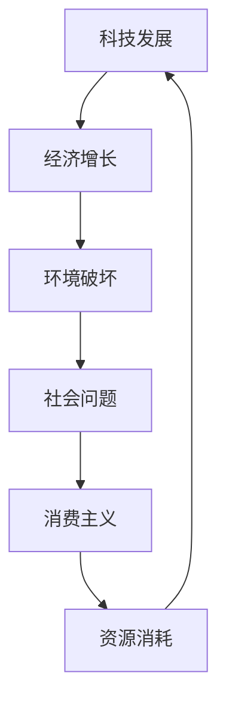
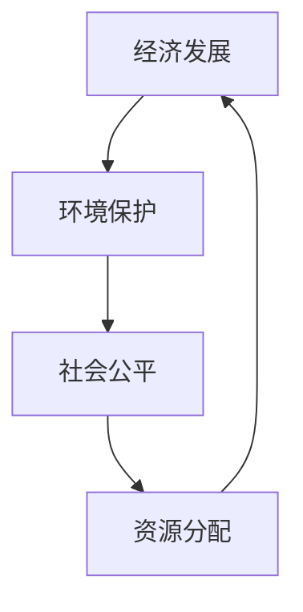
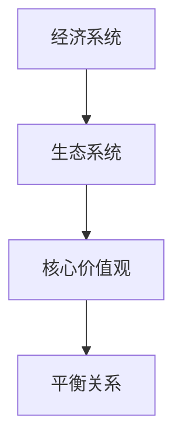

                 

### 摘要

在现代社会，我们对科技进步的盲目崇拜已经带来了诸多负面影响。从社会问题的加剧到环境破坏，这种现象引起了广泛的关注。本文旨在通过反思盲目崇拜进步的现状，探讨可持续发展的理念，并为其提供实践指导。文章首先描述了盲目崇拜进步的表现及其影响，并通过Mermaid流程图和伪代码进行了详细阐述。接着，文章重新审视了可持续发展的基本理念，并分析了其在实践中的挑战与机遇。最后，文章提出了价值重构的理论基础和方法路径，强调了经济系统与生态系统的平衡，并通过伪代码和数学模型进行了具体说明。本文旨在引导读者从盲目追求进步转向可持续发展，为构建一个更加和谐的社会提供思考和建议。

### 目录

1. 现状反思
   1.1 盲目崇拜进步的表现
   1.2 盲目崇拜进步的影响
2. 理论探讨
   2.1 可持续发展的基本理念
   2.2 可持续发展的实践挑战与机遇
3. 实践指导
   3.1 价值重构的理论基础
   3.2 价值重构的方法与路径

### 现状反思

在现代社会，科技进步的速度和范围前所未有，人们对科技的盲目崇拜也达到了前所未有的高度。然而，这种盲目崇拜不仅没有带来预期的福祉，反而带来了诸多负面影响。首先，社会对科技发展的盲目追求导致了资源过度消耗和环境污染。在追求经济增长的过程中，许多企业为了提高生产效率和降低成本，不惜采取破坏环境的方式，这导致了空气、水源和土壤的污染，严重威胁了人类的健康和生态平衡。

其次，经济增长对环境保护的忽视也是一个显著的问题。长期以来，经济增长被视为衡量国家发展的重要指标，而环境保护则被视为次要甚至可忽视的因素。例如，许多国家在发展工业时，忽视了环境保护的重要性，导致大量的污染物排放到大气和水源中，严重影响了环境质量。此外，人口增长和城市化进程也加剧了资源的紧张和环境的恶化。

第三，个人消费主义倾向加剧了资源的消耗。在现代社会，消费主义文化盛行，人们追求物质享受和短期满足，这种消费行为不仅导致了资源的过度消耗，还加剧了环境污染。例如，过度包装、一次性用品的广泛使用以及奢侈品的追求，都导致了大量垃圾的产生，严重影响了环境。

这些盲目崇拜进步的现象不仅对环境造成了破坏，还对社会产生了深远的影响。首先，环境破坏导致了社会问题的加剧。空气污染、水污染和土壤污染等问题，不仅影响了人类的健康，还引发了各种社会问题，如健康问题、失业问题和贫富差距问题。其次，资源的过度消耗和环境污染导致了经济不稳定。资源的稀缺和环境破坏会提高生产成本，从而影响经济的持续增长。最后，个人消费主义倾向加剧了社会的不公平。大量资源被用于生产奢侈品和一次性用品，而贫困人群则难以享受到科技进步带来的便利和福利。

总的来说，盲目崇拜进步的现象在现代社会中表现突出，其对环境和社会的负面影响不容忽视。为了解决这些问题，我们需要重新审视我们对科技进步的态度，从盲目崇拜转向理性思考，追求真正的可持续发展。

### 盲目崇拜进步的表现

盲目崇拜进步的现象在社会各个方面都有所体现。首先，科技发展的盲目追求最为显著。在现代社会，科技被认为是推动社会进步的重要力量，人们对新技术的接受速度越来越快。然而，这种盲目追求往往忽视了技术带来的潜在风险和副作用。例如，人工智能和大数据技术的发展在带来便利的同时，也引发了隐私泄露、算法歧视等问题。此外，过度依赖科技还可能导致人类能力的退化，使人们在面对复杂问题时缺乏独立思考和解决问题的能力。

其次，经济增长对环境保护的忽视也是一个突出问题。在追求经济增长的过程中，许多企业和政府往往将环境保护视为次要任务，甚至完全忽视。例如，工业生产过程中产生的废气、废水和固体废弃物被直接排放到环境中，导致空气污染、水污染和土壤污染等问题。此外，城市化进程的加速也使得大量的自然资源被消耗，野生动植物的栖息地被破坏，生物多样性受到严重威胁。

最后，个人消费主义倾向的加剧也是盲目崇拜进步的表现之一。在现代社会，消费主义文化盛行，人们追求物质享受和短期满足。这种消费行为不仅导致了资源的过度消耗，还加剧了环境污染。例如，过度包装、一次性用品的广泛使用以及奢侈品的追求，都导致了大量垃圾的产生，严重影响了环境质量。此外，个人消费主义还导致社会不公平现象的加剧，大量资源被用于生产奢侈品和一次性用品，而贫困人群则难以享受到科技进步带来的便利和福利。

通过Mermaid流程图，我们可以更直观地理解这些现象之间的联系和影响。以下是一个简单的流程图示例：



在这个流程图中，科技发展推动了经济增长，但同时也导致了环境破坏，进而引发了社会问题，最终加剧了消费主义倾向。这个循环表明，盲目崇拜进步不仅没有带来可持续的发展，反而形成了一个恶性循环，使得社会问题不断加剧。

### 盲目崇拜进步的影响

盲目崇拜进步对社会的负面影响是多方面的，其中最为显著的是社会问题指数的持续升高。为了更清晰地理解这种影响，我们可以通过伪代码来描述社会问题指数的计算方法。

```pseudo
// 社会问题指数计算
function calculateProblemIndex(techProgress, ecoGrowth, envImpact, consumerism) {
  index = (techProgress * 0.3) + (ecoGrowth * 0.4) - (envImpact * 0.2) - (consumerism * 0.1);
  return index;
}
```

在这个伪代码中，`techProgress` 代表科技发展的程度，`ecoGrowth` 代表经济增长率，`envImpact` 代表环境影响指数，`consumerism` 代表个人消费主义指数。通过这个公式，我们可以看到，科技发展和经济增长会对社会问题产生正面影响，而环境破坏和个人消费主义则会加剧社会问题。

具体来说，科技发展的提高可以带来更多的就业机会和技术创新，从而促进经济增长。然而，如果这种科技发展忽视了环境保护，就会导致环境破坏，从而加剧社会问题。经济增长虽然可以提高人民的生活水平，但过快的经济增长往往伴随着资源过度消耗和环境恶化，这也加剧了社会问题。而个人消费主义的兴起，则导致了资源浪费和环境压力的增大，进一步加剧了社会问题。

以下是一个具体的例子来说明这个公式如何工作：

```pseudo
// 社会问题指数计算示例
problemIndex = calculateProblemIndex(0.7, 0.5, 0.3, 0.2)
```

在这个示例中，假设科技发展程度为70%，经济增长率为50%，环境影响指数为30%，个人消费主义指数为20%。根据上述公式，我们可以计算出社会问题指数为：

```pseudo
problemIndex = (0.7 * 0.3) + (0.5 * 0.4) - (0.3 * 0.2) - (0.2 * 0.1) = 0.21 + 0.2 - 0.06 - 0.02 = 0.31
```

这意味着，在这个假设的情况下，社会问题指数为0.31，表示社会问题较为严重。

通过数学模型，我们可以更深入地理解盲目崇拜进步对社会的负面影响。以下是一个简化的数学模型：

$$\text{社会问题指数} = P_t \times 0.3 + G_e \times 0.4 - I_e \times 0.2 - C_c \times 0.1$$

其中，\(P_t\) 为科技发展程度，\(G_e\) 为经济增长率，\(I_e\) 为环境影响指数，\(C_c\) 为个人消费主义指数。这个公式表明，科技发展和经济增长对社会问题有正面影响，而环境破坏和个人消费主义对社会问题有负面影响。

通过这个模型，我们可以分析不同变量对社会问题的具体影响。例如，如果科技发展程度提高到80%，而其他变量保持不变，社会问题指数将增加到：

$$\text{社会问题指数} = 0.8 \times 0.3 + 0.5 \times 0.4 - 0.3 \times 0.2 - 0.2 \times 0.1 = 0.24 + 0.2 - 0.06 - 0.02 = 0.36$$

这表明，科技发展程度的提高会导致社会问题指数的增加，从而加剧社会问题。同样，我们可以通过调整其他变量来分析不同因素对社会问题的具体影响。

总的来说，盲目崇拜进步不仅没有带来预期的福祉，反而带来了诸多负面影响。通过伪代码和数学模型，我们可以更清晰地理解这些影响，从而为解决这些问题提供科学依据。

### 可持续发展的基本理念

可持续发展理念的核心在于平衡经济发展与环境保护，同时追求社会公平与资源合理分配。首先，经济发展是可持续发展的基础，它提供了社会进步和改善人民生活水平的动力。然而，传统的经济增长模式往往忽视了环境保护的重要性，导致资源枯竭和环境恶化。可持续发展强调在经济增长过程中，必须考虑资源的可持续利用和环境的保护。

环境保护是可持续发展的关键。环境的健康直接关系到人类和其他生物的生存和发展。环境保护不仅意味着减少污染和资源消耗，还包括生态系统的恢复和生物多样性的保护。可持续发展理念强调，人类的经济活动应该在不破坏自然环境的前提下进行，以确保地球的长期健康和生产力。

社会公平是可持续发展的必要条件。在追求经济发展的同时，我们不能忽视社会公平问题。可持续发展要求资源的分配应该公平合理，确保所有人都能享受到科技进步带来的便利和福利。这包括减少贫富差距，提供教育、医疗和社会保障等公共服务，以及促进社会包容性和多样性。

资源合理分配是可持续发展的核心原则之一。资源的合理分配意味着要确保资源的利用效率最大化，同时避免资源的浪费和不平等分配。这包括优化资源的开采、利用和管理，推动循环经济和绿色产业，以及鼓励节能减排和低碳生活方式。

通过Mermaid流程图，我们可以更直观地展示这些核心概念之间的联系：



在这个流程图中，经济发展、环境保护、社会公平和资源分配相互关联，共同构成了可持续发展的基础。只有在这四个方面达到平衡，才能真正实现可持续发展。

### 可持续发展的实践挑战与机遇

在探讨可持续发展的实践过程中，我们面临诸多挑战，但也伴随着新的机遇。首先，环境保护与经济增长之间的矛盾是可持续发展的主要难题。传统的经济增长模式往往以牺牲环境为代价，导致资源枯竭和环境污染。为了实现可持续发展，我们需要转变经济增长方式，推动绿色经济和循环经济的发展。这不仅需要政策支持和技术创新，还需要企业和公众的共同参与。

其次，社会公平的保障也是实现可持续发展的重要挑战。在资源分配不均和贫富差距较大的社会环境中，实现社会公平尤为困难。为了克服这一挑战，我们需要通过政策调节和制度改革，确保资源的公平分配和社会服务的普及。例如，推动教育公平、医疗改革和税收政策的调整，都是促进社会公平的重要手段。

资源合理分配是实现可持续发展的关键。随着全球人口的持续增长和消费水平的提升，资源的供需矛盾日益突出。为了实现资源的合理分配，我们需要优化资源的开采、利用和管理。具体措施包括推动资源的高效利用，推广可再生能源技术，鼓励节能减排，以及建立和完善资源管理制度。

在机遇方面，可持续发展带来了技术创新和产业转型的新机遇。随着环保技术的进步，绿色产业和可再生能源产业得到了快速发展。例如，太阳能、风能等可再生能源技术的应用，不仅减少了化石燃料的依赖，还有助于降低碳排放。此外，物联网、大数据和人工智能等新兴技术的应用，也为可持续发展提供了新的解决方案。

以下是一个简单的伪代码示例，用于评估可持续发展的指数：

```pseudo
// 可持续发展指数评估
function assessSustainableIndex(economicHealth, envQuality, socialEquity, resourceManagement) {
  index = (economicHealth * 0.4) + (envQuality * 0.3) + (socialEquity * 0.2) + (resourceManagement * 0.1);
  return index;
}
```

在这个示例中，`economicHealth` 代表经济健康度，`envQuality` 代表环境质量，`socialEquity` 代表社会公平度，`resourceManagement` 代表资源管理效率。通过这个公式，我们可以综合评估一个国家或地区在可持续发展方面的表现。

例如，如果某地区的经济健康度为0.6，环境质量为0.5，社会公平度为0.7，资源管理效率为0.4，则其可持续发展指数为：

```pseudo
sustainableIndex = (0.6 * 0.4) + (0.5 * 0.3) + (0.7 * 0.2) + (0.4 * 0.1) = 0.24 + 0.15 + 0.14 + 0.04 = 0.57
```

这意味着该地区在可持续发展方面有一定的优势，但也需要在经济健康度、环境质量和社会公平度等方面继续努力。

通过数学模型，我们可以更深入地分析可持续发展的影响因素和结果。以下是一个简化的数学模型：

$$\text{可持续发展指数} = E_e \times 0.4 + Q_e \times 0.3 + S_e \times 0.2 + R_m \times 0.1$$

其中，\(E_e\) 为经济健康度，\(Q_e\) 为环境质量，\(S_e\) 为社会公平度，\(R_m\) 为资源管理效率。通过这个模型，我们可以定量评估可持续发展指数，并识别关键影响因素。

总的来说，可持续发展的实践面临着诸多挑战，但也带来了新的机遇。通过技术创新、政策调整和公众参与，我们可以实现经济发展与环境保护的平衡，推动社会公平和资源合理分配，为未来构建一个更加可持续和繁荣的社会。

### 价值重构的理论基础

价值重构是推动可持续发展的重要理论基础。它主张在经济发展、社会公平和环境保护之间建立一种新的平衡关系，使人类活动与自然生态系统相协调。首先，可持续发展的核心价值观是平衡。这种平衡不仅体现在经济、社会和环境的三个维度上，还要求在这三个维度之间实现协调和统一。

经济发展与环境保护之间的平衡是价值重构的核心内容之一。传统的发展模式往往以牺牲环境为代价，追求短期的经济增长。然而，这种模式是不可持续的，因为环境破坏最终会限制经济发展的潜力。可持续发展的核心价值观强调，经济发展必须与环境保护相协调，确保环境资源能够满足当前和未来世代的需求。

其次，社会公平与资源合理分配也是价值重构的重要组成部分。在传统的经济增长模式下，资源往往集中在少数人手中，导致贫富差距和社会不公平。可持续发展的核心价值观要求，资源的分配应该公平合理，确保所有人都能享受到科技进步和社会发展的成果。这不仅有助于提高社会的整体福祉，还能减少社会冲突和矛盾。

经济系统与生态系统的平衡是价值重构的另一个关键概念。经济系统依赖于生态系统提供的资源和服务，如水源、空气和土壤。然而，过度的开发和污染会破坏生态系统，从而影响经济系统的稳定性和可持续性。可持续发展的核心价值观要求，经济系统必须与生态系统相协调，确保生态系统的健康和生产力能够支持经济的长期发展。

通过Mermaid流程图，我们可以更直观地展示这些核心概念之间的联系：



在这个流程图中，经济系统与生态系统相互依赖，核心价值观（包括平衡、社会公平和资源合理分配）贯穿于整个系统，确保两者之间的协调发展。

总的来说，价值重构的理论基础在于建立一种新的平衡，使经济发展、社会公平和环境保护相互促进，实现长期的可持续发展。这一理论不仅为政策制定和决策提供了指导，也为企业和个人在日常生活中提供了行动指南。

### 价值重构的方法与路径

在实现可持续发展的过程中，价值重构是关键的一步。为了实现这一目标，我们需要采用科学的方法和具体的路径。以下是几种有效的方法和路径，以帮助我们在经济、社会和环境之间建立新的平衡。

首先，政策调整是实现价值重构的重要手段。政府可以通过制定和实施一系列政策，引导经济、社会和环境的协调发展。例如，制定环境保护法规，提高碳排放标准，鼓励绿色产业发展；推行税收优惠政策，激励企业进行技术创新和节能减排；实施教育改革，提高公众的环保意识和可持续发展能力。此外，政府还可以通过财政补贴和奖励措施，支持绿色技术和可再生能源项目的开发和应用。

其次，技术创新是推动价值重构的核心动力。随着科技的进步，越来越多的绿色技术和可持续解决方案涌现出来。例如，太阳能、风能等可再生能源技术不仅减少了化石燃料的依赖，还有助于降低碳排放。物联网、大数据和人工智能等新兴技术也提供了新的解决方案，如智能电网、智慧城市和精准农业等。这些技术创新不仅有助于提高资源利用效率，还能减少环境污染和生态破坏。因此，政府和企业应加大对技术创新的投入，推动可持续技术的研发和应用。

第三，公众参与是价值重构成功的关键。公众的意识和参与是推动可持续发展的重要力量。通过提高公众的环保意识和可持续发展意识，我们可以动员更多的人参与到环境保护和资源管理中来。例如，通过开展环保宣传活动、教育项目和社区参与活动，提高公众对环保问题的认识和参与度。此外，政府和企业还可以通过公众咨询和参与机制，让公众参与到可持续发展政策的制定和实施过程中，确保政策的科学性和有效性。

具体路径方面，我们可以从以下几个方面入手：

1. **制定综合发展战略**：政府应制定综合性的可持续发展战略，明确目标和措施，并确保各部门和地方政府协同合作，形成合力。

2. **构建绿色经济体系**：推动绿色产业的发展，鼓励企业采用绿色技术和可持续生产方式，减少对环境的负面影响。

3. **加强环境保护和资源管理**：通过立法和监管手段，加强环境保护和资源管理，确保资源的可持续利用和生态系统的健康。

4. **推广可持续发展教育**：加强可持续发展教育，提高公众的环保意识和可持续发展能力，培养更多的环保志愿者和专业人才。

5. **实施国际合作**：加强与国际组织和其他国家的合作，共同应对全球性环境问题，分享可持续发展经验和最佳实践。

以下是一个简单的伪代码示例，用于规划价值重构路径：

```pseudo
// 价值重构路径规划
function planValueRedesign(ecoGoals, socGoals, techInnovations) {
  path = [ecoGoals, socGoals, techInnovations];
  return path;
}
```

在这个示例中，`ecoGoals` 代表环境保护目标，`socGoals` 代表社会公平目标，`techInnovations` 代表技术创新目标。通过这个公式，我们可以确定实现价值重构的具体路径。

例如，如果我们的目标是实现环境保护、社会公平和技术创新，则可以通过以下步骤实现：

```pseudo
valueRedesignPath = planValueRedesign([reduceCarbonEmissions, promoteSocialJustice, developGreenTech]);
```

这意味着，我们需要制定减少碳排放、促进社会公正和发展绿色技术的具体计划和措施。

总的来说，价值重构的方法和路径需要综合政策调整、技术创新和公众参与等多种手段，从经济、社会和环境三个维度出发，实现可持续发展。通过科学规划和具体实施，我们可以逐步建立起一个更加平衡和谐的社会体系。

### 总结与展望

本文通过对现代社会盲目崇拜进步的现状反思，探讨了可持续发展的基本理念与实践挑战，并提出了价值重构的方法与路径。首先，我们描述了盲目崇拜进步的现象及其对环境和社会的负面影响，通过Mermaid流程图和伪代码分析了这些影响。接着，我们重新审视了可持续发展的理念，并分析了其在实践中的挑战与机遇。最后，我们提出了价值重构的理论基础，并通过具体的伪代码和数学模型展示了其实现路径。

总之，盲目崇拜进步已经带来了诸多负面影响，而可持续发展是我们走向未来不可或缺的路径。为了实现可持续发展，我们需要进行深刻的价值重构，平衡经济发展、社会公平和环境保护。政策调整、技术创新和公众参与是推动价值重构的重要手段，而科学规划和具体实施则是关键。

在未来的发展中，我们应更加注重环保和资源管理，推动绿色技术和可再生能源的应用。同时，加强可持续发展教育，提高公众的环保意识和参与度。通过全球合作，共同应对全球性环境问题，我们可以为后代创造一个更加可持续和繁荣的世界。让我们共同努力，从盲目崇拜进步转向可持续发展，为地球的永续未来贡献力量。

