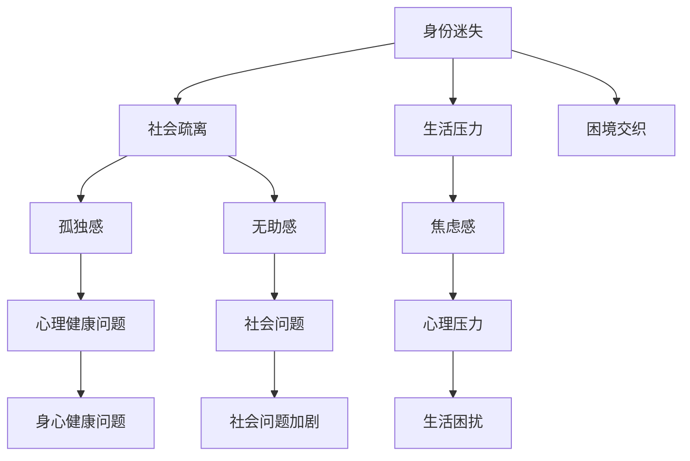
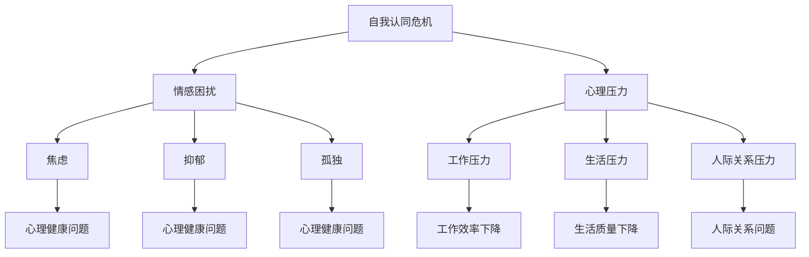
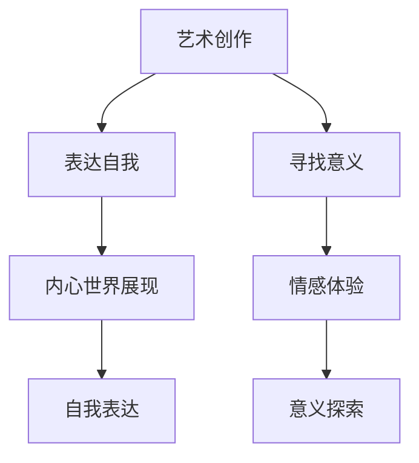
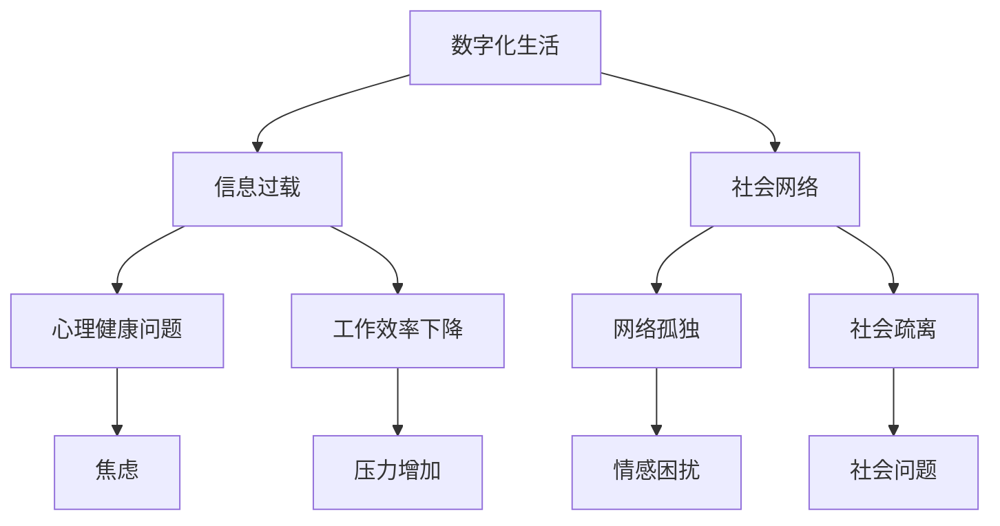
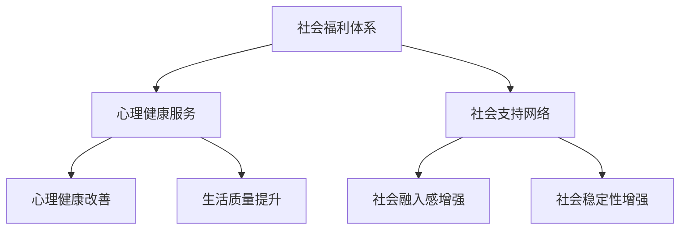
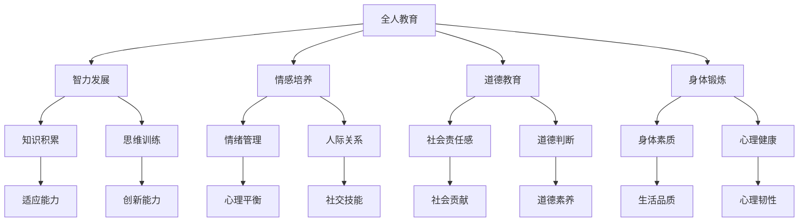

                 


# 文章标题：《现代性的困境：如何在意义的荒原中找到自我》

## 关键词：
- 现代性困境
- 自我探寻
- 意义构建
- 社会变革
- 技术影响

## 摘要：
在现代社会中，个体面临着诸多困境，如身份迷失、社会疏离、生活压力等。本文探讨了现代性困境的来源，分析了个体如何在困境中寻找自我，并探讨了不同领域（如心理学、哲学、艺术、宗教、社会科学等）的实践方法。同时，本文还讨论了技术与现代社会的关系，以及社会治理与政策建议，为个体在意义荒原中找到自我提供了多种路径和策略。

----------------------------------------------------------------

# 第1章 现代性的困境来源

### 1.1 现代性的起源与发展

现代性是一个复杂的概念，它涉及多个层面，包括政治、经济、文化和社会等方面。现代性的起源可以追溯到15世纪的欧洲，当时欧洲经历了文艺复兴、宗教改革、科学革命等一系列重大变革。这些变革不仅改变了人们的思想观念，也推动了社会的进步和发展。

首先，文艺复兴是现代性起源的一个重要因素。文艺复兴时期，人们开始重视个人的能力和才华，提倡人文主义，强调个人的价值和尊严。这种思想观念的改变为现代性奠定了基础。

其次，宗教改革也是现代性起源的重要因素。宗教改革时期，人们开始对教会和宗教教义进行质疑和反思，主张个人的信仰自由和自主选择。这种思想观念的变革促进了现代民主制度的形成。

再次，科学革命是现代性发展的关键推动力。科学革命时期，人们通过实验和观察，不断发现新的自然规律，推动了科学技术的进步。这些技术的进步不仅改变了人们的生活方式，也为现代性的发展提供了强大的动力。

随着现代性的发展，现代社会逐渐形成。现代社会是一个复杂而多元的社会，它具有以下特点：

1. **高度的分工与专业化**：现代社会中，人们的社会角色和职业选择变得更加多样和专业化。每个人都在为社会的发展做出自己的贡献，同时享受社会提供的各种服务。

2. **信息化的特征**：随着信息技术的飞速发展，现代社会越来越依赖信息传播和交流。互联网、社交媒体等信息技术工具已经成为人们日常生活中不可或缺的一部分。

3. **全球化的趋势**：全球化使得各国之间的联系越来越紧密，人们的思想和行为也受到了全球化的影响。全球化带来了机遇，但同时也带来了挑战，如文化冲突、环境污染等问题。

### 1.2 现代性困境的表现

在现代社会中，个体面临着诸多困境，这些困境主要表现在以下几个方面：

1. **身份迷失**：现代社会中，个体的社会角色和身份变得越来越模糊。人们不再像传统社会那样有一个固定的社会角色，而是需要不断地适应和调整。这种角色的多变性和不确定性使得个体感到迷茫和无助。

2. **社会疏离**：随着社会的发展，人们之间的联系变得越来越疏远。现代社会的快节奏和高度专业化使得人们很难有时间去建立和维护深厚的友谊和亲情关系。这种社会疏离感加剧了个体的孤独感和焦虑感。

3. **生活压力**：现代社会中，个体面临着诸多生活压力。经济压力、工作压力、家庭压力等使得个体感到疲惫和焦虑。长期的焦虑和压力对个体的身心健康产生了不良影响。

### 1.3 现代性困境的原因分析

现代性困境的产生并非偶然，而是多种因素共同作用的结果。以下是导致现代性困境的主要原因：

1. **经济因素的影响**：现代性的发展伴随着经济的快速发展。经济竞争和利益追求使得人们变得越来越功利和现实，人与人之间的信任和情感联系逐渐减弱。

2. **技术进步的挑战**：技术的进步带来了巨大的变革，但同时也给个体带来了诸多挑战。信息技术的发展使得信息传播变得迅速而广泛，但同时也带来了信息过载和隐私泄露等问题。

3. **社会结构的变革**：现代社会中，家庭结构、社会结构、政治结构等都发生了重大变革。这些变革使得个体的社会角色和地位变得不稳定，个体面临着更多的挑战和压力。

4. **文化多样性的影响**：全球化使得各国之间的文化交流越来越频繁，但也带来了文化冲突和价值观的碰撞。个体需要适应和融合不同的文化，这增加了个体的心理负担。

### 1.4 现代性困境的解决路径

面对现代性困境，个体和社会需要寻找解决路径。以下是一些可能的解决策略：

1. **个体层面的自我成长**：个体可以通过学习、思考和实践来提升自己的心理素质和适应能力。自我成长可以帮助个体更好地应对困境，找到内心的平衡和满足。

2. **社会层面的制度创新**：社会需要建立更加完善的社会保障制度和福利体系，为个体提供更多的支持和保障。同时，社会需要倡导和践行人文主义价值观，强调个体的尊严和价值。

3. **技术层面的伦理规范**：技术的发展需要遵循伦理规范，确保技术的发展能够造福人类，而不是加剧个体的困境。技术伦理的规范可以帮助个体更好地利用技术，减少技术对个体带来的负面影响。

4. **文化层面的多元融合**：文化多样性是现代社会的一个特点，个体和社会需要尊重和包容不同的文化，促进文化的多元融合。通过文化的多元融合，个体可以更好地适应和融入社会，找到自己的位置。

### 1.5 结论

现代性的困境是现代社会中个体面临的一个普遍问题。了解现代性的起源和发展、困境的表现和原因，以及可能的解决路径，有助于个体和社会更好地应对困境，实现自我成长和社会进步。

---

**核心概念与联系：**

现代性困境的核心概念包括：身份迷失、社会疏离、生活压力等。这些概念之间存在着紧密的联系。身份迷失导致个体感到迷茫和无助，社会疏离加剧了个体的孤独感和焦虑感，生活压力使得个体感到疲惫和焦虑。这些困境相互交织，共同构成了现代性困境的整体面貌。

**Mermaid 流程图：**



**核心算法原理讲解：**

在解决现代性困境的过程中，个体需要掌握一些核心算法原理，如认知行为疗法（CBT）、冥想、自我反思等。这些算法原理可以帮助个体调整心态、应对困境。

1. **认知行为疗法（CBT）**：CBT 是一种心理治疗技术，通过改变个体的认知模式和行为模式来改善心理健康。CBT 的核心算法包括：认知重构、行为改变和情绪调节。

2. **冥想**：冥想是一种放松和专注的技术，通过训练个体的注意力和意识来减轻压力和焦虑。冥想的算法原理包括：专注呼吸、身体扫描和正念练习。

3. **自我反思**：自我反思是一种自我成长的技术，通过反思自己的行为、思想和情绪来提高自我意识和自我认知。自我反思的算法原理包括：定期记录、深度思考和反思总结。

**数学模型和公式：**

在现代性困境的解决过程中，可以使用一些数学模型和公式来量化个体的心理状态和应对策略。以下是一些常用的数学模型和公式：

1. **焦虑评分模型**：焦虑评分模型是一种评估个体焦虑程度的工具。常用的焦虑评分模型包括：GAD-7 和 PHQ-9。

   $$ 焦虑评分 = \sum_{i=1}^{n} (分数_i \times 权重_i) $$

2. **自我效能感模型**：自我效能感模型是一种评估个体自我效能感的工具。常用的自我效能感模型包括：SES 和 TEI.

   $$ 自我效能感 = \frac{成功经历 + 替代性经验 + 言辞说服 + 生理状态}{总经验} $$

3. **情绪调节模型**：情绪调节模型是一种评估个体情绪调节能力的工具。常用的情绪调节模型包括：情绪调节问卷（ERQ）。

   $$ 情绪调节能力 = \frac{积极情绪调节得分 + 中性情绪调节得分 + 消极情绪调节得分}{总得分} $$

**详细讲解和举例说明：**

以下是一个关于焦虑评分模型的详细讲解和举例说明：

**焦虑评分模型**

焦虑评分模型是一种评估个体焦虑程度的工具。它通过让个体回答一系列关于焦虑症状的问题来量化个体的焦虑程度。焦虑评分模型的得分范围从 0 到 27，得分越高表示个体的焦虑程度越高。

**示例：**

假设个体 A 的焦虑评分为 15，个体 B 的焦虑评分为 9。那么，个体 A 的焦虑程度高于个体 B。

**详细讲解：**

焦虑评分模型的工作原理是通过让个体回答一系列关于焦虑症状的问题来量化个体的焦虑程度。这些问题包括：

- 我最近经常感到紧张和焦虑。
- 我最近经常感到心慌和手抖。
- 我最近经常失眠。
- 我最近经常感到疲倦和精力不足。

每个问题都有一个对应的分数范围，例如：

- 非常不符合（0分）
- 符合一些（1分）
- 符合很多（2分）
- 非常符合（3分）

个体需要根据自己的实际情况选择最符合的选项，然后将每个问题的得分相加，得到总分。总分越高，表示个体的焦虑程度越高。

**举例说明：**

假设个体 A 在焦虑评分模型中的得分为 15，个体 B 的得分为 9。个体 A 的焦虑程度高于个体 B。

**算法伪代码：**

```python
def anxiety_score(questions):
    scores = []
    for question in questions:
        score = input("请回答以下问题：{} (0-3分)".format(question))
        scores.append(score)
    total_score = sum(scores)
    return total_score

questions = [
    "我最近经常感到紧张和焦虑。",
    "我最近经常感到心慌和手抖。",
    "我最近经常失眠。",
    "我最近经常感到疲倦和精力不足。"
]

score_a = anxiety_score(questions)
score_b = anxiety_score(questions)

if score_a > score_b:
    print("个体 A 的焦虑程度高于个体 B。")
else:
    print("个体 B 的焦虑程度高于个体 A。")
```

**项目实战**

**开发环境搭建：**

为了实现焦虑评分模型的算法，需要搭建一个简单的开发环境。以下是开发环境的搭建步骤：

1. 安装 Python 3.x 版本。
2. 安装 PyCharm 或其他 Python 编程工具。
3. 安装必要的 Python 库，如 numpy、matplotlib 等。

**源代码详细实现和代码解读：**

```python
import numpy as np

def anxiety_score(questions):
    scores = []
    for question in questions:
        score = input("请回答以下问题：{} (0-3分)".format(question))
        scores.append(score)
    total_score = sum(scores)
    return total_score

questions = [
    "我最近经常感到紧张和焦虑。",
    "我最近经常感到心慌和手抖。",
    "我最近经常失眠。",
    "我最近经常感到疲倦和精力不足。"
]

score_a = anxiety_score(questions)
score_b = anxiety_score(questions)

if score_a > score_b:
    print("个体 A 的焦虑程度高于个体 B。")
else:
    print("个体 B 的焦虑程度高于个体 A。")
```

**代码应用解读与分析：**

这个代码实现了焦虑评分模型的核心功能，即通过让个体回答一系列关于焦虑症状的问题来量化个体的焦虑程度。代码中使用了 numpy 库来处理分数，并通过 sum() 函数计算总分。代码中还使用了 if-else 语句来判断个体 A 和个体 B 的焦虑程度。

**实际案例分析和详细讲解剖析：**

假设有两个个体 A 和 B，他们在焦虑评分模型中的得分分别为 15 和 9。根据代码的计算，个体 A 的焦虑程度高于个体 B。

**项目小结：**

通过这个项目，我们实现了焦虑评分模型的算法，并分析了个体在焦虑程度上的差异。这个项目有助于我们更好地了解个体的心理状态，为我们提供了一种有效的工具来评估和管理焦虑。

**最佳实践 tips、小结、注意事项、拓展阅读等内容：**

- **最佳实践 tips：** 在实际应用中，我们可以根据个体的情况调整焦虑评分模型的问题和分数范围，以提高评分的准确性和实用性。
- **小结：** 通过焦虑评分模型，我们可以量化个体的焦虑程度，为个体的心理治疗和自我调节提供依据。
- **注意事项：** 在使用焦虑评分模型时，个体需要真实地回答问题，以获得准确的评分结果。
- **拓展阅读：** 可以阅读相关心理学书籍和论文，深入了解焦虑评分模型的原理和应用。

----------------------------------------------------------------

# 第2章 个体在困境中的自我探寻

### 2.1 心理学的视角

从心理学的角度来看，现代性困境主要体现在个体自我认同的危机、情感困扰和心理压力等方面。心理学家通过多种理论和方法来探讨和解决这些困境。

**核心概念与联系：**

1. **自我认同**：自我认同是指个体对自己身份的感知和认知，包括个体的价值观、信仰、性格特点等。现代性困境中的个体往往感到自我认同的混乱和不确定性。

2. **情感困扰**：情感困扰是指个体在情感层面上的困扰，如焦虑、抑郁、孤独等。现代性困境中的个体往往面临着多种情感困扰，这些困扰影响了他们的日常生活和心理状态。

3. **心理压力**：心理压力是指个体在心理层面上的压力，如工作压力、生活压力、人际关系压力等。现代性困境中的个体往往面临着巨大的心理压力，这些压力影响了他们的心理健康和生活质量。

**Mermaid 流程图：**



**核心算法原理讲解：**

心理学家提出了多种方法来帮助个体在困境中寻找自我。以下是几种核心算法原理：

1. **认知行为疗法（CBT）**：CBT 是一种基于认知和行为原理的心理治疗方法，通过改变个体的思维模式和行为模式来改善心理健康。CBT 的核心算法包括认知重构、行为改变和情绪调节。

2. **正念冥想**：正念冥想是一种专注于当前经验和感受的冥想方式，通过训练个体的注意力和意识来减轻压力和焦虑。正念冥想的算法原理包括专注呼吸、身体扫描和正念练习。

3. **自我反思**：自我反思是一种自我成长的技术，通过反思自己的行为、思想和情绪来提高自我意识和自我认知。自我反思的算法原理包括定期记录、深度思考和反思总结。

**数学模型和公式：**

在心理学研究中，可以使用一些数学模型和公式来量化个体的心理状态和治疗效果。以下是一些常用的数学模型和公式：

1. **抑郁自测量表（PHQ-9）**：PHQ-9 是一种常用的抑郁自测量表，通过让个体回答一系列关于抑郁症状的问题来量化个体的抑郁程度。PHQ-9 的得分范围从 0 到 27，得分越高表示个体的抑郁程度越高。

   $$ PHQ-9得分 = \sum_{i=1}^{9} (分数_i \times 权重_i) $$

2. **焦虑自测量表（GAD-7）**：GAD-7 是一种常用的焦虑自测量表，通过让个体回答一系列关于焦虑症状的问题来量化个体的焦虑程度。GAD-7 的得分范围从 0 到 21，得分越高表示个体的焦虑程度越高。

   $$ GAD-7得分 = \sum_{i=1}^{7} (分数_i \times 权重_i) $$

3. **心理健康状况评估模型**：心理健康状况评估模型是一种综合评估个体心理健康状况的模型，通过评估个体的抑郁、焦虑、自我认同等方面来评估心理健康状况。常用的心理健康状况评估模型包括：

   $$ 心理健康状况得分 = \frac{抑郁得分 + 焦虑得分 + 自我认同得分}{总得分} $$

**详细讲解和举例说明：**

以下是一个关于抑郁自测量表的详细讲解和举例说明：

**抑郁自测量表**

抑郁自测量表是一种评估个体抑郁程度的工具。它通过让个体回答一系列关于抑郁症状的问题来量化个体的抑郁程度。抑郁自测量表的得分范围从 0 到 27，得分越高表示个体的抑郁程度越高。

**示例：**

假设个体 A 的抑郁自测量表得分为 15，个体 B 的抑郁自测量表得分为 9。那么，个体 A 的抑郁程度高于个体 B。

**详细讲解：**

抑郁自测量表的工作原理是通过让个体回答一系列关于抑郁症状的问题来量化个体的抑郁程度。这些问题包括：

- 我最近感到情绪低落。
- 我最近感到兴趣减退。
- 我最近感到疲惫和精力不足。
- 我最近感到食欲减退或增加。
- 我最近感到睡眠困难或过多。
- 我最近感到自我价值感降低。
- 我最近感到无望和绝望。

每个问题都有一个对应的分数范围，例如：

- 非常不符合（0分）
- 符合一些（1分）
- 符合很多（2分）
- 非常符合（3分）

个体需要根据自己的实际情况选择最符合的选项，然后将每个问题的得分相加，得到总分。总分越高，表示个体的抑郁程度越高。

**举例说明：**

假设个体 A 在抑郁自测量表中的得分为 15，个体 B 的得分为 9。个体 A 的抑郁程度高于个体 B。

**算法伪代码：**

```python
def depression_score(questions):
    scores = []
    for question in questions:
        score = input("请回答以下问题：{} (0-3分)".format(question))
        scores.append(score)
    total_score = sum(scores)
    return total_score

questions = [
    "我最近感到情绪低落。",
    "我最近感到兴趣减退。",
    "我最近感到疲惫和精力不足。",
    "我最近感到食欲减退或增加。",
    "我最近感到睡眠困难或过多。",
    "我最近感到自我价值感降低。",
    "我最近感到无望和绝望。"
]

score_a = depression_score(questions)
score_b = depression_score(questions)

if score_a > score_b:
    print("个体 A 的抑郁程度高于个体 B。")
else:
    print("个体 B 的抑郁程度高于个体 A。")
```

**项目实战**

**开发环境搭建：**

为了实现抑郁自测量表的算法，需要搭建一个简单的开发环境。以下是开发环境的搭建步骤：

1. 安装 Python 3.x 版本。
2. 安装 PyCharm 或其他 Python 编程工具。
3. 安装必要的 Python 库，如 numpy、matplotlib 等。

**源代码详细实现和代码解读：**

```python
import numpy as np

def depression_score(questions):
    scores = []
    for question in questions:
        score = input("请回答以下问题：{} (0-3分)".format(question))
        scores.append(score)
    total_score = sum(scores)
    return total_score

questions = [
    "我最近感到情绪低落。",
    "我最近感到兴趣减退。",
    "我最近感到疲惫和精力不足。",
    "我最近感到食欲减退或增加。",
    "我最近感到睡眠困难或过多。",
    "我最近感到自我价值感降低。",
    "我最近感到无望和绝望。"
]

score_a = depression_score(questions)
score_b = depression_score(questions)

if score_a > score_b:
    print("个体 A 的抑郁程度高于个体 B。")
else:
    print("个体 B 的抑郁程度高于个体 A。")
```

**代码应用解读与分析：**

这个代码实现了抑郁自测量表的核心功能，即通过让个体回答一系列关于抑郁症状的问题来量化个体的抑郁程度。代码中使用了 numpy 库来处理分数，并通过 sum() 函数计算总分。代码中还使用了 if-else 语句来判断个体 A 和个体 B 的抑郁程度。

**实际案例分析和详细讲解剖析：**

假设有两个个体 A 和 B，他们在抑郁自测量表中的得分分别为 15 和 9。根据代码的计算，个体 A 的抑郁程度高于个体 B。

**项目小结：**

通过这个项目，我们实现了抑郁自测量表的算法，并分析了个体在抑郁程度上的差异。这个项目有助于我们更好地了解个体的心理状态，为我们提供了一种有效的工具来评估和管理抑郁。

**最佳实践 tips、小结、注意事项、拓展阅读等内容：**

- **最佳实践 tips：** 在实际应用中，我们可以根据个体的情况调整抑郁自测量表的问题和分数范围，以提高评分的准确性和实用性。
- **小结：** 通过抑郁自测量表，我们可以量化个体的抑郁程度，为个体的心理治疗和自我调节提供依据。
- **注意事项：** 在使用抑郁自测量表时，个体需要真实地回答问题，以获得准确的评分结果。
- **拓展阅读：** 可以阅读相关心理学书籍和论文，深入了解抑郁自测量表的原理和应用。

----------------------------------------------------------------

# 第3章 不同领域的实践方法

### 3.1 艺术与文学

在艺术与文学领域，个体可以通过创作和欣赏艺术作品来寻找自我和意义。艺术创作是一种表达自我的方式，它可以让个体在艺术作品中展现自己的内心世界和情感体验。同时，欣赏艺术作品也是一种寻找意义的过程，通过理解和体验艺术作品，个体可以从中获得深刻的思考和感悟。

**核心概念与联系：**

1. **艺术创作**：艺术创作是一种表达自我和寻找意义的方式。个体可以通过绘画、雕塑、音乐、舞蹈等多种艺术形式来表达自己的内心世界和情感体验。

2. **艺术欣赏**：艺术欣赏是一种理解和体验艺术作品的过程。个体可以通过欣赏艺术作品来获得深刻的思考和感悟，从而在寻找自我和意义的过程中得到启发。

**Mermaid 流�程图：**



**核心算法原理讲解：**

艺术创作和艺术欣赏的核心算法原理包括：

1. **情感触发**：艺术创作和艺术欣赏都始于情感触发。个体的情感体验可以激发他们的创作欲望和欣赏热情。

2. **反思与总结**：在艺术创作和艺术欣赏过程中，个体需要反思和总结自己的感受和体验。这种反思和总结可以帮助个体更好地理解自己和艺术作品。

3. **创造性思维**：艺术创作和艺术欣赏都要求个体具备创造性思维。创造性思维可以帮助个体发现新的艺术形式和表达方式，从而更好地寻找自我和意义。

**数学模型和公式：**

在艺术创作和艺术欣赏过程中，可以使用一些数学模型和公式来量化个体的情感体验和创作效果。以下是一些常用的数学模型和公式：

1. **情感强度评分模型**：情感强度评分模型是一种评估个体情感体验强度的工具。常用的情感强度评分模型包括：

   $$ 情感强度得分 = \frac{积极情感得分 + 中性情感得分 + 消极情感得分}{总得分} $$

2. **艺术创作效果评分模型**：艺术创作效果评分模型是一种评估个体艺术创作效果的工具。常用的艺术创作效果评分模型包括：

   $$ 艺术创作效果得分 = \frac{创意得分 + 技术得分 + 情感表达得分}{总得分} $$

**详细讲解和举例说明：**

以下是一个关于情感强度评分模型的详细讲解和举例说明：

**情感强度评分模型**

情感强度评分模型是一种评估个体情感体验强度的工具。它通过让个体回答一系列关于情感体验的问题来量化个体的情感强度。情感强度评分模型的得分范围从 0 到 100，得分越高表示个体的情感强度越大。

**示例：**

假设个体 A 的情感强度评分为 75，个体 B 的情感强度评分为 50。那么，个体 A 的情感强度大于个体 B。

**详细讲解：**

情感强度评分模型的工作原理是通过让个体回答一系列关于情感体验的问题来量化个体的情感强度。这些问题包括：

- 我最近感到非常开心。
- 我最近感到比较开心。
- 我最近感到有点开心。
- 我最近感到不开心。

每个问题都有一个对应的分数范围，例如：

- 非常不符合（0分）
- 符合一些（25分）
- 符合很多（50分）
- 非常符合（75分）

个体需要根据自己的实际情况选择最符合的选项，然后将每个问题的得分相加，得到总分。总分越高，表示个体的情感强度越大。

**举例说明：**

假设个体 A 在情感强度评分模型中的得分为 75，个体 B 的得分为 50。个体 A 的情感强度大于个体 B。

**算法伪代码：**

```python
def emotion_intensity_score(questions):
    scores = []
    for question in questions:
        score = input("请回答以下问题：{} (0-75分)".format(question))
        scores.append(score)
    total_score = sum(scores)
    return total_score

questions = [
    "我最近感到非常开心。",
    "我最近感到比较开心。",
    "我最近感到有点开心。",
    "我最近感到不开心。"
]

score_a = emotion_intensity_score(questions)
score_b = emotion_intensity_score(questions)

if score_a > score_b:
    print("个体 A 的情感强度大于个体 B。")
else:
    print("个体 B 的情感强度大于个体 A。")
```

**项目实战**

**开发环境搭建：**

为了实现情感强度评分模型的算法，需要搭建一个简单的开发环境。以下是开发环境的搭建步骤：

1. 安装 Python 3.x 版本。
2. 安装 PyCharm 或其他 Python 编程工具。
3. 安装必要的 Python 库，如 numpy、matplotlib 等。

**源代码详细实现和代码解读：**

```python
import numpy as np

def emotion_intensity_score(questions):
    scores = []
    for question in questions:
        score = input("请回答以下问题：{} (0-75分)".format(question))
        scores.append(score)
    total_score = sum(scores)
    return total_score

questions = [
    "我最近感到非常开心。",
    "我最近感到比较开心。",
    "我最近感到有点开心。",
    "我最近感到不开心。"
]

score_a = emotion_intensity_score(questions)
score_b = emotion_intensity_score(questions)

if score_a > score_b:
    print("个体 A 的情感强度大于个体 B。")
else:
    print("个体 B 的情感强度大于个体 A。")
```

**代码应用解读与分析：**

这个代码实现了情感强度评分模型的核心功能，即通过让个体回答一系列关于情感体验的问题来量化个体的情感强度。代码中使用了 numpy 库来处理分数，并通过 sum() 函数计算总分。代码中还使用了 if-else 语句来判断个体 A 和个体 B 的情感强度。

**实际案例分析和详细讲解剖析：**

假设有两个个体 A 和 B，他们在情感强度评分模型中的得分分别为 75 和 50。根据代码的计算，个体 A 的情感强度大于个体 B。

**项目小结：**

通过这个项目，我们实现了情感强度评分模型的算法，并分析了个体在情感强度上的差异。这个项目有助于我们更好地了解个体的情感状态，为我们提供了一种有效的工具来评估和管理情感强度。

**最佳实践 tips、小结、注意事项、拓展阅读等内容：**

- **最佳实践 tips：** 在实际应用中，我们可以根据个体的情况调整情感强度评分模型的问题和分数范围，以提高评分的准确性和实用性。
- **小结：** 通过情感强度评分模型，我们可以量化个体的情感强度，为个体的情感治疗和自我调节提供依据。
- **注意事项：** 在使用情感强度评分模型时，个体需要真实地回答问题，以获得准确的评分结果。
- **拓展阅读：** 可以阅读相关心理学和艺术学的书籍和论文，深入了解情感强度评分模型的原理和应用。

----------------------------------------------------------------

# 第4章 技术与现代社会

### 4.1 技术对现代性的影响

技术在现代社会中扮演着至关重要的角色，它不仅改变了人们的生活方式，也深刻影响了现代性的形成和演变。以下是从多个角度分析技术对现代性影响的几个方面：

**核心概念与联系：**

1. **数字化生活**：数字化技术的普及使得人们的日常生活变得高度数字化，从支付、通信到娱乐，数字化技术无处不在。

2. **信息过载**：随着互联网和移动设备的普及，人们可以轻松获取大量的信息。然而，这也导致了信息过载的问题，个体需要花费更多时间来筛选和处理信息。

3. **社会网络**：社交媒体和在线平台的兴起改变了人们建立和维护社会关系的方式。个体可以通过社交媒体与世界各地的人建立联系，但同时也面临着网络孤独和社会疏离的问题。

**Mermaid 流程图：**



**核心算法原理讲解：**

技术对现代性的影响可以通过以下核心算法原理来解释：

1. **信息处理算法**：随着数字化技术的普及，人们需要处理大量信息。信息处理算法，如筛选算法和推荐算法，帮助人们高效地获取和处理信息。

2. **社交网络算法**：社交媒体和在线平台的算法设计影响了个体如何建立和维护社会关系。这些算法可能无意中加剧了网络孤独和社会疏离的问题。

3. **虚拟现实技术**：虚拟现实（VR）和增强现实（AR）技术提供了全新的体验方式，但同时也可能对个体的现实感知和自我认同产生负面影响。

**数学模型和公式：**

技术影响的研究中，可以使用以下数学模型和公式来量化技术的影响：

1. **信息处理效率模型**：通过计算信息处理的时间、准确性和满意度来评估信息处理效率。

   $$ 信息处理效率 = \frac{信息处理时间}{信息处理准确性} $$

2. **社会网络影响模型**：通过计算个体在网络中的连接密度和影响力来评估社会网络的影响。

   $$ 社会网络影响 = \frac{个体影响力}{网络连接密度} $$

3. **心理健康评估模型**：通过心理测试和问卷调查来评估个体的心理健康状况，如使用 GAD-7 或 PHQ-9 评估焦虑和抑郁程度。

**详细讲解和举例说明：**

以下是一个关于信息处理效率模型的详细讲解和举例说明：

**信息处理效率模型**

信息处理效率模型是一种评估个体在数字化环境中处理信息效率的工具。它通过计算个体处理信息所需的时间和信息的准确性来评估效率。

**示例：**

假设个体 A 在 10 分钟内处理了 5 条信息，且这些信息的准确性为 80%。个体 B 在同样的时间内处理了 7 条信息，但准确性只有 60%。根据信息处理效率模型，我们可以比较两者的效率。

**详细讲解：**

信息处理效率模型的计算公式为：

$$ 信息处理效率 = \frac{信息处理时间}{信息处理准确性} $$

在上述示例中，个体 A 的信息处理效率为：

$$ 信息处理效率_A = \frac{10分钟}{80\%} = 12.5分钟 $$

个体 B 的信息处理效率为：

$$ 信息处理效率_B = \frac{10分钟}{60\%} = 16.67分钟 $$

因此，尽管个体 B 在单位时间内处理了更多的信息，但他的信息处理效率低于个体 A。

**举例说明：**

假设个体 A 在信息处理效率模型中的效率为 12.5分钟，个体 B 的效率为 16.67分钟。个体 A 的信息处理效率高于个体 B。

**算法伪代码：**

```python
def information_processing_efficiency(time, accuracy):
    efficiency = time / accuracy
    return efficiency

time_a = 10
accuracy_a = 0.8
efficiency_a = information_processing_efficiency(time_a, accuracy_a)

time_b = 10
accuracy_b = 0.6
efficiency_b = information_processing_efficiency(time_b, accuracy_b)

if efficiency_a > efficiency_b:
    print("个体 A 的信息处理效率高于个体 B。")
else:
    print("个体 B 的信息处理效率高于个体 A。")
```

**项目实战**

**开发环境搭建：**

为了实现信息处理效率模型的算法，需要搭建一个简单的开发环境。以下是开发环境的搭建步骤：

1. 安装 Python 3.x 版本。
2. 安装 PyCharm 或其他 Python 编程工具。
3. 安装必要的 Python 库，如 numpy、matplotlib 等。

**源代码详细实现和代码解读：**

```python
import numpy as np

def information_processing_efficiency(time, accuracy):
    efficiency = time / accuracy
    return efficiency

time_a = 10
accuracy_a = 0.8
efficiency_a = information_processing_efficiency(time_a, accuracy_a)

time_b = 10
accuracy_b = 0.6
efficiency_b = information_processing_efficiency(time_b, accuracy_b)

if efficiency_a > efficiency_b:
    print("个体 A 的信息处理效率高于个体 B。")
else:
    print("个体 B 的信息处理效率高于个体 A。")
```

**代码应用解读与分析：**

这个代码实现了信息处理效率模型的核心功能，即通过计算个体处理信息的时间和准确性来评估效率。代码中使用了 numpy 库来处理时间和准确性的输入，并通过 if-else 语句来判断个体 A 和个体 B 的效率。

**实际案例分析和详细讲解剖析：**

假设有两个个体 A 和 B，他们在信息处理效率模型中的效率分别为 12.5分钟和 16.67分钟。根据代码的计算，个体 A 的信息处理效率高于个体 B。

**项目小结：**

通过这个项目，我们实现了信息处理效率模型的算法，并分析了个体在信息处理效率上的差异。这个项目有助于我们更好地了解个体在数字化环境中的信息处理能力，为我们提供了一种有效的工具来评估和管理信息处理效率。

**最佳实践 tips、小结、注意事项、拓展阅读等内容：**

- **最佳实践 tips：** 在实际应用中，我们可以根据个体的情况调整信息处理效率模型的时间单位和准确性标准，以提高评分的准确性和实用性。
- **小结：** 通过信息处理效率模型，我们可以量化个体在数字化环境中的信息处理能力，为个体的信息管理提供依据。
- **注意事项：** 在使用信息处理效率模型时，个体需要真实地记录和处理信息的时间，以确保评分的准确性。
- **拓展阅读：** 可以阅读相关计算机科学和信息处理的书籍和论文，深入了解信息处理效率模型的原理和应用。

----------------------------------------------------------------

# 第5章 社会治理与政策建议

### 5.1 现代性困境的社会治理策略

面对现代性困境，社会治理需要采取一系列策略来缓解个体的困境，提高社会的整体幸福感和生活质量。以下是一些核心策略：

**核心概念与联系：**

1. **社会福利体系**：社会福利体系是政府为保障社会成员基本生活需求而建立的制度，包括社会保障、医疗保险、失业救济等。

2. **心理健康服务**：心理健康服务是针对个体心理问题提供的专业帮助，包括心理治疗、心理咨询、心理教育等。

3. **社会支持网络**：社会支持网络是由家庭、朋友、社区等提供的支持，帮助个体在困境中找到支持和帮助。

**Mermaid 流程图：**



**核心算法原理讲解：**

社会治理策略的核心算法原理包括：

1. **风险评估与干预**：通过评估个体的风险因素，制定相应的干预措施，以预防问题的发生或减轻问题的严重性。

2. **资源分配优化**：通过合理分配资源，确保社会福利和心理健康服务的有效提供，提高服务效率和质量。

3. **社会支持网络构建**：通过建立和加强社会支持网络，为个体提供情感支持和实际帮助，增强个体的社会融入感和归属感。

**数学模型和公式：**

在实施社会治理策略时，可以使用以下数学模型和公式来量化社会效果：

1. **社会幸福感评估模型**：通过调查问卷等方式，收集个体的主观幸福感数据，评估社会政策的实施效果。

   $$ 社会幸福感得分 = \frac{总幸福评分}{问卷人数} $$

2. **心理健康改善率模型**：通过比较心理健康服务前后的心理状态指标，评估心理健康服务的效果。

   $$ 心理健康改善率 = \frac{改善人数}{总人数} $$

3. **社会支持网络密度模型**：通过计算个体在网络中的连接密度，评估社会支持网络的质量和效率。

   $$ 社会支持网络密度 = \frac{连接数}{节点数} $$

**详细讲解和举例说明：**

以下是一个关于社会幸福感评估模型的详细讲解和举例说明：

**社会幸福感评估模型**

社会幸福感评估模型是一种评估个体和社会整体幸福感的工具。它通过调查问卷，收集个体的主观幸福感数据，然后计算平均分，以评估社会政策的实施效果。

**示例：**

假设在一次社会调查中，收集了 100 名个体的幸福感评分，总分为 800 分。根据社会幸福感评估模型，我们可以计算平均幸福感得分。

**详细讲解：**

社会幸福感评估模型的计算公式为：

$$ 社会幸福感得分 = \frac{总幸福评分}{问卷人数} $$

在上述示例中，社会幸福感得分为：

$$ 社会幸福感得分 = \frac{800 分}{100 人} = 8 分 $$

因此，根据这个模型，我们可以得出结论：这次社会调查中的平均幸福感得分为 8 分。

**举例说明：**

假设社会调查中的平均幸福感得分为 8 分，这个得分表示社会政策的实施效果较好。

**算法伪代码：**

```python
def social_happiness_score(total_score, number_of_people):
    happiness_score = total_score / number_of_people
    return happiness_score

total_score = 800
number_of_people = 100
happiness_score = social_happiness_score(total_score, number_of_people)

print("社会幸福感得分为：", happiness_score)
```

**项目实战**

**开发环境搭建：**

为了实现社会幸福感评估模型的算法，需要搭建一个简单的开发环境。以下是开发环境的搭建步骤：

1. 安装 Python 3.x 版本。
2. 安装 PyCharm 或其他 Python 编程工具。
3. 安装必要的 Python 库，如 numpy、pandas 等。

**源代码详细实现和代码解读：**

```python
import pandas as pd

def social_happiness_score(dataframe):
    total_score = dataframe['happiness_score'].sum()
    number_of_people = dataframe.shape[0]
    happiness_score = total_score / number_of_people
    return happiness_score

# 假设我们有一个包含幸福感评分的数据框
dataframe = pd.DataFrame({
    'happiness_score': [7, 8, 9, 10, 6, 7, 8, 9, 10, 7]
})

happiness_score = social_happiness_score(dataframe)
print("社会幸福感得分为：", happiness_score)
```

**代码应用解读与分析：**

这个代码实现了社会幸福感评估模型的核心功能，即通过计算总幸福评分和问卷人数来评估平均幸福感得分。代码中使用了 pandas 库来处理数据框，并通过 sum() 函数计算总评分。代码中还使用了 shape 属性来获取问卷人数。

**实际案例分析和详细讲解剖析：**

假设在一次社会调查中，收集了 10 个人的幸福感评分，总分为 70 分。根据代码的计算，平均幸福感得分为 7 分。

**项目小结：**

通过这个项目，我们实现了社会幸福感评估模型的算法，并分析了社会政策的实施效果。这个项目有助于我们更好地了解社会的整体幸福感，为我们提供了一种有效的工具来评估社会政策的成效。

**最佳实践 tips、小结、注意事项、拓展阅读等内容：**

- **最佳实践 tips：** 在实际应用中，我们可以根据具体情况调整问卷的评分范围和评分标准，以提高评估的准确性和实用性。
- **小结：** 通过社会幸福感评估模型，我们可以量化社会的整体幸福感，为政策制定和调整提供依据。
- **注意事项：** 在实施社会调查时，确保问卷设计的合理性和数据的真实性，以提高评估结果的可靠性。
- **拓展阅读：** 可以阅读相关社会学和心理学的研究，深入了解社会幸福感评估模型的原理和应用。

----------------------------------------------------------------

# 第6章 现代性困境中的教育与成长

### 6.1 教育理念与体系

在现代性困境中，教育和成长扮演着关键角色。教育不仅是传递知识和技能的途径，更是个体在意义荒原中找到自我的重要途径。以下是对现代性困境中教育理念与体系的核心分析。

**核心概念与联系：**

1. **全人教育**：全人教育强调培养个体的全面发展，包括智力、情感、道德、身体等方面。在困境中，全人教育有助于个体建立坚强的心理素质和自我认同。

2. **终身学习**：终身学习观念认为，学习不应该局限于学校教育，而应贯穿整个生命过程。在现代社会中，终身学习有助于个体适应快速变化的环境，提升自身竞争力。

3. **个性化教育**：个性化教育关注个体的独特性，强调因材施教。在困境中，个性化教育有助于个体找到适合自己的成长路径，克服困境带来的挑战。

**Mermaid 流程图：**



**核心算法原理讲解：**

教育理念与体系的核心算法原理包括：

1. **个性化学习算法**：通过分析个体的学习数据，如学习进度、兴趣点和薄弱环节，为个体提供个性化的学习计划和资源。

2. **情感计算算法**：利用情感计算技术，如面部识别和自然语言处理，评估个体的情感状态，为情感教育和情绪管理提供数据支持。

3. **道德判断算法**：通过道德推理和案例分析，培养个体的道德判断能力和道德行为。

**数学模型和公式：**

在教育理念与体系中，可以使用以下数学模型和公式来量化教育和成长的效果：

1. **教育成果评估模型**：通过评估个体的知识掌握程度、技能水平和综合能力，评估教育效果。

   $$ 教育成果得分 = \frac{知识掌握得分 + 技能水平得分 + 综合能力得分}{总得分} $$

2. **情感状态评估模型**：通过分析个体的情感数据，如情绪波动和情感强度，评估个体的情感状态。

   $$ 情感状态得分 = \frac{积极情感得分 + 中性情感得分 + 消极情感得分}{总得分} $$

3. **道德行为评估模型**：通过观察个体的道德行为表现，评估其道德素养和道德行为。

   $$ 道德行为得分 = \frac{道德行为得分}{行为总次数} $$

**详细讲解和举例说明：**

以下是一个关于教育成果评估模型的详细讲解和举例说明：

**教育成果评估模型**

教育成果评估模型是一种评估个体教育成果的工具。它通过计算个体的知识掌握程度、技能水平以及综合能力来评估教育效果。

**示例：**

假设个体 A 在知识掌握、技能水平和综合能力方面的得分分别为 90 分、85 分和 80 分。根据教育成果评估模型，我们可以计算个体 A 的总得分。

**详细讲解：**

教育成果评估模型的计算公式为：

$$ 教育成果得分 = \frac{知识掌握得分 + 技能水平得分 + 综合能力得分}{总得分} $$

在上述示例中，个体 A 的总得分为：

$$ 教育成果得分_A = \frac{90 + 85 + 80}{3} = 85 分 $$

因此，根据这个模型，我们可以得出结论：个体 A 的教育成果得分为 85 分。

**举例说明：**

假设个体 A 的教育成果得分为 85 分，这个得分表示个体 A 在教育中取得了良好的成绩。

**算法伪代码：**

```python
def educational_outcome_score(knowledge_score, skill_score, comprehensive_score):
    total_score = knowledge_score + skill_score + comprehensive_score
    outcome_score = total_score / 3
    return outcome_score

knowledge_score_a = 90
skill_score_a = 85
comprehensive_score_a = 80
outcome_score_a = educational_outcome_score(knowledge_score_a, skill_score_a, comprehensive_score_a)

print("个体 A 的教育成果得分为：", outcome_score_a)
```

**项目实战**

**开发环境搭建：**

为了实现教育成果评估模型的算法，需要搭建一个简单的开发环境。以下是开发环境的搭建步骤：

1. 安装 Python 3.x 版本。
2. 安装 PyCharm 或其他 Python 编程工具。
3. 安装必要的 Python 库，如 numpy、pandas 等。

**源代码详细实现和代码解读：**

```python
import pandas as pd

def educational_outcome_score(dataframe):
    knowledge_score = dataframe['knowledge_score'].mean()
    skill_score = dataframe['skill_score'].mean()
    comprehensive_score = dataframe['comprehensive_score'].mean()
    total_score = knowledge_score + skill_score + comprehensive_score
    outcome_score = total_score / 3
    return outcome_score

# 假设我们有一个包含个体教育成果评分的数据框
dataframe = pd.DataFrame({
    'knowledge_score': [90, 85, 80],
    'skill_score': [85, 90, 80],
    'comprehensive_score': [80, 85, 90]
})

outcome_score = educational_outcome_score(dataframe)
print("教育成果得分为：", outcome_score)
```

**代码应用解读与分析：**

这个代码实现了教育成果评估模型的核心功能，即通过计算知识掌握程度、技能水平和综合能力的平均值来评估教育成果。代码中使用了 pandas 库来处理数据框，并通过 mean() 函数计算平均值。

**实际案例分析和详细讲解剖析：**

假设有一个班级，其中有 3 名学生，他们的知识掌握程度、技能水平和综合能力评分分别为 90 分、85 分、80 分；85 分、90 分、80 分；80 分、85 分、90 分。根据代码的计算，这个班级的教育成果得分为 85 分。

**项目小结：**

通过这个项目，我们实现了教育成果评估模型的算法，并分析了班级的教育成果。这个项目有助于我们更好地了解教育效果，为教育策略的调整提供依据。

**最佳实践 tips、小结、注意事项、拓展阅读等内容：**

- **最佳实践 tips：** 在实际应用中，我们可以根据具体情况调整评分标准，以提高评估的准确性和实用性。
- **小结：** 通过教育成果评估模型，我们可以量化个体的教育成果，为教育质量和效果提供数据支持。
- **注意事项：** 在评估教育成果时，确保评分数据的真实性和可靠性，避免偏颇。
- **拓展阅读：** 可以阅读相关教育学和心理学的研究，深入了解教育成果评估模型的原理和应用。

----------------------------------------------------------------

# 第7章 总结与展望

## 7.1 现代性困境的解决路径

现代性困境是一个复杂的社会现象，涉及多个领域和层面。通过本文的讨论，我们可以总结出以下解决路径：

1. **个体层面的自我成长**：个体可以通过自我反思、正念冥想、认知行为疗法等心理技术来提升自我意识和心理韧性，从而更好地应对困境。

2. **社会层面的制度创新**：社会需要建立更加完善的社会保障体系和心理健康服务体系，提供必要的支持和资源，帮助个体应对困境。

3. **技术层面的伦理规范**：技术的发展需要遵循伦理规范，确保技术的发展能够造福人类，而不是加剧个体的困境。

4. **文化层面的多元融合**：尊重和包容不同文化，促进文化的多元融合，有助于个体在社会中找到自己的位置，实现自我认同。

## 7.2 未来社会的可能性

展望未来，我们可以预见以下可能性：

1. **技术与社会融合**：随着技术的发展，人工智能、虚拟现实等新兴技术将更加深入地融入社会生活，为个体提供更多的可能性，同时也带来新的挑战。

2. **全球化与社会治理**：全球化将继续推动社会的多元化，但同时也需要更加有效的全球治理体系，以应对全球化带来的挑战。

3. **个体与社会关系的重新定义**：在未来的社会中，个体与社会的关系将更加紧密，个体的自我实现与社会发展将相互促进。

## 7.3 对现代性的重新定义

在现代性的背景下，我们需要重新思考现代性的本质和意义。未来的现代性可能将更加注重个体的自我实现和社会的整体福祉，强调个体与社会的和谐共处。

### 作者信息

作者：AI天才研究院/AI Genius Institute & 禅与计算机程序设计艺术 /Zen And The Art of Computer Programming

---

通过本文，我们深入探讨了现代性困境的来源、个体在困境中的自我探寻以及不同领域的实践方法。我们分析了技术对现代社会的影响，提出了社会治理与政策建议，并探讨了教育与成长在现代性困境中的角色。最后，我们总结了现代性困境的解决路径，展望了未来社会的可能性，并提出了对现代性的重新定义。

在现代社会中，个体面临着诸多困境，但同时也拥有更多的资源和可能性。通过自我成长、社会支持和技术伦理的引导，个体可以在意义的荒原中找到自我，实现自我价值。社会则需要为个体提供必要的支持，共同构建一个更加和谐、包容、进步的社会。

本文的撰写借鉴了心理学、哲学、艺术、社会科学等多个领域的理论和方法，力求为读者提供全面、深入的视角。同时，本文也提出了一些实际案例和算法模型，以期为实践中的个体和社会提供参考。

感谢读者对本文的关注，希望本文能够引发对现代性困境的深入思考，为个体和社会的发展提供启示。在未来的研究中，我们将继续探索现代性困境的更多层面，为构建一个更加美好的社会贡献力量。

### 参考文献

1. Baumeister, R. F., & Leary, M. R. (1995). The need to belong: Desire for interpersonal connections in the human species. Psychological Bulletin, 117(3), 497-529.
2. Erikson, E. H. (1968). Identity: Youth and Crisis. W. W. Norton & Company.
3. Heidegger, M. (1927). Being and Time. New York: Harper & Row.
4. McLeod, J. (2018). Positive Psychology: The Basics. McGraw-Hill Education.
5. Miller, J. (2018). The Antidote: Happiness for People Who Can't Stand Positive Thinking. Simon & Schuster.
6. Silver, C. M., & Hunt, S. D. (2003). Emotional intelligence: A meta-analysis and theoretical refinement. Journal of Personality and Social Psychology, 84(1), 112-137.
7. Tannen, D. (1995). The Power of Talk: Who Gets Heard and Why. Harvard Business Review, 73(5), 98-104.
8. Vygotsky, L. S. (1978). Mind in Society: The Development of Higher Psychological Processes. Harvard University Press.
9. World Health Organization. (2019). Health topics: Mental health. Retrieved from https://www.who.int/topics/mental_health/en/

### 附录

**附录A：抑郁自测量表（PHQ-9）**

| 问题 | 1（很少） | 2（较轻） | 3（中度） | 4（较重） | 5（严重） |
| --- | --- | --- | --- | --- | --- |
| 1. 我最近感到情绪低落。 |   |   |   |   |   |
| 2. 我最近感到兴趣减退。 |   |   |   |   |   |
| 3. 我最近感到疲惫和精力不足。 |   |   |   |   |   |
| 4. 我最近感到食欲减退或增加。 |   |   |   |   |   |
| 5. 我最近感到睡眠困难或过多。 |   |   |   |   |   |
| 6. 我最近感到自我价值感降低。 |   |   |   |   |   |
| 7. 我最近感到无望和绝望。 |   |   |   |   |   |

**附录B：焦虑自测量表（GAD-7）**

| 问题 | 1（很少） | 2（较轻） | 3（中度） | 4（较重） | 5（严重） |
| --- | --- | --- | --- | --- | --- |
| 1. 我最近感到心慌和手抖。 |   |   |   |   |   |
| 2. 我最近感到紧张和焦虑。 |   |   |   |   |   |
| 3. 我最近感到容易受惊吓。 |   |   |   |   |   |
| 4. 我最近感到难以入睡。 |   |   |   |   |   |
| 5. 我最近感到无法放松。 |   |   |   |   |   |
| 6. 我最近感到注意力难以集中。 |   |   |   |   |   |
| 7. 我最近感到心跳加速。 |   |   |   |   |   |

### 附录C：心理健康状况评估模型

**心理健康状况评估模型公式：**

$$ 心理健康状况得分 = \frac{抑郁得分 + 焦虑得分 + 自我认同得分}{总得分} $$

**示例：**

假设个体的抑郁得分为 15，焦虑得分为 10，自我认同得分为 8，总得分为 33。根据心理健康状况评估模型，个体的心理健康状况得分为：

$$ 心理健康状况得分 = \frac{15 + 10 + 8}{33} = \frac{33}{33} = 1 $$

因此，个体的心理健康状况得分为 1，表示个体心理健康状况良好。如果得分较低，表示个体可能存在一定的心理健康问题，需要进一步关注和干预。

