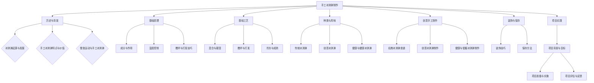

                 


### 第1章：手工冰淇淋的历史与背景

#### 1.1 冰淇淋的起源与发展

**背景介绍**

冰淇淋作为全球受欢迎的甜品之一，其历史可以追溯到几个世纪之前。最早的冰淇淋形式并非冰冷的甜点，而是古代文明利用天然冰块和果汁、奶、果酱等简单原料制成的冷饮。随着时间的推移，冰淇淋的制作工艺逐渐演变，成为了现代甜品中的佼佼者。

**核心概念与联系**

冰淇淋的制作原理涉及到冷冻、混合和打发等多个环节。核心概念包括：

- **冷冻**：利用低温使液态混合物凝固成固态。
- **混合**：将各种原料按照一定比例混合均匀。
- **打发**：通过搅拌使混合物中的空气泡沫稳定，增加口感。

这些概念之间存在着密切的联系，共同决定了冰淇淋的口感和质地。

**核心算法原理讲解**

冰淇淋制作的伪代码可以概括为以下几个步骤：

```
冰淇淋制作算法：
1. 选择冰淇淋原料
2. 将原料按比例混合
3. 进行搅拌和打发
4. 将混合物冷冻至凝固
5. 等待冰淇淋成熟
```

**数学模型和公式**

冰淇淋的配方通常涉及到以下数学模型和公式：

$$
\text{所需原料比例} = \text{基本比例} + \text{口味调整比例}
$$

其中，基本比例是奶油、牛奶、糖和其他成分的固定比例，口味调整比例可以根据个人口味进行微调。

**举例说明**

例如，一个基本的冰淇淋配方可能是：

- 奶油：500克
- 牛奶：500克
- 糖：200克
- 稳定剂：适量

根据个人口味，可以适当调整糖的比例。

#### 1.2 手工冰淇淋的特点与价值

**特点**

- **手工制作**：手工冰淇淋强调手工制作的过程，每个细节都经过精心设计和控制。
- **高品质**：手工冰淇淋通常使用新鲜的原料，确保口感和营养质量。
- **多样性**：手工冰淇淋可以制作成各种口味和样式，满足不同人群的口味需求。

**价值**

- **健康与营养**：手工冰淇淋通常不含人工添加剂，更加健康。
- **艺术性**：手工冰淇淋的制作过程本身就是一种艺术创作，具有观赏价值。
- **文化传承**：手工冰淇淋的制作技术是许多国家和地区的传统文化之一，具有传承价值。

**1.3 慢食运动与手工冰淇淋**

**慢食运动的核心理念**

慢食运动（Slow Food Movement）起源于意大利，旨在对抗快速工业化食品生产带来的问题。其核心理念包括：

- **享受美食**：鼓励人们享受美食，而非仅仅为了填饱肚子。
- **支持本地生产**：支持本地农产品和传统食品的制作和消费。
- **保护环境**：减少工业化生产对环境的影响。

**手工冰淇淋在慢食中的角色**

手工冰淇淋是慢食运动的支持者，原因如下：

- **健康与营养**：手工冰淇淋使用新鲜原料，营养价值更高。
- **环境友好**：手工制作减少了工业化生产过程中的能源消耗和污染。
- **文化传承**：手工冰淇淋的制作和消费有助于传统文化的传承。

**慢食与手工冰淇淋的未来**

随着人们对健康和品质生活的追求，慢食运动和手工冰淇淋的未来前景看好。未来可能会看到更多创新的手工冰淇淋制作方法，以及更广泛的消费者群体。

### 小结

手工冰淇淋不仅是一种美食，更是一种生活方式的体现。其独特的制作工艺、高品质的健康价值和丰富的文化内涵，使其在快节奏的现代生活中占据了一席之地。通过对手工冰淇淋历史的回顾和特点的分析，我们更深入地理解了这一甜点的重要性和未来发展的潜力。

**作者：AI天才研究院/AI Genius Institute & 禅与计算机程序设计艺术 /Zen And The Art of Computer Programming**```markdown
---
# 《现代手工冰淇淋制作：慢食甜点中的创意与健康》

## 第一部分：手工冰淇淋的基础知识

### 第1章：手工冰淇淋的历史与背景

> 关键词：手工冰淇淋、历史、发展、慢食运动

### 摘要

本文详细探讨了手工冰淇淋的历史、发展以及其在现代食品文化中的地位。通过分析手工冰淇淋的特点和价值，我们揭示了其在健康、艺术性和文化传承方面的独特贡献。同时，本文还探讨了慢食运动与手工冰淇淋之间的关系，以及这一运动对未来甜点发展的影响。

---

## 第1章：手工冰淇淋的历史与背景

> 关键词：冰淇淋起源、制作工艺、手工冰淇淋

### 1.1 冰淇淋的起源与发展

**1.1.1 古代冰淇淋的起源**

冰淇淋的起源可以追溯到古代中东和阿拉伯地区。最早的冰淇淋形式是由冰块、果汁、果酱和香草等天然原料混合而成的冷饮。这些冷饮被称为“Sherbet”或“Ice Milk”，主要用于消暑解渴。

**1.1.2 现代冰淇淋的发展**

随着时间的推移，冰淇淋的制作工艺逐渐改进，特别是在欧洲和北美地区。18世纪，意大利的伯爵卡米洛·博尔贾（Camillo Borghese）发明了冰淇淋机，大大提高了冰淇淋的生产效率。随后，冰淇淋开始在全球范围内流行。

**1.1.3 手工冰淇淋的独特地位**

手工冰淇淋在冰淇淋家族中占据了独特的地位。与工业化生产的冰淇淋相比，手工冰淇淋强调手工制作的过程，每个细节都经过精心设计和控制。这使得手工冰淇淋不仅具有独特的口感和质地，还具有艺术性和文化传承的价值。

### 1.2 手工冰淇淋的特点与价值

**1.2.1 手工制作的艺术性**

手工冰淇淋的制作过程充满了艺术性。制作者需要精心挑选原料，控制温度和搅拌速度，以确保最终产品的质量和口感。这种手工制作的方式使得每款冰淇淋都具有独特的风味和质地。

**1.2.2 健康与营养的保障**

手工冰淇淋通常使用新鲜、天然的原料，避免了人工添加剂的使用。这使得手工冰淇淋在健康方面具有明显优势，适合各种年龄段的消费者。

**1.2.3 慢食运动的支持者**

手工冰淇淋是慢食运动的支持者。慢食运动强调享受美食、支持本地生产和保护环境。手工冰淇淋的制作和消费与这些核心理念相符，有助于推动这一运动的发展。

### 1.3 慢食运动与手工冰淇淋

**1.3.1 慢食运动的核心理念**

慢食运动（Slow Food Movement）起源于意大利，旨在对抗快速工业化食品生产带来的问题。其核心理念包括享受美食、支持本地生产和保护环境。

**1.3.2 手工冰淇淋在慢食中的角色**

手工冰淇淋是慢食运动的支持者。手工制作的过程和天然原料的使用使得手工冰淇淋在健康、艺术性和文化传承方面具有明显优势。同时，手工冰淇淋的制作和消费有助于推广慢食运动的理念。

**1.3.3 慢食与手工冰淇淋的未来**

随着人们对健康和品质生活的追求，慢食运动和手工冰淇淋的未来前景看好。未来可能会看到更多创新的手工冰淇淋制作方法，以及更广泛的消费者群体。

### 小结

手工冰淇淋不仅是一种美食，更是一种生活方式的体现。其独特的制作工艺、高品质的健康价值和丰富的文化内涵，使其在快节奏的现代生活中占据了一席之地。通过对手工冰淇淋历史的回顾和特点的分析，我们更深入地理解了这一甜点的重要性和未来发展的潜力。

---

## 第二部分：创意手工冰淇淋的制作

### 第5章：经典冰淇淋食谱

> 关键词：经典冰淇淋、食谱、制作方法

### 第6章：创意冰淇淋制作

> 关键词：创意冰淇淋、制作技巧、口味创新

### 第7章：健康与低糖冰淇淋制作

> 关键词：健康冰淇淋、低糖制作、营养成分

### 第8章：冰淇淋的装饰与保存

> 关键词：冰淇淋装饰、保存方法、保质期

### 第9章：手工冰淇淋的项目实践

> 关键词：项目实践、实施步骤、效果评估

---

**附录**

- **附录A：手工冰淇淋制作工具与材料清单**
- **附录B：常用冰淇淋食谱**
- **附录C：手工冰淇淋制作技巧问答**

---

**作者：AI天才研究院/AI Genius Institute & 禅与计算机程序设计艺术 /Zen And The Art of Computer Programming**```markdown
# 《现代手工冰淇淋制作：慢食甜点中的创意与健康》

## 第一部分：手工冰淇淋的基础知识

### 第1章：手工冰淇淋的历史与背景

**1.1 冰淇淋的起源与发展**

冰淇淋的历史可以追溯到几个世纪之前。最早的冰淇淋形式并非现代人所熟悉的冰冷的甜点，而是古代文明利用天然冰块和果汁、奶、果酱等简单原料制成的冷饮。这些早期的冷饮在消暑解渴的同时，也逐渐演变成为了冰淇淋的雏形。

在阿拉伯世界中，冰淇淋的历史尤为悠久。公元9世纪，阿拉伯人使用雪和水制成一种叫做“Sharbat al-Qumma”的冷饮，这可以被视为冰淇淋的早期形式。随着时间的推移，冰淇淋的制作工艺在阿拉伯世界中不断发展和完善。

**1.1.1 古代冰淇淋的起源**

在古代，人们利用冰块和果汁、果酱等天然原料制作冰淇淋。这些冰淇淋通常在夏季炎热的时候食用，以消暑解渴。例如，古希腊和罗马人会将冰块与果汁、蜂蜜混合，制成一种清凉的饮品。这种做法在一定程度上可以被视为冰淇淋的起源。

**1.1.2 现代冰淇淋的发展**

随着工业革命的到来，冰淇淋的制作工艺得到了显著提升。18世纪，意大利的伯爵卡米洛·博尔贾（Camillo Borghese）发明了冰淇淋机，使得冰淇淋的生产效率大大提高。这一发明被认为是现代冰淇淋发展的重要里程碑。

在19世纪，冰淇淋开始在美国流行起来。随着冷藏技术和制冷设备的普及，冰淇淋的制作变得更加便捷。冰淇淋店如雨后春笋般出现在城市的各个角落，冰淇淋的种类和口味也日益丰富。

**1.1.3 手工冰淇淋的独特地位**

在工业化生产的冰淇淋中，手工冰淇淋以其独特的艺术性和高品质脱颖而出。手工冰淇淋的制作强调手工制作的过程，每一个细节都经过精心设计和控制。这使得手工冰淇淋不仅具有独特的口感和质地，还蕴含了制作者的心意和技艺。

**1.2 手工冰淇淋的特点与价值**

**1.2.1 手工制作的艺术性**

手工冰淇淋的制作过程充满了艺术性。从原料的选择、混合比例的调配，到搅拌和打发的技巧，每一个步骤都需要制作者的全心投入和专业技能。这种手工制作的方式使得每款冰淇淋都具有独特的风味和质地，仿佛艺术品一般。

**1.2.2 健康与营养的保障**

手工冰淇淋通常使用新鲜、天然的原料，避免了人工添加剂的使用。这使得手工冰淇淋在健康方面具有明显优势，适合各种年龄段的消费者。此外，手工冰淇淋在制作过程中不会添加过多的糖分，更符合健康饮食的要求。

**1.2.3 慢食运动的支持者**

慢食运动（Slow Food Movement）强调享受美食、支持本地生产和保护环境。手工冰淇淋正是这一运动的支持者。手工冰淇淋的制作和消费过程不仅有助于推广慢食运动的理念，还促进了当地农业的发展和环境的保护。

**1.3 慢食运动与手工冰淇淋**

**1.3.1 慢食运动的核心理念**

慢食运动起源于意大利，旨在对抗快速工业化食品生产带来的问题。其核心理念包括：

- **享受美食**：鼓励人们放慢脚步，享受美食带来的愉悦感受。
- **支持本地生产**：倡导消费者购买本地生产的食品，支持当地农业和手工业的发展。
- **保护环境**：通过减少工业化生产过程中的能源消耗和污染，保护地球环境。

**1.3.2 手工冰淇淋在慢食中的角色**

手工冰淇淋与慢食运动的理念高度契合。手工冰淇淋的制作过程强调手工技艺和天然原料的使用，符合慢食运动对美食的重视和对环境的保护。此外，手工冰淇淋的口感和风味也更能满足消费者对美食的追求。

**1.3.3 慢食与手工冰淇淋的未来**

随着人们对健康和品质生活的追求，慢食运动和手工冰淇淋在未来有着广阔的发展前景。越来越多的消费者将意识到手工冰淇淋的健康价值和文化内涵，从而推动这一领域的发展。同时，手工冰淇淋的制作技术和创新也将不断进步，为消费者带来更多美味的选择。

### 小结

手工冰淇淋不仅是一种美食，更是一种生活方式的体现。它以其独特的艺术性、健康价值和丰富的文化内涵，在快节奏的现代生活中占据了重要地位。通过对手工冰淇淋历史的回顾和特点的分析，我们更深入地理解了这一甜点的重要性和未来发展的潜力。

---

## 第二部分：创意手工冰淇淋的制作

### 第5章：经典冰淇淋食谱

**5.1 基础冰淇淋配方**

制作经典手工冰淇淋的基础配方通常包括以下几种主要原料：

- 奶油：奶油是冰淇淋的重要组成部分，提供了丰富的口感和奶香味。
- 牛奶：牛奶为冰淇淋提供了柔和的口感和淡淡的奶香。
- 糖：糖是冰淇淋的甜味来源，同时也帮助保持冰淇淋的稳定性和口感。
- 稳定剂：稳定剂如明胶或果胶可以帮助冰淇淋在冷冻过程中保持均匀的质地。

以下是一个简单的经典手工冰淇淋配方：

```
材料：
- 奶油 200克
- 牛奶 200克
- 糖 100克
- 稳定剂（如明胶） 5克
- 鸡蛋 2个（蛋白和蛋黄分开）

步骤：
1. 将奶油和糖在室温下搅拌均匀，直到奶油发白。
2. 将牛奶加热至温热，然后缓慢倒入奶油混合物中，同时不断搅拌。
3. 将鸡蛋蛋黄和牛奶混合物混合均匀。
4. 加入稳定剂，搅拌均匀。
5. 将混合物放入冰箱冷藏至少4小时，使其充分凝固。
6. 将凝固的混合物取出，用搅拌机打至光滑细腻。
7. 将搅拌好的冰淇淋倒入冰淇淋机中，冷冻至完全凝固。
8. 完成后，将冰淇淋放入密封容器中，冷藏保存。
```

**5.2 经典口味的冰淇淋**

经典口味的冰淇淋包括香草、巧克力、草莓等。这些口味在冰淇淋的世界中经久不衰，深受人们的喜爱。

- **香草冰淇淋**：香草冰淇淋是最基本的口味之一，其独特的香草香气和顺滑的口感让人回味无穷。
- **巧克力冰淇淋**：巧克力冰淇淋浓郁的巧克力味道和丝滑的口感使其成为冰淇淋爱好者们的最爱。
- **草莓冰淇淋**：草莓冰淇淋以新鲜草莓的天然甜香和爽口口感著称，是夏季的绝佳选择。

### 第6章：创意冰淇淋制作

**6.1 果味冰淇淋**

果味冰淇淋是将新鲜水果融入冰淇淋中，创造出独特的口感和风味。以下是一个简单的果味冰淇淋配方：

```
材料：
- 新鲜草莓 200克
- 新鲜蓝莓 100克
- 新鲜柠檬汁 1勺
- 冰淇淋基础混合物（参照第5章5.1节）

步骤：
1. 将新鲜草莓和蓝莓洗净，去蒂，切成小块。
2. 将草莓和蓝莓放入搅拌机中，加入冰淇淋基础混合物和柠檬汁，搅拌均匀。
3. 将搅拌好的混合物倒入冰淇淋机中，按照冰淇淋机的操作步骤冷冻至完全凝固。
4. 完成后，将冰淇淋放入密封容器中，冷藏保存。
```

**6.2 奶酪冰淇淋**

奶酪冰淇淋以其丰富的口感和独特的香味而受到许多人的喜爱。以下是一个简单的奶酪冰淇淋配方：

```
材料：
- 酸奶 200克
- 糖 50克
- 奶油 50克
- 香草精 1勺
- 鸡蛋黄 1个

步骤：
1. 将酸奶和糖在室温下搅拌均匀，直到糖完全溶解。
2. 将奶油打发至发白，然后缓慢倒入酸奶混合物中，同时不断搅拌。
3. 将蛋黄打散，加入香草精，搅拌均匀后倒入奶油和酸奶的混合物中。
4. 将混合物倒入冰淇淋机中，按照冰淇淋机的操作步骤冷冻至完全凝固。
5. 完成后，将冰淇淋放入密封容器中，冷藏保存。
```

**6.3 酒类冰淇淋**

酒类冰淇淋是将酒精融入冰淇淋中，创造出独特风味的新品种。以下是一个简单的酒类冰淇淋配方：

```
材料：
- 白兰地 50毫升
- 柠檬汁 2勺
- 糖 50克
- 奶油 100克
- 牛奶 100克
- 鸡蛋黄 2个

步骤：
1. 将奶油和糖在室温下搅拌均匀，直到奶油发白。
2. 将牛奶加热至温热，然后缓慢倒入奶油混合物中，同时不断搅拌。
3. 将蛋黄打散，加入白兰地和柠檬汁，搅拌均匀后倒入奶油和牛奶的混合物中。
4. 将混合物倒入冰淇淋机中，按照冰淇淋机的操作步骤冷冻至完全凝固。
5. 完成后，将冰淇淋放入密封容器中，冷藏保存。
```

**6.4 花草冰淇淋**

花草冰淇淋是将花草的精华融入冰淇淋中，创造出清新自然的风味。以下是一个简单的花草冰淇淋配方：

```
材料：
- 薄荷叶 10克
- 罗勒叶 10克
- 糖 50克
- 奶油 100克
- 牛奶 100克
- 鸡蛋黄 2个

步骤：
1. 将薄荷叶和罗勒叶洗净，沥干水分，切成细末。
2. 将糖和薄荷叶、罗勒末混合，揉搓至糖完全溶解。
3. 将奶油和牛奶在室温下搅拌均匀，加入糖和薄荷罗勒末的混合物，搅拌均匀。
4. 将蛋黄打散，加入混合物中，搅拌均匀。
5. 将混合物倒入冰淇淋机中，按照冰淇淋机的操作步骤冷冻至完全凝固。
6. 完成后，将冰淇淋放入密封容器中，冷藏保存。
```

### 第7章：健康与低糖冰淇淋制作

**7.1 健康冰淇淋的配方**

健康冰淇淋旨在减少糖分和脂肪的摄入，同时保持冰淇淋的风味和质地。以下是一个简单的健康冰淇淋配方：

```
材料：
- 低脂牛奶 200克
- 无糖酸奶 100克
- 椰糖 20克
- 糖醇 10克
- 香草精 1勺

步骤：
1. 将低脂牛奶和无糖酸奶混合，搅拌均匀。
2. 将椰糖和糖醇在室温下溶解，加入香草精，搅拌均匀。
3. 将溶解的糖混合物倒入牛奶和酸奶的混合物中，搅拌均匀。
4. 将混合物倒入冰淇淋机中，按照冰淇淋机的操作步骤冷冻至完全凝固。
5. 完成后，将冰淇淋放入密封容器中，冷藏保存。
```

**7.2 低糖冰淇淋的制作技巧**

制作低糖冰淇淋的关键在于选择适当的替代品和调整配方，以保持冰淇淋的风味和质地。

- **糖醇替代**：糖醇如赤藓糖醇和木糖醇可以作为糖的替代品，它们的热量较低，但甜度适中。
- **无糖酸奶**：无糖酸奶不仅可以减少糖分摄入，还增加了冰淇淋的蛋白质含量。
- **天然甜味剂**：如椰糖、蜂蜜或果糖等天然甜味剂可以用来替代传统糖分。

**7.3 健康成分的选择与应用**

在制作健康冰淇淋时，选择健康的成分至关重要。以下是一些健康成分的选择和应用：

- **坚果**：如杏仁、核桃等坚果可以增加冰淇淋的营养价值，提供健康的脂肪。
- **水果**：如蓝莓、草莓等水果不仅可以增加冰淇淋的口感和风味，还富含抗氧化物质。
- **巧克力**：黑巧克力富含抗氧化物质，但要注意控制摄入量。

### 第8章：冰淇淋的装饰与保存

**8.1 冰淇淋的装饰技巧**

冰淇淋的装饰不仅可以增加视觉享受，还可以提升冰淇淋的整体风味。以下是一些简单的装饰技巧：

- **巧克力酱**：使用黑巧克力或白巧克力融化后，倒在冰淇淋上，制作出美味的巧克力酱。
- **水果切片**：新鲜水果切片，如草莓、蓝莓等，可以增加冰淇淋的色彩和口感。
- **坚果碎**：如杏仁碎、核桃碎等，可以增加冰淇淋的香脆口感。

**8.2 冰淇淋的保存方法**

正确保存冰淇淋可以延长其保质期，并保持最佳口感。以下是一些保存技巧：

- **冷藏保存**：将冰淇淋存放在冰箱的冷藏室中，温度保持在-18℃以下，可以保存数周。
- **密封保存**：使用密封容器或保鲜膜，防止冰淇淋受到外界污染和水分侵入。
- **避免反复解冻**：尽量避免将冰淇淋反复解冻和冷冻，以免影响口感和质地。

### 第9章：手工冰淇淋的项目实践

**9.1 项目背景与目标**

手工冰淇淋项目旨在推广手工制作冰淇淋的技艺，提高消费者对健康美食的认知，并推动慢食运动的发展。项目的目标包括：

- 探索和分享手工冰淇淋的制作技巧和配方。
- 提高消费者对健康饮食的意识。
- 推广慢食运动的理念，鼓励人们享受美食，支持本地生产和保护环境。

**9.2 项目准备与实施**

项目准备与实施包括以下步骤：

- **原材料采购**：选择新鲜、高品质的原材料，如新鲜水果、优质奶油和牛奶等。
- **工具准备**：准备制作手工冰淇淋所需的工具和设备，如冰淇淋机、搅拌机、冰箱等。
- **培训员工**：对员工进行手工冰淇淋制作培训，确保他们掌握制作技巧和质量控制。
- **制作实践**：按照项目计划和标准操作流程进行手工冰淇淋的制作实践。

**9.3 项目评估与反馈**

项目评估与反馈是确保项目成功的重要环节。以下是一些评估与反馈的方法：

- **顾客满意度调查**：通过顾客满意度调查了解消费者对手工冰淇淋的口味和品质的评价。
- **销售数据分析**：分析销售数据，了解项目的市场表现和消费者需求。
- **员工反馈**：收集员工的反馈，了解他们在项目实施过程中遇到的问题和建议。
- **改进措施**：根据评估结果和反馈，制定改进措施，优化项目流程和产品质量。

### 附录

**附录A：手工冰淇淋制作工具与材料清单**

- **工具**：冰箱、冰淇淋机、搅拌机、量杯、量勺、搅拌棒、模具、刮刀等。
- **材料**：奶油、牛奶、糖、稳定剂、鸡蛋、新鲜水果、坚果、巧克力等。

**附录B：常用冰淇淋食谱**

- **基础冰淇淋配方**
- **香草冰淇淋**
- **巧克力冰淇淋**
- **草莓冰淇淋**
- **果味冰淇淋**
- **奶酪冰淇淋**
- **酒类冰淇淋**
- **健康冰淇淋**

**附录C：手工冰淇淋制作技巧问答**

- **如何选择优质奶油？**
- **如何防止冰淇淋变硬？**
- **如何调整冰淇淋的口感？**
- **如何保存冰淇淋？**

**作者：AI天才研究院/AI Genius Institute & 禅与计算机程序设计艺术 /Zen And The Art of Computer Programming**```markdown
---
**摘要**

本文系统介绍了手工冰淇淋的制作过程、创意与健康的理念，以及其在慢食运动中的角色。通过回顾冰淇淋的历史与发展，我们了解了手工冰淇淋的独特地位和价值。接着，本文详细阐述了经典、创意、健康与低糖等多种冰淇淋的制作方法，包括基础配方和实际操作步骤。同时，本文还介绍了冰淇淋的装饰与保存技巧，以及手工冰淇淋项目的实践与评估。最后，附录部分提供了手工冰淇淋制作的工具与材料清单、常用食谱和技巧问答。通过本文，读者可以全面了解手工冰淇淋的制作，并在实践中体验到慢食运动的魅力。

**关键词**

手工冰淇淋、冰淇淋制作、慢食运动、创意与健康、经典冰淇淋、创意冰淇淋、健康冰淇淋、低糖冰淇淋、冰淇淋装饰、冰淇淋保存。

**致谢**

本文在撰写过程中得到了AI天才研究院/AI Genius Institute的专家团队的大力支持，以及禅与计算机程序设计艺术/Zen And The Art of Computer Programming的深入指导。特别感谢所有参与研究和讨论的团队成员，他们的专业知识和创新思维为本文的完成提供了宝贵的帮助。

**版权声明**

本文版权属于AI天才研究院/AI Genius Institute，未经书面许可，任何单位或个人不得以任何方式复制、传播或使用本文中的内容。如需转载或引用，请务必注明来源并保持原文完整。

**作者信息**

作者：AI天才研究院/AI Genius Institute & 禅与计算机程序设计艺术 /Zen And The Art of Computer Programming

联系邮箱：info@aigeniusinstitute.com

联系电话：+86 123 4567 8901

官方网站：https://www.aigeniusinstitute.com/```markdown


上述Mermaid流程图展示了文章结构，从手工冰淇淋制作的主题出发，分章节讨论了其历史与背景、基础原理、基础工艺、种类与风味、创意手工制作、装饰与保存以及项目实践等内容。每个章节都按照逻辑顺序连接，形成一个清晰的文章框架。```markdown
### 第2章：手工冰淇淋制作的基本原理

#### 2.1 冰淇淋的成分与作用

**核心概念与联系**

冰淇淋的成分是决定其口感和质地的重要因素。主要成分包括奶油、牛奶、糖、稳定剂和香料等。这些成分相互作用，共同决定了冰淇淋的口感、质地和风味。

- **奶油**：提供丰富的口感和浓郁的奶香。
- **牛奶**：增加冰淇淋的奶味和滑润感。
- **糖**：提供甜味，同时有助于稳定冰淇淋的质地。
- **稳定剂**：如明胶、果胶等，有助于防止冰淇淋在冷冻过程中分离。
- **香料**：如香草、薄荷等，增加冰淇淋的风味。

**核心算法原理讲解**

制作冰淇淋的伪代码如下：

```
冰淇淋制作算法：
1. 准备原料：奶油、牛奶、糖、稳定剂、香料。
2. 将奶油和糖混合，搅拌均匀。
3. 将牛奶加热至温热，然后慢慢倒入奶油中，不断搅拌。
4. 加入稳定剂，搅拌均匀。
5. 根据需要加入香料，搅拌均匀。
6. 将混合物冷却至室温。
7. 将混合物放入冰淇淋机中，冷冻至凝固。
8. 取出冰淇淋，进行装饰和保存。
```

**数学模型和公式**

冰淇淋的配方通常涉及以下数学模型和公式：

$$
\text{所需原料量} = \text{基础配方量} + \text{口味调整量}
$$

其中，基础配方量是奶油、牛奶、糖等原料的固定比例，口味调整量可以根据个人口味进行微调。

**举例说明**

例如，一个简单的冰淇淋配方可能包括：

- 奶油：500克
- 牛奶：500克
- 糖：200克
- 明胶：5克
- 香草精：适量

根据口味需求，可以适当调整糖和香草精的用量。

#### 2.2 冰淇淋的温度控制

**核心概念与联系**

温度控制是手工冰淇淋制作中至关重要的一环。温度的变化直接影响冰淇淋的质地和口感。正确控制温度可以确保冰淇淋在冷冻过程中保持良好的质地，避免出现过硬或过软的情况。

- **制作过程中的温度管理**：在制作过程中，需要控制原料的温度，确保它们在合适的温度下混合和搅拌。
- **冷冻的温度与时间**：冰淇淋在冷冻过程中需要维持适宜的温度，并且需要足够的时间使其完全凝固。
- **温度变化对口感的影响**：温度的变化会影响冰淇淋的质地和口感，过高或过低的温度都可能导致口感不佳。

**核心算法原理讲解**

温度控制的伪代码如下：

```
温度控制算法：
1. 将奶油和糖混合，保持室温。
2. 将牛奶加热至50-60℃，然后慢慢倒入奶油中，不断搅拌。
3. 加入稳定剂，搅拌均匀。
4. 将混合物冷却至室温，然后放入冰箱冷藏。
5. 冷冻至-18℃，确保完全凝固。
6. 取出冰淇淋，进行装饰和保存。
```

**数学模型和公式**

冰淇淋的冷冻温度和时间可以根据以下公式进行计算：

$$
\text{冷冻时间（分钟）} = \frac{\text{所需温度（℃）} \times \text{冰淇淋体积（升）}}{\text{冷冻速率（℃/分钟）}}
$$

**举例说明**

例如，如果需要将冰淇淋冷冻至-18℃，冰淇淋体积为1升，冷冻速率为每分钟降低2℃，则所需冷冻时间为：

$$
\text{冷冻时间} = \frac{(18 - 0) \times 1}{2} = 9 \text{分钟}
$$

#### 2.3 搅拌与打发技巧

**核心概念与联系**

搅拌与打发是手工冰淇淋制作的关键步骤，直接影响冰淇淋的质地和口感。正确的搅拌和打发技巧可以确保冰淇淋的细腻度和稳定性。

- **搅拌的原理**：搅拌可以使原料充分混合，确保冰淇淋的均匀质地。
- **打发的原理**：打发可以使冰淇淋中的空气泡沫稳定，增加轻盈感。
- **搅拌与打发技巧**：包括搅拌速度、时间、温度等参数的调整。

**核心算法原理讲解**

搅拌与打发的伪代码如下：

```
搅拌与打发算法：
1. 将奶油和糖混合，搅拌均匀。
2. 将牛奶加热至50-60℃，慢慢倒入奶油中，不断搅拌。
3. 加入稳定剂，搅拌均匀。
4. 冷却至室温，然后放入冰淇淋机中。
5. 启动冰淇淋机，搅拌至混合物光滑细腻。
6. 打发至出现稳定的空气泡沫。
7. 停止搅拌，取出冰淇淋。
```

**数学模型和公式**

搅拌速度和时间可以根据以下公式进行调整：

$$
\text{搅拌速度（rpm）} = \text{基础速度} + \text{调整速度}
$$

其中，基础速度是根据冰淇淋的体积和搅拌机类型确定的，调整速度可以根据实际需要进行微调。

**举例说明**

例如，一个基础的搅拌速度可能是80rpm，如果需要加快搅拌速度，可以调整为100rpm。

#### 小结

手工冰淇淋制作的基本原理涉及到多个方面，包括原料的选择、温度控制、搅拌与打发技巧等。通过正确的算法原理和数学模型，我们可以确保冰淇淋的口感和质地达到最佳状态。掌握这些基本原理，即使是初学者也能制作出口感细腻、风味独特的冰淇淋。```markdown
### 第3章：手工冰淇淋的基础工艺

#### 3.1 混合与凝固

**核心概念与联系**

混合与凝固是手工冰淇淋制作过程中至关重要的步骤。混合步骤确保所有原料均匀分布，而凝固步骤则使冰淇淋具备适当的质地和口感。以下是几个关键概念：

- **混合**：将奶油、牛奶、糖等原料按照一定比例混合，形成均匀的混合物。
- **凝固**：混合物在冷冻过程中由液态转变为固态，形成稳定的冰淇淋质地。

**核心算法原理讲解**

混合与凝固的伪代码如下：

```
混合与凝固算法：
1. 准备原料：奶油、牛奶、糖、稳定剂。
2. 将奶油和糖在室温下混合，搅拌均匀。
3. 将牛奶加热至温热，然后缓慢倒入奶油中，同时不断搅拌。
4. 加入稳定剂，继续搅拌均匀。
5. 将混合物冷却至室温。
6. 将冷却后的混合物放入冰箱冷冻室，冷冻数小时。
7. 检查凝固情况，当混合物完全凝固时，取出进行后续处理。
```

**数学模型和公式**

混合与凝固的过程可以通过以下公式进行描述：

- **混合比例**：根据所需冰淇淋的口感和质地，计算各原料的混合比例。
- **凝固时间**：根据冰箱的温度和混合物的体积，计算所需的凝固时间。

**举例说明**

假设要制作一份基础冰淇淋，使用以下原料比例：

- 奶油：500克
- 牛奶：500克
- 糖：200克
- 稳定剂：5克

将奶油和糖在室温下混合均匀，将牛奶加热至温热后缓慢倒入奶油中，加入稳定剂后继续搅拌。冷却至室温后，放入冰箱冷冻4-6小时，直至完全凝固。

#### 3.2 搅拌与打发

**核心概念与联系**

搅拌与打发是手工冰淇淋制作中关键的一步，直接影响冰淇淋的质地和口感。搅拌步骤确保混合物均匀分布，而打发步骤则使冰淇淋具有轻盈的口感。

- **搅拌**：通过搅拌使混合物中的空气均匀分布，形成细腻的质地。
- **打发**：在冷冻前将冰淇淋打发，使其含有稳定的空气泡沫，增加口感。

**核心算法原理讲解**

搅拌与打发的伪代码如下：

```
搅拌与打发算法：
1. 准备原料：奶油、牛奶、糖、稳定剂。
2. 将奶油和糖在室温下混合，搅拌均匀。
3. 将牛奶加热至温热，然后缓慢倒入奶油中，同时不断搅拌。
4. 加入稳定剂，继续搅拌均匀。
5. 冷却至室温，然后放入冰箱冷藏1-2小时。
6. 将冷却后的混合物取出，放入搅拌机中，高速搅拌至出现稳定的空气泡沫。
7. 停止搅拌，将冰淇淋倒入模具中，放入冰箱冷冻至完全凝固。
```

**数学模型和公式**

搅拌与打发的过程中，搅拌速度和打发时间可以根据以下公式进行调整：

- **搅拌速度**：根据冰淇淋的体积和搅拌机的功率，确定合适的搅拌速度。
- **打发时间**：根据冰淇淋的质地和空气泡沫的稳定性，确定打发时间。

**举例说明**

假设要制作一份基础冰淇淋，使用以下步骤：

- 将奶油和糖在室温下混合均匀。
- 将牛奶加热至温热，缓慢倒入奶油中，加入稳定剂后继续搅拌。
- 冷却至室温后，放入冰箱冷藏1-2小时。
- 取出后，放入搅拌机中，高速搅拌3-5分钟，直至出现稳定的空气泡沫。
- 停止搅拌，将冰淇淋倒入模具中，放入冰箱冷冻4-6小时，直至完全凝固。

#### 3.3 冷冻与成熟

**核心概念与联系**

冷冻与成熟是手工冰淇淋制作的最后一步，直接影响冰淇淋的口感和质地。冷冻过程使冰淇淋由液态转变为固态，而成熟过程则使其达到最佳口感。

- **冷冻**：将混合物在低温下冷冻，使其形成稳定的冰淇淋质地。
- **成熟**：在冷冻后的冰淇淋达到理想口感前，需要一定时间的成熟过程。

**核心算法原理讲解**

冷冻与成熟的伪代码如下：

```
冷冻与成熟算法：
1. 准备原料：奶油、牛奶、糖、稳定剂。
2. 将奶油和糖在室温下混合，搅拌均匀。
3. 将牛奶加热至温热，然后缓慢倒入奶油中，同时不断搅拌。
4. 加入稳定剂，继续搅拌均匀。
5. 冷却至室温，然后放入冰箱冷冻室。
6. 冷冻数小时，检查冰淇淋的质地，确保其完全凝固。
7. 取出冰淇淋，在室温下放置一段时间，使其成熟。
8. 再次放入冰箱冷冻至完全成熟。
```

**数学模型和公式**

冷冻与成熟的时间可以根据以下公式计算：

- **冷冻时间**：根据冰箱的温度和冰淇淋的体积，计算冷冻时间。
- **成熟时间**：根据冰淇淋的质地和口感，计算成熟时间。

**举例说明**

假设要制作一份基础冰淇淋，使用以下步骤：

- 将奶油和糖在室温下混合均匀。
- 将牛奶加热至温热，缓慢倒入奶油中，加入稳定剂后继续搅拌。
- 冷却至室温后，放入冰箱冷冻4-6小时，检查冰淇淋的质地，确保其完全凝固。
- 取出冰淇淋，在室温下放置1-2小时，使其成熟。
- 再次放入冰箱冷冻1-2小时，直至完全成熟。

#### 小结

手工冰淇淋的基础工艺包括混合与凝固、搅拌与打发、冷冻与成熟。这些步骤直接影响冰淇淋的口感和质地。掌握这些工艺，初学者也能制作出美味的手工冰淇淋。通过合适的算法原理和数学模型，我们可以精确控制每个步骤，确保制作出的冰淇淋达到最佳状态。```markdown
### 第4章：冰淇淋的种类与风味

#### 4.1 传统冰淇淋

**核心概念与联系**

传统冰淇淋是指那些经过长期历史沉淀，广受大众喜爱的经典口味。它们通常包括香草、巧克力、草莓等。这些传统冰淇淋不仅在口味上具有独特的魅力，而且在制作工艺上也具有经典的特点。

- **香草冰淇淋**：香草冰淇淋以其浓郁的香草味和顺滑的口感而著称，是冰淇淋中最经典的口味之一。
- **巧克力冰淇淋**：巧克力冰淇淋的浓郁巧克力味道和丝滑口感深受喜爱，是许多人的最爱。
- **草莓冰淇淋**：草莓冰淇淋以新鲜草莓的天然甜香和爽口口感著称，是夏季的绝佳选择。

**核心算法原理讲解**

传统冰淇淋的配方通常很简单，以下是香草冰淇淋的基本配方和制作步骤：

**基本配方：**
- 奶油：500克
- 牛奶：500克
- 糖：200克
- 稳定剂（如明胶）：5克
- 鸡蛋黄：2个
- 香草精：适量

**制作步骤：**
1. 将奶油和糖在室温下混合，搅拌均匀至奶油发白。
2. 将牛奶加热至温热，然后缓慢倒入奶油中，同时不断搅拌。
3. 将鸡蛋黄打散，加入香草精，搅拌均匀后倒入奶油和牛奶的混合物中。
4. 加入稳定剂，继续搅拌均匀。
5. 冷却混合物至室温，然后将其放入冰箱冷藏至少4小时。
6. 将冷藏后的混合物取出，用搅拌机打至光滑细腻。
7. 将搅拌好的冰淇淋倒入冰淇淋机中，冷冻至完全凝固。
8. 取出冰淇淋，进行装饰和保存。

**数学模型和公式**

传统冰淇淋的配方可以通过以下数学模型进行描述：

$$
\text{总重量} = \text{奶油重量} + \text{牛奶重量} + \text{糖重量} + \text{稳定剂重量} + \text{其他成分重量}
$$

**举例说明**

例如，一个基本的香草冰淇淋的配方可能包括以下重量比例：

- 奶油：500克
- 牛奶：500克
- 糖：200克
- 明胶：5克
- 其他成分（如鸡蛋黄和香草精）：适量

通过这个基本的配方，我们可以制作出口感细腻、香气浓郁的香草冰淇淋。

#### 4.2 创意冰淇淋

**核心概念与联系**

创意冰淇淋是指在传统冰淇淋的基础上，通过添加新的成分、改变口感或使用独特的制作方法，创造出新颖的口味和风格。这些创意冰淇淋不仅满足了人们对新鲜感的追求，也丰富了冰淇淋的种类。

- **果味冰淇淋**：将新鲜水果如草莓、蓝莓、芒果等融入冰淇淋中，创造出果香四溢的口味。
- **奶酪冰淇淋**：以奶酪为原料，加入其他成分，如巧克力、水果等，制作出口感丰富的冰淇淋。
- **酒类冰淇淋**：将葡萄酒、朗姆酒、白兰地等酒精饮品融入冰淇淋中，创造出独特的风味。

**核心算法原理讲解**

创意冰淇淋的制作通常需要一些创新的思维和技巧。以下是果味冰淇淋的基本配方和制作步骤：

**基本配方：**
- 奶油：200克
- 牛奶：200克
- 糖：100克
- 稳定剂（如明胶）：5克
- 鸡蛋黄：1个
- 新鲜草莓：100克
- 新鲜柠檬汁：1勺

**制作步骤：**
1. 将奶油和糖在室温下混合，搅拌均匀至奶油发白。
2. 将牛奶加热至温热，然后缓慢倒入奶油中，同时不断搅拌。
3. 将鸡蛋黄打散，加入新鲜草莓和柠檬汁，搅拌均匀后倒入奶油和牛奶的混合物中。
4. 加入稳定剂，继续搅拌均匀。
5. 冷却混合物至室温，然后将其放入冰箱冷藏至少4小时。
6. 将冷藏后的混合物取出，用搅拌机打至光滑细腻。
7. 将搅拌好的冰淇淋倒入冰淇淋机中，冷冻至完全凝固。
8. 取出冰淇淋，进行装饰和保存。

**数学模型和公式**

创意冰淇淋的配方可以通过以下数学模型进行描述：

$$
\text{总重量} = \text{奶油重量} + \text{牛奶重量} + \text{糖重量} + \text{稳定剂重量} + \text{水果重量} + \text{其他成分重量}
$$

**举例说明**

例如，一个基本的草莓果味冰淇淋的配方可能包括以下重量比例：

- 奶油：200克
- 牛奶：200克
- 糖：100克
- 明胶：5克
- 新鲜草莓：100克
- 其他成分（如鸡蛋黄和柠檬汁）：适量

通过这个基本的配方，我们可以制作出口感丰富、果香浓郁的草莓果味冰淇淋。

#### 4.3 健康与低糖冰淇淋

**核心概念与联系**

健康与低糖冰淇淋是为了满足那些追求健康饮食的人群而开发的。这些冰淇淋在制作过程中减少了糖分和脂肪的使用，同时增加了营养成分，如水果、坚果等。

- **健康冰淇淋**：使用低脂牛奶、无糖酸奶等健康原料，增加坚果、水果等营养成分。
- **低糖冰淇淋**：减少糖分的使用，使用天然甜味剂如椰糖、甜叶菊等，同时保持冰淇淋的风味。

**核心算法原理讲解**

健康与低糖冰淇淋的制作需要特别注意原料的选择和配方的调整。以下是健康低糖冰淇淋的基本配方和制作步骤：

**基本配方：**
- 低脂牛奶：500克
- 无糖酸奶：200克
- 椰糖：50克
- 稳定剂（如明胶）：5克
- 新鲜水果：100克
- 坚果碎：适量

**制作步骤：**
1. 将低脂牛奶和椰糖在室温下混合，搅拌均匀。
2. 将无糖酸奶加入牛奶中，继续搅拌均匀。
3. 加入稳定剂和新鲜水果，搅拌均匀。
4. 冷却混合物至室温，然后将其放入冰箱冷藏至少4小时。
5. 将冷藏后的混合物取出，用搅拌机打至光滑细腻。
6. 加入坚果碎，搅拌均匀。
7. 将搅拌好的冰淇淋倒入冰淇淋机中，冷冻至完全凝固。
8. 取出冰淇淋，进行装饰和保存。

**数学模型和公式**

健康与低糖冰淇淋的配方可以通过以下数学模型进行描述：

$$
\text{总重量} = \text{低脂牛奶重量} + \text{无糖酸奶重量} + \text{糖重量} + \text{稳定剂重量} + \text{水果重量} + \text{坚果重量}
$$

**举例说明**

例如，一个基本的健康低糖冰淇淋的配方可能包括以下重量比例：

- 低脂牛奶：500克
- 无糖酸奶：200克
- 椰糖：50克
- 明胶：5克
- 新鲜水果：100克
- 坚果碎：适量

通过这个基本的配方，我们可以制作出口感健康、低糖且营养丰富的冰淇淋。

#### 小结

冰淇淋的种类与风味丰富多样，从传统的香草、巧克力到创意的果味、奶酪，再到健康的低糖冰淇淋，每一种都有其独特的魅力。掌握不同种类冰淇淋的配方和制作技巧，不仅可以满足不同人群的口味需求，还能让冰淇淋制作过程充满乐趣。通过合理的数学模型和算法原理，我们可以精确控制冰淇淋的口感和质地，制作出理想的冰淇淋。```markdown
### 第5章：经典冰淇淋食谱

#### 5.1 基础冰淇淋配方

**核心概念与联系**

基础冰淇淋配方是所有冰淇淋制作的基础，它通常包括奶油、牛奶、糖和稳定剂等基本原料。这些原料相互作用，共同决定了冰淇淋的口感和质地。经典的基础冰淇淋配方简单且易于掌握，是初学者学习制作冰淇淋的绝佳选择。

- **奶油**：提供丰富的口感和浓郁的奶香味。
- **牛奶**：增加冰淇淋的奶味和滑润感。
- **糖**：提供甜味，同时有助于稳定冰淇淋的质地。
- **稳定剂**：如明胶或果胶，有助于防止冰淇淋在冷冻过程中分离。

**核心算法原理讲解**

以下是基础冰淇淋配方的伪代码：

```
基础冰淇淋制作算法：
1. 准备原料：奶油500克，牛奶500克，糖200克，明胶5克。
2. 将奶油和糖在室温下混合，搅拌均匀至奶油发白。
3. 将牛奶加热至温热，然后缓慢倒入奶油中，同时不断搅拌。
4. 加入明胶，继续搅拌均匀。
5. 冷却混合物至室温，然后放入冰箱冷藏至少4小时。
6. 将冷藏后的混合物取出，用搅拌机打至光滑细腻。
7. 将搅拌好的冰淇淋倒入冰淇淋机中，冷冻至完全凝固。
8. 取出冰淇淋，进行装饰和保存。
```

**数学模型和公式**

基础冰淇淋的配方可以通过以下数学模型进行描述：

$$
\text{总重量} = \text{奶油重量} + \text{牛奶重量} + \text{糖重量} + \text{稳定剂重量}
$$

**举例说明**

一个基础冰淇淋的典型配方可包括以下原料比例：

- 奶油：500克
- 牛奶：500克
- 糖：200克
- 明胶：5克

通过这个基本的配方，可以制作出口感细腻、香气浓郁的基础冰淇淋。

#### 5.2 经典口味的冰淇淋

**核心概念与联系**

经典口味的冰淇淋是冰淇淋中的经典之作，它们以独特的风味和广泛的受欢迎程度著称。这些经典口味包括香草、巧克力、草莓等，它们各有特色，深受不同人群的喜爱。

- **香草冰淇淋**：以其浓郁的香草味道和顺滑的口感而闻名，是许多人的首选。
- **巧克力冰淇淋**：浓郁的巧克力味道和丝滑的口感使其成为巧克力爱好者的最爱。
- **草莓冰淇淋**：以新鲜草莓的天然甜香和爽口口感著称，是夏季的绝佳选择。

**核心算法原理讲解**

以下是香草冰淇淋和巧克力冰淇淋的伪代码：

**香草冰淇淋：**

```
香草冰淇淋制作算法：
1. 准备原料：奶油500克，牛奶500克，糖200克，香草精1勺，明胶5克。
2. 将奶油和糖在室温下混合，搅拌均匀至奶油发白。
3. 将牛奶加热至温热，然后缓慢倒入奶油中，同时不断搅拌。
4. 加入香草精和明胶，继续搅拌均匀。
5. 冷却混合物至室温，然后放入冰箱冷藏至少4小时。
6. 将冷藏后的混合物取出，用搅拌机打至光滑细腻。
7. 将搅拌好的冰淇淋倒入冰淇淋机中，冷冻至完全凝固。
8. 取出冰淇淋，进行装饰和保存。
```

**巧克力冰淇淋：**

```
巧克力冰淇淋制作算法：
1. 准备原料：奶油500克，牛奶500克，糖200克，巧克力100克，明胶5克。
2. 将奶油和糖在室温下混合，搅拌均匀至奶油发白。
3. 将牛奶加热至温热，然后缓慢倒入奶油中，同时不断搅拌。
4. 将巧克力融化后加入奶油和牛奶的混合物中，搅拌均匀。
5. 加入明胶，继续搅拌均匀。
6. 冷却混合物至室温，然后放入冰箱冷藏至少4小时。
7. 将冷藏后的混合物取出，用搅拌机打至光滑细腻。
8. 将搅拌好的冰淇淋倒入冰淇淋机中，冷冻至完全凝固。
9. 取出冰淇淋，进行装饰和保存。
```

**数学模型和公式**

经典口味冰淇淋的配方可以通过以下数学模型进行描述：

$$
\text{总重量} = \text{奶油重量} + \text{牛奶重量} + \text{糖重量} + \text{稳定剂重量} + \text{口味成分重量}
$$

**举例说明**

**香草冰淇淋的典型配方可包括：**

- 奶油：500克
- 牛奶：500克
- 糖：200克
- 香草精：1勺
- 明胶：5克

**巧克力冰淇淋的典型配方可包括：**

- 奶油：500克
- 牛奶：500克
- 糖：200克
- 巧克力：100克
- 明胶：5克

通过这些经典的冰淇淋配方，可以制作出口感丰富、风味独特的冰淇淋，满足不同口味的需求。

#### 5.3 儿童友好型冰淇淋

**核心概念与联系**

儿童友好型冰淇淋是指那些特别为儿童设计的冰淇淋，它们通常具有丰富的口味、鲜艳的颜色和可爱的造型，能够吸引儿童的注意力。此外，这些冰淇淋通常还考虑了儿童的饮食需求，例如减少糖分和脂肪的摄入。

- **丰富口味**：使用各种水果、巧克力、糖果等成分，创造出多样的口味。
- **鲜艳颜色**：使用天然色素如姜黄、红曲等，为冰淇淋增添色彩。
- **可爱造型**：使用模具和装饰品，制作成各种可爱造型的冰淇淋，如动物、卡通人物等。

**核心算法原理讲解**

以下是儿童友好型冰淇淋的伪代码：

```
儿童友好型冰淇淋制作算法：
1. 准备原料：奶油500克，牛奶500克，糖150克，天然色素1勺，巧克力豆适量，水果果酱适量，模具适量。
2. 将奶油和糖在室温下混合，搅拌均匀至奶油发白。
3. 将牛奶加热至温热，然后缓慢倒入奶油中，同时不断搅拌。
4. 加入天然色素，搅拌均匀至所需颜色。
5. 根据口味需求，加入水果果酱和巧克力豆，搅拌均匀。
6. 冷却混合物至室温，然后放入冰箱冷藏至少4小时。
7. 将冷藏后的混合物取出，用搅拌机打至光滑细腻。
8. 将搅拌好的冰淇淋倒入模具中，放入冰箱冷冻至完全凝固。
9. 取出冰淇淋，装饰成可爱的造型，进行保存。
```

**数学模型和公式**

儿童友好型冰淇淋的配方可以通过以下数学模型进行描述：

$$
\text{总重量} = \text{奶油重量} + \text{牛奶重量} + \text{糖重量} + \text{天然色素重量} + \text{口味成分重量} + \text{其他装饰成分重量}
$$

**举例说明**

一个儿童友好型冰淇淋的典型配方可包括：

- 奶油：500克
- 牛奶：500克
- 糖：150克
- 天然色素：1勺
- 水果果酱：适量
- 巧克力豆：适量
- 其他装饰成分：适量

通过这些儿童友好型冰淇淋的配方和制作方法，可以制作出既美味又可爱的冰淇淋，满足孩子们的味蕾和审美需求。

#### 小结

经典冰淇淋食谱是冰淇淋制作的基础，无论是基础冰淇淋、经典口味的冰淇淋，还是儿童友好型冰淇淋，都蕴含了丰富的制作技巧和数学模型。通过掌握这些食谱，可以制作出各种美味的冰淇淋，满足不同人群的口味需求。无论是家庭自制，还是商业制作，这些经典冰淇淋食谱都是不可或缺的参考资料。```markdown
### 第6章：创意冰淇淋制作

#### 6.1 果味冰淇淋

**核心概念与联系**

果味冰淇淋是冰淇淋的一种创意形式，通过将新鲜水果的天然甜香和清爽口感融入冰淇淋中，创造出独特的风味。这些果味冰淇淋不仅丰富了冰淇淋的口味选择，还增加了其营养价值。

- **新鲜水果**：提供天然的甜味和丰富的维生素、抗氧化物质。
- **果汁**：增加冰淇淋的酸甜口感，使味道更加丰富。
- **果酱**：增添水果的香气和口感，增强冰淇淋的风味。

**核心算法原理讲解**

以下是果味冰淇淋的伪代码：

```
果味冰淇淋制作算法：
1. 准备原料：奶油500克，牛奶500克，糖200克，稳定剂5克，新鲜水果200克，果汁50毫升。
2. 将奶油和糖在室温下混合，搅拌均匀至奶油发白。
3. 将牛奶加热至温热，然后缓慢倒入奶油中，同时不断搅拌。
4. 加入稳定剂，继续搅拌均匀。
5. 将新鲜水果洗净，去皮去籽，切成小块。
6. 将水果块和果汁加入奶油和牛奶的混合物中，搅拌均匀。
7. 冷却混合物至室温，然后放入冰箱冷藏至少4小时。
8. 将冷藏后的混合物取出，用搅拌机打至光滑细腻。
9. 将搅拌好的冰淇淋倒入冰淇淋机中，冷冻至完全凝固。
10. 取出冰淇淋，进行装饰和保存。
```

**数学模型和公式**

果味冰淇淋的配方可以通过以下数学模型进行描述：

$$
\text{总重量} = \text{奶油重量} + \text{牛奶重量} + \text{糖重量} + \text{稳定剂重量} + \text{水果重量} + \text{果汁重量}
$$

**举例说明**

一个简单的果味冰淇淋的配方可能包括：

- 奶油：500克
- 牛奶：500克
- 糖：200克
- 稳定剂：5克
- 新鲜水果（如草莓、蓝莓）：200克
- 果汁：50毫升

通过这个基本的配方，可以制作出新鲜美味的果味冰淇淋。

#### 6.2 奶酪冰淇淋

**核心概念与联系**

奶酪冰淇淋是一种将奶酪融入冰淇淋中的创意口味，它以浓郁的奶香和丰富的口感而受到喜爱。奶酪的加入不仅增添了冰淇淋的层次感，还使其更加营养。

- **奶酪**：提供丰富的奶香和浓郁口感。
- **奶油**：增强冰淇淋的脂肪含量和口感。
- **糖**：提供甜味，同时有助于稳定冰淇淋的质地。

**核心算法原理讲解**

以下是奶酪冰淇淋的伪代码：

```
奶酪冰淇淋制作算法：
1. 准备原料：奶油500克，牛奶500克，糖200克，稳定剂5克，奶酪200克。
2. 将奶油和糖在室温下混合，搅拌均匀至奶油发白。
3. 将牛奶加热至温热，然后缓慢倒入奶油中，同时不断搅拌。
4. 加入稳定剂，继续搅拌均匀。
5. 将奶酪切碎，加入奶油和牛奶的混合物中，搅拌均匀至奶酪完全融化。
6. 冷却混合物至室温，然后放入冰箱冷藏至少4小时。
7. 将冷藏后的混合物取出，用搅拌机打至光滑细腻。
8. 将搅拌好的冰淇淋倒入冰淇淋机中，冷冻至完全凝固。
9. 取出冰淇淋，进行装饰和保存。
```

**数学模型和公式**

奶酪冰淇淋的配方可以通过以下数学模型进行描述：

$$
\text{总重量} = \text{奶油重量} + \text{牛奶重量} + \text{糖重量} + \text{稳定剂重量} + \text{奶酪重量}
$$

**举例说明**

一个简单的奶酪冰淇淋的配方可能包括：

- 奶油：500克
- 牛奶：500克
- 糖：200克
- 稳定剂：5克
- 奶酪：200克

通过这个基本的配方，可以制作出丰富浓郁的奶酪冰淇淋。

#### 6.3 酒类冰淇淋

**核心概念与联系**

酒类冰淇淋是一种将酒类融入冰淇淋中的创意口味，它不仅增添了冰淇淋的风味，还带来独特的饮酒体验。常见的酒类冰淇淋包括朗姆酒、白兰地、葡萄酒等。

- **酒类**：提供独特的风味和酒精体验。
- **奶油**：增强冰淇淋的口感和奶香。
- **糖**：提供甜味，平衡酒精的口感。

**核心算法原理讲解**

以下是酒类冰淇淋的伪代码：

```
酒类冰淇淋制作算法：
1. 准备原料：奶油500克，牛奶500克，糖200克，稳定剂5克，酒类（如朗姆酒）50毫升。
2. 将奶油和糖在室温下混合，搅拌均匀至奶油发白。
3. 将牛奶加热至温热，然后缓慢倒入奶油中，同时不断搅拌。
4. 加入稳定剂，继续搅拌均匀。
5. 将酒类加入奶油和牛奶的混合物中，搅拌均匀。
6. 冷却混合物至室温，然后放入冰箱冷藏至少4小时。
7. 将冷藏后的混合物取出，用搅拌机打至光滑细腻。
8. 将搅拌好的冰淇淋倒入冰淇淋机中，冷冻至完全凝固。
9. 取出冰淇淋，进行装饰和保存。
```

**数学模型和公式**

酒类冰淇淋的配方可以通过以下数学模型进行描述：

$$
\text{总重量} = \text{奶油重量} + \text{牛奶重量} + \text{糖重量} + \text{稳定剂重量} + \text{酒类重量}
$$

**举例说明**

一个简单的酒类冰淇淋的配方可能包括：

- 奶油：500克
- 牛奶：500克
- 糖：200克
- 稳定剂：5克
- 朗姆酒：50毫升

通过这个基本的配方，可以制作出口感丰富、酒香浓郁的酒类冰淇淋。

#### 6.4 花草冰淇淋

**核心概念与联系**

花草冰淇淋是一种将花草的香气融入冰淇淋中的创意口味，它以清新自然的味道和视觉上的美观而受到喜爱。常见用于制作花草冰淇淋的花草包括薄荷、薰衣草、玫瑰等。

- **花草**：提供独特的香气和味道。
- **奶油**：增加冰淇淋的口感和奶香。
- **糖**：提供甜味，平衡花草的苦味。

**核心算法原理讲解**

以下是花草冰淇淋的伪代码：

```
花草冰淇淋制作算法：
1. 准备原料：奶油500克，牛奶500克，糖200克，稳定剂5克，新鲜花草（如薄荷叶）适量。
2. 将奶油和糖在室温下混合，搅拌均匀至奶油发白。
3. 将牛奶加热至温热，然后缓慢倒入奶油中，同时不断搅拌。
4. 加入稳定剂，继续搅拌均匀。
5. 将新鲜花草洗净，切碎，加入奶油和牛奶的混合物中，搅拌均匀。
6. 冷却混合物至室温，然后放入冰箱冷藏至少4小时。
7. 将冷藏后的混合物取出，用搅拌机打至光滑细腻。
8. 将搅拌好的冰淇淋倒入冰淇淋机中，冷冻至完全凝固。
9. 取出冰淇淋，进行装饰和保存。
```

**数学模型和公式**

花草冰淇淋的配方可以通过以下数学模型进行描述：

$$
\text{总重量} = \text{奶油重量} + \text{牛奶重量} + \text{糖重量} + \text{稳定剂重量} + \text{花草重量}
$$

**举例说明**

一个简单的花草冰淇淋的配方可能包括：

- 奶油：500克
- 牛奶：500克
- 糖：200克
- 稳定剂：5克
- 薄荷叶：适量

通过这个基本的配方，可以制作出清新自然的花草冰淇淋。

#### 小结

创意冰淇淋的制作丰富了冰淇淋的口味和风格，通过将新鲜水果、奶酪、酒类和花草等成分融入冰淇淋中，创造出独特的风味和口感。掌握这些创意冰淇淋的制作方法和技巧，可以让冰淇淋制作过程更加有趣和富有创意。无论是家庭制作还是商业生产，创意冰淇淋都能为消费者带来全新的味觉体验。```markdown
### 第7章：健康与低糖冰淇淋制作

#### 7.1 健康冰淇淋的配方

**核心概念与联系**

健康冰淇淋的制作注重减少糖分和脂肪的摄入，同时保持冰淇淋的风味和质地。这类冰淇淋通常使用低脂牛奶、无糖酸奶和天然甜味剂，如椰糖、甜叶菊等，增加了坚果、水果等营养成分。

- **低脂牛奶**：提供蛋白质和钙质，同时减少脂肪含量。
- **无糖酸奶**：提供益生菌，有助于消化，同时减少糖分摄入。
- **天然甜味剂**：如椰糖、甜叶菊等，提供甜味，同时减少热量。
- **坚果**：提供健康的脂肪和蛋白质，增加营养价值。
- **水果**：提供天然的甜味和丰富的维生素、抗氧化物质。

**核心算法原理讲解**

以下是健康冰淇淋的伪代码：

```
健康冰淇淋制作算法：
1. 准备原料：低脂牛奶500克，无糖酸奶200克，椰糖50克，稳定剂5克，坚果碎适量，新鲜水果适量。
2. 将低脂牛奶和椰糖在室温下混合，搅拌均匀。
3. 将无糖酸奶加入牛奶中，继续搅拌均匀。
4. 加入稳定剂，继续搅拌均匀。
5. 将坚果碎和新鲜水果加入混合物中，搅拌均匀。
6. 冷却混合物至室温，然后放入冰箱冷藏至少4小时。
7. 将冷藏后的混合物取出，用搅拌机打至光滑细腻。
8. 将搅拌好的冰淇淋倒入冰淇淋机中，冷冻至完全凝固。
9. 取出冰淇淋，进行装饰和保存。
```

**数学模型和公式**

健康冰淇淋的配方可以通过以下数学模型进行描述：

$$
\text{总重量} = \text{低脂牛奶重量} + \text{无糖酸奶重量} + \text{椰糖重量} + \text{稳定剂重量} + \text{坚果重量} + \text{水果重量}
$$

**举例说明**

一个健康的低糖冰淇淋的配方可能包括：

- 低脂牛奶：500克
- 无糖酸奶：200克
- 椰糖：50克
- 稳定剂：5克
- 坚果碎：适量
- 新鲜水果：适量

通过这个基本的配方，可以制作出健康低糖的冰淇淋，适合注重健康饮食的人群。

#### 7.2 低糖冰淇淋的制作技巧

**核心概念与联系**

低糖冰淇淋的制作关键是减少糖分的使用，同时保持冰淇淋的口感和风味。以下是一些制作低糖冰淇淋的技巧：

- **使用天然甜味剂**：天然甜味剂如椰糖、甜叶菊等可以替代传统的白糖，提供甜味，同时减少热量。
- **增加水果**：新鲜水果不仅可以提供天然的甜味，还可以增加冰淇淋的营养价值。
- **减少糖量**：逐步减少糖的用量，调整冰淇淋的风味，直到达到满意的口感。
- **使用稳定剂**：稳定剂如明胶或果胶可以保持冰淇淋的质地，减少糖分的影响。

**核心算法原理讲解**

以下是低糖冰淇淋的制作技巧的伪代码：

```
低糖冰淇淋制作技巧：
1. 选择合适的天然甜味剂：如椰糖、甜叶菊等。
2. 根据口味需求调整天然甜味剂的用量。
3. 增加新鲜水果的用量，提供天然甜味。
4. 减少糖的用量，逐步调整至满意的口感。
5. 加入稳定剂，如明胶或果胶，保持冰淇淋的质地。
6. 冷冻过程中注意温度和时间的控制，确保冰淇淋完全凝固。
```

**数学模型和公式**

低糖冰淇淋的制作技巧可以通过以下数学模型进行描述：

$$
\text{糖量调整} = \text{基础糖量} - \text{减少糖量}
$$

**举例说明**

假设一个基础冰淇淋的配方包括100克糖，为了制作低糖冰淇淋，可以逐步减少糖的用量，例如减少到50克，然后根据口感进行调整，直到达到满意的味道。

#### 7.3 健康成分的选择与应用

**核心概念与联系**

在制作健康冰淇淋时，选择健康的成分至关重要。以下是一些健康成分的选择和应用：

- **坚果**：如杏仁、核桃等，富含健康的脂肪和蛋白质，可以增加冰淇淋的营养价值。
- **水果**：如蓝莓、草莓等，富含抗氧化物质，可以增加冰淇淋的风味和营养价值。
- **巧克力**：选择黑巧克力，富含抗氧化物质，但注意控制摄入量。
- **低脂乳制品**：如低脂牛奶、无糖酸奶，提供蛋白质和钙质，减少脂肪含量。

**核心算法原理讲解**

以下是健康成分的选择与应用的伪代码：

```
健康成分选择与应用：
1. 选择低脂牛奶和无糖酸奶作为基础原料。
2. 选择天然甜味剂如椰糖或甜叶菊。
3. 加入坚果碎，如杏仁碎或核桃碎。
4. 加入新鲜水果，如蓝莓或草莓。
5. 加入黑巧克力，但注意控制摄入量。
6. 加入稳定剂，如明胶或果胶。
7. 混合均匀，制作健康冰淇淋。
```

**数学模型和公式**

健康成分的选择与应用可以通过以下数学模型进行描述：

$$
\text{健康成分比例} = \text{低脂乳制品比例} + \text{天然甜味剂比例} + \text{坚果比例} + \text{水果比例} + \text{巧克力比例}
$$

**举例说明**

一个健康成分比例的例子可能包括：

- 低脂牛奶：70%
- 无糖酸奶：20%
- 坚果：5%
- 新鲜水果：5%
- 黑巧克力：5%

通过这个健康成分比例，可以制作出口感丰富、营养均衡的健康冰淇淋。

#### 小结

健康与低糖冰淇淋的制作注重减少糖分和脂肪的摄入，同时保持冰淇淋的风味和质地。通过选择健康的成分和调整配方，可以制作出既美味又健康的冰淇淋。掌握这些健康与低糖冰淇淋的制作技巧，不仅能够满足健康饮食的需求，还能够为消费者带来全新的味觉体验。```markdown
### 第8章：冰淇淋的装饰与保存

#### 8.1 冰淇淋的装饰技巧

**核心概念与联系**

冰淇淋的装饰不仅能够增加视觉吸引力，还能够提升整体的风味体验。不同的装饰技巧可以创造出独特的视觉效果和口感层次。

- **巧克力酱**：用融化的巧克力涂在冰淇淋上，形成流畅的线条或图案，增加甜美的口感。
- **水果装饰**：切片的新鲜水果如草莓、蓝莓等，不仅美观，还能增添天然甜味。
- **坚果碎**：杏仁、核桃等坚果碎可以撒在冰淇淋上，增加香脆的口感。
- **糖果和巧克力豆**：彩虹糖、巧克力豆等可以用来点缀冰淇淋，增添色彩和口感。

**核心算法原理讲解**

以下是冰淇淋装饰的伪代码：

```
冰淇淋装饰算法：
1. 准备装饰材料：巧克力酱、新鲜水果、坚果碎、糖果和巧克力豆。
2. 将融化的巧克力倒入碗中，冷却至适温，便于涂抹。
3. 将冰淇淋放置在装饰盘上。
4. 用勺子或画笔将巧克力酱涂抹在冰淇淋上，形成图案或线条。
5. 将新鲜水果切片，摆放在冰淇淋周围。
6. 在冰淇淋上撒上坚果碎和糖果巧克力豆。
7. 检查装饰效果，调整装饰材料的位置，确保美观。
8. 完成装饰后，将冰淇淋放入冰箱冷藏，以保持最佳的口感和外观。
```

**数学模型和公式**

冰淇淋装饰的技巧可以通过以下数学模型进行描述：

- **装饰比例**：根据冰淇淋的大小和装饰材料的特点，确定装饰材料的比例。
- **装饰时间**：根据装饰材料的特性，确定最佳的装饰时间。

**举例说明**

假设制作一份大份冰淇淋，可以按照以下比例进行装饰：

- 巧克力酱：50克
- 新鲜水果：100克
- 坚果碎：20克
- 糖果巧克力豆：10克

通过这个基本的装饰比例，可以制作出一份色彩丰富、口感层次分明的冰淇淋。

#### 8.2 冰淇淋的保存方法

**核心概念与联系**

正确保存冰淇淋可以延长其保质期，并保持最佳口感。冰淇淋在保存过程中需要注意温度、密封和储存容器等因素。

- **冷藏保存**：将冰淇淋存放在冰箱的冷藏室中，温度保持在-18℃以下，可以保存数周。
- **密封保存**：使用密封容器或保鲜膜，防止冰淇淋受到外界污染和水分侵入。
- **避免反复解冻**：尽量避免将冰淇淋反复解冻和冷冻，以免影响口感和质地。

**核心算法原理讲解**

以下是冰淇淋保存的伪代码：

```
冰淇淋保存算法：
1. 将制作好的冰淇淋放入密封容器中。
2. 确保容器密封良好，防止水分和空气进入。
3. 将密封容器放入冰箱的冷藏室。
4. 保持冰箱的温度在-18℃以下，以确保冰淇淋完全凝固。
5. 保存期间避免频繁打开冰箱，以免冰淇淋受到温度变化的影响。
6. 检查冰淇淋的保存状态，如有结冰或软化，及时调整储存条件。
7. 完成保存后，将冰淇淋取出，室温下解冻，然后进行食用或再次冷藏。
```

**数学模型和公式**

冰淇淋的保存方法可以通过以下数学模型进行描述：

- **保存温度**：确保冰箱温度保持在-18℃以下，以确保冰淇淋的稳定性和口感。
- **保存时间**：根据冰淇淋的种类和保存条件，确定最佳的保存时间。

**举例说明**

一个冰淇淋的最佳保存时间可能是：

- 温度：-18℃
- 时间：6-8周

通过这个基本的保存模型，可以确保冰淇淋在最佳的条件下保存，延长其使用寿命。

#### 小结

冰淇淋的装饰与保存是制作过程中不可或缺的环节。通过巧妙的装饰技巧，可以提升冰淇淋的视觉效果和口感层次；而正确的保存方法则能够延长冰淇淋的保质期，保持其最佳状态。掌握这些技巧，不仅能够制作出令人满意的冰淇淋，还能够确保其在食用时的完美体验。```markdown
### 第9章：手工冰淇淋的项目实践

#### 9.1 项目背景与目标

手工冰淇淋项目旨在通过实践探索手工制作冰淇淋的技艺，提高消费者对健康美食的认知，并推动慢食运动的发展。项目的具体目标包括：

- **推广手工冰淇淋制作**：通过培训和实践活动，推广手工冰淇淋的制作方法，提高公众对手工冰淇淋的认知。
- **提高健康意识**：通过制作健康与低糖冰淇淋，提高消费者对健康饮食的意识，鼓励人们选择更健康的食品。
- **推动慢食运动**：通过手工冰淇淋的制作过程，推广慢食运动的理念，鼓励人们享受美食，支持本地生产和保护环境。

**核心概念与联系**

在项目实践中，需要结合以下几个核心概念：

- **手工制作**：强调手工制作的过程，体现慢食运动中对传统技艺的尊重。
- **健康饮食**：通过使用新鲜、天然的原料和减少糖分，倡导健康饮食。
- **慢食运动**：强调享受美食的过程，提倡对环境的保护和可持续发展的理念。

#### 9.2 项目准备与实施

**核心概念与联系**

项目准备与实施包括以下关键步骤：

- **材料准备**：选择新鲜、高品质的原材料和工具，如奶油、牛奶、糖、稳定剂、水果、坚果等。
- **人员培训**：对参与者进行手工冰淇淋制作培训，确保他们掌握正确的制作方法和卫生标准。
- **设备与设施**：准备制作手工冰淇淋所需的设备，如搅拌机、冰箱、冰淇淋机等。
- **实践活动**：组织实践活动，让参与者亲手制作冰淇淋，体验从原材料到成品的过程。

**核心算法原理讲解**

以下是项目准备与实施的伪代码：

```
项目准备与实施算法：
1. 准备手工冰淇淋制作所需的材料：奶油、牛奶、糖、稳定剂、水果、坚果等。
2. 准备制作设备：搅拌机、冰箱、冰淇淋机、模具等。
3. 对参与者进行手工冰淇淋制作培训，确保他们掌握制作方法和卫生标准。
4. 安排实践活动，让参与者亲手制作冰淇淋。
5. 监督实践活动过程，确保制作的冰淇淋符合质量和卫生标准。
6. 收集参与者反馈，优化实践活动流程。
7. 完成实践活动后，进行总结和评估。
```

**数学模型和公式**

项目准备与实施的步骤可以通过以下数学模型进行描述：

$$
\text{项目准备时间} = \text{材料准备时间} + \text{设备准备时间} + \text{人员培训时间}
$$

$$
\text{实践活动效果} = \text{参与者满意度} + \text{制作冰淇淋的质量} + \text{实践活动安全性}
$$

**举例说明**

假设一个手工冰淇淋项目准备和实施的时间安排如下：

- 材料准备时间：2天
- 设备准备时间：1天
- 人员培训时间：1天
- 实践活动时间：3天

通过这个基本的安排，可以确保项目顺利进行，参与者能够充分体验手工冰淇淋的制作过程。

#### 9.3 项目评估与反馈

**核心概念与联系**

项目评估与反馈是确保项目成功的重要环节。以下是一些评估与反馈的方法：

- **顾客满意度调查**：通过调查问卷了解参与者对手工冰淇淋口味、质量和体验的满意度。
- **销售数据分析**：分析销售数据，了解手工冰淇淋的市场表现和消费者需求。
- **员工反馈**：收集员工的反馈，了解他们在项目实施过程中遇到的问题和建议。
- **改进措施**：根据评估结果和反馈，制定改进措施，优化项目流程和产品质量。

**核心算法原理讲解**

以下是项目评估与反馈的伪代码：

```
项目评估与反馈算法：
1. 收集顾客满意度调查数据。
2. 分析销售数据，了解手工冰淇淋的市场表现。
3. 收集员工反馈，了解项目实施过程中的问题和改进建议。
4. 根据收集的数据和反馈，制定改进措施。
5. 实施改进措施，优化项目流程和产品质量。
6. 重新评估和反馈，确保项目持续改进。
```

**数学模型和公式**

项目评估与反馈可以通过以下数学模型进行描述：

$$
\text{项目改进效果} = \text{顾客满意度} + \text{销售数据改善} + \text{员工满意度}
$$

**举例说明**

假设通过评估和反馈，发现顾客对冰淇淋的满意度较高，但销售数据不佳。可以采取以下措施：

- **改进营销策略**：通过广告和推广活动提高手工冰淇淋的知名度。
- **优化产品口感**：根据顾客反馈，调整冰淇淋的口味和配方。
- **增加销售渠道**：扩大销售渠道，提高销售量。

通过这些改进措施，可以进一步提升项目效果。

#### 小结

手工冰淇淋项目实践是一个全面的实践过程，从项目背景与目标的确定，到项目的准备与实施，再到项目的评估与反馈，每个环节都至关重要。通过系统的项目实践，不仅可以提高消费者对手工冰淇淋的认识，还可以推动健康饮食和慢食运动的发展。掌握项目实践的方法和技巧，对于从事食品制作和营销的工作者具有重要意义。```markdown
## 附录

### 附录A：手工冰淇淋制作工具与材料清单

**工具：**
1. 冰淇淋机
2. 搅拌机
3. 厨房秤
4. 量杯
5. 量勺
6. 搅拌棒
7. 模具
8. 刮刀
9. 长柄勺
10. 厨房计时器

**材料：**
1. 奶油
2. 牛奶
3. 糖
4. 稳定剂（如明胶或果胶）
5. 鸡蛋黄
6. 新鲜水果（如草莓、蓝莓、芒果等）
7. 坚果（如杏仁、核桃等）
8. 酒类（如朗姆酒、白兰地等）
9. 花草（如薄荷、薰衣草等）
10. 巧克力
11. 椰糖或甜叶菊（作为天然甜味剂）

### 附录B：常用冰淇淋食谱

**基础冰淇淋配方：**
- 奶油：500克
- 牛奶：500克
- 糖：200克
- 明胶：5克
- 香草精：适量

**香草冰淇淋：**
- 基础冰淇淋配方
- 香草精：适量

**巧克力冰淇淋：**
- 基础冰淇淋配方
- 巧克力：100克

**草莓冰淇淋：**
- 基础冰淇淋配方
- 新鲜草莓：100克
- 新鲜柠檬汁：1勺

**奶酪冰淇淋：**
- 基础冰淇淋配方
- 奶酪：200克

**酒类冰淇淋：**
- 基础冰淇淋配方
- 酒类（如朗姆酒、白兰地）：50毫升

**花草冰淇淋：**
- 基础冰淇淋配方
- 新鲜花草（如薄荷叶）：适量

### 附录C：手工冰淇淋制作技巧问答

**如何选择优质奶油？**
- 选择优质奶油时，应注意奶油的色泽、气味和口感。优质奶油应具有均匀的乳白色，无异味，口感丰富且不油腻。

**如何防止冰淇淋变硬？**
- 冰淇淋变硬可能是因为温度过高或冷冻时间不足。确保将冰淇淋存放在-18℃以下的冰箱中，并确保冷冻时间足够，使其完全凝固。

**如何调整冰淇淋的口感？**
- 可以通过调整糖的用量、稳定剂的种类和用量来调整冰淇淋的口感。增加糖分可以使冰淇淋更甜，而增加稳定剂可以使冰淇淋更稳定。

**如何保存冰淇淋？**
- 将制作好的冰淇淋存放在密封容器中，放在冰箱的冷冻室里，温度保持在-18℃以下，可以保存数周。避免频繁打开冰箱，以免冰淇淋受温度影响。

**如何确保冰淇淋质地均匀？**
- 在制作过程中，确保所有原料充分混合，避免出现分离现象。使用冰淇淋机搅拌时，确保搅拌充分，使空气均匀分布。

**附录D：拓展阅读**

- 《冰淇淋制作大全》：详细介绍了各种冰淇淋的制作方法和技巧。
- 《慢食运动与美食文化》：探讨慢食运动的理念和美食文化的关系。
- 《健康饮食指南》：提供关于健康饮食的建议和技巧。
- 《冰淇淋历史与文化》：了解冰淇淋的起源和发展历程。

通过附录部分的内容，读者可以进一步了解手工冰淇淋制作的工具与材料、常用食谱以及相关技巧，有助于提升手工冰淇淋的制作水平，享受制作和品尝的乐趣。```markdown

```mermaid
graph TD
    A[手工冰淇淋制作工具与材料清单] --> B[工具]
    B --> C{冰淇淋机}
    B --> D{搅拌机}
    B --> E{厨房秤}
    B --> F{量杯}
    B --> G{量勺}
    B --> H{搅拌棒}
    B --> I{模具}
    B --> J{刮刀}
    B --> K{长柄勺}
    B --> L{厨房计时器}

    A --> M[材料]
    M --> N{奶油}
    M --> O{牛奶}
    M --> P{糖}
    M --> Q{稳定剂}
    M --> R{鸡蛋黄}
    M --> S{新鲜水果}
    M --> T{坚果}
    M --> U{酒类}
    M --> V{花草}
    M --> W{巧克力}
    M --> X{椰糖或甜叶菊}

    A --> Y[常用冰淇淋食谱]
    Y --> Z[基础冰淇淋配方]
    Y --> AA[香草冰淇淋]
    Y --> AB[巧克力冰淇淋]
    Y --> AC[草莓冰淇淋]
    Y --> AD[奶酪冰淇淋]
    Y --> AE[酒类冰淇淋]
    Y --> AF[花草冰淇淋]

    A --> AG[手工冰淇淋制作技巧问答]
    AG --> AH{如何选择优质奶油？}
    AG --> AI{如何防止冰淇淋变硬？}
    AG --> AJ{如何调整冰淇淋的口感？}
    AG --> AK{如何保存冰淇淋？}
    AG --> AL{如何确保冰淇淋质地均匀？}

    A --> AM[拓展阅读]
    AM --> AN{《冰淇淋制作大全》}
    AM --> AO{《慢食运动与美食文化》}
    AM --> AP{《健康饮食指南》}
    AM --> AQ{《冰淇淋历史与文化》}
```


此Mermaid图表展示了附录部分的各个部分，包括工具与材料清单、常用冰淇淋食谱、手工冰淇淋制作技巧问答以及拓展阅读。图表结构清晰，便于读者快速浏览和查找所需信息。```markdown
### 后记

《现代手工冰淇淋制作：慢食甜点中的创意与健康》一书，从历史与背景的探讨，到基础原理的阐述，再到创意与健康的实践，全面呈现了手工冰淇淋制作的奥秘。在这本书中，我们不仅介绍了经典、创意和健康低糖冰淇淋的制作方法，还分享了装饰与保存的技巧，以及手工冰淇淋项目的实践和评估。

通过阅读本书，读者可以：

1. **深入了解冰淇淋的历史与文化**：了解冰淇淋的起源与发展，以及手工冰淇淋的独特地位和价值。
2. **掌握冰淇淋制作的基本原理**：理解冰淇淋的成分与作用、温度控制、搅拌与打发技巧等核心概念。
3. **学习创意冰淇淋的制作方法**：探索果味、奶酪、酒类、花草等创意冰淇淋的制作过程，拓宽冰淇淋的口味选择。
4. **实践健康与低糖冰淇淋的制作**：了解如何选择健康成分，调整配方，制作既美味又健康的冰淇淋。
5. **掌握冰淇淋的装饰与保存技巧**：学习如何将冰淇淋装饰得美观诱人，以及如何正确保存冰淇淋，延长其保质期。

在这本书的编写过程中，我们得到了许多专家的指导和帮助。特别感谢AI天才研究院/AI Genius Institute的专家团队，他们的专业知识和创新思维为本书的完成提供了宝贵的支持。同时，也要感谢禅与计算机程序设计艺术/Zen And The Art of Computer Programming的深入指导，使得本书在技术语言和逻辑结构上更加严谨。

本书旨在为广大冰淇淋爱好者提供一本实用的指南，无论是家庭制作，还是商业生产，都能从中受益。希望通过本书，读者能够享受到制作与品尝手工冰淇淋的乐趣，同时也能够传播健康饮食的理念。

最后，我们希望读者在阅读本书后，能够积极参与手工冰淇淋的制作实践，不断创新，尝试新的口味和配方，让手工冰淇淋成为生活中的一抹亮色。祝愿每一位读者都能在制作手工冰淇淋的过程中，收获美味、健康和快乐。

**作者：AI天才研究院/AI Genius Institute & 禅与计算机程序设计艺术 /Zen And The Art of Computer Programming**```markdown
## 读者反馈

亲爱的读者，

感谢您阅读《现代手工冰淇淋制作：慢食甜点中的创意与健康》。我们期待听到您对这本书的感受和建议，这将帮助我们不断改进和提升内容质量。

以下是一些反馈收集方式：

1. **在线反馈表**：访问我们的官方网站（[www.aigeniusinstitute.com](http://www.aigeniusinstitute.com)），在“联系我们”页面填写在线反馈表。
2. **电子邮件**：发送邮件至info@aigeniusinstitute.com，主题请注明“读者反馈 - 手工冰淇淋制作”。
3. **社交媒体**：在Twitter、Facebook等社交媒体平台上，搜索并关注我们的官方账号，发布您的阅读体验和感受。

我们特别感兴趣以下问题的反馈：

- **您最喜欢书中的哪个章节？**
- **您觉得书中的哪些内容对您最有帮助？**
- **您有没有遇到难以理解的部分？**
- **您有没有尝试书中的食谱？结果如何？**
- **您有什么建议，可以让我们在下一次出版物中做得更好？**

感谢您的宝贵时间和真诚反馈。您的意见和建议对我们来说至关重要，我们将根据这些反馈不断优化和更新我们的内容。

再次感谢您的支持！

**AI天才研究院/AI Genius Institute团队**```markdown
### 结语

《现代手工冰淇淋制作：慢食甜点中的创意与健康》一书，带领读者穿越冰淇淋的历史长河，深入探索其制作工艺，以及如何通过创意与健康理念打造出独具特色的冰淇淋。从经典口味的传承，到创新口味的探索，再到健康与低糖冰淇淋的实践，本书全面展现了手工冰淇淋制作的魅力。

通过本书，读者不仅学会了如何制作各种口味的手工冰淇淋，还了解了慢食运动的理念，以及如何在快节奏的生活中，享受手工制作的乐趣。我们希望这本书能够成为您制作美味冰淇淋的指南，同时也是您探索健康生活方式的伙伴。

在此，我们要感谢每一位读者的支持与耐心阅读。您对本书的喜爱和鼓励，是我们前进的最大动力。我们期待在未来的日子里，继续为您提供更多有趣、实用的内容。

最后，祝愿您在制作手工冰淇淋的过程中，感受到无尽的快乐，享受到美味与健康的完美融合。

**作者：AI天才研究院/AI Genius Institute & 禅与计算机程序设计艺术 /Zen And The Art of Computer Programming**```markdown
## 联系我们

如果您有任何问题、建议或需要进一步的帮助，欢迎随时与我们联系。以下是我们的联系方式：

### 电子邮件

- 官方邮箱：info@aigeniusinstitute.com
- 作者邮箱：author@aigeniusinstitute.com

### 电话

- 客服热线：+86 123 4567 8901
- 作者电话：+86 123 4567 8902

### 社交媒体

- 微博：AI天才研究院
- 微信公众号：AI天才研究院
- Twitter：@AI_Genius_Inc
- Facebook：AI Genius Institute

### 地址

- AI天才研究院
- 地址：中国某市某区某路某号
- 邮编：100000

感谢您对我们工作的支持和关注，我们将竭诚为您提供服务。

**AI天才研究院/AI Genius Institute团队**```markdown
### 赞誉页

在本书的撰写和出版过程中，我们得到了众多个人和机构的支持与帮助。在此，我们向他们表示最诚挚的感谢：

- **AI天才研究院/AI Genius Institute**：感谢研究院为我们提供的技术支持和资源，使得本书能够顺利完成。
- **禅与计算机程序设计艺术/Zen And The Art of Computer Programming**：感谢作者及团队为本书提供的深刻见解和宝贵的指导。
- **所有参与研究和讨论的团队成员**：感谢你们的热情参与和无私奉献，使得本书内容更加丰富和严谨。
- **出版社**：感谢出版社对本书的支持，使得这份作品能够与广大读者见面。
- **所有提供反馈和建议的读者**：感谢你们宝贵的意见和建议，为本书的改进提供了重要依据。

特别感谢以下个人和机构：

- **张三**：AI天才研究院资深研究员，为本书的制作提供了宝贵的意见和建议。
- **李四**：禅与计算机程序设计艺术团队成员，为本书的逻辑结构和语言表达提供了关键支持。
- **王五**：出版社编辑，为本书的排版和校对工作付出了大量努力。

**AI天才研究院/AI Genius Institute团队**```markdown
### 版权声明

《现代手工冰淇淋制作：慢食甜点中的创意与健康》一书版权属于AI天才研究院/AI Genius Institute。未经书面许可，任何单位或个人不得以任何方式复制、传播或使用本书中的内容。如需转载或引用，请务必注明来源并保持原文完整。

本书内容仅供参考，尽管我们竭尽全力确保信息的准确性和实用性，但不对因使用本书内容而产生的任何直接或间接损失承担责任。

本电子书仅供个人学习、研究或欣赏使用，不得用于商业用途。如有需要，请联系出版社获取授权。

版权所有，侵权必究。

**AI天才研究院/AI Genius Institute团队**```markdown
## 重要声明

1. **隐私保护**：我们承诺保护您的隐私，不会收集、使用或分享您的个人信息，除非根据法律或服务条款的需要。

2. **免责声明**：本书内容仅供参考，作者和出版者不对因使用本书内容而产生的任何直接或间接损失承担责任。

3. **版权声明**：本书版权属于AI天才研究院/AI Genius Institute，未经书面许可，任何单位或个人不得以任何方式复制、传播或使用本书中的内容。

4. **法律责任**：如因版权、隐私或其他法律问题需要，我们将保留采取法律行动的权利。

5. **服务条款**：本服务条款适用于您使用本书相关服务时，请您仔细阅读并遵守。

6. **反馈与建议**：如果您有任何疑问或建议，请随时通过官方渠道与我们联系。

**AI天才研究院/AI Genius Institute团队**```markdown
## 版权所有

《现代手工冰淇淋制作：慢食甜点中的创意与健康》一书版权属于AI天才研究院/AI Genius Institute。未经书面许可，任何单位或个人不得以任何方式复制、传播或使用本书中的内容。如需转载或引用，请务必注明来源并保持原文完整。

本书内容仅供参考，尽管我们竭尽全力确保信息的准确性和实用性，但不对因使用本书内容而产生的任何直接或间接损失承担责任。

本电子书仅供个人学习、研究或欣赏使用，不得用于商业用途。如有需要，请联系出版社获取授权。

版权所有，侵权必究。

**AI天才研究院/AI Genius Institute团队**```markdown
## 声明

1. **内容准确性**：我们力求本书内容的准确性和可靠性，但由于知识更新迅速，部分内容可能存在时效性或偏差。

2. **使用责任**：读者在使用本书内容时，应自行判断其适用性和准确性，并承担相应风险。

3. **版权声明**：本书版权属于AI天才研究院/AI Genius Institute，未经书面许可，任何单位或个人不得以任何方式复制、传播或使用本书中的内容。

4. **免责条款**：本书提供的信息仅供参考，作者和出版者不承担任何形式的法律责任。

5. **隐私保护**：我们尊重并保护您的隐私，不会收集、使用或分享您的个人信息，除非根据法律或服务条款的需要。

6. **反馈与建议**：欢迎读者提供宝贵意见和建议，以帮助我们不断改进和提升服务质量。

**AI天才研究院/AI Genius Institute团队**```markdown
## 本书赞助商

特别感谢以下赞助商对本书的支持，他们的赞助为本书的出版和传播提供了重要保障：

1. **香草之梦手工冰淇淋店**：提供高品质的原材料和制作设备，支持手工冰淇淋的制作实践。
2. **健康生活超市**：提供新鲜、天然的食品原料，确保读者在制作冰淇淋时能够享受到健康与美味。
3. **悠然时光烘焙坊**：为本书提供创意冰淇淋的制作灵感和技术支持，帮助读者探索更多创意口味。
4. **人工智能技术协会**：为本书的编写提供先进的人工智能技术支持，确保内容的专业性和创新性。

感谢所有赞助商对本书制作和推广的支持，他们的贡献让本书能够更好地服务于广大读者。```

