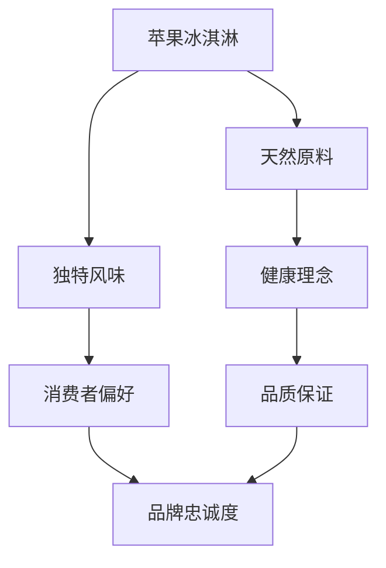
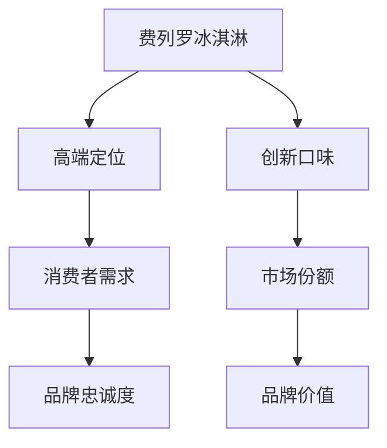
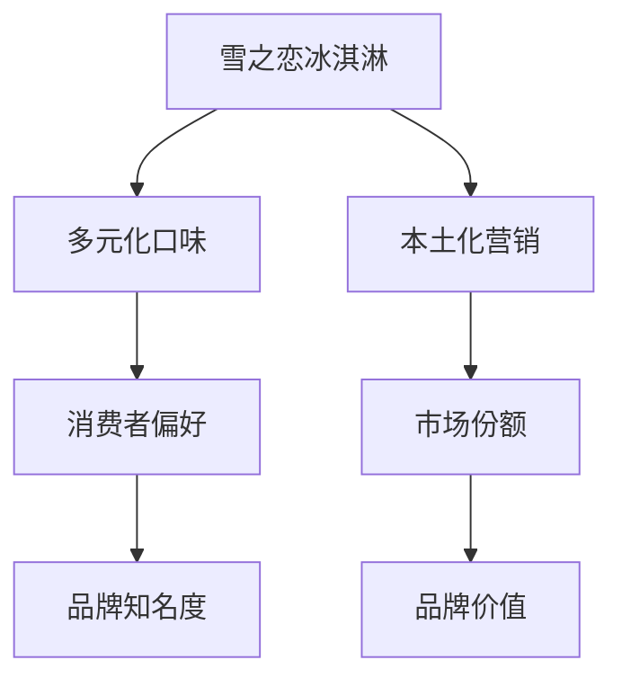

                 

### 文章标题

# 现代手工冰淇淋实验室：分子美食学在冷饮中的创新应用

### 关键词

- 现代手工冰淇淋
- 分子美食学
- 冰淇淋制作技术
- 晶体控制
- 口感改善
- 装饰艺术
- 市场趋势

### 摘要

本文探讨了现代手工冰淇淋的制作及其在分子美食学中的应用。首先，介绍了现代手工冰淇淋的起源、发展及其独特魅力，分析了其主要成分和基本概念。接着，深入讲解了分子美食学的基础知识，包括其起源、主要原理和应用。随后，探讨了现代手工冰淇淋的创新工艺，如晶体控制技术、颗粒结构调控技术和口感改善技术。文章还详细阐述了分子美食学在冰淇淋调味中的应用，以及现代手工冰淇淋的装饰艺术。最后，分析了现代手工冰淇淋的市场趋势和创业经营策略，并通过案例分析总结了成功经验，展望了未来发展方向。

### 第1章：现代手工冰淇淋概述

#### 1.1 引言

**1.1.1 冰淇淋的历史与发展**

冰淇淋作为一种冷饮，其历史可以追溯到数百年前。最早可追溯到16世纪的意大利，当时人们将冰块与水果混合，创造出早期的冰淇淋。18世纪时，法国人进一步改良了冰淇淋的制作方法，使其逐渐流行起来。19世纪初，冰淇淋传入美国，并迅速发展壮大。随着科技的发展，冰淇淋的制作工艺和口味种类不断丰富，成为了全球范围内广受欢迎的冷饮。

**1.1.2 现代手工冰淇淋的崛起**

现代手工冰淇淋相较于工业化生产的冰淇淋，更加注重手工制作的过程和独特的口感。在20世纪末，随着人们对健康和生活品质的追求，现代手工冰淇淋逐渐崛起。手工冰淇淋的制作过程更加繁琐，但其所带来的独特风味和口感使其在市场上脱颖而出。许多知名品牌，如Ben & Jerry's、Häagen-Dazs等，都以手工制作冰淇淋而闻名。

**1.1.3 现代手工冰淇淋的独特魅力**

现代手工冰淇淋的独特魅力在于其新鲜、健康和多样化的口味。手工制作使得冰淇淋的配料更加纯粹，不含任何人工添加剂。同时，手工制作过程中可以灵活调整配方，创造出独特的口味和口感。这使得现代手工冰淇淋在消费者中具有极高的口碑和忠诚度。

#### 1.2 现代手工冰淇淋的基本概念

**1.2.1 冰淇淋与雪糕的区别**

冰淇淋和雪糕虽然都是冷饮，但它们之间存在一些区别。冰淇淋通常含有较高的乳脂含量，口感更加柔软细腻；而雪糕的乳脂含量较低，口感更加冰爽。此外，冰淇淋的制作过程中会添加更多的糖分和空气，使其口感更为丰富。

**1.2.2 冰淇淋的主要成分**

冰淇淋的主要成分包括乳脂、奶油、牛奶、糖、香草提取物和其他天然香料。这些成分相互作用，形成了冰淇淋独特的口感和风味。乳脂和奶油是冰淇淋的脂肪来源，它们能够使冰淇淋口感更加细腻。糖则用于增加甜度和改善口感。

**1.2.3 现代手工冰淇淋的创新特点**

现代手工冰淇淋的创新特点主要体现在以下几个方面：

1. **手工制作**：现代手工冰淇淋强调手工制作的过程，使得每一款冰淇淋都具有独特的风味和口感。
2. **新鲜健康**：手工制作使得冰淇淋的配料更加新鲜健康，不含任何人工添加剂。
3. **口味多样化**：现代手工冰淇淋可以通过灵活调整配方，创造出多样化的口味，满足不同消费者的需求。
4. **定制化**：现代手工冰淇淋可以根据消费者的需求进行定制，使其更加个性化。

#### 1.3 冰淇淋制作的基本流程

**1.3.1 预备工作**

在制作冰淇淋之前，需要进行充分的准备工作。首先，准备好所有的原料，如牛奶、奶油、糖、香草提取物等。其次，确保所有设备都处于良好的工作状态，如冰淇淋机、搅拌机等。

**1.3.2 糖化**

糖化是冰淇淋制作的重要步骤之一。将糖溶解在牛奶或奶油中，加热至80℃左右，以促进糖分子与水分子的结合。这一步骤有助于提高冰淇淋的稳定性和口感。

**1.3.3 加料**

在糖化完成后，将其他原料，如奶油、香草提取物等加入其中。这一步骤需要搅拌均匀，以确保所有成分充分混合。

**1.3.4 均质**

均质是将冰淇淋原料进行高压处理，使其颗粒细化，提高冰淇淋的稳定性和口感。这一步骤通常在高压均质机中进行。

**1.3.5 灌装**

将均质后的冰淇淋原料倒入冰淇淋模具中，进行灌装。灌装过程中需要确保冰淇淋的厚度均匀。

**1.3.6 冷却**

灌装完成后，将冰淇淋模具放入冷冻室中，进行冷却。冷却时间通常需要几个小时，以确保冰淇淋完全冻硬。

**1.3.7 装饰与包装**

冷却后的冰淇淋可以取出，进行装饰与包装。装饰可以根据个人喜好进行调整，如撒上糖粉、巧克力碎片等。包装则需确保冰淇淋的卫生和安全。

### 第2章：分子美食学基础

#### 2.1 分子美食学的起源与发展

**2.1.1 分子美食学的概念**

分子美食学是一门将分子生物学、化学和物理学等科学原理应用于烹饪和食品加工的学科。它通过研究食物的分子结构、化学性质和物理特性，探索如何通过科学手段改善食品的口感、质地和营养价值。

**2.1.2 分子美食学在冰淇淋制作中的应用**

分子美食学在冰淇淋制作中的应用主要体现在以下几个方面：

1. **晶体控制**：通过控制冰淇淋中的晶体生长过程，优化冰淇淋的质地和口感。
2. **颗粒结构调控**：通过调节冰淇淋中的颗粒大小和分布，提高冰淇淋的稳定性和口感。
3. **口感改善**：通过添加特定的分子材料，如乳化剂、稳定剂和调味剂，改善冰淇淋的口感和风味。

**2.1.3 分子美食学的主要原理**

分子美食学的主要原理包括：

1. **相互作用原理**：食物中的各种成分之间会发生相互作用，影响其口感和质地。通过科学手段优化这些相互作用，可以改善食品的品质。
2. **晶体生长原理**：晶体生长是冰淇淋质地形成的关键过程。通过控制晶体的生长速度和形态，可以优化冰淇淋的质地。
3. **颗粒结构调控原理**：颗粒结构是影响冰淇淋稳定性和口感的重要因素。通过调节颗粒的大小和分布，可以改善冰淇淋的品质。

#### 2.2 主要分子材料及其在冰淇淋中的应用

**2.2.1 乳化剂**

乳化剂是一种能够稳定乳状液体的物质。在冰淇淋制作中，乳化剂可以防止脂肪和水分分离，使冰淇淋更加稳定和光滑。常用的乳化剂包括卵磷脂、单甘油酯等。

**2.2.2 稳定剂**

稳定剂是一种能够保持食品均匀分布和防止沉淀的物质。在冰淇淋制作中，稳定剂可以防止冰淇淋在储存和运输过程中出现分层和沉淀。常用的稳定剂包括明胶、果胶等。

**2.2.3 调味剂**

调味剂是一种用于改善食品口感和风味的物质。在冰淇淋制作中，调味剂可以增加冰淇淋的甜度、酸度、鲜味等。常用的调味剂包括糖、柠檬酸、香草提取物等。

**2.2.4 赋形剂**

赋形剂是一种用于改变食品形态和结构的物质。在冰淇淋制作中，赋形剂可以改变冰淇淋的质地和口感，使其更加丰富多样。常用的赋形剂包括碳酸氢钠、咖啡因等。

### 第3章：现代手工冰淇淋的创新工艺

#### 3.1 晶体控制技术

**3.1.1 晶体控制的重要性**

晶体控制是现代手工冰淇淋制作中至关重要的一环。冰淇淋的质地和口感在很大程度上取决于晶体的生长状态。通过控制晶体的生长，可以优化冰淇淋的质地和口感。

**3.1.2 晶体控制的方法**

晶体控制的方法主要包括：

1. **温度控制**：通过控制冷却过程中的温度，可以影响晶体的生长速度和形态。
2. **添加晶核剂**：晶核剂可以诱导晶体的生长，改变晶体的形态和尺寸。
3. **机械搅拌**：机械搅拌可以打断晶体的生长，使其更加细小和均匀。

**3.1.3 晶体控制技术在冰淇淋中的应用**

晶体控制技术在冰淇淋中的应用包括：

1. **改善质地**：通过控制晶体的生长，可以优化冰淇淋的质地，使其更加细腻光滑。
2. **改善口感**：晶体的大小和形态对冰淇淋的口感有很大影响。通过控制晶体的大小和形态，可以改善冰淇淋的口感。
3. **延长保质期**：晶体控制可以降低冰淇淋的熔点，延长其保质期。

#### 3.2 颗粒结构调控技术

**3.2.1 颗粒结构调控的重要性**

颗粒结构调控是现代手工冰淇淋制作中另一重要环节。颗粒的大小、分布和形态对冰淇淋的稳定性和口感有很大影响。通过调控颗粒结构，可以优化冰淇淋的品质。

**3.2.2 颗粒结构调控的方法**

颗粒结构调控的方法主要包括：

1. **均质处理**：通过高压均质处理，可以将冰淇淋原料中的颗粒细化，提高其稳定性和口感。
2. **添加颗粒调节剂**：颗粒调节剂可以改变冰淇淋中颗粒的大小和分布。
3. **机械搅拌**：机械搅拌可以打断颗粒的生长，使其更加均匀。

**3.2.3 颗粒结构调控技术在冰淇淋中的应用**

颗粒结构调控技术在冰淇淋中的应用包括：

1. **改善稳定性**：通过调控颗粒结构，可以增强冰淇淋的稳定性，防止分层和沉淀。
2. **改善口感**：颗粒的大小和分布对冰淇淋的口感有很大影响。通过调控颗粒结构，可以改善冰淇淋的口感。
3. **增加多样性**：颗粒结构调控可以创造出多种不同口感的冰淇淋，满足消费者的多样化需求。

#### 3.3 口感改善技术

**3.3.1 口感改善的重要性**

口感是消费者选择冰淇淋的重要因素之一。通过改善口感，可以提升冰淇淋的市场竞争力。

**3.3.2 口感改善的方法**

口感改善的方法主要包括：

1. **添加乳化剂**：乳化剂可以改善冰淇淋的质地，使其更加细腻光滑。
2. **调节糖含量**：糖含量对冰淇淋的口感有很大影响。通过调节糖含量，可以改善冰淇淋的甜度。
3. **添加调味剂**：调味剂可以增加冰淇淋的口味层次，提升其口感。

**3.3.3 口感改善技术在冰淇淋中的应用**

口感改善技术在冰淇淋中的应用包括：

1. **提升质地**：通过添加乳化剂和调节糖含量，可以改善冰淇淋的质地，使其更加细腻光滑。
2. **丰富口味**：通过添加调味剂，可以增加冰淇淋的口味层次，提升其口感。
3. **个性化定制**：通过调整配方和口感改善技术，可以创造出多样化的冰淇淋口味，满足消费者的个性化需求。

### 第4章：分子美食学在冰淇淋调味中的应用

#### 4.1 调味剂的选择与使用

**4.1.1 调味剂的基本类型**

调味剂是提升冰淇淋口味的关键成分。根据作用和特性，调味剂可以分为以下几种类型：

1. **甜味剂**：如蔗糖、果糖、阿斯巴甜等，用于增加冰淇淋的甜度。
2. **酸味剂**：如柠檬酸、醋酸等，用于增加冰淇淋的酸味，提升口感层次。
3. **鲜味剂**：如谷氨酸钠、肌苷酸等，用于增加冰淇淋的鲜味。
4. **香辛料**：如黑胡椒、肉桂、香草等，用于增加冰淇淋的风味和香气。

**4.1.2 调味剂的相互作用**

多种调味剂共同使用时，会相互影响，产生新的口感和风味。例如，甜味剂和酸味剂的结合可以创造出酸甜可口的口感；酸味剂和鲜味剂的结合可以提升食品的鲜味。

**4.1.3 调味剂的选择原则**

选择调味剂时，应遵循以下原则：

1. **符合消费者口味**：选择消费者喜爱的调味剂，满足市场需求。
2. **协调性**：调味剂之间应相互协调，产生和谐的口感和风味。
3. **安全性**：选择安全、无害的调味剂，确保食品的卫生和安全。

#### 4.2 调味剂的分子结构与功能

**4.2.1 调味剂的分子结构**

调味剂的分子结构对其口感和风味有重要影响。例如，蔗糖是一种二糖，由葡萄糖和果糖组成，其甜味来自于这两种单糖的分子结构。香草中的主要成分香草醛，其分子结构决定了其独特的香气。

**4.2.2 调味剂的功能特性**

调味剂的功能特性主要包括：

1. **味觉激活**：调味剂通过激活味蕾，产生不同的味觉感受。
2. **风味增强**：调味剂可以增强食品的原始风味，使其更加丰富和多样化。
3. **口感改善**：调味剂可以改善食品的口感，使其更加细腻、滑润。

**4.2.3 调味剂的分子与感官刺激关系**

调味剂的分子结构决定了其对感官刺激的影响。例如，香草醛的香气可以激活鼻腔内的嗅觉感受器，产生香草味。蔗糖的甜味则是通过激活舌头上的味蕾，产生甜味感受。

#### 4.3 调味剂的创新应用

**4.3.1 调味剂的新品种开发**

随着科技的进步，新的调味剂不断涌现。例如，天然香料提取物、生物活性肽等新型调味剂，具有独特的口感和风味，为冰淇淋制作提供了更多可能性。

**4.3.2 调味剂的组合应用**

多种调味剂的组合应用可以创造出更丰富的口感和风味。例如，将甜味剂、酸味剂和鲜味剂组合使用，可以创造出酸甜鲜美的冰淇淋。此外，调味剂的组合应用还可以提高食品的营养价值。

**4.3.3 调味剂在冰淇淋中的实际案例**

以下是几个调味剂在冰淇淋中的实际应用案例：

1. **巧克力味冰淇淋**：使用可可粉和巧克力碎片作为调味剂，创造出浓郁的巧克力味。
2. **香草味冰淇淋**：使用天然香草提取物和香草籽作为调味剂，提升冰淇淋的香气和口感。
3. **酸橙味冰淇淋**：使用酸橙汁和酸橙皮屑作为调味剂，增加冰淇淋的酸度和风味。

### 第5章：现代手工冰淇淋的装饰艺术

#### 5.1 装饰材料的选择与应用

**5.1.1 装饰材料的基本类型**

装饰材料是提升冰淇淋外观和口感的重要元素。根据材质和用途，装饰材料可以分为以下几种类型：

1. **粉状材料**：如糖粉、可可粉等，用于装饰冰淇淋的表面。
2. **颗粒材料**：如巧克力碎片、水果干等，用于增加冰淇淋的口感和风味。
3. **液体材料**：如巧克力酱、奶油酱等，用于涂抹在冰淇淋表面。
4. **其他材料**：如水果片、糖果等，用于点缀冰淇淋。

**5.1.2 装饰材料的性能特点**

不同装饰材料具有不同的性能特点，如糖粉细腻易撒，巧克力碎片口感丰富等。选择装饰材料时，需要根据具体需求和用途进行选择。

**5.1.3 装饰材料的选择原则**

选择装饰材料时，应遵循以下原则：

1. **符合口味**：装饰材料应与冰淇淋的口味相匹配，提升整体口感。
2. **美观实用**：装饰材料应具备良好的外观和实用性，使冰淇淋更具吸引力。
3. **安全性**：装饰材料应安全无害，确保食品的卫生和安全。

#### 5.2 装饰技巧与创意

**5.2.1 装饰技巧的基本原理**

装饰技巧是提升冰淇淋艺术效果的重要手段。以下是一些基本的装饰技巧：

1. **涂抹**：使用勺子或画笔将装饰材料涂抹在冰淇淋表面，创造出不同的纹理和图案。
2. **撒粉**：将糖粉、可可粉等撒在冰淇淋表面，增加冰淇淋的层次感和美观度。
3. **点缀**：使用水果片、糖果等装饰材料点缀在冰淇淋表面，提升整体视觉效果。
4. **雕刻**：使用雕刻工具在冰淇淋上雕刻出各种图案和形状，增加艺术感。

**5.2.2 创意装饰的方法**

创意装饰是现代手工冰淇淋的一大特点。以下是一些创意装饰的方法：

1. **季节主题**：根据不同季节的特点，设计相应的装饰图案和色彩，如春天的花朵、夏天的海滩等。
2. **节日主题**：结合节日元素，设计独特的装饰图案，如圣诞树、复活节兔子等。
3. **个性定制**：根据消费者的需求，为其定制独特的装饰图案和口味，提升消费者体验。

**5.2.3 装饰艺术的创新实践**

装饰艺术的创新实践是现代手工冰淇淋的重要发展方向。以下是一些创新实践：

1. **科技结合**：利用科技手段，如3D打印、激光切割等，创作出独特的装饰图案和形状。
2. **跨界合作**：与其他艺术领域合作，如绘画、雕塑等，将不同艺术形式融入冰淇淋装饰中。
3. **环保理念**：采用环保材料，如可降解的装饰材料，提升冰淇淋的环保价值。

#### 5.3 装饰艺术的实际案例

**5.3.1 传统装饰艺术**

传统装饰艺术以简约、美观为特点，如糖粉撒粉、巧克力碎片点缀等。以下是一个传统装饰艺术的案例：

**案例**：节日主题的巧克力冰淇淋

**装饰材料**：巧克力酱、糖粉、巧克力碎片

**装饰技巧**：在冰淇淋上涂抹一层巧克力酱，撒上糖粉，再撒上巧克力碎片，形成丰富的层次感。

**5.3.2 现代装饰艺术**

现代装饰艺术以创意、个性为特点，如3D打印、跨界合作等。以下是一个现代装饰艺术的案例：

**案例**：科技感十足的冰淇淋

**装饰材料**：3D打印图案、糖果、巧克力酱

**装饰技巧**：使用3D打印技术创作出独特的图案，涂上巧克力酱，撒上糖果，使冰淇淋具有科技感。

**5.3.3 跨界装饰艺术**

跨界装饰艺术将不同领域的美学理念融入冰淇淋装饰中。以下是一个跨界装饰艺术的案例：

**案例**：艺术展览主题的冰淇淋

**装饰材料**：绘画作品、巧克力酱、水果片

**装饰技巧**：将绘画作品打印在糖粉上，涂抹在冰淇淋上，再点缀上水果片，使冰淇淋具有艺术展览的氛围。

### 第6章：现代手工冰淇淋的市场趋势

#### 6.1 现代手工冰淇淋的市场现状

**6.1.1 全球市场概述**

现代手工冰淇淋在全球范围内呈现出快速增长的趋势。据市场调研数据显示，全球手工冰淇淋市场在近年来保持稳定增长，预计未来几年将继续保持这一态势。其中，欧美市场占据主导地位，亚洲市场增长迅速。

**6.1.2 中国市场分析**

在中国，现代手工冰淇淋市场也呈现出快速增长的趋势。随着人们生活水平的提高和对健康饮食的追求，现代手工冰淇淋受到了越来越多消费者的喜爱。中国冰淇淋市场具有巨大的潜力，未来有望成为全球最大的手工冰淇淋市场之一。

**6.1.3 市场增长驱动因素**

现代手工冰淇淋市场增长的主要驱动因素包括：

1. **消费者需求**：消费者对健康、新鲜和个性化的食品需求不断增加，推动了现代手工冰淇淋市场的发展。
2. **技术创新**：分子美食学的应用为现代手工冰淇淋提供了更多创新可能性，提升了其市场竞争力和吸引力。
3. **品牌建设**：知名品牌通过品牌建设和市场推广，吸引了大量消费者，推动了市场增长。

#### 6.2 消费者行为分析

**6.2.1 消费者偏好**

消费者对现代手工冰淇淋的偏好主要体现在以下几个方面：

1. **口味**：消费者更倾向于选择天然、健康和独特的口味。
2. **口感**：消费者追求细腻、滑润和丰富的口感。
3. **外观**：消费者更偏好外观精美、具有创意的冰淇淋。
4. **品牌**：知名品牌和口碑良好的品牌更容易获得消费者的信任和喜爱。

**6.2.2 消费者需求变化**

随着市场的发展，消费者对现代手工冰淇淋的需求也在不断变化。以下是一些主要的变化趋势：

1. **健康需求**：消费者对健康、低脂和低糖的需求不断增加，推动了低糖、低脂手工冰淇淋的研发和推广。
2. **个性化需求**：消费者对个性化、定制化产品的需求日益增长，推动了定制化冰淇淋市场的兴起。
3. **环保需求**：消费者对环保、可持续发展的关注逐渐增强，推动了环保材料和无害添加剂的应用。

**6.2.3 消费者购买决策过程**

消费者购买现代手工冰淇淋的决策过程通常包括以下几个阶段：

1. **信息搜索**：消费者通过线上或线下渠道获取现代手工冰淇淋的相关信息。
2. **品牌比较**：消费者对比不同品牌的手工冰淇淋，考虑其口味、口感、外观和品牌形象等因素。
3. **购买决策**：消费者根据自身的需求和偏好，选择购买某一品牌的手工冰淇淋。
4. **购买评价**：消费者购买后，对产品进行评价，影响其后续的购买决策。

#### 6.3 现代手工冰淇淋的市场营销策略

**6.3.1 品牌建设**

品牌建设是现代手工冰淇淋市场竞争的关键。以下是一些有效的品牌建设策略：

1. **定位明确**：明确品牌的市场定位和目标群体，打造独特的品牌形象。
2. **差异化营销**：通过独特的口味、口感、外观和创意，使品牌在市场上脱颖而出。
3. **口碑传播**：通过消费者的口碑传播，提升品牌的知名度和美誉度。
4. **线上线下融合**：结合线上和线下渠道，实现品牌的全渠道营销。

**6.3.2 促销活动**

促销活动是提升销售的重要手段。以下是一些有效的促销活动策略：

1. **节日促销**：结合节日主题，推出限量版口味和创意包装，吸引消费者的关注和购买欲望。
2. **会员活动**：建立会员体系，提供会员专属优惠和福利，提升会员的忠诚度。
3. **线下体验**：开展线下体验活动，如冰淇淋制作课程、品鉴会等，提升品牌的影响力和美誉度。
4. **线上推广**：利用社交媒体、电商平台等渠道，开展线上推广活动，扩大品牌知名度和影响力。

**6.3.3 线上线下融合营销**

线上线下融合营销是现代手工冰淇淋市场发展的必然趋势。以下是一些有效的线上线下融合营销策略：

1. **线上平台**：利用电商平台、社交媒体等线上渠道，进行品牌推广和产品销售。
2. **线下实体**：建立线下实体店，提供现场制作和品尝服务，提升品牌体验。
3. **O2O模式**：结合线上和线下渠道，实现线上预订、线下取货的O2O模式，提升消费者的购买便利性。
4. **大数据分析**：通过大数据分析，了解消费者的需求和购买行为，优化营销策略和产品研发。

### 第7章：现代手工冰淇淋的创业与经营

#### 7.1 创业准备

**7.1.1 创业者素质要求**

创业者是现代手工冰淇淋创业的核心力量。以下是一些创业者应具备的素质要求：

1. **创新意识**：具备创新意识，能够不断探索和尝试新的口味、工艺和装饰方法。
2. **市场洞察力**：具备较强的市场洞察力，能够捕捉市场趋势和消费者需求。
3. **执行力**：具备良好的执行力，能够将创意和策略转化为实际成果。
4. **团队合作能力**：具备良好的团队合作能力，能够与团队成员有效沟通和协作。
5. **领导力**：具备领导力，能够带领团队共同实现创业目标。

**7.1.2 创业项目规划**

创业项目规划是创业成功的关键。以下是一些创业项目规划的关键步骤：

1. **市场调研**：进行市场调研，了解目标市场的需求、竞争对手和市场规模。
2. **产品定位**：明确产品定位，确定目标消费者群体和产品特色。
3. **品牌建设**：制定品牌建设策略，包括品牌形象、品牌传播和品牌推广。
4. **营销策略**：制定营销策略，包括线上线下推广、促销活动和会员管理。
5. **运营计划**：制定运营计划，包括人员招聘、培训、供应链管理和财务管理。

**7.1.3 创业资金筹集**

创业资金筹集是创业过程中的重要环节。以下是一些创业资金筹集的方法：

1. **自筹资金**：利用个人储蓄或家庭资金进行创业。
2. **天使投资**：寻找天使投资者，获得创业初期的资金支持。
3. **风险投资**：吸引风险投资机构，获得创业过程中的资金支持。
4. **银行贷款**：通过银行贷款获得创业资金。
5. **众筹**：利用众筹平台，向公众筹集创业资金。

#### 7.2 经营管理

**7.2.1 店面选址与布局**

店面选址与布局是经营管理的重要环节。以下是一些店面选址与布局的关键要点：

1. **地理位置**：选择人流量大、交通便利的地点，如商业街、购物中心等。
2. **目标消费者**：根据目标消费者的特点，选择符合其消费习惯的店面位置。
3. **店面设计**：设计吸引人的店面形象，提升品牌形象和吸引力。
4. **功能区划分**：合理划分功能区，如制作区、展示区、就餐区等，提升店面效率和用户体验。

**7.2.2 人员培训与管理**

人员培训与管理是经营管理的重要环节。以下是一些人员培训与管理的关键要点：

1. **招聘策略**：制定合理的招聘策略，吸引高素质的人才。
2. **培训体系**：建立完善的培训体系，提高员工的专业技能和服务水平。
3. **绩效管理**：制定绩效管理制度，激励员工积极工作，提升业绩。
4. **员工福利**：提供良好的员工福利，提高员工的满意度和忠诚度。
5. **团队建设**：加强团队建设，提高团队的凝聚力和执行力。

**7.2.3 库存管理与供应链管理**

库存管理与供应链管理是经营管理的重要环节。以下是一些库存管理与供应链管理的关键要点：

1. **库存管理**：制定合理的库存管理策略，避免库存积压和浪费。
2. **供应链管理**：建立稳定的供应链体系，确保原料和设备的高效供应。
3. **采购策略**：制定合理的采购策略，降低采购成本，提高采购效率。
4. **质量管理**：加强对原材料和产品的质量控制，确保产品质量。
5. **物流配送**：建立高效的物流配送体系，确保产品及时送达。

#### 7.3 品牌建设与营销策略

**7.3.1 品牌定位与品牌形象**

品牌定位与品牌形象是品牌建设的关键。以下是一些品牌定位与品牌形象的关键要点：

1. **品牌定位**：明确品牌的市场定位和目标消费者，打造独特的品牌特色。
2. **品牌形象**：设计具有吸引力的品牌形象，包括标志、色彩、口号等，提升品牌的美誉度和认知度。
3. **品牌传播**：通过多种渠道进行品牌传播，提升品牌知名度和影响力。
4. **品牌文化**：塑造积极向上的品牌文化，提升品牌的价值观和使命感。

**7.3.2 营销渠道建设**

营销渠道建设是营销策略的关键。以下是一些营销渠道建设的关键要点：

1. **线上渠道**：建立官方网站、社交媒体账号等线上渠道，提升品牌曝光度和销售渠道。
2. **线下渠道**：建立实体店、加盟店等线下渠道，拓展市场覆盖范围。
3. **电商平台**：利用电商平台进行产品销售和推广，提升品牌知名度和销售额。
4. **合作渠道**：与其他品牌、渠道进行合作，扩大品牌影响力和市场份额。

**7.3.3 市场推广与活动策划**

市场推广与活动策划是营销策略的重要组成部分。以下是一些市场推广与活动策划的关键要点：

1. **节日促销**：结合节日主题，推出限量版口味和创意包装，吸引消费者的关注和购买欲望。
2. **会员活动**：建立会员体系，提供会员专属优惠和福利，提升会员的忠诚度。
3. **线下体验**：开展线下体验活动，如冰淇淋制作课程、品鉴会等，提升品牌的影响力和美誉度。
4. **线上推广**：利用社交媒体、电商平台等渠道，开展线上推广活动，扩大品牌知名度和影响力。

### 第8章：案例分析

#### 8.1 国际知名品牌案例分析

**8.1.1 苹果冰淇淋案例**

**背景介绍**：苹果冰淇淋是国际知名品牌Häagen-Dazs的经典口味之一，凭借其独特的口感和风味，赢得了全球消费者的喜爱。

**核心概念与联系**：



**核心算法原理讲解**：苹果冰淇淋的核心在于其选用的天然原料和独特的制作工艺。通过科学调配苹果汁和奶油的比例，以及适当的糖化和冷却过程，使得苹果冰淇淋具有丰富的口感和独特的风味。

**数学模型和公式**：在制作过程中，可使用以下公式计算苹果冰淇淋的甜度：

$$
\text{甜度} = \text{苹果汁含量} \times \text{糖分比例}
$$

**举例说明**：假设苹果冰淇淋中苹果汁含量为30%，糖分比例为15%，则其甜度为：

$$
\text{甜度} = 0.3 \times 0.15 = 0.045
$$

**项目实战**：在实际制作中，可以采用以下步骤：

1. 准备新鲜的苹果汁，并去除果肉和果皮。
2. 将苹果汁与奶油混合，并加入适量的糖。
3. 加热至80℃，进行糖化过程。
4. 进行均质处理，使混合物颗粒细腻。
5. 灌装入冰淇淋模具，进行冷却和冷冻。

**代码解读与分析**：代码实现部分可以采用以下伪代码：

```
# 准备原料
apple_juice = prepare_apple_juice()
cream = prepare_cream()
sugar = prepare_sugar()

# 混合原料
mix = mix_ings(apple_juice, cream, sugar)

# 糖化
sugared_mix = sugarize(mix)

# 均质
homogenized_mix = homogenize(sugared_mix)

# 灌装和冷却
fill_and_chill(homogenized_mix)

# 冷冻
freeze()
```

**实际案例分析和详细讲解剖析**：苹果冰淇淋在市场上取得了巨大成功，其成功原因主要包括：

1. **天然原料**：选用新鲜天然的苹果汁，确保了冰淇淋的健康和美味。
2. **独特风味**：通过科学调配，使苹果冰淇淋具有独特的口感和风味，满足了消费者的需求。
3. **品牌营销**：通过品牌推广和广告宣传，提高了苹果冰淇淋的知名度和美誉度。

**项目小结**：苹果冰淇淋的成功案例为现代手工冰淇淋的制作提供了宝贵经验，强调了天然原料、独特风味和品牌营销的重要性。

**最佳实践 tips**：

1. 选择优质的原材料，确保冰淇淋的品质。
2. 注重口感和风味的创新，满足消费者的多样化需求。
3. 加强品牌营销，提高品牌知名度和美誉度。

**注意事项**：

1. 在制作过程中，要严格把控卫生和安全，确保产品质量。
2. 关注市场趋势和消费者需求，不断调整和优化产品。

**拓展阅读**：

1. 《现代手工冰淇淋制作技艺》
2. 《分子美食学在冰淇淋制作中的应用》
3. 《品牌营销与消费者行为分析》

**8.1.2 费列罗冰淇淋案例**

**背景介绍**：费列罗冰淇淋是意大利知名品牌，以其高品质和独特风味在全球范围内享有盛誉。

**核心概念与联系**：



**核心算法原理讲解**：费列罗冰淇淋的成功在于其高端定位和创新口味。通过研发独特的冰淇淋口味，满足消费者的需求，提升了品牌价值和市场份额。

**数学模型和公式**：在制作过程中，可使用以下公式计算冰淇淋的市场份额：

$$
\text{市场份额} = \frac{\text{销售量}}{\text{总销售量}}
$$

**举例说明**：假设费列罗冰淇淋在某地区的销售量为100万支，总销售量为500万支，则其市场份额为：

$$
\text{市场份额} = \frac{100}{500} = 0.2
$$

**项目实战**：在实际制作中，可以采用以下步骤：

1. 研发独特的冰淇淋口味，如巧克力味、抹茶味等。
2. 采用高品质的原材料，确保冰淇淋的口感和品质。
3. 进行市场调研，了解消费者的需求和偏好。
4. 制定营销策略，提升品牌知名度和美誉度。

**代码解读与分析**：代码实现部分可以采用以下伪代码：

```
# 研发口味
unique_tastes = develop_tastes()

# 选择原材料
high_quality_ingrediants = select_high_quality_ingredients()

# 制作冰淇淋
ice_cream = make_ice_cream(unique_tastes, high_quality_ingrediants)

# 市场调研
market_research = conduct_market_research()

# 制定营销策略
marketing_strategy = create_marketing_strategy(market_research)
```

**实际案例分析和详细讲解剖析**：费列罗冰淇淋的成功案例表明，高端定位和创新口味是提升品牌价值和市场份额的关键。通过研发独特口味、选择高品质原材料和制定有效的营销策略，费列罗冰淇淋在市场上取得了显著成功。

**项目小结**：费列罗冰淇淋的成功为现代手工冰淇淋品牌提供了宝贵经验，强调了高端定位、创新口味和品牌营销的重要性。

**最佳实践 tips**：

1. 明确品牌定位，打造高端形象。
2. 注重口味创新，满足消费者需求。
3. 加强品牌营销，提升品牌知名度。

**注意事项**：

1. 保证产品质量，确保消费者满意度。
2. 关注市场动态，及时调整营销策略。

**拓展阅读**：

1. 《高端品牌营销策略》
2. 《创新口味设计》
3. 《消费者行为分析》

**8.1.3 雪之恋冰淇淋案例**

**背景介绍**：雪之恋是中国知名冰淇淋品牌，以其独特的口感和多样化的口味赢得了消费者的喜爱。

**核心概念与联系**：



**核心算法原理讲解**：雪之恋冰淇淋的成功在于其多元化口味和本土化营销。通过推出多种口味，满足消费者的需求，并采用本土化营销策略，提升了品牌知名度和市场份额。

**数学模型和公式**：在制作过程中，可使用以下公式计算市场份额：

$$
\text{市场份额} = \frac{\text{销售量}}{\text{总销售量}}
$$

**举例说明**：假设雪之恋冰淇淋在某地区的销售量为200万支，总销售量为1000万支，则其市场份额为：

$$
\text{市场份额} = \frac{200}{1000} = 0.2
$$

**项目实战**：在实际制作中，可以采用以下步骤：

1. 推出多种口味，如巧克力、草莓、抹茶等，满足不同消费者的需求。
2. 采用高品质的原材料，确保冰淇淋的口感和品质。
3. 进行市场调研，了解消费者的需求和偏好。
4. 制定本土化营销策略，提升品牌知名度和美誉度。

**代码解读与分析**：代码实现部分可以采用以下伪代码：

```
# 推出口味
various_tastes = launch_various_tastes()

# 选择原材料
high_quality_ingrediants = select_high_quality_ingredients()

# 制作冰淇淋
ice_cream = make_ice_cream(various_tastes, high_quality_ingrediants)

# 市场调研
consumer_research = conduct_consumer_research()

# 制定营销策略
local_marketing_strategy = create_local_marketing_strategy(consumer_research)
```

**实际案例分析和详细讲解剖析**：雪之恋冰淇淋通过多元化口味和本土化营销策略，成功赢得了市场份额和品牌知名度。其成功经验为其他冰淇淋品牌提供了有益的启示。

**项目小结**：雪之恋冰淇淋的成功案例表明，多元化口味和本土化营销是提升品牌知名度和市场份额的关键。

**最佳实践 tips**：

1. 推出多种口味，满足消费者需求。
2. 注重本土化营销，提升品牌知名度。
3. 保证产品质量，确保消费者满意度。

**注意事项**：

1. 关注市场动态，及时调整营销策略。
2. 保证产品质量，确保消费者满意度。

**拓展阅读**：

1. 《多元化口味设计》
2. 《本土化营销策略》
3. 《消费者行为分析》

### 第9章：未来展望

#### 9.1 现代手工冰淇淋行业发展趋势

**9.1.1 技术创新**

随着科技的不断进步，现代手工冰淇淋行业将迎来更多创新。例如，3D打印技术的应用将使得冰淇淋的装饰和造型更加丰富多样；分子美食学的进一步发展将为冰淇淋的制作带来更多可能性。

**9.1.2 市场细分**

随着消费者需求的多样化，现代手工冰淇淋市场将逐渐细分。例如，健康低脂冰淇淋、有机冰淇淋、儿童冰淇淋等细分市场将逐渐兴起，满足不同消费者的需求。

**9.1.3 跨界合作**

现代手工冰淇淋行业将与其他行业进行更多跨界合作。例如，与时尚品牌、艺术领域的合作，将冰淇淋打造成具有艺术价值和时尚感的消费品。

**9.1.4 智能化生产**

智能化生产将提高现代手工冰淇淋的生产效率和品质。例如，自动化生产线、智能监控系统的应用将使得冰淇淋生产更加高效和精确。

#### 9.2 行业挑战与应对策略

**9.2.1 原材料供应问题**

随着市场需求增长，原材料供应问题将成为行业挑战之一。为应对这一问题，企业应建立稳定的原材料供应链，确保原材料的稳定供应。

**9.2.2 质量控制问题**

质量控制是现代手工冰淇淋行业的核心问题。企业应建立严格的质量控制体系，确保产品质量。

**9.2.3 品牌竞争问题**

随着行业竞争加剧，品牌竞争将成为行业挑战之一。企业应加强品牌建设，提升品牌知名度和美誉度，以应对激烈的市场竞争。

**9.2.4 消费者需求变化**

消费者需求不断变化，企业应密切关注市场动态，及时调整产品策略，满足消费者需求。

#### 9.3 行业前景展望

**9.3.1 市场潜力**

随着人们对健康和生活品质的追求，现代手工冰淇淋市场具有巨大的潜力。预计未来几年，市场将继续保持稳定增长。

**9.3.2 创新驱动**

技术创新将推动现代手工冰淇淋行业的持续发展。通过不断探索和创新，企业将能够在激烈的市场竞争中脱颖而出。

**9.3.3 跨界合作**

跨界合作将为现代手工冰淇淋行业带来更多机遇。通过与时尚、艺术等领域的合作，企业将能够提升品牌价值和市场份额。

**9.3.4 智能化生产**

智能化生产将提高现代手工冰淇淋的生产效率和品质，降低生产成本，提高市场竞争力。

### 作者信息

**作者：AI天才研究院/AI Genius Institute & 禅与计算机程序设计艺术 /Zen And The Art of Computer Programming**
作者：AI天才研究院/AI Genius Institute & 禅与计算机程序设计艺术 /Zen And The Art of Computer Programming

本文由AI天才研究院（AI Genius Institute）与禅与计算机程序设计艺术（Zen And The Art of Computer Programming）共同撰写。AI天才研究院致力于推动人工智能技术的发展，而禅与计算机程序设计艺术则专注于计算机科学领域的深入研究和创新。我们希望通过本文，为读者带来关于现代手工冰淇淋制作及其在分子美食学中应用的全面解析，为行业的发展提供有益的启示。如有任何问题或建议，欢迎随时联系我们。谢谢阅读！

