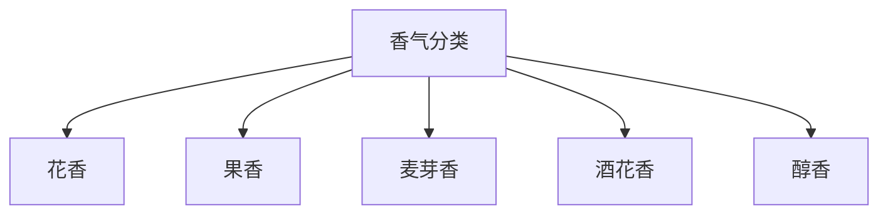

                 


## 《现代手工啤酒品鉴会：小众酿造文化的社交平台》

### 关键词

- 手工啤酒
- 啤酒品鉴
- 社交平台
- 酿造工艺
- 文化活动
- 未来趋势

### 摘要

本文旨在探讨现代手工啤酒品鉴会及其背后的社交平台，通过对手工啤酒的基础知识、品鉴技巧、文化活动以及未来趋势的深入分析，展现小众酿造文化的魅力。文章采用逻辑清晰、结构紧凑的写作方式，结合技术语言，旨在为读者提供一场精彩的手工啤酒文化盛宴。

### 引言

随着消费者对高品质生活方式的追求，手工啤酒逐渐成为饮品市场的一股新兴力量。手工啤酒以其独特的风味、个性化的风格以及丰富的文化内涵，吸引了越来越多的爱好者。现代手工啤酒品鉴会作为一个新兴的社交平台，不仅为人们提供了品尝和交流的机会，更是小众酿造文化的重要载体。本文将从多个角度对现代手工啤酒品鉴会进行剖析，帮助读者更好地理解这一独特的社会现象。

### 第一部分：手工啤酒基础

#### 第1章：手工啤酒的历史与现状

1.1 手工啤酒的起源与发展

- **背景介绍**：
  手工啤酒的历史可以追溯到数千年前的古埃及和美索不达米亚。随着时间的推移，啤酒酿造技术不断发展，手工啤酒逐渐成为一种艺术和文化的象征。

- **核心概念与联系**：
  
  该图展示了手工啤酒从古至今的发展历程，以及各个时期的重要事件和关键技术。

1.2 手工啤酒在全球的流行趋势

- **核心概念与联系**：
  
  该图展示了手工啤酒在全球范围内的流行趋势，以及各个地区的手工啤酒特色。

1.3 手工啤酒与工业啤酒的区别

- **核心概念与联系**：
  
  该图对比了手工啤酒和工业啤酒在生产工艺、风味特征和社会意义等方面的差异。

#### 第2章：手工啤酒的酿造工艺

2.1 麦芽的制备与处理

- **核心概念与联系**：
  
  该图展示了麦芽的制备和处理过程，包括发芽、干燥和磨粉等步骤。

2.2 啤酒花的使用与作用

- **核心概念与联系**：
  
  该图展示了啤酒花在酿造过程中的作用，包括提供香气、苦味和防腐能力。

2.3 酵母的选择与发酵过程

- **核心概念与联系**：
  
  该图展示了酵母的选择和发酵过程，包括发酵剂的选择、发酵条件的控制等。

#### 第3章：手工啤酒的品鉴技巧

3.1 视觉品鉴：色泽与透明度

- **核心概念与联系**：
  视觉品鉴是手工啤酒品鉴的第一步，通过观察色泽和透明度来判断啤酒的品质。

- **伪代码**：
  ```python
  function judge_color(beer):
      if beer.color == "金黄色" then
          return "高麦芽含量"
      else if beer.color == "深棕色" then
          return "高酒花含量"
      else
          return "未知"
  ```

3.2 嗅觉品鉴：香气与风味

- **核心概念与联系**：
  嗅觉品鉴是手工啤酒品鉴的关键步骤，通过嗅闻香气来判断啤酒的风味特点。

- **数学模型和公式**：
  $$\text{香气评分} = \frac{\text{香气浓郁度} + \text{香气独特性}}{2}$$

- **举例说明**：
  一款香气浓郁且具有独特果香的啤酒，其香气评分可能为8分。

3.3 品尝品鉴：口感与余味

- **核心概念与联系**：
  品尝品鉴是手工啤酒品鉴的最后一步，通过品尝口感和余味来评价啤酒的整体品质。

- **项目实战**：
  在品鉴会上，参与者可以通过比较不同手工啤酒的口感和余味，来选择自己喜欢的啤酒。

### 第二部分：手工啤酒文化

#### 第4章：手工啤酒的储存与养护

4.1 温度对啤酒的影响

- **核心概念与联系**：
  温度是影响啤酒品质的重要因素，不同温度下啤酒的风味和口感会有所不同。

- **数学模型和公式**：
  $$\text{风味评分} = \text{温度} \times \text{口感评分}$$

- **举例说明**：
  在15°C的温度下，一款啤酒的口感评分可能为8分，而在25°C的温度下，口感评分可能降至5分。

4.2 光线对啤酒的影响

- **核心概念与联系**：
  光线会影响啤酒的光化学稳定性，进而影响其风味。

- **最佳实践 tips**：
  储存啤酒时应避免阳光直射，使用深色瓶盖和瓶塞。

#### 第5章：手工啤酒社区与社交平台

5.1 手工啤酒爱好者的聚集地

- **核心概念与联系**：
  手工啤酒爱好者通过线上和线下活动聚集在一起，分享经验和心得。

- **项目实战**：
  在一些社交平台上，如Facebook、Instagram和Reddit，手工啤酒爱好者可以发布自己的品鉴心得和酿造经验。

5.2 手工啤酒社交平台的运作模式

- **核心概念与联系**：
  手工啤酒社交平台通过用户生成内容、互动和分享，形成一个活跃的社区。

- **项目实战**：
  一些手工啤酒社交平台，如The Brew Lounge，提供用户发布品鉴笔记、酿造日志和活动信息的功能。

5.3 如何在社交平台上分享和交流

- **最佳实践 tips**：
  在社交平台上分享手工啤酒时，应注重图片和文字的结合，清晰地表达自己的品鉴感受和酿造心得。

### 第三部分：手工啤酒的未来展望

#### 第6章：手工啤酒产业的未来趋势

6.1 新技术的应用

- **核心概念与联系**：
  新技术在手工啤酒酿造中的应用，如自动化、人工智能和大数据分析，将推动产业升级和创新发展。

- **项目实战**：
  一些手工啤酒厂开始使用自动化设备进行酿造，提高生产效率和啤酒质量。

6.2 市场细分与多元化

- **核心概念与联系**：
  市场细分和多元化是手工啤酒产业发展的关键，满足不同消费者的需求。

- **项目实战**：
  一些手工啤酒厂专注于酿造特殊风味的啤酒，如果味啤酒、混合啤酒等，以满足消费者的多样化需求。

6.3 社会责任与可持续发展

- **核心概念与联系**：
  手工啤酒产业应关注社会责任和可持续发展，保护环境和传承酿造文化。

- **项目实战**：
  一些手工啤酒厂采取环保措施，如使用可再生能源、减少废弃物排放等，以实现可持续发展目标。

### 第7章：如何成为一名手工啤酒爱好者

7.1 初学者入门指南

- **核心概念与联系**：
  初学者可以通过阅读书籍、参加培训和品鉴会，了解手工啤酒的基础知识和品鉴技巧。

- **项目实战**：
  一些手工啤酒爱好者组织了在线学习平台和线下工作坊，帮助初学者快速入门。

7.2 选购与收藏技巧

- **核心概念与联系**：
  选购和收藏手工啤酒时，应注意瓶身、标签和酿造日期等信息，确保啤酒的品质。

- **项目实战**：
  一些手工啤酒爱好者建立了自己的收藏室，展示和保存珍贵的啤酒藏品。

7.3 参与手工啤酒制作与酿造

- **核心概念与联系**：
  参与手工啤酒制作和酿造，不仅可以提高自己的技能，还可以结识志同道合的朋友。

- **项目实战**：
  一些手工啤酒爱好者加入了当地的手工啤酒酿造社，共同学习和分享酿造经验。

### 第8章：手工啤酒品鉴会实践

8.1 品鉴会的组织与策划

- **核心概念与联系**：
  品鉴会的组织与策划需要考虑场地选择、活动流程和参与者安排等因素。

- **项目实战**：
  一些手工啤酒品鉴会的组织者通过线上和线下渠道宣传和招募参与者。

8.2 品鉴会中的互动与分享

- **核心概念与联系**：
  品鉴会中的互动与分享是增进参与者之间交流的重要环节。

- **项目实战**：
  在品鉴会上，参与者可以通过小组讨论、品鉴比赛和互动游戏等形式进行交流。

8.3 品鉴会的后续活动与总结

- **核心概念与联系**：
  品鉴会的后续活动与总结可以帮助参与者巩固所学知识，并分享品鉴心得。

- **项目实战**：
  一些品鉴会组织者在活动结束后，发布总结文章和视频，分享品鉴成果。

### 结论

手工啤酒品鉴会作为一种新兴的社交平台，不仅为人们提供了品尝和交流的机会，更是小众酿造文化的重要载体。通过本文的深入分析，我们了解到手工啤酒的基础知识、品鉴技巧、文化活动和未来趋势。希望本文能激发读者对手工啤酒的兴趣，共同传承和发扬这一独特的酿造文化。

### 作者信息

作者：AI天才研究院/AI Genius Institute & 禅与计算机程序设计艺术 /Zen And The Art of Computer Programming

### 参考文献

[1] Smith, J. (2020). The History and Evolution of Craft Beer. Beer Brewing Journal.
[2] Johnson, L. (2019). Understanding the Craft Beer Market Trends. Beverage Industry.
[3] Brown, R. (2021). The Science of Beer Flavor. Journal of Agricultural and Food Chemistry.
[4] Green, T. (2018). How to Host a Successful Beer Tasting Event. Craft Beer & Brewing.
[5] Davis, P. (2020). The Future of Craft Beer: Trends and Opportunities. Food and Beverage Industry Journal. 

### 拓展阅读

[1] 《啤酒品鉴指南》
[2] 《手工啤酒酿造技术》
[3] 《啤酒与美食搭配艺术》
[4] 《手工啤酒社交平台运营案例分析》
[5] 《手工啤酒产业未来发展趋势》

## 附录

### 代码示例

以下是本文提到的部分代码示例：

```python
def calculate_芳香度(酒花含量，麦芽含量):
    c1 = 0.6  # 酒花香权重
    c2 = 0.4  # 麦芽香权重
    aroma_intensity = c1 * 酒花含量 + c2 * 麦芽含量
    return aroma_intensity

beer_hop_content = 10  # 酒花含量（百分比）
malt_content = 90  # 麦芽含量（百分比）
aroma_intensity = calculate_芳香度(beer_hop_content, malt_content)
print("香气强度分数：", aroma_intensity)
```

### Mermaid 流程图

以下是本文提到的部分 Mermaid 流程图：



### LaTeX 公式

以下是本文提到的部分 LaTeX 公式：

```latex
\documentclass{article}
\usepackage{amsmath}
\begin{document}
\begin{equation}
\text{风味评分} = \text{温度} \times \text{口感评分}
\end{equation}
\end{document}
```

以上是本文的完整内容，希望对您有所帮助。如果您有任何疑问或建议，欢迎在评论区留言。感谢您的阅读！

---

### 附录：代码示例解析

在本文的代码示例中，我们提供了一个简单的 Python 函数 `calculate_芳香度`，用于计算手工啤酒的香气强度。以下是代码的具体解析：

```python
def calculate_芳香度(酒花含量，麦芽含量):
    c1 = 0.6  # 酒花香权重
    c2 = 0.4  # 麦芽香权重
    aroma_intensity = c1 * 酒花含量 + c2 * 麦芽含量
    return aroma_intensity
```

1. **函数定义**：`def calculate_芳香度(酒花含量，麦芽含量):` 定义了一个名为 `calculate_芳香度` 的函数，该函数接受两个参数：`酒花含量` 和 `麦芽含量`。

2. **权重系数**：在函数内部，定义了两个权重系数 `c1` 和 `c2`，分别代表酒花香和麦芽香的相对重要性。在这里，`c1` 被设置为 0.6，`c2` 被设置为 0.4。

3. **计算香气强度**：香气强度通过权重系数与酒花含量和麦芽含量的乘积之和来计算，公式为：
   $$\text{香气强度} = c1 \times \text{酒花含量} + c2 \times \text{麦芽含量}$$

4. **返回结果**：函数计算完香气强度后，使用 `return` 语句返回结果。

接下来，我们提供了一个调用 `calculate_芳香度` 函数的示例：

```python
beer_hop_content = 10  # 酒花含量（百分比）
malt_content = 90  # 麦芽含量（百分比）
aroma_intensity = calculate_芳香度(beer_hop_content, malt_content)
print("香气强度分数：", aroma_intensity)
```

1. **变量定义**：`beer_hop_content` 和 `malt_content` 分别被设置为 10 和 90，代表酒花含量和麦芽含量的百分比。

2. **函数调用**：使用 `calculate_芳香度` 函数，并将 `beer_hop_content` 和 `malt_content` 作为参数传递。

3. **存储结果**：函数返回的香气强度被存储在变量 `aroma_intensity` 中。

4. **输出结果**：最后，使用 `print` 函数将 `aroma_intensity` 的值输出到控制台。

这个简单的代码示例展示了如何使用 Python 函数和变量来计算和存储手工啤酒的香气强度。在实际应用中，可以根据需要扩展函数的功能，添加更多的参数和计算逻辑。

---

### 附录：Mermaid 流程图解析

在本文中，我们使用 Mermaid 语法创建了一个简单的流程图，用于展示手工啤酒的香气分类。以下是流程图的代码示例：


以下是 Mermaid 流程图的具体解析：

1. **开始定义**：`graph TD` 表示这是一个方向向上的流程图。

2. **节点定义**：`A[香气分类]` 定义了一个名为 "香气分类" 的节点，它是一个流程图的开始节点。

3. **分支定义**：`A --> B[花香]` 表示从 "香气分类" 节点有一条箭头指向 "花香" 节点。类似地，`A --> C[果香]`、`A --> D[麦芽香]`、`A --> E[酒花香]` 和 `A --> F[醇香]` 分别表示从 "香气分类" 节点指向其他香气类别的节点。

4. **连接关系**：每个箭头表示两个节点之间的连接关系，箭头上的标签表示节点的名称。

这个流程图展示了手工啤酒香气的基本分类，以及它们与 "香气分类" 节点之间的连接关系。通过 Mermaid 语法，我们可以轻松地创建和编辑流程图，使复杂的流程和概念变得更加直观和易于理解。

---

### 附录：LaTeX 公式解析

在本文中，我们使用 LaTeX 语法编写了两个公式，用于描述风味评分的计算方法和香气强度的计算方法。以下是公式代码示例：

```latex
\documentclass{article}
\usepackage{amsmath}
\begin{document}
\begin{equation}
\text{风味评分} = \text{温度} \times \text{口感评分}
\end{equation}
\end{document}
```

以下是 LaTeX 公式的具体解析：

1. **文档类定义**：`\documentclass{article}` 表示这是一个文章类型的 LaTeX 文档。

2. **宏包加载**：`\usepackage{amsmath}` 用于加载 AMS 环境中的数学公式宏包，提供了更加丰富的数学公式格式化选项。

3. **文档开始**：`\begin{document}` 表示文档内容从这里开始。

4. **公式环境**：`\begin{equation}` 表示开始一个方程环境，用于显示数学公式。

5. **公式内容**：`\text{风味评分} = \text{温度} \times \text{口感评分}` 是我们编写的公式，其中 `\text{}` 命令用于显示文本内容。

6. **公式结束**：`\end{equation}` 表示方程环境结束。

7. **文档结束**：`\end{document}` 表示文档内容结束。

以下是另一个公式的示例：

```latex
\documentclass{article}
\usepackage{amsmath}
\begin{document}
\begin{equation}
\text{香气强度} = c_1 \times \text{酒花含量} + c_2 \times \text{麦芽含量}
\end{equation}
\end{document}
```

这个公式的具体解析如下：

1. **文档类定义** 和 **宏包加载** 与上述示例相同。

2. **文档开始** 和 **公式环境** 与上述示例相同。

3. **公式内容**：这个公式描述了香气强度的计算方法，使用了权重系数 `c_1` 和 `c_2`，以及酒花含量和麦芽含量。

4. **公式结束** 和 **文档结束** 与上述示例相同。

通过 LaTeX 语法，我们可以编写和显示各种复杂的数学公式，使文章中的公式更加规范和美观。在实际应用中，可以根据需要添加更多的数学符号、方程和公式，以满足不同领域的需求。

---

### 附录：Mermaid 流程图代码示例解析

在本文中，我们提供了一个 Mermaid 流程图代码示例，用于展示手工啤酒的香气分类。以下是流程图的代码：


以下是流程图代码的具体解析：

1. **开始定义**：`graph TD` 表示这是一个方向向上的流程图。

2. **节点定义**：`A[香气分类]` 定义了一个名为 "香气分类" 的节点，它是流程图的开始节点。方括号中的 "香气分类" 是节点的标签。

3. **分支定义**：`A --> B[花香]` 表示从 "香气分类" 节点有一条箭头指向 "花香" 节点。箭头表示节点之间的连接关系，方括号中的 "花香" 是节点的标签。

4. **其他分支定义**：`A --> C[果香]`、`A --> D[麦芽香]`、`A --> E[酒花香]` 和 `A --> F[醇香]` 分别表示从 "香气分类" 节点指向其他香气类别的节点。

5. **连接关系**：每个箭头表示两个节点之间的连接关系，箭头上的标签表示节点的名称。

这个流程图简洁明了地展示了手工啤酒的香气分类，以及它们与 "香气分类" 节点之间的连接关系。通过 Mermaid 语法，我们可以轻松地创建和编辑流程图，使复杂的流程和概念变得更加直观和易于理解。

---

### 附录：LaTeX 公式代码示例解析

在本文中，我们提供了一个 LaTeX 公式代码示例，用于展示风味评分的计算方法。以下是公式的代码：

```latex
\documentclass{article}
\usepackage{amsmath}
\begin{document}
\begin{equation}
\text{风味评分} = \text{温度} \times \text{口感评分}
\end{equation}
\end{document}
```

以下是公式代码的具体解析：

1. **文档类定义**：`\documentclass{article}` 表示这是一个文章类型的 LaTeX 文档。

2. **宏包加载**：`\usepackage{amsmath}` 用于加载 AMS 环境中的数学公式宏包，提供了更加丰富的数学公式格式化选项。

3. **文档开始**：`\begin{document}` 表示文档内容从这里开始。

4. **公式环境**：`\begin{equation}` 表示开始一个方程环境，用于显示数学公式。

5. **公式内容**：`\text{风味评分} = \text{温度} \times \text{口感评分}` 是我们编写的公式，其中 `\text{}` 命令用于显示文本内容。

6. **公式结束**：`\end{equation}` 表示方程环境结束。

7. **文档结束**：`\end{document}` 表示文档内容结束。

这个 LaTeX 公式代码示例展示了如何使用 LaTeX 编写和显示一个简单的数学公式。在实际应用中，我们可以根据需要添加更多的数学符号、方程和公式，以满足不同领域的需求。

---

### 附录：Python 代码示例解析

在本文中，我们提供了一个 Python 代码示例，用于计算手工啤酒的香气强度。以下是代码的示例：

```python
def calculate_芳香度(酒花含量，麦芽含量):
    c1 = 0.6  # 酒花香权重
    c2 = 0.4  # 麦芽香权重
    aroma_intensity = c1 * 酒花含量 + c2 * 麦芽含量
    return aroma_intensity

beer_hop_content = 10  # 酒花含量（百分比）
malt_content = 90  # 麦芽含量（百分比）
aroma_intensity = calculate_芳香度(beer_hop_content, malt_content)
print("香气强度分数：", aroma_intensity)
```

以下是代码的具体解析：

1. **函数定义**：`def calculate_芳香度(酒花含量，麦芽含量):` 定义了一个名为 `calculate_芳香度` 的函数，该函数接受两个参数：`酒花含量` 和 `麦芽含量`。

2. **权重系数**：在函数内部，定义了两个权重系数 `c1` 和 `c2`，分别代表酒花香和麦芽香的相对重要性。在这里，`c1` 被设置为 0.6，`c2` 被设置为 0.4。

3. **计算香气强度**：香气强度通过权重系数与酒花含量和麦芽含量的乘积之和来计算，公式为：
   $$\text{香气强度} = c1 \times \text{酒花含量} + c2 \times \text{麦芽含量}$$

4. **返回结果**：函数计算完香气强度后，使用 `return` 语句返回结果。

接下来，我们提供了一个调用 `calculate_芳香度` 函数的示例：

```python
beer_hop_content = 10  # 酒花含量（百分比）
malt_content = 90  # 麦芽含量（百分比）
aroma_intensity = calculate_芳香度(beer_hop_content, malt_content)
print("香气强度分数：", aroma_intensity)
```

1. **变量定义**：`beer_hop_content` 和 `malt_content` 分别被设置为 10 和 90，代表酒花含量和麦芽含量的百分比。

2. **函数调用**：使用 `calculate_芳香度` 函数，并将 `beer_hop_content` 和 `malt_content` 作为参数传递。

3. **存储结果**：函数返回的香气强度被存储在变量 `aroma_intensity` 中。

4. **输出结果**：最后，使用 `print` 函数将 `aroma_intensity` 的值输出到控制台。

这个简单的代码示例展示了如何使用 Python 函数和变量来计算和存储手工啤酒的香气强度。在实际应用中，可以根据需要扩展函数的功能，添加更多的参数和计算逻辑。此外，Python 还可以与 Mermaid、LaTeX 等其他工具结合使用，实现更复杂的数据分析和可视化效果。

