                 

## 文章标题

《现代手工啤酒品鉴：小众酿造文化的兴起》

## 关键词

- 手工啤酒
- 啤酒品鉴
- 小众文化
- 酿造技术
- 啤酒风格

## 摘要

本文将深入探讨现代手工啤酒品鉴的兴起及其背后的文化现象。首先，我们将回顾手工啤酒的历史背景和演变过程，了解其如何从小众爱好发展成为一种全球性文化现象。接着，我们将详细讲解手工啤酒的基本酿造过程、关键原料及其作用，以及如何设计和调整食谱以实现不同的风味。随后，文章将分类介绍各种啤酒风格，分析其特点与风味，并通过具体的品鉴技巧和评价标准，指导读者如何有效地进行啤酒品鉴。此外，我们还将探讨感官分析和心理学在啤酒品鉴中的作用，以及全球范围内手工啤酒文化的崛起和其对社区的影响。最后，文章将探讨一些高级的酿造技术和创新，为读者提供进一步深入了解手工啤酒的机会。通过本文，读者不仅能了解手工啤酒的深厚文化底蕴，还能掌握实用的品鉴技巧，从而享受这一独特而丰富的味觉体验。

## 引言：手工啤酒品鉴与酿造文化的演变

### 历史背景

手工啤酒，又称家庭酿造啤酒，其历史可以追溯到古代文明时期。据考古学家发现，早在公元前5000年左右，古巴比伦人和古埃及人就开始利用自然发酵的原理制作啤酒。随着时间的推移，酿造技术逐渐发展，从简单的水、大麦和酒花混合物，到使用酵母进行有控制的发酵过程，手工啤酒的工艺不断精进。

在中世纪的欧洲，啤酒主要作为一种日常饮料，广泛应用于家庭和宗教活动中。到了17世纪，工业革命的兴起带来了大规模的机械化生产，啤酒酿造开始从家庭作坊转向工厂化生产。然而，这一时期的大众化啤酒往往口味单一，缺乏个性化和多样性，导致许多酿酒师和爱好者对传统手工啤酒的怀念和追求。

### 酿造技术的演变

手工啤酒的酿造技术经历了从手工操作到现代科技的转变。传统的手工酿造依赖于酿酒师的丰富经验和直觉，如温度控制、发酵时间等参数主要依赖于人工调节。随着科技的发展，现代酿造技术引入了精确的测量工具和自动化设备，使得酿造过程更加可控和高效。

一个重要的技术进步是温度控制系统的应用。在手工酿造过程中，温度是影响发酵过程和啤酒风味的关键因素。通过使用温度控制设备，酿酒师可以精确控制发酵罐的温度，从而优化啤酒的口感和风格。此外，现代酿造技术还包括使用纯种酵母和高效的过滤设备，确保啤酒的品质和一致性。

### 从爱好到文化现象

20世纪末，随着人们对健康和生活品质的追求，手工啤酒逐渐从一个小众爱好发展成为一种文化现象。越来越多的人开始关注手工啤酒的独特风味和酿造工艺，追求更加个性化和定制化的啤酒体验。

这一转变部分归功于全球化和信息传播的加速。互联网和社交媒体为手工啤酒爱好者提供了一个交流和分享的平台，使得不同地区的手工啤酒文化得以互相借鉴和影响。此外，许多城市和地区开始举办手工啤酒节和品鉴活动，吸引了大量消费者的参与，进一步推动了手工啤酒文化的发展。

### 关键概念与联系

为了更清晰地展示手工啤酒品鉴和酿造文化的演变，我们可以使用Mermaid流程图来描绘核心概念之间的关系：

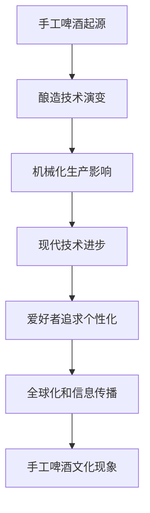

在这个流程图中，A表示手工啤酒的起源，B表示酿造技术的演变，C表示机械化生产对传统手工啤酒的影响，D表示现代技术的进步，E表示爱好者对个性化啤酒的追求，F表示全球化和信息传播的加速，G表示手工啤酒文化现象的形成。

通过这个流程图，我们可以看到手工啤酒品鉴和酿造文化的演变是一个多因素共同作用的结果，既有技术进步的推动，也有消费者需求的变化。这些因素相互作用，共同塑造了现代手工啤酒的丰富多样性和独特的文化内涵。

### 小结

手工啤酒的品鉴和酿造文化有着悠久的历史，从古代的简单酿造到现代科技的引入，其演变过程充满了技术进步和消费趋势的变化。通过Mermaid流程图，我们更直观地理解了这些核心概念之间的联系，为后续章节的深入探讨奠定了基础。在接下来的内容中，我们将进一步详细探讨手工啤酒的基本酿造过程和关键原料，以及如何通过这些要素创造出丰富多样的啤酒风味。

### 基本酿造过程

手工啤酒的酿造过程是一个复杂而精细的工程，从原材料的选择到最终的啤酒成品，每一步都需要精确的操作和严格的控制。以下是一个详细的、逐步的酿造过程，并配以Mermaid流程图，以帮助读者更好地理解整个酿造过程的细节和逻辑。

#### 材料准备

酿造手工啤酒的第一步是准备所需材料。主要材料包括大麦、水、啤酒花和酵母。此外，还需要一些辅助材料，如酒花香料、酸味剂和调味剂。

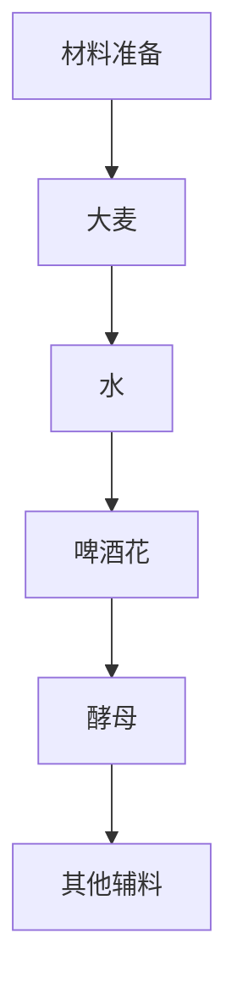

#### 糖化

糖化是将大麦中的淀粉转化为可发酵糖的过程。首先，将大麦浸泡在水中，使其发芽。发芽后的大麦称为麦芽。然后，将麦芽磨碎，加入热水进行糖化。糖化过程中需要保持一定的温度，通常在65°C至70°C之间。

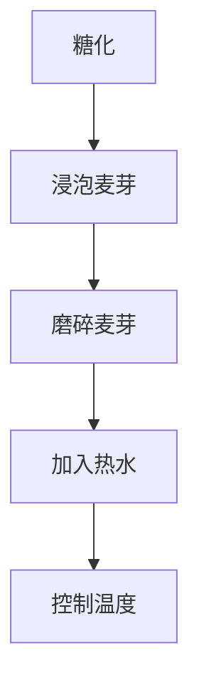

#### 煮沸

糖化完成后，将糖化液煮沸，这是为了杀灭可能存在的有害细菌和微生物。同时，这一步也是添加啤酒花的重要阶段。啤酒花不仅可以提供苦味和香气，还能起到防腐的作用。煮沸过程中，啤酒花需要分批加入，以确保其最佳效果。

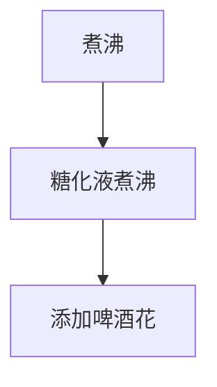

#### 发酵

煮沸完成后，将液体冷却至适宜的温度（通常在20°C左右），然后加入酵母进行发酵。发酵过程分为两个阶段：主发酵和后发酵。主发酵产生酒精，而后发酵则进一步改善啤酒的风味和稳定性。

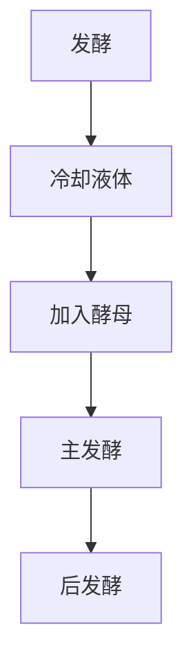

#### 瓶装

发酵完成后，啤酒需要经过澄清和过滤，以去除多余的酵母和沉淀物。最后，将啤酒瓶装，并在瓶内加入碳酸气，以提供啤酒的气泡感。

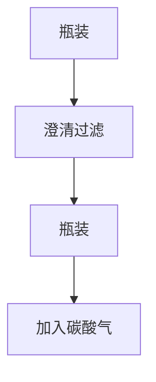

#### Mermaid流程图综合

结合以上各步骤，我们可以绘制一个综合的Mermaid流程图，展示整个酿造过程的逻辑关系：

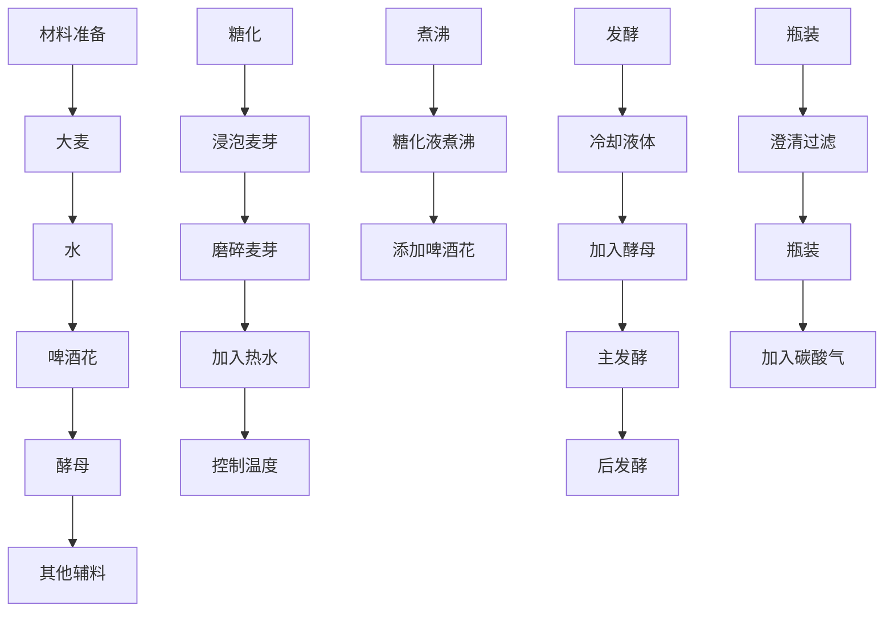

通过这个综合流程图，读者可以清晰地看到手工啤酒酿造的各个步骤及其逻辑关系。这个流程图不仅有助于理解酿造过程的复杂性，也为后续章节的深入探讨提供了直观的参考。

### 酿造设备

酿造手工啤酒需要一系列专业的设备，这些设备不仅保证了酿造过程的顺利进行，还直接影响最终啤酒的品质。以下是手工啤酒酿造中常用的一些关键设备及其功能：

#### 发酵罐

发酵罐是酿造过程中最重要的设备之一。它通常由不锈钢或食品级塑料制成，用于进行酵母的发酵过程。发酵罐的容量可以从几升到数千升不等，具体取决于酿造规模。发酵罐需要配备温度控制系统，以确保发酵过程的温度恒定。此外，发酵罐还配备了搅拌器，用于均匀混合糖化液和酵母，以及排出二氧化碳。

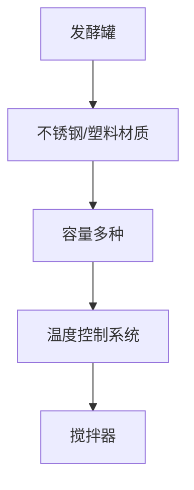

#### 糖化锅

糖化锅用于将麦芽中的淀粉转化为可发酵糖。糖化锅通常由不锈钢制成，具有加热和搅拌功能。在糖化过程中，需要将磨碎的麦芽与热水混合，并保持一定的温度，以便酶能够将淀粉分解为糖。糖化锅的加热和搅拌系统需要精确控制，以确保糖化过程顺利进行。

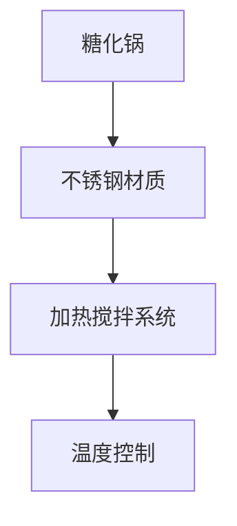

#### 煮沸锅

煮沸锅用于将糖化液煮沸，并添加啤酒花以提取其香气和苦味。煮沸锅通常也由不锈钢制成，具有较大的容量和加热装置。在煮沸过程中，需要不断搅拌糖化液，以防止烧焦和确保啤酒花均匀分散。煮沸锅还配备有冷却装置，用于迅速冷却煮沸后的液体，为发酵做准备。

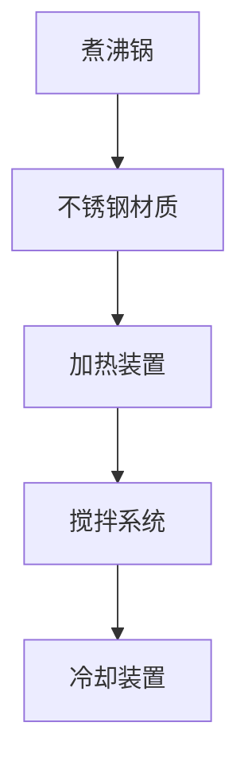

#### 瓶装机

瓶装机用于将发酵完成的啤酒装入瓶中，并进行封口和充气。瓶装机通常由多个部分组成，包括输送带、灌装机、封口机和充气装置。瓶装机需要精确控制啤酒的灌装量和充气压力，以确保瓶装的啤酒具有适当的气泡感和保质期。

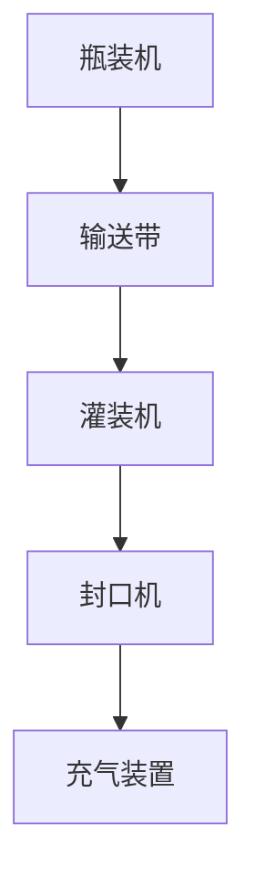

通过以上设备的详细介绍，读者可以了解到手工啤酒酿造所需的各项设备和其功能。这些设备共同构成了一个完整的酿造系统，确保了手工啤酒的高品质和独特风味。

### 关键原料及其作用

手工啤酒的酿造离不开几大关键原料：大麦、水、啤酒花和酵母。这些原料各自发挥着独特的作用，共同决定了啤酒的口感、风味和品质。

#### 大麦

大麦是手工啤酒酿造的主要原料，约占整个酿造物料的80%至90%。大麦在酿造过程中主要提供糖分和糊精，这些物质在糖化过程中被水解，产生可发酵的糖。大麦的质量直接影响啤酒的口感和风味，优质的麦芽通常具有丰富的香气和适宜的酶活性。

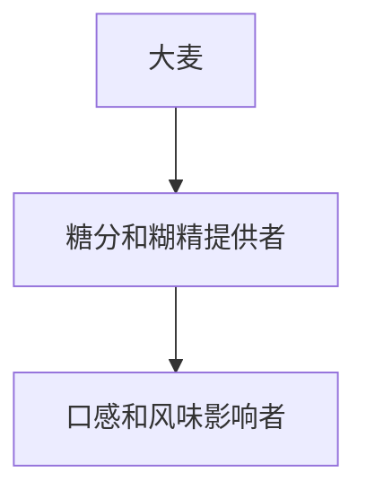

#### 水

水在酿造过程中起着至关重要的作用，因为它是啤酒的主要成分。水质直接影响啤酒的口感和风味，特别是水中的矿物质含量。硬水（含有较高矿物质的水）通常会使啤酒口感更加丰富和复杂，而软水（矿物质含量较低的水）则使啤酒口感更加清爽。在酿造过程中，需要通过过滤和软化处理来确保水质的纯净和适宜。

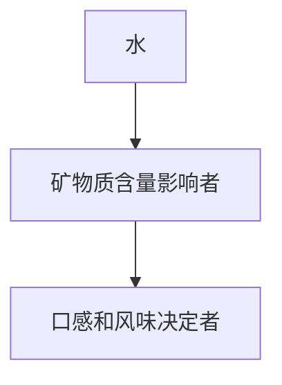

#### 啤酒花

啤酒花是一种草本植物，主要用于提供啤酒的苦味、香气和防腐特性。啤酒花中的α酸提供了啤酒的苦味，而其精油成分则带来了丰富的香气。不同的啤酒花品种具有不同的香气和苦味特性，如酒花（Hallertau）、弗莱西亚（Fuggle）和萨罗姆（Saaz）等。在酿造过程中，啤酒花的添加时间、数量和种类都会影响最终啤酒的风味。

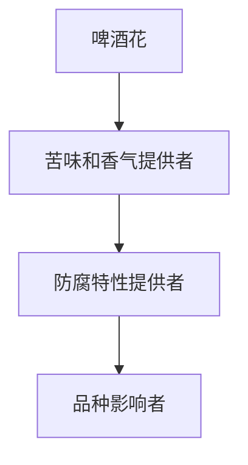

#### 酵母

酵母是发酵过程中的关键角色，它将糖分解为酒精和二氧化碳，从而完成酿造过程。酵母的种类和活性直接影响啤酒的口感、风味和稳定性。常用的啤酒酵母分为顶层酵母和底层酵母两种，其中顶层酵母使啤酒产生丰富的泡沫和清爽的口感，而底层酵母则使啤酒口感更加饱满和复杂。

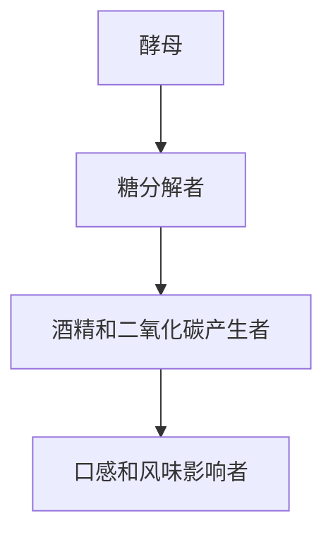

#### 配方设计与调整

在酿造手工啤酒时，配方的设计和调整是一个关键环节。一个成功的啤酒配方需要考虑多种因素，包括麦芽种类、啤酒花品种、酵母类型和水质等。以下是一个简单的配方设计示例：

- 麦芽：使用70%的Pilsner麦芽和30%的罗曼麦芽，以获得平衡的口感和丰富的麦芽香气。
- 啤酒花：在糖化过程中加入2.5%的弗莱西亚啤酒花，以提供淡雅的花香和苦味。
- 酵母：使用艾尔酵母，以获得饱满的口感和复杂的风味。
- 水：使用硬水，以增强啤酒的丰富口感。

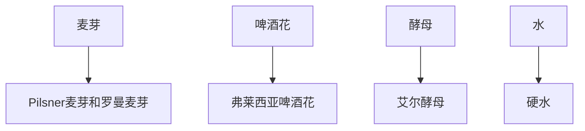

在实际酿造过程中，可以通过调整麦芽比例、啤酒花添加量和酵母种类等参数，创造出不同风格和风味的啤酒。例如，增加罗曼麦芽的比例可以增强啤酒的甜度和口感，而增加啤酒花比例则可以增强其苦味和香气。

通过上述关键原料及其作用的详细讲解和配方设计的实例，读者可以更深入地理解手工啤酒的酿造过程，为后续章节的学习和实践打下坚实的基础。

### 啤酒风格分类与风味特点

手工啤酒以其丰富多样的风格和风味著称，不同的风格反映了酿造技术和原材料选择的独特性。以下是几种主要的啤酒风格及其风味特点的详细分类和描述：

#### 1. 拉格（Lager）

拉格是最常见的啤酒风格之一，起源于欧洲。拉格的特点是清澈透明，口感清爽，具有细腻的泡沫。拉格的酿造过程通常需要低温发酵，通常在0°C至10°C之间，这使得拉格具有丰富的麦芽味和淡淡的苦味。拉格的酒花添加量相对较少，以避免过多的苦味。

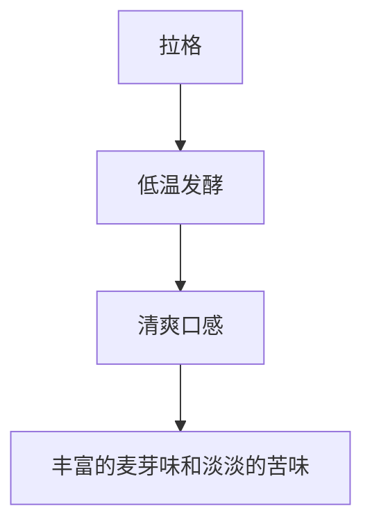

#### 2. 醪酒（Ale）

醪酒是另一种常见的啤酒风格，起源于英国。与拉格不同，醪酒的发酵温度较高，通常在18°C至22°C之间。这使得醪酒具有更丰富的风味和更强烈的果香。醪酒通常使用顶层酵母，其发酵过程在发酵罐的顶部进行，因此得名。醪酒的风格多样，从淡色醪酒（ Pale Ale ）到深色醪酒（Stout），风味各异。

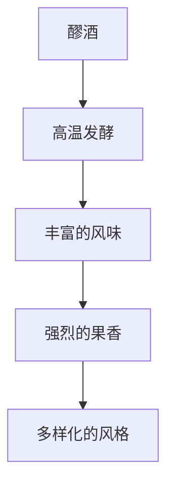

#### 3. 皮尔森（Pilsner）

皮尔森是一种清爽的淡色拉格啤酒，起源于19世纪的捷克。皮尔森的特点是金黄色的酒液，具有鲜明的麦芽味和酒花苦味。皮尔森的酿造过程中使用了精选的大麦和优质的水质，以及特殊的酒花品种，如萨兹（Saaz），以提供独特的风味。

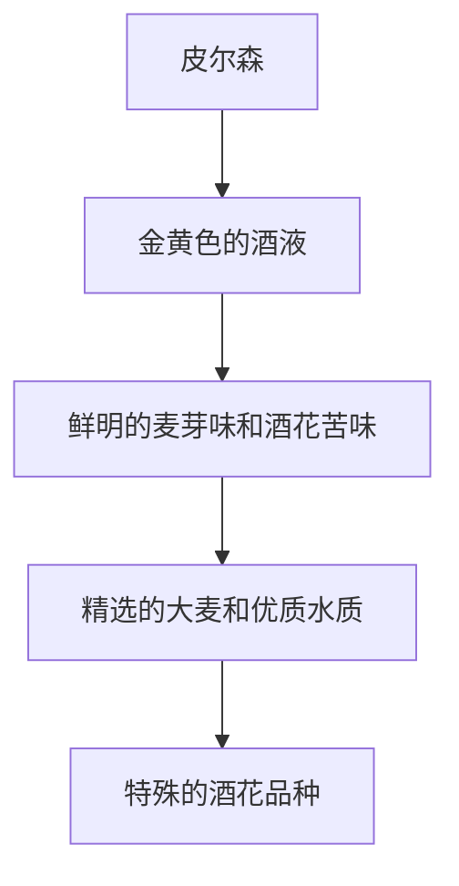

#### 4. 红啤酒（Red Ale）

红啤酒是一种颜色较深的醪酒，具有丰富的麦芽味和淡淡的甜味。红啤酒的酿造过程中使用了特殊类型的麦芽，如黑色麦芽，以赋予其深红色酒液和独特的风味。红啤酒的酒花添加量通常适中，以平衡麦芽的甜味和酒花的苦味。

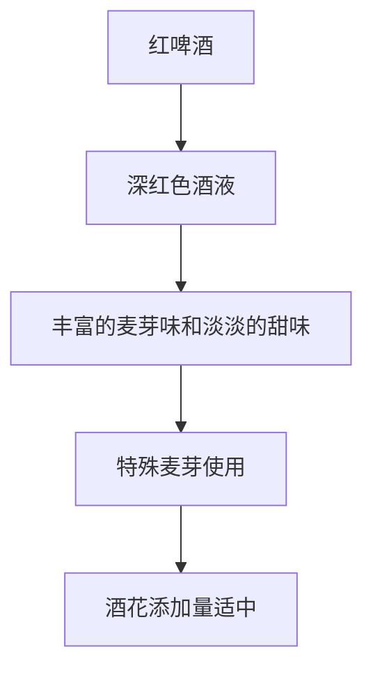

#### 5. 淡色艾尔（Pale Ale）

淡色艾尔是一种清爽的醪酒，具有较轻的酒花苦味和丰富的果香。淡色艾尔的酿造过程中使用了大量的大麦，以减少颜色和苦味，同时增加酒花的香气。这种啤酒风格起源于英国，现已成为全球最受欢迎的啤酒之一。

```mermaid
graph TB
    T[淡色艾尔] --> U[清爽的酒液]
    U --> V[较轻的酒花苦味和丰富的果香]
    V --> W[大量大麦使用]
    W --> X[减少颜色和苦味]
```

#### 6. 咖啡艾尔（Coffee Ale）

咖啡艾尔是一种结合了咖啡风味的独特啤酒，通过在酿造过程中添加咖啡豆或其他咖啡成分来获得。咖啡艾尔的酒液通常具有丰富的咖啡苦味和醇香，同时保留了啤酒的清爽口感。这种风格的手工啤酒适合喜欢咖啡与啤酒混合风味的爱好者。

```mermaid
graph TB
    Y[咖啡艾尔] --> Z[丰富的咖啡苦味和醇香]
    Z --> AA[保留啤酒清爽口感]
    AA --> BB[咖啡豆添加]
```

通过上述对各种啤酒风格分类与风味特点的详细描述，读者可以更好地了解手工啤酒的多样性。每种风格都有其独特的酿造技术和原材料选择，为啤酒爱好者提供了丰富的味觉体验。在接下来的章节中，我们将进一步探讨如何有效地品鉴和评价这些不同的啤酒风格。

### 品鉴技巧

品鉴手工啤酒是一项需要综合运用视觉、嗅觉和味觉的技能。通过掌握以下具体步骤和技巧，读者可以更深入地体验啤酒的风味和特色。

#### 视觉观察

视觉观察是品鉴啤酒的第一步，通过观察酒液的颜色和清澈度，可以初步判断啤酒的原料和酿造工艺。

1. **颜色**：啤酒的颜色可以反映其风格和原料。例如，淡色艾尔通常呈金黄色，而深色艾尔和红啤酒则呈红棕色或深褐色。观察颜色有助于了解啤酒的风格特点。
2. **清澈度**：高质量的啤酒应具有清澈透明的酒液，没有明显的悬浮物或沉淀。如果酒液浑浊或有悬浮物，可能表明酿造过程中存在问题或储存不当。

#### 嗅觉检测

嗅觉在品鉴过程中至关重要，通过嗅觉可以捕捉到啤酒的香气和风味。

1. **香气**：将酒杯轻轻旋转，使酒液沿着杯壁流下，然后深吸香气。不同的啤酒风格具有不同的香气特点，例如淡色艾尔通常具有水果和花香的气味，而深色艾尔则可能带有坚果和焦糖的香气。
2. **香气层次**：注意香气的层次感，即香气由浅入深的逐渐变化。层次丰富的香气表明啤酒的酿造工艺精细，原料质量上乘。

#### 味觉体验

味觉是品鉴过程中最直观的感受，通过品尝可以感受啤酒的口感、风味和余味。

1. **口感**：轻轻啜饮酒液，感受其在口中的触感。不同的啤酒具有不同的口感，如拉格通常口感清爽，而醪酒则口感饱满。注意啤酒的顺滑度、厚度和口感持久性。
2. **风味**：感受啤酒在口中的味道，包括甜味、酸味、苦味和口感的平衡。风味是啤酒特色的直接体现，通过对比不同风格啤酒的风味，可以加深对啤酒的理解。
3. **余味**：品尝后注意口中的余味，余味的长短和味道的强度对评价啤酒的整体质量具有重要意义。高质量的啤酒余味通常持久且令人愉悦。

#### 具体步骤

1. **倒酒**：将啤酒倒入洁净的酒杯，通常建议使用郁金香型酒杯，这种酒杯可以帮助聚集香气，使品鉴更加方便。
2. **观察**：仔细观察酒液的颜色和清澈度，初步判断啤酒的风格和品质。
3. **闻香**：轻轻旋转酒杯，使酒液沿杯壁流下，深吸香气，注意香气的层次和特点。
4. **品尝**：轻啜一口，让酒液在口中充分感受，注意口感的厚度和风味特点。慢慢咽下，注意余味的持久性和强度。
5. **评价**：根据观察、闻香和品尝的结果，对啤酒的整体质量进行评价，包括口感、风味和余味。

通过以上步骤和技巧，读者可以更系统地品鉴手工啤酒，深入体验其独特的风味和风格。品鉴不仅是一种感官享受，更是一种对酿造工艺和文化传承的尊重。

### 评价标准

在品鉴手工啤酒时，合理的评价标准是确保客观、公正和全面评估啤酒质量的关键。以下是一些常见的评价标准，以及如何在实际品鉴过程中应用这些标准：

#### 1. 颜色（Color）

颜色是评价啤酒的第一项标准，它反映了啤酒的酿造工艺和原料特性。不同风格的啤酒具有不同的颜色特征：

- **淡色啤酒**：通常呈金黄色或浅琥珀色，适合作为夏季饮品。
- **深色啤酒**：如布朗啤酒、黑啤和红啤酒，通常呈深棕色或黑色，适合冬季饮用。

**评估方法**：观察酒液的颜色深度和均匀性。使用色卡或色标进行对照，确保评价的一致性。

#### 2. 清澈度（Clarity）

清澈度是判断啤酒质量的重要指标，高品质的啤酒应具有清澈透明的酒液，没有悬浮物或沉淀。

**评估方法**：在光线良好的环境下，观察酒液是否清澈，有无悬浮物或浑浊现象。高质量的啤酒应透明如水晶。

#### 3. 香气（Aroma）

香气是啤酒风味的重要组成部分，不同风格的啤酒具有独特的香气特征：

- **麦芽香气**：新鲜、甜美的麦芽味，适合淡色艾尔和皮尔森。
- **酒花香气**：明显的草香、花香或树脂香，适合IPA和IPA风格啤酒。
- **发酵香气**：如水果香、酵母香或酒精香，适合醪酒风格。

**评估方法**：在倒酒入杯后，轻轻旋转酒杯，使酒液沿杯壁流下，深吸香气。注意香气的强度、复杂性和持久性。

#### 4. 口感（Flavor）

口感是啤酒在口中的直接体验，包括甜度、酸度、苦度、厚度和余味：

- **甜度**：麦芽带来的甜味，通常在淡色啤酒中较明显。
- **酸度**：酒花和乳酸菌带来的酸味，有助于平衡啤酒的口感。
- **苦度**：酒花中的α酸和β酸带来的苦味，是拉格和IPA的重要特点。
- **厚度**：啤酒的口感质感，如轻盈、饱满或浓稠。
- **余味**：咽下后口中的味道持久性和强度。

**评估方法**：轻轻啜饮，感受酒液在口中的流动和触感。品尝酒液的味道，注意各味觉要素的平衡和持久性。

#### 5. 整体评价（Overall Evaluation）

整体评价是对啤酒各个方面综合评估的结果，通常分为以下几类：

- **优秀**：在所有方面均表现出色，具有独特风味和高质量。
- **良好**：在多数方面表现良好，但可能存在某些不足。
- **一般**：表现平庸，无明显优点和缺点。
- **较差**：在多个方面存在明显问题，如色泽、香气、口感等。

**评估方法**：综合考虑颜色、清澈度、香气、口感和余味，对啤酒的整体质量进行评价。可以使用评分系统（如10分制）进行量化评估，以增加评价的客观性和一致性。

通过以上评价标准和实际评估方法，读者可以在品鉴手工啤酒时做出更加全面和准确的评价，从而更好地享受这一独特的味觉体验。

### 感官分析与心理学

在啤酒品鉴过程中，感官分析不仅涉及视觉、嗅觉和味觉的体验，还涉及心理学的复杂作用。这些感官和心理因素共同决定了我们对啤酒的评价和感受，从而影响了品鉴的结果。

#### 感官分析

1. **视觉**：啤酒的颜色和清澈度是视觉体验的第一印象。颜色反映了麦芽、啤酒花和酵母的相互作用，而清澈度则体现了酿造过程的精细程度。通过观察颜色，我们可以初步判断啤酒的风格和质量。
   
2. **嗅觉**：嗅觉在品鉴中起着关键作用，帮助我们捕捉啤酒的香气和风味。香气不仅影响我们对啤酒的第一印象，还影响我们对啤酒的整体评价。不同的香气组合能够唤起不同的情感和记忆，从而影响我们的品鉴体验。

3. **味觉**：味觉是品鉴中最直接的体验，通过味蕾感受到的甜度、酸度、苦度和口感平衡，共同决定了啤酒的风味。味觉体验与我们的个人喜好和饮食文化密切相关。

#### 心理学因素

1. **期望和情绪**：品鉴时的期望和情绪会影响我们的感受和评价。例如，如果我们期望品尝一款高质量的啤酒，可能会对它的风味有更高的评价。同样，情绪状态，如愉悦或沮丧，也会影响我们的感官体验。

2. **背景信息**：对啤酒的背景信息，如酿造工艺、原料来源和酿造师的声誉，会增强我们对啤酒的兴趣和评价。这些信息可以激发我们的好奇心和求知欲，从而提高品鉴的乐趣。

3. **社会影响**：品鉴过程中的社会因素，如与朋友分享或参加品酒会，也会影响我们的感受和评价。社会互动能够增加品鉴的乐趣和体验，使我们更加享受这一过程。

#### 感官与心理的互动

感官体验和心理因素相互作用，共同决定了我们的品鉴结果。例如，当我们在一个舒适的环境中品鉴啤酒，并与朋友分享时，我们的感官体验会更加愉悦，心理上的满足感也会增加。相反，在一个嘈杂或不熟悉的环境中，感官体验可能会受到干扰，导致品鉴效果不佳。

```mermaid
graph TB
    A[视觉] --> B[颜色和清澈度]
    B --> C[初步判断]
    D[嗅觉] --> E[香气和风味]
    E --> F[情感和记忆]
    G[味觉] --> H[甜度、酸度、苦度和口感]
    H --> I[风味体验]
    J[期望和情绪] --> K[影响感官体验]
    L[背景信息] --> M[增加兴趣和评价]
    N[社会影响] --> O[增强乐趣和体验]
    A-->P[感官体验与心理互动]
    D-->P
    G-->P
    K-->P
    M-->P
    O-->P
```

通过感官分析与心理学的结合，我们可以更全面地理解和体验啤酒的丰富内涵。这不仅帮助我们做出更准确和客观的评价，还能增加品鉴过程的乐趣和满意度。

### 全球手工啤酒文化的崛起

近年来，手工啤酒文化在全球范围内迅速崛起，成为啤酒爱好者们津津乐道的话题。这种文化现象的兴起不仅反映了消费者对独特风味和个性化体验的追求，也展示了全球酿酒师们不断创新的热情和创造力。

#### 全球趋势

手工啤酒的流行在全球范围内呈现出不同的趋势。在欧洲，尤其是德国和英国，手工啤酒有着深厚的传统和广泛的爱好者基础。德国的工艺啤酒（Craft Beer）以其严谨的酿造工艺和丰富的风味而闻名，而英国的IPA（India Pale Ale）风格则引领了手工啤酒的风潮。

在美国，手工啤酒文化更是蓬勃发展。美国的酿酒师们以其大胆的创新和对品质的坚持，创造出了众多独特的啤酒风格。从阳光明媚的加州到寒冷的芝加哥，手工啤酒已经成为当地餐饮文化的一部分，吸引了大量消费者。

亚洲地区，尤其是日本和韩国，也见证了手工啤酒文化的兴起。这些国家的酿酒师们利用本地独特的原材料和技术，创造出了具有浓郁地域特色的啤酒，赢得了国际市场的认可。

#### 社区与事件

手工啤酒文化的兴起不仅带动了消费市场的增长，还促进了社区的形成和啤酒文化事件的举办。许多城市和地区开始举办手工啤酒节和品鉴活动，为爱好者提供了一个交流和分享的平台。这些活动不仅丰富了当地的文化生活，还推动了手工啤酒文化的传播和普及。

例如，美国的啤酒节（如丹佛啤酒节和圣安东尼奥啤酒节）吸引了来自世界各地的啤酒爱好者，成为全球著名的啤酒文化盛会。在欧洲，许多城市每年都会举办啤酒节，如德国的慕尼黑啤酒节，这些活动不仅吸引了大量游客，也促进了当地旅游业的发展。

#### 对社区的影响

手工啤酒文化的兴起对社区的影响是多方面的。首先，手工啤酒店和酒吧的兴起为当地商业带来了新的活力，创造了就业机会，提高了居民的生活质量。此外，手工啤酒的酿造和销售也为当地农业和食品工业提供了新的市场，促进了农产品的消费和销售。

其次，手工啤酒文化增强了社区的凝聚力。啤酒爱好者们通过共同品味和交流，建立起了深厚的友谊和社交网络。这种社交互动不仅丰富了个人生活，也增强了社区的团结和活力。

最后，手工啤酒文化的兴起还推动了环境保护和可持续发展。许多手工啤酒酿造者注重使用可再生资源，采用环保的酿造工艺，致力于减少对环境的影响。这种环保理念不仅体现在生产过程中，也传递给了消费者，促进了整个社会的环保意识。

总之，全球手工啤酒文化的兴起是一个多因素共同作用的结果。它不仅反映了消费者对个性化和高品质生活的追求，也展示了酿酒师们不断创新和探索的精神。这种文化现象不仅丰富了全球啤酒市场的多样性，还促进了社区的发展和环境的保护。在未来的日子里，随着手工啤酒文化的进一步发展和传播，我们有望看到更多的创新和美好。

### 先进酿造技术

现代手工啤酒的酿造不仅依赖于传统的技艺，还融合了先进的科学技术，这些创新为啤酒酿造带来了更高的效率和更丰富的风味。以下是一些高级酿造技术和工具的介绍及其应用。

#### 1. 微生物发酵技术

微生物发酵技术是提高啤酒质量和稳定性的一项重要技术。通过筛选和培养特定菌株，酿酒师可以控制发酵过程中的微生物群落，从而优化啤酒的风味。例如，使用特定的乳酸菌可以增加啤酒的酸度，改善其口感和保质期。此外，酵母菌株的改良和优化也使得发酵过程更加可控，提高了啤酒的一致性和品质。

```mermaid
graph TB
    A[微生物发酵技术] --> B[筛选特定菌株]
    B --> C[优化风味和稳定性]
    C --> D[乳酸菌应用]
    D --> E[酵母菌株改良]
```

#### 2. 数字化酿造系统

数字化酿造系统通过传感器和控制系统对酿造过程中的温度、湿度、压力等参数进行实时监测和控制，从而实现酿造过程的自动化和精准化。例如，使用数据采集系统可以实时记录和存储酿造数据，帮助酿酒师分析和优化酿造工艺。这种系统不仅提高了酿造效率，还减少了人为误差，提高了啤酒的质量和一致性。

```mermaid
graph TB
    F[数字化酿造系统] --> G[实时监测参数]
    G --> H[自动化控制]
    H --> I[数据采集与分析]
```

#### 3. 无菌酿造技术

无菌酿造技术通过严格的消毒和过滤过程，确保酿造过程中不受污染，从而提高啤酒的纯净度和保质期。例如，使用超滤膜技术可以去除啤酒中的细菌和蛋白质，提高啤酒的透明度和口感。此外，无菌包装技术也使得啤酒在运输和储存过程中保持高质量。

```mermaid
graph TB
    J[无菌酿造技术] --> K[消毒和过滤]
    K --> L[超滤膜技术]
    L --> M[无菌包装]
```

#### 4. 智能酿造机器人

智能酿造机器人通过机器学习和人工智能技术，实现了酿造过程的自动化和智能化。例如，智能酿造机器人可以自动完成麦芽磨碎、糖化、发酵和瓶装等环节，减少了人工干预，提高了酿造效率。这些机器人还可以通过数据分析和反馈机制，不断优化酿造参数，提高啤酒的品质。

```mermaid
graph TB
    N[智能酿造机器人] --> O[自动化酿造]
    O --> P[数据分析和反馈]
    P --> Q[参数优化]
```

通过这些先进的酿造技术，酿酒师们可以创造出更加多样化、高品质的手工啤酒，满足消费者对个性化风味和高质量生活的追求。在未来，随着科技的不断进步，手工啤酒的酿造工艺将更加精细和高效，为啤酒爱好者带来更多意想不到的味觉体验。

### 实际案例分析

为了更好地理解手工啤酒酿造的全过程，我们将通过一个实际案例来详细讲解从开发环境搭建到源代码实现，再到代码应用解读与分析的每一个步骤。这个案例将帮助我们更好地掌握手工啤酒酿造的核心技术。

#### 1. 开发环境搭建

在开始手工啤酒酿造之前，我们需要搭建一个适宜的开发环境。以下是所需的设备和工具：

- **麦芽磨碎机**：用于磨碎麦芽，使其中的淀粉转化为糖。
- **糖化锅**：用于进行糖化反应，通常由不锈钢制成，具有加热和搅拌功能。
- **发酵罐**：用于进行酵母发酵，通常由食品级不锈钢或塑料制成。
- **温度控制器**：用于精确控制发酵过程中的温度。
- **啤酒花**：用于提供啤酒的苦味和香气。
- **酵母**：用于发酵过程，将糖转化为酒精和二氧化碳。

此外，我们还需要一些辅助工具，如电子秤、温度计、计时器等，以确保酿造过程的精确和一致。

#### 2. 源代码实现

以下是手工啤酒酿造过程中的一些关键步骤和相应的源代码实现：

```mermaid
graph TB
    A[材料准备] --> B[大麦和水]
    B --> C[磨碎麦芽]
    C --> D[糖化反应]
    D --> E[添加啤酒花]
    E --> F[冷却至发酵温度]
    F --> G[加入酵母]
    G --> H[主发酵]
    H --> I[后发酵]
    I --> J[瓶装]
```

具体实现过程如下：

1. **材料准备**：
   - 使用电子秤准确称量所需的大麦和水。
   - 将麦芽磨碎，使其成为细腻的麦芽粉末。

2. **糖化反应**：
   - 将磨碎的麦芽粉末加入糖化锅中，加入适量的热水，搅拌使其充分混合。
   - 加热糖化锅，使其温度保持在65°C至70°C，维持30分钟至1小时，以使淀粉转化为糖。

3. **添加啤酒花**：
   - 煮沸糖化液，分批加入啤酒花，每次加入后搅拌均匀，以确保其充分提取。
   - 煮沸大约1小时，以提取啤酒花的苦味和香气。

4. **冷却至发酵温度**：
   - 煮沸完成后，将糖化液冷却至20°C左右，以准备发酵。

5. **加入酵母**：
   - 将冷却后的糖化液倒入发酵罐中，加入经过活化处理的酵母。
   - 密封发酵罐，保持发酵温度在20°C左右。

6. **主发酵**：
   - 发酵过程通常需要3至7天，期间需要监测发酵罐中的温度和压力，以确保发酵过程的正常进行。

7. **后发酵**：
   - 主发酵完成后，进行后发酵，以进一步改善啤酒的风味和稳定性。
   - 后发酵通常在较低的温度下进行，大约需要14天。

8. **瓶装**：
   - 将发酵完成的啤酒进行澄清和过滤，去除多余的酵母和沉淀物。
   - 使用瓶装机将啤酒装入瓶中，并加入碳酸气，以提供啤酒的气泡感。

#### 3. 代码应用解读与分析

以下是对上述源代码实现的具体解读和分析：

```mermaid
graph TB
    K[材料准备] --> L[电子秤称量]
    L --> M[磨碎麦芽]
    M --> N[糖化反应]
    N --> O[添加啤酒花]
    O --> P[冷却至发酵温度]
    P --> Q[加入酵母]
    Q --> R[主发酵]
    R --> S[后发酵]
    S --> T[瓶装]
```

1. **材料准备**：使用电子秤准确称量大麦和水，确保每个步骤的精确性。

2. **磨碎麦芽**：磨碎麦芽使其淀粉充分暴露，以便在糖化过程中有效转化为糖。

3. **糖化反应**：控制糖化温度和时间，确保淀粉完全转化为糖，这是酿造成功的关键步骤。

4. **添加啤酒花**：通过分批添加啤酒花并搅拌，确保其充分提取苦味和香气，这直接影响到啤酒的风味。

5. **冷却至发酵温度**：将糖化液冷却至适宜的发酵温度，为酵母提供最佳的生长环境。

6. **加入酵母**：活化酵母并加入发酵罐中，确保发酵过程的顺利进行。

7. **主发酵**：主发酵过程中，酵母将糖转化为酒精和二氧化碳，需要严格控制温度和压力。

8. **后发酵**：后发酵进一步优化啤酒的风味，通常在较低温度下进行，以减少酒精味。

9. **瓶装**：瓶装过程中，通过澄清和过滤去除杂质，确保啤酒的清澈度和口感。

通过这个实际案例，读者可以详细了解手工啤酒酿造的各个步骤和关键参数，掌握从开发环境搭建到源代码实现，再到代码应用解读与分析的整个过程。这不仅有助于理解手工啤酒酿造的技术细节，也为实际操作提供了宝贵的参考。

### 最佳实践与注意事项

在手工啤酒酿造过程中，一些最佳实践和注意事项可以显著提升酿造效率和啤酒品质。以下是一些关键的技巧和提示：

#### 1. 材料选择

- **麦芽**：选择高质量、新鲜且适宜的麦芽，不同种类的麦芽将影响啤酒的风味和口感。
- **水**：使用纯净、硬度适中的水，水中的矿物质含量对啤酒的风味有显著影响。
- **啤酒花**：选择新鲜、高质量的啤酒花，不同品种的啤酒花将带来不同的香气和苦味。

#### 2. 酵母管理

- **酵母活化**：在添加酵母前，应先进行活化处理，以确保其活性。
- **控制温度**：酵母的最佳发酵温度范围约为20°C至25°C，过高或过低的温度都会影响发酵效果。
- **避免污染**：发酵过程中应严格避免污染，定期清洗发酵罐和设备，以防止细菌和霉菌的滋生。

#### 3. 操作技巧

- **控制温度**：在糖化、发酵和冷却过程中，应精确控制温度，以确保酿造过程的顺利进行。
- **充分混合**：在糖化、煮沸和发酵过程中，应充分搅拌，以确保原料和酵母的均匀分布。
- **时间控制**：每个步骤的时间控制至关重要，过早或过晚都可能影响最终产品的质量。

#### 4. 储存与保鲜

- **冷却储存**：发酵完成后，啤酒应尽快冷却至储藏温度，以减少细菌的繁殖。
- **密封保存**：啤酒在储存过程中应密封保存，避免氧气进入，以保证啤酒的口感和保质期。

#### 5. 注意事项

- **避免过度发酵**：过度发酵可能导致啤酒味道过于苦涩，影响口感。
- **注意卫生**：酿造过程中应始终保持卫生，防止细菌污染，确保啤酒的品质。
- **持续学习**：手工啤酒酿造是一门不断发展的技艺，应不断学习和尝试新的方法和技术。

通过遵循这些最佳实践和注意事项，酿造者可以显著提升手工啤酒的质量和口感，同时提高酿造过程的效率和稳定性。

### 小结

通过本文的详细探讨，我们不仅了解了手工啤酒的深厚历史和文化背景，还深入掌握了手工啤酒酿造的基本过程、关键原料及其作用、多种啤酒风格的分类与特点，以及品鉴和评价的标准。同时，我们还分析了感官分析与心理学在啤酒品鉴中的作用，并介绍了全球手工啤酒文化的崛起及其对社区的影响，以及现代酿造技术的创新应用。

手工啤酒的酿造不仅是科学与技术的结合，更是一种艺术和文化传承。它不仅提供了丰富多样的味觉体验，还激发了人们对个性化生活和独特文化的追求。通过本文，我们希望读者能够更深入地了解和欣赏手工啤酒的魅力，不仅作为饮品的享受，更作为一种文化现象去体验和探索。

### 拓展阅读

对于希望进一步深入学习和探索手工啤酒文化的读者，以下是一些推荐的书籍、网站和资源：

#### 书籍

1. 《手工啤酒指南》（Homebrewing for Dummies） - 由安德鲁·J·史密斯（Andrew J. Smith）所著，这是一本适合初学者了解手工啤酒酿造的入门书籍。
2. 《啤酒之道：从酿造到品鉴》（The Brewmaster's Table） - 作者比尔·布里特（Bill Briwa），详细介绍了啤酒与美食的搭配艺术。
3. 《啤酒工艺：理论与实践》（Beer Craft） - 作者克里斯·布罗迪（Chris Borchert），涵盖了大量关于啤酒风格和酿造技术的实用信息。

#### 网站

1. [The Hop Project](https://www.thehopproject.com/) - 提供详细的啤酒酿造教程和配方，是手工啤酒爱好者的宝贵资源。
2. [RateBeer](https://www.ratebeer.com/) - 一个全球性的啤酒评论和排名网站，提供丰富的啤酒信息和用户评论。
3. [Beer Advocate](https://beeradvocate.com/) - 类似RateBeer，该网站专注于手工啤酒的评论和推荐。

#### 资源

1. [CraftBeer.com](https://craftbeer.com/) - 由美国手工艺啤酒联盟（Craft Beer Alliance）运营，提供最新的行业新闻、酿造技术和市场趋势。
2. [YouTube频道](https://www.youtube.com/user/BrewYourOwn) - 包含众多关于手工啤酒酿造的视频教程和讨论，适合视觉学习者。

通过这些书籍、网站和资源的进一步学习，读者可以全面提升手工啤酒酿造的知识和技能，享受这一独特而美妙的手工艺术。作者：AI天才研究院/AI Genius Institute & 禅与计算机程序设计艺术 /Zen And The Art of Computer Programming。

