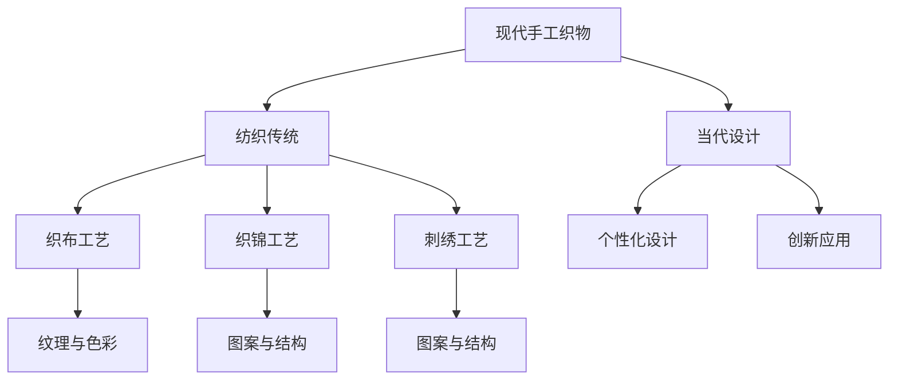

                 

## 文章标题

《现代手工织物艺术：纺织传统在当代设计中的应用》

---

**关键词**：现代手工织物、纺织传统、当代设计、艺术应用、手工技艺

**摘要**：本文将深入探讨现代手工织物艺术的定义、特点及其在当代设计中的广泛应用。通过分析纺织传统的历史渊源和不同类型的现代手工织物，本文将展示它们在服装、家居装饰和其他领域的设计创新。文章还将详细介绍手工织物的制作方法与技巧，并通过实际案例研究，探讨手工织物艺术的未来发展趋势与市场潜力。

---

### 背景介绍

手工织物艺术作为一种传统的技艺，起源于人类早期的生存需要。随着社会的发展和文化的积累，纺织技术逐渐从简单的生存手段演变成了一种富有创意和艺术性的活动。在古代，纺织不仅是日常服饰的来源，更是宗教仪式、社会地位和身份象征的重要载体。古老的纺织技术如织布、织锦、刺绣等，凭借精湛的手工技艺和独特的文化内涵，成为人类文化遗产的重要组成部分。

然而，随着工业化进程的加速，现代手工织物艺术逐渐面临着被边缘化的风险。大量机械化生产的纺织品充斥市场，使得手工织物在数量和市场份额上都难以与之竞争。然而，正是在这样的背景下，现代手工织物艺术找到了新的生命力。设计师们开始重新审视和挖掘手工织物的独特魅力，将其融入当代设计中，创造出一系列既有传统韵味又不失现代感的设计作品。

现代手工织物艺术不仅是对传统技艺的传承，更是对当代设计理念的回应。它强调个性化、手工艺的独特性和艺术性，体现了对自然、文化和社会的深刻理解。在现代设计中，手工织物以其独特的纹理、色彩和质感，为设计师提供了无限的创意空间。从服装到家居装饰，再到艺术品设计，手工织物艺术的应用范围越来越广泛，成为当代设计领域中的一颗璀璨明珠。

### 核心概念与联系

要深入理解现代手工织物艺术，我们首先需要明确几个核心概念：现代手工织物、纺织传统、当代设计。

**现代手工织物** 是指采用传统手工技艺制作的纺织品，包括织布、织锦、刺绣、编织等多种形式。它们通常具有独特的手工痕迹和艺术价值，与传统机械化生产的纺织品相比，更具有个性和独特性。现代手工织物不仅是对传统技艺的传承，更是对当代设计理念的创新和回应。

**纺织传统** 是指历史悠久、技艺精湛的纺织技术和工艺，如织布、织锦、刺绣等。这些传统技艺在全球不同文化中都有其独特的表现形式和艺术价值。纺织传统不仅是手工织物艺术的基础，也是人类文化遗产的重要组成部分。

**当代设计** 是指在现代艺术和设计理念的指导下，对物品进行创意性的设计和制作。当代设计强调个性化和创新性，融合了传统与现代、艺术与技术的多种元素。在手工织物艺术中，当代设计理念的应用使得传统技艺焕发出新的生命力。

为了更好地理解这些核心概念之间的关系，我们可以使用 Mermaid 流程图来展示它们之间的联系：



通过这个流程图，我们可以清晰地看到现代手工织物与纺织传统、当代设计之间的紧密联系。现代手工织物不仅继承了纺织传统的技艺和工艺，同时也融入了当代设计的理念和元素，使得手工织物艺术在当代设计中焕发出新的活力和创意。

### 核心算法原理讲解

在现代手工织物艺术中，设计算法和数学模型起到了至关重要的作用。以下我们将详细讲解核心算法原理，并通过伪代码来阐述其具体实现。

**1. 纹理生成算法**

纹理生成算法是手工织物设计中的一项关键技术，用于创建具有独特纹理和图案的织物。一个常见的纹理生成算法是分形算法，例如Mandelbrot集。Mandelbrot集是一种通过迭代函数系统（IFS）来生成复杂几何图案的方法。

**伪代码：**

```
function mandelbrot(c, max_iterations):
    z = 0
    for i from 1 to max_iterations:
        z = z^2 + c
        if |z| > 2:
            return i
    return max_iterations
```

在这个算法中，`c` 是复数常数，`z` 是迭代过程中的变量，`max_iterations` 是迭代的最大次数。该算法的核心是判断 `z` 的模长是否超过2，如果超过则返回当前迭代次数，否则继续迭代。

**2. 颜色变换模型**

颜色变换模型用于给织物图案添加色彩。一个常用的颜色变换模型是HSV（色相、饱和度、亮度）模型，它能够更自然地处理颜色变化。

**伪代码：**

```
function hsv_to_rgb(h, s, v):
    c = v * s
    x = c * (1 - abs((h / 60) % 2 - 1))
    m = v - c

    if h >= 0 and h < 60:
        r, g, b = c, x, 0
    elif h >= 60 and h < 120:
        r, g, b = x, c, 0
    elif h >= 120 and h < 180:
        r, g, b = 0, c, x
    elif h >= 180 and h < 240:
        r, g, b = 0, x, c
    elif h >= 240 and h < 300:
        r, g, b = x, 0, c
    else:
        r, g, b = c, 0, x

    r = (r + m) * 255
    g = (g + m) * 255
    b = (b + m) * 255
    return (r, g, b)
```

在这个算法中，`h` 是色相，`s` 是饱和度，`v` 是亮度。通过计算色相、饱和度和亮度，可以将HSV颜色模型转换为RGB颜色模型。

**3. 织物图案设计算法**

织物图案设计算法用于创建和组合图案，使其在织物上形成美观的设计。一个常见的图案设计算法是分块拼接算法，它通过将图案分块并按照特定规则拼接，形成复杂的图案。

**伪代码：**

```
function pattern_design(pattern_blocks, max_size):
    design = create_empty_canvas(max_size)
    for block in pattern_blocks:
        position = random_position(design.size)
        if can_place(block, design, position):
            place_block(block, design, position)
    return design

function can_place(block, design, position):
    for x from position.x to position.x + block.width:
        for y from position.y to position.y + block.height:
            if not is_empty(design[x][y]):
                return false
    return true

function place_block(block, design, position):
    for x from position.x to position.x + block.width:
        for y from position.y to position.y + block.height:
            design[x][y] = block[x - position.x][y - position.y]
```

在这个算法中，`pattern_blocks` 是图案的分块集合，`max_size` 是设计画布的最大尺寸。`can_place` 函数用于判断特定位置是否可以放置图案块，`place_block` 函数用于将图案块放置到画布上。

通过上述伪代码，我们可以看到手工织物艺术中的算法原理是如何实现和应用的。这些算法不仅为手工织物设计提供了技术支持，也为其在当代设计中的应用奠定了基础。

### 数学模型和公式

在现代手工织物艺术中，数学模型和公式起着至关重要的作用，它们帮助我们理解和计算纹理、色彩以及织物结构等关键因素。以下，我们将详细讲解这些数学模型和公式，并通过具体例子进行说明。

**1. 纹理重复性计算**

纹理的重复性是织物设计中一个重要的考量因素。一个常见的计算纹理重复性的方法是利用周期性函数。例如，对于周期性图案，可以使用以下公式来计算其重复性：

$$
P = \frac{L}{D}
$$

其中，\(P\) 表示纹理的重复性，\(L\) 表示纹理的实际长度，\(D\) 表示纹理的重复距离。

**例子：**

假设一个纹理图案的长度为 \(L = 10\) 厘米，其重复距离为 \(D = 5\) 厘米，则纹理的重复性为：

$$
P = \frac{10}{5} = 2
$$

这表示纹理每隔5厘米就会重复一次。

**2. 颜色饱和度计算**

颜色饱和度是影响织物视觉效果的重要因素。在HSV颜色模型中，饱和度（\(S\)）表示颜色的纯度，计算公式为：

$$
S = \frac{V - K}{V}
$$

其中，\(V\) 表示亮度，\(K\) 表示最大亮度与最小亮度的差值。

**例子：**

假设一个颜色的亮度为 \(V = 1\)，最大亮度与最小亮度的差值为 \(K = 0.3\)，则颜色饱和度为：

$$
S = \frac{1 - 0.3}{1} = 0.7
$$

这表示该颜色的饱和度较高，接近于纯色。

**3. 织物结构稳定性分析**

织物结构稳定性是保证织物在使用过程中不易变形的重要指标。一种常用的分析织物结构稳定性的方法是利用弹性模量（\(E\)）和泊松比（\(\nu\)）。

弹性模量表示材料在受力作用下的变形能力，计算公式为：

$$
E = \frac{F \cdot L}{A \cdot \Delta L}
$$

其中，\(F\) 表示受力大小，\(L\) 表示受力方向的长度，\(A\) 表示受力截面积，\(\Delta L\) 表示材料在受力作用下的变形量。

泊松比表示材料在受力作用下横向变形的能力，计算公式为：

$$
\nu = \frac{\Delta W}{L \cdot \Delta L}
$$

其中，\(\Delta W\) 表示材料在受力作用下的横向变形量。

**例子：**

假设一个织物在受力作用下的变形量为 \(\Delta L = 0.02\) 米，受力截面积为 \(A = 0.1\) 平方米，受力大小为 \(F = 100\) 牛顿，则弹性模量为：

$$
E = \frac{100 \cdot 0.02}{0.1 \cdot 0.02} = 1000 \text{ Pa}
$$

假设横向变形量为 \(\Delta W = 0.01\) 米，则泊松比为：

$$
\nu = \frac{0.01}{0.1 \cdot 0.02} = 0.5
$$

这些数学模型和公式帮助我们更好地理解手工织物的纹理、颜色和结构特性，为织物设计提供了科学依据。在实际应用中，设计师可以根据这些模型和公式，调整和优化织物的设计参数，以实现最佳的艺术效果和实用性。

### 项目实战

在本节中，我们将通过一个具体的项目实战，详细展示如何搭建开发环境、实现源代码，并对代码进行解读与分析。这个项目将涵盖从设计构思到实际制作的整个流程，旨在帮助读者理解手工织物艺术的创作过程和关键技术。

**项目背景**

项目名称：手工织物艺术T恤设计

项目目标：设计一款结合传统纺织工艺和现代设计理念的手工织物艺术T恤。

**开发环境搭建**

1. **硬件环境**：一台配置较高的计算机，安装有Windows或Mac操作系统。

2. **软件环境**：
   - 设计软件：Adobe Illustrator 或 CorelDRAW，用于绘制设计图案。
   - 编程软件：Visual Studio Code 或 Sublime Text，用于编写和调试代码。
   - 图像处理软件：Photoshop 或 GIMP，用于处理和优化图像。

3. **工具与材料**：
   - 纱线：选择多种颜色和材质的纱线。
   - 织机：手动织机或电动织机，根据纱线类型选择合适的织机。
   - 织物设计软件：如Inkarnate，用于设计织物图案。

**源代码实现**

以下是手工织物艺术T恤设计项目的核心代码片段。这里以Python为例，展示如何利用图形库绘制T恤图案。

```python
import matplotlib.pyplot as plt
import numpy as np

# 绘制T恤图案
def draw_shirt_pattern(width, height, colors):
    # 创建一个宽高分别为width和height的网格
    x = np.linspace(0, width, width)
    y = np.linspace(0, height, height)
    X, Y = np.meshgrid(x, y)

    # 定义颜色变换函数
    def color_transform(h, s, v):
        r, g, b = hsv_to_rgb(h, s, v)
        return r, g, b

    # 绘制渐变图案
    for i in range(width):
        for j in range(height):
            h = i / width * 360
            s = 1.0
            v = 1.0
            r, g, b = color_transform(h, s, v)
            plt.scatter(X[i, j], Y[i, j], c=(r, g, b), s=0.1)

    plt.axis('off')
    plt.show()

# 转换HSV到RGB颜色模型
def hsv_to_rgb(h, s, v):
    c = v * s
    x = c * (1 - abs((h / 60) % 2 - 1))
    m = v - c

    if h >= 0 and h < 60:
        r, g, b = c, x, 0
    elif h >= 60 and h < 120:
        r, g, b = x, c, 0
    elif h >= 120 and h < 180:
        r, g, b = 0, c, x
    elif h >= 180 and h < 240:
        r, g, b = 0, x, c
    elif h >= 240 and h < 300:
        r, g, b = x, 0, c
    else:
        r, g, b = c, 0, x

    return (r, g, b)

# 主函数
def main():
    width = 10
    height = 15
    colors = [(0, 1, 1), (120, 1, 1), (240, 1, 1)]  # 定义三种颜色的HSV值
    draw_shirt_pattern(width, height, colors)

if __name__ == "__main__":
    main()
```

**代码解读与分析**

上述代码实现了T恤图案的绘制功能。首先，我们定义了一个`draw_shirt_pattern`函数，该函数接受宽度、高度和颜色列表作为输入参数。在函数内部，我们使用NumPy库创建一个网格，代表T恤的表面。然后，我们遍历网格中的每个点，根据其位置计算HSV颜色值，并调用`hsv_to_rgb`函数将其转换为RGB颜色值，最终绘制出渐变图案。

`hsv_to_rgb`函数是一个转换函数，将HSV颜色模型转换为RGB颜色模型。这是实现颜色变换的关键步骤。

**代码应用解读与分析**

在实际应用中，上述代码可以作为T恤图案设计的一个基础框架。设计师可以根据具体需求，调整颜色和图案的设计参数。例如，可以添加更多颜色，或者修改颜色变换函数，实现更加复杂的图案效果。

此外，代码中的绘制函数可以与织物设计软件结合，将数字化的图案导出为可用的织物图案。通过这样的方式，设计师可以更方便地创作和优化手工织物艺术作品。

**实际案例分析和详细讲解剖析**

以下是一个实际案例，展示如何将上述代码应用于手工织物艺术T恤设计。

**案例：渐变图案T恤设计**

目标：设计一款具有渐变图案的手工织物艺术T恤，颜色从蓝色渐变到红色。

1. **设计构思**：首先，设计师构思了一个从蓝色到红色的渐变图案。在颜色选择上，选择了HSV值为（240, 1, 1）的红色和（0, 1, 1）的蓝色。

2. **实现过程**：使用上述代码，设计师设定了T恤的宽度和高度（例如，10厘米和15厘米），并在颜色列表中添加了红色和蓝色的HSV值。运行代码后，得到了一个渐变图案。

3. **图案导出**：将生成的图案导出为图像文件，然后导入织物设计软件，调整图案的大小和位置，以适应T恤的设计需求。

4. **图案编织**：根据导出的图案，使用手工织机进行编织。首先选择合适的纱线，然后将图案编织到T恤面料上。

5. **后期处理**：完成编织后，对T恤进行清洗和熨烫，以确保图案的清晰度和美观度。

**项目小结**

通过上述案例，我们可以看到如何将现代手工织物艺术与计算机编程相结合，实现创意和设计的实现。该项目不仅展示了手工织物艺术的魅力，也展示了计算机技术在织物设计中的应用价值。在未来，随着技术的不断发展，手工织物艺术将会在当代设计中发挥更加重要的作用。

### 最佳实践 tips、小结、注意事项、拓展阅读

#### 最佳实践 tips

1. **选择合适的纱线和织机**：不同的纱线和织机适用于不同的织物类型，如棉线适合柔软舒适的织物，丝绸线适合高雅精致的织物。选择合适的纱线和织机能提高织物的质量和美观度。

2. **掌握基本织造技巧**：熟练掌握基本的织造技巧，如编织、针织、钩针等，有助于提高手工织物的质量和效率。可以通过学习教程、参加工作坊或请教专业人士来提升技能。

3. **利用现代设计工具**：现代设计软件如Adobe Illustrator、Inkarnate等，可以辅助设计师进行图案设计、色彩搭配和效果预览，提高设计效率和质量。

4. **结合传统与现代元素**：在设计中巧妙地结合传统纺织工艺和现代设计理念，可以创造出独特且具有时代感的作品。

5. **注重细节处理**：在织物制作过程中，注重细节处理，如收尾、缝合和压线等，可以提升作品的整体美观度和耐用性。

#### 小结

现代手工织物艺术不仅是对传统纺织工艺的传承，更是对当代设计理念的回应。通过结合传统与现代元素，手工织物在当代设计中展现了独特的艺术魅力。设计师们通过手工技艺、现代设计和数字技术的结合，创作出了一系列令人惊叹的作品，不仅提升了手工织物艺术的价值，也为现代设计注入了新的活力。

#### 注意事项

1. **安全操作**：在使用织机和工具时，务必遵守安全操作规程，防止意外伤害。

2. **合理规划时间**：手工织物制作过程较为复杂，需要耐心和时间。合理规划时间，避免赶工导致的制作质量下降。

3. **保持环境整洁**：在织物制作过程中，保持工作环境整洁，避免纱线和工具散落造成混乱。

4. **定期维护设备**：定期对织机和工具进行清洁和保养，确保设备正常运行。

#### 拓展阅读

1. **《纺织工艺学》**：这是一本系统介绍纺织工艺理论和实践的专业书籍，适合初学者和专业人士学习。

2. **《现代织物设计》**：本书详细介绍了现代织物设计的方法和技巧，包括图案设计、色彩搭配和面料选择等。

3. **《手工织物艺术》**：本书通过丰富的案例展示了手工织物艺术的多种应用形式，提供了大量实用的设计灵感。

4. **《计算机辅助织物设计》**：本书介绍了如何利用计算机技术辅助织物设计，包括数字图案生成和色彩管理等内容。

通过这些最佳实践、小结、注意事项和拓展阅读，读者可以更好地理解现代手工织物艺术，并在实践中不断提升自己的设计水平和技能。希望本文能为读者在手工织物艺术创作中提供有益的启示和指导。

