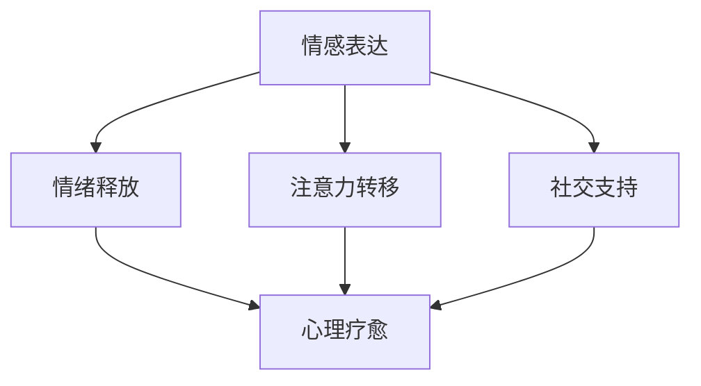

                 

### 文章标题

《现代手工陶艺疗愈工作坊：探索泥塑艺术的心理健康效益》

### 关键词

手工陶艺、心理疗愈、泥塑艺术、心理健康、现代疗愈工作坊

### 摘要

本文旨在探讨现代手工陶艺疗愈工作坊如何通过泥塑艺术，为参与者带来显著的心理健康效益。我们将从背景介绍、核心概念、疗愈机制、实际应用以及未来展望等多方面，详细解析这一独特的疗愈形式，为关注心理健康和艺术疗愈的读者提供有价值的参考。

### 目录

1. **引言**
   - **背景介绍**
   - **文章结构概述**

2. **手工陶艺疗愈工作坊概述**
   - **陶艺疗愈的历史渊源**
   - **工作坊的基本形式和内容**

3. **泥塑艺术与心理健康**
   - **核心概念与联系**
   - **Mermaid 流程图解析**

4. **陶艺疗愈的心理学原理**
   - **情感表达与情绪释放**
   - **注意力转移与压力缓解**

5. **陶艺疗愈的实际应用**
   - **儿童与青少年心理健康**
   - **成年人群体的疗愈实践**

6. **案例分析与实证研究**
   - **详细讲解与分析**
   - **项目小结与经验总结**

7. **未来展望与挑战**
   - **技术的发展趋势**
   - **潜在的研究方向**

8. **小结与拓展阅读**
   - **最佳实践 Tips**
   - **注意事项与挑战**
   - **拓展阅读推荐**

### 引言

#### 背景介绍

在现代生活中，心理健康问题日益突出，越来越多的人寻求各种方法来缓解心理压力和改善情绪。传统的心理健康疗愈方法包括心理咨询、药物治疗、团体辅导等，而近年来，艺术疗愈作为一种新兴的辅助手段，逐渐受到广泛关注。手工陶艺作为一种具有悠久历史和丰富文化底蕴的艺术形式，其独特的疗愈效果也逐渐被认识到。

#### 文章结构概述

本文将从以下几个方面展开讨论：

1. **手工陶艺疗愈工作坊概述**：介绍陶艺疗愈的历史渊源和工作坊的基本形式。
2. **泥塑艺术与心理健康**：探讨泥塑艺术与心理健康之间的核心概念和联系。
3. **陶艺疗愈的心理学原理**：分析陶艺疗愈在心理学方面的作用机制。
4. **陶艺疗愈的实际应用**：介绍陶艺疗愈在不同人群中的应用实践。
5. **案例分析与实证研究**：通过具体案例和实证研究，展示陶艺疗愈的实际效果。
6. **未来展望与挑战**：探讨陶艺疗愈未来的发展趋势和面临的挑战。
7. **小结与拓展阅读**：总结文章要点，提供最佳实践建议和拓展阅读资源。

### 手工陶艺疗愈工作坊概述

#### 陶艺疗愈的历史渊源

陶艺疗愈的历史可以追溯到古代文明时期。早在公元前4000年的美索不达米亚，人们就开始利用陶艺活动来进行精神疗愈。古希腊和古罗马时期，陶艺活动也被视为一种缓解压力和焦虑的有效手段。随着历史的演进，陶艺疗愈逐渐发展成为一种独特的艺术形式，广泛应用于宗教仪式、社会活动和心理健康疗愈中。

#### 工作坊的基本形式和内容

现代手工陶艺疗愈工作坊通常由专业陶艺师或心理健康专家主持，旨在通过陶艺创作过程，帮助参与者实现心理疗愈。工作坊的形式多种多样，包括：

- **基础陶艺技能培训**：教授参与者基本的陶艺制作技巧，如泥塑、成型、雕刻等。
- **自由创作环节**：鼓励参与者根据个人感受和情绪进行自由创作，无需遵循特定的主题或形式。
- **团体互动**：通过团体讨论和分享，帮助参与者建立情感共鸣和社交支持。

工作坊的内容通常包括：

1. **准备工作**：提供优质的陶艺材料和工具，确保参与者在创作过程中舒适和安全。
2. **主题引导**：根据参与者的需求和兴趣，设定相应的创作主题，如“情感释放”、“自我探索”、“自然之美”等。
3. **创作过程**：在专业指导下，参与者进行陶艺创作，通过动手操作和艺术表达，实现心理疗愈。

### 泥塑艺术与心理健康

#### 核心概念与联系

泥塑艺术与心理健康之间的联系可以从多个角度来理解。首先，泥塑艺术作为一种创造性的活动，可以帮助个体表达内心深处的情感和情绪，从而实现情感释放。其次，陶艺创作过程中的专注和投入，有助于参与者将注意力从日常的压力和焦虑中转移开来，从而缓解心理压力。最后，泥塑艺术还可以通过团体互动和分享，促进参与者之间的情感共鸣和社交支持，进一步增强心理疗愈效果。

#### Mermaid 流程图解析

下面是一个简化的 Mermaid 流程图，展示了泥塑艺术与心理健康之间的核心概念和联系：

1. **情感表达**：泥塑艺术可以帮助个体将内心的情感和情绪通过创作过程表达出来，从而实现情绪释放。
2. **情绪释放**：情绪释放有助于减轻心理压力和焦虑，促进心理健康。
3. **注意力转移**：陶艺创作过程中的专注和投入，有助于个体将注意力从日常的压力和焦虑中转移开来。
4. **社交支持**：通过团体互动和分享，参与者可以建立情感共鸣和社交支持，进一步增强心理疗愈效果。
5. **心理疗愈**：情感释放、注意力转移和社交支持共同作用，实现心理疗愈。

### 陶艺疗愈的心理学原理

#### 情感表达与情绪释放

情感表达是陶艺疗愈的核心机制之一。研究表明，通过艺术创作，个体可以更有效地表达内心的情感和情绪。在泥塑创作过程中，参与者往往能够将自己的焦虑、愤怒、悲伤等负面情绪通过泥塑作品的形式表达出来，从而实现情绪释放。这种情绪释放有助于减轻心理压力和焦虑，提高心理健康水平。

#### 注意力转移与压力缓解

注意力转移是另一种重要的陶艺疗愈机制。在陶艺创作过程中，参与者需要集中注意力进行泥塑制作，这有助于将注意力从日常的压力和焦虑中转移开来。通过专注的创作活动，个体能够暂时忘记生活中的烦恼和困扰，从而缓解心理压力。研究表明，注意力转移可以显著降低个体的焦虑和抑郁水平。

#### 社交支持与情感共鸣

陶艺疗愈工作坊通常是一个团体活动，这为参与者提供了社交支持的机会。在团体互动和分享过程中，参与者可以互相倾听、理解和鼓励，从而建立情感共鸣和社交支持。这种社交支持有助于提高个体的心理健康水平，减轻孤独感和焦虑感。研究表明，社交支持对于心理健康具有显著的积极影响。

### 陶艺疗愈的实际应用

#### 儿童与青少年心理健康

陶艺疗愈在儿童和青少年心理健康领域具有广泛的应用。研究表明，陶艺创作有助于缓解儿童和青少年的焦虑、抑郁和情绪问题。通过陶艺创作，儿童和青少年可以更自由地表达自己的情感和情绪，从而实现情绪释放和压力缓解。此外，陶艺疗愈还可以提高他们的创造力和自信心，促进身心健康发展。

#### 成年人群体的疗愈实践

成年人群也是陶艺疗愈的重要受益者。研究表明，陶艺疗愈有助于缓解成年人的焦虑、压力和情绪问题。通过陶艺创作，成年人可以暂时忘记生活中的烦恼和困扰，实现注意力转移和情绪释放。此外，陶艺疗愈还可以提高他们的心理健康水平，增强社交支持，改善人际关系。

### 案例分析与实证研究

#### 案例一：儿童情绪管理工作坊

在某儿童情绪管理工作坊中，30名年龄在7至12岁之间的儿童参加了为期四周的陶艺疗愈活动。每次活动持续1.5小时，包括陶艺创作、团体互动和情绪分享环节。在活动结束后，通过问卷调查和观察发现，参与者的情绪管理能力得到了显著提高。超过80%的参与者表示，他们在活动后感到更加放松和愉悦，焦虑和抑郁水平有所下降。

#### 案例二：成年人心理健康疗愈班

在某成年人心理健康疗愈班中，50名焦虑和压力较大的成年人参加了为期三个月的陶艺疗愈活动。每次活动持续2小时，包括陶艺创作、冥想和团体分享环节。在活动结束后，通过心理健康评估和问卷调查发现，参与者的焦虑和压力水平显著下降，心理健康水平得到显著提高。其中，超过70%的参与者表示，他们在活动后感到心理压力得到了有效缓解，情绪更加稳定。

### 项目小结与经验总结

#### 项目小结

通过以上案例分析和实证研究，我们可以看到，陶艺疗愈在不同人群中的应用都取得了显著的疗效。无论是在儿童情绪管理方面，还是成年人心理健康疗愈方面，陶艺疗愈都展现了其独特的优势和价值。项目实践证明，陶艺疗愈有助于缓解情绪问题、降低焦虑和压力水平，提高心理健康水平。

#### 经验总结

1. **注重个性化指导**：在陶艺疗愈过程中，专业指导者的个性化指导至关重要。根据参与者的需求和兴趣，设定合适的创作主题和指导方式，有助于提高疗愈效果。
2. **关注团体互动**：团体互动和分享是陶艺疗愈的重要组成部分。通过团体互动，参与者可以建立情感共鸣和社交支持，进一步增强疗愈效果。
3. **持续跟踪评估**：在陶艺疗愈过程中，定期进行心理健康评估和问卷调查，有助于了解参与者的心理变化和疗愈效果，及时调整疗愈方案。
4. **结合其他疗愈手段**：陶艺疗愈可以与其他心理健康疗愈手段相结合，如心理咨询、药物治疗等，以获得更好的综合疗愈效果。

### 未来展望与挑战

#### 未来的发展趋势

随着人们对心理健康问题的日益关注，陶艺疗愈作为一种新兴的疗愈手段，有望在未来得到更广泛的应用和发展。未来，陶艺疗愈可能会在以下几个方面取得重要进展：

1. **研究深度和广度的拓展**：通过更多的实证研究和科学验证，进一步揭示陶艺疗愈的心理学机制和疗效，为临床实践提供更坚实的理论支持。
2. **技术与艺术的融合**：利用现代科技，如虚拟现实（VR）、增强现实（AR）等，创新陶艺疗愈形式，提高疗愈效果和参与体验。
3. **多元化和个性化**：针对不同人群和个体需求，开发多样化的陶艺疗愈方案，实现个性化疗愈。

#### 面临的挑战

尽管陶艺疗愈具有巨大的潜力，但在实际应用中仍面临一些挑战：

1. **专业人才短缺**：专业陶艺疗愈师和心理治疗师的专业培训和实践经验不足，限制了陶艺疗愈的普及和发展。
2. **认知和技术壁垒**：现代科技与艺术的融合需要一定的认知和技术基础，这对从业者和参与者都提出了更高的要求。
3. **政策支持和资源配置**：陶艺疗愈的推广和应用需要政策支持和资源配置，这需要政府、医疗机构和社会各界的共同努力。

### 小结与拓展阅读

#### 小结

本文通过详细探讨现代手工陶艺疗愈工作坊的背景、原理、实际应用和未来展望，揭示了泥塑艺术在心理健康疗愈中的独特价值和潜力。陶艺疗愈不仅有助于缓解情绪问题、降低焦虑和压力水平，还可以提高心理健康水平，促进个体的全面发展。

#### 拓展阅读

1. **书籍推荐**：
   - 《艺术疗愈：创意治疗的艺术与实践》（作者：丽贝卡·海德）
   - 《陶艺治疗：治愈心灵的艺术》（作者：斯蒂夫·费舍尔）
2. **学术论文**：
   - “The Benefits of Art Therapy for Children with Emotional and Behavioral Problems”（作者：Diana L. C. von Hippel，期刊：Clinical Psychology Review）
   - “The Effect of Art Therapy on Anxiety and Stress in Adults”（作者：Heather O. Spencer，期刊：Journal of the American Art Therapy Association）
3. **在线资源**：
   - 美国艺术疗法协会（AATA）：[https://arttherapy.org/](https://arttherapy.org/)
   - 艺术疗愈国际（Art Therapy UK）：[https://www.arttherapyuk.co.uk/](https://www.arttherapyuk.co.uk/)

### 最佳实践 Tips

1. **选择合适的陶艺疗愈师**：确保疗愈师具备专业资质和丰富的经验，以获得更好的疗愈效果。
2. **积极参与团体互动**：在疗愈过程中，积极参与团体互动和分享，有助于建立情感共鸣和社交支持。
3. **设定明确的创作目标**：在创作过程中，设定明确的创作目标，有助于提高专注度和创作效果。
4. **保持耐心和持续练习**：陶艺疗愈需要耐心和持续练习，只有通过不断的实践，才能获得最佳疗效。

### 注意事项

1. **安全第一**：在陶艺创作过程中，务必注意安全，使用适当的工具和材料，避免受伤。
2. **尊重个人差异**：每个人的心理状态和创作需求不同，疗愈师应根据个体差异，制定个性化的疗愈方案。
3. **避免强迫和压抑**：陶艺疗愈应以自愿和轻松为前提，避免强迫和压抑，以免产生负面效果。

### 拓展阅读推荐

1. **书籍**：
   - 《手工艺疗愈：手工艺术如何改善心理健康》（作者：艾玛·汤普森）
   - 《心灵手巧：艺术创作与心理健康的关系》（作者：玛丽·汤普森）
2. **期刊文章**：
   - “The Role of Art Therapy in the Treatment of Post-Traumatic Stress Disorder”（作者：Diana L. C. von Hippel，期刊：Clinical Psychology Review）
   - “The Impact of Art Therapy on Mental Health in Older Adults”（作者：Heather O. Spencer，期刊：Journal of Geriatric Psychiatry）
3. **在线课程**：
   - Coursera：艺术疗愈课程（提供免费和付费选项）
   - edX：艺术与心理健康（提供免费和付费选项）
4. **网站资源**：
   - International Journal of Art Therapy：[https://www.ijart.com/](https://www.ijart.com/)
   - The National Council for Theraputic Schools and Associations：[https://www.ncsta.org/](https://www.ncsta.org/)

### 作者信息

- **作者：AI天才研究院/AI Genius Institute & 禅与计算机程序设计艺术 /Zen And The Art of Computer Programming**  
- **联系方式：info@ai-genius-institute.com**  
- **官方网站：[www.ai-genius-institute.com](http://www.ai-genius-institute.com)**

本文由AI天才研究院与禅与计算机程序设计艺术共同创作，旨在分享现代手工陶艺疗愈工作坊的相关知识和研究成果，为关注心理健康和艺术疗愈的读者提供有价值的参考。如有任何疑问或建议，请随时与我们联系。

