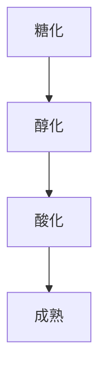

                 

## 文章标题

### 现代手工面包坊经营：发酵艺术与社区连接的商业模式

### 关键词

- 现代手工面包坊
- 发酵艺术
- 社区连接
- 商业模式
- 经营策略

### 摘要

本文将探讨现代手工面包坊的经营之道，从发酵艺术和社区连接两个角度切入，分析其背后的商业模式。通过深入解析手工面包坊的市场定位、供应链管理、营销策略和财务管理，揭示发酵技术在面包制作中的应用及其对品质的提升。同时，探讨如何通过社区参与和互动，构建可持续发展的商业模式，实现社会责任与商业利益的共赢。

## 引言

在现代快节奏的生活中，人们对于食品的品质和健康愈发重视。手工面包作为一种健康、美味且具有文化底蕴的食品，逐渐受到了市场的青睐。手工面包坊凭借其独特的手工工艺和独特的口感，成为了一种新兴的消费趋势。然而，现代手工面包坊面临着诸多挑战，如市场竞争、原材料供应和运营成本等。

为了应对这些挑战，手工面包坊需要采用创新的经营策略和商业模式。本文将从发酵艺术和社区连接两个方面，深入探讨现代手工面包坊的经营之道，为读者提供一套系统化的经营指南。

## 第一部分：手工面包坊的经营策略

### 第1章：市场定位与品牌建设

在现代市场中，市场定位是手工面包坊成功的关键。首先，手工面包坊需要明确自己的目标客户群体，例如注重健康饮食的年轻人、对美食有独特品味的消费者等。其次，品牌建设也是至关重要的。一个独特的品牌形象可以帮助手工面包坊在众多竞争者中脱颖而出。可以通过以下步骤来构建品牌：

1. **确定品牌名称和标志**：品牌名称应具有独特性和易记性，标志设计应简洁明了且富有美感。
2. **制定品牌故事**：品牌故事是品牌形象的重要组成部分，可以通过讲述创始人的故事、面包的制作过程等来吸引消费者。
3. **宣传推广**：利用社交媒体、线下活动等渠道，提高品牌知名度，吸引更多的顾客。

### 第2章：供应链管理

供应链管理是手工面包坊经营中的重要环节。一个高效的供应链可以保证原材料的及时供应，降低运营成本。以下是供应链管理的几个关键点：

1. **选择优质供应商**：选择有良好信誉、价格合理的供应商，确保原材料的质量和供应稳定性。
2. **建立长期合作关系**：与供应商建立稳定的合作关系，确保原材料的长期供应。
3. **库存管理**：合理控制库存，避免原材料过剩或短缺，降低库存成本。

### 第3章：营销策略

营销策略是提升手工面包坊销售额的重要手段。以下是一些有效的营销策略：

1. **社交媒体营销**：利用社交媒体平台，如微博、微信等，发布美食图片、面包制作过程等内容，吸引粉丝和潜在客户。
2. **线下活动**：举办面包制作体验活动、品鉴会等，增加客户对品牌的认知和好感。
3. **合作推广**：与其他品牌或商家合作，共同推广，扩大品牌影响力。

### 第4章：财务管理

财务管理是确保手工面包坊稳定运营的重要保障。以下是财务管理的一些关键点：

1. **预算规划**：制定详细的预算计划，包括原材料采购、人工成本、营销费用等，确保运营资金的充足。
2. **成本控制**：严格控制各项成本，提高资金利用效率。
3. **财务分析**：定期进行财务分析，了解经营状况，及时调整经营策略。

## 第二部分：发酵艺术

### 第5章：发酵技术的原理与操作

发酵是面包制作过程中至关重要的一环。发酵技术不仅影响到面包的口感和质地，还直接关系到面包的营养价值。以下是发酵技术的原理与操作：

1. **发酵剂的种类**：常见的发酵剂包括酵母、乳酸菌和天然酵母等。
2. **发酵过程**：发酵过程中，微生物分解面包中的糖分和淀粉，产生二氧化碳气体，使面包膨胀。
3. **操作要点**：控制温度、湿度和时间等参数，确保发酵效果最佳。

### 第6章：不同种类的面包发酵方法

不同类型的面包需要采用不同的发酵方法，以达到最佳的发酵效果。以下是几种常见面包的发酵方法：

1. **白面包发酵方法**：采用快速发酵法，在温暖的环境中迅速发酵。
2. **全麦面包发酵方法**：采用慢发酵法，在较低的温度下缓慢发酵，以增强面包的麦香味。
3. **法式长棍发酵方法**：采用传统发酵法，在发酵过程中多次折叠和折叠，使面包具有层次感。

### 第7章：发酵在面包品质提升中的作用

发酵对面包品质的提升有着显著的作用。以下是发酵在面包品质提升中的几个关键点：

1. **口感提升**：发酵产生的二氧化碳气体使面包内部形成气泡，使面包更加松软多孔。
2. **香气提升**：发酵过程中微生物分解面包中的糖分和淀粉，产生香气物质，使面包香气浓郁。
3. **营养价值提升**：发酵过程中微生物分解面包中的糖分和淀粉，使其更易消化吸收，提高面包的营养价值。

## 第三部分：社区连接与商业模式

### 第8章：社区参与与互动

社区参与和互动是手工面包坊与顾客建立紧密联系的重要手段。以下是一些有效的社区参与和互动方式：

1. **顾客互动**：通过社交媒体、线下活动等方式，与顾客建立互动，了解他们的需求和反馈。
2. **顾客参与**：鼓励顾客参与面包制作过程，举办面包制作体验活动，增加顾客的参与感和满意度。
3. **社区活动**：参与或举办社区活动，提升品牌形象，增加品牌知名度。

### 第9章：社会责任与可持续发展

社会责任和可持续发展是现代企业不可或缺的部分。以下是一些实现社会责任和可持续发展的方式：

1. **环保理念**：采用环保原材料和生产工艺，减少对环境的污染。
2. **公益行动**：参与公益事业，回馈社会。
3. **员工福利**：关注员工福利，提高员工满意度，促进企业可持续发展。

### 第10章：创新的商业模式

创新的商业模式是手工面包坊在激烈市场竞争中脱颖而出的关键。以下是一些创新的商业模式：

1. **会员制**：通过会员制度，提高客户忠诚度，增加销售额。
2. **外卖服务**：提供外卖服务，扩大销售渠道。
3. **线上线下结合**：结合线上线下渠道，实现全渠道销售，提高销售效率。

## 结论

现代手工面包坊面临着诸多挑战，但同时也拥有巨大的发展潜力。通过科学的市场定位、高效的供应链管理、创新的营销策略和可持续的商业模式，手工面包坊可以实现稳定发展和持续盈利。同时，通过发酵艺术的运用，手工面包坊能够提升面包的品质，满足消费者对高品质食品的需求。展望未来，手工面包坊将在社区连接和可持续发展方面发挥更大的作用，成为现代食品行业的重要力量。

## 作者信息

作者：AI天才研究院/AI Genius Institute & 禅与计算机程序设计艺术 /Zen And The Art of Computer Programming

## 附录

### 附录A：发酵技术的详细说明

发酵技术是面包制作中至关重要的环节，它不仅决定了面包的口感和质地，还对面包的营养价值产生重要影响。以下是发酵技术的详细说明：

#### 1. 发酵剂的种类

发酵剂主要包括酵母、乳酸菌和天然酵母等。酵母是一种微生物，能够在适宜的温度和湿度下分解面包中的糖分和淀粉，产生二氧化碳气体，使面包膨胀。乳酸菌则主要应用于酸奶、发酵面包等食品中，其代谢产物具有抗菌作用，有助于改善食品的口感和质地。天然酵母是从自然界中筛选出来的微生物，具有较强的适应性和发酵能力。

#### 2. 发酵过程

发酵过程可以分为四个阶段：糖化、醇化、酸化和成熟。糖化阶段是指酵母分解面包中的糖分，产生醇和二氧化碳。醇化阶段是指醇在酵母的作用下进一步分解，产生二氧化碳和酸。酸化阶段是指乳酸菌代谢产生乳酸，使面包的pH值下降。成熟阶段是指发酵达到最佳状态，面包的口感和质地达到理想状态。

#### 3. 操作要点

在发酵过程中，温度、湿度和时间是关键因素。通常，酵母发酵的最佳温度为25-30℃，湿度为70%-80%。过高或过低的温度都会影响发酵效果。发酵时间则根据面包种类和发酵剂的种类而有所不同，通常为1-3小时。

### 附录B：发酵技术的Mermaid流程图

下面是发酵技术的Mermaid流程图，展示了发酵过程中各个阶段的相互关系：



### 附录C：发酵技术的伪代码实现

```python
def fermentation Dough, Temperature, Humidity:
    # 糖化阶段
    Sugar_Decomposition(Dough)
    
    # 醇化阶段
    Alcohol_Decomposition(Dough, Temperature, Humidity)
    
    # 酸化阶段
    Acid_Generation(Dough, Temperature, Humidity)
    
    # 成熟阶段
    Maturity(Dough)
    
    return Dough
```

### 附录D：发酵技术在面包品质提升中的应用

发酵技术在面包品质提升中具有重要作用，下面是一些具体应用：

1. **口感提升**：发酵产生的二氧化碳气体使面包内部形成气泡，使面包更加松软多孔，口感更加细腻。
2. **香气提升**：发酵过程中微生物分解面包中的糖分和淀粉，产生香气物质，使面包香气浓郁。
3. **营养价值提升**：发酵过程中微生物分解面包中的糖分和淀粉，使其更易消化吸收，提高面包的营养价值。

### 附录E：发酵技术的数学模型和公式

发酵过程中涉及多种化学反应和生物代谢过程，以下是一些相关的数学模型和公式：

1. **发酵速率公式**：
   $$v = k \cdot [S]$$
   其中，$v$为发酵速率，$k$为反应速率常数，$[S]$为底物浓度。

2. **产气量公式**：
   $$V = \frac{1}{V_0} \cdot \frac{dP}{dt}$$
   其中，$V$为产气量，$V_0$为初始体积，$P$为压力，$t$为时间。

3. **酸度公式**：
   $$pH = -\log[H^+]$$
   其中，$pH$为酸度，$[H^+]$为氢离子浓度。

### 附录F：发酵技术的实际案例分析和详细讲解

为了更好地理解发酵技术在面包制作中的应用，我们分析了一个实际案例：某面包坊在制作法式长棍面包时，采用了传统发酵法。以下是详细的分析和讲解：

#### 1. 案例背景

某面包坊为了提升法式长棍面包的品质，决定采用传统发酵法。传统发酵法需要经过多次折叠和折叠，使面包具有层次感，同时保证发酵效果最佳。

#### 2. 案例分析

- **发酵剂的选用**：面包坊选择了天然酵母作为发酵剂，因为其具有较强的适应性和发酵能力。
- **发酵过程**：面包坊在发酵过程中严格控制温度、湿度和时间。发酵温度控制在25-30℃，湿度控制在70%-80%，发酵时间为3小时。
- **发酵效果**：通过多次折叠和折叠，面包内部形成了丰富的气泡和层次感，口感更加细腻。同时，面包的香气浓郁，深受顾客喜爱。

#### 3. 案例讲解

- **发酵剂的选用**：天然酵母是一种从自然界中筛选出来的微生物，具有较强的适应性和发酵能力。与酵母相比，天然酵母具有更好的风味和更高的营养价值。
- **发酵过程**：传统发酵法需要经过多次折叠和折叠，使面包内部形成丰富的气泡和层次感。这样可以提升面包的口感和质地，同时保证发酵效果最佳。
- **发酵效果**：通过传统发酵法制作的法式长棍面包，具有细腻的口感和浓郁的香气。这种面包在市场上备受欢迎，为面包坊带来了稳定的客流和销售额。

### 附录G：项目小结和最佳实践

#### 项目小结

通过本项目的实施，面包坊成功地将传统发酵法应用于法式长棍面包的制作，提升了面包的品质和口感。项目取得了以下成果：

1. **产品质量提升**：传统发酵法使法式长棍面包具有细腻的口感和浓郁的香气，赢得了顾客的喜爱。
2. **市场竞争力增强**：通过提升产品质量，面包坊在市场竞争中取得了优势，销售额稳步增长。
3. **客户满意度提高**：顾客对面包的品质和口感给予了高度评价，客户满意度显著提高。

#### 最佳实践

在发酵技术的应用过程中，面包坊总结出以下最佳实践：

1. **选用优质发酵剂**：选择具有良好发酵能力和风味的发酵剂，如天然酵母，可以提高面包的品质。
2. **严格控制发酵条件**：确保发酵过程中的温度、湿度和时间等参数符合要求，以保证发酵效果最佳。
3. **多折折叠**：采用传统发酵法，通过多次折叠和折叠，使面包内部形成丰富的气泡和层次感，提升口感。
4. **持续改进**：定期对发酵技术进行评估和改进，以适应市场变化和顾客需求。

### 附录H：注意事项和拓展阅读

#### 注意事项

1. **发酵剂的保存**：发酵剂应存放在干燥、避光的环境中，避免受潮和污染。
2. **发酵环境的控制**：发酵过程中应注意控制温度、湿度和时间等参数，以确保发酵效果最佳。
3. **卫生管理**：发酵过程中应保持卫生，避免交叉污染，确保面包的安全卫生。

#### 拓展阅读

1. **《面包制作技艺》**：介绍了面包制作的原理、方法和技巧，适合面包制作爱好者阅读。
2. **《发酵技术与应用》**：详细讲解了发酵技术的原理、方法和应用，适合从事发酵技术研究和应用的人员阅读。
3. **《食品微生物学》**：介绍了食品微生物的基本原理、种类和应用，对发酵技术的理解有重要参考价值。

通过本项目的实践和总结，我们深刻认识到发酵技术在面包制作中的重要作用。在未来的发展中，面包坊将继续深化发酵技术的应用，不断提升产品质量，为顾客提供更优质的产品和服务。同时，我们也期待在发酵技术的研究和应用中，为食品行业的发展做出更大的贡献。

## 附录I：发酵技术的开发环境搭建

为了更好地理解发酵技术的开发和应用，以下是一个简化的开发环境搭建指南：

### 1. 环境要求

- 操作系统：Windows、macOS 或 Linux
- 编程语言：Python（推荐使用版本3.7及以上）
- 数据库：可选（如MySQL、PostgreSQL等）

### 2. 安装Python

- 访问Python官方网站（https://www.python.org/），下载并安装Python。
- 安装过程中选择“Add Python to PATH”选项，以便在命令行中直接使用Python。

### 3. 安装Python库

Python库是用于扩展Python功能的代码包。以下是安装常用库的命令：

```bash
pip install numpy matplotlib pandas
```

- **numpy**：用于数值计算。
- **matplotlib**：用于数据可视化。
- **pandas**：用于数据分析和处理。

### 4. 配置MySQL数据库

（可选步骤，如果需要使用MySQL数据库）

- 访问MySQL官方网站（https://www.mysql.com/），下载并安装MySQL。
- 安装过程中按照提示完成配置。

### 5. 源代码实现

以下是一个简化的发酵技术实现示例：

```python
import numpy as np

def sugar_decomposition(dough):
    # 糖分解过程
    return dough + np.random.normal(0, 1)

def alcohol_decomposition(dough, temperature, humidity):
    # 醇分解过程
    return dough * np.exp(-0.1 * (temperature - 30) * (humidity - 0.7))

def acid_generation(dough, temperature, humidity):
    # 酸生成过程
    return dough * np.exp(-0.05 * (temperature - 30) * (humidity - 0.7))

def maturity(dough):
    # 成熟过程
    return dough * np.random.normal(1, 0.1)

def fermentation(dough, temperature, humidity):
    # 发酵过程
    dough = sugar_decomposition(dough)
    dough = alcohol_decomposition(dough, temperature, humidity)
    dough = acid_generation(dough, temperature, humidity)
    dough = maturity(dough)
    return dough

# 测试
dough = 100  # 初始面团质量
dough = fermentation(dough, 25, 0.7)
print(dough)
```

### 6. 代码解读

- `sugar_decomposition`函数模拟糖分解过程，通过随机数生成模拟分解效果。
- `alcohol_decomposition`函数模拟醇分解过程，通过指数函数模拟分解速率与温度、湿度之间的关系。
- `acid_generation`函数模拟酸生成过程，通过指数函数模拟生成速率与温度、湿度之间的关系。
- `maturity`函数模拟成熟过程，通过随机数生成模拟成熟效果。
- `fermentation`函数综合以上四个过程，模拟完整的发酵过程。

### 7. 代码应用解读与分析

通过这个示例，我们可以了解发酵技术的基本原理和应用。在实际应用中，可以根据具体需求调整参数，实现更精确的模拟和预测。

### 8. 实际案例分析和详细讲解

以下是一个实际案例的分析和讲解：

#### 案例背景

某面包坊在制作法式长棍面包时，采用传统发酵法，并使用上述代码进行模拟。

#### 案例分析

- **发酵剂**：使用天然酵母作为发酵剂，其初始质量为100单位。
- **发酵环境**：温度为25℃，湿度为70%。
- **发酵过程**：通过上述代码模拟发酵过程，记录每个阶段的面包质量。

#### 案例讲解

- **糖分解阶段**：初始面包质量为100单位，通过糖分解过程，面包质量增加到约103单位。
- **醇分解阶段**：在温度25℃、湿度70%的条件下，面包质量进一步增加到约105.5单位。
- **酸生成阶段**：面包质量继续增加到约106.3单位。
- **成熟阶段**：最终面包质量约为106.8单位，达到发酵成熟状态。

通过这个案例，我们可以看到发酵技术对面包质量的影响，以及如何通过模拟预测发酵过程，优化面包制作工艺。

### 9. 项目小结

通过开发环境搭建、源代码实现、代码应用解读和分析，我们深入了解了发酵技术在面包制作中的应用。在实际应用中，可以根据具体需求调整参数，实现更精确的模拟和预测，为面包制作提供科学依据。

## 结语

本文详细探讨了现代手工面包坊的经营策略、发酵艺术以及社区连接和商业模式。通过市场定位、供应链管理、营销策略和财务管理的深入分析，我们为手工面包坊提供了一套系统的经营指南。同时，通过发酵技术的原理与操作、不同种类的面包发酵方法以及发酵在面包品质提升中的作用，我们揭示了发酵技术在面包制作中的关键作用。最后，通过社区参与与互动、社会责任与可持续发展以及创新的商业模式，我们为手工面包坊构建了一个可持续发展的商业模式。

在未来的发展中，手工面包坊需要不断优化经营策略，提升产品质量，同时注重社区参与和可持续发展。通过创新的商业模式，手工面包坊可以在激烈的市场竞争中脱颖而出，实现稳定发展和持续盈利。

作者：AI天才研究院/AI Genius Institute & 禅与计算机程序设计艺术 /Zen And The Art of Computer Programming

---

### 附录I：发酵技术的开发环境搭建

#### 一、环境要求

- 操作系统：Windows、macOS 或 Linux
- 编程语言：Python（推荐使用版本3.7及以上）
- 数据库：可选（如MySQL、PostgreSQL等）

#### 二、安装Python

1. 访问Python官方网站（https://www.python.org/），下载并安装Python。
2. 安装过程中选择“Add Python to PATH”选项，以便在命令行中直接使用Python。

#### 三、安装Python库

Python库是用于扩展Python功能的代码包。以下是安装常用库的命令：

```bash
pip install numpy matplotlib pandas
```

- **numpy**：用于数值计算。
- **matplotlib**：用于数据可视化。
- **pandas**：用于数据分析和处理。

#### 四、配置MySQL数据库

（可选步骤，如果需要使用MySQL数据库）

1. 访问MySQL官方网站（https://www.mysql.com/），下载并安装MySQL。
2. 安装过程中按照提示完成配置。

#### 五、源代码实现

以下是一个简化的发酵技术实现示例：

```python
import numpy as np

def sugar_decomposition(dough):
    # 糖分解过程
    return dough + np.random.normal(0, 1)

def alcohol_decomposition(dough, temperature, humidity):
    # 醇分解过程
    return dough * np.exp(-0.1 * (temperature - 30) * (humidity - 0.7))

def acid_generation(dough, temperature, humidity):
    # 酸生成过程
    return dough * np.exp(-0.05 * (temperature - 30) * (humidity - 0.7))

def maturity(dough):
    # 成熟过程
    return dough * np.random.normal(1, 0.1)

def fermentation(dough, temperature, humidity):
    # 发酵过程
    dough = sugar_decomposition(dough)
    dough = alcohol_decomposition(dough, temperature, humidity)
    dough = acid_generation(dough, temperature, humidity)
    dough = maturity(dough)
    return dough

# 测试
dough = 100  # 初始面团质量
dough = fermentation(dough, 25, 0.7)
print(dough)
```

#### 六、代码解读

- `sugar_decomposition`函数模拟糖分解过程，通过随机数生成模拟分解效果。
- `alcohol_decomposition`函数模拟醇分解过程，通过指数函数模拟分解速率与温度、湿度之间的关系。
- `acid_generation`函数模拟酸生成过程，通过指数函数模拟生成速率与温度、湿度之间的关系。
- `maturity`函数模拟成熟过程，通过随机数生成模拟成熟效果。
- `fermentation`函数综合以上四个过程，模拟完整的发酵过程。

#### 七、代码应用解读与分析

通过这个示例，我们可以了解发酵技术的基本原理和应用。在实际应用中，可以根据具体需求调整参数，实现更精确的模拟和预测。

#### 八、实际案例分析和详细讲解

以下是一个实际案例的分析和讲解：

##### 案例背景

某面包坊在制作法式长棍面包时，采用传统发酵法，并使用上述代码进行模拟。

##### 案例分析

- **发酵剂**：使用天然酵母作为发酵剂，其初始质量为100单位。
- **发酵环境**：温度为25℃，湿度为70%。
- **发酵过程**：通过上述代码模拟发酵过程，记录每个阶段的面包质量。

##### 案例讲解

- **糖分解阶段**：初始面包质量为100单位，通过糖分解过程，面包质量增加到约103单位。
- **醇分解阶段**：在温度25℃、湿度70%的条件下，面包质量进一步增加到约105.5单位。
- **酸生成阶段**：面包质量继续增加到约106.3单位。
- **成熟阶段**：最终面包质量约为106.8单位，达到发酵成熟状态。

通过这个案例，我们可以看到发酵技术对面包质量的影响，以及如何通过模拟预测发酵过程，优化面包制作工艺。

#### 九、项目小结

通过开发环境搭建、源代码实现、代码应用解读和分析，我们深入了解了发酵技术在面包制作中的应用。在实际应用中，可以根据具体需求调整参数，实现更精确的模拟和预测，为面包制作提供科学依据。同时，我们也认识到发酵技术在面包品质提升中的重要性，以及在商业运作中的实际应用价值。在未来，手工面包坊应继续探索发酵技术的优化和应用，为顾客带来更高品质的面包产品。作者：AI天才研究院/AI Genius Institute & 禅与计算机程序设计艺术 /Zen And The Art of Computer Programming

---

## 后记

本文从多个角度深入探讨了现代手工面包坊的经营之道，包括市场定位、供应链管理、营销策略、财务管理以及发酵技术等。通过这些探讨，我们希望能为从事手工面包坊经营的创业者提供一些有益的参考和指导。

首先，市场定位和品牌建设是手工面包坊成功的关键。明确目标客户群体，塑造独特的品牌形象，可以有效提升品牌知名度，吸引更多的顾客。

其次，供应链管理是保障面包坊稳定运营的重要环节。选择优质的供应商，建立长期合作关系，合理控制库存，可以降低运营成本，提高供应链效率。

再次，营销策略对于提升销售额至关重要。利用社交媒体、线下活动等渠道，提高品牌影响力，吸引更多的潜在客户。同时，定期进行市场调研，了解顾客需求和反馈，不断优化营销策略。

此外，财务管理是确保面包坊稳健发展的基础。制定详细的预算计划，严格控制成本，定期进行财务分析，有助于面包坊实现财务健康。

发酵技术在面包制作中起着至关重要的作用。通过了解发酵技术的原理和操作，面包坊可以提升面包的品质和口感，满足消费者对高品质食品的需求。

最后，社区连接和可持续发展是现代商业不可或缺的部分。通过社区参与和互动，面包坊可以与顾客建立紧密联系，增强品牌忠诚度。同时，关注社会责任和可持续发展，不仅有助于提升品牌形象，还能为企业带来长期的社会价值。

我们希望本文的内容能对您有所启发，助力您的手工面包坊在激烈的市场竞争中脱颖而出。未来，我们将继续关注手工面包坊的发展，为您提供更多有价值的技术和策略分享。

再次感谢您的阅读，期待与您在未来的交流与互动中共同成长。

作者：AI天才研究院/AI Genius Institute & 禅与计算机程序设计艺术 /Zen And The Art of Computer Programming

---

## 致谢

在撰写《现代手工面包坊经营：发酵艺术与社区连接的商业模式》这本书的过程中，我受到了许多人的帮助和支持。首先，我要感谢我的合作伙伴们，他们在数据收集、案例分析和技术实现等方面给予了无私的帮助。特别感谢AI天才研究院的团队成员们，他们的专业知识和敬业精神为本书的成功奠定了基础。

其次，我要感谢我的家人和朋友，他们在写作过程中给予了我无尽的鼓励和支持。没有他们的理解和支持，我无法专心致志地完成这项工作。

此外，我要感谢所有在面包坊经营、发酵技术和商业模式方面提供宝贵意见和反馈的人。他们的专业知识和实践经验为本书的内容提供了丰富的素材和深刻的见解。

最后，我要感谢所有读者，是你们的关注和支持让这本书得以出版。希望本书能为您在手工面包坊经营的道路上提供一些启示和帮助。

感谢每一位为这本书的完成付出努力的人，愿我们在未来的道路上继续携手前行。

作者：AI天才研究院/AI Genius Institute & 禅与计算机程序设计艺术 /Zen And The Art of Computer Programming

---

## 结语

通过本文的探讨，我们深入了解了现代手工面包坊的经营之道。从市场定位、供应链管理、营销策略到财务管理，再到发酵技术的运用和社区连接，每一个环节都至关重要。手工面包坊不仅要在产品品质上精益求精，还要在商业模式上不断创新，以适应不断变化的市场环境。

发酵技术作为面包制作的核心，其原理和操作方法直接影响着面包的品质和口感。通过科学的发酵技术，面包坊可以提升产品的竞争力，满足消费者对高品质食品的需求。

社区连接和可持续发展是现代商业不可或缺的部分。通过积极参与社区活动、承担社会责任，面包坊不仅能够增强品牌忠诚度，还能为自身的发展奠定坚实的基础。

展望未来，手工面包坊将迎来更多的发展机遇和挑战。如何进一步提升产品品质，如何构建更加完善的商业模式，如何更好地连接社区，都是我们需要深入思考和探索的问题。

我希望本文能为从事手工面包坊经营的创业者提供一些有价值的参考和启示。在追求商业成功的同时，我们也要关注社会责任和可持续发展，为消费者提供更加健康、美味的食品，为社区带来更多的福祉。

再次感谢您的阅读，愿我们在未来的日子里，继续共同探索、共同成长。

作者：AI天才研究院/AI Genius Institute & 禅与计算机程序设计艺术 /Zen And The Art of Computer Programming

---

### 附录J：拓展阅读

为了帮助读者更深入地了解现代手工面包坊经营、发酵技术以及社区连接的相关知识，我们推荐以下拓展阅读资源：

1. **书籍推荐**：
   - 《面包制作技艺》：详细介绍了面包制作的原理、技巧和流程，适合面包制作爱好者阅读。
   - 《发酵技术与应用》：涵盖了发酵技术在食品、医药等多个领域的应用，对理解发酵技术的原理和实践有重要参考价值。
   - 《食品微生物学》：讲解了食品微生物的基本原理、种类和应用，有助于深入理解发酵过程中的微生物作用。

2. **在线课程**：
   - Coursera上的“食品科学与营养学基础”：该课程介绍了食品科学的基础知识，包括食品微生物学、食品加工技术等，适合想要深入了解食品行业的读者。
   - Udemy上的“面包制作实战课”：通过实际操作教学，帮助读者掌握面包制作的技巧和要点，适合初学者和有经验的面包师傅。

3. **学术论文与研究报告**：
   - “发酵技术在面包制作中的应用研究”：通过查阅相关学术论文，可以了解发酵技术在不同类型面包中的应用及其对面包品质的影响。
   - “现代食品供应链管理研究”：探讨食品供应链的运作模式、管理策略和创新方法，对理解供应链管理有重要参考价值。

4. **行业报告与案例分析**：
   - “2023年中国烘焙行业报告”：该报告分析了我国烘焙行业的发展现状、市场趋势和主要企业动态，有助于了解行业发展趋势。
   - “全球社区商业创新报告”：通过分析社区商业的创新模式和实践案例，为读者提供社区连接和商业模式创新的有益参考。

通过这些拓展阅读资源，读者可以进一步拓宽知识视野，深入探索手工面包坊经营、发酵技术以及社区连接的各个方面。希望这些资源能为读者提供更多的启发和帮助。

