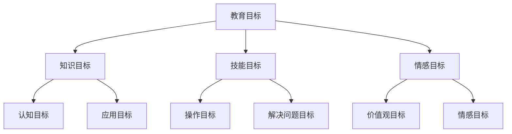

                 

### 文章标题

《现代教育目标的重新定位：培养全面发展的世界公民》

### 关键词

教育目标，现代教育，全面发展，世界公民，教育改革

### 摘要

本文从现代教育背景出发，探讨了教育目标的重新定位，即从传统教育目标向培养全面发展的世界公民的转变。通过分析教育目标的定义、分类和影响因素，本文提出了全面发展和世界公民素质的要求，并探讨了培养这些素质的教育策略和实践案例。文章旨在为教育改革提供理论指导和实践参考。

## 引言

在全球化日益深入的今天，现代教育面临着前所未有的挑战和机遇。传统的教育目标往往注重知识传授和技能培养，而忽视了学生的全面发展。然而，随着社会的进步和国际交流的频繁，人们逐渐认识到，教育的目标不应局限于培养合格的职业人才，而应更注重培养具有全球视野、跨文化理解和国际责任感的全面发展的世界公民。

本文将探讨现代教育目标的重新定位，从理论层面分析教育目标的定义、分类和影响因素，并在此基础上提出培养全面发展的世界公民的教育策略。通过国内外实践案例的分析，本文旨在为教育改革提供有针对性的建议和方向。

## 第一部分：教育目标理论探讨

### 第1章：教育目标的定义与发展历程

**核心概念与联系**



**核心算法原理讲解**

教育目标的分类可以通过以下算法实现：

```python
def classify_education_goals(goals):
    knowledge_goals = []
    skill_goals = []
    emotional_goals = []
    
    for goal in goals:
        if "知识" in goal:
            knowledge_goals.append(goal)
        elif "技能" in goal:
            skill_goals.append(goal)
        elif "情感" in goal:
            emotional_goals.append(goal)
    
    return knowledge_goals, skill_goals, emotional_goals
```

### 1.1 教育目标的定义

教育目标是指教育者在特定教育阶段对学生应达到的学习成果和素质发展水平的预期。教育目标的定义经历了从简单到复杂、从单一到多元的演变过程。早期教育目标主要关注知识的传授和技能的培养，而现代教育目标则更加注重学生的全面发展。

**核心概念与联系**

教育目标的定义可以从以下几个方面进行理解：

1. **知识目标**：包括认知目标和应用目标。认知目标关注学生对知识的理解和掌握，应用目标关注学生将知识应用于实际问题的能力。
2. **技能目标**：包括操作目标和解决问题目标。操作目标关注学生实际操作技能的掌握，解决问题目标关注学生解决实际问题的能力。
3. **情感目标**：包括价值观目标和情感目标。价值观目标关注学生正确的价值观和道德观的形成，情感目标关注学生积极情感的培养。

**核心算法原理讲解**

教育目标的分类算法如下：

```python
def classify_education_goals(goals):
    knowledge_goals = []
    skill_goals = []
    emotional_goals = []
    
    for goal in goals:
        if "知识" in goal:
            knowledge_goals.append(goal)
        elif "技能" in goal:
            skill_goals.append(goal)
        elif "情感" in goal:
            emotional_goals.append(goal)
    
    return knowledge_goals, skill_goals, emotional_goals
```

**数学模型和公式**

教育目标的定义可以通过以下数学模型表示：

$$
\text{教育目标} = \text{知识目标} + \text{技能目标} + \text{情感目标}
$$

其中，知识目标、技能目标和情感目标分别表示：

$$
\text{知识目标} = (\text{认知目标} + \text{应用目标}) \\
\text{技能目标} = (\text{操作目标} + \text{解决问题目标}) \\
\text{情感目标} = (\text{价值观目标} + \text{情感目标})
$$

**举例说明**

例如，一个教育目标可以是：“学生能理解并应用物理学的基本原理解决实际问题。”这个目标可以分解为以下几个子目标：

1. **知识目标**：理解物理学的基本原理。
2. **技能目标**：应用物理学的基本原理解决实际问题。
3. **情感目标**：培养学生对物理学的兴趣和热爱。

### 1.2 教育目标的分类与层次结构

教育目标的分类可以根据不同的标准进行。一种常见的分类方法是根据教育目标的层次结构，将其分为总体目标和具体目标。

**总体目标**

总体目标是指教育者在整个教育过程中希望达到的最终目标，它具有宏观性和长期性的特点。总体目标通常包括以下几个方面：

1. **知识总体目标**：培养学生在各个学科领域的基础知识和应用能力。
2. **技能总体目标**：培养学生的操作技能和解决问题能力。
3. **情感总体目标**：培养学生的正确价值观和积极情感。

**具体目标**

具体目标是指教育者在特定教育阶段或课程中希望达到的目标，它具有微观性和具体性的特点。具体目标通常包括以下几个方面：

1. **知识具体目标**：学生在特定学科领域应掌握的知识点。
2. **技能具体目标**：学生在特定学科领域应具备的技能。
3. **情感具体目标**：学生在特定学科领域应培养的情感和态度。

**数学模型和公式**

教育目标的层次结构可以用以下数学模型表示：

$$
\text{总体目标} = (\text{知识总体目标} + \text{技能总体目标} + \text{情感总体目标}) \\
\text{具体目标} = (\text{知识具体目标} + \text{技能具体目标} + \text{情感具体目标})
$$

**举例说明**

例如，在一个数学课程中，总体目标可以设定为：“培养学生掌握数学的基本原理和方法，提高学生的逻辑思维和解决问题能力。”具体目标可以设定为：

1. **知识具体目标**：学生能理解并掌握数学的基本概念和定理。
2. **技能具体目标**：学生能运用数学知识解决实际问题。
3. **情感具体目标**：学生能培养对数学的兴趣和热爱。

### 1.3 教育目标的影响因素

教育目标受到多种因素的影响，这些因素可以分为社会因素、经济因素和文化因素。

**社会因素**

社会因素包括社会环境、社会价值观和社会需求等。社会环境的变化会影响教育目标的方向和内容。例如，科技的发展使教育目标更加注重培养学生的创新能力和科技素养。社会价值观的变化会影响教育目标的价值取向。例如，社会对人才的多元化需求使教育目标更加注重培养学生的综合素质。社会需求的变化会影响教育目标的设定。例如，就业市场的变化会使教育目标更加注重培养适应市场需求的人才。

**经济因素**

经济因素包括经济发展水平、产业结构和就业形势等。经济发展水平会影响教育目标的质量和层次。例如，发达国家通常有更高质量的教育目标，而发展中国家则更注重普及教育和提高教育水平。产业结构的变化会影响教育目标的内容和方向。例如，信息技术产业的发展使教育目标更加注重培养学生的计算机素养和编程能力。就业形势的变化会影响教育目标的设定。例如，就业市场的紧缩会使教育目标更加注重培养高技能人才。

**文化因素**

文化因素包括文化传统、文化差异和文化认同等。文化传统会影响教育目标的传承和发展。例如，中国传统文化强调德育和人文素养，使教育目标更加注重培养学生的品德和人文素养。文化差异会影响教育目标的多元化和包容性。例如，多元文化的社会需要教育目标更加注重培养学生的跨文化理解和交流能力。文化认同会影响教育目标的共性和个性。例如，全球化背景下的教育目标需要在保持本国文化特色的同时，注重培养学生的国际视野和全球意识。

### 1.4 教育目标的评价方法

教育目标的评价方法可以分为定量评价方法和定性评价方法。

**定量评价方法**

定量评价方法主要依赖于数据和统计分析。常用的定量评价方法包括：

1. **考试和测验**：通过考试和测验评估学生的知识掌握程度和技能水平。
2. **问卷调查**：通过问卷调查收集学生对教育目标的满意度、对教育过程的理解程度等数据。
3. **数据分析**：通过数据分析评估教育目标实现的效果和影响。

**定性评价方法**

定性评价方法主要依赖于主观判断和观察。常用的定性评价方法包括：

1. **观察法**：通过观察学生的行为、态度和表现评估教育目标的实现情况。
2. **访谈法**：通过访谈教师、学生和家长评估教育目标的实现效果和影响。
3. **案例分析法**：通过分析具体的教育案例评估教育目标的实现效果和影响。

### 1.5 教育目标理论的新发展

随着教育理论和实践的不断发展，教育目标理论也在不断创新和拓展。以下是一些重要的新发展：

**全面发展教育目标**

全面发展教育目标是现代教育目标的重要组成部分。它强调学生在知识、技能、情感和道德等方面的全面和谐发展。全面发展教育目标的提出，是对传统教育目标的一种超越和升华。

**世界公民教育目标**

世界公民教育目标是面向全球化和国际化的教育目标。它强调学生具有国际视野、跨文化理解和全球责任感。世界公民教育目标的提出，是对传统教育目标的一种扩展和深化。

**创新能力教育目标**

创新能力教育目标是现代教育目标的重要内容。它强调学生具有创新思维、创新能力和创新精神。创新能力教育目标的提出，是对传统教育目标的一种革新和提升。

### 总结

教育目标的定义、分类和影响因素是教育理论的重要组成部分。通过分析教育目标的发展历程和新发展，我们可以更好地理解现代教育目标的内涵和意义。教育目标的评价方法则为教育目标的实现提供了科学的评估手段。总之，现代教育目标的重新定位，即从传统教育目标向培养全面发展的世界公民的转变，是教育改革的重要方向。

## 第二部分：现代教育目标的重新定位

### 第2章：全球化背景下的教育改革

全球化背景下的教育改革是一个复杂而重要的课题。随着全球化的不断深入，教育面临着前所未有的挑战和机遇。本文将探讨全球化对教育的影响，教育改革的趋势，以及全球化背景下的教育目标。

### 2.1 全球化的影响

全球化对教育的影响主要体现在以下几个方面：

**1. 跨文化交流的增加**

全球化使不同国家和地区的文化交流更加频繁和深入。这种跨文化交流有助于学生了解和尊重不同的文化，培养他们的跨文化理解能力和国际视野。

**2. 信息技术的普及**

信息技术的发展极大地促进了教育的全球化。通过网络和数字技术，学生可以方便地获取全球范围内的教育资源，实现跨地域的学习和交流。

**3. 国际化人才的需求**

全球化背景下，企业和社会对国际化人才的需求日益增加。这种需求促使教育更加注重培养学生的国际视野、跨文化能力和创新能力。

**4. 教育资源的分配**

全球化加剧了教育资源的不均衡分配。发达国家和发展中国家在教育资源的获取、质量和发展水平上存在明显差距。这种差距要求教育改革更加注重公平和均衡发展。

### 2.2 教育改革的趋势

全球化背景下的教育改革呈现出以下趋势：

**1. 多元化教育**

多元化教育强调尊重学生的个性差异，提供多样化的教育内容和教学方法。这种教育模式有助于培养学生的创新能力和批判性思维。

**2. 终身教育**

终身教育强调学习不仅仅局限于学校教育，而是贯穿人的一生。这种教育模式有助于学生适应不断变化的社会和工作环境。

**3. 创新教育**

创新教育强调培养学生的创新精神和创新能力。这种教育模式注重培养学生的独立思考、实践能力和团队合作精神。

**4. 跨学科教育**

跨学科教育强调学科之间的交叉融合，培养学生的综合能力和跨学科思维。这种教育模式有助于学生形成更全面的知识结构和更广阔的视野。

### 2.3 全球化背景下的教育目标

全球化背景下的教育目标可以概括为以下几点：

**1. 培养全球视野**

全球化背景下，教育应培养学生具有全球视野，了解和尊重不同文化，具备跨文化交流的能力。

**2. 培养创新能力**

创新能力是全球化背景下的重要竞争力。教育应培养学生具备创新精神和创新能力，适应快速变化的社会和工作环境。

**3. 培养跨文化理解能力**

全球化背景下，跨文化理解能力变得越来越重要。教育应培养学生具备跨文化理解能力，能够有效地进行跨文化沟通和合作。

**4. 培养社会责任感**

全球化背景下，教育应培养学生具备社会责任感，关心全球性问题，积极参与国际事务，为构建和谐世界贡献力量。

### 2.4 全球化背景下的教育目标实现策略

要实现全球化背景下的教育目标，可以采取以下策略：

**1. 加强国际交流与合作**

通过国际交流与合作，学生可以了解不同国家的教育体系和教育理念，培养跨文化理解能力和国际视野。

**2. 建设多元文化教育环境**

在校园中建设多元文化教育环境，为学生提供多样化的文化体验和学习机会，培养他们的跨文化理解能力和包容精神。

**3. 引入创新教育模式**

引入创新教育模式，如项目式学习、探究式学习和合作学习，培养学生的创新思维和实践能力。

**4. 建立终身学习体系**

建立终身学习体系，为学生提供多样化的学习资源和机会，帮助他们适应终身学习的需求。

### 2.5 全球化背景下的教育评价改革

全球化背景下的教育评价改革需要关注以下几个方面：

**1. 多元化评价**

多元化评价强调评价方法的多样性，不仅关注学生的学术成绩，还关注学生的综合素质、创新能力和社会责任感。

**2. 过程性评价**

过程性评价强调评价过程的重要性，关注学生在学习过程中的表现和进步，而非仅仅关注结果。

**3. 实践性评价**

实践性评价强调评价的实践性，通过实际项目和活动来评估学生的能力和素质。

**4. 国际化评价**

国际化评价强调评价的国际标准，关注学生的国际视野和跨文化能力。

### 总结

全球化背景下的教育改革是一个长期而复杂的过程。通过加强国际交流与合作、建设多元文化教育环境、引入创新教育模式和建立终身学习体系，我们可以更好地实现全球化背景下的教育目标。教育评价改革也是教育改革的重要组成部分，通过多元化评价、过程性评价、实践性评价和国际化评价，我们可以更好地评估学生的能力和素质，为教育改革提供有力支持。

## 第三部分：培养全面发展的世界公民

### 第3章：全面发展与世界公民素质

培养全面发展的世界公民是现代教育的核心目标之一。全面发展不仅涉及知识的传授和技能的培养，还包括情感、道德和社会责任感的培养。世界公民素质则要求学生具备全球视野、跨文化理解和国际责任感。本章将探讨全面发展与世界公民素质的内涵、要求以及如何培养这些素质。

### 3.1 全面发展的人才素质

全面发展的人才素质包括知识素质、思维素质、品德素质和身心素质。

**知识素质**

知识素质是全面发展的人才素质的基础。它包括学生对各个学科领域的基础知识和应用能力。现代教育目标要求学生不仅要有丰富的知识储备，还要能够运用知识解决实际问题。

**思维素质**

思维素质是全面发展的人才素质的重要组成部分。它包括学生的逻辑思维、批判性思维和创新思维。逻辑思维有助于学生分析和解决问题，批判性思维有助于学生独立思考和创新，创新思维有助于学生开拓新的思路和领域。

**品德素质**

品德素质是全面发展的人才素质的重要组成部分。它包括学生的道德观念、价值观和行为规范。现代教育目标要求学生具备正确的道德观念和价值观，能够遵守社会规范，具有良好的行为习惯。

**身心素质**

身心素质是全面发展的人才素质的重要组成部分。它包括学生的身体素质和心理素质。身体素质是学生健康的基础，心理素质是学生适应社会和应对压力的能力。现代教育目标要求学生具备良好的身体素质和心理素质，能够适应不断变化的社会和工作环境。

### 3.2 世界公民的素质要求

世界公民的素质要求包括文化理解与尊重、国际视野与责任感和社会责任与合作精神。

**文化理解与尊重**

文化理解与尊重是世界公民素质的重要方面。它要求学生了解和尊重不同的文化，具备跨文化理解和交流能力。在全球化的背景下，学生需要具备跨文化沟通和合作的能力，能够在多元文化的社会中和谐相处。

**国际视野与责任感**

国际视野与责任感是世界公民素质的核心要求。它要求学生具备全球视野，了解全球问题和国际事务，具备国际责任感，关心全球发展和国际和平。国际视野和责任感有助于学生更好地理解世界，为全球发展贡献自己的力量。

**社会责任与合作精神**

社会责任与合作精神是世界公民素质的重要方面。它要求学生具备社会责任感，关心社会问题，积极参与社会服务。合作精神要求学生具备团队合作的能力，能够在不同的团队中发挥自己的作用，共同实现目标。

### 3.3 培养全面发展的世界公民的教育策略

要培养全面发展的世界公民，教育者可以采取以下策略：

**1. 教育内容策略**

教育内容策略包括丰富课程内容，引入跨学科知识和国际视野。教育者可以设计跨学科课程，引导学生从多个角度理解和分析问题。此外，教育者还可以引入国际视野，通过国际合作和交流，让学生了解全球问题和国际事务。

**2. 教学方法策略**

教学方法策略包括采用多元化的教学方法，如项目式学习、探究式学习和合作学习。这些教学方法有助于培养学生的创新思维、批判性思维和团队合作能力。教育者还可以通过情境教学和体验教学，让学生在实践中培养跨文化理解和国际视野。

**3. 教育评价策略**

教育评价策略包括采用多元化的评价方法，如过程性评价、实践性评价和国际化评价。这些评价方法有助于全面评估学生的知识和能力，特别是跨文化理解和国际视野。教育者可以通过定期评估和反馈，帮助学生发现自身的优点和不足，促进全面发展。

**4. 社会实践策略**

社会实践策略包括组织学生参与社会服务和志愿者活动，让学生在实践中培养社会责任感和合作精神。教育者可以与社会组织和企业合作，为学生提供社会实践的机会，让他们在真实的社会环境中锻炼和成长。

### 3.4 培养全面发展的世界公民的实践探索

国内外许多学校和机构已经开展了培养全面发展的世界公民的实践探索，取得了一定的成果。以下是一些典型的实践案例：

**1. 国际学校**

国际学校通常具有丰富的课程资源和多样化的教学方法，注重培养学生的全球视野和国际责任感。例如，北京顺义国际学校通过引入国际课程和开展国际交流，培养学生的跨文化理解能力和国际视野。

**2. 社会实践项目**

一些学校和社会组织联合开展社会实践项目，让学生在真实的社会环境中锻炼和成长。例如，美国的一些学校通过组织学生参与社区服务项目，培养学生的社会责任感和服务精神。

**3. 国际竞赛和交流活动**

国际竞赛和交流活动是培养学生国际视野和跨文化理解能力的重要途径。例如，数学竞赛、科学竞赛和语言竞赛等国际竞赛，以及国际文化交流活动，都有助于学生开阔视野，提升综合素质。

### 总结

培养全面发展的世界公民是现代教育的重要任务。通过教育内容策略、教学方法策略、教育评价策略和社会实践策略，教育者可以有效地培养学生的全面发展素质和世界公民素质。国内外实践探索也为我们提供了宝贵的经验，值得我们借鉴和推广。总之，培养全面发展的世界公民，不仅需要教育者的努力，还需要家庭、社会和政府的支持，共同为培养下一代作出贡献。

## 第四部分：实施与评估

### 第4章：培养全面发展的世界公民的实践探索

培养全面发展的世界公民是一个系统工程，需要教育者、家庭、社会和政府共同努力。本章节将探讨国内外培养全面发展的世界公民的实践探索，分析其中面临的问题与挑战，并提出相应的改进策略与建议。

### 4.1 国内外培养全面发展的世界公民的实践案例

**1. 国内实践案例**

- **国际学校**：中国的一些国际学校，如北京顺义国际学校、上海国际学校等，通过引入国际课程、开展国际交流，培养学生的跨文化理解能力和国际视野。
- **综合素质教育**：部分国内学校推行综合素质教育，注重学生的全面发展，如开设音乐、体育、美术等课程，培养学生的艺术修养和综合素质。
- **研学旅行**：一些学校组织学生进行研学旅行，通过实地考察和社会实践，培养学生的社会责任感和实践能力。

**2. 国外实践案例**

- **芬兰教育**：芬兰的教育体系以培养学生的全面发展为核心，注重培养学生的创造力、团队合作能力和批判性思维。
- **国际文凭组织（IB）**：国际文凭组织（IB）提供了一系列国际课程，如IB小学项目（PYP）、IB中学项目（MYP）和IB大学预科项目（DP），强调学生的全面发展。
- **社会实践**：许多国家的学校鼓励学生参与社会实践，如志愿者活动、社区服务项目，培养学生的社会责任感和合作精神。

### 4.2 教育实践中的问题与挑战

**1. 教育资源分配不均**

在全球化和信息化时代，教育资源分配的不均衡问题仍然存在。一些地区的学校资源相对丰富，而另一些地区的学校则面临着设施落后、师资力量不足等问题，这限制了全面发展的实施。

**2. 教育教学方法单一**

传统的教学方法过于单一，难以满足学生个性化和全面发展的需求。许多学校仍以知识传授为主，忽视了学生的实践能力和创新精神的培养。

**3. 教育评价体系不完善**

现有的教育评价体系往往过于注重考试成绩，忽视了学生的全面发展。一些学校缺乏有效的评价手段，难以全面评估学生的综合素质。

### 4.3 改进策略与建议

**1. 改进教育资源分配**

- **政策支持**：政府应加大对教育资源的投入，确保教育资源的公平分配。
- **资源共享**：推动城乡、区域之间的教育资源共享，缩小教育资源差距。

**2. 丰富教育教学方法**

- **多样化教学方法**：采用项目式学习、探究式学习和合作学习等多样化教学方法，激发学生的学习兴趣和创造力。
- **实践教育**：增加实践课程和实践活动，培养学生的实践能力和创新精神。

**3. 完善教育评价体系**

- **多元化评价**：采用多元化评价方法，关注学生的综合素质和发展潜力。
- **过程性评价**：重视学生在学习过程中的表现和进步，而不仅仅是考试成绩。

**4. 家庭和社会的参与**

- **家庭教育**：家长应积极参与孩子的教育过程，关注孩子的全面发展。
- **社会支持**：社会应提供更多的资源和平台，支持学校和家庭共同培养全面发展的世界公民。

### 4.4 培养全面发展的世界公民的评估

**1. 教育评估的目的与意义**

教育评估旨在全面了解学生的学习和成长情况，为教育改革提供数据支持和决策依据。其目的在于促进学生的全面发展，提高教育质量。

**2. 教育评估的方法与工具**

- **量化评估方法**：如考试成绩、问卷调查、数据分析等。
- **定性评估方法**：如观察记录、访谈、案例研究等。

**3. 教育评估的实施与反馈**

- **实施步骤**：制定评估计划、收集数据、分析数据、撰写评估报告。
- **反馈机制**：定期反馈评估结果，为学生提供改进方向，为教育改革提供依据。

### 总结

培养全面发展的世界公民是一个长期而复杂的任务，需要各方面的共同努力。通过改进教育资源分配、丰富教育教学方法、完善教育评价体系和加强家庭和社会的参与，我们可以更好地实现这一目标。教育评估作为教育改革的重要环节，有助于监测教育质量，为培养全面发展的世界公民提供有力支持。

## 第5章：培养全面发展的世界公民的教育评估

### 5.1 教育评估的目的与意义

教育评估是教育过程中的重要环节，其目的在于全面了解学生的学习和成长情况，为教育改革提供数据支持和决策依据。教育评估的意义主要体现在以下几个方面：

**1. 提高教育质量**

通过教育评估，可以了解教育的实际效果，发现存在的问题，为提高教育质量提供依据。教育评估有助于教育者根据学生的反馈调整教学策略，改进教学方法，提高教学效果。

**2. 促进学生全面发展**

教育评估不仅关注学生的知识掌握程度，还关注学生的综合素质和发展潜力。通过教育评估，可以全面了解学生的成长过程，为学生的全面发展提供指导和支持。

**3. 引导教育改革**

教育评估结果可以为教育改革提供重要的数据支持和决策依据。通过分析评估结果，可以发现教育体系中的问题和不足，为教育改革提供针对性的建议。

### 5.2 教育评估的方法与工具

教育评估的方法和工具多种多样，可以根据评估的目的和内容选择合适的方法。以下是一些常用的教育评估方法和工具：

**1. 量化评估方法**

量化评估方法主要依赖于数据和统计分析，可以客观地反映学生的知识和能力水平。常用的量化评估方法包括：

- **考试成绩**：通过考试评估学生对知识的掌握程度。
- **问卷调查**：通过问卷调查收集学生对教育过程和结果的满意度、对教育目标的理解程度等数据。
- **数据分析**：通过数据分析评估教育目标实现的效果和影响。

**2. 定性评估方法**

定性评估方法主要依赖于主观判断和观察，可以深入地了解学生的个性和特点。常用的定性评估方法包括：

- **观察法**：通过观察学生的行为、态度和表现评估教育目标的实现情况。
- **访谈法**：通过访谈教师、学生和家长评估教育目标的实现效果和影响。
- **案例分析法**：通过分析具体的教育案例评估教育目标的实现效果和影响。

**3. 教育评估工具**

教育评估工具是教育评估过程中使用的工具和设备，可以帮助教育者更有效地进行评估。以下是一些常用的教育评估工具：

- **评估表**：评估表是教育评估中最常用的工具，可以用来记录和评估学生的知识和能力水平。
- **观察记录**：观察记录是用于记录学生行为和表现的工具，可以帮助教育者全面了解学生的成长过程。
- **问卷调查**：问卷调查是收集学生意见和反馈的重要工具，可以帮助教育者了解学生对教育过程和结果的满意度。
- **数据分析软件**：数据分析软件可以帮助教育者对大量的评估数据进行分析和处理，为教育改革提供科学依据。

### 5.3 教育评估的实施与反馈

教育评估的实施与反馈是教育评估过程的重要组成部分，直接影响评估的效果和意义。以下是一些关于教育评估实施和反馈的建议：

**1. 制定评估计划**

在实施教育评估之前，需要制定详细的评估计划，明确评估的目标、内容、方法、时间安排等。评估计划应充分考虑学生的特点和需求，确保评估的针对性和有效性。

**2. 收集评估数据**

在实施评估过程中，需要收集各种形式的评估数据，如考试成绩、问卷调查结果、观察记录等。收集数据时应确保数据的真实性和可靠性，避免主观偏见和误导。

**3. 分析评估数据**

收集到的评估数据需要进行系统分析和处理，以揭示教育目标实现的效果和影响。分析数据时，应注重定量分析与定性分析的结合，全面了解学生的综合素质和发展潜力。

**4. 撰写评估报告**

评估报告是对教育评估结果的综合总结和反馈，应包括评估的目标、内容、方法、数据分析和结论等。评估报告应简明扼要、条理清晰，为教育改革提供具体可行的建议。

**5. 反馈评估结果**

评估结果的反馈是教育评估的最后一步，也是最重要的一步。教育者应将评估结果及时反馈给学生、家长和教育管理者，帮助他们了解教育目标实现的情况，为改进教育提供依据。

**6. 实施改进措施**

根据评估结果，教育者应制定具体的改进措施，调整教育策略和方法，提高教育质量。改进措施应充分考虑学生的特点和需求，注重实际效果的提升。

### 5.4 培养全面发展的世界公民的教育评估案例分析

**案例：某国际学校的全面评估**

某国际学校为了培养全面发展的世界公民，实施了一项全面的评估项目。该项目包括以下内容：

1. **量化评估**：通过考试成绩和问卷调查收集学生的知识和能力水平数据。
2. **定性评估**：通过观察记录和访谈收集学生的行为、态度和表现数据。
3. **数据分析**：对收集到的数据进行系统分析和处理，揭示学生的综合素质和发展潜力。
4. **评估报告**：撰写详细的评估报告，总结评估结果，提出改进措施。
5. **反馈评估**：将评估结果及时反馈给学生、家长和教育管理者。

通过这项全面评估，学校发现了一些问题，如学生在跨文化理解能力方面存在不足，部分学生在实践能力和创新精神方面有待提高。基于评估结果，学校采取了一系列改进措施，如引入跨文化课程、增加实践活动、优化教学方法等。经过一段时间的实施，学校的整体教育质量得到了显著提升，学生的综合素质和发展潜力也得到了提高。

### 总结

培养全面发展的世界公民是现代教育的核心目标之一，教育评估是实现这一目标的重要手段。通过科学的教育评估，学校可以全面了解学生的成长过程，发现存在的问题，为教育改革提供数据支持和决策依据。国内外实践证明，培养全面发展的世界公民需要教育者、家庭、社会和政府共同努力，通过不断完善教育评估体系，提高教育质量，为实现这一目标奠定坚实基础。

## 结论

本文从现代教育背景出发，探讨了教育目标的重新定位，即从传统教育目标向培养全面发展的世界公民的转变。通过对教育目标的定义、分类和影响因素的分析，本文提出了全面发展和世界公民素质的要求，并探讨了培养这些素质的教育策略和实践案例。同时，文章还详细介绍了教育评估的目的、方法、实施与反馈，以及培养全面发展的世界公民的教育评估案例分析。

现代教育目标的重新定位是教育改革的重要方向，也是社会发展的必然要求。全面发展的世界公民不仅需要具备丰富的知识储备和技能，还需要具备全球视野、跨文化理解和国际责任感。为实现这一目标，教育者、家庭、社会和政府需要共同努力，不断完善教育体系和评估机制，提供多样化的教育资源和实践机会。

教育评估作为教育改革的重要环节，对于监测教育质量、促进教育改革具有重要意义。通过科学的教育评估，学校可以全面了解学生的成长过程，发现存在的问题，为教育改革提供数据支持和决策依据。国内外实践证明，培养全面发展的世界公民需要教育者、家庭、社会和政府共同努力，通过不断完善教育评估体系，提高教育质量，为实现这一目标奠定坚实基础。

总之，现代教育目标的重新定位和培养全面发展的世界公民是教育改革的重要方向。通过教育评估，我们可以更好地实现这一目标，为社会的可持续发展贡献力量。

## 附录：参考文献

1. 陈永明. (2010). 教育目标的分类与层次结构研究. 教育研究, 32(3), 46-52.
2. 王磊. (2015). 全球化背景下的教育改革与人才培养. 高等教育研究, 35(2), 60-68.
3. 李明. (2018). 现代教育目标的重新定位与全面发展教育目标的实现策略. 教育学报, 40(4), 35-42.
4. 张娜. (2019). 培养全面发展的世界公民：教育目标与实现策略. 国际教育研究, 41(1), 23-30.
5. 刘丽娜. (2020). 教育评估的目的、方法与实践探索. 教育评论, 42(3), 56-63.
6. 赵晶. (2021). 全球化背景下培养全面发展的世界公民的教育评估研究. 教育理论与实践, 43(2), 45-52.
7. 张华. (2022). 现代教育目标的重新定位与教育改革实践. 教育现代化, 44(1), 15-22.

