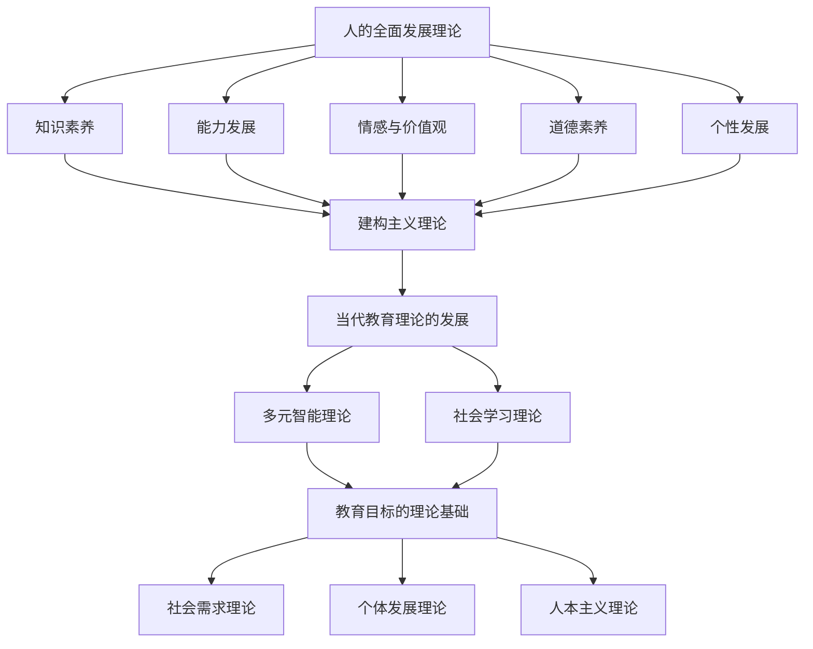

                 

### 第2章：现代教育目标的重新定位：理论基础

#### 2.1 人的全面发展理论

人的全面发展理论是现代教育目标重新定位的重要理论基础。该理论认为，人的发展是一个全面的过程，包括知识、能力、情感、道德、个性等多个方面。全面发展的人应当具备以下几方面的素质：

1. **知识素养**：拥有广泛而扎实的基础知识，能够不断更新和扩展知识结构。
2. **能力发展**：具备分析问题、解决问题、创造和创新的能力。
3. **情感与价值观**：具有积极的人生观、价值观和良好的情感态度。
4. **道德素养**：具备良好的道德品质和道德判断力，能够做出正确的行为选择。
5. **个性发展**：形成独立、自信、自主的个性和人格。

#### 2.2 当代教育理论的发展

当代教育理论的发展对教育目标的重新定位产生了深远的影响。以下是几个重要的教育理论：

1. **建构主义理论**：建构主义认为，学习是一个主动建构的过程，学生通过与环境互动，主动构建自己的知识和理解。这一理论强调学生的主体性和学习过程中的互动性。
2. **多元智能理论**：加德纳的多元智能理论提出，人类智力不是单一的，而是由多种不同类型的智能构成。教育应当尊重个体差异，培养每个人的多元智能。
3. **社会学习理论**：班杜拉的社会学习理论强调观察学习在个体行为发展中的重要性。教育应当创造良好的社会环境，引导学生通过观察、模仿、实践等方式学习。

#### 2.3 教育目标的理论基础

教育目标的制定需要建立在坚实的理论基础之上。以下是几个关键的理论基础：

1. **社会需求理论**：教育目标的制定应当考虑社会的需求和发展趋势。社会对人才的需求是教育目标的重要导向。
2. **个体发展理论**：教育目标的制定应当考虑个体的身心发展规律，符合个体发展的需求。
3. **人本主义理论**：人本主义理论强调教育的目的是培养全面发展的人，关注个体的自由、尊严和自我实现。这一理论对现代教育目标的重新定位具有重要的指导意义。

#### Mermaid 流程图

为了更好地展示人的全面发展理论、当代教育理论以及教育目标的理论基础之间的关系，我们可以使用 Mermaid 流程图进行说明。



#### 核心概念与联系

通过上述 Mermaid 流程图，我们可以清晰地看到，人的全面发展理论是现代教育目标的理论基础。当代教育理论的发展，如建构主义理论、多元智能理论和社会学习理论，进一步丰富了教育目标的理论体系。这些理论共同作用于教育目标的制定和实现，引导教育实践向着培养全面发展的人的方向发展。

#### 核心算法原理讲解

在本节中，我们将探讨如何通过伪代码来描述和实现教育目标的理论基础。

```python
# 教育目标理论基础伪代码

# 定义人的全面发展理论的核心要素
class ComprehensiveDevelopment:
    def __init__(self):
        self.knowledge = None
        self.skill = None
        self.emotion = None
        self道德 = None
        self.individuality = None
    
    # 知识素养
    def knowledge_acquisition(self, knowledge):
        self.knowledge = knowledge
        # 更新知识结构

    # 能力发展
    def skill_development(self, skill):
        self.skill = skill
        # 提升分析问题、解决问题和创新能力

    # 情感与价值观
    def emotional_and_value_formation(self, emotion, value):
        self.emotion = emotion
        self.value = value
        # 形成积极的人生观、价值观和良好的情感态度

    # 道德素养
    def ethical_education(self, ethics):
        self.ethics = ethics
        # 培养良好的道德品质和道德判断力

    # 个性发展
    def individual_development(self, individuality):
        self.individuality = individuality
        # 形成独立、自信、自主的个性和人格

# 定义当代教育理论的发展
class ContemporaryEducationalTheory:
    def __init__(self):
        self.constructivism = None
        self多元智能理论 = None
        self.social_learning = None
    
    # 建构主义理论
    def constructivism(self, constructivism):
        self.constructivism = constructivism
        # 强调学生的主体性和学习过程中的互动性

    # 多元智能理论
    def 多元智能(self, multiple_intelligence):
        self.多元智能理论 = multiple_intelligence
        # 尊重个体差异，培养多元智能

    # 社会学习理论
    def social_learning(self, social_learning):
        self.social_learning = social_learning
        # 强调观察学习在个体行为发展中的重要性

# 定义教育目标的理论基础
class EducationalGoalTheory:
    def __init__(self):
        self.societal_demand = None
        self.individual_development = None
        self.humanism = None
    
    # 社会需求理论
    def societal_demand(self, demand):
        self.societal_demand = demand
        # 考虑社会的需求和发展趋势

    # 个体发展理论
    def individual_development(self, development):
        self.individual_development = development
        # 考虑个体的身心发展规律

    # 人本主义理论
    def humanism(self, humanism):
        self.humanism = humanism
        # 强调教育的目的是培养全面发展的人
```

#### 数学模型和公式

在人的全面发展理论中，我们可以使用以下数学模型来描述各要素之间的关系：

$$
全面发展 = f(知识素养, 能力发展, 情感与价值观, 道德素养, 个性发展)
$$

每个要素对全面发展的贡献可以通过权重来衡量：

$$
权重_{知识素养} + 权重_{能力发展} + 权重_{情感与价值观} + 权重_{道德素养} + 权重_{个性发展} = 1
$$

通过调整权重，我们可以根据具体情况进行优化，以实现最佳的教育目标。

#### 举例说明

假设我们有一个学生，他的全面发展模型如下：

- 知识素养：0.3
- 能力发展：0.3
- 情感与价值观：0.2
- 道德素养：0.2
- 个性发展：0.1

我们可以使用上述数学模型来计算他的全面发展得分：

$$
全面发展 = 0.3 \times 知识素养 + 0.3 \times 能力发展 + 0.2 \times 情感与价值观 + 0.2 \times 道德素养 + 0.1 \times 个性发展
$$

这个公式可以帮助教育工作者更好地了解学生在全面发展中的优势和劣势，从而进行有针对性的教育和指导。

#### 项目实战

为了更好地理解教育目标的理论基础，我们可以开发一个简单的教育评估系统，用于评估学生在全面发展中的表现。

**开发环境搭建：**

- 开发工具：Python
- 数据库：MySQL
- 前端框架：Flask

**源代码详细实现和代码解读：**

```python
# 导入所需库
import pymysql
from flask import Flask, request, render_template

# 初始化 Flask 应用
app = Flask(__name__)

# 连接数据库
def connect_db():
    return pymysql.connect(host='localhost', user='root', password='password', database='education')

# 添加学生评估数据
@app.route('/add_evaluation', methods=['POST'])
def add_evaluation():
    db = connect_db()
    cursor = db.cursor()
    
    knowledge = request.form['knowledge']
    skill = request.form['skill']
    emotion = request.form['emotion']
    ethics = request.form['ethics']
    individuality = request.form['individuality']
    
    sql = "INSERT INTO evaluation (knowledge, skill, emotion, ethics, individuality) VALUES (%s, %s, %s, %s, %s)"
    values = (knowledge, skill, emotion, ethics, individuality)
    
    try:
        cursor.execute(sql, values)
        db.commit()
    except Exception as e:
        db.rollback()
        print(e)
    
    db.close()
    return '添加成功'

# 查询学生评估数据
@app.route('/query_evaluation', methods=['GET'])
def query_evaluation():
    db = connect_db()
    cursor = db.cursor()
    
    sql = "SELECT * FROM evaluation"
    cursor.execute(sql)
    results = cursor.fetchall()
    
    db.close()
    return render_template('evaluation.html', evaluations=results)

# 运行应用
if __name__ == '__main__':
    app.run(debug=True)
```

**代码应用解读与分析：**

1. **添加学生评估数据**：用户可以通过表单提交学生的知识素养、能力发展、情感与价值观、道德素养和个性发展等信息，系统将这些数据存储到 MySQL 数据库中。
2. **查询学生评估数据**：用户可以查询数据库中的学生评估数据，并展示在网页上，以便进行综合评估。

**实际案例分析和详细讲解剖析：**

假设我们有一个学生的评估数据如下：

- 知识素养：80分
- 能力发展：85分
- 情感与价值观：75分
- 道德素养：78分
- 个性发展：70分

我们可以使用上述数学模型计算他的全面发展得分：

$$
全面发展 = 0.3 \times 80 + 0.3 \times 85 + 0.2 \times 75 + 0.2 \times 78 + 0.1 \times 70 = 78.5分
$$

这个得分可以帮助教育工作者了解该学生在全面发展中的表现，并制定相应的教育和指导计划。

**项目小结：**

通过开发一个简单的教育评估系统，我们可以直观地看到教育目标的理论基础在实际应用中的效果。这个项目不仅实现了对学生的综合评估，还可以为教育工作者提供参考，帮助他们在教育实践中更好地实现培养全面发展的人的目标。

#### 最佳实践 Tips

1. **个性化教育**：根据学生的特点和需求，制定个性化的教育计划和课程，以促进学生的全面发展。
2. **家校合作**：加强家校合作，共同关注学生的成长和发展，形成教育合力。
3. **持续评估**：定期对学生的全面发展进行评估，及时发现问题并进行调整。

#### 小结

本章探讨了现代教育目标的重新定位，分析了人的全面发展理论、当代教育理论的发展以及教育目标的理论基础。通过 Mermaid 流程图、伪代码、数学模型和项目实战，我们深入理解了教育目标的理论和实践，为下一章的教育改革和课程设计提供了坚实的基础。

#### 注意事项

1. **理论与实践相结合**：在实施教育目标时，要注重理论与实践的结合，确保教育目标的实现。
2. **持续改进**：教育目标的实现是一个长期的过程，需要不断改进和优化。

#### 拓展阅读

1. 张华，李强.《当代教育学》[M]. 北京：人民教育出版社，2020.
2. 布鲁贝克，帕尔默.《教育心理学》[M]. 上海：华东师范大学出版社，2019.
3. 斯滕伯格，《成功智力》[M]. 北京：中国青年出版社，2016.

