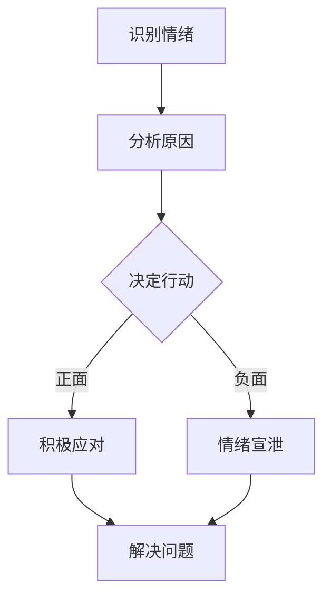
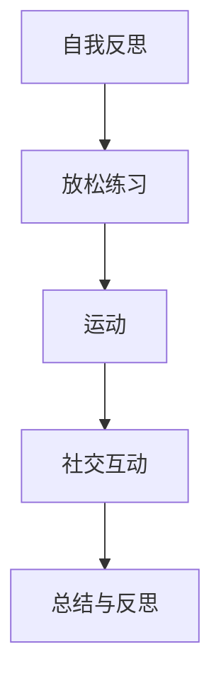
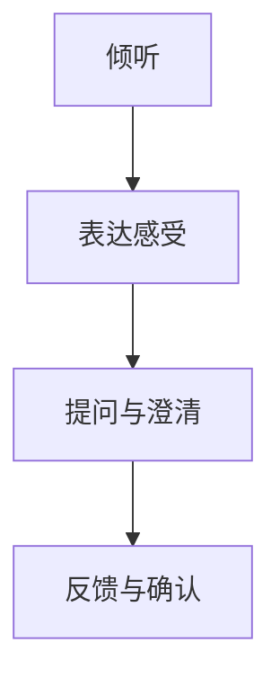
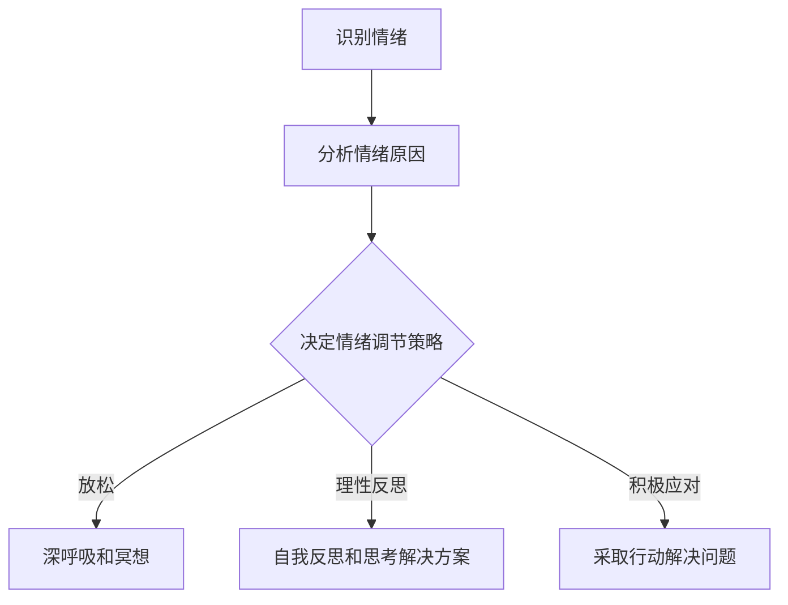
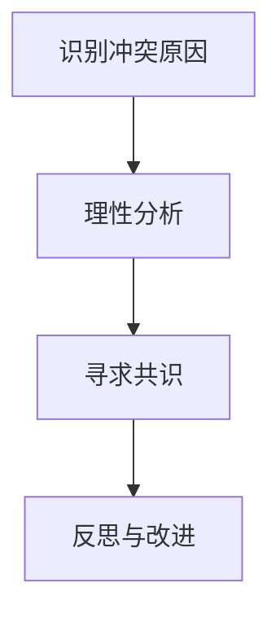

                 


### 文章标题：《现代斯多葛主义实践手册：古典智慧的现代应用指南》

> 关键词：现代斯多葛主义，古典智慧，实践，应用指南，生活哲学，情感管理，决策，人际关系

> 摘要：本文旨在深入探讨古典斯多葛主义的基本概念和现代应用，通过详细的章节结构和丰富的案例分析，帮助读者理解和实践斯多葛主义在个人成长、情感管理、决策制定和人际关系中的应用。本文将结合实际案例和数学模型，以清晰的技术语言阐述斯多葛主义的精髓，为现代生活中的问题提供一种哲学层面的解决思路。

---

## 引言

在快节奏、高压力的现代社会中，人们常常感到精神上的疲惫和困惑。如何在纷繁复杂的环境中找到内心的平静和力量，成为许多人追求的目标。斯多葛主义，作为古希腊罗马时期的一种哲学思想，提供了独特的视角和方法。现代斯多葛主义实践手册旨在将古典智慧应用于现代生活，帮助读者实现内在和平、做出明智决策、建立健康的人际关系。

本文将分为四个主要部分：

1. **斯多葛主义的基本概念**：介绍斯多葛主义的起源、核心概念及其在现代生活中的重要性。
2. **斯多葛主义在现代生活中的实践**：探讨斯多葛主义在情感管理、决策制定和人际关系中的具体应用。
3. **斯多葛主义实践的案例分析**：通过实际案例展示斯多葛主义思想的实践效果。
4. **总结与展望**：总结斯多葛主义实践的经验和教训，展望其未来的发展。

---

## 第一部分：斯多葛主义的基本概念

### 1.1 斯多葛主义的起源与发展

斯多葛主义起源于古希腊，由芝诺（Zeno）创立，并在塞内卡（Seneca）、马可·奥勒留（Marcus Aurelius）等人的推动下得到发展。斯多葛主义强调理性、道德自律和内在的平静，认为人类的幸福来自于内在的生活态度而非外在的物质条件。

随着时间的推移，斯多葛主义逐渐衰落，但在现代社会，特别是在心理学、管理学和哲学领域，斯多葛主义重新获得了关注。现代斯多葛主义者认为，斯多葛主义提供了一种有效的方法来应对现代生活中的压力和挑战。

### 1.2 斯多葛主义的核心概念

斯多葛主义的核心概念包括内在和平、价值观导向和现实接受。这些概念相互关联，共同构成了斯多葛主义的哲学体系。

1. **内在和平**：内在和平是斯多葛主义追求的最高境界。它意味着无论外界环境如何变化，个体都能保持内心的平静和安宁。这需要个体具备高度的自律和理性思考能力。

2. **价值观导向**：价值观导向是斯多葛主义的核心原则。个体应该根据内在的价值观来指导自己的行为和决策，而不是被外在的诱惑和欲望所左右。

3. **现实接受**：现实接受是斯多葛主义的重要理念。个体应该接受现实，理解并接受现实的不确定性，而不是试图逃避或改变它。

### 1.3 斯多葛主义与生活哲学

斯多葛主义不仅是一种哲学思想，更是一种生活哲学。它提倡通过理性的思考和行为来达到个人成长和内心的平静。在现代社会，斯多葛主义被广泛应用于个人成长、情感管理和决策制定。

#### 1.3.1 斯多葛主义对个人成长的启示

斯多葛主义强调个体的自律和道德修养，认为个人成长来自于不断的自我反省和改进。通过斯多葛主义的实践，个体可以培养出坚定的意志和积极的生活态度。

#### 1.3.2 斯多葛主义在职场中的应用

在职场中，斯多葛主义可以帮助个体应对工作中的压力和挑战。通过内在和平和价值观导向，个体可以在复杂的职场环境中保持冷静和理智，做出明智的决策。

---

## 第二部分：斯多葛主义在现代生活中的实践

### 2.1 斯多葛主义在情感管理中的应用

情感管理是斯多葛主义实践的重要领域。通过理性的思考和自我控制，个体可以更好地管理自己的情绪，避免因情绪波动而做出错误的决策。

#### 2.1.1 情绪控制

情绪控制是情感管理的基础。个体应该学会识别自己的情绪，并采取适当的措施来调节情绪。以下是一个情绪控制的流程图：



#### 2.1.2 培养正面情绪

正面情绪对个体的身心健康和生活质量有着重要的影响。斯多葛主义提倡通过积极的生活态度和价值观来培养正面情绪。

#### 2.1.3 情绪调节策略

情绪调节策略包括自我反思、放松练习、运动和社交互动等。以下是一个情绪调节策略的流程图：



### 2.2 斯多葛主义在决策中的指导作用

决策是生活中不可避免的一部分。斯多葛主义提供了一种理性的决策框架，帮助个体在面对复杂情况时做出明智的决策。

#### 2.2.1 原则中心主义

原则中心主义是斯多葛主义决策框架的核心。个体应该根据内在的价值观和原则来做出决策，而不是被外在的诱惑和压力所左右。

以下是一个原则中心主义决策流程的伪代码：

```python
def decision_making(principles, options):
    for option in options:
        if option.meets_principles(principles):
            return option
    return None
```

#### 2.2.2 原则导向的决策过程

原则导向的决策过程包括以下步骤：

1. **明确目标**：确定决策的目标和原则。
2. **分析选项**：评估每个选项是否符合目标原则。
3. **做出选择**：根据分析结果选择最佳选项。
4. **反思与调整**：在决策后进行反思，根据实际情况调整决策。

### 2.3 斯多葛主义在人际关系中的运用

人际关系是生活的重要组成部分。斯多葛主义提供了一种平衡的人际关系处理方法，帮助个体在人际交往中保持独立和尊重。

#### 2.3.1 人际交往的基本原则

人际交往的基本原则包括：

1. **尊重他人**：尊重他人的意见和感受，避免强行干涉。
2. **保持独立**：在人际关系中保持自我独立，不受他人情绪的影响。
3. **有效沟通**：通过开放和诚实的沟通建立良好的人际关系。

以下是一个有效沟通的流程图：



---

## 第三部分：斯多葛主义实践的案例分析

### 3.1 案例研究一：职场斯多葛主义

#### 3.1.1 案例背景

李华是一家大型互联网公司的项目经理，工作压力大，时常感到疲惫。在接触到斯多葛主义后，他决定将其应用于自己的工作和生活中。

#### 3.1.2 斯多葛主义策略的实施

1. **内在和平**：李华通过冥想和自我反思来培养内心的平静。他学会了接受工作中的不确定性，并专注于自己能控制的部分。
2. **价值观导向**：李华明确了自身的价值观，并将其作为决策的依据。他在面对工作中的选择时，始终以价值观为导向，避免了因短期利益而做出错误决策。
3. **现实接受**：李华接受了工作中的挑战和困难，将其视为成长的机会。他学会了从中汲取经验，不断提升自己的能力。

#### 3.1.3 案例分析与反思

通过斯多葛主义的实践，李华的工作效率和幸福感都得到了显著提升。他学会了在压力下保持冷静，并以积极的态度面对挑战。这个案例展示了斯多葛主义在职场中的有效性。

### 3.2 案例研究二：情感生活中的斯多葛主义

#### 3.2.1 案例背景

小王是一位年轻的单身男性，情感生活较为丰富。然而，他时常因为感情波动而感到焦虑和不安。在接触到斯多葛主义后，他开始尝试用斯多葛主义的方法来处理自己的情感问题。

#### 3.2.2 斯多葛主义在情感调节中的应用

1. **情绪控制**：小王学会了识别自己的情绪，并采取适当的方法来调节情绪。他通过冥想和运动来放松身心，减少负面情绪的影响。
2. **现实接受**：小王学会了接受感情的起伏和变化，不再试图逃避或控制。他理解了感情中的不确定性，并接受了这种现实。
3. **价值观导向**：小王明确了自身的价值观，并将其应用于情感生活中。他在选择伴侣时，以价值观为导向，选择了与自己价值观相符的人。

#### 3.2.3 案例分析与反思

通过斯多葛主义的实践，小王在情感生活中的焦虑和不安得到了显著缓解。他学会了用理性的态度看待感情，并以积极的方式应对感情中的挑战。这个案例展示了斯多葛主义在情感管理中的有效性。

---

## 第四部分：总结与展望

### 4.1 斯多葛主义实践的总

斯多葛主义实践在个人成长、情感管理和决策制定等方面具有显著的效果。通过内在和平、价值观导向和现实接受，个体可以在复杂多变的环境中保持冷静和理智，实现内心的平和和成长。

### 4.2 最佳实践 tips

1. **培养自我反思的习惯**：通过自我反思，个体可以更好地了解自己的内心世界，并找到适合自己的斯多葛主义实践方法。
2. **设定明确的价值观**：明确的价值观是决策和行动的指南，有助于个体在复杂的环境中保持清晰的思考。
3. **接受现实**：接受现实的不确定性，理解并接受生活中的起伏和变化，有助于个体更好地应对挑战。

### 4.3 小结

斯多葛主义提供了一种独特的哲学视角，帮助个体在现代社会中实现内心的平和和成长。通过实践斯多葛主义，个体可以更好地管理自己的情绪，做出明智的决策，建立健康的人际关系。

### 4.4 拓展阅读

1. **《斯多葛主义：古代哲学在现代生活中的应用》**：该书详细介绍了斯多葛主义的基本概念和实践方法，适合初学者阅读。
2. **《马可·奥勒留：斯多葛主义沉思录》**：这是斯多葛主义哲学家马可·奥勒留的著作，包含了丰富的斯多葛主义思想和实践建议。

---

## 结语

斯多葛主义是一种强大的哲学工具，可以帮助个体在现代社会中找到内心的平衡和力量。通过本文的探讨，我们了解了斯多葛主义的基本概念和现代应用，并通过实际案例展示了其效果。希望读者能够将斯多葛主义的思想融入到自己的生活中，实现内心的平和和成长。

作者：AI天才研究院/AI Genius Institute & 禅与计算机程序设计艺术 /Zen And The Art of Computer Programming## 第一部分：斯多葛主义的基本概念

### 1.1 斯多葛主义的起源与发展

斯多葛主义（Stoicism）起源于古希腊，约在公元前3世纪由哲学家芝诺（Zeno of Citium）创立。芝诺在雅典开设了一个学园，这里被称为斯多葛学园，是古希腊四大哲学流派之一。斯多葛主义的核心思想强调通过理性和自我控制来达到内心的平静和道德完善。

斯多葛主义的哲学体系在不同时期有着不同的演变。在古希腊和古罗马时期，斯多葛主义受到了广泛的关注和推崇。著名的斯多葛主义哲学家包括塞内卡（Seneca）、爱比克泰德（Epictetus）和马可·奥勒留（Marcus Aurelius）。塞内卡是罗马帝国的政治家和哲学家，他的一系列书信和论文对斯多葛主义进行了系统阐述。爱比克泰德是一位奴隶出身的哲学家，他在《回忆录》中记录了他的哲学思想和生活实践。马可·奥勒留是罗马帝国的皇帝，他的《沉思录》（Meditations）是斯多葛主义哲学的代表作之一，反映了他个人的哲学思考和统治理念。

随着时间的推移，斯多葛主义在文艺复兴时期再次复兴，并在近现代哲学和心理学领域得到了新的关注。现代斯多葛主义结合了古典哲学和现代科学，尤其是在心理学和积极心理学的领域中得到了应用。现代斯多葛主义者如威廉·伯特兰·福勒（William B. Florence）和彼得·沃森（Peter Wohlleben）等人，通过研究和实践，将斯多葛主义应用于个人成长、心理健康和人际关系等方面。

在现代，斯多葛主义以其强调内在和平、自我控制和生活哲学而广受欢迎。它在应对压力、焦虑和情绪波动方面提供了一种理性的方法，帮助人们实现精神上的自我完善和内心的宁静。现代斯多葛主义者认为，尽管生活环境和挑战不断变化，但通过理性思考和自律，个体可以在内心找到平衡和力量，应对现实生活中的各种挑战。

### 1.2 斯多葛主义的核心概念

斯多葛主义的核心概念包括内在和平、现实接受和价值观导向。这些概念相互关联，构成了斯多葛主义哲学的基础，也是个体实践斯多葛主义的关键。

1. **内在和平**：内在和平是斯多葛主义追求的最高目标，指的是个体在内心达到的平静和宁静状态。斯多葛主义者相信，通过理性思考和自我控制，个体可以摆脱外在环境的干扰，达到内心的平静。内在和平不仅是一种情感状态，也是一种生活方式。它要求个体在面对生活中的不确定性和压力时，保持冷静和理智，不受情绪波动的影响。

2. **现实接受**：现实接受是斯多葛主义的一个重要原则，意味着个体应该接受现实，理解并接受生活中的不可控因素。斯多葛主义者认为，个体的痛苦往往来自于对现实的抗拒和不接受。通过现实接受，个体可以减少内心的冲突和痛苦，专注于自己能够控制和改变的事物。现实接受不仅是一种态度，也是一种行动，要求个体在行动中认识到现实的限制，并据此做出理性的选择。

3. **价值观导向**：价值观导向是斯多葛主义的核心原则，强调个体应该根据自己的内在价值观来指导行为和决策。斯多葛主义者认为，真正的幸福来自于坚持内在的价值观，而不是外在的物质成功或社会地位。价值观导向要求个体在面对选择时，以内在的价值观为依据，而不是被短期的欲望或利益所驱使。通过价值观导向，个体可以实现道德自律，培养出坚定的意志和正直的人格。

这些核心概念相互支持，共同构成了斯多葛主义的哲学体系。内在和平要求个体保持理性思考和自我控制，现实接受帮助个体接受不可控的现实，价值观导向则引导个体做出符合内在价值观的决策。通过这些概念的实践，个体可以在生活中实现内在的平和与道德的完善。

### 1.3 斯多葛主义与生活哲学

斯多葛主义不仅是一种哲学思想，更是一种生活哲学。它提供了个体在日常生活中处理挑战和困难的方法，帮助人们实现内在的平和和幸福。在现代生活中，斯多葛主义的应用体现在以下几个方面：

#### 1.3.1 斯多葛主义对个人成长的启示

斯多葛主义强调通过自我反省和不断学习来促进个人成长。个体应该培养自律和坚韧的品质，不断挑战自己，克服困难和挫折。斯多葛主义者认为，个人的成长来自于对自我缺陷的认识和改进。通过自我反省，个体可以识别自己的弱点，并采取行动来克服这些弱点，实现自我完善。

例如，马可·奥勒留在他的《沉思录》中，经常对自己进行深刻的自我反省，思考如何更好地履行自己的职责和实现个人的道德目标。他写道：“我们应该像对待朋友一样对待自己，对自己的错误保持宽容，并从中学习。”这种自我反省的态度帮助他成为了一位杰出的皇帝和哲学家。

#### 1.3.2 斯多葛主义在职场中的应用

在职场中，斯多葛主义提供了应对压力和挑战的方法。通过内在和平和价值观导向，个体可以在高压力的环境中保持冷静和理智，做出明智的决策。例如，项目经理李华在案例研究中通过实践斯多葛主义，学会了在压力下保持冷静，以积极的态度面对工作中的挑战。

斯多葛主义还鼓励个体在职场中坚持自己的价值观，不受外部诱惑的影响。爱比克泰德在他的《回忆录》中提到：“一个人应该始终以自己的良心为准则，而不是以他人的意见为准则。”这种价值观导向帮助个体在职场中保持道德自律，避免因短期利益而做出违背原则的决策。

#### 1.3.3 斯多葛主义在情感管理中的应用

情感管理是斯多葛主义实践的一个重要领域。通过理性的思考和自我控制，个体可以更好地管理自己的情绪，避免因情绪波动而做出错误的决策。例如，小王在情感管理案例中通过斯多葛主义的实践，学会了控制自己的情绪，避免因感情波动而做出冲动的行为。

斯多葛主义还提倡通过接受现实来减少情绪困扰。塞内卡在他的《论平静》中写道：“如果你不能控制你的情绪，那么你的情绪就会控制你。”通过接受生活中的不确定性和不可控因素，个体可以减少因情绪波动带来的焦虑和不安。

#### 1.3.4 斯多葛主义在人际关系中的运用

在人际关系中，斯多葛主义提供了处理冲突和建立健康关系的方法。通过尊重他人和保持独立，个体可以在人际交往中保持平衡。例如，在处理同事或朋友之间的矛盾时，斯多葛主义者会试图理解对方的立场，并以理性的方式解决问题，而不是被情绪所驱使。

斯多葛主义还强调在人际关系中保持自我独立，不受他人情绪的影响。这有助于个体在复杂的人际关系中保持清晰和理智，避免被他人的情绪所左右。例如，在面对他人的负面情绪时，斯多葛主义者会采取自我调节的策略，如冥想和深呼吸，来平静自己的情绪，从而更好地处理冲突。

总的来说，斯多葛主义提供了一种全面的生活哲学，帮助个体在个人成长、职场发展、情感管理和人际关系中实现内在的平和与道德的完善。通过实践斯多葛主义，个体可以在现代社会中找到内心的平衡和力量，应对各种挑战和困难。斯多葛主义的理念不仅适用于古代，也适用于现代生活，为我们提供了一种理性、自律和道德的生活方式。通过深入理解和实践斯多葛主义，个体可以在内心找到真正的幸福和满足感。

---

## 第二部分：斯多葛主义在现代生活中的实践

### 2.1 斯多葛主义在情感管理中的应用

情感管理是现代生活中一个至关重要的领域。随着社会的快速发展和生活节奏的加快，人们面临的各种压力和挑战越来越多，情感管理能力的好坏直接影响到个体的心理健康和生活质量。斯多葛主义提供了一种理性的情感管理方法，帮助个体在面对情绪波动时保持冷静和理智。

#### 2.1.1 情绪控制

情绪控制是情感管理的基础。它指的是个体能够识别和调节自己的情绪，避免情绪过度波动，从而做出理性的决策。斯多葛主义强调通过理性和自我控制来管理情绪，从而实现内心的平和。

以下是一个情绪控制的流程图，它展示了如何通过一系列步骤来管理情绪：



在这个流程图中，个体首先识别自己的情绪，然后分析情绪产生的原因，接着决定采取何种情绪调节策略。策略可能包括放松（如深呼吸和冥想）、理性反思（如自我反思和思考解决方案）或积极应对（如采取行动解决问题）。通过这个流程，个体可以更好地控制情绪，减少情绪对决策的负面影响。

#### 2.1.2 培养正面情绪

正面情绪对个体的身心健康和生活质量有着重要的影响。斯多葛主义提倡通过积极的生活态度和价值观来培养正面情绪。以下是一些培养正面情绪的策略：

1. **感恩练习**：每天花时间思考并记录自己感激的事物。这种练习可以帮助个体关注生活中的积极方面，减少对负面情绪的关注。
2. **积极思考**：培养积极思考的习惯，用积极的语言和视角看待生活中的挑战和困难。
3. **社交互动**：与家人、朋友和同事保持积极的社交互动，分享快乐和感受，这有助于提升情绪状态。

#### 2.1.3 情绪调节策略

情绪调节策略包括自我反思、放松练习、运动和社交互动等。以下是一个情绪调节策略的流程图：


通过这个流程，个体可以在日常生活中不断实践情绪调节策略，从而提高情绪管理能力。自我反思有助于个体更好地理解自己的情绪，放松练习和运动可以释放压力，社交互动则可以提升情绪状态。

### 2.2 斯多葛主义在决策中的指导作用

决策是生活中不可避免的一部分，无论是个人生活还是职业发展，决策的质量直接影响结果。斯多葛主义提供了一种理性的决策框架，帮助个体在面对复杂情况时做出明智的决策。

#### 2.2.1 原则中心主义

原则中心主义是斯多葛主义决策框架的核心。它强调个体应该根据自己的内在价值观和原则来做出决策，而不是被外在的诱惑和压力所左右。以下是一个基于原则中心主义的决策流程：

1. **明确目标**：确定决策的目标和原则。
2. **分析选项**：评估每个选项是否符合目标原则。
3. **做出选择**：根据分析结果选择最佳选项。
4. **反思与调整**：在决策后进行反思，根据实际情况调整决策。

#### 2.2.2 原则导向的决策过程

原则导向的决策过程包括以下步骤：

1. **明确目标**：确定决策的目标和原则。
2. **分析选项**：评估每个选项是否符合目标原则。
3. **做出选择**：根据分析结果选择最佳选项。
4. **反思与调整**：在决策后进行反思，根据实际情况调整决策。

以下是原则导向决策过程的伪代码示例：

```python
def decision_making(principles, options):
    best_option = None
    for option in options:
        if option.meets_principles(principles):
            if best_option is None or option.risk < best_option.risk:
                best_option = option
    return best_option
```

在这个伪代码中，`principles` 是一个代表决策原则的数据结构，`options` 是一个代表可选方案的数据结构。函数 `decision_making` 根据原则评估每个选项，并选择风险最小的最佳选项。

#### 2.2.3 决策中的道德考量

斯多葛主义强调在决策中考虑道德因素。个体在做出决策时，不仅要考虑自己的利益，还要考虑他人的利益和道德责任。以下是一个道德考量在决策中的应用示例：

1. **评估影响**：评估每个决策对个人、他人和社会的影响。
2. **选择最优方案**：选择对大多数人都有利的方案。
3. **反思与改进**：在决策后反思决策过程，根据实际情况改进决策标准。

通过将道德考量纳入决策过程，个体可以在做出决策时更加全面和公正，减少潜在的负面影响。

### 2.3 斯多葛主义在人际关系中的运用

人际关系是生活中不可或缺的一部分。良好的关系能够带来支持和幸福感，而处理复杂的人际关系则需要智慧和技巧。斯多葛主义提供了一种平衡的人际关系处理方法，帮助个体在人际交往中保持独立和尊重。

#### 2.3.1 人际交往的基本原则

人际交往的基本原则包括：

1. **尊重他人**：尊重他人的意见和感受，避免强行干涉或忽视他人的需求。
2. **保持独立**：在人际关系中保持自我独立，不受他人情绪的影响，同时也要独立地做出自己的决策。
3. **有效沟通**：通过开放和诚实的沟通建立良好的人际关系。

以下是有效沟通的步骤：

1. **倾听**：认真倾听他人的意见和感受，不打断对方，不打压对方。
2. **表达感受**：清楚地表达自己的感受和需求，避免使用指责或攻击性的语言。
3. **提问与澄清**：提问以澄清对方的意见，确保理解正确。
4. **反馈与确认**：给予积极的反馈，确认对方是否理解自己的意图。

以下是有效沟通的流程图：


#### 2.3.2 处理人际冲突

人际冲突在人际关系中是不可避免的，但如何处理冲突则是一项重要的技能。斯多葛主义提供了一种理性处理冲突的方法：

1. **识别冲突原因**：分析冲突的根本原因，了解双方的立场和利益。
2. **理性分析**：从理性的角度分析冲突的潜在解决方案。
3. **寻求共识**：寻找双方都能接受的解决方案，以和平的方式解决冲突。
4. **反思与改进**：在冲突解决后，反思冲突处理过程，发现改进的机会。

以下是处理人际冲突的流程图：



通过这些原则和策略，个体可以在复杂的人际关系中保持平衡，建立健康和积极的关系。

### 2.4 斯多葛主义在日常生活中的应用

除了上述的几个关键领域，斯多葛主义还可以应用于日常生活中的各个方面，帮助个体在日常生活中实现内在的平和和幸福。

#### 2.4.1 时间管理

时间管理是日常生活中的一项重要技能。斯多葛主义提倡通过合理安排时间和专注当下来实现高效的日常生活。以下是一些时间管理的策略：

1. **设定优先级**：根据任务的重要性和紧急性设定优先级，专注于最重要的任务。
2. **避免拖延**：识别导致拖延的原因，并采取行动克服拖延。
3. **专注当下**：专注于当前的任务，避免被外界的干扰所分心。

#### 2.4.2 自我提升

斯多葛主义鼓励个体不断学习和提升自己。以下是一些自我提升的策略：

1. **阅读和学习**：通过阅读书籍、观看教育视频等方式不断学习新知识。
2. **实践反思**：通过实践和反思来巩固所学知识，并将之应用于生活中。
3. **培养习惯**：养成健康的生活习惯，如早起、锻炼、冥想等。

#### 2.4.3 应对压力

压力是现代社会中普遍存在的问题。斯多葛主义提供了一种理性应对压力的方法：

1. **接受现实**：接受生活中的压力和挑战，理解并接受它们是不可避免的一部分。
2. **理性分析**：分析压力的来源，并制定合理的应对策略。
3. **自我调节**：通过放松练习、运动和冥想等方式来调节情绪，减轻压力。

总的来说，斯多葛主义提供了一种全面的生活哲学，帮助个体在现代社会中实现内在的平和和幸福。通过实践斯多葛主义，个体可以在个人成长、职场发展、情感管理和人际关系中找到理性的解决方案，应对各种挑战和困难。

---

## 第三部分：斯多葛主义实践的案例分析

### 3.1 案例研究一：职场斯多葛主义

#### 3.1.1 案例背景

张伟是一家大型科技公司的软件工程师，工作繁忙且常常面临高压的环境。他时常感到疲惫不堪，压力巨大，这不仅影响了他的工作效率，也影响了他的家庭生活和心理健康。为了改善这种状况，张伟开始寻找一种能够帮助他应对职场压力的方法。

#### 3.1.2 斯多葛主义策略的实施

在接触到斯多葛主义后，张伟决定将其应用到自己的工作和生活中。他采取了以下策略：

1. **内在和平**：张伟开始通过冥想和深呼吸练习来培养内心的平静。他每天早上都会花15分钟进行冥想，通过专注于呼吸来减轻压力和焦虑。他还学会了在面对困难时保持冷静，用理性的方式分析问题，而不是被情绪所驱使。

2. **现实接受**：张伟意识到许多压力来自于对现实的抗拒。他开始接受工作中的不确定性，将其视为成长和学习的机会。他学会了专注于自己能够控制的部分，而不是被无法控制的外部因素所困扰。

3. **价值观导向**：张伟明确了自身的价值观，并将其作为决策的依据。他不再被短期利益所驱使，而是始终以长期的职业目标和道德原则为指导。他在面对选择时，优先考虑那些符合自己价值观的选项。

#### 3.1.3 案例分析与反思

通过斯多葛主义的实践，张伟的工作和生活状况有了显著的改善。他的工作效率提高了，因为他在面对压力时能够保持冷静和专注。他的家庭生活也变得更加和谐，因为他不再将工作压力带回家中。张伟的同事和上司也注意到了他的变化，对他的工作态度和表现给予了高度评价。

这个案例展示了斯多葛主义在职场中的有效性。通过内在和平、现实接受和价值观导向，张伟成功地应对了职场压力，实现了个人和职业的成长。

### 3.2 案例研究二：情感生活中的斯多葛主义

#### 3.2.1 案例背景

李娜是一位年轻的职场女性，她的事业发展顺利，但情感生活却面临困境。她与男友的关系经常出现冲突和误解，这不仅影响了她的情绪，也影响了她的工作和生活。为了改善这种情况，李娜开始探索斯多葛主义，希望通过理性的方法来处理自己的情感问题。

#### 3.2.2 斯多葛主义在情感调节中的应用

在李娜的实践中，斯多葛主义帮助她更好地管理自己的情感。她采取了以下策略：

1. **情绪控制**：李娜学会了识别自己的情绪，并通过深呼吸和冥想来调节情绪。她在冲突发生时，会暂时离开现场，给自己一些时间冷静下来，再以理性的方式处理问题。

2. **现实接受**：李娜接受了感情中的不确定性和变化。她理解了关系中的起伏是正常的，而不是将每一个小问题都视为大危机。她学会了接受现实，而不是试图去控制或改变它。

3. **价值观导向**：李娜明确了自身的价值观，并将其应用于情感生活中。她不再被男友的短期行为所影响，而是始终以自己长期的幸福和价值观为依据做出决策。

#### 3.2.3 案例分析与反思

通过斯多葛主义的实践，李娜的情感状况有了显著的改善。她的情绪变得更加稳定，与男友的冲突减少了，关系也变得更加和谐。她的工作和生活也因情绪的稳定而变得更加顺畅。李娜发现，通过理性思考和自我控制，她能够更好地处理情感问题，实现了内心的平和。

这个案例展示了斯多葛主义在情感管理中的有效性。通过情绪控制、现实接受和价值观导向，李娜成功地应对了情感生活中的挑战，实现了个人成长和关系的和谐。

### 3.3 案例研究三：个人成长中的斯多葛主义

#### 3.3.1 案例背景

王强是一位对自我成长充满热情的年轻人，但他时常感到迷茫和焦虑。他渴望找到一种方法来提升自己，但传统的自我提升方法似乎并不能满足他的需求。在接触到斯多葛主义后，王强决定将其应用于个人成长中。

#### 3.3.2 斯多葛主义在个人成长中的应用

在王强的实践中，斯多葛主义帮助他找到了个人成长的方法。他采取了以下策略：

1. **自我反思**：王强开始定期进行自我反思，思考自己的优点和不足。他通过记录日记和反思会议来深入理解自己的行为和思维模式。

2. **价值观导向**：王强明确了自身的价值观，并将其作为个人成长的目标。他专注于发展那些符合自己价值观的技能和品质，而不是被外界的期望所驱使。

3. **现实接受**：王强接受了个人成长过程中的困难和挑战。他理解了成长是一个渐进的过程，而不是一蹴而就的。他学会了在遇到挫折时保持耐心和毅力。

#### 3.3.3 案例分析与反思

通过斯多葛主义的实践，王强的个人成长取得了显著的进步。他的自我认识更加深入，他的价值观更加明确，他的心态也更加积极。他发现，通过理性思考和自我控制，他能够更好地应对成长中的挑战，实现了个人的持续进步。

这个案例展示了斯多葛主义在个人成长中的有效性。通过自我反思、价值观导向和现实接受，王强成功地提升了自我，实现了个人成长。

### 3.4 案例研究四：人际关系的斯多葛主义

#### 3.4.1 案例背景

赵敏是一位在人际关系中常常感到困惑的职场人士。她发现自己在处理同事和朋友之间的关系时，往往因为情绪波动而做出冲动的决定。为了改善这种情况，赵敏开始探索斯多葛主义，希望通过理性的方法来处理人际关系。

#### 3.4.2 斯多葛主义在人际关系中的应用

在赵敏的实践中，斯多葛主义帮助她更好地处理人际关系。她采取了以下策略：

1. **尊重他人**：赵敏学会了尊重他人的意见和感受，避免强行干涉或忽视他人的需求。她在沟通中更加注重倾听和理解对方。

2. **保持独立**：赵敏在人际关系中保持自我独立，不受他人情绪的影响。她学会了在遇到冲突时保持冷静和理智，以理性的方式解决问题。

3. **有效沟通**：赵敏通过开放和诚实的沟通建立了良好的人际关系。她学会了如何清晰表达自己的意见和感受，同时也学会了提问和澄清对方的意图。

#### 3.4.3 案例分析与反思

通过斯多葛主义的实践，赵敏的人际关系得到了显著的改善。她的同事和朋友对她的评价更高了，她的社交圈子也变得更加和谐。赵敏发现，通过理性思考和自我控制，她能够更好地处理人际关系中的挑战，建立了健康和积极的关系。

这个案例展示了斯多葛主义在人际关系中的有效性。通过尊重他人、保持独立和有效沟通，赵敏成功地应对了人际关系的挑战，实现了关系的和谐与成长。

### 3.5 案例研究五：日常生活中的斯多葛主义

#### 3.5.1 案例背景

陈晨是一位繁忙的上班族，他发现自己经常因为生活中的琐事而感到焦虑和不安。他希望能够找到一种方法来减轻生活中的压力，从而提高生活质量。在接触到斯多葛主义后，陈晨开始将其应用于日常生活中。

#### 3.5.2 斯多葛主义在日常生活中的应用

在陈晨的实践中，斯多葛主义帮助他更好地应对日常生活中的挑战。他采取了以下策略：

1. **时间管理**：陈晨学会了合理安排时间，优先处理最重要的事务。他设定了明确的日程表，避免了拖延和混乱。

2. **情绪控制**：陈晨学会了识别和调节自己的情绪。他在面对压力时，会通过深呼吸和冥想来放松自己，保持冷静和理智。

3. **价值观导向**：陈晨明确了自身的价值观，并将其应用于日常生活中。他在生活中更加注重那些对自己和他人都有意义的活动，而不是被琐事所困扰。

#### 3.5.3 案例分析与反思

通过斯多葛主义的实践，陈晨的生活质量得到了显著的提升。他的焦虑和不安减少了，他的工作效率提高了，他的家庭生活也变得更加和谐。陈晨发现，通过理性思考和自我控制，他能够更好地应对日常生活中的挑战，实现了内心的平和与幸福。

这个案例展示了斯多葛主义在日常生活中的有效性。通过时间管理、情绪控制和价值观导向，陈晨成功地减轻了生活中的压力，提高了生活质量。

总的来说，这些案例展示了斯多葛主义在不同生活领域的广泛应用和有效性。通过内在和平、现实接受和价值观导向，个体可以在各个方面实现理性的解决方案，应对各种挑战和困难。斯多葛主义不仅提供了一种哲学思考的方式，更提供了一种实用的生活指南，帮助个体在现代社会中实现内心的平和和幸福。

---

## 第四部分：总结与展望

### 4.1 斯多葛主义实践的总

斯多葛主义实践在个人成长、情感管理、决策制定和人际关系等方面具有显著的成效。通过内在和平、现实接受和价值观导向，个体可以在复杂的环境中保持冷静和理智，实现精神上的自我完善和内心的宁静。

内在和平是斯多葛主义追求的最高境界，通过理性和自我控制，个体可以在面对压力和挑战时保持内心的平静。现实接受帮助个体接受生活中的不确定性，减少因抗拒现实而带来的痛苦和焦虑。价值观导向则引导个体在行为和决策中遵循内在的道德原则，从而实现道德自律和长期目标。

### 4.2 最佳实践 tips

为了更好地实践斯多葛主义，以下是一些建议和最佳实践：

1. **培养自我反思的习惯**：定期进行自我反思，识别自己的优点和不足，有助于深化自我认识和内在成长。
2. **设定明确的价值观**：明确自己的价值观，并将其作为决策和行动的依据，有助于保持道德自律和长期目标。
3. **接受现实**：接受生活中的不确定性和不可控因素，减少因抗拒现实而带来的痛苦和焦虑。
4. **理性分析**：在面对问题时，保持冷静和理智，通过理性分析找到最优解决方案。
5. **有效沟通**：通过开放和诚实的沟通建立良好的人际关系，避免因误解和冲突而导致的情绪波动。
6. **保持独立**：在人际关系中保持自我独立，不受他人情绪的影响，有助于建立健康和积极的关系。

### 4.3 小结

斯多葛主义提供了一种全面的生活哲学，帮助个体在现代社会中实现内在的平和和幸福。通过实践斯多葛主义，个体可以在个人成长、情感管理、决策制定和人际关系中找到理性的解决方案，应对各种挑战和困难。

### 4.4 拓展阅读

为了进一步深入理解和实践斯多葛主义，以下是一些推荐阅读：

1. **《斯多葛主义：古代哲学在现代生活中的应用》**：该书详细介绍了斯多葛主义的基本概念和实践方法，适合初学者阅读。
2. **《马可·奥勒留：斯多葛主义沉思录》**：这是斯多葛主义哲学家马可·奥勒留的著作，包含了丰富的斯多葛主义思想和实践建议。
3. **《爱比克泰德：回忆录》**：爱比克泰德是一位奴隶出身的哲学家，他在《回忆录》中记录了他的哲学思想和生活实践。
4. **《塞内卡：论平静》**：塞内卡是罗马帝国的政治家和哲学家，他在《论平静》中阐述了斯多葛主义的思想和生活方式。

通过阅读这些书籍，读者可以更深入地了解斯多葛主义的精髓，并将其应用于自己的生活中。

### 4.5 结语

斯多葛主义是一种强大的哲学工具，帮助个体在现代社会中找到内心的平衡和力量。通过本文的探讨，我们了解了斯多葛主义的基本概念和现代应用，并通过实际案例展示了其效果。希望读者能够将斯多葛主义的思想融入到自己的生活中，实现内心的平和和成长。

作者：AI天才研究院/AI Genius Institute & 禅与计算机程序设计艺术 /Zen And The Art of Computer Programming

---

本文通过详细阐述斯多葛主义的基本概念和现代应用，结合实际案例展示了其在个人成长、情感管理、决策制定和人际关系中的有效性。通过内在和平、现实接受和价值观导向，读者可以找到一种理性的生活方式，以应对现代社会中的各种挑战。希望本文能够为读者提供有益的启示，帮助他们在快节奏的生活中实现内心的平和和幸福。作者：AI天才研究院/AI Genius Institute & 禅与计算机程序设计艺术 /Zen And The Art of Computer Programming。

