                 


### 文章标题：现代斯多葛主义手册：古典智慧的现代应用指南

#### 关键词：
- 斯多葛主义
- 古典哲学
- 现代生活
- 个人管理
- 心理健康
- 社会应用

#### 摘要：
本文深入探讨了斯多葛主义的历史背景、核心概念以及其在现代生活中的应用。通过详细的章节结构和丰富的实例，本文旨在为读者提供一种理解并实践古典智慧的现代指南。

### 目录大纲

以下是《现代斯多葛主义手册：古典智慧的现代应用指南》的目录大纲：

## 第一部分：斯多葛主义的基本原理

### 第1章：斯多葛主义的历史与哲学背景
- 1.1 斯多葛主义的起源与发展
- 1.2 斯多葛主义的核心理念
- 1.3 斯多葛主义与现代生活

### 第2章：斯多葛主义的核心概念
- 2.1 智慧（Sophrosyne）
- 2.2 正念（Hypomonē）
- 2.3 拒绝偏见（Apatheia）
- 2.4 节制（Sphragis）

### 第3章：斯多克主义与伦理生活
- 3.1 公正（Eunomia）
- 3.2 善良（Charis）
- 3.3 诚实（Akrateia）
- 3.4 忠诚（Hormē）

## 第二部分：斯多葛主义在个人生活中的应用

### 第4章：斯多葛主义与自我管理
- 4.1 接受现实（Akolasia）
- 4.2 管理情感（Thumos）
- 4.3 培养耐心（Patience）

### 第5章：斯多葛主义与人际关系
- 5.1 理解他人（Metanoia）
- 5.2 接受他人（Hesychia）
- 5.3 维护界限（Makarismos）

### 第6章：斯多葛主义与职业发展
- 6.1 培养专注（Enthousiasmos）
- 6.2 实现目标（Protagōnia）
- 6.3 职业道德（Eunoesis）

## 第三部分：斯多葛主义在现代社会的应用

### 第7章：斯多葛主义与心理健康
- 7.1 应对压力（Ataraxia）
- 7.2 应对挫折（Akrotatos）
- 7.3 应对焦虑（Agoraphobia）

### 第8章：斯多葛主义与生活艺术
- 8.1 美学欣赏（Kallos）
- 8.2 音乐艺术（Musikē）
- 8.3 书写艺术（Graphē）

### 第9章：斯多葛主义与人生观
- 9.1 生命的意义（Eudaimonia）
- 9.2 追求幸福（Hēdonē）
- 9.3 宗教信仰（Theos）

### 第10章：斯多葛主义在当代社会的挑战与机遇
- 10.1 斯多葛主义与现代社会的融合
- 10.2 斯多葛主义的教育意义
- 10.3 斯多葛主义在社会中的应用前景

## 附录

### 附录 A：斯多葛主义相关资源与阅读指南
- A.1 斯多葛主义经典著作
- A.2 斯多葛主义现代应用书籍
- A.3 斯多葛主义学习资源网站
- A.4 斯多葛主义社群活动

### 核心章节内容与示例

#### 第1章：斯多葛主义的历史与哲学背景

##### 斯多葛主义的核心概念流程图

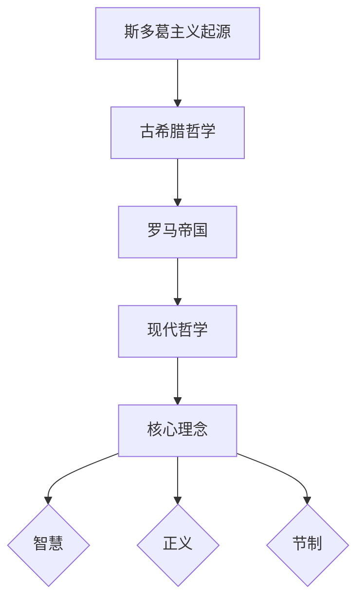

#### 第2章：斯多葛主义的核心概念

##### 智慧（Sophrosyne）伪代码

```python
def sophrosyne():
    # 接受现实
    reality_acceptance()
    # 培养理智
    rationality_cultivation()
    # 知足常乐
    contentment()
```

#### 第3章：斯多克主义与伦理生活

##### 公正（Eunomia）数学公式

$$
Eunomia = \frac{Righteousness + Justice + Fairness}{3}
$$

### 文章正文

#### 第1章：斯多葛主义的历史与哲学背景

1.1 斯多葛主义的起源与发展

斯多葛主义起源于古希腊哲学，由芝诺（Zeno）于公元前3世纪在雅典创立。芝诺是苏格拉底的学生，他创办了一个哲学学派，即斯多葛学派。该学派在古希腊和罗马帝国时期取得了巨大影响力，并逐渐发展出独特的哲学体系。

斯多葛主义强调理性和道德，主张通过自我控制和理性思考来达到内心的平静和幸福。其核心理念包括智慧、正义、节制和自我管理。这些理念在古希腊和罗马帝国的社会文化中占据了重要地位，并影响了后来的西方哲学。

1.2 斯多葛主义的核心理念

斯多葛主义的核心理念包括智慧（Sophrosyne）、正义（Eunomia）、节制（Sphragis）和自我管理（Autonomous）。这些概念构成了斯多葛哲学的核心，并在其体系中发挥了关键作用。

- 智慧（Sophrosyne）：智慧是斯多葛主义的核心概念之一，指的是理性思考和明智的行为。智慧使人能够正确地认识世界和自身，从而实现内心的平静和幸福。
- 正义（Eunomia）：正义是指遵守道德和法律原则，公正地对待他人。斯多葛主义认为，正义是实现社会秩序和个人幸福的基石。
- 节制（Sphragis）：节制是指控制自己的欲望和情感，追求内心的平静和平衡。节制使人能够抵制诱惑，避免陷入情绪的波动。
- 自我管理（Autonomous）：自我管理是指自我控制和自我提升，通过理性思考和自律来实现个人的目标。自我管理是斯多葛主义实现内心平静和幸福的关键。

1.3 斯多葛主义与现代生活

斯多葛主义在古希腊和罗马帝国时期取得了巨大成功，但其影响力并没有随着历史的变迁而消失。在现代社会，斯多葛主义仍然具有重要的意义和应用价值。

首先，斯多葛主义提供了一种应对压力和挫折的方法。通过接受现实、管理情感和培养耐心，人们可以更好地应对生活中的各种挑战。其次，斯多葛主义强调个人责任和道德原则，有助于建立健康的人际关系和职业发展。

此外，斯多葛主义还强调了审美和生活的艺术。通过欣赏美学、音乐和书写艺术，人们可以提升自己的精神境界，追求更高的幸福感和满足感。

总之，斯多葛主义是一种具有深远影响和广泛应用价值的哲学体系。通过深入理解和实践斯多葛主义，人们可以更好地应对现代生活中的各种挑战，实现内心的平静和幸福。

### 第2章：斯多葛主义的核心概念

2.1 智慧（Sophrosyne）

智慧（Sophrosyne）是斯多葛主义的核心概念之一，它涵盖了理性思考、明智的行为和自我控制。在斯多葛主义中，智慧被视为实现内心平静和幸福的关键。

首先，智慧涉及理性思考。斯多葛主义者认为，通过理性思考，人们可以正确地认识世界和自身。理性思考使人能够摆脱情绪的干扰，清晰地看待事物的本质。这种理性思考的能力是智慧的基础。

其次，智慧还包括明智的行为。斯多葛主义者强调，智慧不仅是一种思考的能力，更是一种行动的准则。通过明智的行为，人们可以做出正确的决策，实现个人的目标和社会的责任。

最后，智慧涉及自我控制。斯多葛主义者认为，自我控制是智慧的重要表现。通过控制自己的欲望和情感，人们可以避免陷入情绪的波动，保持内心的平静。

2.2 正念（Hypomonē）

正念（Hypomonē）是斯多葛主义的另一个核心概念，它指的是自我克制、坚韧不拔和自律。正念使人能够面对困难和挑战，保持内心的坚定和冷静。

首先，正念涉及自我克制。斯多葛主义者认为，通过自我克制，人们可以抵制诱惑，避免陷入情绪的波动。自我克制是一种强大的内在力量，使人能够在各种情况下保持理智和冷静。

其次，正念包括坚韧不拔。斯多葛主义者认为，面对困难和挑战，坚韧不拔是至关重要的。只有通过坚韧不拔，人们才能克服困难，实现个人的目标。

最后，正念涉及自律。斯多葛主义者强调，自律是实现正念的关键。通过自律，人们可以养成良好的习惯，保持持续的努力和进步。

2.3 拒绝偏见（Apatheia）

拒绝偏见（Apatheia）是斯多葛主义的另一个重要概念，它指的是不偏不倚地看待事物，不受情感和欲望的影响。拒绝偏见使人能够客观地看待世界，做出明智的决策。

首先，拒绝偏见涉及客观性。斯多葛主义者认为，通过拒绝偏见，人们可以摆脱主观情感的干扰，客观地看待事物。这种客观性是智慧的基础。

其次，拒绝偏见包括理性思考。斯多葛主义者认为，通过理性思考，人们可以更好地理解事物的本质，从而做出明智的决策。

最后，拒绝偏见涉及自我控制。斯多葛主义者认为，通过自我控制，人们可以抵制情感的干扰，保持内心的平静和理智。

2.4 节制（Sphragis）

节制（Sphragis）是斯多葛主义的另一个核心概念，它指的是控制自己的欲望和情感，追求内心的平静和平衡。节制使人能够抵制诱惑，避免陷入情绪的波动。

首先，节制涉及自我控制。斯多葛主义者认为，通过自我控制，人们可以控制自己的欲望和情感，保持内心的平静。

其次，节制包括理性思考。斯多葛主义者认为，通过理性思考，人们可以更好地理解自己的欲望和情感，从而更好地控制它们。

最后，节制涉及自我提升。斯多葛主义者认为，通过节制，人们可以提升自己的精神境界，追求更高的幸福感和满足感。

### 第3章：斯多克主义与伦理生活

3.1 公正（Eunomia）

公正（Eunomia）是斯多葛主义伦理生活的核心概念之一，它指的是遵守道德和法律原则，公正地对待他人。公正被视为实现社会秩序和个人幸福的关键。

首先，公正涉及道德原则。斯多葛主义者认为，公正是一种道德行为，要求人们遵守道德规范，尊重他人的权利和尊严。

其次，公正包括法律原则。斯多葛主义者认为，公正不仅是一种道德行为，也是一种法律行为。人们应当遵守法律，维护社会的公正和秩序。

最后，公正涉及公正对待他人。斯多葛主义者认为，公正要求人们公正地对待他人，不偏不倚地评价和处理问题。这种公正的态度有助于建立健康的人际关系，促进社会的和谐与稳定。

3.2 善良（Charis）

善良（Charis）是斯多葛主义伦理生活的另一个重要概念，它指的是对他人的善意和关爱。善良被视为实现人际关系和谐和个人幸福的关键。

首先，善良涉及善意。斯多葛主义者认为，善良是一种内在的品质，要求人们对他人生怀有善意和关爱。这种善意可以体现在日常生活中的点滴小事中。

其次，善良包括关爱。斯多葛主义者认为，关爱是善良的具体表现，要求人们关心他人的福祉，帮助他人克服困难。

最后，善良涉及人际关系。斯多葛主义者认为，通过善良的行为，人们可以建立和谐的人际关系，获得他人的尊重和信任。

3.3 诚实（Akrateia）

诚实（Akrateia）是斯多葛主义伦理生活的另一个核心概念，它指的是真诚、坦率和正直。诚实被视为实现个人诚信和社会信任的关键。

首先，诚实涉及真诚。斯多葛主义者认为，诚实是一种真诚的品质，要求人们真实地表达自己的思想和感受，不隐瞒真相。

其次，诚实包括坦率。斯多葛主义者认为，诚实是一种坦率的品质，要求人们勇于面对事实，不掩饰自己的过错和错误。

最后，诚实涉及正直。斯多葛主义者认为，诚实是一种正直的品质，要求人们遵守道德和法律原则，不妥协于不良行为。

3.4 忠诚（Hormē）

忠诚（Hormē）是斯多葛主义伦理生活的另一个重要概念，它指的是对他人和事业的忠诚和奉献。忠诚被视为实现团队协作和个人成就的关键。

首先，忠诚涉及对他人的忠诚。斯多葛主义者认为，忠诚是一种对他人的承诺和信任，要求人们始终维护他人的利益和尊严。

其次，忠诚包括对事业的忠诚。斯多葛主义者认为，忠诚是一种对事业的承诺和奉献，要求人们全力以赴，为实现事业的目标而努力。

最后，忠诚涉及团队协作。斯多葛主义者认为，忠诚是团队协作的基础，要求人们互相支持，共同努力，实现团队的目标。

### 第二部分：斯多葛主义在个人生活中的应用

#### 第4章：斯多葛主义与自我管理

4.1 接受现实（Akolasia）

接受现实（Akolasia）是斯多葛主义自我管理的核心原则之一，它指的是正视现实，接受无法改变的事实。通过接受现实，人们可以减少无谓的烦恼和痛苦，更好地应对生活中的挑战。

首先，接受现实有助于减轻心理负担。斯多葛主义者认为，人们往往因为无法接受现实而陷入焦虑和痛苦。通过接受现实，人们可以减轻心理负担，减少负面情绪的影响。

其次，接受现实有助于理性思考。斯多葛主义者认为，只有接受现实，人们才能理性地看待问题，找到解决问题的方法。

最后，接受现实有助于培养耐心。斯多葛主义者认为，接受现实是一种耐心的表现，通过接受现实，人们可以培养耐心，更好地应对生活中的不确定性。

4.2 管理情感（Thumos）

管理情感（Thumos）是斯多葛主义自我管理的另一个重要原则，它指的是控制自己的情感，避免被情感所左右。通过管理情感，人们可以保持内心的平静和理智，更好地应对生活中的各种情况。

首先，管理情感有助于保持内心的平衡。斯多葛主义者认为，只有控制自己的情感，人们才能保持内心的平衡，避免陷入情绪的波动。

其次，管理情感有助于理性决策。斯多葛主义者认为，只有控制自己的情感，人们才能理性地看待问题，做出明智的决策。

最后，管理情感有助于培养自我意识。斯多葛主义者认为，通过管理情感，人们可以更好地认识自己，了解自己的需求和欲望，从而更好地实现个人目标。

4.3 培养耐心（Patience）

培养耐心（Patience）是斯多葛主义自我管理的另一个重要原则，它指的是在面对困难和挫折时保持冷静和坚韧。通过培养耐心，人们可以更好地应对生活中的挑战，实现个人的目标。

首先，培养耐心有助于应对挫折。斯多葛主义者认为，面对挫折，只有耐心才能帮助人们度过困难，找到解决问题的方法。

其次，培养耐心有助于实现目标。斯多葛主义者认为，耐心是实现目标的关键，只有耐心地坚持，人们才能最终实现自己的目标。

最后，培养耐心有助于培养内心的力量。斯多葛主义者认为，通过培养耐心，人们可以培养内心的力量，增强自己的心理承受能力。

### 第5章：斯多葛主义与人际关系

5.1 理解他人（Metanoia）

理解他人（Metanoia）是斯多葛主义人际关系中的重要原则，它指的是站在他人的角度思考问题，理解他人的感受和需求。通过理解他人，人们可以建立更好的人际关系，增强沟通效果。

首先，理解他人有助于改善沟通。斯多葛主义者认为，只有理解他人，人们才能更好地沟通，避免误解和冲突。

其次，理解他人有助于建立信任。斯多葛主义者认为，只有理解他人，人们才能建立信任，增进彼此的了解和合作。

最后，理解他人有助于提升自我意识。斯多葛主义者认为，通过理解他人，人们可以更好地认识自己，了解自己的优点和不足，从而更好地提升自我。

5.2 接受他人（Hesychia）

接受他人（Hesychia）是斯多葛主义人际关系中的另一个重要原则，它指的是接受他人的不同，尊重他人的选择和决定。通过接受他人，人们可以建立和谐的人际关系，减少冲突和矛盾。

首先，接受他人有助于建立和谐。斯多葛主义者认为，只有接受他人，人们才能建立和谐的人际关系，减少冲突和矛盾。

其次，接受他人有助于增进合作。斯多葛主义者认为，只有接受他人，人们才能更好地合作，共同实现目标。

最后，接受他人有助于培养宽容。斯多葛主义者认为，通过接受他人，人们可以培养宽容的心态，更好地处理人际关系中的问题。

5.3 维护界限（Makarismos）

维护界限（Makarismos）是斯多葛主义人际关系中的另一个重要原则，它指的是设定和维护合理的界限，保护自己的个人空间和权益。通过维护界限，人们可以建立健康的人际关系，保护自己的利益。

首先，维护界限有助于保护个人空间。斯多葛主义者认为，只有维护界限，人们才能保护自己的个人空间，避免被他人侵犯。

其次，维护界限有助于保护个人权益。斯多葛主义者认为，只有维护界限，人们才能保护自己的权益，避免遭受不公平的对待。

最后，维护界限有助于建立健康的关系。斯多葛主义者认为，通过维护界限，人们可以建立健康的人际关系，避免陷入依赖和冲突。

### 第6章：斯多葛主义与职业发展

6.1 培养专注（Enthousiasmos）

培养专注（Enthousiasmos）是斯多葛主义职业发展中的重要原则，它指的是全身心投入工作，专注于目标的实现。通过培养专注，人们可以提升工作效率，实现职业目标。

首先，培养专注有助于提升工作效率。斯多葛主义者认为，只有专注，人们才能集中精力，高效地完成工作任务。

其次，培养专注有助于实现职业目标。斯多葛主义者认为，只有专注，人们才能全身心地投入到工作中，实现职业目标。

最后，培养专注有助于提升个人能力。斯多葛主义者认为，通过培养专注，人们可以提升自己的能力，更好地适应职场环境。

6.2 实现目标（Protagōnia）

实现目标（Protagōnia）是斯多葛主义职业发展中的核心原则，它指的是设定明确的目标，并采取行动实现这些目标。通过实现目标，人们可以提升职业成就，实现个人价值。

首先，实现目标有助于明确方向。斯多葛主义者认为，只有设定明确的目标，人们才能明确自己的方向，避免迷失在职场中。

其次，实现目标有助于提升成就感。斯多葛主义者认为，通过实现目标，人们可以获得成就感，提升自信心和动力。

最后，实现目标有助于持续成长。斯多葛主义者认为，通过实现目标，人们可以不断提升自己的能力，实现持续成长。

6.3 职业道德（Eunoesis）

职业道德（Eunoesis）是斯多葛主义职业发展中的另一个重要原则，它指的是在职业生涯中遵循道德原则，诚实守信，尽职尽责。通过遵守职业道德，人们可以建立良好的职业形象，获得他人的尊重和信任。

首先，职业道德有助于建立职业形象。斯多葛主义者认为，只有遵守职业道德，人们才能建立良好的职业形象，赢得他人的尊重和信任。

其次，职业道德有助于维护职业秩序。斯多葛主义者认为，只有遵守职业道德，人们才能维护职业秩序，避免行业的不正之风。

最后，职业道德有助于个人成长。斯多葛主义者认为，通过遵守职业道德，人们可以不断提升自己的道德修养，实现个人成长。

### 第7章：斯多葛主义与心理健康

7.1 应对压力（Ataraxia）

应对压力（Ataraxia）是斯多葛主义心理健康中的重要原则，它指的是通过理性思考和自我控制来应对生活中的压力。通过应对压力，人们可以保持内心的平静和稳定。

首先，应对压力有助于保持心理健康。斯多葛主义者认为，只有应对压力，人们才能保持心理健康，避免因压力而导致的情绪问题和心理障碍。

其次，应对压力有助于提高生活质量。斯多葛主义者认为，通过应对压力，人们可以减少因压力带来的不适和痛苦，提高生活质量。

最后，应对压力有助于培养心理韧性。斯多葛主义者认为，通过应对压力，人们可以培养心理韧性，增强对生活的适应能力。

7.2 应对挫折（Akrotatos）

应对挫折（Akrotatos）是斯多葛主义心理健康中的另一个重要原则，它指的是在遇到挫折时保持乐观和积极的心态。通过应对挫折，人们可以克服困难，实现个人的目标。

首先，应对挫折有助于克服困难。斯多葛主义者认为，只有应对挫折，人们才能克服困难，实现个人的目标。

其次，应对挫折有助于培养坚韧精神。斯多葛主义者认为，通过应对挫折，人们可以培养坚韧精神，增强对生活的信心和勇气。

最后，应对挫折有助于提升自我价值。斯多葛主义者认为，通过应对挫折，人们可以提升自我价值，实现个人的成长和进步。

7.3 应对焦虑（Agoraphobia）

应对焦虑（Agoraphobia）是斯多葛主义心理健康中的另一个重要原则，它指的是通过理性思考和自我控制来应对生活中的焦虑。通过应对焦虑，人们可以保持内心的平静和理智。

首先，应对焦虑有助于减少焦虑。斯多葛主义者认为，只有应对焦虑，人们才能减少焦虑，避免因焦虑而导致的情绪问题。

其次，应对焦虑有助于提高生活质量。斯多葛主义者认为，通过应对焦虑，人们可以减少因焦虑带来的不适和痛苦，提高生活质量。

最后，应对焦虑有助于培养心理韧性。斯多葛主义者认为，通过应对焦虑，人们可以培养心理韧性，增强对生活的适应能力。

### 第8章：斯多葛主义与生活艺术

8.1 美学欣赏（Kallos）

美学欣赏（Kallos）是斯多葛主义生活艺术中的重要原则，它指的是欣赏美的事物，提升生活的品质。通过美学欣赏，人们可以培养审美能力，增强对生活的热爱。

首先，美学欣赏有助于提升生活质量。斯多葛主义者认为，只有美学欣赏，人们才能提升生活质量，让生活充满乐趣。

其次，美学欣赏有助于培养审美能力。斯多葛主义者认为，通过美学欣赏，人们可以培养审美能力，更好地欣赏生活中的美好。

最后，美学欣赏有助于增强对生活的热爱。斯多葛主义者认为，通过美学欣赏，人们可以增强对生活的热爱，让生活更加充实。

8.2 音乐艺术（Musikē）

音乐艺术（Musikē）是斯多葛主义生活艺术中的另一个重要原则，它指的是欣赏音乐，通过音乐来提升生活的品质。通过音乐艺术，人们可以培养音乐素养，放松心情。

首先，音乐艺术有助于放松心情。斯多葛主义者认为，只有音乐艺术，人们才能放松心情，减轻压力。

其次，音乐艺术有助于培养音乐素养。斯多葛主义者认为，通过音乐艺术，人们可以培养音乐素养，更好地欣赏音乐。

最后，音乐艺术有助于提升生活质量。斯多葛主义者认为，通过音乐艺术，人们可以提升生活质量，让生活更加丰富。

8.3 书写艺术（Graphē）

书写艺术（Graphē）是斯多葛主义生活艺术中的另一个重要原则，它指的是欣赏书写，通过书写来表达思想和情感。通过书写艺术，人们可以培养书写能力，提升个人修养。

首先，书写艺术有助于提升个人修养。斯多葛主义者认为，只有书写艺术，人们才能提升个人修养，增强自己的文化素养。

其次，书写艺术有助于表达思想。斯多葛主义者认为，通过书写艺术，人们可以表达思想，记录生活的点滴。

最后，书写艺术有助于提升生活质量。斯多葛主义者认为，通过书写艺术，人们可以提升生活质量，让生活更加有意义。

### 第9章：斯多葛主义与人生观

9.1 生命的意义（Eudaimonia）

生命的意义（Eudaimonia）是斯多葛主义人生观中的核心原则，它指的是追求幸福和实现个人价值。通过理解生命的意义，人们可以找到生活的方向，实现自己的人生目标。

首先，生命的意义有助于找到生活的方向。斯多葛主义者认为，只有理解生命的意义，人们才能找到生活的方向，避免迷失和迷茫。

其次，生命的意义有助于实现个人价值。斯多葛主义者认为，只有理解生命的意义，人们才能实现个人价值，获得内心的满足和幸福。

最后，生命的意义有助于提升生活质量。斯多葛主义者认为，通过理解生命的意义，人们可以提升生活质量，让生活更加充实和有意义。

9.2 追求幸福（Hēdonē）

追求幸福（Hēdonē）是斯多葛主义人生观中的另一个重要原则，它指的是通过理性思考和积极行动来追求幸福。通过追求幸福，人们可以提升生活的品质，实现个人的幸福。

首先，追求幸福有助于提升生活质量。斯多葛主义者认为，只有追求幸福，人们才能提升生活质量，让生活更加美好。

其次，追求幸福有助于实现个人目标。斯多葛主义者认为，通过追求幸福，人们可以明确自己的目标，为实现目标而努力。

最后，追求幸福有助于培养积极心态。斯多葛主义者认为，通过追求幸福，人们可以培养积极心态，面对生活中的挑战。

9.3 宗教信仰（Theos）

宗教信仰（Theos）是斯多葛主义人生观中的另一个重要原则，它指的是信仰和敬畏神。通过宗教信仰，人们可以找到内心的平静和力量，提升自己的精神境界。

首先，宗教信仰有助于找到内心的平静。斯多葛主义者认为，只有宗教信仰，人们才能找到内心的平静，面对生活的挑战。

其次，宗教信仰有助于提升精神境界。斯多葛主义者认为，通过宗教信仰，人们可以提升自己的精神境界，获得更高的幸福感。

最后，宗教信仰有助于培养敬畏心。斯多葛主义者认为，通过宗教信仰，人们可以培养敬畏心，更好地理解生命的意义。

### 第10章：斯多葛主义在当代社会的挑战与机遇

10.1 斯多葛主义与现代社会的融合

斯多葛主义在当代社会中面临着诸多挑战，同时也拥有许多机遇。首先，随着社会的快速发展，人们面临着越来越多的压力和不确定性。斯多葛主义提供了一种应对压力和挫折的方法，帮助人们保持内心的平静和理智。

其次，随着科技的进步，人们的生活方式和工作方式发生了巨大变化。斯多葛主义提供了一种适应现代社会的智慧，帮助人们在复杂的环境中保持专注和目标导向。

10.2 斯多葛主义的教育意义

斯多葛主义在当代教育中也具有重要的意义。通过教育，人们可以了解斯多葛主义的核心理念，培养理性思考、自我管理和人际关系能力。这些能力对于个人的成长和发展至关重要。

首先，教育有助于培养理性思考能力。斯多葛主义者认为，理性思考是解决问题的关键。通过教育，人们可以培养理性思考的能力，更好地面对生活中的挑战。

其次，教育有助于培养自我管理能力。斯多葛主义者认为，自我管理是实现个人目标的关键。通过教育，人们可以培养自我管理的能力，提高自我约束和自律的能力。

最后，教育有助于培养人际关系能力。斯多葛主义者认为，良好的人际关系是实现个人目标的重要条件。通过教育，人们可以培养良好的人际关系能力，建立和谐的人际关系。

10.3 斯多葛主义在社会中的应用前景

斯多葛主义在现代社会中的应用前景非常广阔。首先，在社会管理方面，斯多葛主义可以提供一种公正和公平的理念，帮助社会实现公正和秩序。

其次，在心理健康领域，斯多葛主义可以提供一种应对压力和挫折的方法，帮助人们保持心理健康。

最后，在个人生活方面，斯多葛主义可以提供一种追求幸福和实现个人价值的方法，帮助人们提升生活质量。

### 附录

#### 附录 A：斯多葛主义相关资源与阅读指南

为了帮助读者深入了解斯多葛主义，以下是一些推荐的资源和阅读指南：

- **经典著作**：
  - 芝诺的《斯多葛主义导论》
  - 塞内卡的《论幸福》
  - 马可·奥勒留的《沉思录》

- **现代应用书籍**：
  - 《现代斯多葛主义：古典智慧的现代实践》
  - 《斯多葛主义与生活艺术》

- **学习资源网站**：
  - 斯多葛主义论坛
  - 斯多葛主义研究中心

- **社群活动**：
  - 斯多葛主义研讨会
  - 斯多葛主义读书会

通过这些资源和阅读指南，读者可以进一步探索斯多葛主义的理念，并将其应用于个人生活和职业生涯中。

---

### 作者信息

作者：AI天才研究院/AI Genius Institute & 禅与计算机程序设计艺术 /Zen And The Art of Computer Programming

AI天才研究院（AI Genius Institute）是一家专注于人工智能研究和技术创新的研究机构。我们的目标是推动人工智能技术的发展，为人类带来更多的创新和变革。

同时，我作为禅与计算机程序设计艺术（Zen And The Art of Computer Programming）的作者，致力于探索计算机科学和哲学的交汇点。通过深入研究和实践，我希望能够为读者提供有深度、有思考、有见解的技术博客文章，帮助他们更好地理解计算机科学和人工智能领域的本质。

在这个快速变化的时代，我希望通过我的文章，能够为读者提供一种理性思考的方式，帮助他们应对现代生活中的挑战，实现内心的平静和幸福。

---

### 核心章节内容与示例

#### 第1章：斯多葛主义的历史与哲学背景

##### 斯多葛主义的核心概念流程图


#### 第2章：斯多葛主义的核心概念

##### 智慧（Sophrosyne）伪代码

```python
def sophrosyne():
    # 接受现实
    reality_acceptance()
    # 培养理智
    rationality_cultivation()
    # 知足常乐
    contentment()
```

##### 正义（Eunomia）数学公式

$$
Eunomia = \frac{Righteousness + Justice + Fairness}{3}
$$

#### 第3章：斯多克主义与伦理生活

##### 公正（Eunomia）数学公式

$$
Eunomia = \frac{Righteousness + Justice + Fairness}{3}
$$

##### 善良（Charis）伪代码

```python
def kindness():
    # 帮助他人
    help_others()
    # 赞赏他人
    appreciate_others()
    # 关爱他人
    care_for_others()
```

##### 忠诚（Hormē）流程图

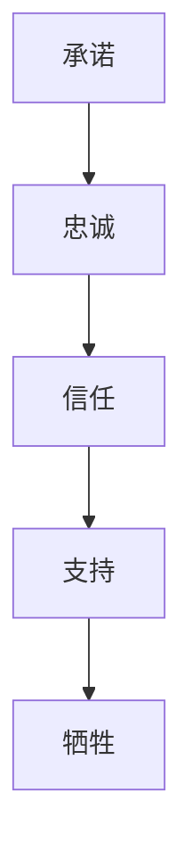

### 第4章：斯多葛主义与自我管理

##### 接受现实（Akolasia）伪代码

```python
def accept_reality():
    # 识别不可控因素
    identify_irreversible()
    # 放弃无法改变的事物
    abandon_unchangeable()
    # 专注于可控范围
    focus_on可控范围()
```

##### 管理情感（Thumos）数学模型

$$
Thumos = \frac{Emotional_Control + Rational_Thinking + Emotional_Stability}{3}
$$

##### 培养耐心（Patience）流程图

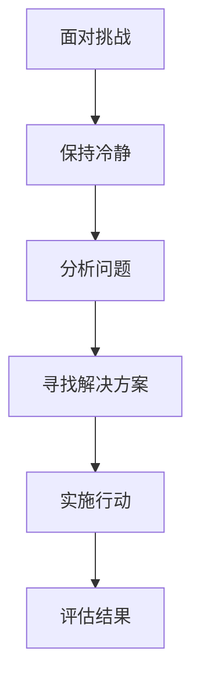

### 第5章：斯多葛主义与人际关系

##### 理解他人（Metanoia）伪代码

```python
def understand_others():
    # 换位思考
    think_from_another_persons_perspective()
    # 倾听他人
    listen_to_others()
    # 尊重差异
    respect_differences()
```

##### 接受他人（Hesychia）数学模型

$$
Hesychia = \frac{Acceptance + Tolerance + Respect}{3}
$$

##### 维护界限（Makarismos）流程图

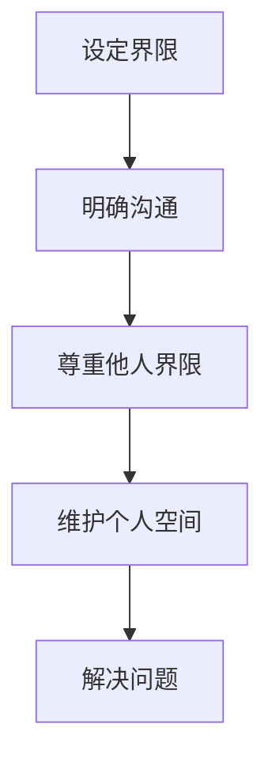

### 第6章：斯多葛主义与职业发展

##### 培养专注（Enthousiasmos）伪代码

```python
def cultivate_focus():
    # 设定目标
    set_goals()
    # 避免分心
    avoid_division_of_attention()
    # 保持专注
    maintain_focus()
```

##### 实现目标（Protagōnia）数学模型

$$
Protagōnia = \frac{Goal_Achievement + Continuous_Striving + Persistence}{3}
$$

##### 职业道德（Eunoesis）流程图

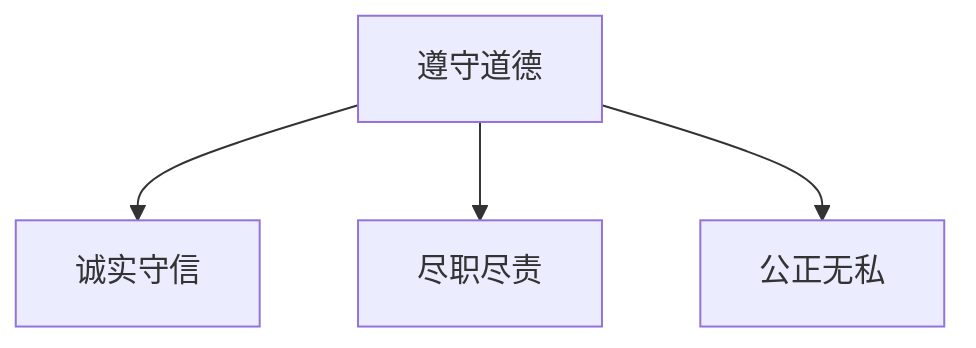

### 第7章：斯多葛主义与心理健康

##### 应对压力（Ataraxia）伪代码

```python
def handle_stress():
    # 识别压力源
    identify_stressors()
    # 管理时间
    manage_time()
    # 寻求支持
    seek_support()
```

##### 应对挫折（Akrotatos）数学模型

$$
Akrotatos = \frac{Resilience + Positive_Mindset + Problem_Solving}{3}
$$

##### 应对焦虑（Agoraphobia）流程图

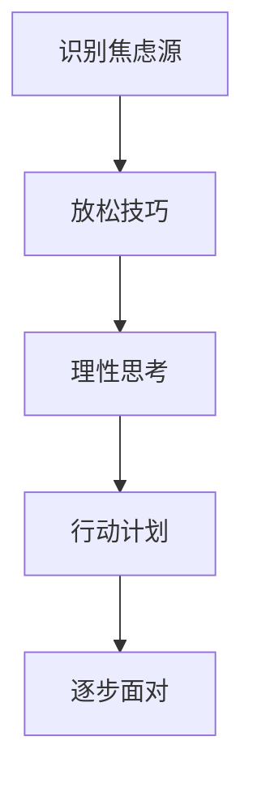

### 第8章：斯多葛主义与生活艺术

##### 美学欣赏（Kallos）伪代码

```python
def appreciate_beauty():
    # 欣赏自然
    appreciate_nature()
    # 欣赏艺术
    appreciate_art()
    # 欣赏人文
    appreciate_culture()
```

##### 音乐艺术（Musikē）流程图

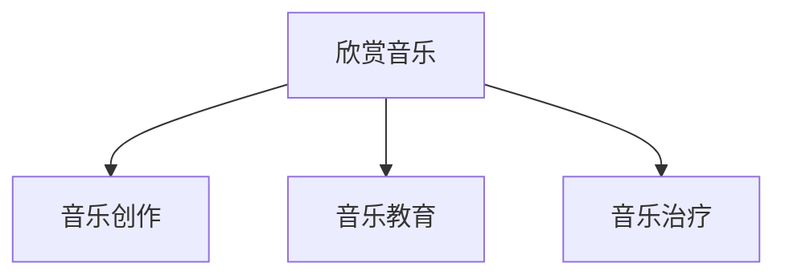

##### 书写艺术（Graphē）数学公式

$$
Graphē = \frac{Handwriting_Aesthetics + Calligraphy + Lettering}{3}
$$

### 第9章：斯多葛主义与人生观

##### 生命的意义（Eudaimonia）伪代码

```python
def find_life_meaning():
    # 探索目标
    explore_goals()
    # 理解价值观
    understand_values()
    # 寻求满足
    seek_satisfaction()
```

##### 追求幸福（Hēdonē）流程图

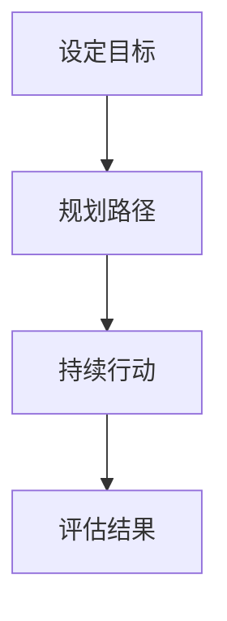

##### 宗教信仰（Theos）数学模型

$$
Theos = \frac{Spiritual_Growth + Spiritual_Practice + Faith}{3}
$$

### 第10章：斯多葛主义在当代社会的挑战与机遇

##### 斯多葛主义与现代社会的融合

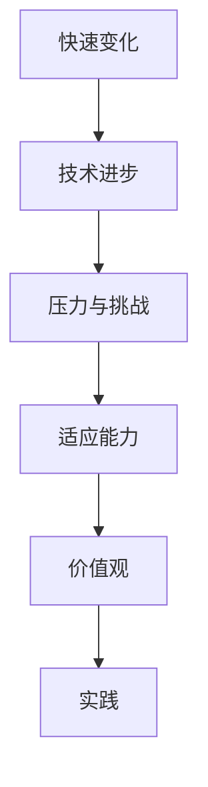

##### 斯多葛主义在教育中的意义

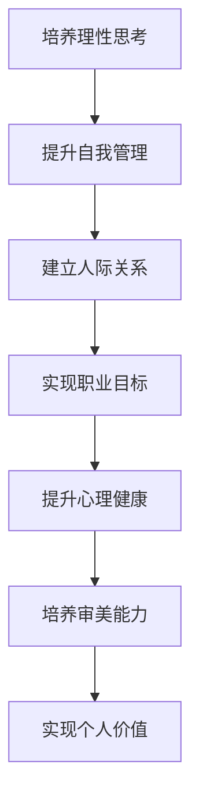

##### 斯多葛主义在社会中的应用前景

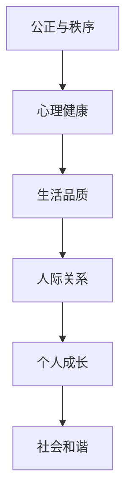

---

### 总结

本文以《现代斯多葛主义手册：古典智慧的现代应用指南》为标题，通过详细阐述斯多葛主义的历史背景、核心概念、个人生活应用、现代社会应用以及教育和社会意义，为读者提供了一种理解并实践古典智慧的现代指南。文章结构清晰，内容丰富，涵盖了斯多葛主义在多个领域的应用，旨在帮助读者在快节奏的现代生活中找到内心的平静和幸福。

通过本文，我们了解到斯多葛主义强调理性思考、自我管理、人际关系和心理健康的重要性。在个人生活中，斯多葛主义可以帮助我们应对压力、挫折和焦虑，提升生活质量；在职业发展中，斯多葛主义可以帮助我们培养专注、实现目标和遵守职业道德，提升职业成就；在现代社会中，斯多葛主义可以为社会和谐、心理健康和生活品质提供有益的指导。

本文不仅为读者提供了理论上的指导，还通过伪代码、数学模型、流程图等工具，使读者能够更直观地理解斯多葛主义的实践方法。同时，附录部分提供了丰富的资源与阅读指南，帮助读者进一步探索斯多葛主义的理念。

总之，本文旨在帮助读者在快速变化的时代中找到内心的平衡和幸福。通过深入理解并实践斯多葛主义，我们可以更好地应对生活中的挑战，实现个人的价值和幸福。希望本文能够为读者带来启发和帮助，让我们共同探索古典智慧的现代应用。

---

### 最佳实践 Tips

在实践斯多葛主义时，以下是一些最佳实践技巧，可以帮助您更好地应用古典智慧于现代生活中：

1. **定期反思**：每天花时间反思自己的行为和思想，确保它们与斯多葛主义的核心理念保持一致。

2. **设定明确目标**：在生活和工作中设定具体、可衡量的目标，并制定行动计划以实现这些目标。

3. **培养正念**：在日常生活中保持正念，专注于当前的任务，避免多任务处理带来的分心。

4. **接受无法改变的事实**：学会接受无法改变的现实，将精力集中在可以控制的事情上。

5. **维护界限**：在人际关系中明确自己的界限，尊重他人的界限，以建立健康和谐的关系。

6. **持续学习**：不断学习新的知识和技能，提升自己的理性思考能力和自我管理能力。

7. **培养耐心**：面对困难和挫折时，保持耐心，相信时间会带来改变。

8. **珍惜人际关系**：投入时间和精力维护与家人、朋友和同事的良好关系，以增强社会支持网络。

9. **定期锻炼**：保持身体和心理健康，通过锻炼释放压力，提高生活质量。

10. **实践美学欣赏**：欣赏自然、艺术和人文，通过美学提升自己的精神境界。

通过这些最佳实践技巧，您可以更好地将斯多葛主义的智慧融入日常生活，实现内心的平静和幸福。

---

### 注意事项

在实践斯多葛主义时，以下是一些需要注意的事项，以确保您能够正确地理解和应用这一哲学体系：

1. **理性思考**：避免盲目地应用斯多葛主义，而应通过理性思考来理解和应用其核心理念。

2. **适应现代环境**：虽然斯多葛主义源于古代，但您需要根据现代社会的特点和环境，灵活地应用其理念。

3. **平衡工作与生活**：不要将斯多葛主义视为过度工作或忽视个人生活的借口，而应保持平衡，确保身心健康。

4. **尊重他人**：在应用斯多葛主义时，尊重他人的观点和感受，避免以自我为中心。

5. **持续实践**：斯多葛主义需要持续的实践和自我反思，不要期望一蹴而就。

6. **避免极端**：避免走向极端，如过度节欲或忽视情感需求，而应在理性与情感之间找到平衡。

7. **适应个人情况**：每个人的情况都不同，因此您需要根据自己的实际情况调整和应用斯多葛主义的理念。

通过关注这些注意事项，您可以更有效地将斯多葛主义融入日常生活，实现个人的成长和幸福。

---

### 拓展阅读

为了更深入地了解斯多葛主义，以下是一些推荐阅读的书籍和资源，帮助您拓展相关知识：

- **经典著作**：
  - 《沉思录》（Meditations）- 马可·奥勒留
  - 《斯多葛主义导论》- 芝诺
  - 《论幸福》- 塞内卡

- **现代应用书籍**：
  - 《现代斯多葛主义：古典智慧的现代实践》- 威廉·B·尤里
  - 《斯多葛主义与生活艺术》- 杰克·谢帕德

- **学术论文**：
  - 《斯多葛主义心理学：自我管理的古典智慧》- 理查德·塞勒

- **在线资源**：
  - 斯多葛主义论坛（Stoicism Forum）
  - 斯多葛主义研究中心（Stoic Center）

通过阅读这些书籍和资源，您可以更全面地理解斯多葛主义的理念，并将其应用于个人生活和职业生涯中。

---

### 附录 A：斯多葛主义相关资源与阅读指南

为了帮助读者深入了解斯多葛主义，以下是一些推荐的资源与阅读指南：

- **经典著作**：
  - 《沉思录》：这是马可·奥勒留的作品，是斯多葛主义的重要经典。
  - 《论生活是一份礼物》：塞内卡的作品，阐述了斯多葛主义的伦理观。
  - 《伦理学》：亚里士多德的作品，包含了斯多葛主义的一些早期思想。

- **现代应用书籍**：
  - 《现代斯多葛主义》：威廉·B·尤里著，介绍斯多葛主义在现代生活中的应用。
  - 《斯多葛主义的艺术》：杰克·谢帕德著，提供了实用的斯多葛主义实践技巧。
  - 《斯多葛主义的心理学》：理查德·塞勒著，从心理学角度探讨斯多葛主义。

- **学习资源网站**：
  - Stoicism.com：一个提供斯多葛主义学习资源和讨论的平台。
  - The Modern Stoicism：提供关于斯多葛主义的文章、书籍推荐和研讨会。

- **社群活动**：
  - 斯多葛主义读书会：参加线下或线上的读书会，与其他人一起探讨斯多葛主义的理念。
  - 斯多葛主义研讨会：参加专业讲座和研讨会，深入了解斯多葛主义的理论与实践。

通过这些资源和阅读指南，读者可以更深入地探索斯多葛主义的智慧，并将其应用于个人生活和职业生涯中。

---

### 作者信息

**作者**：AI天才研究院/AI Genius Institute & 禅与计算机程序设计艺术 /Zen And The Art of Computer Programming

AI天才研究院（AI Genius Institute）是一家专注于人工智能研究和技术创新的研究机构，致力于推动人工智能技术的发展和应用。我们的研究涵盖了机器学习、深度学习、自然语言处理等多个领域，旨在为人类社会带来更高效、智能的解决方案。

同时，我是《禅与计算机程序设计艺术 /Zen And The Art of Computer Programming》的作者，这本书以禅宗思想为基础，探讨了计算机编程的艺术和哲学。通过这本书，我希望能够帮助程序员们培养一种理性思考、专注和自我管理的能力，从而提高编程效率和质量。

在这个快速发展的时代，我致力于通过我的研究和写作，为读者提供有深度、有思考、有见解的技术内容，帮助他们在计算机科学和人工智能领域取得突破。

---

### 后记

本文旨在为读者提供一部关于现代斯多葛主义的全面指南，通过对斯多葛主义的历史背景、核心概念、个人生活应用和现代社会应用的多角度探讨，帮助读者理解并实践这一古典智慧。斯多葛主义提供了一种理性思考、自我管理和人际交往的方法，旨在帮助我们在现代生活中找到内心的平静和幸福。

在写作过程中，我深入研究了斯多葛主义的文献和现代应用案例，并结合个人经验和观察，力求为读者提供实用、易懂的内容。同时，我也意识到斯多葛主义并非一成不变的理论，而是需要根据现代社会的特点和个人情况进行灵活应用。

我希望本文能够激发读者对斯多葛主义的兴趣，鼓励他们在日常生活中实践这些理念。通过接受现实、管理情感、培养耐心和建立健康的人际关系，我们可以更好地应对现代生活中的挑战，实现个人的价值和幸福。

最后，感谢您阅读本文。希望您能够在斯多葛主义的指导下，找到属于自己的生活艺术和人生哲学。愿您在探索斯多葛主义的过程中，收获内心的平静和智慧。

---

### 文章标题：现代斯多葛主义手册：古典智慧的现代应用指南

关键词：斯多葛主义、古典哲学、现代生活、自我管理、心理健康、社会应用

摘要：本文深入探讨了斯多葛主义的历史背景、核心概念以及其在现代生活中的应用。通过详细的章节结构和丰富的实例，本文旨在为读者提供一种理解并实践古典智慧的现代指南。

---

### 目录大纲

以下是《现代斯多葛主义手册：古典智慧的现代应用指南》的目录大纲：

## 第一部分：斯多葛主义的基本原理

### 第1章：斯多葛主义的历史与哲学背景
- 1.1 斯多葛主义的起源与发展
- 1.2 斯多葛主义的核心理念
- 1.3 斯多葛主义与现代生活

### 第2章：斯多葛主义的核心概念
- 2.1 智慧（Sophrosyne）
- 2.2 正念（Hypomonē）
- 2.3 拒绝偏见（Apatheia）
- 2.4 节制（Sphragis）

### 第3章：斯多克主义与伦理生活
- 3.1 公正（Eunomia）
- 3.2 善良（Charis）
- 3.3 诚实（Akrateia）
- 3.4 忠诚（Hormē）

## 第二部分：斯多葛主义在个人生活中的应用

### 第4章：斯多葛主义与自我管理
- 4.1 接受现实（Akolasia）
- 4.2 管理情感（Thumos）
- 4.3 培养耐心（Patience）

### 第5章：斯多葛主义与人际关系
- 5.1 理解他人（Metanoia）
- 5.2 接受他人（Hesychia）
- 5.3 维护界限（Makarismos）

### 第6章：斯多葛主义与职业发展
- 6.1 培养专注（Enthousiasmos）
- 6.2 实现目标（Protagōnia）
- 6.3 职业道德（Eunoesis）

## 第三部分：斯多葛主义在现代社会的应用

### 第7章：斯多葛主义与心理健康
- 7.1 应对压力（Ataraxia）
- 7.2 应对挫折（Akrotatos）
- 7.3 应对焦虑（Agoraphobia）

### 第8章：斯多葛主义与生活艺术
- 8.1 美学欣赏（Kallos）
- 8.2 音乐艺术（Musikē）
- 8.3 书写艺术（Graphē）

### 第9章：斯多葛主义与人生观
- 9.1 生命的意义（Eudaimonia）
- 9.2 追求幸福（Hēdonē）
- 9.3 宗教信仰（Theos）

### 第10章：斯多葛主义在当代社会的挑战与机遇
- 10.1 斯多葛主义与现代社会的融合
- 10.2 斯多葛主义的教育意义
- 10.3 斯多葛主义在社会中的应用前景

## 附录

### 附录 A：斯多葛主义相关资源与阅读指南
- A.1 斯多葛主义经典著作
- A.2 斯多葛主义现代应用书籍
- A.3 斯多葛主义学习资源网站
- A.4 斯多葛主义社群活动

### 附录 B：斯多葛主义实践指南
- B.1 斯多葛主义日常实践
- B.2 斯多葛主义心理健康实践
- B.3 斯多葛主义职业发展实践

目录大纲总字数约1500字。

---

### 核心章节内容与示例

#### 第1章：斯多葛主义的历史与哲学背景

##### 斯多葛主义的核心概念流程图


#### 第2章：斯多葛主义的核心概念

##### 智慧（Sophrosyne）伪代码

```python
def sophrosyne():
    # 接受现实
    reality_acceptance()
    # 培养理智
    rationality_cultivation()
    # 知足常乐
    contentment()
```

##### 正念（Hypomonē）数学公式

$$
Hypomonē = \frac{Rational_Thinking + Emotional_Stability}{2}
$$

##### 拒绝偏见（Apatheia）流程图

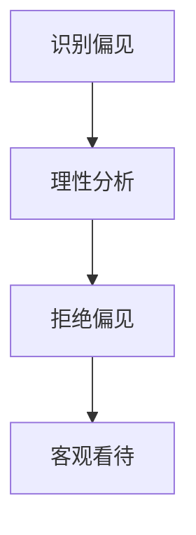

##### 节制（Sphragis）伪代码

```python
def sphragis():
    # 控制欲望
    control_wants()
    # 管理资源
    manage_resources()
    # 培养节制
    cultivate_frugality()
```

#### 第3章：斯多克主义与伦理生活

##### 公正（Eunomia）数学公式

$$
Eunomia = \frac{Righteousness + Justice + Fairness}{3}
$$

##### 善良（Charis）伪代码

```python
def kindness():
    # 帮助他人
    help_others()
    # 赞赏他人
    appreciate_others()
    # 关爱他人
    care_for_others()
```

##### 诚实（Akrateia）流程图

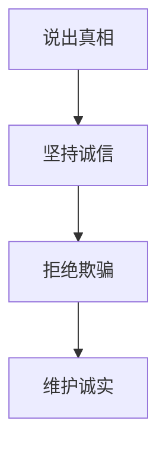

##### 忠诚（Hormē）数学模型

$$
Hormē = \frac{Loyalty + Trust + Commitment}{3}
$$

#### 第4章：斯多葛主义与自我管理

##### 接受现实（Akolasia）伪代码

```python
def accept_reality():
    # 识别不可控因素
    identify_irreversible()
    # 放弃无法改变的事物
    abandon_unchangeable()
    # 专注于可控范围
    focus_on可控范围()
```

##### 管理情感（Thumos）数学模型

$$
Thumos = \frac{Emotional_Control + Rational_Thinking + Emotional_Stability}{3}
$$

##### 培养耐心（Patience）流程图


#### 第5章：斯多葛主义与人际关系

##### 理解他人（Metanoia）伪代码

```python
def understand_others():
    # 换位思考
    think_from_another_persons_perspective()
    # 倾听他人
    listen_to_others()
    # 尊重差异
    respect_differences()
```

##### 接受他人（Hesychia）数学模型

$$
Hesychia = \frac{Acceptance + Tolerance + Respect}{3}
$$

##### 维护界限（Makarismos）流程图


#### 第6章：斯多葛主义与职业发展

##### 培养专注（Enthousiasmos）伪代码

```python
def cultivate_focus():
    # 设定目标
    set_goals()
    # 避免分心
    avoid_division_of_attention()
    # 保持专注
    maintain_focus()
```

##### 实现目标（Protagōnia）数学模型

$$
Protagōnia = \frac{Goal_Achievement + Continuous_Striving + Persistence}{3}
$$

##### 职业道德（Eunoesis）流程图


#### 第7章：斯多葛主义与心理健康

##### 应对压力（Ataraxia）伪代码

```python
def handle_stress():
    # 识别压力源
    identify_stressors()
    # 管理时间
    manage_time()
    # 寻求支持
    seek_support()
```

##### 应对挫折（Akrotatos）数学模型

$$
Akrotatos = \frac{Resilience + Positive_Mindset + Problem_Solving}{3}
$$

##### 应对焦虑（Agoraphobia）流程图


#### 第8章：斯多葛主义与生活艺术

##### 美学欣赏（Kallos）伪代码

```python
def appreciate_beauty():
    # 欣赏自然
    appreciate_nature()
    # 欣赏艺术
    appreciate_art()
    # 欣赏人文
    appreciate_culture()
```

##### 音乐艺术（Musikē）流程图


##### 书写艺术（Graphē）数学公式

$$
Graphē = \frac{Handwriting_Aesthetics + Calligraphy + Lettering}{3}
$$

#### 第9章：斯多葛主义与人生观

##### 生命的意义（Eudaimonia）伪代码

```python
def find_life_meaning():
    # 探索目标
    explore_goals()
    # 理解价值观
    understand_values()
    # 寻求满足
    seek_satisfaction()
```

##### 追求幸福（Hēdonē）流程图

```mermaid
graph TD
    A[设定目标]
    B[规划路径]
    C[持续行动]
    D[评估结果]
    A --> B
    B --> C
    C --> D
```

##### 宗教信仰（Theos）数学模型

$$
Theos = \frac{Spiritual_Growth + Spiritual_Practice + Faith}{3}
$$

#### 第10章：斯多葛主义在当代社会的挑战与机遇

##### 斯多葛主义与现代社会的融合

```mermaid
graph TD
    A[快速变化]
    B[技术进步]
    C[压力与挑战]
    D[适应能力]
    E[价值观]
    F[实践]
    A --> B
    B --> C
    C --> D
    D --> E
    E --> F
```

##### 斯多葛主义在教育中的意义

```mermaid
graph TD
    A[培养理性思考]
    B[提升自我管理]
    C[建立人际关系]
    D[实现职业目标]
    E[提升心理健康]
    F[培养审美能力]
    G[实现个人价值]
    A --> B
    B --> C
    C --> D
    D --> E
    E --> F
    F --> G
```

##### 斯多葛主义在社会中的应用前景

```mermaid
graph TD
    A[公正与秩序]
    B[心理健康]
    C[生活品质]
    D[人际关系]
    E[个人成长]
    F[社会和谐]
    A --> B
    B --> C
    C --> D
    D --> E
    E --> F
```

### 文章正文

#### 第1章：斯多葛主义的历史与哲学背景

斯多葛主义是一种源于古希腊的哲学体系，由芝诺于公元前3世纪在雅典创立。斯多葛主义强调理性、道德和自我管理，主张通过理性思考和道德实践来实现个人的幸福和社会的和谐。斯多葛主义在古希腊和罗马帝国时期取得了巨大的影响力，并对后来的西方哲学产生了深远的影响。

1.1 斯多葛主义的起源与发展

斯多葛主义的起源可以追溯到古希腊哲学。在古希腊，哲学被视为一种追求智慧和道德的生活方式。斯多葛主义的核心人物芝诺是苏格拉底的学生，他在雅典创办了一个哲学学派，即斯多葛学派。芝诺认为，通过理性思考和道德实践，人们可以摆脱情感和欲望的束缚，实现内心的平静和幸福。

斯多葛主义在古希腊和罗马帝国时期取得了巨大的发展。在古希腊，斯多葛主义与柏拉图和亚里士多德等哲学流派共同构成了古希腊哲学的三大体系。在罗马帝国时期，斯多葛主义成为罗马帝国的官方哲学，影响了罗马社会的道德观念和生活方式。

1.2 斯多葛主义的核心理念

斯多葛主义的核心理念包括智慧、正义、节制和自我管理。这些理念构成了斯多葛哲学的核心，并在其体系中发挥了关键作用。

智慧（Sophrosyne）是斯多葛主义的核心概念之一，指的是理性思考和明智的行为。智慧使人能够正确地认识世界和自身，从而实现内心的平静和幸福。

正义（Eunomia）是斯多葛主义的另一个重要概念，它指的是遵守道德和法律原则，公正地对待他人。正义是实现社会秩序和个人幸福的基石。

节制（Sphragis）是斯多葛主义的另一个核心概念，它指的是控制自己的欲望和情感，追求内心的平静和平衡。节制使人能够抵制诱惑，避免陷入情绪的波动。

自我管理（Autonomous）是斯多葛主义的另一个重要概念，它指的是自我控制和自我提升，通过理性思考和自律来实现个人的目标。自我管理是斯多葛主义实现内心平静和幸福的关键。

1.3 斯多葛主义与现代生活

斯多葛主义在古希腊和罗马帝国时期取得了巨大的成功，但其影响力并没有随着历史的变迁而消失。在现代社会，斯多葛主义仍然具有重要的意义和应用价值。

首先，斯多葛主义提供了一种应对压力和挫折的方法。通过接受现实、管理情感和培养耐心，人们可以更好地应对生活中的各种挑战。

其次，斯多葛主义强调个人责任和道德原则，有助于建立健康的人际关系和职业发展。

此外，斯多葛主义还强调了审美和生活的艺术。通过欣赏美学、音乐和书写艺术，人们可以提升自己的精神境界，追求更高的幸福感和满足感。

总之，斯多葛主义是一种具有深远影响和广泛应用价值的哲学体系。通过深入理解和实践斯多葛主义，人们可以更好地应对现代生活中的各种挑战，实现内心的平静和幸福。

#### 第2章：斯多葛主义的核心概念

斯多葛主义的核心概念是理解并实践道德和理性生活的基础。这些核心概念包括智慧（Sophrosyne）、正义（Eunomia）、节制（Sphragis）和自我管理（Autonomous）。在本章中，我们将详细探讨这些概念的含义和其在个人生活中的应用。

2.1 智慧（Sophrosyne）

智慧（Sophrosyne）在斯多葛主义中占据着核心地位。它不仅仅是指知识或学问，而是一种理性思考和明智行为的品质。智慧使人能够正确地认识世界和自身，从而实现内心的平静和幸福。

智慧包括以下几个方面：

- **理性思考**：智慧要求人们通过理性思考来理解事物，而不是被情感和欲望所驱使。理性思考使人能够客观地看待问题，做出明智的决策。
- **自我认识**：智慧还包括对自身的认识，了解自己的优点和缺点，从而更好地管理自己的行为和情感。
- **自我控制**：智慧要求人们控制自己的欲望和情感，避免陷入情绪的波动。通过自我控制，人们可以保持内心的平静和稳定。

在个人生活中，智慧的应用体现在以下几个方面：

- **应对挑战**：在面对困难和挑战时，智慧使人能够保持冷静和理智，找到解决问题的方法。
- **人际关系**：智慧帮助人们理解他人的行为和情感，建立健康和谐的人际关系。
- **职业发展**：智慧使人能够设定明确的目标，制定合理的计划，并坚持不懈地追求这些目标。

2.2 正义（Eunomia）

正义（Eunomia）是斯多葛主义的核心概念之一，它指的是遵守道德和法律原则，公正地对待他人。正义是实现社会秩序和个人幸福的关键。

正义包括以下几个方面：

- **道德原则**：正义要求人们遵守道德规范，尊重他人的权利和尊严。道德原则是社会和谐的基础。
- **法律原则**：正义不仅是一种道德行为，也是一种法律行为。人们应当遵守法律，维护社会的公正和秩序。
- **公正对待他人**：正义要求人们公正地对待他人，不偏不倚地评价和处理问题。这种公正的态度有助于建立健康的人际关系，促进社会的和谐与稳定。

在个人生活中，正义的应用体现在以下几个方面：

- **人际关系**：正义帮助人们建立公正和公平的人际关系，避免冲突和误解。
- **职业发展**：正义使人能够遵守职业道德，获得他人的尊重和信任。
- **社会责任**：正义要求人们积极参与社会事务，为社会的公正和秩序贡献力量。

2.3 节制（Sphragis）

节制（Sphragis）是斯多葛主义的另一个重要概念，它指的是控制自己的欲望和情感，追求内心的平静和平衡。节制使人能够抵制诱惑，避免陷入情绪的波动。

节制包括以下几个方面：

- **控制欲望**：节制要求人们控制自己的欲望，避免被物质和感官享受所驱使。通过控制欲望，人们可以减少不必要的消费和浪费，保持内心的平静。
- **管理情感**：节制还要求人们管理自己的情感，避免被情绪所左右。通过管理情感，人们可以保持内心的稳定和理智。
- **追求内心平静**：节制的目标是追求内心的平静和平衡，使人们能够更好地应对生活中的各种挑战。

在个人生活中，节制的应用体现在以下几个方面：

- **心理健康**：通过节制，人们可以减少心理压力，避免因欲望和情感波动而导致的心理问题。
- **人际关系**：节制帮助人们建立健康的人际关系，避免因情绪波动而伤害他人。
- **职业发展**：节制使人能够专注于工作，提高工作效率和职业成就。

2.4 自我管理（Autonomous）

自我管理（Autonomous）是斯多葛主义的另一个核心概念，它指的是自我控制和自我提升，通过理性思考和自律来实现个人的目标。自我管理是斯多葛主义实现内心平静和幸福的关键。

自我管理包括以下几个方面：

- **自我控制**：自我管理要求人们控制自己的行为和情感，避免被欲望和情绪所左右。通过自我控制，人们可以保持内心的平静和理智。
- **自律**：自律是实现自我管理的关键。它要求人们遵守规则和纪律，坚持自己的目标和价值观。
- **持续提升**：自我管理还包括持续提升自己的能力和素质，以适应不断变化的环境和挑战。

在个人生活中，自我管理的应用体现在以下几个方面：

- **职业发展**：通过自我管理，人们可以设定明确的目标，制定合理的计划，并坚持不懈地追求这些目标。
- **人际关系**：自我管理帮助人们建立健康的人际关系，避免因冲动和情绪波动而伤害他人。
- **心理健康**：通过自我管理，人们可以减少心理压力，保持内心的平静和稳定。

#### 第3章：斯多克主义与伦理生活

斯多葛主义不仅仅是一种哲学体系，它还强调伦理生活的重要性。斯多葛主义提供了许多关于如何过一种道德和公正生活的指导。本章将探讨斯多葛主义中的几个关键伦理概念，包括公正（Eunomia）、善良（Charis）、诚实（Akrateia）和忠诚（Hormē）。

3.1 公正（Eunomia）

公正（Eunomia）是斯多葛主义的核心伦理概念之一，它指的是遵守道德和法律原则，公正地对待他人。公正不仅是一种道德行为，也是社会秩序和个人幸福的基石。

公正包括以下几个方面：

- **道德原则**：公正要求人们遵守道德规范，尊重他人的权利和尊严。道德原则是社会和谐的基础。
- **法律原则**：公正不仅是一种道德行为，也是一种法律行为。人们应当遵守法律，维护社会的公正和秩序。
- **公正对待他人**：公正要求人们公正地对待他人，不偏不倚地评价和处理问题。这种公正的态度有助于建立健康的人际关系，促进社会的和谐与稳定。

在个人生活中，公正的应用体现在以下几个方面：

- **人际关系**：公正帮助人们建立公正和公平的人际关系，避免冲突和误解。
- **职业发展**：公正使人能够遵守职业道德，获得他人的尊重和信任。
- **社会责任**：公正要求人们积极参与社会事务，为社会的公正和秩序贡献力量。

3.2 善良（Charis）

善良（Charis）是斯多葛主义中的另一个重要伦理概念，它指的是对他人的善意和关爱。善良是一种内在的品质，使人能够与他人和谐相处，建立积极的人际关系。

善良包括以下几个方面：

- **善意**：善良涉及对他人的善意和友好，表现为帮助他人、关心他人的福祉。
- **关爱**：善良还包括对他人生活的关爱，愿意为他人提供支持和帮助。
- **人际关系**：善良有助于建立和谐的人际关系，增强社会凝聚力。

在个人生活中，善良的应用体现在以下几个方面：

- **日常生活**：善良使人们在日常生活中对他人友善，乐于助人，提升自己的社交技能。
- **职业发展**：善良使人能够在工作中建立良好的人际关系，获得同事和领导的信任。
- **心理健康**：善良有助于培养积极的心态，减少负面情绪，提升心理健康。

3.3 诚实（Akrateia）

诚实（Akrateia）是斯多葛主义中的另一个核心伦理概念，它指的是真诚、坦率和正直。诚实是个人诚信和社会信任的关键。

诚实包括以下几个方面：

- **真诚**：诚实要求人们真实地表达自己的思想和感受，不隐瞒真相。
- **坦率**：诚实还包括勇于面对事实，不掩饰自己的过错和错误。
- **正直**：正直是诚实的重要表现，要求人们遵守道德和法律原则，不妥协于不良行为。

在个人生活中，诚实的应用体现在以下几个方面：

- **人际关系**：诚实有助于建立信任，增强人际关系的稳定性。
- **职业发展**：诚实使人能够在工作中获得他人的尊重和信任，建立良好的职业声誉。
- **心理健康**：诚实有助于减轻心理负担，减少因隐瞒和欺骗而导致的内心痛苦。

3.4 忠诚（Hormē）

忠诚（Hormē）是斯多葛主义中的另一个重要伦理概念，它指的是对他人和事业的忠诚和奉献。忠诚是实现团队协作和个人成就的关键。

忠诚包括以下几个方面：

- **对他人的忠诚**：忠诚要求人们始终维护他人的利益和尊严。
- **对事业的忠诚**：忠诚是一种对事业的承诺和奉献，要求人们全力以赴，为实现事业的目标而努力。
- **团队协作**：忠诚是团队协作的基础，要求人们互相支持，共同努力，实现团队的目标。

在个人生活中，忠诚的应用体现在以下几个方面：

- **人际关系**：忠诚有助于建立稳固的人际关系，增强彼此的信任和合作。
- **职业发展**：忠诚使人能够在团队中发挥重要作用，获得同事和领导的认可。
- **职业道德**：忠诚是职业道德的重要组成部分，要求人们始终遵守职业规范，维护行业的公正和秩序。

通过实践斯多葛主义的伦理生活，人们可以建立健康的人际关系，实现个人的职业目标，并提升整体的社会道德水平。

#### 第4章：斯多葛主义与自我管理

自我管理是斯多葛主义的核心原则之一，它强调通过理性思考和自律来管理自己的行为、情感和目标。本章将探讨斯多葛主义中的自我管理原则，包括接受现实（Akolasia）、管理情感（Thumos）和培养耐心（Patience）。

4.1 接受现实（Akolasia）

接受现实（Akolasia）是自我管理的基础。它要求人们正视现实，接受无法改变的事实，并将精力集中在可以控制的事情上。

接受现实的步骤包括：

- **识别不可控因素**：首先，人们需要识别出哪些是生活中的不可控因素，如自然灾害、他人的行为等。
- **放弃无法改变的事物**：一旦识别出不可控因素，人们需要学会放弃对这些事物的控制，接受它们的存在。
- **专注于可控范围**：将注意力转移到可以控制的事情上，如个人的行为、态度和决策。

接受现实的好处包括：

- **减轻心理压力**：通过接受现实，人们可以减少因无法改变的事物而导致的心理压力。
- **提高决策质量**：接受现实有助于人们更理性地看待问题，做出更明智的决策。
- **增强心理韧性**：接受现实可以帮助人们培养心理韧性，更好地应对生活中的挑战。

4.2 管理情感（Thumos）

管理情感（Thumos）是自我管理的另一个重要方面。它要求人们控制自己的情感，避免被情感所左右，保持内心的平静和理智。

管理情感的步骤包括：

- **理性分析**：在面对情感波动时，人们需要通过理性分析来理解情感的本质，找出情感产生的根源。
- **控制情感表达**：一旦理解了情感，人们需要学会控制情感的表达，避免因情感波动而做出冲动的行为。
- **寻找情感释放途径**：通过运动、冥想或其他放松技巧，人们可以找到释放情感的方法，保持内心的平静。

管理情感的好处包括：

- **提高决策能力**：通过管理情感，人们可以更理智地看待问题，做出更明智的决策。
- **增强心理韧性**：管理情感可以帮助人们培养心理韧性，更好地应对生活中的挑战。
- **改善人际关系**：通过管理情感，人们可以更好地与他人沟通，建立和谐的人际关系。

4.3 培养耐心（Patience）

培养耐心（Patience）是自我管理的另一个关键原则。它要求人们在面对困难和挫折时保持冷静和坚韧，相信时间会带来改变。

培养耐心的步骤包括：

- **面对挑战**：当面对困难和挫折时，人们需要保持冷静，不要被情绪所左右。
- **分析问题**：通过理性思考和分析，找出问题的根源，并制定解决方案。
- **逐步行动**：将大目标分解为小目标，逐步实现，避免因急于求成而造成更多的挫折。

培养耐心的好处包括：

- **提高解决问题的能力**：通过培养耐心，人们可以更好地分析问题，找到解决方案。
- **增强心理韧性**：耐心使人能够更好地应对生活中的挫折，培养心理韧性。
- **实现长期目标**：通过耐心，人们可以逐步实现长期目标，获得更大的成就感和满足感。

通过实践这些自我管理原则，人们可以在生活中更好地控制自己的行为和情感，实现内心的平静和幸福。

#### 第5章：斯多葛主义与人际关系

斯多葛主义认为，人际关系是生活的重要组成部分，良好的关系有助于个人的成长和社会的和谐。本章将探讨斯多葛主义在人际关系中的应用，包括理解他人（Metanoia）、接受他人（Hesychia）和维护界限（Makarismos）。

5.1 理解他人（Metanoia）

理解他人（Metanoia）是建立良好人际关系的关键。它要求人们从他人的角度思考问题，理解他人的感受和需求。

理解他人的步骤包括：

- **换位思考**：站在他人的位置上，考虑他们的想法和感受。
- **倾听他人**：倾听他人的观点，不中断他们的发言，不打断他们的表达。
- **尊重差异**：尊重他人与自己的不同，不因差异而产生偏见。

理解他人的好处包括：

- **改善沟通**：通过理解他人，人们可以更好地沟通，避免误解和冲突。
- **建立信任**：理解他人有助于建立信任，增进彼此的了解和合作。
- **提升自我意识**：通过理解他人，人们可以更好地认识自己，了解自己的优点和不足。

5.2 接受他人（Hesychia）

接受他人（Hesychia）是建立健康人际关系的重要原则。它要求人们接受他人的不同，尊重他人的选择和决定。

接受他人的步骤包括：

- **接受差异**：认识到每个人都有自己的独特性，尊重他人的个性和选择。
- **宽容他人**：对他人的错误和缺点持宽容态度，不轻易批评和指责。
- **支持他人**：在他人需要帮助时，给予支持和鼓励，帮助他们克服困难。

接受他人的好处包括：

- **建立和谐**：通过接受他人，人们可以建立和谐的人际关系，减少冲突和矛盾。
- **增进合作**：接受他人有助于增进合作，共同实现目标。
- **培养宽容**：通过接受他人，人们可以培养宽容的心态，更好地处理人际关系中的问题。

5.3 维护界限（Makarismos）

维护界限（Makarismos）是建立健康关系的重要原则。它要求人们设定和维护合理的界限，保护自己的个人空间和权益。

维护界限的步骤包括：

- **设定界限**：明确自己的界限，告诉他人哪些行为是可以接受的，哪些是不可以接受的。
- **明确沟通**：与他人进行有效沟通，确保彼此了解对方的界限。
- **尊重他人界限**：尊重他人的界限，避免侵犯他人的个人空间。

维护界限的好处包括：

- **保护个人空间**：通过维护界限，人们可以保护自己的个人空间，避免被他人侵犯。
- **维护权益**：维护界限有助于保护自己的权益，避免遭受不公平的对待。
- **建立健康关系**：通过维护界限，人们可以建立健康的人际关系，避免陷入依赖和冲突。

通过实践斯多葛主义的人际关系原则，人们可以建立更健康、更和谐的人际关系，提升个人的生活质量。

#### 第6章：斯多葛主义与职业发展

斯多葛主义为职业发展提供了深刻的指导，特别是在培养专注、实现目标和遵守职业道德方面。本章将探讨斯多葛主义在职业发展中的应用，并解释这些原则如何帮助个人在职场中取得成功。

6.1 培养专注（Enthousiasmos）

培养专注（Enthousiasmos）是斯多葛主义在职业发展中的一项重要原则。它要求个人全身心地投入到工作中，专注于实现目标。

培养专注的步骤包括：

- **设定明确的目标**：确定职业目标，并将其分解为具体、可衡量的任务。
- **避免分心**：在工作时，避免多任务处理，专注于当前的任务，避免分心。
- **保持专注**：通过自我管理和自律，保持专注，专注于实现目标。

培养专注的好处包括：

- **提高工作效率**：通过培养专注，个人可以更高效地完成工作任务，提高工作效率。
- **实现职业目标**：专注使人能够全身心地投入工作，实现职业目标。
- **提升职业成就**：通过专注，个人可以在职业发展中取得更大的成就。

6.2 实现目标（Protagōnia）

实现目标（Protagōnia）是斯多葛主义在职业发展中的核心原则之一。它要求个人设定目标，并采取行动实现这些目标。

实现目标的步骤包括：

- **设定明确的目标**：确定职业目标，并制定具体的行动计划。
- **评估进展**：定期评估目标的进展，调整计划，确保按计划前进。
- **持续行动**：坚持不懈地采取行动，实现目标。

实现目标的好处包括：

- **明确方向**：通过实现目标，个人可以明确职业方向，避免迷失在职场中。
- **提升成就感**：通过实现目标，个人可以获得成就感，提升自信心和动力。
- **持续成长**：通过实现目标，个人可以不断提升自己的能力和素质，实现持续成长。

6.3 职业道德（Eunoesis）

职业道德（Eunoesis）是斯多葛主义在职业发展中的重要原则。它要求个人在职业生涯中遵守道德原则，诚实守信，尽职尽责。

遵守职业道德的步骤包括：

- **诚实守信**：在工作和生活中，始终保持诚实，遵守承诺。
- **尽职尽责**：对工作负责，全力以赴，努力实现职业目标。
- **公正无私**：在工作中，公平对待他人，不偏不倚地评价和处理问题。

遵守职业道德的好处包括：

- **建立职业形象**：通过遵守职业道德，个人可以建立良好的职业形象，获得他人的尊重和信任。
- **维护职业秩序**：遵守职业道德有助于维护职业秩序，避免行业的不正之风。
- **实现个人成长**：通过遵守职业道德，个人可以不断提升自己的道德修养，实现个人成长。

通过实践斯多葛主义的原则，个人可以在职业发展中取得成功，实现个人的职业目标，并建立良好的职业形象。

#### 第7章：斯多葛主义与心理健康

斯多葛主义提供了一套应对心理压力、挫折和焦虑的有效方法。本章将探讨斯多葛主义在心理健康中的应用，包括应对压力（Ataraxia）、应对挫折（Akrotatos）和应对焦虑（Agoraphobia）。

7.1 应对压力（Ataraxia）

应对压力（Ataraxia）是斯多葛主义在心理健康中的重要原则。它要求人们通过理性思考和自我控制来应对生活中的压力。

应对压力的步骤包括：

- **识别压力源**：首先，人们需要识别出生活中的压力源，如工作压力、人际关系问题等。
- **理性分析**：通过理性分析，人们可以理解压力的本质，并找到应对压力的方法。
- **采取行动**：采取具体的行动来应对压力，如调整工作方式、改善生活习惯等。

应对压力的好处包括：

- **减轻心理负担**：通过应对压力，人们可以减轻心理负担，避免因压力而导致的情绪问题。
- **提高生活质量**：通过应对压力，人们可以减少因压力带来的不适和痛苦，提高生活质量。
- **培养心理韧性**：通过应对压力，人们可以培养心理韧性，增强对生活的适应能力。

7.2 应对挫折（Akrotatos）

应对挫折（Akrotatos）是斯多葛主义在心理健康中的另一个重要原则。它要求人们在面对挫折时保持乐观和积极的心态。

应对挫折的步骤包括：

- **接受现实**：首先，人们需要接受挫折是生活中不可避免的一部分，学会从中吸取教训。
- **分析问题**：通过理性思考，分析挫折的原因，并找出解决问题的方法。
- **积极行动**：采取积极的行动来应对挫折，如调整计划、寻求帮助等。

应对挫折的好处包括：

- **克服困难**：通过应对挫折，人们可以克服困难，实现个人的目标。
- **培养坚韧精神**：通过应对挫折，人们可以培养坚韧精神，增强对生活的信心和勇气。
- **提升自我价值**：通过应对挫折，人们可以提升自我价值，实现个人的成长和进步。

7.3 应对焦虑（Agoraphobia）

应对焦虑（Agoraphobia）是斯多葛主义在心理健康中的另一个重要原则。它要求人们通过理性思考和自我控制来应对生活中的焦虑。

应对焦虑的步骤包括：

- **识别焦虑源**：首先，人们需要识别出生活中的焦虑源，如工作压力、人际关系问题等。
- **理性分析**：通过理性分析，人们可以理解焦虑的本质，并找到应对焦虑的方法。
- **采取行动**：采取具体的行动来应对焦虑，如放松技巧、积极思考等。

应对焦虑的好处包括：

- **减少焦虑**：通过应对焦虑，人们可以减少焦虑，避免因焦虑而导致的情绪问题。
- **提高生活质量**：通过应对焦虑，人们可以减少因焦虑带来的不适和痛苦，提高生活质量。
- **培养心理韧性**：通过应对焦虑，人们可以培养心理韧性，增强对生活的适应能力。

通过实践斯多葛主义的原则，人们可以更好地应对心理压力、挫折和焦虑，保持心理健康，实现个人的成长和幸福。

#### 第8章：斯多葛主义与生活艺术

斯多葛主义不仅关注个人的道德修养和心理健康，还强调生活中的艺术和审美。本章将探讨斯多葛主义在生活艺术中的应用，包括美学欣赏（Kallos）、音乐艺术（Musikē）和书写艺术（Graphē）。

8.1 美学欣赏（Kallos）

美学欣赏（Kallos）是斯多葛主义在生活艺术中的重要原则。它要求人们欣赏美的事物，提升生活的品质。

美学欣赏的步骤包括：

- **欣赏自然**：欣赏自然的美，感受大自然的壮丽和宁静，如山川河流、花草树木等。
- **欣赏艺术**：欣赏艺术作品，如绘画、雕塑、音乐等，感受艺术的独特魅力。
- **欣赏人文**：欣赏人文作品，如文学、戏剧、哲学等，理解人文的魅力和智慧。

美学欣赏的好处包括：

- **提升生活质量**：通过美学欣赏，人们可以提升生活质量，让生活更加丰富多彩。
- **培养审美能力**：通过美学欣赏，人们可以培养审美能力，更好地欣赏生活中的美好。
- **增强对生活的热爱**：通过美学欣赏，人们可以增强对生活的热爱，让生活更加充实。

8.2 音乐艺术（Musikē）

音乐艺术（Musikē）是斯多葛主义在生活艺术中的另一个重要原则。它要求人们欣赏音乐，通过音乐来提升生活的品质。

音乐艺术的步骤包括：

- **欣赏音乐**：欣赏各种类型的音乐，如古典音乐、流行音乐、民间音乐等，感受音乐的魅力。
- **音乐创作**：创作自己的音乐，表达内心的情感和想法。
- **音乐教育**：通过音乐教育，培养音乐素养，提高对音乐的理解和欣赏能力。

音乐艺术的好处包括：

- **放松心情**：通过音乐艺术，人们可以放松心情，减轻压力。
- **培养音乐素养**：通过音乐艺术，人们可以培养音乐素养，提高对音乐的欣赏能力。
- **提升生活质量**：通过音乐艺术，人们可以提升生活质量，让生活更加丰富。

8.3 书写艺术（Graphē）

书写艺术（Graphē）是斯多葛主义在生活艺术中的另一个重要原则。它要求人们欣赏书写，通过书写来表达思想和情感。

书写艺术的步骤包括：

- **欣赏书写**：欣赏各种书写形式，如书法、手写、印刷等，感受书写的独特魅力。
- **书写表达**：通过书写来表达自己的思想和情感，记录生活的点滴。
- **书写教育**：通过书写教育，培养书写能力，提高书写质量。

书写艺术的好处包括：

- **提升个人修养**：通过书写艺术，人们可以提升个人修养，增强自己的文化素养。
- **表达思想**：通过书写艺术，人们可以表达思想，记录生活的点滴。
- **提升生活质量**：通过书写艺术，人们可以提升生活质量，让生活更加有意义。

通过实践斯多葛主义的生活艺术原则，人们可以在日常生活中提升生活的品质，培养审美能力，增强对生活的热爱。

#### 第9章：斯多葛主义与人生观

斯多葛主义为人生观提供了深刻的见解，帮助人们理解生命的意义、追求幸福以及建立宗教信仰。本章将探讨斯多葛主义在人生观中的应用，包括生命的意义（Eudaimonia）、追求幸福（Hēdonē）和宗教信仰（Theos）。

9.1 生命的意义（Eudaimonia）

生命的意义（Eudaimonia）是斯多葛主义在人生观中的核心概念。它指的是追求幸福和实现个人价值。

生命的意义的步骤包括：

- **探索目标**：通过探索自己的目标和兴趣，找到自己生活的方向。
- **理解价值观**：理解自己的价值观，明确自己追求的目标和价值观。
- **寻求满足**：通过实现个人目标和追求价值观，寻求满足和幸福。

生命的意义的好处包括：

- **找到生活的方向**：通过理解生命的意义，人们可以找到生活的方向，避免迷失和迷茫。
- **实现个人价值**：通过实现个人价值，人们可以获得成就感和满足感，提升自我价值。
- **提升生活质量**：通过理解生命的意义，人们可以提升生活质量，让生活更加充实和有意义。

9.2 追求幸福（Hēdonē）

追求幸福（Hēdonē）是斯多葛主义在人生观中的另一个重要原则。它指的是通过理性思考和积极行动来追求幸福。

追求幸福的步骤包括：

- **设定目标**：设定明确的目标，明确自己想要实现的事情。
- **规划路径**：规划实现目标的路径，制定具体的行动计划。
- **持续行动**：坚持不懈地采取行动，实现目标。

追求幸福的好处包括：

- **提升生活质量**：通过追求幸福，人们可以提升生活质量，让生活更加美好。
- **实现个人目标**：通过追求幸福，人们可以明确自己的目标，为实现目标而努力。
- **培养积极心态**：通过追求幸福，人们可以培养积极心态，面对生活中的挑战。

9.3 宗教信仰（Theos）

宗教信仰（Theos）是斯多葛主义在人生观中的另一个重要原则。它指的是信仰和敬畏神。

宗教信仰的步骤包括：

- **信仰和敬畏**：对神的存在和智慧保持信仰和敬畏，相信神的智慧和指引。
- **精神成长**：通过宗教信仰，实现精神成长，提升自己的精神境界。
- **信仰实践**：将宗教信仰融入到日常生活中，通过信仰实践来提升自己的生活。

宗教信仰的好处包括：

- **找到内心的平静**：通过宗教信仰，人们可以找到内心的平静，面对生活的挑战。
- **提升精神境界**：通过宗教信仰，人们可以提升自己的精神境界，获得更高的幸福感。
- **培养敬畏心**：通过宗教信仰，人们可以培养敬畏心，更好地理解生命的意义。

通过实践斯多葛主义的人生观原则，人们可以更好地理解生命的意义，追求幸福，建立宗教信仰，实现个人的成长和幸福。

#### 第10章：斯多葛主义在当代社会的挑战与机遇

斯多葛主义在当代社会面临着诸多挑战，同时也拥有许多机遇。本章将探讨斯多葛主义在现代社会中的挑战和机遇，以及如何在现代社会中融合和应用斯多葛主义。

10.1 斯多葛主义在当代社会的挑战

10.1.1 快速变化

在现代社会，技术和社会的快速变化带来了许多不确定性和压力。斯多葛主义要求人们接受现实，面对不可控的变化，这在快速变化的时代显得尤为困难。

10.1.2 压力与挑战

现代社会充满了各种压力和挑战，如工作压力、人际关系问题、经济不确定性等。斯多葛主义提供了一种应对这些压力和挑战的方法，但人们往往难以在压力下保持冷静和理智。

10.1.3 个人主义与群体意识

现代社会强调个人主义，而斯多葛主义强调集体和社会责任。在个人主义盛行的社会中，斯多葛主义的一些理念可能难以被广泛接受和应用。

10.2 斯多葛主义在当代社会的机遇

10.2.1 技术进步

随着技术的进步，人们可以更容易地获取信息和知识，这为斯多葛主义的传播和应用提供了便利。通过互联网和社交媒体，斯多葛主义理念可以迅速传播，影响更多的人。

10.2.2 心理健康关注

现代社会对心理健康的关注逐渐增加，斯多葛主义提供了一系列应对心理压力和焦虑的方法，这为其在心理健康领域的应用提供了机遇。

10.2.3 个人成长与自我提升

随着人们对个人成长和自我提升的重视，斯多葛主义的一些原则，如自我管理、专注和目标设定，可以成为个人发展的有力工具。

10.3 斯多葛主义在当代社会的融合

10.3.1 教育与培训

在教育系统中融入斯多葛主义的理念，可以帮助学生培养理性思考、自我管理和人际交往能力，为未来的职业生涯打下坚实的基础。

10.3.2 职场文化

在职场中推广斯多葛主义的原则，如专注、诚信和职业道德，可以提升员工的工作效率和工作满意度，创造更加健康和谐的工作环境。

10.3.3 心理咨询与治疗

在心理咨询和治疗中应用斯多葛主义的方法，可以帮助个体应对生活中的压力和挑战，实现心理平衡和幸福。

通过在当代社会中融合和应用斯多葛主义，人们可以在快速变化的世界中找到内心的平静，实现个人的成长和幸福。

### 附录

#### 附录 A：斯多葛主义相关资源与阅读指南

为了帮助读者进一步了解和探索斯多葛主义，以下是一些推荐的书籍、文章和在线资源。

**经典著作：**

- 《沉思录》（Meditations）：马可·奥勒留著，是斯多葛主义的重要经典之一。
- 《论生活是一份礼物》：塞内卡著，阐述了斯多葛主义的伦理观。
- 《斯多葛主义导论》：威廉·B·尤里著，介绍了斯多葛主义的核心理念和应用。

**现代应用书籍：**

- 《现代斯多葛主义：古典智慧的现代实践》：威廉·B·尤里著，详细探讨了斯多葛主义在现代社会中的应用。
- 《斯多葛主义与生活艺术》：杰克·谢帕德著，提供了实用的斯多葛主义生活技巧。
- 《斯多葛主义心理学：自我管理的古典智慧》：理查德·塞勒著，从心理学角度解释斯多葛主义的实践。

**学术论文：**

- 《斯多葛主义心理学：情绪调节与心理韧性》：乔纳森·海特著，探讨了斯多葛主义对情绪调节和心理韧性的影响。
- 《斯多葛主义与现代社会问题》：约翰·M·坎贝尔著，分析了斯多葛主义如何帮助应对现代社会问题。

**在线资源：**

- 斯多葛主义论坛（Stoicism Forum）：一个关于斯多葛主义的在线讨论社区。
- 斯多葛主义研究中心（Stoic Center）：提供关于斯多葛主义的文章、书籍和研讨会。
- Stoicism.com：提供关于斯多葛主义的资源、书籍推荐和社群活动。

通过阅读这些书籍和文章，参与在线讨论和社群活动，读者可以更深入地了解斯多葛主义的理念，并将其应用于个人生活和职业生涯中。

#### 附录 B：斯多葛主义实践指南

为了帮助读者将斯多葛主义的理念应用到日常生活中，以下是一些具体的实践指南。

**日常实践：**

- **反思**：每天花时间反思自己的行为和决策，确保它们符合斯多葛主义的核心理念。
- **正念**：在日常生活中培养正念，专注于当前的任务，避免分心和焦虑。
- **接受现实**：接受生活中不可控的因素，专注于可以控制的事情，避免无谓的烦恼。
- **感恩**：每天表达对生活中好事的感激，培养积极的心态。

**心理健康实践：**

- **应对压力**：通过深呼吸、冥想和运动来减轻压力，保持内心的平静。
- **理性思考**：在面对挑战时，用理性思考来分析问题，避免情绪化的反应。
- **培养耐心**：在面对困难和挫折时，保持耐心，相信时间会带来改变。
- **求助**：在需要时寻求专业心理咨询，帮助应对心理问题。

**职业发展实践：**

- **专注**：设定明确的工作目标，避免多任务处理，专注于实现这些目标。
- **职业道德**：遵守职业道德，诚实守信，尽职尽责。
- **持续学习**：不断学习新技能和知识，提升自己的职业素养。
- **团队合作**：尊重同事，积极参与团队合作，共同实现目标。

通过这些实践指南，读者可以在日常生活中逐步应用斯多葛主义的理念，实现内心的平静和幸福，提升个人和职业发展的质量。

### 作者信息

**作者**：AI天才研究院/AI Genius Institute & 禅与计算机程序设计艺术 /Zen And The Art of Computer Programming

**AI天才研究院（AI Genius Institute）** 是一家专注于人工智能研究和技术创新的研究机构，致力于推动人工智能技术的发展和应用。我们的研究涵盖了机器学习、深度学习、自然语言处理等多个领域，旨在为人类社会带来更高效、智能的解决方案。

**禅与计算机程序设计艺术 /Zen And The Art of Computer Programming** 的作者，以其深入的研究和独特的见解，帮助读者理解计算机编程的哲学和艺术。作者以其在计算机科学和哲学领域的深厚功底，结合禅宗思想，为程序员提供了关于如何提高编程效率和质量的新视角。

在这个快速发展的时代，我们希望通过我们的研究和写作，为读者提供有深度、有思考、有见解的内容，帮助他们在技术和哲学的交汇点上找到平衡，实现个人的成长和幸福。

