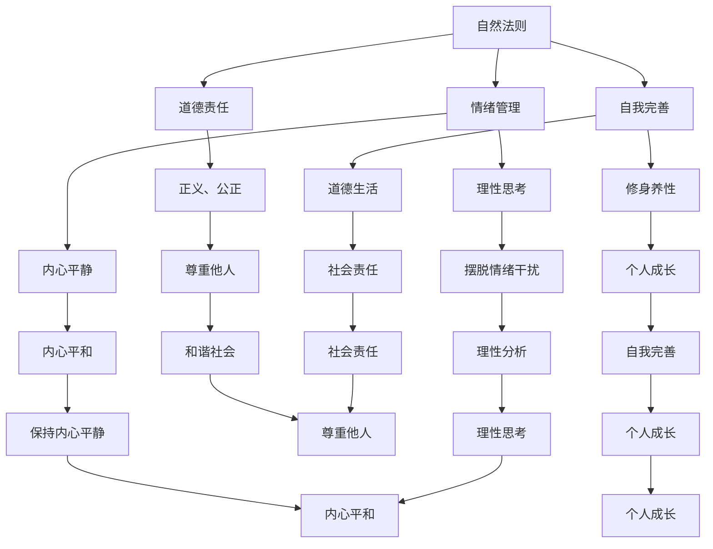

                 

### 文章标题

# 《现代斯多葛主义社群：古典智慧的现代实践平台》

## 关键词

- 斯多葛主义
- 古典智慧
- 社群实践
- 情绪管理
- 自我完善
- 道德生活

## 摘要

本文深入探讨了现代斯多葛主义社群的构建与实践，旨在将古典哲学智慧融入现代生活，为个体提供内心平和、自我完善的路径。通过分析斯多葛主义的历史背景、核心概念及其与现代社会的联系，本文揭示了其在情绪管理、自我完善与道德生活等方面的应用。此外，本文还详细介绍了如何建立和维护一个斯多葛主义社群，以及如何运用古典智慧在现代职场和个人生活中实现自我提升。本文旨在为读者提供一个全面、系统的实践平台，以实现个人成长和社会进步。

## 第一部分：斯多葛主义概述

### 第1章：斯多葛主义的历史背景与核心思想

#### 1.1 斯多葛主义的历史起源与发展

斯多葛主义起源于古希腊，由芝诺在公元前3世纪创立。作为古希腊三大哲学流派之一，斯多葛主义在罗马时期得到广泛传播，并成为罗马帝国的官方哲学。其主要代表人物包括塞涅卡、马可·奥勒留和爱比克泰德。

斯多葛主义在古希腊罗马时期的影响深远。它强调道德自律、理性思考和个人责任，主张个体通过自我完善达到内心的平和与幸福。这一哲学思想对罗马帝国的政治、法律和社会制度产生了深远的影响，成为西方文化传统的重要组成部分。

#### 1.2 斯多葛主义的核心哲学思想

1. **自然法则与道德责任**

   斯多葛主义认为，宇宙万物遵循自然法则，人类作为宇宙的一部分，也应该顺应自然。道德责任是人类顺应自然法则的重要表现。个体应该遵循正义、公正的原则，尊重他人，实现个人与社会的和谐。

2. **情绪管理与内心平静**

   斯多葛主义主张通过理性思考和自我控制来管理情绪。他们认为，情绪是人们对事物认知的反应，而非事物本身。通过理性分析，个体可以摆脱情绪的干扰，实现内心的平静。

3. **自我完善与道德生活**

   自我完善是斯多葛主义的核心目标。个体应该不断追求道德上的完美，通过修身养性，实现个人成长。道德生活是自我完善的重要途径，个体应该在日常生活中践行道德原则，为他人和社会做出贡献。

#### 1.3 斯多葛主义在现代社会的意义

在现代社会，斯多葛主义具有重要的现实意义。首先，它为个体提供了一种应对生活压力的方法，帮助人们保持内心的平静。其次，斯多葛主义强调道德责任和自我完善，有助于培养个体的社会责任感。最后，斯多葛主义为现代社会提供了一种全新的生活方式，有助于实现个人与社会的和谐发展。

### 第2章：斯多葛主义的核心概念与联系

#### 2.1 斯多葛主义的Mermaid流程图



#### 2.2 斯多葛主义与现代社会问题的关联

1. **情绪管理**

   现代社会充满压力和不确定性，情绪管理成为许多人面临的重要问题。斯多葛主义提供了一种理性看待情绪的方法，帮助个体在压力面前保持冷静，实现内心平静。

2. **道德责任**

   道德责任是现代社会的重要基石。斯多葛主义强调个体应遵循正义、公正的原则，尊重他人，实现个人与社会的和谐。这一理念对培养社会责任感具有积极意义。

3. **自我完善**

   自我完善是现代社会个体追求的重要目标。斯多葛主义为个体提供了一个系统的自我完善路径，包括修身养性、道德生活等方面，有助于实现个人成长。

## 第二部分：现代斯多葛主义实践

### 第3章：情绪管理与内心平静

情绪管理是斯多葛主义的核心内容之一，对于现代人在面对复杂多变的生活环境时尤为重要。本章将详细探讨情绪管理的原理、方法及其在现代生活中的应用。

#### 3.1 情绪的起源与作用

情绪是人类对环境刺激的心理反应，其起源可以追溯到人类进化的早期阶段。在原始社会，情绪帮助人类适应环境，提高生存能力。然而，在现代社会，情绪的作用变得复杂多样，有时甚至成为个体发展的障碍。

情绪的作用主要包括以下几个方面：

1. **调节行为**

   情绪能够调节个体的行为，使其适应不同的环境和情境。例如，焦虑情绪促使个体应对潜在的威胁，而愉悦情绪则有助于建立社交联系。

2. **影响认知**

   情绪能够影响个体的认知过程，如注意力、记忆和判断。积极情绪有助于提高个体的认知能力，而消极情绪则可能导致认知偏差。

3. **驱动动机**

   情绪是驱动个体行为的重要动机，能够激发个体的内在动力。例如，恐惧情绪可能促使个体采取行动以避免潜在的威胁。

#### 3.2 情绪管理的斯多葛方法

斯多葛主义提供了一套系统的情绪管理方法，旨在帮助个体摆脱情绪的干扰，实现内心的平静。以下是几种常见的斯多葛情绪管理方法：

1. **理性看待情绪**

   斯多葛主义认为，情绪并非客观事实，而是个体对事物的认知和评价。通过理性分析，个体可以认识到情绪的根源，从而避免被情绪所左右。

   ```python
   # 伪代码：理性看待情绪
   def rationalize_emotion(event):
       emotion = analyze_cognitive_response(event)
       if emotion == "anger":
           recognize_anger_as_cognitive_response(event)
       elif emotion == "fear":
           recognize_fear_as_cognitive_response(event)
       # 其他情绪的理性看待
   ```

2. **接受不可避免的现实**

   斯多葛主义强调，个体应该接受生活中的不可避免现实，而不是试图逃避或抗拒。这种态度有助于个体减少情绪波动，实现内心的平静。

   ```python
   # 伪代码：接受不可避免现实
   def accept_inevitable(event):
       reality = identify_inevitable_aspect(event)
       if reality == "loss":
           acknowledge_loss(event)
       elif reality == "suffering":
           endure_suffering(event)
       # 其他不可避免现实的接受
   ```

3. **保持内心的平和**

   保持内心的平和是斯多葛主义情绪管理的核心目标。个体应该学会在各种情绪面前保持冷静，不被情绪所左右。这需要个体通过实践不断修炼，提高自我控制能力。

   ```python
   # 伪代码：保持内心平和
   def maintain_inner_peace(event):
       emotion = analyze_emotional_response(event)
       if emotion == "joy":
           enjoy_joy_without_excessive_attachment(event)
       elif emotion == "sorrow":
           endure_sorrow_with_composure(event)
       # 其他情绪的内心平和维护
   ```

#### 3.3 情绪管理在现代生活中的应用

情绪管理在现代社会中具有重要意义。以下是一些情绪管理在现代生活中的具体应用：

1. **职场中的应用**

   在职场中，情绪管理有助于提高工作效率和团队合作。个体可以通过理性看待工作压力，接受工作现实，保持内心的平和，从而更好地应对职场挑战。

2. **家庭中的应用**

   家庭是情绪管理的重要场所。个体可以通过情绪管理，提高家庭关系的质量，增强家庭成员之间的相互理解和支持。

3. **社交中的应用**

   社交活动中，情绪管理有助于建立良好的人际关系。个体可以通过理性看待社交场合中的情绪波动，保持内心的平和，从而更好地与他人沟通和交流。

### 第4章：自我完善与道德生活

自我完善和道德生活是斯多葛主义实践的两个重要方面，对于个体的成长和社会的和谐发展具有重要意义。本章将详细探讨自我完善和道德生活的原理、方法及其在现代社会的实践。

#### 4.1 自我完善的斯多葛路径

自我完善是斯多葛主义的核心目标，个体通过不断修炼，实现道德上的完美。以下是斯多葛主义自我完善的几个关键步骤：

1. **认识自我**

   个体首先需要认识自己的内在本质，理解自己的欲望和动机。通过内省和自我观察，个体可以更好地了解自己的优点和缺点，从而为自我完善奠定基础。

   ```python
   # 伪代码：认识自我
   def self_recognition():
       strengths = identify_strengths()
       weaknesses = identify_weaknesses()
       return strengths, weaknesses
   ```

2. **培养良好习惯**

   良好习惯是自我完善的重要保障。个体应该培养积极的生活习惯，如早起、锻炼、阅读等，从而提高自身的综合素质。

   ```python
   # 伪代码：培养良好习惯
   def cultivate_good_habits():
       habits = ["early_rising", "exercise", "reading"]
       for habit in habits:
           practice_habit(habit)
   ```

3. **修身养性**

   修身养性是斯多葛主义自我完善的重要环节。个体应该通过冥想、反省和修炼，提高自我控制能力，实现内心的平和。

   ```python
   # 伪代码：修身养性
   def cultivate_zen():
       meditation = practice_meditation()
       reflection = engage_in_reflection()
       return meditation, reflection
   ```

4. **道德生活**

   道德生活是自我完善的重要体现。个体应该在日常生活中践行道德原则，如诚实、公正、宽容等，从而实现个人与社会的和谐。

   ```python
   # 伪代码：道德生活
   def lead_moral_life():
       honesty = practice_honesty()
       justice = practice_justice()
       compassion = practice_compassion()
       return honesty, justice, compassion
   ```

#### 4.2 道德生活的实践

道德生活是斯多葛主义实践的重要方面，个体应该在实际生活中践行道德原则，为他人和社会做出贡献。以下是几个道德生活实践的关键点：

1. **尊重他人**

   尊重他人是道德生活的基础。个体应该尊重他人的权利和尊严，关注他人的需求和感受。

   ```python
   # 伪代码：尊重他人
   def respect_others():
       rights = respect_rights()
       dignity = respect_dignity()
       needs = consider_needs()
       return rights, dignity, needs
   ```

2. **公正无私**

   公正无私是道德生活的核心。个体应该在处理事务时坚持公正原则，不偏袒任何一方，以实现公平和正义。

   ```python
   # 伪代码：公正无私
   def act_justly():
       fairness = promote_fairness()
       impartiality = maintain_impartiality()
       justice = pursue_justice()
       return fairness, impartiality, justice
   ```

3. **宽容大度**

   宽容大度是道德生活的重要品质。个体应该学会宽容他人的过失，理解和原谅他人。

   ```python
   # 伪代码：宽容大度
   def practice_compassion():
       forgiveness = forgive_offenses()
       tolerance = tolerate_differences()
       understanding = show_understanding()
       return forgiveness, tolerance, understanding
   ```

### 第5章：建立斯多葛主义社群

建立斯多葛主义社群是现代斯多葛主义实践的重要环节。通过社群，个体可以相互支持、共同成长，将古典哲学智慧融入现代生活。本章将详细探讨如何建立和管理斯多葛主义社群。

#### 5.1 斯多葛主义社群的优势

斯多葛主义社群具有以下优势：

1. **社交网络中的情感支持**

   社群为个体提供了一个情感支持的社交网络，成员之间可以相互倾诉、分享心得，共同应对生活中的困难和挑战。

2. **共同成长的动力**

   社群成员在共同追求内心平和和自我完善的过程中，可以相互激励、共同成长，形成积极的成长氛围。

3. **分享智慧的场所**

   社群为成员提供了一个分享智慧和经验的场所，通过讨论和交流，成员可以不断丰富自己的知识体系。

#### 5.2 创建和管理斯多葛主义社群

以下是创建和管理斯多葛主义社群的步骤：

1. **确定社群目标**

   社群目标应该明确，包括促进成员的内心平和、自我完善和道德生活等方面。目标应具有可操作性和可实现性。

2. **招募社群成员**

   社群成员应该具备共同的价值观和目标，通过宣传、邀请和推荐等方式，招募符合条件的成员。

3. **制定社群规则**

   社群规则应包括行为准则、讨论规范、活动安排等方面，以确保社群的有序运行。

4. **组织社群活动**

   社群活动应多样化，包括线上讨论、线下聚会、讲座、冥想等，以满足成员的不同需求和兴趣。

5. **维护社群氛围**

   社群管理者应关注成员的情绪和心理状态，营造积极、和谐的社群氛围，确保成员在社群中感到舒适和安心。

6. **促进成员互动**

   社群应鼓励成员之间的互动和交流，通过分享心得、提问解答、共同参与活动等方式，增强成员之间的联系和信任。

### 第6章：古典智慧在现代社会中的应用

古典智慧在现代社会的应用具有重要意义，尤其在职场和个人生活中。本章将探讨古典智慧在职场和个人生活中的具体应用，以及如何通过古典智慧实现自我提升。

#### 6.1 斯多葛主义在现代职场中的应用

斯多葛主义在职场中的应用主要体现在以下几个方面：

1. **情绪管理**

   职场中，情绪管理尤为重要。通过斯多葛主义的理性看待情绪和接受不可避免现实的方法，职场人士可以更好地应对工作压力和挑战，保持内心的平和。

   ```python
   # 伪代码：职场情绪管理
   def manage_emotions_in_work():
       stressful_event = identify_stressful_event()
       rationalize_stress(stressful_event)
       accept_inevitable_outcomes(stressful_event)
       maintain_composure(stressful_event)
   ```

2. **自我完善**

   职场人士应通过自我完善，不断提升自己的专业能力和素质。斯多葛主义的修身养性和道德生活理念有助于职场人士实现个人成长，为职场成功奠定基础。

   ```python
   # 伪代码：职场自我完善
   def self_improvement_in_work():
       professional_development = pursue_professional_development()
       cultivate_zen_in_work()
       practice_moral_values_in_work()
   ```

3. **团队合作**

   斯多葛主义强调个体与集体的和谐。在职场中，通过尊重他人、公正无私和宽容大度，职场人士可以建立良好的团队合作，提高工作效率和质量。

   ```python
   # 伪代码：职场团队合作
   def collaborate_effectively():
       respect_colleagues()
       act_justly_in_teamwork()
       show_compassion_in_work()
   ```

#### 6.2 斯多葛主义在个人生活中的应用

斯多葛主义在个人生活中的应用同样具有重要意义，有助于提升个人生活质量和幸福感。以下是一些具体应用：

1. **情绪管理**

   个人生活中，情绪管理同样至关重要。通过理性看待情绪和接受不可避免现实的方法，个人可以更好地应对生活中的挑战和困扰，保持内心的平和。

   ```python
   # 伪代码：个人情绪管理
   def manage_emotions_in_life():
       emotional_challenges = identify_emotional_challenges()
       rationalize_emotions(emotional_challenges)
       accept_inevitable_realities(emotional_challenges)
       maintain_inner_peace(emotional_challenges)
   ```

2. **时间管理**

   斯多葛主义强调合理安排时间，通过有效的时间管理，个人可以更好地平衡工作与生活，提高生活质量。

   ```python
   # 伪代码：个人时间管理
   def manage_time_in_life():
       prioritize_tasks()
       schedule_activities()
       avoid_procrastination()
   ```

3. **人际关系**

   在个人生活中，人际关系对幸福感具有重要影响。通过尊重他人、公正无私和宽容大度，个人可以建立和谐的人际关系，提高生活质量。

   ```python
   # 伪代码：人际关系管理
   def manage_relationships():
       respect_others()
       practice_justice()
       show_compassion()
   ```

### 第7章：构建个人实践平台

构建个人实践平台是实现自我提升的重要手段，本章将探讨如何构建个人实践平台，以及如何通过实践平台实现持续的自我成长。

#### 7.1 个人实践平台的重要性

个人实践平台具有以下重要性：

1. **自我反思与改进**

   通过个人实践平台，个人可以定期进行自我反思和评估，发现自己的优点和不足，从而有针对性地进行改进。

2. **实现个人目标**

   个人实践平台可以帮助个人明确目标，制定计划，通过持续的实践和努力，实现个人成长和目标。

3. **持续学习与成长**

   个人实践平台为个人提供了一个持续学习的环境，通过不断学习和实践，个人可以不断提升自己的能力和素质。

#### 7.2 实践平台的建设与维护

以下是构建和维护个人实践平台的步骤：

1. **明确目标与计划**

   个人首先需要明确自己的目标和计划，包括长期目标、短期目标和具体行动计划。目标应具体、可操作，以便于跟踪和评估。

2. **制定实践计划**

   个人应根据目标和计划，制定具体的实践计划，包括每天、每周、每月的任务和活动。实践计划应具有可执行性，以确保个人能够持之以恒。

3. **建立自我反思机制**

   个人实践平台应建立自我反思机制，定期对实践过程和结果进行反思和总结，发现问题和不足，及时调整和改进。

4. **持续学习和提升**

   个人应通过持续学习和实践，不断提升自己的能力和素质。可以通过阅读书籍、参加培训、与他人交流等方式，不断丰富自己的知识体系。

5. **维护和实践平台**

   个人应定期维护和实践平台，确保平台的正常运行。同时，应保持对平台的关注和投入，确保实践活动的持续进行。

### 第四部分：结论与展望

#### 第8章：现代斯多葛主义社群的未来

斯多葛主义社群在现代社会的应用具有重要意义，未来斯多葛主义社群的发展前景广阔。以下是对未来斯多葛主义社群的展望：

1. **全球化影响**

   随着全球化的深入，斯多葛主义社群有望在全球范围内传播和影响。通过互联网和社交媒体，斯多葛主义社群可以跨越地域和国界，实现全球范围内的交流和互动。

2. **新兴科技应用**

   新兴科技的兴起为斯多葛主义社群的发展提供了新的机遇。通过人工智能、虚拟现实等技术，斯多葛主义社群可以提供更加个性化、互动化的实践体验，提升社群成员的参与度和满意度。

3. **社会变革应对**

   面对社会变革和挑战，斯多葛主义社群可以发挥积极作用。通过提供情绪管理、自我完善等方面的指导和支持，斯多葛主义社群有助于个体和社会应对变革，实现和谐发展。

4. **创新实践空间**

   斯多葛主义社群在创新实践空间方面具有巨大潜力。通过探索新的实践形式和方法，斯多葛主义社群可以不断丰富和拓展实践内容，为个体和社会提供更多有益的指导和帮助。

### 作者信息

作者：AI天才研究院/AI Genius Institute & 禅与计算机程序设计艺术 /Zen And The Art of Computer Programming

