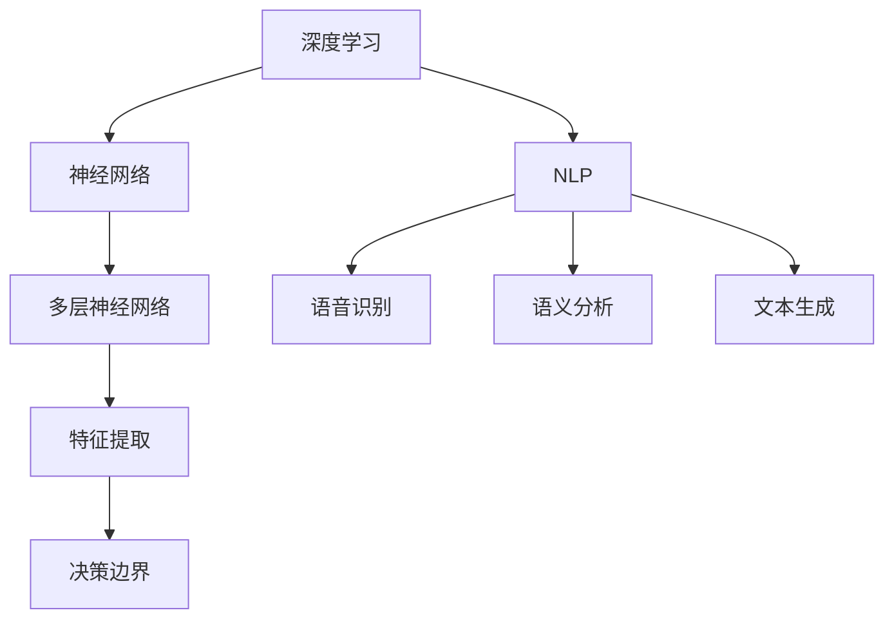

                 

### 深度学习与自然语言处理概述

**背景介绍**

随着信息时代的到来，人类产生和消费的数据量呈指数级增长，尤其是在文本数据方面，包括社交媒体、新闻报道、学术论文等。自然语言处理（NLP）作为人工智能领域的一个重要分支，旨在让计算机理解和处理人类语言，其应用场景涵盖了机器翻译、文本分类、情感分析、信息抽取、语音识别等多个领域。

深度学习作为一种强大的机器学习技术，近年来在NLP领域取得了显著的进展。它通过多层神经网络对数据进行处理，能够自动提取特征并构建复杂的决策边界，从而实现高度复杂的任务。在NLP中，深度学习模型能够更好地理解和生成人类语言，提高了各类任务的准确性和效率。

**核心概念与联系**

- **深度学习**：一种基于多层神经网络结构的机器学习方法，通过逐层抽象和转换数据，最终达到对数据的理解和预测。
- **自然语言处理**：涉及语音识别、语义分析、文本生成等多个方面，其核心目标是让计算机能够理解和处理人类语言。

**Mermaid 流程图**



**核心算法原理讲解**

深度学习模型的核心在于其多层神经网络结构，每一层都能够对输入数据进行变换，从而实现数据的逐层抽象和特征提取。以下是神经网络的基本原理和伪代码：

```python
# 神经网络伪代码
def neural_network(input_data):
    hidden_layer = activate_function(np.dot(input_data, weights))
    output = activate_function(np.dot(hidden_layer, weights_output))
    return output

# 激活函数伪代码
def activate_function(z):
    return 1 / (1 + np.exp(-z))
```

在NLP中，常用的深度学习模型包括循环神经网络（RNN）、长短期记忆网络（LSTM）和Transformer等。以下是这些模型的基本原理：

- **循环神经网络（RNN）**：通过递归的方式处理序列数据，能够捕捉时间序列中的长期依赖关系。

- **长短期记忆网络（LSTM）**：通过门控机制解决RNN的梯度消失问题，更好地处理长期依赖关系。

- **Transformer模型**：基于自注意力机制，能够并行处理序列数据，实现高效的文本生成和翻译。

**数学模型和数学公式**

- **神经网络中的激活函数**：
  $$
  a(x) = \frac{1}{1 + e^{-x}}
  $$

- **梯度消失和梯度爆炸**：在反向传播过程中，由于激活函数的饱和性，梯度可能会变得非常小（消失）或非常大（爆炸），导致网络难以训练。

**举例说明**

假设我们有一个简单的神经网络，用于对两个数字进行加法运算。输入层有一个节点，隐藏层有一个节点，输出层有一个节点。我们使用Sigmoid函数作为激活函数。

```python
# 神经网络示例
def neural_network(x1, x2):
    input_layer = [x1, x2]
    hidden_layer = activate_function(np.dot(input_layer, weights_input_to_hidden))
    output = activate_function(np.dot(hidden_layer, weights_hidden_to_output))
    return output

# 激活函数示例
def activate_function(z):
    return 1 / (1 + np.exp(-z))

# 初始化权重
weights_input_to_hidden = [0.1, 0.2]
weights_hidden_to_output = [0.3]

# 输入示例
x1 = 1
x2 = 1

# 计算输出
output = neural_network(x1, x2)
print(output) # 应该输出接近1的结果，因为1+1=2
```

通过上述示例，我们可以看到神经网络是如何通过权重和激活函数来对输入数据进行处理的。在实际应用中，网络会更加复杂，但基本原理是一致的。

### 深度学习基础

在本章节中，我们将深入探讨深度学习的基础概念、相关技术以及其在自然语言处理中的应用。首先，我们将介绍深度学习的基本概念，包括神经网络的结构和原理，以及如何通过多层神经网络进行数据的逐层抽象和特征提取。随后，我们将详细讲解几种常用的深度学习框架，如TensorFlow和PyTorch，并介绍如何使用这些框架进行深度学习模型的构建和训练。此外，我们将讨论深度学习模型在自然语言处理中的常见任务和应用，如文本分类、情感分析和机器翻译。最后，我们将探讨深度学习在自然语言处理中的挑战和未来发展趋势。

#### 1.1.1 神经网络入门

神经网络（Neural Networks）是深度学习的基础，它们模拟了人脑中神经元的连接和交互。一个简单的神经网络通常包括输入层、隐藏层和输出层。每个神经元（或节点）都与其他神经元相连接，并通过权重（weights）和偏置（bias）来传递信息。

**基本结构**

1. **输入层（Input Layer）**：接收外部输入，如文本、图像等。
2. **隐藏层（Hidden Layers）**：对输入数据进行特征提取和变换。
3. **输出层（Output Layer）**：产生最终输出，如分类结果、文本生成等。

**工作原理**

神经网络的工作原理基于前向传播和反向传播。在前向传播过程中，输入数据从输入层传递到隐藏层，然后逐层传递到输出层。每个神经元都会通过加权求和激活函数来计算输出。激活函数通常用于引入非线性，使模型能够处理复杂的数据。

**激活函数**

激活函数（Activation Function）是神经网络中一个关键的组成部分，它用于引入非线性，使模型能够学习复杂的数据分布。常见的激活函数包括：

- **Sigmoid函数**：
  $$
  \sigma(x) = \frac{1}{1 + e^{-x}}
  $$
  Sigmoid函数将输入映射到（0, 1）区间，常用于二分类问题。

- **ReLU函数**：
  $$
  \text{ReLU}(x) = \max(0, x)
  $$
  ReLU（Rectified Linear Unit）函数简单且计算效率高，有助于缓解梯度消失问题。

- **Tanh函数**：
  $$
  \text{Tanh}(x) = \frac{e^x - e^{-x}}{e^x + e^{-x}}
  $$
  Tanh函数将输入映射到（-1, 1）区间，类似于Sigmoid函数，但中心点在0处。

**多层神经网络**

多层神经网络（Multi-layer Neural Networks）通过增加隐藏层的数量，可以提取更高级的特征。每个隐藏层都会对前一层的数据进行变换和抽象，从而形成一种层次化的特征表示。

**权重和偏置**

在神经网络中，每个连接都带有权重（weights）和偏置（bias）。权重决定了连接的重要性，而偏置则引入了额外的自由度。通过不断调整这些参数，神经网络可以学习到数据中的复杂模式。

**反向传播算法**

反向传播（Backpropagation）是一种用于训练神经网络的优化算法。它通过计算损失函数关于参数的梯度，并使用梯度下降法来调整权重和偏置。具体步骤如下：

1. **前向传播**：将输入数据传递到网络，计算输出。
2. **计算损失**：使用损失函数计算预测值和真实值之间的差距。
3. **反向传播**：计算每个参数的梯度。
4. **更新参数**：根据梯度下降法更新权重和偏置。

**伪代码**

以下是多层神经网络的伪代码：

```python
# 初始化参数
weights_input_to_hidden = ...
weights_hidden_to_output = ...

# 定义激活函数
def activate_function(z):
    return 1 / (1 + np.exp(-z))

# 定义损失函数
def loss_function(output, true_value):
    return ...

# 定义反向传播
def backward_propagation(input_data, true_value):
    # 前向传播
    hidden_layer = activate_function(np.dot(input_data, weights_input_to_hidden))
    output = activate_function(np.dot(hidden_layer, weights_hidden_to_output))
    
    # 计算损失
    loss = loss_function(output, true_value)
    
    # 反向传播计算梯度
    hidden_layer_derivative = ...
    output_derivative = ...
    
    # 更新参数
    weights_input_to_hidden -= learning_rate * hidden_layer_derivative
    weights_hidden_to_output -= learning_rate * output_derivative

# 训练模型
for epoch in range(num_epochs):
    for input_data, true_value in data:
        backward_propagation(input_data, true_value)
```

通过上述伪代码，我们可以看到如何使用反向传播算法来训练一个简单的多层神经网络。在实际应用中，通常需要使用更复杂的网络结构和优化算法。

#### 1.1.2 深度学习框架介绍

深度学习框架是用于实现和训练深度学习模型的软件库。它们提供了高效的数学运算和灵活的模型定义接口，使研究人员和开发者能够轻松构建和优化复杂的深度学习模型。以下是几种常用的深度学习框架：

1. **TensorFlow**：由Google开发，是一个开源的深度学习框架，支持多种编程语言（如Python、C++和Java）。TensorFlow提供了丰富的API，包括高层次的Keras接口，使得构建和训练模型变得非常简便。

2. **PyTorch**：由Facebook的人工智能研究团队开发，是一个开源的深度学习框架，以其动态计算图和灵活的模型定义能力而闻名。PyTorch的动态特性使其在研究阶段特别受欢迎，但也在生产环境中得到了广泛应用。

3. **MXNet**：由Apache Software Foundation维护，是一个开源的深度学习框架，支持多种编程语言（如Python、R和Java）。MXNet具有高性能和灵活的模型定义能力，适用于大规模生产环境。

4. **Theano**：由蒙特利尔大学开发，是一个开源的深度学习框架，主要使用Python编写，但也可以通过其C++接口进行高性能计算。Theano提供了一个强大的符号数学库，用于构建和训练深度学习模型。

5. **Caffe**：由伯克利大学开发，是一个开源的深度学习框架，主要用于图像分类和识别。Caffe以其高效性和易于使用而受到研究人员的青睐。

6. **CNTK**：由Microsoft开发，是一个开源的深度学习框架，支持多种编程语言（如Python、C++和C#）。CNTK以其强大的计算能力和灵活的模型定义而著称。

**选择合适的框架**

选择深度学习框架时，需要考虑以下几个因素：

- **应用场景**：不同的框架在处理不同类型的数据和应用时具有不同的优势。例如，PyTorch在研究阶段非常流行，而TensorFlow在生产环境中更为常见。
- **性能要求**：一些框架在设计时更注重性能，适用于大规模的生产环境。例如，MXNet和TensorFlow都有针对高性能计算的特殊优化。
- **社区支持**：一个活跃的社区可以提供丰富的文档、教程和问题解答，有助于解决开发中的难题。
- **易用性**：一些框架提供了高级API，使得模型构建和训练更加简便。例如，Keras是TensorFlow和Theano的高级API，提供了非常简洁的接口。

**示例：使用TensorFlow构建一个简单的神经网络**

以下是一个使用TensorFlow构建的简单神经网络，用于对数字进行加法运算：

```python
import tensorflow as tf

# 定义模型参数
weights_input_to_hidden = tf.Variable(tf.random.normal([2, 1]))
weights_hidden_to_output = tf.Variable(tf.random.normal([1, 1]))

# 定义激活函数
def activate_function(z):
    return tf.sigmoid(z)

# 定义损失函数
def loss_function(output, true_value):
    return tf.reduce_mean(tf.square(output - true_value))

# 定义反向传播
def backward_propagation(input_data, true_value):
    # 前向传播
    hidden_layer = activate_function(tf.matmul(input_data, weights_input_to_hidden))
    output = activate_function(tf.matmul(hidden_layer, weights_hidden_to_output))
    
    # 计算损失
    loss = loss_function(output, true_value)
    
    # 反向传播计算梯度
    hidden_layer_derivative = tf.gradients(loss, weights_input_to_hidden)[0]
    output_derivative = tf.gradients(loss, weights_hidden_to_output)[0]
    
    # 更新参数
    weights_input_to_hidden.assign_sub(learning_rate * hidden_layer_derivative)
    weights_hidden_to_output.assign_sub(learning_rate * output_derivative)

# 初始化参数
learning_rate = 0.01

# 训练模型
for epoch in range(num_epochs):
    for input_data, true_value in data:
        backward_propagation(input_data, true_value)
```

通过上述示例，我们可以看到如何使用TensorFlow构建一个简单的神经网络，并进行训练。类似的方法可以应用于更复杂的模型和任务。

### 自然语言处理基础

自然语言处理（NLP）是计算机科学和人工智能领域的一个分支，旨在使计算机能够理解和生成人类语言。NLP的应用范围广泛，包括机器翻译、文本分类、情感分析、信息抽取、问答系统等。在这一节中，我们将介绍NLP的基础概念，包括语言模型和词嵌入技术，以及它们在NLP中的应用。

#### 1.2.1 语言模型

语言模型（Language Model）是NLP的核心概念之一，它用于预测一个单词序列的概率。在深度学习时代，语言模型通常通过统计方法或神经网络模型来构建。

**基本概念**

- **单词序列的概率**：语言模型的核心任务是计算一个单词序列的概率，例如，给定一个单词序列`<s> the cat sat on the mat </s>`，语言模型需要计算该序列的概率。
- **n-gram模型**：最简单的语言模型是基于n-gram模型，它通过统计连续n个单词的频率来计算概率。例如，在bigram模型中，每个单词的概率取决于前一个单词。

**n-gram模型公式**：

$$
P(w_n | w_{n-1}, ..., w_1) = \frac{count(w_{n-1}, w_n)}{count(w_{n-1})}
$$

其中，`count(w_{n-1}, w_n)`表示单词`w_n`在单词`w_{n-1}`之后出现的次数，`count(w_{n-1})`表示单词`w_{n-1}`出现的总次数。

**改进方法**

尽管n-gram模型简单有效，但它存在一些局限性，例如无法捕捉长距离依赖关系。为了克服这些局限性，研究人员提出了一系列改进方法，包括：

- **隐马尔可夫模型（HMM）**：通过引入状态转移概率，HMM能够捕捉单词序列中的隐含状态，从而提高模型性能。
- **神经网络语言模型（NNLM）**：使用神经网络来建模单词序列的概率，可以更好地捕捉复杂的依赖关系。

**神经网络语言模型（NNLM）**：

神经网络语言模型通过多层神经网络来预测单词序列的概率。以下是一个简单的NNLM模型：

```python
# NNLM模型伪代码
def neural_network_language_model(word_sequence):
    # 初始化隐藏层状态
    hidden_state = ...
    
    # 遍历单词序列，逐个计算概率
    for word in word_sequence:
        # 计算当前单词的概率
        probability = activate_function(np.dot(hidden_state, weights))
        
        # 更新隐藏层状态
        hidden_state = activate_function(np.dot(hidden_state, weights_output))
        
    return probability
```

**应用**

语言模型在NLP中有广泛的应用，包括：

- **自动纠错**：通过预测输入文本的正确单词序列，自动纠正拼写错误和语法错误。
- **文本生成**：用于生成文本，例如自动写作、诗歌创作等。
- **机器翻译**：在机器翻译过程中，语言模型用于预测目标语言的单词序列。

#### 1.2.2 词嵌入

词嵌入（Word Embedding）是将单词映射到高维向量空间的一种方法，使得单词之间的相似性和相关性可以通过向量空间中的距离和角度来表示。词嵌入技术在NLP中起到了至关重要的作用，可以显著提高模型的表现。

**基本概念**

- **向量空间模型**：在词嵌入中，每个单词被映射到一个高维向量。这些向量可以在数学上进行运算，从而实现单词之间的相似性计算。
- **嵌入维度**：嵌入维度是词嵌入模型中的一个重要参数，它决定了向量空间的大小。通常，嵌入维度在几十到几万之间。

**常见方法**

- **基于统计的方法**：例如Word2Vec和GloVe，通过统计单词在语料库中的共现关系来生成词向量。
- **基于神经网络的模型**：例如词嵌入层（Embedding Layer）在神经网络中的使用，通过神经网络来学习单词的向量表示。

**Word2Vec**

Word2Vec是一种基于神经网络的词嵌入方法，它通过优化一个损失函数来学习单词的向量表示。Word2Vec主要有两种模型：连续词袋（CBOW）和跳字模型（Skip-gram）。

- **连续词袋（CBOW）**：给定一个目标单词，CBOW通过预测目标单词周围的多个单词来学习向量表示。
- **跳字模型（Skip-gram）**：与CBOW相反，Skip-gram通过预测目标单词来学习向量表示。

**CBOW模型公式**：

$$
P(w | c) = \frac{e^{<c, v_w>}}{\sum_{w' \in V} e^{<c, v_{w'}>}}
$$

其中，`v_w`和`v_c`分别表示目标单词和上下文单词的向量表示，`<c, v>`表示向量内积。

**GloVe**

GloVe（Global Vectors for Word Representation）是一种基于全局共现信息的词嵌入方法。GloVe通过优化一个全局损失函数来学习单词的向量表示，从而在捕捉单词局部信息的同时，还能保持全局一致性。

**GloVe损失函数**：

$$
\ell(w, v_w, v_{w'}) = \max(0, log(P_{glo

